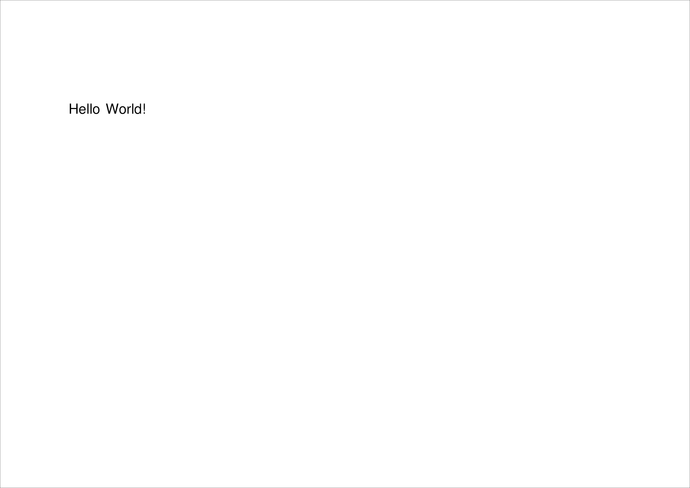

# 1. Hello World Example with borb


In this example, we'll walk through creating a simple "Hello World" PDF using the [borb](https://github.com/jorisschellekens/borb) library. Each line of the code will be explained in detail, so you can understand the underlying concepts.

## 2.1 The Code

```python
# snippet_01_01.ipynb
from borb.pdf import Document, Page, PageLayout, Paragraph, PDF, SingleColumnLayout

# Create an empty Document
d: Document = Document()

# Create an empty Page
p: Page = Page()
d.append_page(p)

# Create a PageLayout
l: PageLayout = SingleColumnLayout(p)

# Add a Paragraph
l.append_layout_element(Paragraph("Hello World!"))

# Write the PDF
PDF.write(what=d, where_to="output.pdf")

```

<a href="https://colab.research.google.com/github/jorisschellekens/borb-examples/blob/master/01/ipynb/snippet_01_01.ipynb" target="_parent"></a>

This example generates the following PDF. To save space, only the top half of the first page is shown, while the rest is not displayed.



## 2.2 Notes

- All examples in this series will be **standalone**, meaning you can copy and run each example independently.
- You will need to have **borb installed**. You can do this using `pip install borb`.
- All examples are written in **typed Python**, following Python's type hinting conventions.

<div style="page-break-before: always;"></div>

## 2.3 Explanation

### **2.3.1 Importing Required Libraries**
```python
from borb.pdf import Document, Page, PageLayout, Paragraph, PDF, SingleColumnLayout
```

- **`borb.pdf`**: Contains the core classes and functions for creating and manipulating PDFs. The specific imports are:
  - **`Document`**: Represents a PDF document.
  - **`Page`**: Represents an individual page in a PDF.
  - **`PageLayout`**: An abstract class that defines how content is arranged on a page.
  - **`SingleColumnLayout`**: A concrete implementation of `PageLayout` that arranges content in a single column.
  - **`Paragraph`**: A basic building block for adding text to a PDF.
  - **`PDF`**: Provides functionality to write a `Document` to a file.

### **2.3.2 Creating an Empty Document**
```python
# Create an empty Document
d: Document = Document()
```

- **`Document()`**: Initializes a new, empty PDF document. This is the container for all the pages and content you'll add.
- **`d`**: The variable holding the `Document` object.

### **2.3.3 Creating and Adding a Page**
```python
# Create an empty Page
p: Page = Page()
d.append_page(p)
```

- **`Page()`**: Creates a new, blank page. Pages are the fundamental units of a PDF.
- **`d.append_page(p)`**: Adds the newly created page (`p`) to the `Document` (`d`). This step is necessary to include the page in the final output.

### **2.3.4 Setting up the Page Layout**
```python
# Create a PageLayout
l: PageLayout = SingleColumnLayout(p)
```

- **`SingleColumnLayout(p)`**: Specifies that content on the page (`p`) will be arranged in a single column. This layout simplifies placing text and other elements in an organized manner.
- **`l`**: The variable holding the `PageLayout` object.

### **2.3.5 Adding Content**
```python
# Add a Paragraph
l.append_layout_element(Paragraph('Hello World!'))
```

- **`Paragraph('Hello World!')`**: Creates a text block with the content "Hello World!". The `Paragraph` class provides basic text formatting and layout capabilities.
- **`l.append_layout_element(...)`**: Adds the `Paragraph` to the `PageLayout`. The layout handles positioning the text on the page.

### **2.3.6 Writing the PDF**
```python
# Write the PDF
PDF.write(what=d, where_to="output.pdf")
```

- **`PDF.write(what=d, where_to="assets/output.pdf")`**:
  - **`what=d`**: Specifies the `Document` (`d`) to be written.
  - **`where_to="assets/output.pdf"`**: Specifies the file path where the PDF will be saved. Ensure the `assets` directory exists before running this script, or adjust the path as needed.

## 2.4 Result
After running this script, you will find a PDF named `output.pdf` in the `assets` directory. When you open it, it will contain a single page with the text "Hello World!".

## 2.5 Key Takeaways

- A **`Document`** is the container for all content in a PDF.
- A **`Page`** represents an individual page.
- A **`PageLayout`** organizes content on a page.
- A **`Paragraph`** is a simple way to add text.
- The **`PDF.write`** function saves the document to a file.

This example forms the foundation for creating more complex PDFs with borb. From here, you can start adding shapes, images, and other layout elements!

<div style="page-break-before: always;"></div>
