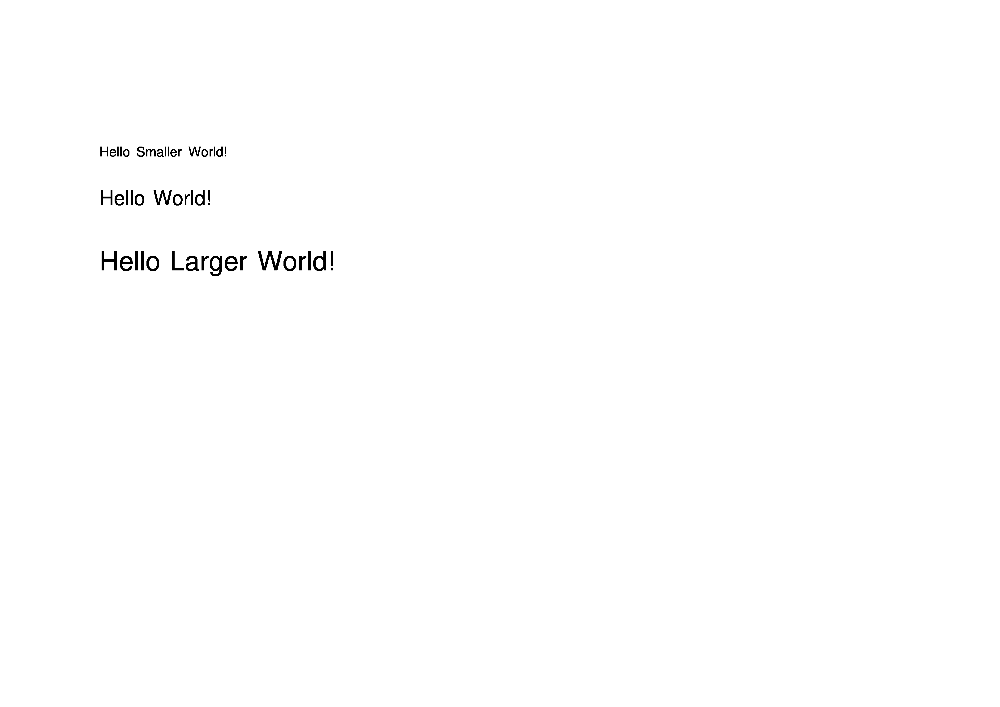

# 2. Using text in `borb` 📝


## 2.1 Fonts

In the previous example we used the default arguments for `Paragraph`, which includes using the default `Font` `Helvetica`.

In this section you'll learn how to change that:
- by using another standard 14 font
- by loading a `Font` from a `.ttf` file
- by using the Google Fonts API

### 2.1.1 Using another standard 14 font

```python
# snippet_02_01.ipynb
from borb.pdf import (
    Document,
    Page,
    PageLayout,
    Paragraph,
    PDF,
    SingleColumnLayout,
)

# Create an empty Document
d: Document = Document()

# Create an empty Page
p: Page = Page()
d.append_page(p)

# Create a PageLayout
l: PageLayout = SingleColumnLayout(p)

# Add a Paragraph
l.append_layout_element(Paragraph("Hello World!", font="Courier"))

# Write the PDF
PDF.write(what=d, where_to="output.pdf")

```

<a href="https://colab.research.google.com/github/jorisschellekens/borb-examples/blob/master/02/ipynb/snippet_02_01.ipynb" target="_parent"></a>


This example demonstrates how to use one of the Standard 14 Fonts in borb. Standard 14 Fonts are a set of built-in fonts available in the PDF specification, such as `Courier`, `Helvetica`, and `Times`. This code snippet shows how to apply the `Courier` font to a `Paragraph` and generate a simple PDF document:

- A `Document` is created and a `Page` is appended to it.  
- A `PageLayout` is applied to define how content is structured on the page.  
- A `Paragraph` containing the text "Hello World!" is added, with the font explicitly set to `Courier` using `Standard14Fonts.get()`.  
- Finally, the PDF is written to the file path `output.pdf`.

This method provides an efficient way to incorporate basic, standardized fonts into your PDF documents.

---

### 2.1.2 Loading a `Font` from a `.ttf` file

```python
# snippet_02_02.ipynb
from borb.pdf import (
    Document,
    Font,
    Page,
    PageLayout,
    Paragraph,
    PDF,
    SingleColumnLayout,
    TrueTypeFont,
)

# Create an empty Document
d: Document = Document()

# Create an empty Page
p: Page = Page()
d.append_page(p)

# Create a PageLayout
l: PageLayout = SingleColumnLayout(p)

# Download a Font
import requests

open("Lobster-Regular.ttf", "wb").write(
    requests.get(
        "https://github.com/google/fonts/raw/refs/heads/main/ofl/lobster/Lobster-Regular.ttf"
    ).content
)


# Create a TrueTypeFont
font: Font = TrueTypeFont.from_file("Lobster-Regular.ttf")

# Add a Paragraph
l.append_layout_element(Paragraph("Hello World!", font=font))

# Write the PDF
PDF.write(what=d, where_to="output.pdf")

```

<a href="https://colab.research.google.com/github/jorisschellekens/birb-examples/blob/main/02/ipynb/snippet_02_02.ipynb" target="_parent"></a>


This example demonstrates how to load and use a custom font from a `.ttf` file in borb. This allows you to use fonts not included in the standard set, providing greater flexibility in styling your PDF documents. In this example, the font "Lobster-Regular" is downloaded from the Google Fonts repository and applied to a `Paragraph` in the document:

1. **Document and Page Creation**:  
   A `Document` is created, and a `Page` is appended to it. A `PageLayout` is applied to define how content is organized on the page.

2. **Downloading the Font**:  
   The script uses the `requests` library to download the "Lobster-Regular.ttf" file from Google Fonts and save it locally.

3. **Loading the Font**:  
   The `.ttf` file is loaded using the `TrueTypeFont.from_file()` method, creating a `Font` object that can be applied to content in the PDF.

4. **Adding a Paragraph**:  
   A `Paragraph` containing the text "Hello World!" is created and styled with the downloaded font.

5. **Saving the PDF**:  
   The document is written to the file path `output.pdf`.

This approach enables you to use any `.ttf` font in your PDF documents, ensuring a unique and customizable design.

---

### 2.1.3 Using the Google Fonts API

```python
# snippet_02_03.ipynb
from borb.pdf import (
    Document,
    Font,
    GoogleTrueTypeFont,
    Page,
    PageLayout,
    Paragraph,
    PDF,
    SingleColumnLayout,
)
import os

# Create an empty Document
d: Document = Document()

# Create an empty Page
p: Page = Page()
d.append_page(p)

# Create a PageLayout
l: PageLayout = SingleColumnLayout(p)

# Create a Font
os.environ["GOOGLE_FONTS_API_KEY"] = "<your-google-font-api-key>"
font: Font = GoogleTrueTypeFont.from_google_font_api(name="Acme")

# Add a Paragraph
l.append_layout_element(Paragraph("Hello World!", font=font))

# Write the PDF
PDF.write(what=d, where_to="output.pdf")

```

<a href="https://colab.research.google.com/github/jorisschellekens/birb-examples/blob/main/02/ipynb/snippet_02_03.ipynb" target="_parent"></a>


This example demonstrates how to use the Google Fonts API to dynamically retrieve and apply a font to text in a PDF using borb. Here's how the code works:

1. **Document and Page Creation**:  
   A `Document` is created, and a `Page` is appended to it. A `PageLayout` is applied to define how content is organized on the page.

2. **Setting the Google Fonts API Key**:  
   The Google Fonts API requires an API key for authentication. The `os.environ` variable is used to set the `GOOGLE_FONTS_API_KEY` environment variable with your API key. Replace `<your-google-fonts-api-key>` with your actual API key.

3. **Retrieving a Font**:  
   The `GoogleTrueTypeFont.from_google_font_api()` method is used to fetch the "Acme" font from the Google Fonts API and create a `Font` object that can be applied to content in the PDF.

4. **Adding a Paragraph**:  
   A `Paragraph` containing the text "Hello World!" is created, and the `font` parameter is used to apply the font retrieved from the Google Fonts API.

5. **Saving the PDF**:  
   The `PDF.write()` method writes the document to the specified path (`output.pdf`).

This approach enables seamless integration of Google Fonts into your PDF documents, providing access to a vast library of fonts for enhanced design and typography. Ensure that your [Google Fonts API key](https://developers.google.com/fonts/docs/developer_api#identifying_your_application_to_google) is set up correctly to enable this functionality.

---
<div style="page-break-before: always;"></div>

## 2.2 Setting the `font_color`

This section demonstrates how to customize text color in borb by utilizing various color systems. borb supports a wide range of color models, enabling you to achieve precise and visually appealing designs for your PDF content.

Each subsection explains how to define and apply a specific type of color to text using borb's `font_color` parameter. Whether you prefer predefined colors, hexadecimal values, or advanced color models like CMYK or HSV, borb provides the tools you need to tailor text color to your exact requirements.

### Subsections:
- **[Using `X11Color`](#using-x11color)**: Learn how to use a comprehensive set of predefined colors from the X11 standard.
- **[Using `PantoneColor`](#using-pantonecolor)**: Explore how to apply Pantone colors for professional, industry-standard color matching.
- **[Using `FarrowAndBallColor`](#using-farrowandballcolor)**: Discover how to work with Farrow & Ball colors for unique, interior design-inspired palettes.
- **[Using `HexColor`](#using-hexcolor)**: Understand how to define colors using standard hexadecimal values, often used in web design.
- **[Using `RGBColor`](#using-rgbcolor)**: Utilize the RGB model to define colors based on red, green, and blue values.
- **[Using `CMYKColor`](#using-cmykcolor)**: Apply the CMYK model, commonly used in printing, to define text color.
- **[Using `HSVColor`](#using-hsvcolor)**: Experiment with colors based on the Hue, Saturation, and Value (HSV) model for advanced customization.

By the end of this chapter, you will be equipped with the knowledge to style text with a wide array of colors using borb, helping you create PDFs that are both professional and visually engaging.


### 2.2.1 Using `X11Color`

```python
# snippet_02_04.ipynb
from borb.pdf import (
    Document,
    Page,
    PageLayout,
    Paragraph,
    PDF,
    SingleColumnLayout,
    X11Color,
)

# Create an empty Document
d: Document = Document()

# Create an empty Page
p: Page = Page()
d.append_page(p)

# Create a PageLayout
l: PageLayout = SingleColumnLayout(p)

# Add a Paragraph
l.append_layout_element(Paragraph("Hello World!", font_color=X11Color.YELLOW_MUNSELL))

# Write the PDF
PDF.write(what=d, where_to="output.pdf")

```

<a href="https://colab.research.google.com/github/jorisschellekens/birb-examples/blob/main/02/ipynb/snippet_02_04.ipynb" target="_parent"></a>


`X11Color` is a borb class providing predefined colors based on the X11 color system, offering over 500 standardized color definitions for PDF elements.

Some examples of X11 colors:
- `X11Color.RED`
- `X11Color.BLUE`
- `X11Color.GREEN`
- `X11Color.HONEYDEW`

1. Import X11Color from borb.pdf
2. Use X11Color as a parameter in supported elements
3. Reference colors using dot notation (e.g., `X11Color.RED`)

---

### 2.2.2 Using `PantoneColor`

```python
# snippet_02_05.ipynb
from borb.pdf import (
    Document,
    Page,
    PageLayout,
    PantoneColor,
    Paragraph,
    PDF,
    SingleColumnLayout,
)

# Create an empty Document
d: Document = Document()

# Create an empty Page
p: Page = Page()
d.append_page(p)

# Create a PageLayout
l: PageLayout = SingleColumnLayout(p)

# Add a Paragraph
l.append_layout_element(
    Paragraph("Hello World!", font_color=PantoneColor.CANARY_YELLOW)
)

# Write the PDF
PDF.write(what=d, where_to="output.pdf")

```

<a href="https://colab.research.google.com/github/jorisschellekens/birb-examples/blob/main/02/ipynb/snippet_02_05.ipynb" target="_parent"></a>


Pantone is a standardized color matching system widely used in various industries, including printing, fashion, and design. It provides a unique code for each color, ensuring consistency and accuracy in color reproduction across different materials and platforms. Using Pantone colors in borb allows for precise color matching in PDF documents, which is essential for branding and design consistency. Pantone colors are recognized globally, making them ideal for projects that require exact color specifications.

To use Pantone colors in borb, you need to import the `PantoneColor` class from `borb.pdf`. You can then specify Pantone colors for various PDF elements, such as text, by using the `PantoneColor` enum.

Some examples of Pantone colors:
- `PantoneColor.CANARY_YELLOW`: A bright, cheerful yellow.
- `PantoneColor.BRIGHT_ROSE`: A vivid, attention-grabbing pink.
- `PantoneColor.VICTORIA_BLUE`: A deep, striking blue.
- `PantoneColor.LIVING_CORAL`: A warm, lively coral.

---

### 2.2.3 Using `FarrowAndBallColor`

```python
# snippet_02_06.ipynb
from borb.pdf import (
    Document,
    FarrowAndBallColor,
    Page,
    PageLayout,
    Paragraph,
    PDF,
    SingleColumnLayout,
)

# Create an empty Document
d: Document = Document()

# Create an empty Page
p: Page = Page()
d.append_page(p)

# Create a PageLayout
l: PageLayout = SingleColumnLayout(p)

# Add a Paragraph
l.append_layout_element(
    Paragraph("Hello World!", font_color=FarrowAndBallColor.DAYROOM_YELLOW)
)

# Write the PDF
PDF.write(what=d, where_to="output.pdf")

```

<a href="https://colab.research.google.com/github/jorisschellekens/birb-examples/blob/main/02/ipynb/snippet_02_06.ipynb" target="_parent"></a>


`Farrow & Ball` is a renowned British manufacturer known for its high-quality paints and wallpapers. The brand offers a curated palette of colors that are popular in interior design for their depth, richness, and historical inspiration. Incorporating `Farrow & Ball` colors into your PDF documents can add a touch of elegance and sophistication. These colors are ideal for projects that require a classic or refined aesthetic, making them suitable for design-focused documents. To use Farrow & Ball colors in borb, import the `FarrowAndBallColor` class from `borb.pdf`. You can then apply these colors to PDF elements, such as text, using the `FarrowAndBallColor` enum.

Some examples:
- `FarrowAndBallColor.DAYROOM_YELLOW`: A soft, inviting yellow.
- `FarrowAndBallColor.HAGUE_BLUE`: A deep, dramatic blue.
- `FarrowAndBallColor.CASTLE_GRAY`: A versatile gray-green.
- `FarrowAndBallColor.CALKE_GREEN`: A rich, traditional green.

---

### 2.2.4 Using `HexColor`

```python
# snippet_02_07.ipynb
from borb.pdf import (
    Document,
    HexColor,
    Page,
    PageLayout,
    Paragraph,
    PDF,
    SingleColumnLayout,
)

# Create an empty Document
d: Document = Document()

# Create an empty Page
p: Page = Page()
d.append_page(p)

# Create a PageLayout
l: PageLayout = SingleColumnLayout(p)

# Add a Paragraph
l.append_layout_element(Paragraph("Hello World!", font_color=HexColor("#F1CD2E")))

# Write the PDF
PDF.write(what=d, where_to="output.pdf")

```

<a href="https://colab.research.google.com/github/jorisschellekens/birb-examples/blob/main/02/ipynb/snippet_02_07.ipynb" target="_parent"></a>


`HexColor` allows you to specify colors using hexadecimal color codes, a common format in web design and digital graphics. This format provides a flexible way to define custom colors by specifying the intensity of red, green, and blue components. Using `HexColor` in borb offers the flexibility to use any color you can define with a hex code. This is particularly useful for matching specific brand colors or creating custom color schemes that are not available in predefined color sets. To use `HexColor` in borb, import the `HexColor` class from `borb.pdf`. You can then apply any hex color code to PDF elements, such as text, by passing the hex code as a string.

Examples of Hex Colors:
- `#F1CD2E`: A bright, sunny yellow.
- `#FF5733`: A vibrant, energetic orange.
- `#3498DB`: A cool, calming blue.
- `#2ECC71`: A fresh, lively green.

---

### 2.2.5 Using `RGBCOLOR`


```python
# snippet_02_08.ipynb
from borb.pdf import (
    Document,
    Page,
    PageLayout,
    Paragraph,
    PDF,
    RGBColor,
    SingleColumnLayout,
)

# Create an empty Document
d: Document = Document()

# Create an empty Page
p: Page = Page()
d.append_page(p)

# Create a PageLayout
l: PageLayout = SingleColumnLayout(p)

# Add a Paragraph
l.append_layout_element(
    Paragraph("Hello World!", font_color=RGBColor(red=241, green=205, blue=46))
)

# Write the PDF
PDF.write(what=d, where_to="output.pdf")

```

<a href="https://colab.research.google.com/github/jorisschellekens/birb-examples/blob/main/02/ipynb/snippet_02_08.ipynb" target="_parent"></a>


`RGBColor` allows you to define colors using the RGB color model, which specifies colors based on their red, green, and blue components. This model is widely used in digital graphics and provides a straightforward way to create a broad spectrum of colors. Using `RGBColor` in borb offers precise control over color creation, enabling you to match specific colors by adjusting the intensity of red, green, and blue. This is ideal for custom color schemes and ensuring consistency with digital media. To use `RGBColor` in borb, import the `RGBColor` class from `borb.pdf`. You can then specify colors by providing values for the red, green, and blue components, each ranging from 0 to 255.

Examples of RGB Colors:
- `RGBColor(red=241, green=205, blue=46)`: A bright, sunny yellow.
- `RGBColor(red=255, green=87, blue=51)`: A vibrant, energetic orange.
- `RGBColor(red=52, green=152, blue=219)`: A cool, calming blue.
- `RGBColor(red=46, green=204, blue=113)`: A fresh, lively green.

---

### 2.2.6 Using `CMYKColor`

```python
# snippet_02_09.ipynb
from borb.pdf import (
    CMYKColor,
    Document,
    Page,
    PageLayout,
    Paragraph,
    PDF,
    SingleColumnLayout,
)

# Create an empty Document
d: Document = Document()

# Create an empty Page
p: Page = Page()
d.append_page(p)

# Create a PageLayout
l: PageLayout = SingleColumnLayout(p)

# Add a Paragraph
l.append_layout_element(
    Paragraph(
        "Hello World!",
        font_color=CMYKColor(cyan=0, magenta=0.15, yellow=0.81, key=0.05),
    )
)

# Write the PDF
PDF.write(what=d, where_to="output.pdf")

```

<a href="https://colab.research.google.com/github/jorisschellekens/birb-examples/blob/main/02/ipynb/snippet_02_09.ipynb" target="_parent"></a>


`CMYKColor` is a color model used in color printing, which stands for Cyan, Magenta, Yellow, and Key (black). This model is essential for accurately reproducing colors in print media, as it reflects the way inks combine to produce various hues. Using `CMYKColor` in borb is ideal for documents intended for print, as it allows you to specify colors in a way that closely matches the printing process. This ensures that the colors in your PDF will look as expected when printed. To use CMYKColor in borb, import the `CMYKColor` class from `borb.pdf`. You can then define colors by specifying the cyan, magenta, yellow, and key (black) components, each ranging from 0 to 1.

Examples of CMYK Colors:
- `CMYKColor(cyan=0, magenta=0.15, yellow=0.81, key=0.05)`: A bright, sunny yellow.
- `CMYKColor(cyan=0, magenta=0.66, yellow=0.8, key=0)`: A vibrant, energetic orange.
- `CMYKColor(cyan=0.76, magenta=0.34, yellow=0, key=0.14)`: A cool, calming blue.
- `CMYKColor(cyan=0.85, magenta=0, yellow=0.56, key=0.3)`: A fresh, lively green.

---

### 2.2.7 Using `HSVColor`

```python
# snippet_02_10.ipynb
from borb.pdf import (
    Document,
    HSVColor,
    Page,
    PageLayout,
    Paragraph,
    PDF,
    SingleColumnLayout,
)

# Create an empty Document
d: Document = Document()

# Create an empty Page
p: Page = Page()
d.append_page(p)

# Create a PageLayout
l: PageLayout = SingleColumnLayout(p)

# Add a Paragraph
l.append_layout_element(
    Paragraph(
        "Hello World!", font_color=HSVColor(hue=49, saturation=0.81, value=0.95)
    )
)

# Write the PDF
PDF.write(what=d, where_to="output.pdf")

```

<a href="https://colab.research.google.com/github/jorisschellekens/birb-examples/blob/main/02/ipynb/snippet_02_10.ipynb" target="_parent"></a>


`HSVColor` is a color model that represents colors using three components: Hue, Saturation, and Value (brightness). This model is often used in graphics applications because it aligns more closely with human perception of colors, making it intuitive for selecting and adjusting colors. Using `HSVColor` in borb allows for intuitive color adjustments, particularly when you want to modify the brightness or saturation of a color without affecting its hue. This can be useful for creating visually appealing designs and ensuring color harmony in your documents. To use `HSVColor` in borb, import the `HSVColor` class from `borb.pdf`. You can then define colors by specifying the hue (0-360 degrees), saturation (0-100%), and value (0-100%).

Examples of HSV Colors:
- `HSVColor(hue=0, saturation=100, value=100)`: A vivid, pure red.
- `HSVColor(hue=120, saturation=100, value=100)`: A bright, pure green.
- `HSVColor(hue=240, saturation=100, value=100)`: A deep, pure blue.
- `HSVColor(hue=300, saturation=50, value=75)`: A soft, pastel purple.

---

### 2.2.8 Using `ColorScheme`

```python
# snippet_02_11.ipynb
from borb.pdf import (
    Color,
    ColorScheme,
    Document,
    Page,
    PageLayout,
    Paragraph,
    PDF,
    SingleColumnLayout,
    X11Color,
)

# Create an empty Document
d: Document = Document()

# Create an empty Page
p: Page = Page()
d.append_page(p)

# Create a PageLayout
l: PageLayout = SingleColumnLayout(p)

# Add a Paragraph
c0: Color = X11Color.YELLOW_MUNSELL
c1: Color = ColorScheme.complementary_color(c0)
l.append_layout_element(Paragraph("Hello World!", font_color=c0))
l.append_layout_element(Paragraph("Hello World!", font_color=c1))

# Write the PDF
PDF.write(what=d, where_to="output.pdf")

```

<a href="https://colab.research.google.com/github/jorisschellekens/birb-examples/blob/main/02/ipynb/snippet_02_11.ipynb" target="_parent"></a>


`ColorScheme` in borb is a utility that helps generate harmonious color combinations based on a given color. It is particularly useful for creating visually appealing designs by ensuring that colors complement each other effectively. Using `ColorScheme` allows you to automatically generate complementary or analogous colors, which can enhance the aesthetic appeal of your PDF documents. This is especially beneficial for maintaining a consistent and professional look across your designs. To use ColorScheme in borb, import the `ColorScheme` class from `borb.pdf`. You can then use its methods to generate complementary or other related colors based on an initial color.

Methods available in `ColorScheme`:

- **`analogous_colors`**: Generates colors adjacent to the base color on the color wheel.
- **`complementary_color`**: Provides the color opposite to the base color on the color wheel.
- **`monochromatic`**: Creates a palette based on variations in the lightness or darkness of a single color.
- **`split_complementary_color`**: Returns colors that are adjacent to the complementary color of the base color.
- **`square_colors`**: Generates four colors that are evenly spaced around the color wheel.
- **`tetradic_colors`**: Creates a palette of four colors using two complementary color pairs.
- **`tints`**: Creates lighter variations of the base color by adding white.
- **`triadic_colors`**: Generates three colors that are evenly spaced around the color wheel.
- **`shades`**: Creates darker variations of the base color by adding black.

<div style="page-break-before: always;"></div>

---

## 2.3 Setting `word_spacing` and `character_spacing`

**Word spacing** controls the amount of space between words. Adjusting it can enhance readability or fit text into specific layouts. To modify word spacing in borb, use the `word_spacing` parameter in the `Paragraph` class as shown in the example above.

```python
# snippet_02_12.ipynb
from borb.pdf import Document, Page, PageLayout, Paragraph, PDF, SingleColumnLayout

# Create an empty Document
d: Document = Document()

# Create an empty Page
p: Page = Page()
d.append_page(p)

# Create a PageLayout
l: PageLayout = SingleColumnLayout(p)

# Add a Paragraph
l.append_layout_element(Paragraph("Hello World!", word_spacing=0.5))

# Write the PDF
PDF.write(what=d, where_to="output.pdf")

```

<a href="https://colab.research.google.com/github/jorisschellekens/birb-examples/blob/main/02/ipynb/snippet_02_12.ipynb" target="_parent"></a>


**Character spacing** affects the space between individual characters. It can be used to improve legibility or achieve design effects. In borb, set character spacing by using the `character_spacing` parameter in the `Paragraph` class.

```python
# snippet_02_13.ipynb
from borb.pdf import Document, Page, PageLayout, Paragraph, PDF, SingleColumnLayout

# Create an empty Document
d: Document = Document()

# Create an empty Page
p: Page = Page()
d.append_page(p)

# Create a PageLayout
l: PageLayout = SingleColumnLayout(p)

# Add a Paragraph
l.append_layout_element(Paragraph("Hello World!", character_spacing=0.5))

# Write the PDF
PDF.write(what=d, where_to="output.pdf")

```

<a href="https://colab.research.google.com/github/jorisschellekens/birb-examples/blob/main/02/ipynb/snippet_02_13.ipynb" target="_parent"></a>


---

## 2.4 Using `Alignment` on `Paragraph` objects

`Alignment` is the process of determining where (in the available space) a `LayoutElement` should be positioned. For any `LayoutElement`, there are at least 2 kinds of alignment: `horizontal_alignment` & `vertical_alignment`. For `LayoutElement` implementations that contain text, you can also set the `text_alignment` parameter to control the alignment of the text within the element.

### 2.4.1 Horizontal Alignment

`horizontal_alignment` specifies the positioning of the `LayoutElement` within the available space. Options include `LEFT`, `CENTERED`, or `RIGHT`.

```python
# snippet_02_14.ipynb
from borb.pdf import (
    Document,
    LayoutElement,
    Page,
    PageLayout,
    Paragraph,
    PDF,
    SingleColumnLayout,
)

# Create an empty Document
d: Document = Document()

# Create an empty Page
p: Page = Page()
d.append_page(p)

# Create a PageLayout
l: PageLayout = SingleColumnLayout(p)

# Add a Paragraph
l.append_layout_element(
    Paragraph(
        "Hello World!", horizontal_alignment=LayoutElement.HorizontalAlignment.RIGHT
    )
)

# Write the PDF
PDF.write(what=d, where_to="output.pdf")

```

<a href="https://colab.research.google.com/github/jorisschellekens/birb-examples/blob/main/02/ipynb/snippet_02_14.ipynb" target="_parent"></a>


### 2.4.2 Vertical Alignment

`vertical_alignment` specifies the positioning of the `LayoutElement` within the available space. Options include `TOP`, `MIDDLE`, or `BOTTOM`.

```python
# snippet_02_15.ipynb
from borb.pdf import (
    Document,
    LayoutElement,
    Page,
    PageLayout,
    Paragraph,
    PDF,
    SingleColumnLayout,
)

# Create an empty Document
d: Document = Document()

# Create an empty Page
p: Page = Page()
d.append_page(p)

# Create a PageLayout
l: PageLayout = SingleColumnLayout(p)

# Add a Paragraph
l.append_layout_element(
    Paragraph("Hello World!", vertical_alignment=LayoutElement.VerticalAlignment.MIDDLE)
)

# Write the PDF
PDF.write(what=d, where_to="output.pdf")

```

<a href="https://colab.research.google.com/github/jorisschellekens/birb-examples/blob/main/02/ipynb/snippet_02_15.ipynb" target="_parent"></a>


### 2.4.3 Text Alignment

`text_alignment` specifies the alignment of text within a `LayoutElement`. Options include `LEFT`, `CENTER`, `RIGHT`, or `JUSTIFIED`, determining how the text is positioned horizontally within the element.

```python
# snippet_02_16.ipynb
from borb.pdf import (
    Document,
    LayoutElement,
    Lipsum,
    Page,
    PageLayout,
    Paragraph,
    PDF,
    SingleColumnLayout,
)

# Create an empty Document
d: Document = Document()

# Create an empty Page
p: Page = Page()
d.append_page(p)

# Create a PageLayout
l: PageLayout = SingleColumnLayout(p)

# Add a Paragraph
# In order to really demonstrate the effect of text_alignment, we need enough text
# here we are using Lipsum to generate some demo text for us.
l.append_layout_element(
    Paragraph(
        Lipsum.generate_lorem_ipsum(512),
        text_alignment=LayoutElement.TextAlignment.RIGHT,
    )
)

# Write the PDF
PDF.write(what=d, where_to="output.pdf")

```

<a href="https://colab.research.google.com/github/jorisschellekens/birb-examples/blob/main/02/ipynb/snippet_02_16.ipynb" target="_parent"></a>


## 2.5 Setting the border(s)

This section demonstrates how to set borders for a `Paragraph` in a PDF document using the `borb` library. The example below shows how to create a document with a single page and add a paragraph with customized borders.

```python
# snippet_02_17.ipynb
from borb.pdf import (
    Document,
    Page,
    PageLayout,
    Paragraph,
    PDF,
    SingleColumnLayout,
    X11Color,
)

# Create an empty Document
d: Document = Document()

# Create an empty Page
p: Page = Page()
d.append_page(p)

# Create a PageLayout
l: PageLayout = SingleColumnLayout(p)

# Add a Paragraph
l.append_layout_element(
    Paragraph(
        "Hello World!",
        border_width_top=1,
        border_width_right=1,
        border_width_bottom=1,
        border_width_left=1,
        border_color=X11Color.YELLOW_MUNSELL,
    )
)

# Write the PDF
PDF.write(what=d, where_to="output.pdf")

```

<a href="https://colab.research.google.com/github/jorisschellekens/birb-examples/blob/main/02/ipynb/snippet_02_17.ipynb" target="_parent"></a>


How to add a `Paragraph` with `Borders`:

1. A `Paragraph` containing the text "Hello World!" is added to the layout.
2. The paragraph is customized with borders on all sides (`top`, `right`, `bottom`, `left`) by setting `border_width_*` parameters to `1`.
3. The border color is set to `YELLOW_MUNSELL` using the `X11Color` class.

You can customize the appearance of borders even more using `border_dash_pattern` and `border_dash_phase`.
The `border_dash_pattern` parameter defines the sequence of dashes and gaps, specified as a list of numbers. For example, [3, 2] creates a pattern with dashes that are 3 units long followed by gaps of 2 units. The `border_dash_phase` parameter sets the starting point within this pattern, allowing you to offset the dash sequence by a specified number of units.

---

## 2.6 Setting the `background_color`

Specify the `background_color` parameter within the `Paragraph` constructor to set the background color. In this case, `X11Color.YELLOW_MUNSELL` is used to give the paragraph a yellow background.

```python
# snippet_02_18.ipynb
from borb.pdf import (
    Document,
    Page,
    PageLayout,
    Paragraph,
    PDF,
    SingleColumnLayout,
    X11Color,
)

# Create an empty Document
d: Document = Document()

# Create an empty Page
p: Page = Page()
d.append_page(p)

# Create a PageLayout
l: PageLayout = SingleColumnLayout(p)

# Add a Paragraph
l.append_layout_element(
    Paragraph(
        "Hello World!",
        font_color=X11Color.WHITE,
        background_color=X11Color.YELLOW_MUNSELL,
    )
)

# Write the PDF
PDF.write(what=d, where_to="output.pdf")

```

<a href="https://colab.research.google.com/github/jorisschellekens/birb-examples/blob/main/02/ipynb/snippet_02_18.ipynb" target="_parent"></a>


## 2.7 Setting the `font_size`

Use the `Paragraph` class to create text elements. You can specify the `font_size` parameter to adjust the size of the text:
- The first paragraph, `"Hello Smaller World!"`, is created with a `font_size` of `8`, making the text smaller.
- The second paragraph, `"Hello World!"`, uses the default font size (12).
- The third paragraph, `"Hello Larger World!"`, is created with a `font_size` of `16`, making the text larger.

```python
# snippet_02_19.ipynb
from borb.pdf import Document, Page, PageLayout, Paragraph, PDF, SingleColumnLayout

# Create an empty Document
d: Document = Document()

# Create an empty Page
p: Page = Page()
d.append_page(p)

# Create a PageLayout
l: PageLayout = SingleColumnLayout(p)

# Add a Paragraph
l.append_layout_element(Paragraph("Hello Smaller World!", font_size=8))
l.append_layout_element(Paragraph("Hello World!"))
l.append_layout_element(Paragraph("Hello Larger World!", font_size=16))

# Write the PDF
PDF.write(what=d, where_to="output.pdf")

```

<a href="https://colab.research.google.com/github/jorisschellekens/birb-examples/blob/main/02/ipynb/snippet_02_19.ipynb" target="_parent"></a>



<div style="page-break-before: always;"></div>

## 2.8 Combining it all

In this section, we bring together various features demonstrated in previous examples to create a comprehensive PDF document using borb. This example illustrates how to combine different text styling options, such as font size, font type, and color.

```python
# snippet_02_20.ipynb
from borb.pdf import (
    Document,
    Page,
    PageLayout,
    SingleColumnLayout,
    Paragraph,
    PDF,
    Standard14Fonts,
    X11Color,
    Lipsum,
)

# Create an empty Document
d: Document = Document()

# Create an empty Page
p: Page = Page()
d.append_page(p)

# Create a PageLayout
l: PageLayout = SingleColumnLayout(p)

# Add a title Paragraph
l.append_layout_element(
    Paragraph(
        "Hello Larger World!",
        font=Standard14Fonts.get("Helvetiva-Bold"),
        font_size=18,
        font_color=X11Color.YELLOW_MUNSELL,
    )
)

# Add 5 Paragraphs of randomly generated text
for _ in range(0, 5):
    l.append_layout_element(Paragraph(Lipsum.generate_lorem_ipsum(512)))

# Write the PDF
PDF.write(what=d, where_to="output.pdf")

```

<a href="https://colab.research.google.com/github/jorisschellekens/birb-examples/blob/main/02/ipynb/snippet_02_20.ipynb" target="_parent"></a>


## Section Recap:

- **Fonts**:
  - **`Standard14Fonts.get(font_name)`**: Retrieves a font from the standard 14 fonts.
  - **`TrueTypeFont.from_file(file_path)`**: Loads a font from a .ttf file.
  - **`GoogleTrueTypeFont.from_google_font_api(name)`**: Fetches a font using the Google Fonts API.
  - **`font_size`**: Adjusts the size of the text.
- **Colors**:
  - **Color Classes**: Use **`X11Color`**, **`RGBColor`**, **`PantoneColor`**, **`FarrowAndBallColor`**, **`HexColor`**, **`CMYKColor`** or **`HSVColor`** to define colors.
  - Use **`ColorScheme`** to generate colors that go well together.
  - **`font_color`**: Defines the text color using various color classes.
  - **`background_color`**: Sets the background color of the paragraph.
- **Spacing**
  - **`word_spacing`**: Controls the spacing between words.
  - **`character_spacing`**: Controls the spacing between characters.
- **Alignment**:
  - **`horizontal_alignment`**: Positions text horizontally (e.g., `LEFT`, `CENTERED`, `RIGHT`).
  - **`vertical_alignment`**: Positions text vertically (e.g., `TOP`, `MIDDLE`, `BOTTOM`).
  - **`text_alignment`**: Aligns text within its element (e.g., `LEFT`, `CENTER`, `RIGHT`, `JUSTIFIED`).
- **Borders**
  - **`border_width_*`**: Defines the width of the border on specified sides (`top`, `right`, `bottom`, `left`).
  - **`border_color`**: Sets the border color.
  - **`border_dash_pattern`**: Specifies the dash pattern for borders.
  - **`border_dash_phase`**: Sets the starting phase of the dash pattern.
