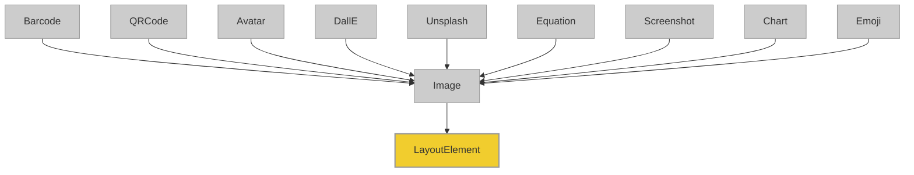

# 3. Exploring Images with borb 🖼️


In the previous section you learned how to add text, and style it in a multitude of ways.
In this section we'll handle images (and some of the derived classes).

## 3.0 The `Image` hierarchy

`borb`'s `Image` class and its related subclasses form a structured hierarchy that facilitates the integration of various types of images and graphical elements into PDF documents. Understanding this hierarchy is essential for effectively utilizing the diverse capabilities of the Image class and its derivatives. The following diagram illustrates the class hierarchy:



## 3.1 Adding an `Image` to a PDF

Images are a powerful way to enhance the visual appeal and informational content of a PDF document. In `borb`, you can easily add images from both online sources and local files. This section will guide you through the process of embedding images into your PDF using the `Image` class.

### 3.1.1 Adding an Image from a URL

The following example demonstrates how to add an image to a PDF document using a URL:

```python3
# snippet_03_01.ipynb
from borb.pdf import Document, Image, Page, PageLayout, PDF, SingleColumnLayout

# Create an empty Document
d: Document = Document()

# Create an empty Page
p: Page = Page()
d.append_page(p)

# Create a PageLayout
l: PageLayout = SingleColumnLayout(p)

# Add an Image
l.append_layout_element(
    Image(
        bytes_path_pil_image_or_url="https://images.unsplash.com/photo-1717942110740-80424da8eccc",
        size=(100, 100),
    )
)

# Write the PDF
PDF.write(what=d, where_to="output.pdf")

```

<a href="https://colab.research.google.com/github/jorisschellekens/borb-examples/blob/master/03/ipynb/snippet_03_01.ipynb" target="_parent"></a>


In this example, an image is added to the PDF document using `borb`. The process involves creating an `Image` object and specifying its source and size before adding it to the document layout.

- **Image Source**: The `Image` class is used to create an image element. The `bytes_path_pil_image_or_url` parameter is provided with a URL pointing to the image you want to include. This allows you to directly fetch and use images from the web.
- **Image Size**: The `size` parameter is used to define the dimensions of the image within the PDF. In this example, the image is set to 100x100 pixels.
- **Adding to Layout**: The image is added to the page layout using the `append_layout_element` method of the `SingleColumnLayout`. This method integrates the image into the document's content flow, ensuring it is displayed as part of the PDF.

### 3.1.2 Adding an Image from a Local File

You can also specify a (local) `pathlib.Path` to add an image from your local filesystem:

```python3
# snippet_03_02.ipynb
from borb.pdf import Document, Image, Page, PageLayout, PDF, SingleColumnLayout
import pathlib

# Create an empty Document
d: Document = Document()

# Create an empty Page
p: Page = Page()
d.append_page(p)

# Create a PageLayout
l: PageLayout = SingleColumnLayout(p)

# Download the Image
import requests
open("image.jpg", "wb").write(
    requests.get(
        "https://images.unsplash.com/photo-1525275963076-7a70249a9925"
    ).content
)

# Add an Image
l.append_layout_element(
    Image(
        bytes_path_pil_image_or_url=pathlib.Path("image.jpg"),
        size=(100, 100),
    )
)

# Write the PDF
PDF.write(what=d, where_to="output.pdf")

```

<a href="https://colab.research.google.com/github/jorisschellekens/borb-examples/blob/master/03/ipynb/snippet_03_02.ipynb" target="_parent"></a>


In this example, an image is added to the PDF document using a local file path specified with `pathlib.Path`. This method allows you to include images stored locally on your system.

- **Download and Save Image**: The script uses the `requests` library to download an image from a URL and save it locally as `"image.jpg"`. This step ensures the image is available on your local filesystem for use in the PDF.
- **Image Source**: The Image class is used to create an image element. The `bytes_path_pil_image_or_url` parameter is provided with a `pathlib.Path` object pointing to the local image file (`"image.jpg"`). This allows you to easily reference and include local images in your PDF.
- **Image Size**: The `size` parameter specifies the dimensions of the image within the PDF, set to 100x100 pixels in this example.
- **Adding to Layout**: The image is added to the page layout using the `append_layout_element` method of the `SingleColumnLayout`. This method integrates the image into the document's content flow, ensuring it is displayed as part of the PDF.

### 📣 Important

The properties you learned in the previous chapter (relating to text) can also be applied to `Image` objects:
- border
- padding
- margin
- background color
- horiontal_alignment
- vertical_alignment

For example:

```python3
# snippet_03_03.ipynb
from borb.pdf import (
    Document,
    Image,
    LayoutElement,
    Page,
    PageLayout,
    PDF,
    SingleColumnLayout,
    X11Color,
)
import pathlib

# Create an empty Document
d: Document = Document()

# Create an empty Page
p: Page = Page()
d.append_page(p)

# Create a PageLayout
l: PageLayout = SingleColumnLayout(p)

# Download the Image
import requests

open("image.jpg", "wb").write(
    requests.get(
        "https://images.unsplash.com/photo-1525275963076-7a70249a9925"
    ).content
)

# Add an Image with properties
l.append_layout_element(
    Image(
        bytes_path_pil_image_or_url=pathlib.Path("image.jpg"),
        size=(150, 150),
        border_width_top=2,
        border_width_right=2,
        border_width_bottom=2,
        border_width_left=2,
        border_color=X11Color.BLACK,
        horizontal_alignment=LayoutElement.HorizontalAlignment.MIDDLE,
        vertical_alignment=LayoutElement.VerticalAlignment.MIDDLE,
    )
)

# Write the PDF
PDF.write(what=d, where_to="output.pdf")
```

<a href="https://colab.research.google.com/github/jorisschellekens/borb-examples/blob/master/03/ipynb/snippet_03_03.ipynb" target="_parent"></a>


## 3.2 Adding an `Image` using `Unsplash`

[**Unsplash**](https://unsplash.com/) is a popular platform that provides a vast collection of high-quality, freely usable images contributed by photographers from around the world. These images can be used for various creative projects, including enhancing the visual appeal of PDF documents.

```python3
# snippet_03_04.ipynb
from borb.pdf import Document, Page, PageLayout, PDF, SingleColumnLayout, Unsplash
import os

# Create an empty Document
d: Document = Document()

# Create an empty Page
p: Page = Page()
d.append_page(p)

# Create a PageLayout
l: PageLayout = SingleColumnLayout(p)

# Add an Image from Unsplash
os.environ["UNSPLASH_API_KEY"] = "<your-unsplash-api-key>"
l.append_layout_element(
    Unsplash(
        keywords=["cherry", "blossom"],
        size=(100, 100),
    )
)

# Write the PDF
PDF.write(what=d, where_to="output.pdf")

```

<a href="https://colab.research.google.com/github/jorisschellekens/borb-examples/blob/master/03/ipynb/snippet_03_04.ipynb" target="_parent"></a>


1. **Unsplash API Key**: Before fetching images, you need to set your [Unsplash API key](https://unsplash.com/developers) using the `os.environ` variable. This key is required to authenticate your requests to the Unsplash API.
2. **Image Search**: The `Unsplash` class is used to search for an image based on the specified keywords. In this example, the keywords are "cherry" and "blossom", which will fetch an image related to cherry blossoms.
3. **Image Size**: The `size` parameter is used to define the dimensions of the image within the PDF, set to 100x100 pixels in this example.
4. **Adding to Layout**: The image is added to the page layout using the `append_layout_element` method of the `SingleColumnLayout`. This method integrates the image into the document's content flow, ensuring it is displayed as part of the PDF.

By using the `Unsplash` class, you can easily incorporate beautiful, high-quality images from Unsplash into your PDF documents, making them visually engaging and professionally polished.

## 3.3 Adding an `Image` using `DallE`

In this section, an image is generated and added to the PDF document using the **DALL-E** model from OpenAI. DALL-E creates images based on textual descriptions, allowing for the generation of unique and creative visuals tailored to your specifications.

```python3
# snippet_03_05.ipynb
from borb.pdf import DallE, Document, Page, PageLayout, PDF, SingleColumnLayout
import os

# Create an empty Document
d: Document = Document()

# Create an empty Page
p: Page = Page()
d.append_page(p)

# Create a PageLayout
l: PageLayout = SingleColumnLayout(p)

# Add an Image
os.environ["OPENAI_API_KEY"] = "<your-open-ai-api-key>"
l.append_layout_element(
    DallE(
        prompt="A rotund yellow bird enjoying life",
        size=(100, 100),
    )
)

# Write the PDF
PDF.write(what=d, where_to="output.pdf")

```

<a href="https://colab.research.google.com/github/jorisschellekens/borb-examples/blob/master/03/ipynb/snippet_03_05.ipynb" target="_parent"></a>


To generate and add an image using DALL-E, follow these steps:

1. **OpenAI API Key**: Before generating images, you need to set your [**OpenAI API key**](https://platform.openai.com/docs/quickstart) using the `os.environ` variable. This key is required to authenticate your requests to the DALL-E service.

2. **Image Generation**: The `DallE` class is used to generate an image based on a specified prompt. In this example, the prompt is "A rotund yellow bird enjoying life", which instructs DALL-E to create an image matching this description.

3. **Image Size**: The `size` parameter is used to define the dimensions of the generated image within the PDF, set to 100x100 pixels in this example.

4. **Adding to Layout**: The generated image is added to the page layout using the `append_layout_element` method of the `SingleColumnLayout`. This method integrates the image into the document's content flow, ensuring it is displayed as part of the PDF.

By using the `DallE` class, you can incorporate imaginative and custom-generated images into your PDF documents, enhancing their creativity and uniqueness.

## 3.4 Adding a `Barcode`

Barcodes are a widely used method for encoding information in a format that can be easily scanned and interpreted by barcode readers. In `borb`, you can add barcodes to your PDF documents using the `Barcode` class. This section will guide you through the process of embedding a barcode into a PDF.

```python3
# snippet_03_06.ipynb
from borb.pdf import Barcode, Document, Page, PageLayout, PDF, SingleColumnLayout

# Create an empty Document
d: Document = Document()

# Create an empty Page
p: Page = Page()
d.append_page(p)

# Create a PageLayout
l: PageLayout = SingleColumnLayout(p)

# Add a Barcode
l.append_layout_element(
    Barcode(
        barcode_data="0123456789",
        barcode_type=Barcode.BarcodeType.CODE_39,
        size=(100, 100),
    )
)

# Write the PDF
PDF.write(what=d, where_to="output.pdf")

```

<a href="https://colab.research.google.com/github/jorisschellekens/borb-examples/blob/master/03/ipynb/snippet_03_06.ipynb" target="_parent"></a>


In this code snippet, a barcode is added to the PDF document using the `**Barcode**` class. Here's how it works:

1. **Import**: Ensure you import Barcode from borb.pdf.

2. **Barcode Data and Type**: The Barcode class is used to create a barcode with `barcode_data` set to `"0123456789"` and `barcode_type` set to `Barcode.BarcodeType.CODE_39`, a common alphanumeric format.

3. **Supported Barcode Types**: `borb` supports various barcode types, including:
   - `CODE_39`, `CODE_128`
   - `EAN_13`, `EAN_14` & `EAN_8`
   - `GS_1` & `GS_128`
   - `BGTIN`
   - `ISBN`, `ISBN_10`, `ISBN_13` & `ISSN`
   - `ITF`
   - `JAN`
   - `PZN`
   - `QR`
   - `UPC` & `UPC_A`

4. **Size**: The `size` parameter specifies the dimensions of the barcode, set to 100x100 pixels in this example.

5. **Integration**: The barcode is added to the layout using the `append_layout_element` method of the `SingleColumnLayout`. This method integrates the barcode into the PDF's content flow, ensuring it is displayed as part of the document.

By using the `Barcode` class, you can efficiently incorporate barcodes into your PDF documents, making them suitable for a variety of applications such as inventory management, product labeling, and more.

## 3.5 Adding a `QRCode`

QR codes are a versatile tool for encoding information in a compact, machine-readable format. They can be used to store URLs, text, and other data, making them a popular choice for a variety of applications. In `borb`, you can easily add both regular and micro QR codes to your PDF documents.

### 3.5.1 Regular QR Codes

Regular QR codes are the standard format, capable of storing a significant amount of data. The following code snippet demonstrates how to add a regular QR code to a PDF document using `borb`:

```python3
# snippet_03_07.ipynb
from borb.pdf import Document, Page, PageLayout, PDF, QRCode, SingleColumnLayout

# Create an empty Document
d: Document = Document()

# Create an empty Page
p: Page = Page()
d.append_page(p)

# Create a PageLayout
l: PageLayout = SingleColumnLayout(p)

# Add a QR code
l.append_layout_element(
    QRCode(
        qr_code_data="borbpdf.com",
        qr_code_type=QRCode.QRCodeType.REGULAR,
        size=(100, 100),
    )
)

# Write the PDF
PDF.write(what=d, where_to="output.pdf")

```

<a href="https://colab.research.google.com/github/jorisschellekens/borb-examples/blob/master/03/ipynb/snippet_03_07.ipynb" target="_parent"></a>


In this example, a `QRCode` object is created with the data "borbpdf.com". The `qr_code_type` is set to `QRCode.QRCodeType.REGULAR`, indicating that a regular QR code should be generated. The `size` parameter specifies the dimensions of the QR code in the PDF.

### 3.5.2 Micro QR Codes

Micro QR codes are a smaller variant, designed for applications where space is limited. They can store less data than regular QR codes but are useful in scenarios where a compact code is necessary. Here's how you can add a micro QR code to a PDF:

```python3
# snippet_03_08.ipynb
from borb.pdf import Document, Page, PageLayout, PDF, QRCode, SingleColumnLayout

# Create an empty Document
d: Document = Document()

# Create an empty Page
p: Page = Page()
d.append_page(p)

# Create a PageLayout
l: PageLayout = SingleColumnLayout(p)

# Add a QR code
l.append_layout_element(
    QRCode(
        qr_code_data="borbpdf.com",
        qr_code_type=QRCode.QRCodeType.MICRO,
        size=(100, 100),
    )
)

# Write the PDF
PDF.write(what=d, where_to="output.pdf")

```

<a href="https://colab.research.google.com/github/jorisschellekens/borb-examples/blob/master/03/ipynb/snippet_03_08.ipynb" target="_parent"></a>


In this code, the `qr_code_type` is set to `QRCode.QRCodeType.MICRO`, which instructs borb to generate a micro QR code. The rest of the process is similar to adding a regular QR code.

---

## 3.6 Adding an `Avatar`

Avatars are graphical representations of users or characters, often used in digital environments to provide a visual identity. In `borb`, you can create and customize avatars to add a personal touch to your PDF documents. This section will guide you through the process of adding an avatar using the `Avatar` class from the `borb.pdf` module.

```python3
# snippet_03_09.ipynb
from borb.pdf import Avatar, Document, Page, PageLayout, PDF, SingleColumnLayout, X11Color

# Create an empty Document
d: Document = Document()

# Create an empty Page
p: Page = Page()
d.append_page(p)

# Create a PageLayout
l: PageLayout = SingleColumnLayout(p)

# Add a Barcode
l.append_layout_element(
    Avatar(
        background_circle_color=X11Color.BLUE,
        clothing_type=Avatar.ClothingType.BLAZER_AND_SHIRT,
        eye_type=Avatar.EyeType.HAPPY,
        facial_hair_type=Avatar.FacialHairType.BEARD_LIGHT,
        hair_color_type=Avatar.HairColorType.BLACK,
        mouth_type=Avatar.MouthType.SERIOUS,
        top_of_head_type=Avatar.TopOfHeadType.SHORT_HAIR_THE_CAESAR,
    )
)

# Write the PDF
PDF.write(what=d, where_to="output.pdf")

```

<a href="https://colab.research.google.com/github/jorisschellekens/borb-examples/blob/master/03/ipynb/snippet_03_09.ipynb" target="_parent"></a>


In this example, an Avatar object is created with various customizable attributes:

- `background_circle_color`: Sets the background color of the avatar's circle. In this case, it is set to `X11Color.BLUE`.
- `clothing_type`: Specifies the type of clothing the avatar wears. Here, it is set to `Avatar.ClothingType.BLAZER_AND_SHIRT`.
- `eye_type`: Defines the expression of the avatar's eyes. This example uses `Avatar.EyeType.HAPPY`.
- `facial_hair_type`: Determines the type of facial hair. The example uses `Avatar.FacialHairType.BEARD_LIGHT`.
- `hair_color_type`: Sets the color of the avatar's hair, which is `Avatar.HairColorType.BLACK` in this case.
- `mouth_type`: Specifies the expression of the avatar's mouth, set to `Avatar.MouthType.SERIOUS`.
- `top_of_head_type`: Defines the hairstyle, here set to `Avatar.TopOfHeadType.SHORT_HAIR_THE_CAESAR`.

By using the Avatar class from borb.pdf, you can create unique and personalized avatars to enhance the visual appeal of your PDF documents.

## 3.7 Adding a `Chart`

Charts are an effective way to visually represent data, making it easier to understand and analyze. In `borb`, you can integrate charts into your PDF documents using the `Chart` class, which allows you to embed plots created with libraries like `Matplotlib`. This section will guide you through the process of adding a chart to a PDF document.

```python3
# snippet_03_10.ipynb
from borb.pdf import Chart, Document, Page, PageLayout, PDF, Screenshot, SingleColumnLayout
import math
import matplotlib.pyplot as plt

def _create_matplotlib_pyplot() -> plt:

    # Data for the plot
    x = [i for i in range(0, 360, 5)]
    y = [math.sin(math.radians(x)) * 10 for x in x]

    # Create the plot
    plt.plot(x, y, marker="o", linestyle="-", color="b", label="y = x^2")

    # Add labels and title
    plt.xlabel("X-axis")
    plt.ylabel("Y-axis")
    plt.title("Simple Plot of y = sin(x) * 10")

    # return
    return plt


# Create an empty Document
d: Document = Document()

# Create an empty Page
p: Page = Page()
d.append_page(p)

# Create a PageLayout
l: PageLayout = SingleColumnLayout(p)

# Add an Image
l.append_layout_element(
    Chart(
        matplotlib_plt=_create_matplotlib_pyplot(),
        size=(100, 100),
    )
)

# Write the PDF
PDF.write(what=d, where_to="output.pdf")

```

<a href="https://colab.research.google.com/github/jorisschellekens/borb-examples/blob/master/03/ipynb/snippet_03_10.ipynb" target="_parent"></a>


In this example, a simple line chart is created using Matplotlib. The `_create_matplotlib_pyplot` function generates a plot of the sine function, `y = sin(x) * 10`, over a range of x-values from 0 to 360 degrees. The plot is customized with markers, line styles, and labels for the axes and title.

The `Chart` object is then created with the `matplotlib_plt` parameter set to the plot returned by `_create_matplotlib_pyplot()`. The `size` parameter specifies the dimensions of the chart in the PDF.

## 3.8 Adding an `Emoji` 😁

Emojis are a fun and expressive way to add personality and emotion to your documents. In `borb`, you can easily incorporate emojis into your PDF documents using the `Emoji` class. This section will guide you through the process of adding an emoji to a PDF.

```python3
# snippet_03_11.ipynb
from borb.pdf import Document, Emoji, Page, PageLayout, PDF, SingleColumnLayout

# Create an empty Document
d: Document = Document()

# Create an empty Page
p: Page = Page()
d.append_page(p)

# Create a PageLayout
l: PageLayout = SingleColumnLayout(p)

# Add an Image
l.append_layout_element(Emoji.AERIAL_TRAMWAY)

# Write the PDF
PDF.write(what=d, where_to="output.pdf")

```

<a href="https://colab.research.google.com/github/jorisschellekens/borb-examples/blob/master/03/ipynb/snippet_03_11.ipynb" target="_parent"></a>


In this example, an emoji is added to the PDF document using the Emoji class. Here’s how it works:

1. **Import**: Ensure you import the `Emoji` class from borb.pdf.

2. **Adding an Emoji**: The `Emoji` class provides a variety of emojis that can be added to your document. In this example, `Emoji.AERIAL_TRAMWAY` is used to add an aerial tramway emoji (🚡) to the PDF. You can choose from a wide range of emojis to suit your document's theme or message.

3. **Integration**: The emoji is added to the layout using the `append_layout_element` method of the `SingleColumnLayout`. This method integrates the emoji into the PDF's content flow, ensuring it is displayed as part of the document.

By using the `Emoji` class, you can add a touch of fun and expressiveness to your PDF documents, making them more engaging and visually appealing.

## 3.9 Adding a `Screenshot`

Screenshots are a useful way to capture and display the current state of a screen or application within a document. You can add screenshots to your PDF documents using the `Screenshot` class. This section will guide you through the process of embedding a screenshot into a PDF.

```python3
# snippet_03_12.ipynb
from borb.pdf import Document, Page, PageLayout, PDF, Screenshot, SingleColumnLayout

# Create an empty Document
d: Document = Document()

# Create an empty Page
p: Page = Page()
d.append_page(p)

# Create a PageLayout
l: PageLayout = SingleColumnLayout(p)

# Add an Image
l.append_layout_element(Screenshot(size=(100, 100)))

# Write the PDF
PDF.write(what=d, where_to="output.pdf")

```

<a href="https://colab.research.google.com/github/jorisschellekens/borb-examples/blob/master/03/ipynb/snippet_03_12.ipynb" target="_parent"></a>


In this example, a screenshot is added to the PDF document using the `Screenshot` class. Here’s how it works:

1. **Import**: Ensure you import the `Screenshot` class from `borb.pdf`.

2. **Adding a Screenshot**: The `Screenshot` class is used to capture and add a screenshot to the document. The `size` parameter specifies the dimensions of the screenshot within the PDF, set to 100x100 pixels in this example. This allows you to control how large the screenshot appears in the document.

3. **Integration**: The screenshot is added to the layout using the `append_layout_element` method of the `SingleColumnLayout`. This method integrates the screenshot into the PDF's content flow, ensuring it is displayed as part of the document.

By using borb's `Screenshot` class, you can effectively incorporate visual captures of screens or applications into your PDF documents, enhancing their informational content and visual appeal.

## 3.10 Adding an `Equation`

Equations are essential for documents that involve mathematical expressions or scientific content. In `borb`, you can add equations to your PDF documents using the `Equation` class, which supports LaTeX syntax for rendering complex mathematical expressions. This section will guide you through the process of embedding an equation into a PDF.

```python3
# snippet_03_13.ipynb
from borb.pdf import Document, Equation, Page, PageLayout, PDF, SingleColumnLayout

# Create an empty Document
d: Document = Document()

# Create an empty Page
p: Page = Page()
d.append_page(p)

# Create a PageLayout
l: PageLayout = SingleColumnLayout(p)

# Add an Image
l.append_layout_element(
    Equation(
        latex_syntax=r"x = \frac {-b \pm \sqrt{b^2 -4ac}} {2a}",
        font_size=12,
    )
)

# Write the PDF
PDF.write(what=d, where_to="output.pdf")

```

<a href="https://colab.research.google.com/github/jorisschellekens/borb-examples/blob/master/03/ipynb/snippet_03_13.ipynb" target="_parent"></a>


In this example, an equation is added to the PDF document using the Equation class. Here’s how it works:

1. **Import**: Ensure you import the Equation class from borb.pdf and any necessary color classes, such as X11Color, for styling.

2. **Adding an Equation**: The Equation class is used to create an equation element. The latex_syntax parameter allows you to specify the equation using LaTeX syntax.

3. **Styling**: The font_color parameter is used to set the color of the equation text, here set to X11Color.YELLOW_MUNSELL. The font_size parameter specifies the size of the equation text, set to 12 in this example.

4. **Integration**: The equation is added to the layout using the append_layout_element method of the SingleColumnLayout. This method integrates the equation into the PDF's content flow, ensuring it is displayed as part of the document.

By using the Equation class from borb.pdf, you can effectively incorporate complex mathematical expressions into your PDF documents, making them suitable for academic, scientific, or technical content.

## Section Recap:

- **`Image` Class Hierarchy**:
  - Subclasses: Include `Barcode`, `QRCode`, `Avatar`, `DallE`, `Unsplash`, `Equation`, `Screenshot`, `Chart`, and `Emoji`.
- **Adding an `Image` to a PDF**:
  - **From a URL**: Use the `Image` class with `bytes_path_pil_image_or_url` to fetch and embed images directly from the web.
  - **From a Local File**: Use `pathlib.Path` to add images stored locally on your system.
- **`Unsplash` Class**: Fetch images using `keywords` and an `API key`.
- **`DallE` Class**: Generate images with a `prompt` based on textual descriptions using OpenAI's DALL-E model.
- **`Barcode` Class**: Create and integrate barcodes with `barcode_data` and `barcode_type`, supporting various formats.
- **`QRCode` Class**: Use `QRCode` with `qr_code_data` and `qr_code_type` to add regular and micro QR codes.
- **`Avatar` Class**: Create customizable avatars with various attributes, such as `eye_type`, `facial_hair_type`, and `hair_color_type`.
- **`Chart` Class**: Integrate data visualizations and plots using libraries like `Matplotlib`.
- **`Emoji` Class**: Add expressive emojis to your PDF documents, using predefined options like `Emoji.AERIAL_TRAMWAY`.
- **`Screenshot` Class**: Capture and embed screenshots into PDF documents.
- **`Equation` Class**: Render mathematical expressions with `latex_syntax`, styling with `font_color` and `font_size`.
