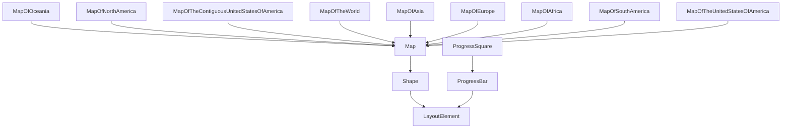

# 4. Exploring `Shape` 🔶


## 4.0 The `Shape` class hierarchy

The `Shape` class and its related classes form a structured hierarchy that allows for the creation and manipulation of various graphical elements within a PDF document. Understanding this hierarchy is crucial for effectively utilizing the capabilities of the `Shape` class and its derivatives. The following diagram illustrates the class hierarchy:



## 4.1 Specifing a `Shape` by hand

You can create custom shapes by manually specifying the `x` & `y` coordinates of each point that defines the shape. This flexibility allows you to design any shape you desire by plotting its vertices independently. The following example demonstrates how to specify a shape manually using the `Shape` class.

```python3
# snippet_04_01.ipynb
from borb.pdf import Document, Page, PageLayout, PDF, Shape, SingleColumnLayout

# Create an empty Document
d: Document = Document()

# Create an empty Page
p: Page = Page()
d.append_page(p)

# Create a PageLayout
l: PageLayout = SingleColumnLayout(p)

# Add a Shape
l.append_layout_element(
    Shape(
        coordinates=[
            (0.0, 0.0),
            (75.0, 0.0),
            (100.0, 100.0),
            (25.0, 100.0),
            (0.0, 0.0),
        ],
    )
)

# Write the PDF
PDF.write(what=d, where_to="output.pdf")

```

<a href="https://colab.research.google.com/github/jorisschellekens/birb-examples/blob/main/04/ipynb/snippet_04_01.ipynb" target="_parent"></a>


In this example, a custom shape is added to the PDF document using the `Shape` class. Here’s how it works:

1. **Import**: Start by importing the necessary classes, including Shape from borb.pdf. This sets up the environment to create and manipulate shapes within the PDF.

2. **Creating a Custom Shape**: The `Shape` class is used to define a custom shape by specifying a list of `(x, y)` coordinates. Each tuple in the list represents a point in the 2D space of the PDF page. These points are connected in sequence to form the outlined shape. In this example, the coordinates parameter defines a shape with the following points: `(0.0, 0.0)`, `(75.0, 0.0)`, `(100.0, 100.0)`, `(25.0, 100.0)`, `(0.0, 0.0)`. These points outline a simple quadrilateral that returns to the starting point, ensuring the shape is closed.
3. **Integration**: The shape is added to the layout using the `append_layout_element` method of the `SingleColumnLayout`. This method integrates the shape into the PDF's content flow, displaying it as part of the document.

By manually specifying the coordinates of each point, you can create intricate and unique shape designs to enhance the visual complexity and customization of your PDF documents.

## 4.2 Using `LineArt`

Alternatively, you can use `LineArt` which already contains a lot of predefined `Shape`s. This feature allows you to quickly incorporate complex designs without manually specifying each point. The following example demonstrates how to use LineArt to add a shape to a PDF.

```python3
# snippet_04_02.ipynb
from borb.pdf import Document, LineArt, Page, PageLayout, PDF, SingleColumnLayout

# Create an empty Document
d: Document = Document()

# Create an empty Page
p: Page = Page()
d.append_page(p)

# Create a PageLayout
l: PageLayout = SingleColumnLayout(p)

# Add a Shape
l.append_layout_element(LineArt.six_pointed_star())

# Write the PDF
PDF.write(what=d, where_to="output.pdf")

```

<a href="https://colab.research.google.com/github/jorisschellekens/birb-examples/blob/main/04/ipynb/snippet_04_02.ipynb" target="_parent"></a>


In this example, a predefined shape is added to the PDF document using the `LineArt` class. Here’s how it works:

1. **Import**: Begin by importing the necessary classes, including `LineArt` from `borb.pdf`. This prepares the environment to utilize predefined shapes within the PDF.

2. **Using `LineArt`**: The `LineArt` class provides a variety of predefined shapes that can be easily added to your document. In this example, `LineArt.six_pointed_star()` is used to add a six-pointed star shape. This method eliminates the need to manually define each point of the shape, streamlining the process of adding complex designs.

3. **Integration**: The shape is added to the layout using the `append_layout_element` method of the `SingleColumnLayout`. This method integrates the shape into the PDF's content flow, ensuring it is displayed as part of the document.

By using `LineArt`, you can efficiently incorporate intricate and visually appealing shapes into your PDF documents, enhancing their design and aesthetic without the complexity of manual shape creation.

## 4.3 Setting `fill_color` and `stroke_color`

You can customize the appearance of shapes by setting their `fill_color` and `stroke_color`. These properties allow you to define the interior color and the outline color of a shape, respectively. The following example demonstrates how to apply these color settings to a shape.

```python3
# snippet_04_03.ipynb
from borb.pdf import (
    Document,
    Page,
    PageLayout,
    PDF,
    Shape,
    SingleColumnLayout,
    X11Color,
)

# Create an empty Document
d: Document = Document()

# Create an empty Page
p: Page = Page()
d.append_page(p)

# Create a PageLayout
l: PageLayout = SingleColumnLayout(p)

# Add a Shape
l.append_layout_element(
    Shape(
        coordinates=[
            (0.0, 0.0),
            (75.0, 0.0),
            (100.0, 100.0),
            (25.0, 100.0),
            (0.0, 0.0),
        ],
        stroke_color=X11Color.YELLOW_MUNSELL,
        fill_color=X11Color.PRUSSIAN_BLUE,
    )
)

# Write the PDF
PDF.write(what=d, where_to="output.pdf")

```

<a href="https://colab.research.google.com/github/jorisschellekens/birb-examples/blob/main/04/ipynb/snippet_04_03.ipynb" target="_parent"></a>


In this example, a custom shape is added to the PDF with specified `fill_color` and `stroke_color`. Here’s how it works:

1. **Import**: Begin by importing the necessary classes, including `Shape` and `X11Color` from `borb.pdf`. This allows you to create shapes and apply color settings.

2. **Creating a Custom Shape**: The `Shape` class is used to define a shape with a list of `(x, y)` coordinates. These points outline the shape, which is then customized with color properties.

3. **Setting Colors**:

* `stroke_color`: This parameter sets the color of the shape's outline. In this example, it is set to `X11Color.YELLOW_MUNSELL`, giving the shape a yellow border.
* `fill_color`: This parameter sets the color of the shape's interior. Here, it is set to `X11Color.PRUSSIAN_BLUE`, filling the shape with a deep blue color.

4. **Integration**: The shape, with its color settings, is added to the layout using the `append_layout_element` method of the `SingleColumnLayout`. This method integrates the shape into the PDF's content flow, ensuring it is displayed as part of the document.

## 4.4 Setting `line_width`

Adjusting the `line_width` of a shape allows you to control the thickness of its outline. This customization can enhance the appearance of shapes in your PDF documents, making their edges more prominent or subtle, depending on your design needs. The following example demonstrates how to set the `line_width` for a shape.

```python3
# snippet_04_04.ipynb
from borb.pdf import Document, Page, PageLayout, SingleColumnLayout, Shape, PDF

# Create an empty Document
d: Document = Document()

# Create an empty Page
p: Page = Page()
d.append_page(p)

# Create a PageLayout
l: PageLayout = SingleColumnLayout(p)

# Add a Shape
l.append_layout_element(
    Shape(
        coordinates=[
            (0.0, 0.0),
            (75.0, 0.0),
            (100.0, 100.0),
            (25.0, 100.0),
            (0.0, 0.0),
        ],
        line_width=2,
    )
)

# Write the PDF
PDF.write(what=d, where_to="output.pdf")

```

<a href="https://colab.research.google.com/github/jorisschellekens/birb-examples/blob/main/04/ipynb/snippet_04_04.ipynb" target="_parent"></a>


In this example, a custom shape is added to the PDF document with a specified `line_width`. Here’s how it works:

1. **Import**: Start by importing the necessary classes, such as `Shape` from `borb.pdf`. This enables you to create and manipulate shapes within the PDF.

2. **Creating a Custom Shape**: The Shape class is used to define a shape with a list of `(x, y)` coordinates. These points outline the shape, and then you can customize its border by setting the `line_width`.

3. **Setting `line_width`**: The `line_width` parameter controls the thickness of the shape's outline. In this example, it is set to 2, which means the outline will be drawn with a moderate thickness, making it more noticeable than a default thin line.

4. **Integration**: The shape, with its specified `line_width`, is added to the layout using the `append_layout_element` method of the `SingleColumnLayout`. This method integrates the shape into the PDF's content flow, ensuring it is displayed as part of the document.

By setting `line_width`, you can fine-tune the visual impact of shapes in your PDF documents, either emphasizing their borders or keeping them minimal as per your design requirements.

## 4.5 Using the Convenience Methods on `Shape`

The `Shape` class in `borb` provides several convenience methods that simplify the manipulation and transformation of shapes. These methods allow you to easily adjust the orientation, size, and smoothness of shapes, enhancing their flexibility and usability in your PDF documents. Here’s a brief overview of these methods:

- **`mirror_vertically`**: This method flips the shape along the vertical axis, creating a mirrored version of the original shape. It is useful for creating symmetrical designs or reflections.

- **`mirror_horizontally`**: Similar to `mirror_vertically`, this method flips the shape along the horizontal axis. It can be used to create mirrored effects or adjust the orientation of a shape.

- **`rotate`**: This method rotates the shape by a specified angle. It allows you to change the orientation of the shape, which can be useful for aligning it with other elements or creating dynamic layouts.

- **`scale_by_factor`**: This method scales the shape by a given factor, either enlarging or reducing its size proportionally. It is helpful for adjusting the size of a shape to fit within a specific area or to emphasize certain elements.

- **`scale_to_fit`**: This method scales the shape to fit within a specified width and height, maintaining its aspect ratio. It ensures that the shape fits perfectly within a designated space without distortion.

- **`smooth`**: This method uses Chaikin's algorithm to smoothen the polygons of the shape, creating a more refined and less angular appearance. It is ideal for enhancing the aesthetics of polygonal shapes by softening their edges.

These convenience methods make it easier to manipulate shapes in `borb`, allowing you to create complex and visually appealing designs with minimal effort.

```
# snippet_04_05.ipynb
from borb.pdf import Document, LineArt, Page, PageLayout, PDF, SingleColumnLayout

# Create an empty Document
d: Document = Document()

# Create an empty Page
p: Page = Page()
d.append_page(p)

# Create a PageLayout
l: PageLayout = SingleColumnLayout(p)

# Add a Shape
l.append_layout_element(LineArt.six_pointed_star().smooth())

# Write the PDF
PDF.write(what=d, where_to="output.pdf")
```

<a href="https://colab.research.google.com/github/jorisschellekens/birb-examples/blob/main/04/ipynb/snippet_04_05.ipynb" target="_parent"></a>


## 4.6 `ProgressBar` and `ProgressSquare`

You can visually represent progress in `borb` using `ProgressBar` and `ProgressSquare`. These elements are ideal for displaying completion status in reports, dashboards, or any document that benefits from progress visualization. This section will guide you through using both `ProgressBar` and `ProgressSquare`.

### 4.6.1 Using `ProgressBar`

The `ProgressBar` class provides a linear representation of progress, which is commonly used in various applications to indicate task completion. Here’s how you can add a `ProgressBar` to your PDF:

```python3
# snippet_04_06.ipynb
from borb.pdf import Document, Page, PageLayout, PDF, ProgressBar, SingleColumnLayout

# Create an empty Document
d: Document = Document()

# Create an empty Page
p: Page = Page()
d.append_page(p)

# Create a PageLayout
l: PageLayout = SingleColumnLayout(p)

# Add a Shape
l.append_layout_element(
    ProgressBar(value=40,
                max_value=100,
                size=(100, 15))
)

# Write the PDF
PDF.write(what=d, where_to="output.pdf")

```

<a href="https://colab.research.google.com/github/jorisschellekens/birb-examples/blob/main/04/ipynb/snippet_04_06.ipynb" target="_parent"></a>


In this example, a ProgressBar is added to the PDF document:

1. **Import**: Import the `ProgressBar` class from `borb.pdf`.

2. **Adding a `ProgressBar`**: The `ProgressBar` is created with a `value` of `40` and a `max_value` of `100`, indicating 40% completion. The `size` parameter specifies the dimensions of the progress bar, set to 100x15 pixels.

3. **Integration**: The progress bar is added to the layout using the `append_layout_element` method of the `SingleColumnLayout`, integrating it into the PDF's content flow.

### 4.6.2 Using `ProgressSquare`

For a more modern and stylish representation, you can use `ProgressSquare`, which provides a square-shaped progress indicator. Here’s how to add a `ProgressSquare` to your PDF:

```python3
# snippet_04_07.ipynb
from borb.pdf import Document, Page, PageLayout, PDF, ProgressSquare, SingleColumnLayout

# Create an empty Document
d: Document = Document()

# Create an empty Page
p: Page = Page()
d.append_page(p)

# Create a PageLayout
l: PageLayout = SingleColumnLayout(p)

# Add a Shape
l.append_layout_element(
    ProgressSquare(value=40,
                max_value=100,
                width=32)
)

# Write the PDF
PDF.write(what=d, where_to="output.pdf")

```

<a href="https://colab.research.google.com/github/jorisschellekens/birb-examples/blob/main/04/ipynb/snippet_04_07.ipynb" target="_parent"></a>


In this example, a `ProgressSquare` is added to the PDF document:

1. **Import**: Import the `ProgressSquare` class from `borb.pdf`.

2. **Adding a `ProgressSquare`**: The `ProgressSquare` is created with a `value` of `40` and a `max_value` of `100`, indicating 40% completion. The `size` parameter specifies the dimensions of the square, set to 32 pixels.

3. **Integration**: The progress square is added to the layout using the `append_layout_element` method of the `SingleColumnLayout`, integrating it into the PDF's content flow.

By using `ProgressBar` and `ProgressSquare`, you can effectively visualize progress in your PDF documents, enhancing their functionality and aesthetic appeal.

## 4.7 Using `Map`

If you need to include a map in your PDF document, `borb` provides a convenient way to do so with its `Map` class and its subclasses. These classes offer various line drawings of maps, allowing you to integrate geographical representations seamlessly. The following example demonstrates how to use the `Map` class to add a map of the United States to a PDF.

```python3
# snippet_04_08.ipynb
from borb.pdf import (
    Document,
    MapOfTheContiguousUnitedStatesOfAmerica,
    Page,
    PageLayout,
    PDF,
    SingleColumnLayout,
    X11Color,
)

# Create an empty Document
d: Document = Document()

# Create an empty Page
p: Page = Page()
d.append_page(p)

# Create a PageLayout
l: PageLayout = SingleColumnLayout(p)

# Add a Shape
l.append_layout_element(
    MapOfTheContiguousUnitedStatesOfAmerica(
        fill_color=X11Color.LIGHT_GRAY, stroke_color=X11Color.WHITE, line_width=0.1
    )
    .set_fill_color(fill_color=X11Color.YELLOW_MUNSELL, name="Texas")
    .scale_to_fit(width=200, height=200)
)

# Write the PDF
PDF.write(what=d, where_to="output.pdf")

```

<a href="https://colab.research.google.com/github/jorisschellekens/birb-examples/blob/main/04/ipynb/snippet_04_08.ipynb" target="_parent"></a>


In this example, a map of the United States is added to the PDF document using the Map class. Here’s how it works:

1. **Import**: Begin by importing the necessary classes, including `MapOfTheContiguousUnitedStatesOfAmerica` from `borb.pdf`. This prepares the environment to utilize map elements within the PDF.

2. **Adding a `Map`**: The `MapOfTheContiguousUnitedStatesOfAmerica` class is used to create a map element. The fill_color parameter is set to `X11Color.LIGHT_GRAY`, and the stroke_color is set to `X11Color.WHITE`, with a `line_width` of `0.1`. These settings define the initial appearance of the map.

3. **Customizing the `Map`**: The `set_fill_color` method is used to change the fill color of a specific region, in this case, `"Texas"`, to `X11Color.YELLOW_MUNSELL`. This customization allows you to highlight specific areas on the map.

4. **Integration**: The map is added to the layout using the `append_layout_element` method of the `SingleColumnLayout`. This method integrates the map into the PDF's content flow, ensuring it is displayed as part of the document.

By using the `Map` class and its subclasses, you can effectively incorporate detailed and customizable maps into your PDF documents, enhancing their informational content and visual appeal.

### 📣 Important

- `set_fill_color`: This method allows you to set the fill color of a specific region within a `Map`. Depending on the type of map, this region could be a state, a country, or a broader geographical area. By changing the fill color, you can highlight specific regions to draw attention or convey information.
- `set_stroke_color`: Similar to `set_fill_color`, this method lets you set the stroke color of a specific region. The stroke color defines the outline of the region, allowing you to emphasize borders or create contrast with the fill color.
- `Map` Subclasses: `MapOfOceania`, `MapOfNorthAmerica`, `MapOfTheContiguousUnitedStatesOfAmerica`, `MapOfTheWorld`, `MapOfAsia`, `MapOfEurope`, `MapOfAfrica`, `MapOfSouthAmerica`, `MapOfTheUnitedStatesOfAmerica`.

These customization options are invaluable in reports where you want to color a map according to specific criteria, such as demographic data, economic indicators, or geographical highlights. By using these methods, you can effectively communicate complex information through visual means, making your reports more engaging and informative.

## Section Recap

- **Specifying a Shape by Hand**:
  - `Shape`: Define custom shapes by specifying `(x, y)` coordinates.
  - `append_layout_element`: Integrates the shape into the PDF's content flow.
- **Using `LineArt`**:
  - `LineArt`: Provides predefined shapes for quick integration.
  - `LineArt.six_pointed_star()`: Example of adding a predefined shape.
- **Setting `fill_color` and `stroke_color`**:
  - `fill_color`: Sets the interior color of a shape.
  - `stroke_color`: Sets the outline color of a shape.
- **Setting `line_width`**:
  - `line_width`: Controls the thickness of a shape's outline.
- **Convenience Methods on `Shape`**:
  - `mirror_vertically`: Flips the shape along the vertical axis.
  - `mirror_horizontally`: Flips the shape along the horizontal axis.
  - `rotate`: Rotates the shape by a specified angle.
  - `scale_by_factor`: Scales the shape by a given factor.
  - `scale_to_fit`: Scales the shape to fit within specified dimensions.
  - `smooth`: Uses Chaikin's algorithm to smoothen polygons.
- **`ProgressBar` and `ProgressSquare`**:
  - `ProgressBar`: Linear representation of progress.
  - `ProgressSquare`: Square-shaped progress indicator.
- **Using `Map`**:
  - `Map`: Integrates geographical maps into PDF documents.
  - `set_fill_color`: Sets the fill color of a specific region.
  - `set_stroke_color`: Sets the stroke color of a specific region.
