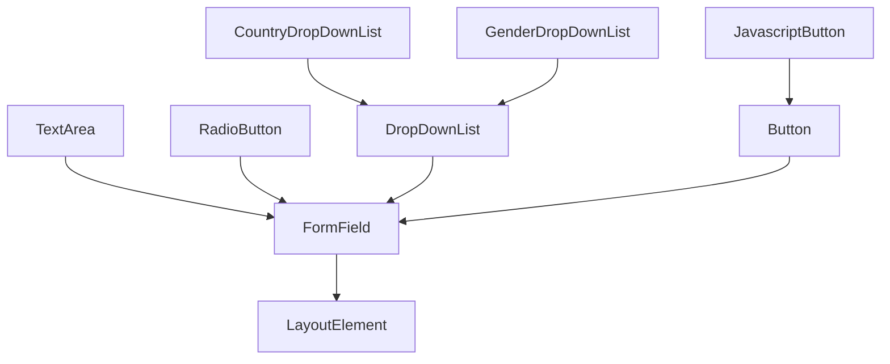
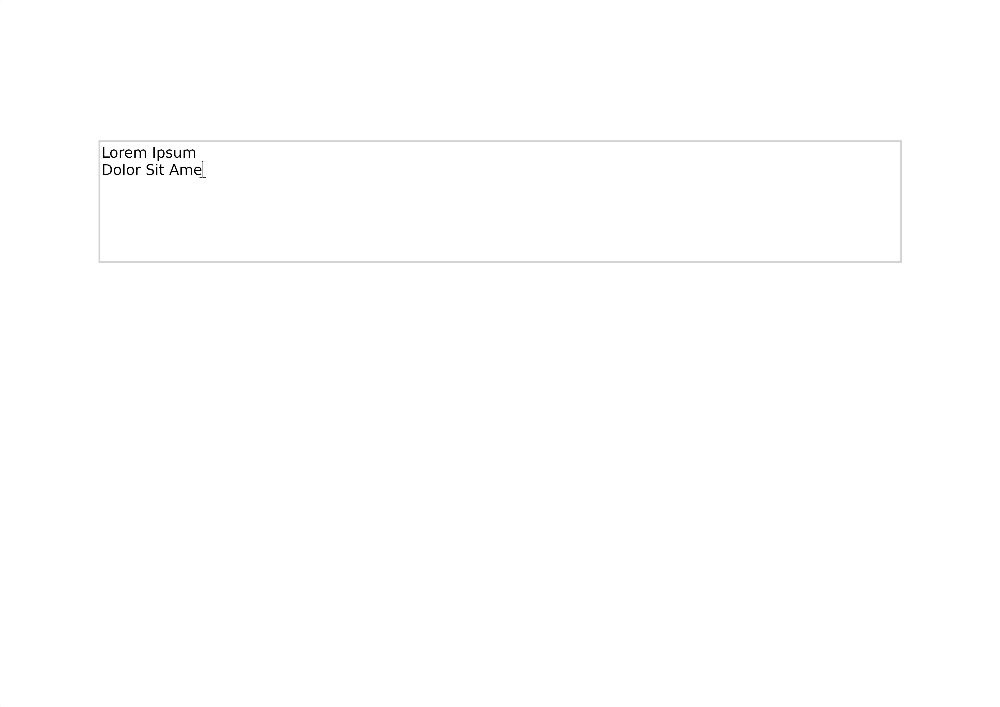
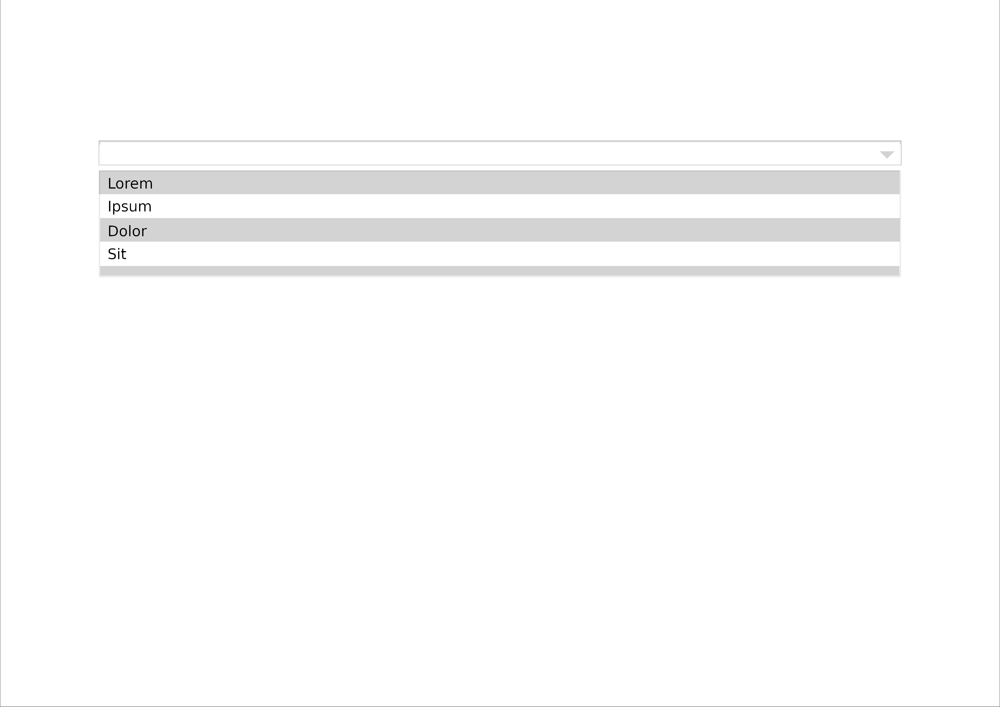
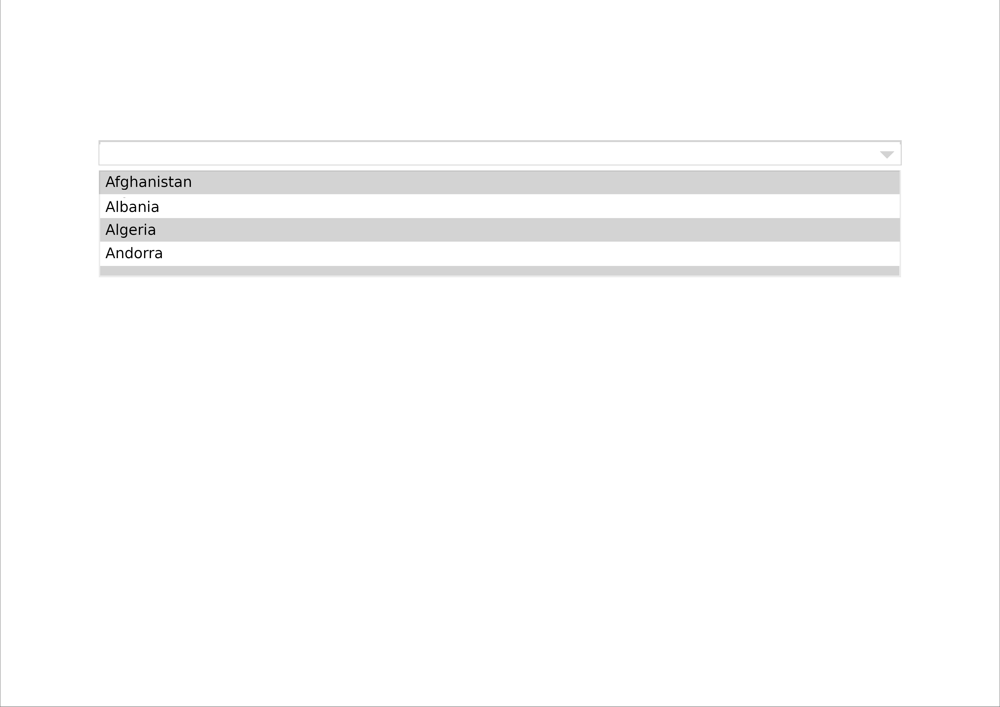
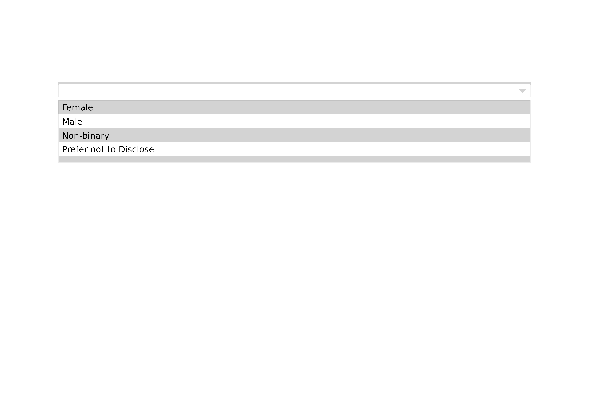

# 5. Working with Forms


Forms are an essential part of document generation, allowing users to input data and interact with PDF documents dynamically. This guide explores the `FormField` class hierarchy, different types of form elements, and how to handle user input effectively.

## 5.1 The `FormField` class hierarchy

The `FormField` class hierarchy represents the different form elements available in the PDF library. Below is a visual representation of the hierarchy:



At the top level, `FormField` inherits from `LayoutElement`, meaning that all form elements are types of layout components. Various specialized elements extend `FormField`, including `TextArea`, `RadioButton`, and `DropDownList`. The `DropDownList` itself has further specialized versions, such as `CountryDropDownList` and `GenderDropDownList`. Similarly, `Button` has a specialized variant, `JavascriptButton`.

## 5.2 Getting user input with `TextBox`

The `TextField` class provides a simple text input field where users can enter single-line text data in a PDF document. This element is commonly used for capturing names, email addresses, or short answers. When working with `TextField`, you can specify attributes like placeholder text, default values, and validation rules.


```python
# snippet_05_01.ipynb
from borb.pdf import Document, Page, PageLayout, PDF, SingleColumnLayout, TextBox

# Create an empty Document
d: Document = Document()

# Create an empty Page
p: Page = Page()
d.append_page(p)

# Create a PageLayout
l: PageLayout = SingleColumnLayout(p)

# Add a Paragraph
l.append_layout_element(TextBox())

# Write the PDF
PDF.write(what=d, where_to="output.pdf")

```

<a href="https://colab.research.google.com/github/jorisschellekens/borb-examples/blob/master/05/ipynb/snippet_05_01.ipynb" target="_parent"></a>


## 5.3 Getting user input with `TextArea`

Unlike `TextField`, the `TextArea` class is designed for multi-line input, making it ideal for comments, descriptions, or messages in a PDF form. It allows for a larger amount of text input and can be resized by the user depending on the implementation. Developers can configure settings such as row and column sizes, default text, and character limits.


```python
# snippet_05_02.ipynb
from borb.pdf import Document, Page, PageLayout, PDF, SingleColumnLayout, TextArea

# Create an empty Document
d: Document = Document()

# Create an empty Page
p: Page = Page()
d.append_page(p)

# Create a PageLayout
l: PageLayout = SingleColumnLayout(p)

# Add a Paragraph
l.append_layout_element(TextArea())

# Write the PDF
PDF.write(what=d, where_to="output.pdf")

```

<a href="https://colab.research.google.com/github/jorisschellekens/borb-examples/blob/master/05/ipynb/snippet_05_02.ipynb" target="_parent"></a>



## 5.4 Getting user input with `DropDownList`

The `DropDownList` component allows users to select an option from a predefined list in a PDF form. This is useful for cases where the user must choose from a set of values, such as selecting a country, a category, or a preference. By default, `DropDownList` can be configured with various options and a default selection.

```python
# snippet_05_03.ipynb
from borb.pdf import Document, DropDownList, Page, PageLayout, PDF, SingleColumnLayout

d: Document = Document()

# Create an empty Page
p: Page = Page()
d.append_page(p)

# Create a PageLayout
l: PageLayout = SingleColumnLayout(p)

# Add a Paragraph
l.append_layout_element(DropDownList(options=["Lorem", "Ipsum", "Dolor", "Sit", "Amet"]))

# Write the PDF
PDF.write(what=d, where_to="output.pdf")

```

<a href="https://colab.research.google.com/github/jorisschellekens/borb-examples/blob/master/05/ipynb/snippet_05_03.ipynb" target="_parent"></a>



## 5.5 Using a pre-filled `DropDownList`

Pre-filled dropdown lists enhance user experience by providing commonly used values without requiring manual input. Two specialized versions of `DropDownList` include `CountryDropDownList` and `GenderDropDownList`.

### 5.5.1 Using `CountryDropDownList`

The `CountryDropDownList` component is a specialized version of `DropDownList` that contains a list of countries. This is particularly useful for generating PDF forms that require location-based data. Developers can configure it to preselect a default country based on user location or preferences.

```python
# snippet_05_04.ipynb
from borb.pdf import CountryDropDownList, Document, Page, PageLayout, PDF, SingleColumnLayout

# Create an empty Document
d: Document = Document()

# Create an empty Page
p: Page = Page()
d.append_page(p)

# Create a PageLayout
l: PageLayout = SingleColumnLayout(p)

# Add a Paragraph
l.append_layout_element(CountryDropDownList())

# Write the PDF
PDF.write(what=d, where_to="output.pdf")

```

<a href="https://colab.research.google.com/github/jorisschellekens/borb-examples/blob/master/05/ipynb/snippet_05_04.ipynb" target="_parent"></a>



### 5.5.2 Using `GenderDropDownList`

The `GenderDropDownList` is another specialized dropdown that provides a selection of gender options. It simplifies the process of gender selection in PDF forms and surveys. Custom options can be added to accommodate diverse gender identities.

```python
# snippet_05_05.ipynb
from borb.pdf import Document, GenderDropDownList, Page, PageLayout, PDF, SingleColumnLayout

# Create an empty Document
d: Document = Document()

# Create an empty Page
p: Page = Page()
d.append_page(p)

# Create a PageLayout
l: PageLayout = SingleColumnLayout(p)

# Add a Paragraph
l.append_layout_element(GenderDropDownList())

# Write the PDF
PDF.write(what=d, where_to="output.pdf")

```

<a href="https://colab.research.google.com/github/jorisschellekens/borb-examples/blob/master/05/ipynb/snippet_05_05.ipynb" target="_parent"></a>



## 5.6 Adding a `Button`

The `Button` class is used to trigger actions in a PDF form, such as submitting data, resetting fields, or executing a script within the document. Buttons can be labeled with text, icons, or both, and they can be styled to match the document's design.

```python
# snippet_05_06.ipynb
from borb.pdf import Button, Document, Page, PageLayout, PDF, SingleColumnLayout

# Create an empty Document
d: Document = Document()

# Create an empty Page
p: Page = Page()
d.append_page(p)

# Create a PageLayout
l: PageLayout = SingleColumnLayout(p)

# Add a Paragraph
l.append_layout_element(Button(text='Lorem'))

# Write the PDF
PDF.write(what=d, where_to="output.pdf")

```

<a href="https://colab.research.google.com/github/jorisschellekens/borb-examples/blob/master/05/ipynb/snippet_05_06.ipynb" target="_parent"></a>


## 5.7 Adding a `JavascriptButton`

The `JavascriptButton` extends the `Button` class and provides additional functionality through JavaScript within the PDF. This is useful for cases where interactive or dynamic behavior is needed, such as validating form input before submission, showing/hiding elements, or executing API calls within the document. Developers can attach JavaScript event handlers to enhance user interaction within the PDF.

By understanding these components and their hierarchy, developers can efficiently build and customize PDF forms to improve user experience and data collection.


```python
# snippet_05_07.ipynb
from borb.pdf import Document, JavascriptButton, Page, PageLayout, PDF, SingleColumnLayout

# Create an empty Document
d: Document = Document()

# Create an empty Page
p: Page = Page()
d.append_page(p)

# Create a PageLayout
l: PageLayout = SingleColumnLayout(p)

# Add a Paragraph
l.append_layout_element(JavascriptButton(text='Lorem'))

# Write the PDF
PDF.write(what=d, where_to="output.pdf")

```

<a href="https://colab.research.google.com/github/jorisschellekens/borb-examples/blob/master/05/ipynb/snippet_05_07.ipynb" target="_parent"></a>


## 5.8 Adding a `CheckBox`

```python
# snippet_05_08.ipynb
from borb.pdf import Document, CheckBox, Page, PageLayout, PDF, SingleColumnLayout

# Create an empty Document
d: Document = Document()

# Create an empty Page
p: Page = Page()
d.append_page(p)

# Create a PageLayout
l: PageLayout = SingleColumnLayout(p)

# Add a Paragraph
l.append_layout_element(CheckBox())

# Write the PDF
PDF.write(what=d, where_to="output.pdf")

```

<a href="https://colab.research.google.com/github/jorisschellekens/borb-examples/blob/master/05/ipynb/snippet_05_08.ipynb" target="_parent"></a>


---

## 5.9 Section Recap:  

- **`FormField` Class Hierarchy**:  
  - Inherits from `LayoutElement`, making form elements part of the layout system.  
  - Subclasses: `TextArea`, `RadioButton`, `DropDownList`, `Button`, and `JavascriptButton`.  
  - Specialized dropdowns: `CountryDropDownList` and `GenderDropDownList`.  

- **Getting User Input**:  
  - **`TextBox`**: Captures single-line text input (e.g., names, emails).  
  - **`TextArea`**: Supports multi-line input for comments or messages.  

- **Dropdown Lists**:  
  - **`DropDownList`**: Provides a selection from predefined values.  
  - **`CountryDropDownList`**: Pre-filled dropdown with country options.  
  - **`GenderDropDownList`**: Pre-filled dropdown for gender selection.  

- **Buttons**:  
  - **`Button`**: Triggers actions like form submission or resetting fields.  
  - **`JavascriptButton`**: Executes JavaScript for enhanced interactivity.  

- **Additional Form Elements**:  
  - **`CheckBox`**: Allows users to select or deselect an option.  

By utilizing these form components, developers can create interactive and user-friendly PDF forms for data collection. 🚀  
