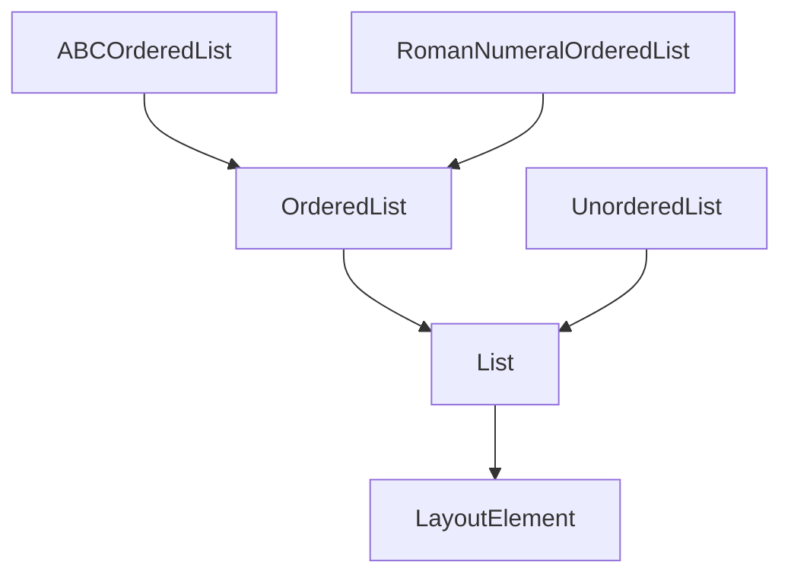
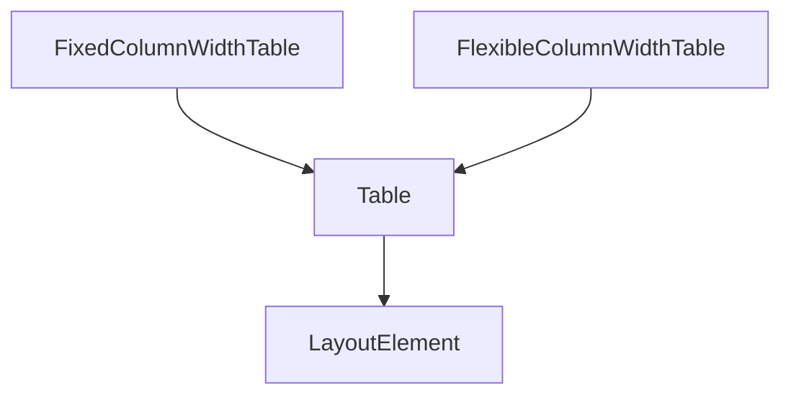
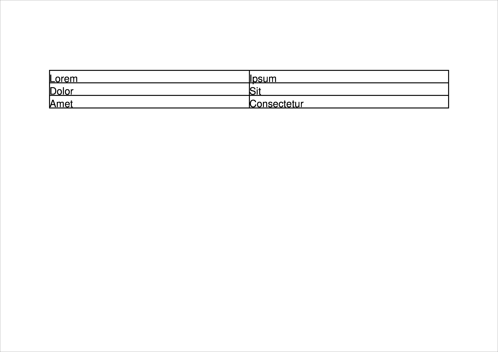

# 6. Exploring `Table` and `List` 📋


In the previous sections you've worked with a single `LayoutElement` on its own. A `Paragraph`, an `Image`, a `Barcode` or a `Shape`.
But being able to combine them, in tables or lists can be very useful. And `borb` makes it very easy to do so.

## 6.1 Working with `List`

Lists are essential components for structuring content in PDF documents. They are used to organize information in a clear and reader-friendly manner. Whether you need a simple bullet list or a complex, nested outline, borb provides a variety of list classes to accommodate different formatting needs.

## 6.1.1 The `List` class hierarchy



Each of these classes provides flexibility in structuring list-based content in PDFs. For instance, if you want a nested list with Roman numerals at the top level and bullet points at the sub-level, you can use `RomanNumeralOrderedList` with nested `UnorderedList` items.

### 6.1.2 Using `OrderedList`

If you need to include an ordered list in your PDF document, `borb` provides a straightforward way to do so with its `OrderedList` class. This class allows you to create lists where each item is numbered automatically, which is useful for structuring content sequentially. The following example demonstrates how to use this class.

```python
# snippet_06_01.ipynb
from borb.pdf import (
    Document,
    OrderedList,
    Page,
    PageLayout,
    Paragraph,
    PDF,
    SingleColumnLayout,
)

# Create an empty Document
d: Document = Document()

# Create an empty Page
p: Page = Page()
d.append_page(p)

# Create a PageLayout
l: PageLayout = SingleColumnLayout(p)

# Add a OrderedList
l.append_layout_element(
    OrderedList()
    .append_layout_element(Paragraph(text="Lorem"))
    .append_layout_element(Paragraph(text="Ipsum"))
    .append_layout_element(Paragraph(text="Dolor"))
)

# Write the PDF
PDF.write(what=d, where_to="output.pdf")

```

<a href="https://colab.research.google.com/github/jorisschellekens/borb-examples/blob/master/06/ipynb/snippet_06_01.ipynb" target="_parent"></a>


In this example, an ordered list is added to your PDF document using the `OrderedList` class. Here's how it works:

1. **Import**: Begin by importing the necessary classes from `borb.pdf`, including `OrderedList` and `Chunk`. These imports set up the environment to create textual content and organize it into lists within the PDF.

2. Creating an `OrderedList`: The `OrderedList` class is instantiated to create a new ordered list element. This list will automatically number each item added to it.

3. Adding Items to the `OrderedList`: The `append_layout_element` method is used to add `Chunk` elements to the `OrderedList`. Each `Paragraph` represents a piece of text:
- `Paragraph(text="Lorem")`
- `Paragraph(text="Ipsum")`
- `Paragraph(text="Dolor")`

By chaining the `append_layout_element` method, you can add multiple items to the list in sequence. Each item will appear as a numbered entry in the PDF.

4. **Integration**: The entire `OrderedList` is added to the layout using the `append_layout_element` method of the `SingleColumnLayout`. This method integrates the list into the PDF's content flow, ensuring it is displayed correctly in the document.

By using the `OrderedList` class, you can effectively incorporate structured, numbered lists into your PDF documents, enhancing readability and organization. This is particularly useful for creating instructions, steps, or any content that benefits from a sequential format.

### 6.1.3 Using `ABCOrderedList`

If you want to include an ordered list in your PDF document that uses letters instead of numbers (e.g., A, B, C, ...), `borb` provides the `ABCOrderedList` class. This class allows you to create lists where each item is labeled with uppercase or lowercase letters, which can be useful for certain types of content organization. The following example demonstrates how to use the `ABCOrderedList` class to add such a list to a PDF.

```python
# snippet_06_02.ipynb
from borb.pdf import (
    ABCOrderedList,
    Document,
    Page,
    PageLayout,
    Paragraph,
    PDF,
    SingleColumnLayout,
)

# Create an empty Document
d: Document = Document()

# Create an empty Page
p: Page = Page()
d.append_page(p)

# Create a PageLayout
l: PageLayout = SingleColumnLayout(p)

# Add a ABCOrderedList
l.append_layout_element(
    ABCOrderedList()
    .append_layout_element(Paragraph(text="Lorem"))
    .append_layout_element(Paragraph(text="Ipsum"))
    .append_layout_element(Paragraph(text="Dolor"))
)

# Write the PDF
PDF.write(what=d, where_to="output.pdf")

```

<a href="https://colab.research.google.com/github/jorisschellekens/borb-examples/blob/master/06/ipynb/snippet_06_02.ipynb" target="_parent"></a>


In this example, an alphabetically ordered list is added to the PDF document using the ABCOrderedList class. Here's how it works:

1. Import: Begin by importing the necessary classes from `borb.pdf`, including `ABCOrderedList` and `Chunk`. These imports prepare the environment to create textual content and organize it into alphabetically ordered lists within the PDF.
2. Creating an `ABCOrderedList`: The `ABCOrderedList` class is instantiated to create a new list element that labels each item with letters instead of numbers. By default, it starts with uppercase letters (A, B, C, ...).
3. Adding Items to the `ABCOrderedList`: The `append_layout_element` method is used to add `Chunk` elements to the `ABCOrderedList`. Each `Chunk` represents a piece of text. By chaining the `append_layout_element` method, you can add multiple items to the list sequentially. Each item will appear as a lettered entry in the PDF.
4. Integration: The entire `ABCOrderedList` is added to the layout using the `append_layout_element` method of the `SingleColumnLayout`. This method integrates the list into the PDF's content flow, ensuring it is displayed correctly in the document.


### 6.1.4 Using `RomanNumeralOrderedList`

To include an ordered list in your PDF document that uses Roman numerals (I, II, III, ...), you can use the `RomanNumeralOrderedList` class provided by `borb`. This class allows you to create lists where each item is labeled with Roman numerals, which can be useful for formal documents or outlines. Here's how you can use the `RomanNumeralOrderedList` class:

```python
# snippet_06_03.ipynb
from borb.pdf import (
    Document,
    Page,
    PageLayout,
    Paragraph
    PDF,
    RomanNumeralOrderedList,
    SingleColumnLayout,
)

# Create an empty Document
d: Document = Document()

# Create an empty Page
p: Page = Page()
d.append_page(p)

# Create a PageLayout
l: PageLayout = SingleColumnLayout(p)

# Add a RomanNumeralOrderedList
l.append_layout_element(
    RomanNumeralOrderedList()
    .append_layout_element(Paragraph(text="Lorem"))
    .append_layout_element(Paragraph(text="Ipsum"))
    .append_layout_element(Paragraph(text="Dolor"))
)

# Write the PDF
PDF.write(what=d, where_to="output.pdf")

```

<a href="https://colab.research.google.com/github/jorisschellekens/borb-examples/blob/master/06/ipynb/snippet_06_03.ipynb" target="_parent"></a>


### 6.1.5 Using `UnorderedList`

To include an unordered list in your PDF document, you can use the `UnorderedList` class provided by `borb`. This class allows you to create lists where each item is marked with a bullet point, which is useful for denoting items without implying any particular order. Here's how you can use the `UnorderedList` class:

```python
# snippet_06_04.ipynb
from borb.pdf import (
    Document,
    Page,
    PageLayout,
    Paragraph,
    PDF,
    SingleColumnLayout,
    UnorderedList,
)

# Create an empty Document
d: Document = Document()

# Create an empty Page
p: Page = Page()
d.append_page(p)

# Create a PageLayout
l: PageLayout = UnorderedList(p)

# Add a RomanNumeralUnorderedList
l.append_layout_element(
    UnorderedList()
    .append_layout_element(Paragraph(text="Lorem"))
    .append_layout_element(Paragraph(text="Ipsum"))
    .append_layout_element(Paragraph(text="Dolor"))
)

# Write the PDF
PDF.write(what=d, where_to="output.pdf")

```

<a href="https://colab.research.google.com/github/jorisschellekens/borb-examples/blob/master/06/ipynb/snippet_06_04.ipynb" target="_parent"></a>


### 6.1.6 Nesting a `List` inside another `List`

You can create nested lists in your PDF documents using `borb` by including one `List` inside another. This allows you to represent hierarchical structures, such as subpoints under main points, in a clear and organized manner. Here's how you can nest an `OrderedList` inside another `OrderedList`:

```python
# snippet_06_05.ipynb
from borb.pdf import (
    Document,
    OrderedList,
    Page,
    PageLayout,
    Paragraph,
    PDF,
    SingleColumnLayout,
)

# Create an empty Document
d: Document = Document()

# Create an empty Page
p: Page = Page()
d.append_page(p)

# Create a PageLayout
l: PageLayout = SingleColumnLayout(p)

# Add a OrderedList
l.append_layout_element(
    OrderedList()
    .append_layout_element(
        OrderedList()
        .append_layout_element(Paragraph(text="Lorem"))
        .append_layout_element(Paragraph(text="Ipsum"))
        .append_layout_element(Paragraph(text="Dolor"))
    )
    .append_layout_element(Paragraph(text="Ipsum"))
    .append_layout_element(Paragraph(text="Dolor"))
)

# Write the PDF
PDF.write(what=d, where_to="output.pdf")

```

<a href="https://colab.research.google.com/github/jorisschellekens/borb-examples/blob/master/06/ipynb/snippet_06_05.ipynb" target="_parent"></a>


To nest an `OrderedList` inside another `OrderedList` using `borb`, follow these steps:

1. Instantiate the Outer `OrderedList`: Create the outer list that will contain all top-level items and any nested lists.

2. Instantiate the Inner `OrderedList`: Create the inner list that you want to nest within the outer list. This inner list will serve as a sublist under a specific item in the outer list.

3. Populate the Inner `OrderedList`: Add items to the inner list using the `append_layout_element` method. Each item can be a `Chunk` or any other layout element.

4. Nest the Inner `OrderedList` into the Outer `OrderedList`: Add the inner list to the outer list using `append_layout_element`. By treating the inner list as an item of the outer list, you effectively nest it under the outer list's structure.

5. Add Additional Items to the Outer `OrderedList`: Continue adding items to the outer list as needed. These items will be at the same hierarchical level as the nested inner list.

6. Integrate the Outer `OrderedList` into the Document Layout: Add the fully constructed outer list, which now includes the nested inner list, to the document's layout using the appropriate method (e.g., `append_layout_element` on a `SingleColumnLayout`).

By executing these steps, you create a nested list where the inner `OrderedList` is properly indented and hierarchically organized within the outer `OrderedList`. This approach allows you to represent complex list structures in your PDF document, enhancing the clarity and organization of your content.

## 6.2 Working with `Table`

In PDF documents, tables are vital tools for arranging and presenting data systematically. They structure information into rows and columns, which makes it easier for readers to comprehend and compare the data. Whether you require a table that seamlessly fits within your page layout or one that adjusts dynamically to its content, `borb` offers a selection of table classes and utilities to accommodate a wide range of formatting needs.

## 6.2.1 The `Table` class hierarchy



### 6.2.2 Using `FixedColumnWidthTable`

`FixedColumnWidthTable` is used when you want a table that occupies the full width of its parent container with columns of fixed widths. This ensures that the table spans the entire available width, distributing space evenly among columns, which is useful for consistent formatting in your PDF document.

```python
# snippet_06_06.ipynb
from borb.pdf import (
    Document,
    FixedColumnWidthTable,
    Page,
    PageLayout,
    Paragraph,
    PDF,
    SingleColumnLayout,
)

# Create an empty Document
d: Document = Document()

# Create an empty Page
p: Page = Page()
d.append_page(p)

# Create a PageLayout
l: PageLayout = SingleColumnLayout(p)

# Add a FixedColumnWidthTable
l.append_layout_element(
    FixedColumnWidthTable(number_of_columns=2, number_of_rows=3)
    .append_layout_element(Paragraph("Lorem"))
    .append_layout_element(Paragraph("Ipsum"))
    .append_layout_element(Paragraph("Dolor"))
    .append_layout_element(Paragraph("Sit"))
    .append_layout_element(Paragraph("Amet"))
    .append_layout_element(Paragraph("Consectetur"))
)

# Write the PDF
PDF.write(what=d, where_to="output.pdf")

```

<a href="https://colab.research.google.com/github/jorisschellekens/borb-examples/blob/master/06/ipynb/snippet_06_06.ipynb" target="_parent"></a>



Key parameters of `FixedColumnWidthTable`:
- `number_of_columns` (int): Specifies the number of columns in the table, determining how the horizontal space is divided. Each column receives an equal portion of the available width.
- `number_of_rows` (int): Specifies the number of rows in the table. The height of each row adjusts dynamically based on the content within the cells and the overall layout constraints.

After creating the table, you add content to it sequentially using `.append_layout_element()`.

### 6.2.3 `FlexibleColumnWidthTable`

Unlike `FixedColumnWidthTable`, which enforces equal column widths that collectively span the entire width of the parent container, `FlexibleColumnWidthTable` allows columns to expand or contract to fit their content, resulting in a table that may not necessarily fill the full width of the container but provides a more natural fit for the data.

```python
# snippet_06_07.ipynb
from borb.pdf import (
    Document,
    FlexibleColumnWidthTable,
    Page,
    PageLayout,
    Paragraph,
    PDF,
    SingleColumnLayout,
)

# Create an empty Document
d: Document = Document()

# Create an empty Page
p: Page = Page()
d.append_page(p)

# Create a PageLayout
l: PageLayout = SingleColumnLayout(p)

# Add a FlexibleColumnWidthTable
l.append_layout_element(
    FlexibleColumnWidthTable(number_of_columns=2, number_of_rows=3)
    .append_layout_element(Paragraph("Lorem"))
    .append_layout_element(Paragraph("Ipsum"))
    .append_layout_element(Paragraph("Dolor"))
    .append_layout_element(Paragraph("Sit"))
    .append_layout_element(Paragraph("Amet"))
    .append_layout_element(Paragraph("Consectetur"))
)

# Write the PDF
PDF.write(what=d, where_to="output.pdf")

```

<a href="https://colab.research.google.com/github/jorisschellekens/borb-examples/blob/master/06/ipynb/snippet_06_07.ipynb" target="_parent"></a>


Using `FlexibleColumnWidthTable`:

- Instantiation: Create a `FlexibleColumnWidthTable` by specifying the number of columns and rows, just like with `FixedColumnWidthTable`.

- Adding Content: Add content to the table cells sequentially. The table handles the arrangement and sizing, so you don't need to specify cell positions or dimensions.

### 6.2.4 Useful Methods on `Table`

`Table` objects come with a couple of useful methods:

- `no_borders`: removes all borders from the `Table`
- `no_external_borders`: removes all **external** borders from the `Table`
- `no_internal_borders`: removes all **internal** borders from the `Table`
- `set_padding_on_all_cells`: allows you to set padding consistently on all cells
- `striped`: sets the `TableCell` backgrounds to alternate between a light/dark color

```python
# snippet_06_08.ipynb
from borb.pdf import (
    Document,
    FlexibleColumnWidthTable,
    Page,
    PageLayout,
    Paragraph,
    PDF,
    SingleColumnLayout,
)

# Create an empty Document
d: Document = Document()

# Create an empty Page
p: Page = Page()
d.append_page(p)

# Create a PageLayout
l: PageLayout = SingleColumnLayout(p)

# Add a FlexibleColumnWidthTable
l.append_layout_element(
    FlexibleColumnWidthTable(number_of_columns=2, number_of_rows=3)
    .append_layout_element(Paragraph("Lorem"))
    .append_layout_element(Paragraph("Ipsum"))
    .append_layout_element(Paragraph("Dolor"))
    .append_layout_element(Paragraph("Sit"))
    .append_layout_element(Paragraph("Amet"))
    .append_layout_element(Paragraph("Consectetur"))
    .set_padding_on_all_cells(
        padding_bottom=5, padding_left=5, padding_right=5, padding_top=5
    )
    .no_borders()
    .striped()
)

# Write the PDF
PDF.write(what=d, where_to="output.pdf")

```

<a href="https://colab.research.google.com/github/jorisschellekens/borb-examples/blob/master/06/ipynb/snippet_06_08.ipynb" target="_parent"></a>


### 6.2.5 Going Low-Level with `TableCell`

Under the hood, when you add elements to a `Table in borb`, each element is automatically wrapped in a `TableCell` object (unless it's already a `TableCell`). By using `TableCell` directly, you gain more control over the properties of individual cells, such as padding, margin, borders, and the ability to span multiple rows or columns using `row_span` and `column_span`.

```python
# snippet_06_09.ipynb
from borb.pdf import (
    Document,
    FlexibleColumnWidthTable,
    Page,
    PageLayout,
    Paragraph,
    PDF,
    SingleColumnLayout,
    Table,
)

# Create an empty Document
d: Document = Document()

# Create an empty Page
p: Page = Page()
d.append_page(p)

# Create a PageLayout
l: PageLayout = SingleColumnLayout(p)

# Add a FlexibleColumnWidthTable
l.append_layout_element(
    FlexibleColumnWidthTable(number_of_columns=2, number_of_rows=3)
    .append_layout_element(Table.TableCell(Paragraph("Lorem Ipsum"), column_span=2))
    .append_layout_element(Paragraph("Dolor"))
    .append_layout_element(Paragraph("Sit"))
    .append_layout_element(Paragraph("Amet"))
    .append_layout_element(Paragraph("Consectetur"))
)

# Write the PDF
PDF.write(what=d, where_to="output.pdf")

```

<a href="https://colab.research.google.com/github/jorisschellekens/borb-examples/blob/master/06/ipynb/snippet_06_09.ipynb" target="_parent"></a>


In this example, a `FlexibleColumnWidthTable` with two columns and three rows is created. The key aspect is the use of `TableCell` to customize the table's cells.

Using `TableCell` with `column_span`:

- The first cell added to the table explicitly uses `TableCell`, containing a `Paragraph("Lorem Ipsum")` and setting `column_span=2`. This means the cell spans both columns, occupying the full width of the table in that row. By spanning multiple columns, you can create headers or sections that need more space.

### 6.2.6 Adding other content

In the previous examples, we've always added text to `List` and `Table`, but of course you can add other content as well.
In fact you can add any `LayoutElement` (including other `List` and `Table` objects).
In this example we're going to create a `Table` containing some `Image` and `Paragraph` objects.

```python
# snippet_06_10.ipynb
from borb.pdf import (
    Document,
    FlexibleColumnWidthTable,
    Image,
    Page,
    PageLayout,
    Paragraph,
    PDF,
    SingleColumnLayout,
    Standard14Fonts
)

# Create an empty Document
d: Document = Document()

# Create an empty Page
p: Page = Page()
d.append_page(p)

# Create a PageLayout
l: PageLayout = SingleColumnLayout(p)

# Add a FlexibleColumnWidthTable
l.append_layout_element(
    FlexibleColumnWidthTable(number_of_columns=3, number_of_rows=3)
    .append_layout_element(Paragraph("Painting", font=Standard14Fonts.get("Helvetica-Bold")))
    .append_layout_element(Paragraph("Title", font=Standard14Fonts.get("Helvetica-Bold")))
    .append_layout_element(Paragraph("Artist", font=Standard14Fonts.get("Helvetica-Bold")))
    .append_layout_element(Image('https://uploads2.wikiart.org/images/katsushika-hokusai/hydrangea-and-swallow.jpg!Large.jpg', size=(200, 200)))
    .append_layout_element(Paragraph("Hydrangea and Swallow"))
    .append_layout_element(Paragraph("Katsushika Hokusai"))
    .append_layout_element(Image('https://uploads4.wikiart.org/images/shotei-takahashi/peony-and-paddy-birds-1926.jpg', size=(200, 200)))
    .append_layout_element(Paragraph("Peony and Paddy Birds"))
    .append_layout_element(Paragraph("Shotei Takahashi"))
    .set_padding_on_all_cells(padding_bottom=4, padding_left=4, padding_right=4, padding_top=4)
    .no_external_borders()
)

# Write the PDF
PDF.write(what=d, where_to="output.pdf")

```

<a href="https://colab.research.google.com/github/jorisschellekens/borb-examples/blob/master/06/ipynb/snippet_06_10.ipynb" target="_parent"></a>


---

## 6.3 Section Recap

- **Working with `List`**:
    - `OrderedList`: Create a numbered list (1, 2, 3, ...).
    - `ABCOrderedList`: Create an alphabetically ordered list (A, B, C, ...).
    - `RomanNumeralOrderedList`: Create a list numbered with Roman numerals (I, II, III, ...).
    - `UnorderedList`: Create a bullet-pointed list without specific ordering.
- **Nesting lists**: Place one `List` inside another to create hierarchical structures.
- **Working with `Table`**:
    - `FixedColumnWidthTable`: Create a table that occupies the full width of its container with equal column widths.
    - `FlexibleColumnWidthTable`: Create a table where column widths adjust dynamically based on their content.
- **Useful methods on `Table`**:
    - `no_borders()`: Remove all borders from the table.
    - `no_external_borders()`: Remove borders from the outer edges of the table.
    - `no_internal_borders()`: Remove borders between the internal cells of the table.
    - `set_padding_on_all_cells(padding)`: Apply consistent padding to all cells in the table.
    - `striped()`: Alternate the background color of table rows for a striped effect.
- **`TableCell`**: Customize individual table cells with properties like `row_span`, `column_span`, padding, and borders.


