# Using `SmartArt`


`SmartArt` is a utility class in `borb` that offers a convenient way to build diagrams for a process, a stylized list of items, a pros/cons breakdown and so on.
It uses all of the classes you've already seen (`List`, `Table`, `Shape` objects from `LineArt`, `Paragraph`, `Image`, etc).
It allows some degree of configuration to ensure the produced `LayoutElement` matches your document look-and-feel.

Let's look at some examples:

## 7.1 Displaying a process 

### 7.1.1 Displaying a process using `bending_process`

This code snippet demonstrates how to create a SmartArt-like process diagram in a PDF using the borb library. The resulting diagram visually represents a sequence of connected elements, showing their relationships through directional arrows.

This type of visualization is useful for illustrating workflows, hierarchies, or dependencies in a structured manner. The generated output ensures clarity by organizing elements logically, making it easier to interpret the flow of information at a glance.

```python
# snippet_07_01.ipynb
from borb.pdf import Document, Page, PageLayout, PDF, SingleColumnLayout, SmartArt

# create a new Document
d: Document = Document()

# create a new Page
p: Page = Page()
d.append_page(p)

# use a PageLayout
l: PageLayout = SingleColumnLayout(p)

# create and add a piece of SmartArt
l.append_layout_element(
    SmartArt.bending_process(
        level_1_items=[
            "Vitamin C",
            "Potassium",
            "Vitamin A",
            "Healthy Fats",
            "Fiber",
            "Manganese",
            "Vitamin D",
        ],
    )
)

# store the PDF
PDF.write(what=d, where_to="output.pdf")

```

<a href="https://colab.research.google.com/github/jorisschellekens/birb-examples/blob/main/07/ipynb/snippet_07_01.ipynb" target="_parent"></a>

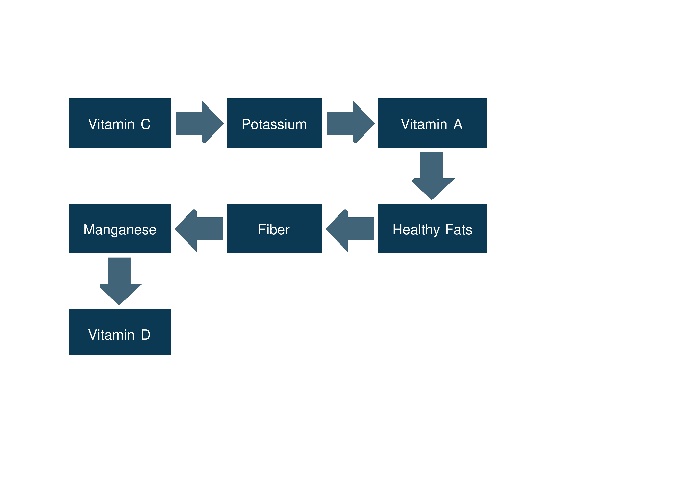

You can of course change various properties of the `LayoutElement` produced by `SmartArt`.

- `background_color`
- `level_1_font_color`
- `level_1_font_size`

Let's look at a practical example:

```python
# snippet_07_02.ipynb
from borb.pdf import (
    Document,
    Page,
    PageLayout,
    PDF,
    SingleColumnLayout,
    SmartArt,
    X11Color,
)

# create a new Document
d: Document = Document()

# create a new Page
p: Page = Page()
d.append_page(p)

# use a PageLayout
l: PageLayout = SingleColumnLayout(p)

# create and add a piece of SmartArt
l.append_layout_element(
    SmartArt.bending_process(
        level_1_items=[
            "Vitamin C",
            "Potassium",
            "Vitamin A",
            "Healthy Fats",
            "Fiber",
            "Manganese",
            "Vitamin D",
        ],
        background_color=X11Color.YELLOW_MUNSELL,
        level_1_font_color=X11Color.BLACK,
    )
)

# store the PDF
PDF.write(what=d, where_to="output.pdf")

```

<a href="https://colab.research.google.com/github/jorisschellekens/birb-examples/blob/main/07/ipynb/snippet_07_02.ipynb" target="_parent"></a>

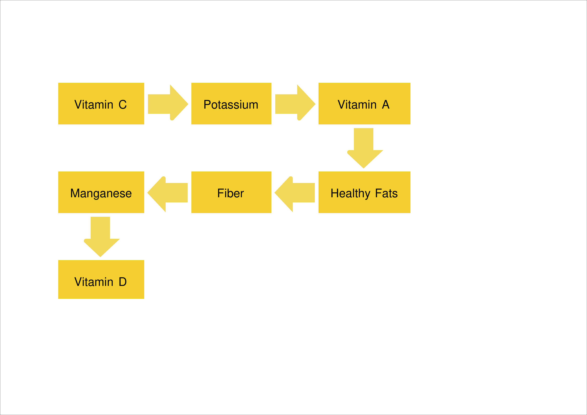

### 7.1.2 Displaying a process using `horizontal_process`

This example demonstrates how to generate a horizontally structured process diagram in a PDF using the borb library. The resulting visualization arranges elements in a linear sequence from left to right, with arrows indicating progression from one step to the next.

This layout is particularly useful for representing straightforward workflows, timelines, or step-by-step instructions, ensuring clarity by presenting information in a clear, left-to-right flow.

```python
# snippet_07_03.ipynb
from borb.pdf import Document, Page, PageLayout, PDF, SingleColumnLayout, SmartArt

# create a new Document
d: Document = Document()

# create a new Page
p: Page = Page()
d.append_page(p)

# use a PageLayout
l: PageLayout = SingleColumnLayout(p)

# create and add a piece of SmartArt
l.append_layout_element(
    SmartArt.horizontal_process(
        level_1_items=[
            "Vitamin C",
            "Potassium",
            "Vitamin A",
        ],
    )
)

# store the PDF
PDF.write(what=d, where_to="output.pdf")

```

<a href="https://colab.research.google.com/github/jorisschellekens/birb-examples/blob/main/07/ipynb/snippet_07_03.ipynb" target="_parent"></a>

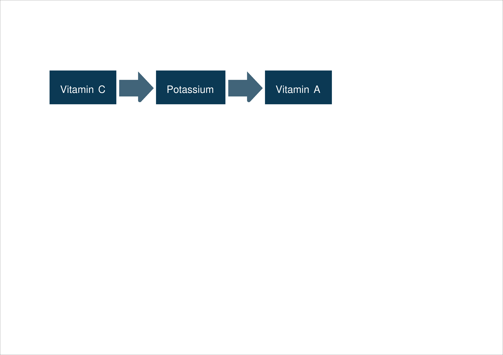

### 7.1.3 Displaying a process using `horizontal_pie_process`

This example demonstrates how to create a horizontal pie process diagram in a PDF using the borb library. The resulting visualization consists of multiple labeled sections, each featuring a circular icon that progressively fills to indicate the step's position in the sequence.

This type of diagram is useful for illustrating step-by-step progressions, where the filling of the pie visually reinforces the advancement through stages. It provides a clear and structured way to represent processes while maintaining an intuitive and easy-to-follow format.

```python
# snippet_07_04.ipynb
from borb.pdf import Document, Page, PageLayout, PDF, SingleColumnLayout, SmartArt

# create a new Document
d: Document = Document()

# create a new Page
p: Page = Page()
d.append_page(p)

# use a PageLayout
l: PageLayout = SingleColumnLayout(p)

# create and add a piece of SmartArt
l.append_layout_element(
    SmartArt.horizontal_pie_process(
        level_1_items=["Cherries", "Papaya"],
        level_2_items=[
            ["Vitamin C", "Potassium"],
            ["Vitamin C", "Vitamin A"],
        ],
    )
)

# store the PDF
PDF.write(what=d, where_to="output.pdf")

```

<a href="https://colab.research.google.com/github/jorisschellekens/birb-examples/blob/main/07/ipynb/snippet_07_04.ipynb" target="_parent"></a>

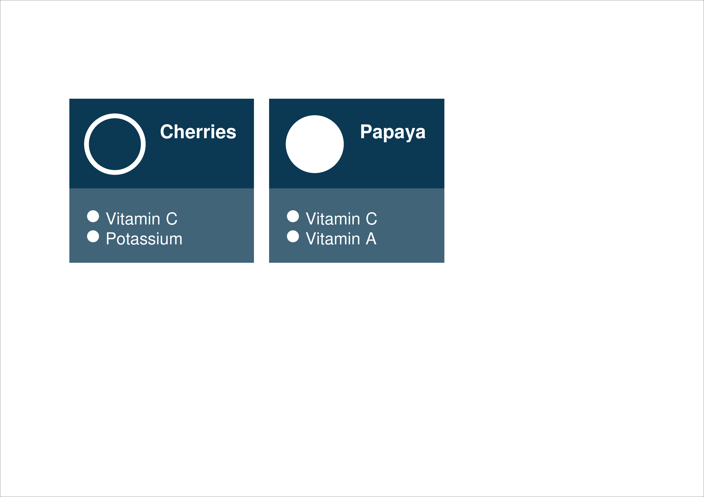

### 7.1.4 Displaying a process using `vertical_process`

This example demonstrates how to create a vertical process diagram in a PDF using the borb library. The resulting visualization presents a sequence of steps arranged in a top-to-bottom flow, with each step enclosed in a rectangular block and connected by arrows.

This format is particularly useful for representing hierarchical or step-by-step processes where the order of progression is crucial. The clear downward flow makes it easy to follow, making it well-suited for illustrating workflows, decision trees, or structured instructions.

```python
# snippet_07_05.ipynb
from borb.pdf import Document, Page, PageLayout, PDF, SingleColumnLayout, SmartArt

# create a new Document
d: Document = Document()

# create a new Page
p: Page = Page()
d.append_page(p)

# use a PageLayout
l: PageLayout = SingleColumnLayout(p)

# create and add a piece of SmartArt
l.append_layout_element(
    SmartArt.vertical_process(
        level_1_items=[
            "Vitamin C",
            "Potassium",
            "Vitamin A",
            "Healthy Fats",
            "Fiber",
            "Manganese",
            "Vitamin D",
        ],
    )
)

# store the PDF
PDF.write(what=d, where_to="snippet_07_05.pdf")

```

<a href="https://colab.research.google.com/github/jorisschellekens/birb-examples/blob/main/07/ipynb/snippet_07_05.ipynb" target="_parent"></a>

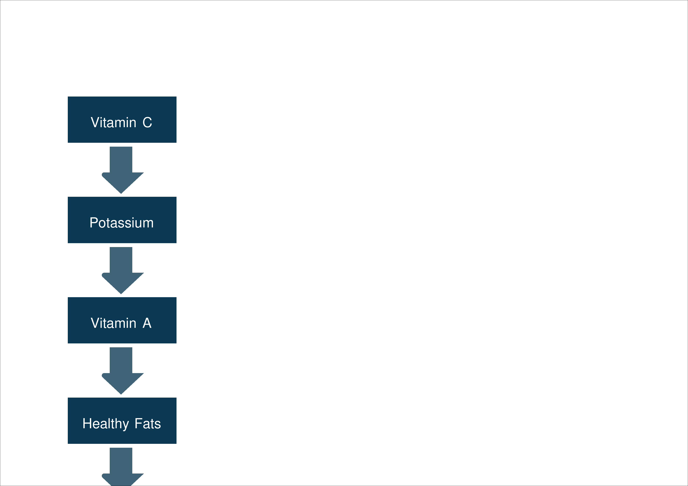

## 7.2 Displaying a list

### 7.2.1 Displaying a list using `block_list`

This example showcases a horizontally structured list where items are arranged in an ascending layout. Each item is placed in a separate rectangular block, visually organizing multiple elements in a structured yet non-hierarchical manner.

This layout is useful for categorizing related elements without implying a strict order. It works well for presenting grouped information, such as key components of a topic, parallel concepts, or categories within a dataset.

```python
# snippet_07_06.ipynb
from borb.pdf import Document, Page, PageLayout, PDF, SingleColumnLayout, SmartArt

# create a new Document
d: Document = Document()

# create a new Page
p: Page = Page()
d.append_page(p)

# use a PageLayout
l: PageLayout = SingleColumnLayout(p)

# create and add a piece of SmartArt
l.append_layout_element(
    SmartArt.block_list(
        level_1_items=[
            "Vitamin C",
            "Potassium",
            "Vitamin A",
            "Healthy Fats",
            "Fiber",
            "Manganese",
            "Vitamin D",
        ],
    )
)

# store the PDF
PDF.write(what=d, where_to="output.pdf")

```

<a href="https://colab.research.google.com/github/jorisschellekens/birb-examples/blob/main/07/ipynb/snippet_07_06.ipynb" target="_parent"></a>

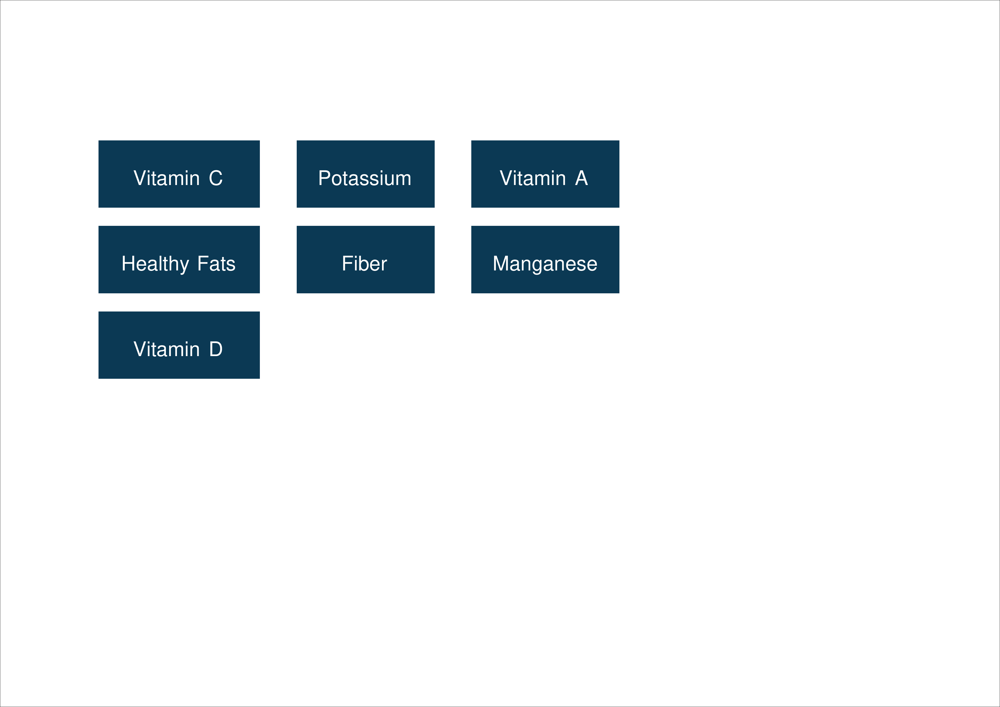

### 7.2.2 Displaying a list using `horizontal_ascending_list`

This SmartArt visualization takes the form of a stacked pyramid, where each block represents a category or key piece of information. The topmost block is the smallest, and as the pyramid descends, the blocks become progressively larger. This structure naturally emphasizes a hierarchical or progressive relationship, with the most fundamental or foundational elements at the base and more specific or refined elements at the top.

This type of visualization is particularly useful in scenarios where information builds upon previous layers. It can be applied to nutritional education, illustrating the most essential nutrients needed for a balanced diet. Similarly, it works well in business strategy to represent steps in a process, such as a growth model or competency framework. Additionally, this pyramid format is effective for conceptual models, such as Maslow’s hierarchy of needs, where fundamental needs form the base, supporting higher-level aspirations at the top.

```python
# snippet_07_07.ipynb
from borb.pdf import Document, Page, PageLayout, PDF, SingleColumnLayout, SmartArt

# create a new Document
d: Document = Document()

# create a new Page
p: Page = Page()
d.append_page(p)

# use a PageLayout
l: PageLayout = SingleColumnLayout(p)

# create and add a piece of SmartArt
l.append_layout_element(
    SmartArt.horizontal_ascending_list(
        level_1_items=[
            "Vitamin C",
            "Potassium",
            "Vitamin A",
            "Healthy Fats",
            "Fiber",
            "Manganese",
            "Vitamin D",
        ],
    )
)

# store the PDF
PDF.write(what=d, where_to="output.pdf")

```

<a href="https://colab.research.google.com/github/jorisschellekens/birb-examples/blob/main/07/ipynb/snippet_07_07.ipynb" target="_parent"></a>

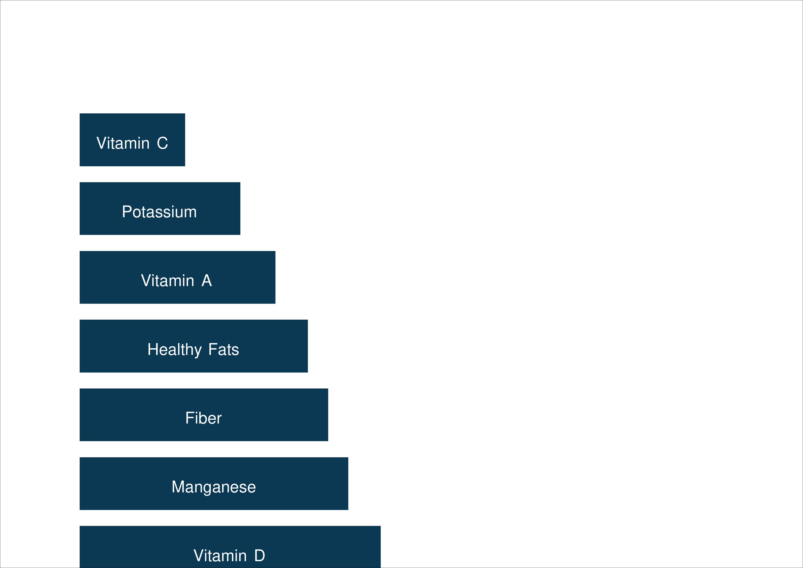

### 7.2.3 Displaying a list using `horizontal_bullet_list`

This SmartArt visualization is a horizontal bullet list, where each main category (in this case, "Cherries" and "Papaya") is represented as a separate block. Below each category, bullet points list relevant attributes or key details, such as the vitamins and nutrients associated with each fruit. The design is clean and structured, making it easy to compare information at a glance.

This type of visualization is particularly useful for categorizing and comparing elements that share similar characteristics. It could be used in nutritional guides, product feature comparisons, or even task breakdowns in project management. By presenting information in a side-by-side format, this SmartArt makes it easy to identify commonalities and differences, aiding quick decision-making.

```python
# snippet_07_08.ipynb
from borb.pdf import Document, Page, PageLayout, PDF, SingleColumnLayout, SmartArt

# create a new Document
d: Document = Document()

# create a new Page
p: Page = Page()
d.append_page(p)

# use a PageLayout
l: PageLayout = SingleColumnLayout(p)

# create and add a piece of SmartArt
l.append_layout_element(
    SmartArt.horizontal_bullet_list(
        level_1_items=["Cherries", "Papaya"],
        level_2_items=[
            ["Vitamin C", "Potassium"],
            ["Vitamin C", "Vitamin A"],
        ],
    )
)

# store the PDF
PDF.write(what=d, where_to="output.pdf")

```

<a href="https://colab.research.google.com/github/jorisschellekens/birb-examples/blob/main/07/ipynb/snippet_07_08.ipynb" target="_parent"></a>

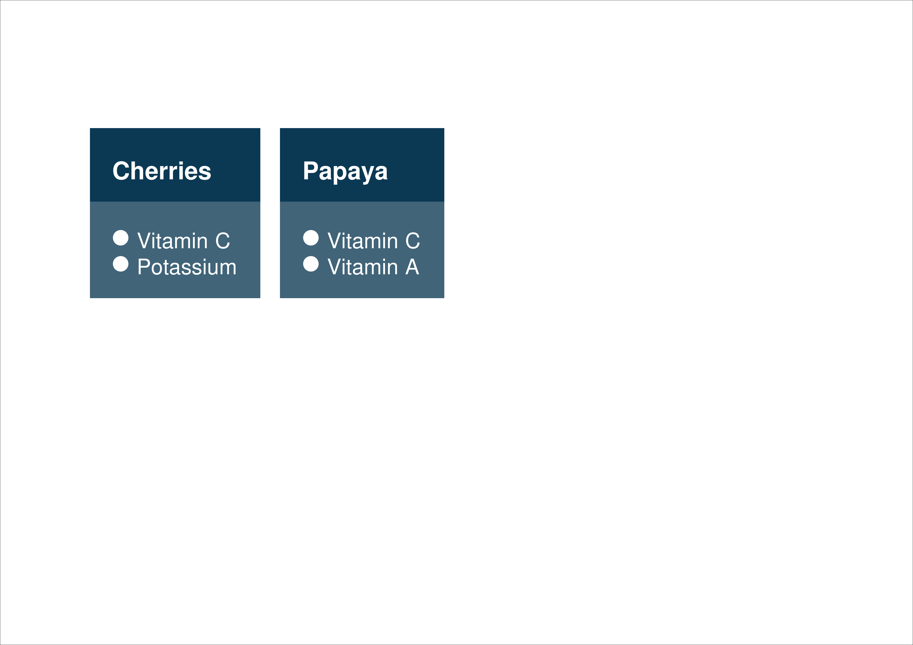

### 7.2.4 Displaying a list using `horizontal_descending_list`

This SmartArt visualization represents a pyramid-like stacked list, where each block is positioned on top of another, forming a tapered structure. The topmost block is the smallest, while the bottom block is the widest, creating a visual hierarchy. The elements listed—such as "Vitamin C," "Potassium," and "Healthy Fats"—suggest a structured categorization, possibly indicating importance, abundance, or hierarchy in some way.

This type of visualization is particularly useful for prioritizing or ranking information. It could be used in nutrition guides to represent the relative importance of nutrients, in business strategy to illustrate a hierarchy of goals or values, or even in education to show the building blocks of a concept. The pyramid shape naturally guides the viewer’s attention from the most critical information at the bottom to more specific or refined details at the top.

```python
# snippet_07_09.ipynb
from borb.pdf import Document, Page, PageLayout, PDF, SingleColumnLayout, SmartArt

# create a new Document
d: Document = Document()

# create a new Page
p: Page = Page()
d.append_page(p)

# use a PageLayout
l: PageLayout = SingleColumnLayout(p)

# create and add a piece of SmartArt
l.append_layout_element(
    SmartArt.horizontal_descending_list(
        level_1_items=[
            "Vitamin C",
            "Potassium",
            "Vitamin A",
            "Healthy Fats",
            "Fiber",
            "Manganese",
            "Vitamin D",
        ],
    )
)

# store the PDF
PDF.write(what=d, where_to="output.pdf")

```

<a href="https://colab.research.google.com/github/jorisschellekens/birb-examples/blob/main/07/ipynb/snippet_07_09.ipynb" target="_parent"></a>

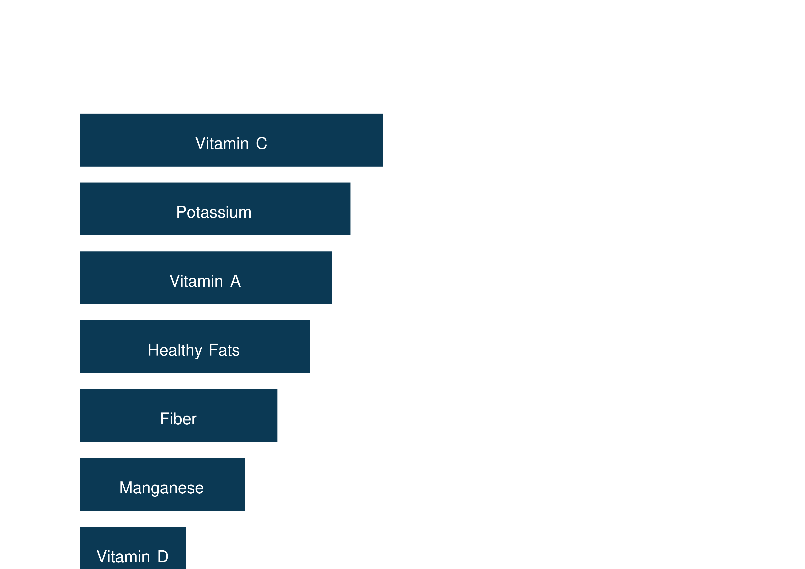

### 7.2.5 Displaying a list using `horizontal_picture_list`

This SmartArt visualization is a horizontal picture list, where each category (e.g., "Cherries" and "Papaya") is represented by an image and accompanying text. The items are arranged in a structured manner, with key nutrients (such as "Vitamin C" and "Potassium") listed as bullet points below each image. The use of pictures enhances visual engagement, making it easier to associate each category with its corresponding elements.

This type of visualization is particularly useful in educational materials, product catalogs, and presentations, where visual reinforcement helps in conveying information more effectively. It can be applied in nutrition guides, marketing brochures, or training materials to illustrate key features of different items concisely. The inclusion of images adds an intuitive layer of understanding, making the content more engaging and accessible to audiences.

```python
# snippet_07_10.ipynb
from borb.pdf import Document, Page, PageLayout, SingleColumnLayout, SmartArt

# create a new Document
d: Document = Document()

# create a new Page
p: Page = Page()
d.append_page(p)

# use a PageLayout
l: PageLayout = SingleColumnLayout(p)

# create and add a piece of SmartArt
l.append_layout_element(
    SmartArt.horizontal_picture_list(
        pictures=[
            "https://images.unsplash.com/photo-1559181567-c3190ca9959b",
            "https://images.unsplash.com/photo-1517282009859-f000ec3b26fe",
        ],
        level_1_items=["Cherries", "Papaya"],
        level_2_items=[
            ["Vitamin C", "Potassium"],
            ["Vitamin C", "Vitamin A"],
        ],
        picture_size=(64, 64),
    )
)

# store the PDF
PDF.write(what=d, where_to="output.pdf")


```

<a href="https://colab.research.google.com/github/jorisschellekens/birb-examples/blob/main/07/ipynb/snippet_07_10.ipynb" target="_parent"></a>

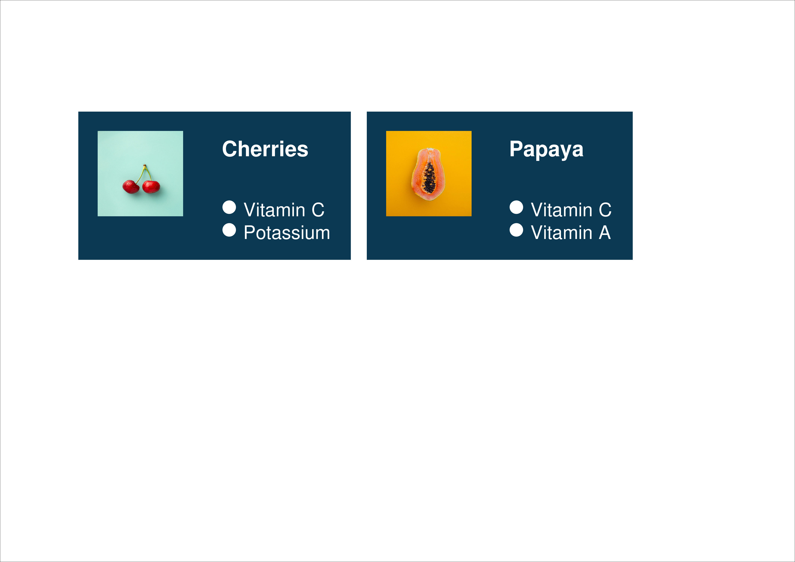

### 7.2.6 Displaying a list using `inverted_pyramid`

```python
# snippet_07_11.ipynb
from borb.pdf import Document, Page, PageLayout, SingleColumnLayout, SmartArt

# create a new Document
d: Document = Document()

# create a new Page
p: Page = Page()
d.append_page(p)

# use a PageLayout
l: PageLayout = SingleColumnLayout(p)

# create and add a piece of SmartArt
l.append_layout_element(
    SmartArt.inverted_pyramid(
        level_1_items=[
            "Vitamin C",
            "Potassium",
            "Vitamin A",
            "Healthy Fats",
            "Fiber",
            "Manganese",
            "Vitamin D",
        ],
    )
)

# store the PDF
PDF.write(what=d, where_to="output.pdf")

```

<a href="https://colab.research.google.com/github/jorisschellekens/birb-examples/blob/main/07/ipynb/snippet_07_11.ipynb" target="_parent"></a>


### 7.2.7 Displaying a list using `pyramid`

```python
# snippet_07_12.ipynb
from borb.pdf import Document, Page, PageLayout, SingleColumnLayout, SmartArt

# create a new Document
d: Document = Document()

# create a new Page
p: Page = Page()
d.append_page(p)

# use a PageLayout
l: PageLayout = SingleColumnLayout(p)

# create and add a piece of SmartArt
l.append_layout_element(
    SmartArt.pyramid(
        level_1_items=[
            "Vitamin C",
            "Potassium",
            "Vitamin A",
            "Healthy Fats",
            "Fiber",
            "Manganese",
            "Vitamin D",
        ],
    )
)

# store the PDF
PDF.write(what=d, where_to="output.pdf")

```

<a href="https://colab.research.google.com/github/jorisschellekens/birb-examples/blob/main/07/ipynb/snippet_07_12.ipynb" target="_parent"></a>

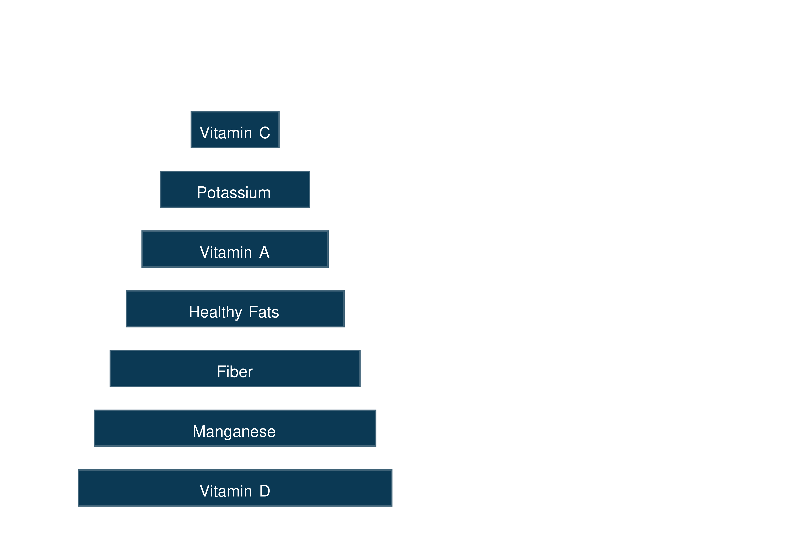

### 7.2.8 Displaying a list using `vertical_bullet_list`

```python
# snippet_07_13.ipynb
from borb.pdf import Document, Page, PageLayout, SingleColumnLayout, SmartArt

# create a new Document
d: Document = Document()

# create a new Page
p: Page = Page()
d.append_page(p)

# use a PageLayout
l: PageLayout = SingleColumnLayout(p)

# create and add a piece of SmartArt
l.append_layout_element(
    SmartArt.vertical_bullet_list(
        level_1_items=["Cherries", "Papaya", "Avocado"],
        level_2_items=[
            ["Vitamin C", "Potassium"],
            ["Vitamin C", "Vitamin A"],
            ["Potassium", "Healthy Fats", "Fiber"],
        ],
    )
)

# store the PDF
PDF.write(what=d, where_to="output.pdf")

```

<a href="https://colab.research.google.com/github/jorisschellekens/birb-examples/blob/main/07/ipynb/snippet_07_13.ipynb" target="_parent"></a>

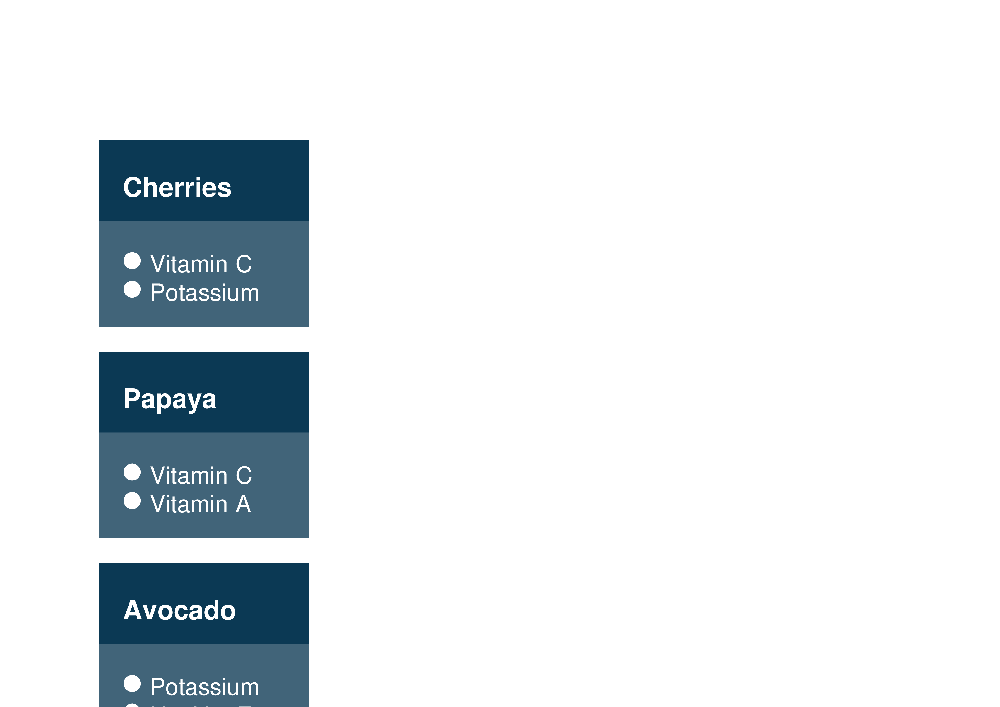

### 7.2.9 Displaying a list using `vertical_picture_list`

```python
# snippet_07_14.ipynb
from borb.pdf import Document, Page, PageLayout, SingleColumnLayout, SmartArt

# create a new Document
d: Document = Document()

# create a new Page
p: Page = Page()
d.append_page(p)

# use a PageLayout
l: PageLayout = SingleColumnLayout(p)

# create and add a piece of SmartArt
l.append_layout_element(
    SmartArt.vertical_picture_list(
        pictures=[
            "https://images.unsplash.com/photo-1559181567-c3190ca9959b",
            "https://images.unsplash.com/photo-1517282009859-f000ec3b26fe",
            "https://images.unsplash.com/photo-1523049673857-eb18f1d7b578",
        ],
        level_1_items=["Cherries", "Papaya", "Avocado"],
        level_2_items=[
            ["Vitamin C", "Potassium"],
            ["Vitamin C", "Vitamin A"],
            ["Potassium", "Healthy Fats", "Fiber"],
        ],
        picture_size=(64, 64),
    )
)

# store the PDF
PDF.write(what=d, where_to="output.pdf")

```

<a href="https://colab.research.google.com/github/jorisschellekens/birb-examples/blob/main/07/ipynb/snippet_07_14.ipynb" target="_parent"></a>

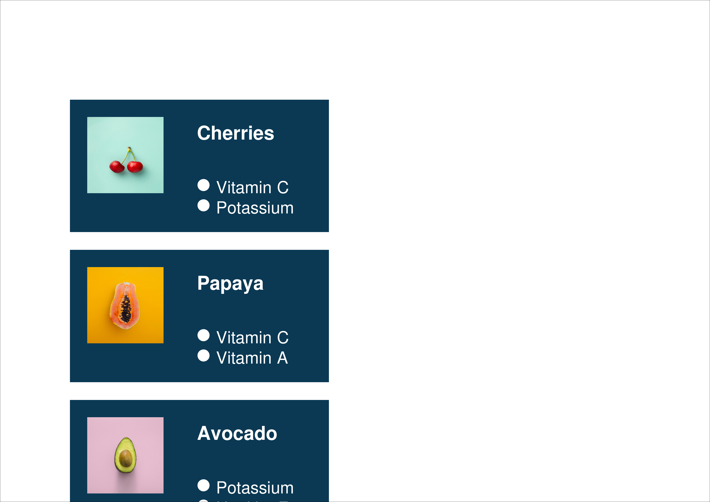

## Section Recap

- **Displaying a Process**:
    - `bending_process`: Create a flexible process diagram with customizable colors and fonts.
    - `horizontal_process`: Arrange process steps in a horizontal flow.
    - `horizontal_pie_process`: Display process steps using a pie chart-like structure.
    - `vertical_process`: Arrange process steps in a vertical sequence.

- **Displaying a List**:
    - `block_list`: Simple block-style list.
    - `horizontal_ascending_list`: Arrange items in a horizontally increasing sequence.
    - `horizontal_bullet_list`: Create a hierarchical bullet-pointed list.
    - `horizontal_descending_list`: Arrange items in a horizontally decreasing sequence.
    - `horizontal_picture_list`: Combine images with text in a horizontal layout.
    - `inverted_pyramid`: Display an inverted pyramid structure.
    - `pyramid`: Display a standard pyramid structure.
    - `vertical_bullet_list`: Create a multi-level vertical bullet list.
    - `vertical_picture_list`: Arrange images with text in a vertical format.

- **Key Features**:
    - Supports hierarchical structures for clear organization.
    - Customizable colors, fonts, and layout styles.
    - Ideal for presenting structured information in PDFs.

