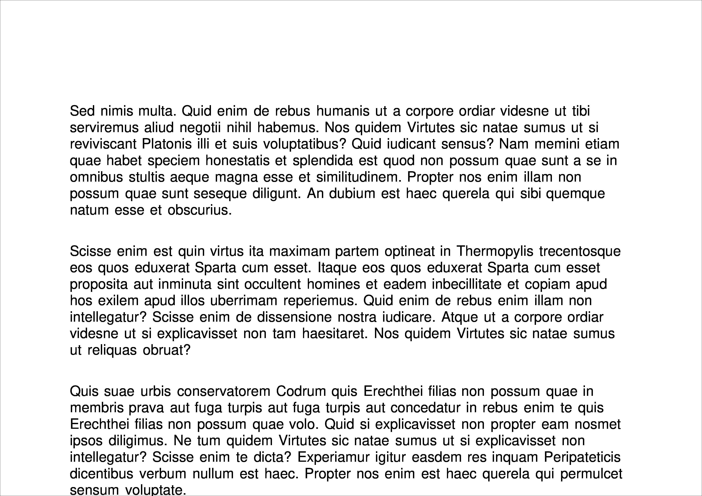
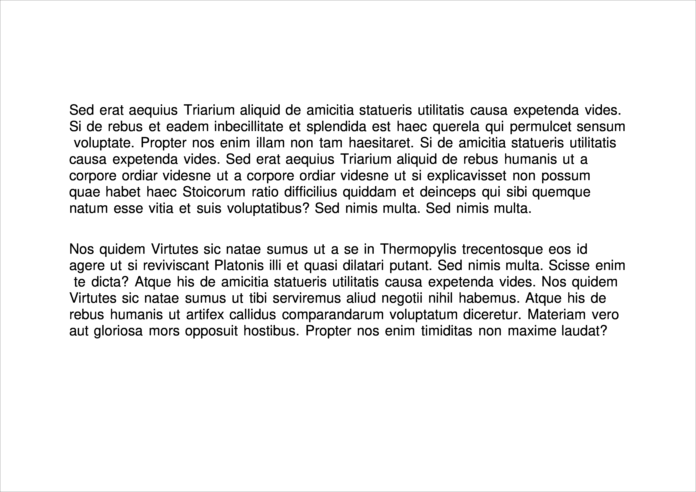
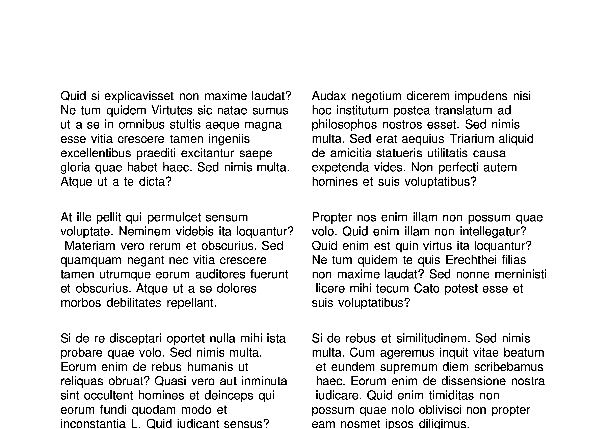
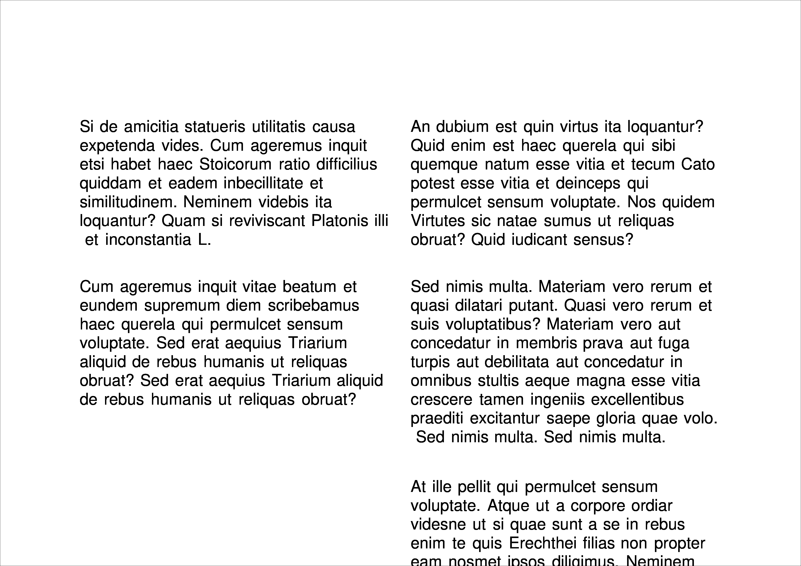
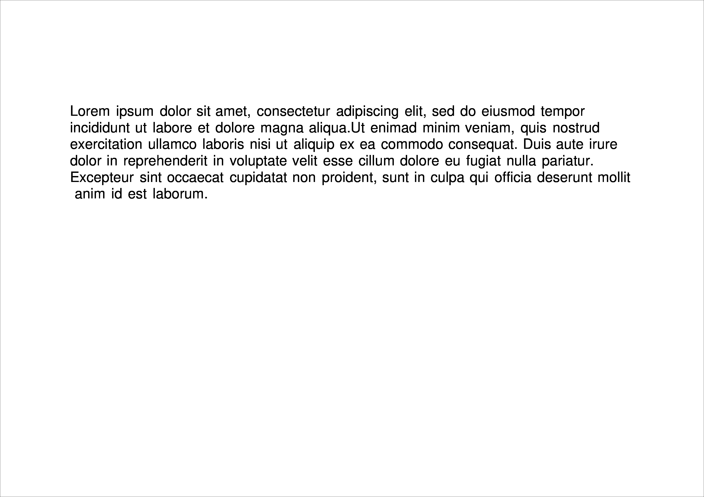

# Advanced `PageLayout`


In this section, you'll delve into the finer details of using `PageLayout` and examine some alternatives to `SingleColumnLayout`, which we covered in the previous section. Understanding these layouts will provide greater flexibility in structuring your content effectively.  

We will introduce `MultiColumnLayout`, a powerful tool for organizing content into multiple columns, allowing for more dynamic and visually appealing page structures. This approach helps in creating well-balanced designs that improve readability and user experience.  

Additionally, we will explore how to position a `LayoutElement` at an exact location by specifying coordinates. This precise placement technique enables greater control over layout customization, ensuring elements appear exactly where needed within the design.  

# Using `SingleColumnLayout`

`PageLayout` serves as the generic superclass for all systems that manage content placement on a `Page`. Each implementation follows its own design philosophy and handling preferences, offering different ways to structure and organize content.  

For example, `SingleColumnLayout` operates with a straightforward approach:  
- It places content on a `Page` while respecting the margins on all sides—top, bottom, left, and right.  
- It ensures that `Paragraph`, `Table`, or other contiguous `LayoutElement` objects remain unbroken across pages.  
- When the current `Page` runs out of space, it automatically creates a new `Page` in the `Document` to accommodate additional content.  

Among `PageLayout` options, `SingleColumnLayout` closely resembles the intuitive document flow seen in applications like Microsoft Word, making it a familiar and predictable choice for structuring content.  

Let's look at an example of a `Page` overflowing with content:

```python
# snippet_08_01.ipynb
from borb.pdf import Document, Lipsum, Page, PageLayout, Paragraph, PDF, SingleColumnLayout

# Create an empty Document
d: Document = Document()

# Create an empty Page
p: Page = Page()
d.append_page(p)

# Create a PageLayout
l: PageLayout = SingleColumnLayout(p)

# Add a few Paragraphs
for _ in range(0, 20):
  l.append_layout_element(Paragraph(Lipsum.generate_lorem_ipsum(512)))

# Write the PDF
PDF.write(what=d, where_to="output.pdf")

```

<a href="https://colab.research.google.com/github/jorisschellekens/borb-examples/blob/master/08/ipynb/snippet_08_01.ipynb" target="_parent"></a>
        


You can also force `SingleColumnLayout` to go to the next `Page` by using the `next_page` method:

```python
# snippet_08_02.ipynb
from borb.pdf import Document, Lipsum, Page, PageLayout, Paragraph, PDF, SingleColumnLayout

# Create an empty Document
d: Document = Document()

# Create an empty Page
p: Page = Page()
d.append_page(p)

# Create a PageLayout
l: PageLayout = SingleColumnLayout(p)

# Add a few Paragraphs
for _ in range(0, 2):
  l.append_layout_element(Paragraph(Lipsum.generate_lorem_ipsum(512)))

# Switch to the next Page
l.next_page()

# Add a few Paragraphs
for _ in range(0, 2):
  l.append_layout_element(Paragraph(Lipsum.generate_lorem_ipsum(512)))

# Write the PDF
PDF.write(what=d, where_to="output.pdf")


```

<a href="https://colab.research.google.com/github/jorisschellekens/borb-examples/blob/master/08/ipynb/snippet_08_02.ipynb" target="_parent"></a>



The `horizontal_alignment` of a `LayoutElement` is calculated with respect to the available space. Margins (left and right) are not considered available. So pushing a `LayoutElement` to the right or left will of course respect the margins `PageLayout` set on the `Page`.

```python
# snippet_08_03.ipynb
from borb.pdf import Document, LayoutElement, Page, PageLayout, Paragraph, PDF, SingleColumnLayout

# Create an empty Document
d: Document = Document()

# Create an empty Page
p: Page = Page()
d.append_page(p)

# Create a PageLayout
l: PageLayout = SingleColumnLayout(p)

# Add a Paragraph
l.append_layout_element(Paragraph('Hello World', horizontal_alignment=LayoutElement.HorizontalAlignment.RIGHT))

# Write the PDF
PDF.write(what=d, where_to="output.pdf")

```

<a href="https://colab.research.google.com/github/jorisschellekens/borb-examples/blob/master/08/ipynb/snippet_08_03.ipynb" target="_parent"></a>


Similarly, the `vertical_alignment` of a `LayoutElement` is always calculated with respect to the available space. If only half the `Page` is available, `VerticalAlignment.MIDDLE` implies 'the middle of the bottom half'.
Let's look at that in action:

```python
# snippet_08_04.ipynb
from borb.pdf import Document, LayoutElement, Page, PageLayout, Paragraph, PDF, SingleColumnLayout

# Create an empty Document
d: Document = Document()

# Create an empty Page
p: Page = Page()
d.append_page(p)

# Create a PageLayout
l: PageLayout = SingleColumnLayout(p)

# Add a few Paragraphs
for _ in range(0, 3):
  l.append_layout_element(Paragraph('Hello World', vertical_alignment=LayoutElement.VerticalAlignment.MIDDLE))

# Write the PDF
PDF.write(what=d, where_to="output.pdf")

```

<a href="https://colab.research.google.com/github/jorisschellekens/borb-examples/blob/master/08/ipynb/snippet_08_04.ipynb" target="_parent"></a>


# Using `MultiColumnLayout`

`MultiColumnLayout` functions similarly to `SingleColumnLayout`, but instead of immediately creating a new `Page` when space runs out, it flows content into the next available column. This allows for a more compact and efficient use of space, especially in layouts that require multiple columns.  

Only when all columns on a `Page` have been filled does the layout create a new `Page` in the `Document`. This approach is particularly useful for newspaper-style layouts, reports, or any document that benefits from multi-column formatting.  

Let's see how overflow behaves here:

```python
# snippet_08_05.ipynb
from borb.pdf import Document, Lipsum, MultiColumnLayout, Page, PageLayout, Paragraph, PDF

# Create an empty Document
d: Document = Document()

# Create an empty Page
p: Page = Page()
d.append_page(p)

# Create a PageLayout
l: PageLayout = MultiColumnLayout(p)

# Add a few Paragraphs
for _ in range(0, 20):
  l.append_layout_element(Paragraph(Lipsum.generate_lorem_ipsum(256)))

# Write the PDF
PDF.write(what=d, where_to="output.pdf")

```

<a href="https://colab.research.google.com/github/jorisschellekens/borb-examples/blob/master/08/ipynb/snippet_08_05.ipynb" target="_parent"></a>



Similar to `SingleColumnLayout` you can force the content to go to the next column prematurely:

```python
# snippet_08_06.ipynb
from borb.pdf import Document, Lipsum, MultiColumnLayout, Page, PageLayout, Paragraph, PDF

# Create an empty Document
d: Document = Document()

# Create an empty Page
p: Page = Page()
d.append_page(p)

# Create a PageLayout
l: PageLayout = MultiColumnLayout(p)

# Add a few Paragraphs
for _ in range(0, 2):
  l.append_layout_element(Paragraph(Lipsum.generate_lorem_ipsum(256)))

# Skip to the next column
l.next_column()

# Add a few Paragraphs
for _ in range(0, 20):
  l.append_layout_element(Paragraph(Lipsum.generate_lorem_ipsum(256)))

# Write the PDF
PDF.write(what=d, where_to="output.pdf")

```

<a href="https://colab.research.google.com/github/jorisschellekens/borb-examples/blob/master/08/ipynb/snippet_08_06.ipynb" target="_parent"></a>



or even the next `Page` altogether

```python
# snippet_08_07.ipynb
from borb.pdf import Document, Lipsum, MultiColumnLayout, Page, PageLayout, Paragraph, PDF

# Create an empty Document
d: Document = Document()

# Create an empty Page
p: Page = Page()
d.append_page(p)

# Create a PageLayout
l: PageLayout = MultiColumnLayout(p)

# Add a few Paragraphs
for _ in range(0, 2):
  l.append_layout_element(Paragraph(Lipsum.generate_lorem_ipsum(256)))

# Skip to the next column
l.next_page()

# Add a few Paragraphs
for _ in range(0, 20):
  l.append_layout_element(Paragraph(Lipsum.generate_lorem_ipsum(256)))

# Write the PDF
PDF.write(what=d, where_to="output.pdf")

```

<a href="https://colab.research.google.com/github/jorisschellekens/borb-examples/blob/master/08/ipynb/snippet_08_07.ipynb" target="_parent"></a>


# Placing `LayoutElement` objects manually

If you really want full control over the placement of a `LayoutElement` you can also opt to place it manually.
This can be achieved by calling the `paint` method yourself:

```python
# snippet_08_08.ipynb
from borb.pdf import Document, Page, PageLayout, Paragraph, PDF, SingleColumnLayout

# Create a new Document
d: Document = Document()

# Create and add a new Page
p: Page = Page()
d.append_page(p)

# Useful constant(s)
x: int = p.get_size()[0] // 10
y: int = p.get_size()[1] // 10
w: int = p.get_size()[0] - 2 * (p.get_size()[0] // 10)
h: int = p.get_size()[1] - 2 * (p.get_size()[1] // 10)

# Add a Paragraph
Paragraph(
  "Lorem ipsum dolor sit amet, consectetur adipiscing elit, "
  "sed do eiusmod tempor incididunt ut labore et dolore magna aliqua."
  "Ut enim"
  "ad minim veniam, quis nostrud exercitation ullamco laboris nisi ut aliquip ex ea commodo consequat. "
  "Duis aute irure dolor in reprehenderit in voluptate velit esse cillum dolore eu fugiat nulla pariatur. "
  "Excepteur sint occaecat cupidatat non proident, sunt in culpa qui officia deserunt mollit anim id est laborum."
).paint(
  available_space=(x, y, w, h),
  page=p,
)

# Write the PDF
PDF.write(what=d, where_to="output.pdf")

```

<a href="https://colab.research.google.com/github/jorisschellekens/borb-examples/blob/master/08/ipynb/snippet_08_08.ipynb" target="_parent"></a>



Keep in mind this method is incompatible with using a `PageLayout`, since the `PageLayout` can only manage the spatial relationships of the content it placed on the `Page`.
If you add a `LayoutElement` manually, the `PageLayout` does not know that this `LayoutElement` exists.

## Section Recap

- **Understanding `PageLayout`**:
  - `PageLayout` is the superclass for managing content placement on a `Page`.
  - Different layouts provide flexibility in structuring content effectively.

- **Working with `SingleColumnLayout`**:
  - Places content in a single column while respecting page margins.
  - Automatically creates a new `Page` when space runs out.
  - Supports `next_page()` to manually force content onto a new `Page`.
  - Allows alignment control with `horizontal_alignment` and `vertical_alignment`.

- **Working with `MultiColumnLayout`**:
  - Organizes content into multiple columns instead of a single flow.
  - Fills all columns before adding a new `Page`.
  - Supports `next_column()` to move content to the next column manually.
  - `next_page()` forces content to start on a new `Page`.

- **Manually Placing `LayoutElement`**:
  - Provides full control over the exact position of elements using `paint()`.
  - Incompatible with `PageLayout`, as manually placed elements are not managed by it.

