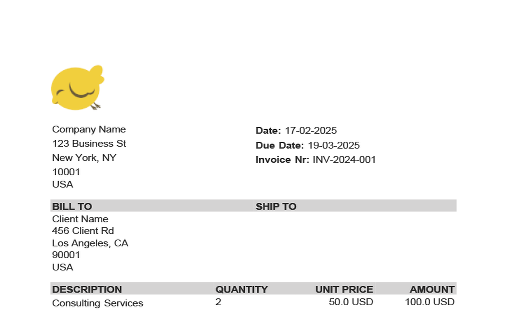

# Using `Templates`


## Using `Slideshow`

The `Slideshow` class allows you to create structured presentations with ease. Let's explore how to use it by adding an image and some text to a slideshow:

```python
# snippet_09_01.ipynb
from borb.pdf import Lipsum, Slideshow

(
    Slideshow()
    .append_image_and_text(
        text=Lipsum.generate_lorem_ipsum(500),
        title=Lipsum.generate_lorem_ipsum(50),
        path_or_url="https://images.unsplash.com/photo-1501438400798-b40ff50396c8",
    )
).save("output.pdf")


```

<a href="https://colab.research.google.com/github/jorisschellekens/birb-examples/blob/main/09/ipynb/snippet_09_01.ipynb" target="_parent"></a>


And similarly you can easily create a `Slideshow` containing a pie chart:

```python
# snippet_09_02.ipynb
from borb.pdf import Lipsum, Slideshow

(
    Slideshow()
    .append_pie_chart_and_text(
        text=Lipsum.generate_lorem_ipsum(500),
        title=Lipsum.generate_lorem_ipsum(50),
        xs=[20.0, 30, 40], ys=["Lorem", "Ipsum", "Dolor"], y_label="Fruit",
    )
).save("output.pdf")


```

<a href="https://colab.research.google.com/github/jorisschellekens/birb-examples/blob/main/09/ipynb/snippet_09_02.ipynb" target="_parent"></a>


### Key Methods in Slideshow

The `Slideshow` class provides various methods to add content seamlessly:

- `append_avatar`
- `append_avatar_and_text`
- `append_barchart`
- `append_barchart_and_text`
- `append_big_number`
- `append_big_number_and_text`
- `append_blank`
- `append_code_snippet`
- `append_code_snippet_and_text`
- `append_image`
- `append_image_and_text`
- `append_line_chart`
- `append_line_chart_and_text`
- `append_map_of_europe`
- `append_map_of_europe_and_text`
- `append_map_of_the_contiguous_united_states`
- `append_map_of_the_contiguous_united_states_and_text`
- `append_map_of_the_united_states`
- `append_map_of_the_united_states_and_text`
- `append_map_of_the_world`
- `append_map_of_the_world_and_text`
- `append_ordered_list`
- `append_ordered_list_and_text`
- `append_pie_chart`
- `append_pie_chart_and_text`
- `append_qr_code`
- `append_qr_code_and_text`
- `append_quote`
- `append_quote_and_text`
- `append_section_title`
- `append_single_column_of_text`
- `append_table`
- `append_table_and_text`
- `append_title`
- `append_two_columns_of_text`
- `append_unordered_list`
- `append_unordered_list_and_text`

## Using `A4Portrait`

## Using `A4PortraitResume`

Creating a professional resume can be a time-consuming task, especially when it comes to formatting, aligning sections, and maintaining consistency. With the `A4PortraitResume` class, borb streamlines this process by providing a comprehensive, customizable solution for creating a professional resume in A4 portrait layout. This class offers a wide range of methods to easily add various sections to your resume, such as personal information, contact details, work experience, education, skills, and more.

By leveraging the `A4PortraitResume` class, you can ensure that your resume follows a clean, structured format that looks polished and professional. Whether you're crafting your resume for the first time or updating it with new experiences, this class simplifies the layout, formatting, and design, allowing you to focus on the content itself. You can also include essential details like profile pictures, social media links, and honors or awards, creating a dynamic and visually appealing resume. With built-in support for easy customizations, you can tailor your resume's appearance and structure to suit your specific needs.

This class is particularly useful for professionals who need to create resumes quickly and consistently. For example, recruiters or career coaches can use it to generate resumes for clients in a matter of minutes. Likewise, freelancers or job seekers can take advantage of its capabilities to maintain a ready-to-go resume that is both professional and easily updated.

Let's look at a practical example:

```python
# snippet_09_03.ipynb
from borb.pdf import A4PortraitResume

(
    A4PortraitResume()
    .set_name("Alex Johnson")
    .set_about_me(
        "I'm a passionate problem solver and technology enthusiast. I enjoy tackling challenges, building innovative solutions, and playing strategy games in my spare time."
    )
    .set_picture("https://images.unsplash.com/photo-1499996860823-5214fcc65f8f")
    .append_honors_or_award("Employee of the Year - TechInnovate")
    .append_honors_or_award("Hackathon Winner - CodeFest 2023")
    .append_honors_or_award("Published in TechWorld Magazine")
    .append_language_and_proficiency("English", 5)
    .append_language_and_proficiency("Spanish", 4)
    .append_language_and_proficiency("German", 2)
    .append_language_and_proficiency("Mandarin", 1)
    .append_skill("3D Modeling")
    .append_skill("Digital Painting")
    .append_skill("Competitive Gaming")
    .set_email("alex.johnson.fake@gmail.com")
    .set_linkedin("alexjohnson_fakelinkedin")
    .set_twitter("alex_fake_twitter")
    .set_phone_nr("+1 555 123 4567")
    .set_location("Springfield, USA")
    .append_work_experience(
        company="TechInnovate Inc.",
        from_date="January 2023",
        to_date="Present",
        description="Leading a team of software engineers to develop AI-driven solutions for the retail industry. Implemented key product features that boosted client satisfaction by 30%.",
        tags=["python", "machine learning", "team leadership"],
    )
    .append_work_experience(
        company="InnoSoft Solutions",
        from_date="July 2019",
        to_date="December 2022",
        description="Developed and optimized web applications, improving load times by 50%. Collaborated with cross-functional teams to deliver projects on time.",
        tags=["javascript", "react", "devops"],
    )
    .append_work_experience(
        company="CodeBase Tech",
        from_date="May 2017",
        to_date="June 2019",
        description="Built scalable backend systems for e-commerce platforms. Enhanced database efficiency, reducing query response times by 40%.",
        tags=["java", "sql", "cloud computing"],
    )
).save("output.pdf")

```

<a href="https://colab.research.google.com/github/jorisschellekens/birb-examples/blob/main/09/ipynb/snippet_09_03.ipynb" target="_parent"></a>


### Key Methods in `A4PortraitResume`

- **`set_name(name: str)`**: Sets the candidate's name on the resume. This will appear prominently at the top of the resume.
- **`set_email(email: str)`**: Sets the candidate's email address in the contact information section of the resume.
- **`set_linkedin(linkedin_url: str)`**: Adds a LinkedIn profile URL to the resume, displaying it as part of the contact details section.
- **`set_phone_nr(phone_nr: str)`**: Includes the candidate's phone number in the contact information section.
- **`set_location(location: str)`**: Adds the candidate's location (e.g., city, country) to the resume.
- **`set_twitter(twitter: str)`**: Sets the candidate's Twitter handle in the contact section of the resume.
- **`set_picture(picture_url: str)`**: Sets the URL for the candidate's profile picture, which is included on the resume.
- **`set_about_me(about_me: str)`**: Adds a brief personal summary or "About Me" section to introduce the candidate's background.
- **`append_honors_or_award(honor_or_award: str)`**: Appends an honor or award to the honors and awards section of the resume.
- **`append_language_and_proficiency(language: str, proficiency_on_a_scale_of_1_to_5: int)`**: Adds a language and its proficiency level (on a scale of 1 to 5) to the languages section of the resume.
- **`append_skill(skill: str)`**: Adds a skill to the "Skills" section of the resume.
- **`append_work_experience(company: str, description: str, from_date: str, tags: typing.List[str], to_date: str)`**: Adds a work experience entry, including the company, job description, start and end dates, and tags to highlight key skills or technologies used.
- **`save(path: str)`**: Saves the generated resume to a specified file path in PDF format.

Each of these methods is designed to simplify the creation and customization of your resume, offering flexibility and allowing you to quickly add essential information such as contact details, work experience, skills, and more. This makes the `A4PortraitResume` class a valuable tool for anyone needing to create a professional resume in a standardized, easily editable format.

## Using `A4PortraitInvoice`

One of the most valuable features of `borb` is its ability to generate professional, structured invoices effortlessly. With the `A4PortraitInvoice` class, you can create polished invoices in just a few lines of code, eliminating the need for manual formatting or external design tools. Whether you're a freelancer, a small business owner, or part of a larger organization, automating invoice creation can save time and reduce errors. 

This class provides an intuitive, method-chaining API that allows you to specify key invoice details, such as invoice number, date, due date, and currency. You can define billing and shipping addresses, add line items with descriptions and pricing, apply taxes and discounts, and even include custom terms and conditions. The result is a clean, well-structured PDF invoice that is both professional and easy to read.

By handling layout, formatting, and calculations behind the scenes, `A4PortraitInvoice` ensures that invoices are consistent and error-free. This is particularly useful for businesses that need to generate invoices dynamically, whether for e-commerce transactions, consulting services, or recurring billing. Now, let’s explore a practical example.

```python
# snippet_09_04.ipynb
from borb.pdf import A4PortraitInvoice
import datetime

invoice = (
    A4PortraitInvoice()
    .set_nr("INV-2024-001")
    .set_logo(
        "https://raw.githubusercontent.com/jorisschellekens/borb/refs/heads/master/logo/borb_64.png"
    )
    .set_date(datetime.datetime.now())
    .set_due_date(datetime.datetime.now() + datetime.timedelta(days=30))
    .set_currency_abbreviation("USD")
    .set_address("Company Name", "123 Business St", "New York, NY", "10001", "USA")
    .set_bill_to("Client Name", "456 Client Rd", "Los Angeles, CA", "90001", "USA")
    .append_item(
        amount=100.0, description="Consulting Services", quantity=2, unit_price=50.0
    )
    .set_subtotal(100.0)
    .set_taxes(10.0)
    .set_discounts(5.0)
    .set_total(105.0)
    .set_terms_and_conditions("Payment due within 30 days.")
)

invoice.save("invoice.pdf")

```

<a href="https://colab.research.google.com/github/jorisschellekens/birb-examples/blob/main/09/ipynb/snippet_09_04.ipynb" target="_parent"></a>



### Key Methods in `A4PortraitInvoice`

The `A4PortraitInvoice` class provides a structured way to generate professional invoices in PDF format. It includes methods to set invoice details, addresses, line items, and totals, ensuring a well-formatted document. Below are the essential methods you can use:

- **`set_nr(nr: str)`** – Set the invoice number.
- **`set_date(date: datetime.datetime)`** – Specify the invoice date.
- **`set_due_date(due_date: datetime.datetime)`** – Define the due date for payment.
- **`set_currency_abbreviation(currency: str)`** – Set the currency abbreviation (e.g., `"USD"`).
- **`set_address(name, street, city, postal_code, country)`** – Define the sender’s address.
- **`set_bill_to(name, street, city, postal_code, country)`** – Define the recipient’s billing address.
- **`set_ship_to(name, street, city, postal_code, country)`** – Define the shipping address (if different).
- **`append_item(amount, description, quantity, unit_price)`** – Add an itemized entry to the invoice.
- **`set_subtotal(subtotal: float)`** – Set the subtotal before taxes and discounts.
- **`set_taxes(taxes: float)`** – Define the tax amount.
- **`set_discounts(discounts: float)`** – Apply any discounts.
- **`set_total(total: float)`** – Specify the final total after taxes and discounts.
- **`set_terms_and_conditions(terms: str)`** – Include payment terms and conditions.
- **`save(path: str)`** – Save the invoice as a PDF file.

By using these methods, you can easily generate detailed invoices programmatically, ensuring consistency and professionalism in your documents.

The `A4PortraitInvoice` class is designed to help you create professional invoices in PDF format with ease. It allows you to set key invoice details, such as the invoice number, date, due date, and currency. Additionally, you can define billing and shipping addresses, add line items, apply taxes and discounts, and include terms and conditions—all through a straightforward method-chaining approach.
