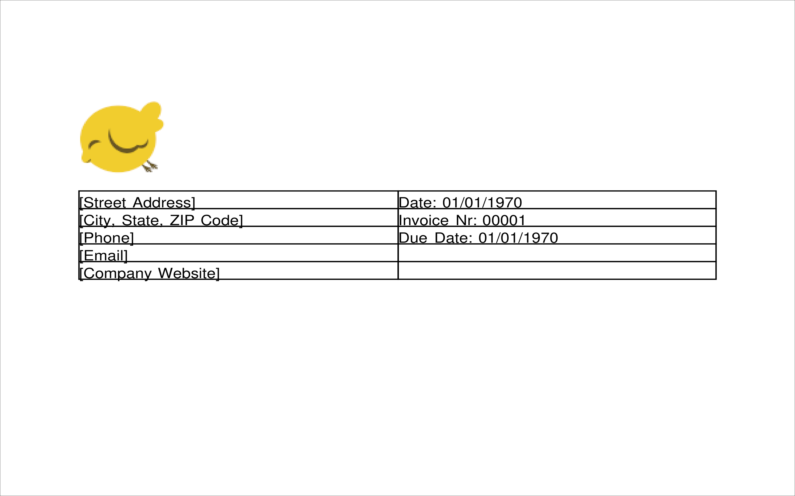
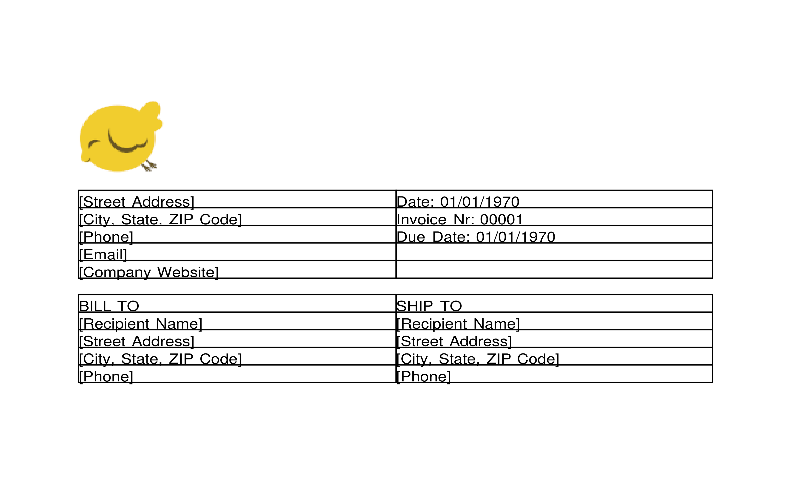
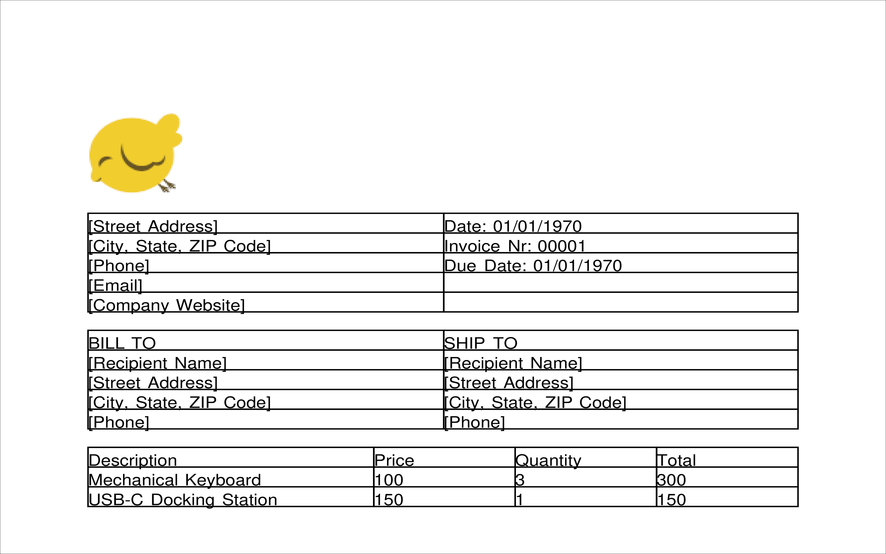
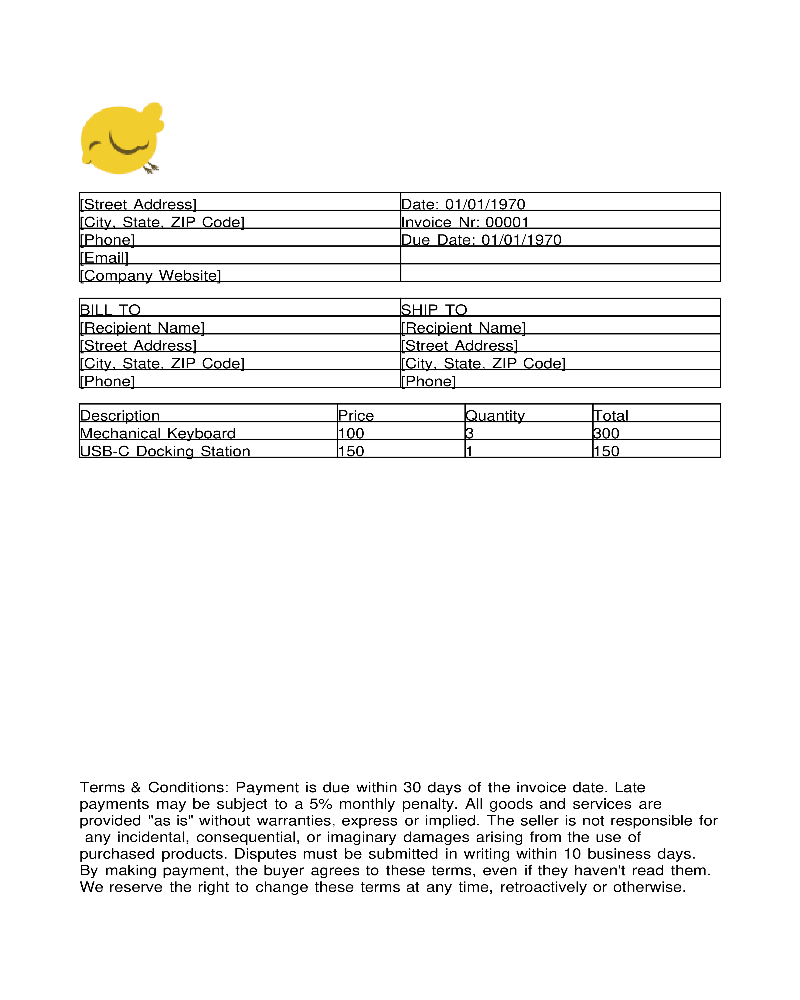
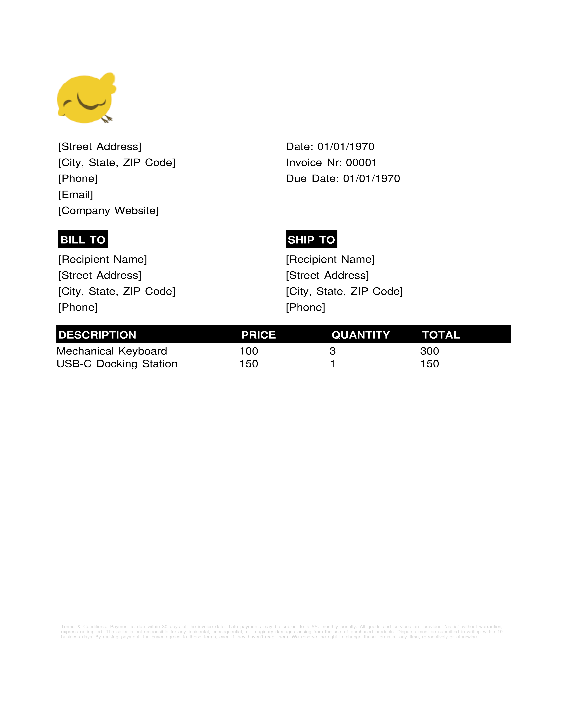
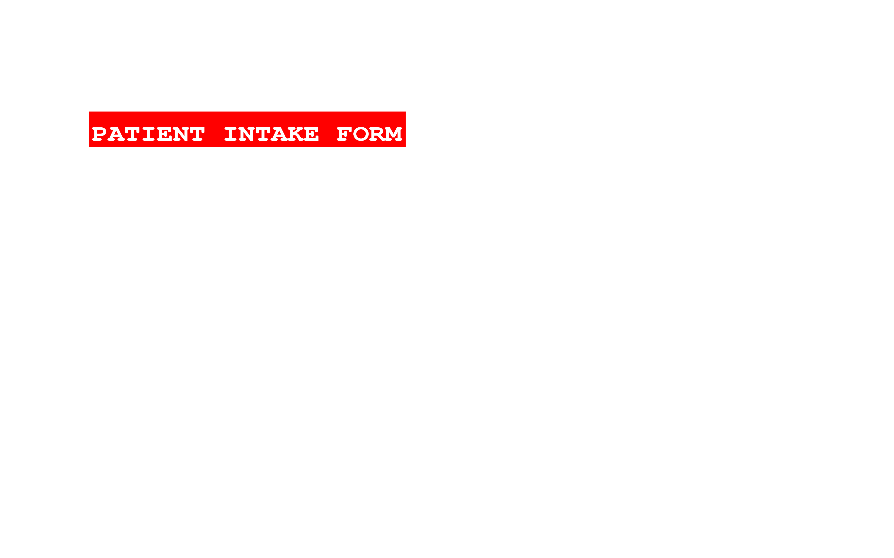
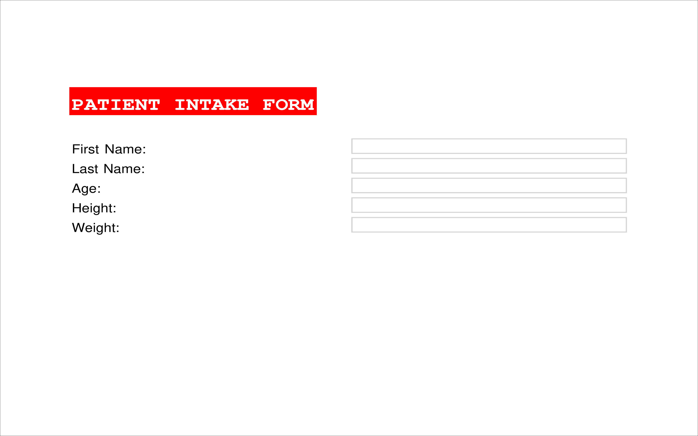
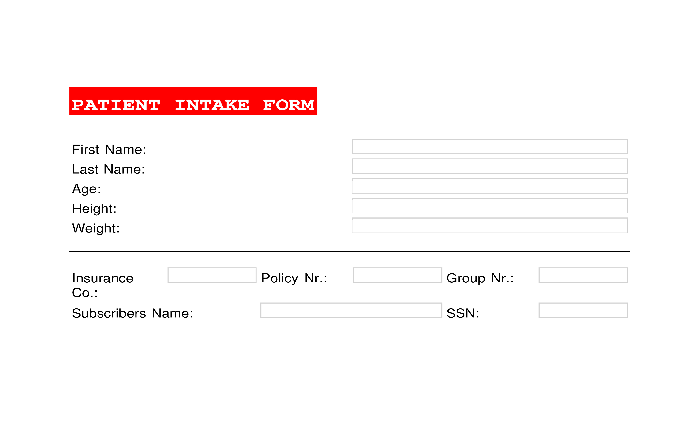
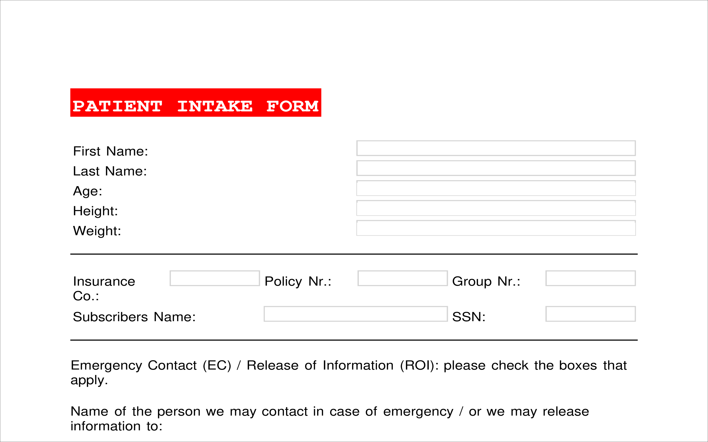

# 10. Showcase(s)


## 10.0 Creating an invoice

We'll start with the fundamental "Hello, World" template—something you should have ingrained in your memory by now. This basic setup ensures that we have a working PDF document with a single page and layout before we start adding content.

```python3
# snippet_10_01.ipynb
from borb.pdf import Document, Page, PageLayout, PDF, SingleColumnLayout

doc: Document = Document()

page: Page = Page()
doc.append_page(page)

layout: PageLayout = SingleColumnLayout(page)

PDF.write(what=doc, where_to="output.pdf")

```

<a href="https://colab.research.google.com/github/jorisschellekens/borb-examples/blob/master/10/ipynb/snippet_10_01.ipynb" target="_parent"></a>


Before diving into the details, it's important to consider the structure of the PDF we're creating. Rather than manually positioning content, we can leverage layout mechanisms to simplify the process and maintain a clean design.

One of the first elements to include is the company logo. This is a straightforward addition using an `Image` object:

```python3
# snippet_10_02.ipynb
from borb.pdf import Document, Image, Page, PageLayout, PDF, SingleColumnLayout

doc: Document = Document()

page: Page = Page()
doc.append_page(page)

layout: PageLayout = SingleColumnLayout(page)

# add company logo
layout.append_layout_element(
    Image(
        "https://raw.githubusercontent.com/jorisschellekens/borb/master/logo/borb_64.png",
        size=(64, 64),
    )
)

PDF.write(what=doc, where_to="output.pdf")

```

<a href="https://colab.research.google.com/github/jorisschellekens/borb-examples/blob/master/10/ipynb/snippet_10_02.ipynb" target="_parent"></a>


The next section of our invoice is the header, which typically contains essential details such as:

- Invoice number
- Due date
- Company address (including name and multiple address lines)

A `FixedColumnWidthTable` is a great way to organize this information neatly:

```python3
# snippet_10_03.ipynb
from borb.pdf import (
    Document,
    FixedColumnWidthTable,
    Image,
    Page,
    PageLayout,
    Paragraph,
    PDF,
    SingleColumnLayout,
)

doc: Document = Document()

page: Page = Page()
doc.append_page(page)

layout: PageLayout = SingleColumnLayout(page)

# add company logo
layout.append_layout_element(
    Image(
        "https://raw.githubusercontent.com/jorisschellekens/borb/master/logo/borb_64.png",
        size=(64, 64),
    )
)

# add invoice header
layout.append_layout_element(
    FixedColumnWidthTable(number_of_rows=5, number_of_columns=2)
    .append_layout_element(Paragraph("[Street Address]"))
    .append_layout_element(Paragraph("Date: 01/01/1970"))
    .append_layout_element(Paragraph("[City, State, ZIP Code]"))
    .append_layout_element(Paragraph("Invoice Nr: 00001"))
    .append_layout_element(Paragraph("[Phone]"))
    .append_layout_element(Paragraph("Due Date: 01/01/1970"))
    .append_layout_element(Paragraph("[Email]"))
    .append_layout_element(Paragraph(""))
    .append_layout_element(Paragraph("[Company Website]"))
    .append_layout_element(Paragraph(""))
)

PDF.write(what=doc, where_to="output.pdf")

```

<a href="https://colab.research.google.com/github/jorisschellekens/borb-examples/blob/master/10/ipynb/snippet_10_03.ipynb" target="_parent"></a>



The next section contains details about the recipient and shipping information. Again, a `FixedColumnWidthTable` simplifies the process by ensuring a well-aligned layout.

```python3
# snippet_10_04.ipynb
from borb.pdf import (
    Document,
    FixedColumnWidthTable,
    Image,
    Page,
    PageLayout,
    Paragraph,
    PDF,
    SingleColumnLayout,
)

doc: Document = Document()

page: Page = Page()
doc.append_page(page)

layout: PageLayout = SingleColumnLayout(page)

# add company logo
layout.append_layout_element(
    Image(
        "https://raw.githubusercontent.com/jorisschellekens/borb/master/logo/borb_64.png",
        size=(64, 64),
    )
)

# add invoice header
layout.append_layout_element(
    FixedColumnWidthTable(number_of_rows=5, number_of_columns=2)
    .append_layout_element(Paragraph("[Street Address]"))
    .append_layout_element(Paragraph("Date: 01/01/1970"))
    .append_layout_element(Paragraph("[City, State, ZIP Code]"))
    .append_layout_element(Paragraph("Invoice Nr: 00001"))
    .append_layout_element(Paragraph("[Phone]"))
    .append_layout_element(Paragraph("Due Date: 01/01/1970"))
    .append_layout_element(Paragraph("[Email]"))
    .append_layout_element(Paragraph(""))
    .append_layout_element(Paragraph("[Company Website]"))
    .append_layout_element(Paragraph(""))
)

# add bill to / ship to
layout.append_layout_element(
    FixedColumnWidthTable(number_of_rows=5, number_of_columns=2)
    .append_layout_element(Paragraph("BILL TO"))
    .append_layout_element(Paragraph("SHIP TO"))
    .append_layout_element(Paragraph("[Recipient Name]"))
    .append_layout_element(Paragraph("[Recipient Name]"))
    .append_layout_element(Paragraph("[Street Address]"))
    .append_layout_element(Paragraph("[Street Address]"))
    .append_layout_element(Paragraph("[City, State, ZIP Code]"))
    .append_layout_element(Paragraph("[City, State, ZIP Code]"))
    .append_layout_element(Paragraph("[Phone]"))
    .append_layout_element(Paragraph("[Phone]"))
)

PDF.write(what=doc, where_to="output.pdf")

```

<a href="https://colab.research.google.com/github/jorisschellekens/borb-examples/blob/master/10/ipynb/snippet_10_04.ipynb" target="_parent"></a>



Next we're going to add the items, their price, quantity, and the total.
Again we're going to use a `FixedColumnWidthTable`:

```python3
# snippet_10_05.ipynb
from borb.pdf import (
    Document,
    FixedColumnWidthTable,
    Image,
    Page,
    PageLayout,
    Paragraph,
    PDF,
    SingleColumnLayout,
)

doc: Document = Document()

page: Page = Page()
doc.append_page(page)

layout: PageLayout = SingleColumnLayout(page)

# add company logo
layout.append_layout_element(
    Image(
        "https://raw.githubusercontent.com/jorisschellekens/borb/master/logo/borb_64.png",
        size=(64, 64),
    )
)

# add invoice header
layout.append_layout_element(
    FixedColumnWidthTable(number_of_rows=5, number_of_columns=2)
    .append_layout_element(Paragraph("[Street Address]"))
    .append_layout_element(Paragraph("Date: 01/01/1970"))
    .append_layout_element(Paragraph("[City, State, ZIP Code]"))
    .append_layout_element(Paragraph("Invoice Nr: 00001"))
    .append_layout_element(Paragraph("[Phone]"))
    .append_layout_element(Paragraph("Due Date: 01/01/1970"))
    .append_layout_element(Paragraph("[Email]"))
    .append_layout_element(Paragraph(""))
    .append_layout_element(Paragraph("[Company Website]"))
    .append_layout_element(Paragraph(""))
)

# add bill to / ship to
layout.append_layout_element(
    FixedColumnWidthTable(number_of_rows=5, number_of_columns=2)
    .append_layout_element(Paragraph("BILL TO"))
    .append_layout_element(Paragraph("SHIP TO"))
    .append_layout_element(Paragraph("[Recipient Name]"))
    .append_layout_element(Paragraph("[Recipient Name]"))
    .append_layout_element(Paragraph("[Street Address]"))
    .append_layout_element(Paragraph("[Street Address]"))
    .append_layout_element(Paragraph("[City, State, ZIP Code]"))
    .append_layout_element(Paragraph("[City, State, ZIP Code]"))
    .append_layout_element(Paragraph("[Phone]"))
    .append_layout_element(Paragraph("[Phone]"))
)

# add items
layout.append_layout_element(
    FixedColumnWidthTable(
        number_of_rows=3, number_of_columns=4, column_widths=[2, 1, 1, 1]
    )
    .append_layout_element(Paragraph("Description"))
    .append_layout_element(Paragraph("Price"))
    .append_layout_element(Paragraph("Quantity"))
    .append_layout_element(Paragraph("Total"))
    .append_layout_element(Paragraph("Mechanical Keyboard"))
    .append_layout_element(Paragraph("100"))
    .append_layout_element(Paragraph("3"))
    .append_layout_element(Paragraph("300"))
    .append_layout_element(Paragraph("USB-C Docking Station"))
    .append_layout_element(Paragraph("150"))
    .append_layout_element(Paragraph("1"))
    .append_layout_element(Paragraph("150"))
)

PDF.write(what=doc, where_to="output.pdf")

```

<a href="https://colab.research.google.com/github/jorisschellekens/borb-examples/blob/master/10/ipynb/snippet_10_05.ipynb" target="_parent"></a>



Finally, we want to add the terms and conditions at the bottom of the invoice.

```python3
# snippet_10_06.ipynb
from borb.pdf import (
    Document,
    FixedColumnWidthTable,
    Image,
    LayoutElement,
    Page,
    PageLayout,
    Paragraph,
    PDF,
    SingleColumnLayout,
)

doc: Document = Document()

page: Page = Page()
doc.append_page(page)

layout: PageLayout = SingleColumnLayout(page)

# add company logo
layout.append_layout_element(
    Image(
        "https://raw.githubusercontent.com/jorisschellekens/borb/master/logo/borb_64.png",
        size=(64, 64),
    )
)

# add invoice header
layout.append_layout_element(
    FixedColumnWidthTable(number_of_rows=5, number_of_columns=2)
    .append_layout_element(Paragraph("[Street Address]"))
    .append_layout_element(Paragraph("Date: 01/01/1970"))
    .append_layout_element(Paragraph("[City, State, ZIP Code]"))
    .append_layout_element(Paragraph("Invoice Nr: 00001"))
    .append_layout_element(Paragraph("[Phone]"))
    .append_layout_element(Paragraph("Due Date: 01/01/1970"))
    .append_layout_element(Paragraph("[Email]"))
    .append_layout_element(Paragraph(""))
    .append_layout_element(Paragraph("[Company Website]"))
    .append_layout_element(Paragraph(""))
)

# add bill to / ship to
layout.append_layout_element(
    FixedColumnWidthTable(number_of_rows=5, number_of_columns=2)
    .append_layout_element(Paragraph("BILL TO"))
    .append_layout_element(Paragraph("SHIP TO"))
    .append_layout_element(Paragraph("[Recipient Name]"))
    .append_layout_element(Paragraph("[Recipient Name]"))
    .append_layout_element(Paragraph("[Street Address]"))
    .append_layout_element(Paragraph("[Street Address]"))
    .append_layout_element(Paragraph("[City, State, ZIP Code]"))
    .append_layout_element(Paragraph("[City, State, ZIP Code]"))
    .append_layout_element(Paragraph("[Phone]"))
    .append_layout_element(Paragraph("[Phone]"))
)

# add items
layout.append_layout_element(
    FixedColumnWidthTable(
        number_of_rows=3, number_of_columns=4, column_widths=[2, 1, 1, 1]
    )
    .append_layout_element(Paragraph("Description"))
    .append_layout_element(Paragraph("Price"))
    .append_layout_element(Paragraph("Quantity"))
    .append_layout_element(Paragraph("Total"))
    .append_layout_element(Paragraph("Mechanical Keyboard"))
    .append_layout_element(Paragraph("100"))
    .append_layout_element(Paragraph("3"))
    .append_layout_element(Paragraph("300"))
    .append_layout_element(Paragraph("USB-C Docking Station"))
    .append_layout_element(Paragraph("150"))
    .append_layout_element(Paragraph("1"))
    .append_layout_element(Paragraph("150"))
)

# add terms and conditions
layout.append_layout_element(
    Paragraph(
        """
Terms & Conditions: Payment is due within 30 days of the invoice date. 
Late payments may be subject to a 5% monthly penalty. 
All goods and services are provided "as is" without warranties, express or implied. 
The seller is not responsible for any incidental, consequential, or imaginary damages arising from the use of purchased products. 
Disputes must be submitted in writing within 10 business days. 
By making payment, the buyer agrees to these terms, even if they haven't read them. 
We reserve the right to change these terms at any time, retroactively or otherwise.
                                      """,
        horizontal_alignment=LayoutElement.HorizontalAlignment,
        vertical_alignment=LayoutElement.VerticalAlignment.BOTTOM,
    )
)

PDF.write(what=doc, where_to="output.pdf")

```

<a href="https://colab.research.google.com/github/jorisschellekens/borb-examples/blob/master/10/ipynb/snippet_10_06.ipynb" target="_parent"></a>



As a finishing touch, we can now update the fonts, colors and backgrounds of some of the `LayoutElement` objects on the `Page`.
That should really tie everything together:

```python3
# snippet_10_07.ipynb
from borb.pdf import (
    Document,
    FixedColumnWidthTable,
    Image,
    LayoutElement,
    Page,
    PageLayout,
    Paragraph,
    PDF,
    SingleColumnLayout,
    Standard14Fonts,
    Table,
    X11Color,
)

doc: Document = Document()

page: Page = Page()
doc.append_page(page)

layout: PageLayout = SingleColumnLayout(page)

# add company logo
layout.append_layout_element(
    Image(
        "https://raw.githubusercontent.com/jorisschellekens/borb/master/logo/borb_64.png",
        size=(64, 64),
    )
)

# add invoice header
layout.append_layout_element(
    FixedColumnWidthTable(number_of_rows=5, number_of_columns=2)
    .append_layout_element(Paragraph("[Street Address]"))
    .append_layout_element(Paragraph("Date: 01/01/1970"))
    .append_layout_element(Paragraph("[City, State, ZIP Code]"))
    .append_layout_element(Paragraph("Invoice Nr: 00001"))
    .append_layout_element(Paragraph("[Phone]"))
    .append_layout_element(Paragraph("Due Date: 01/01/1970"))
    .append_layout_element(Paragraph("[Email]"))
    .append_layout_element(Paragraph(""))
    .append_layout_element(Paragraph("[Company Website]"))
    .append_layout_element(Paragraph(""))
    .set_padding_on_all_cells(
        padding_bottom=2, padding_left=2, padding_right=2, padding_top=2
    )
    .no_borders()
)

# add bill to / ship to
layout.append_layout_element(
    FixedColumnWidthTable(number_of_rows=5, number_of_columns=2)
    .append_layout_element(
        Paragraph(
            "BILL TO",
            padding_bottom=4,
            padding_left=2,
            padding_right=2,
            padding_top=2,
            font=Standard14Fonts.get("Helvetica-Bold"),
            background_color=X11Color.BLACK,
            font_color=X11Color.WHITE,
        )
    )
    .append_layout_element(
        Paragraph(
            "SHIP TO",
            padding_bottom=4,
            padding_left=2,
            padding_right=2,
            padding_top=2,
            font=Standard14Fonts.get("Helvetica-Bold"),
            background_color=X11Color.BLACK,
            font_color=X11Color.WHITE,
        )
    )
    .append_layout_element(Paragraph("[Recipient Name]"))
    .append_layout_element(Paragraph("[Recipient Name]"))
    .append_layout_element(Paragraph("[Street Address]"))
    .append_layout_element(Paragraph("[Street Address]"))
    .append_layout_element(Paragraph("[City, State, ZIP Code]"))
    .append_layout_element(Paragraph("[City, State, ZIP Code]"))
    .append_layout_element(Paragraph("[Phone]"))
    .append_layout_element(Paragraph("[Phone]"))
    .set_padding_on_all_cells(
        padding_bottom=2, padding_left=2, padding_right=2, padding_top=2
    )
    .no_borders()
)

# add items
layout.append_layout_element(
    FixedColumnWidthTable(
        number_of_rows=3, number_of_columns=4, column_widths=[2, 1, 1, 1]
    )
    .append_layout_element(
        Table.TableCell(
            Paragraph(
                "DESCRIPTION",
                padding_bottom=4,
                padding_left=2,
                padding_right=2,
                padding_top=2,
                font=Standard14Fonts.get("Helvetica-Bold"),
                font_color=X11Color.WHITE,
            ),
            background_color=X11Color.BLACK,
        )
    )
    .append_layout_element(
        Table.TableCell(
            Paragraph(
                "PRICE",
                padding_bottom=4,
                padding_left=2,
                padding_right=2,
                padding_top=2,
                font=Standard14Fonts.get("Helvetica-Bold"),
                font_color=X11Color.WHITE,
            ),
            background_color=X11Color.BLACK,
        )
    )
    .append_layout_element(
        Table.TableCell(
            Paragraph(
                "QUANTITY",
                padding_bottom=4,
                padding_left=2,
                padding_right=2,
                padding_top=2,
                font=Standard14Fonts.get("Helvetica-Bold"),
                font_color=X11Color.WHITE,
            ),
            background_color=X11Color.BLACK,
        )
    )
    .append_layout_element(
        Table.TableCell(
            Paragraph(
                "TOTAL",
                padding_bottom=4,
                padding_left=2,
                padding_right=2,
                padding_top=2,
                font=Standard14Fonts.get("Helvetica-Bold"),
                font_color=X11Color.WHITE,
            ),
            background_color=X11Color.BLACK,
        )
    )
    .append_layout_element(Paragraph("Mechanical Keyboard"))
    .append_layout_element(Paragraph("100"))
    .append_layout_element(Paragraph("3"))
    .append_layout_element(Paragraph("300"))
    .append_layout_element(Paragraph("USB-C Docking Station"))
    .append_layout_element(Paragraph("150"))
    .append_layout_element(Paragraph("1"))
    .append_layout_element(Paragraph("150"))
    .no_borders()
)

# add terms and conditions
layout.append_layout_element(
    Paragraph(
        """
Terms & Conditions: Payment is due within 30 days of the invoice date. 
Late payments may be subject to a 5% monthly penalty. 
All goods and services are provided "as is" without warranties, express or implied. 
The seller is not responsible for any incidental, consequential, or imaginary damages arising from the use of purchased products. 
Disputes must be submitted in writing within 10 business days. 
By making payment, the buyer agrees to these terms, even if they haven't read them. 
We reserve the right to change these terms at any time, retroactively or otherwise.
                                      """,
        font_size=5,
        font_color=X11Color.LIGHT_GRAY,
        text_alignment=LayoutElement.TextAlignment.JUSTIFIED,
        horizontal_alignment=LayoutElement.HorizontalAlignment.MIDDLE,
        vertical_alignment=LayoutElement.VerticalAlignment.BOTTOM,
    )
)

PDF.write(what=doc, where_to="output.pdf")

```

<a href="https://colab.research.google.com/github/jorisschellekens/borb-examples/blob/master/10/ipynb/snippet_10_07.ipynb" target="_parent"></a>



## 10.1 Creating a patient intake document

This example is going to focus heavily on `FormField` objects, and `Table` objects.
Similar to what we've done before in the invoice example, we're going to start with the hello-world template:

```python3
# snippet_10_08.ipynb
from borb.pdf import Document, PageLayout, SingleColumnLayout, PDF

doc: Document = Document()

page: Page = Page()
doc.append_page(page)

layout: PageLayout = SingleColumnLayout(page)

PDF.write(what=doc, where_to='output.pdf')
```


First we're going to add a title:

```python3
# snippet_10_09.ipynb
from borb.pdf import (
    Document,
    Page,
    PageLayout,
    Paragraph,
    PDF,
    SingleColumnLayout,
    Standard14Fonts,
    X11Color,
)

doc: Document = Document()

page: Page = Page()
doc.append_page(page)

layout: PageLayout = SingleColumnLayout(page)

# add a title
layout.append_layout_element(
    Paragraph(
        "PATIENT INTAKE FORM",
        font=Standard14Fonts.get("Courier-Bold"),
        padding_bottom=4,
        padding_left=2,
        padding_right=2,
        padding_top=1,
        font_size=18,
        font_color=X11Color.WHITE,
        background_color=X11Color.RED,
    )
)

PDF.write(what=doc, where_to="output.pdf")

```



And as a next step, we're going to add some basic questions to our form:

```python3
# snippet_10_10.ipynb
from borb.pdf import (
    Document,
    DropDownList,
    FixedColumnWidthTable,
    Page,
    PageLayout,
    Paragraph,
    PDF,
    SingleColumnLayout,
    Standard14Fonts,
    TextBox,
    X11Color,
)

doc: Document = Document()

page: Page = Page()
doc.append_page(page)

layout: PageLayout = SingleColumnLayout(page)

# add a title
layout.append_layout_element(
    Paragraph(
        "PATIENT INTAKE FORM",
        font=Standard14Fonts.get("Courier-Bold"),
        padding_bottom=4,
        padding_left=2,
        padding_right=2,
        padding_top=1,
        font_size=18,
        font_color=X11Color.WHITE,
        background_color=X11Color.RED,
    )
)

# add some initial questions
layout.append_layout_element(
    FixedColumnWidthTable(number_of_rows=5, number_of_columns=2)
    .append_layout_element(Paragraph("First Name:"))
    .append_layout_element(TextBox())
    .append_layout_element(Paragraph("Last Name:"))
    .append_layout_element(TextBox())
    .append_layout_element(Paragraph("Age:"))
    .append_layout_element(DropDownList([f"{i}" for i in range(18, 100)]))
    .append_layout_element(Paragraph("Height:"))
    .append_layout_element(DropDownList([f"1m{i}" for i in range(50, 100)]))
    .append_layout_element(Paragraph("Weight:"))
    .append_layout_element(DropDownList([f"{i}kg" for i in range(50, 200)]))
    .set_padding_on_all_cells(
        padding_bottom=2, padding_left=2, padding_right=2, padding_top=2
    )
    .no_borders()
)

PDF.write(what=doc, where_to="output.pdf")

```



Next, we're going to add some questions related to insurance information:

```python3
# snippet_10_11.ipynb
from borb.pdf import (
    Document,
    DropDownList,
    FixedColumnWidthTable,
    HorizontalBreak,
    Page,
    PageLayout,
    Paragraph,
    PDF,
    SingleColumnLayout,
    Standard14Fonts,
    Table,
    TextBox,
    X11Color,
)

doc: Document = Document()

page: Page = Page()
doc.append_page(page)

layout: PageLayout = SingleColumnLayout(page)

# add a title
layout.append_layout_element(
    Paragraph(
        "PATIENT INTAKE FORM",
        font=Standard14Fonts.get("Courier-Bold"),
        padding_bottom=4,
        padding_left=2,
        padding_right=2,
        padding_top=1,
        font_size=18,
        font_color=X11Color.WHITE,
        background_color=X11Color.RED,
    )
)

# add some initial questions
layout.append_layout_element(
    FixedColumnWidthTable(number_of_rows=5, number_of_columns=2)
    .append_layout_element(Paragraph("First Name:"))
    .append_layout_element(TextBox())
    .append_layout_element(Paragraph("Last Name:"))
    .append_layout_element(TextBox())
    .append_layout_element(Paragraph("Age:"))
    .append_layout_element(DropDownList([f"{i}" for i in range(18, 100)]))
    .append_layout_element(Paragraph("Height:"))
    .append_layout_element(DropDownList([f"1m{i}" for i in range(50, 100)]))
    .append_layout_element(Paragraph("Weight:"))
    .append_layout_element(DropDownList([f"{i}kg" for i in range(50, 200)]))
    .set_padding_on_all_cells(padding_bottom=2, padding_left=2, padding_right=2, padding_top=2)
    .no_borders()
)

# add horizontal rule
layout.append_layout_element(HorizontalBreak())

# add insurance information
layout.append_layout_element(
    FixedColumnWidthTable(number_of_rows=2, number_of_columns=6)
    .append_layout_element(Paragraph("Insurance Co.:"))
    .append_layout_element(TextBox())
    .append_layout_element(Paragraph("Policy Nr.:"))
    .append_layout_element(TextBox())
    .append_layout_element(Paragraph("Group Nr.:"))
    .append_layout_element(TextBox())
    .append_layout_element(Table.TableCell(Paragraph("Subscribers Name:"), column_span=2))
    .append_layout_element(Table.TableCell(TextBox(), column_span=2))
    .append_layout_element(Paragraph("SSN:"))    
    .append_layout_element(TextBox())
    .set_padding_on_all_cells(padding_bottom=2, padding_left=2, padding_right=2, padding_top=2)    
    .no_borders()
)

PDF.write(what=doc, where_to="output.pdf")

```



And lastly, we're adding some fields to allow users to fill in their emergency contact details:

```python3
# snippet_10_12.ipynb
from borb.pdf import (
    CheckBox,
    Document,
    DropDownList,
    FixedColumnWidthTable,
    HorizontalBreak,
    Page,
    PageLayout,
    Paragraph,
    PDF,
    SingleColumnLayout,
    Standard14Fonts,
    Table,
    TextBox,
    X11Color,
)

doc: Document = Document()

page: Page = Page()
doc.append_page(page)

layout: PageLayout = SingleColumnLayout(page)

# add a title
layout.append_layout_element(
    Paragraph(
        "PATIENT INTAKE FORM",
        font=Standard14Fonts.get("Courier-Bold"),
        padding_bottom=4,
        padding_left=2,
        padding_right=2,
        padding_top=1,
        font_size=18,
        font_color=X11Color.WHITE,
        background_color=X11Color.RED,
    )
)

# add some initial questions
layout.append_layout_element(
    FixedColumnWidthTable(number_of_rows=5, number_of_columns=2)
    .append_layout_element(Paragraph("First Name:"))
    .append_layout_element(TextBox())
    .append_layout_element(Paragraph("Last Name:"))
    .append_layout_element(TextBox())
    .append_layout_element(Paragraph("Age:"))
    .append_layout_element(DropDownList([f"{i}" for i in range(18, 100)]))
    .append_layout_element(Paragraph("Height:"))
    .append_layout_element(DropDownList([f"1m{i}" for i in range(50, 100)]))
    .append_layout_element(Paragraph("Weight:"))
    .append_layout_element(DropDownList([f"{i}kg" for i in range(50, 200)]))
    .set_padding_on_all_cells(padding_bottom=2, padding_left=2, padding_right=2, padding_top=2)
    .no_borders()
)

# add horizontal rule
layout.append_layout_element(HorizontalBreak())

# add insurance information
layout.append_layout_element(
    FixedColumnWidthTable(number_of_rows=2, number_of_columns=6)
    .append_layout_element(Paragraph("Insurance Co.:"))
    .append_layout_element(TextBox())
    .append_layout_element(Paragraph("Policy Nr.:"))
    .append_layout_element(TextBox())
    .append_layout_element(Paragraph("Group Nr.:"))
    .append_layout_element(TextBox())
    .append_layout_element(Table.TableCell(Paragraph("Subscribers Name:"), column_span=2))
    .append_layout_element(Table.TableCell(TextBox(), column_span=2))
    .append_layout_element(Paragraph("SSN:"))
    .append_layout_element(TextBox())
    .set_padding_on_all_cells(padding_bottom=2, padding_left=2, padding_right=2, padding_top=2)
    .no_borders()
)

# add horizontal rule
layout.append_layout_element(HorizontalBreak())

# add paragraph explaining 'emergency contact / release of information'
layout.append_layout_element(
    Paragraph(
        "Emergency Contact (EC) / Release of Information (ROI): please check the boxes that apply."
    )
)
layout.append_layout_element(
    Paragraph(
        "Name of the person we may contact in case of emergency / or we may release information to:"
    )
)

# add table
layout.append_layout_element(
    FixedColumnWidthTable(number_of_rows=4, number_of_columns=5, column_widths=[2, 2, 2, 1, 1])
    .append_layout_element(Paragraph("Name", font=Standard14Fonts.get("Helvetica-Bold")))
    .append_layout_element(Paragraph("Phone", font=Standard14Fonts.get("Helvetica-Bold")))
    .append_layout_element(Paragraph("Relationship", font=Standard14Fonts.get("Helvetica-Bold")))
    .append_layout_element(Paragraph("EC", font=Standard14Fonts.get("Helvetica-Bold")))
    .append_layout_element(Paragraph("ROI", font=Standard14Fonts.get("Helvetica-Bold")))
    .append_layout_element(TextBox())
    .append_layout_element(TextBox())
    .append_layout_element(TextBox())
    .append_layout_element(CheckBox())
    .append_layout_element(CheckBox())
    .append_layout_element(TextBox())
    .append_layout_element(TextBox())
    .append_layout_element(TextBox())
    .append_layout_element(CheckBox())
    .append_layout_element(CheckBox())
    .append_layout_element(TextBox())
    .append_layout_element(TextBox())
    .append_layout_element(TextBox())
    .append_layout_element(CheckBox())
    .append_layout_element(CheckBox())
    .set_padding_on_all_cells(padding_bottom=2, padding_left=2, padding_right=2, padding_top=2)
    .no_borders()
)

PDF.write(what=doc, where_to="output.pdf")

```



## 10.2 Creating a train ticket

I'm going to base myself of the train tickets you can find in Belgium.
I did a quick google search for "NMBS ticket" and found a good reference image.

One of the first things we need to do is set up a blank page.
We're going to have to change the size however, since tickets are not printed on standard A4 paper.

```python3
from borb.pdf import (
    Document,
    Page,
    PDF,
)	
# new document
document: Document = Document()

# add empty page
page: Page = Page(height_in_points=430, width_in_points=760)
document.append_page(page)

# write
PDF.write(what=document, where_to="output.pdf")

```

We could use `SingleColumnLayout` to add all the content.
However `SingleColumnLayout` uses a margin of 10% of the width/height of the page.
Here, our margins are a lot smaller.
So we manually need to update those:

```python3
from borb.pdf import (
    Document,
    FixedColumnWidthTable,
    HexColor,
    Image,
    LayoutElement,
    Page,
    PageLayout,
    Paragraph,
    PDF,
    SingleColumnLayout,
    Standard14Fonts,
    Table,
)	
from borb.pdf.layout_element.space.space import Space

# new document
document: Document = Document()

# add empty page
page: Page = Page(height_in_points=430, width_in_points=760)
document.append_page(page)

# set PageLayout
layout: PageLayout = SingleColumnLayout(page)
layout._MultiColumnLayout__page_margin_left = 10
layout._MultiColumnLayout__page_margin_right = 10
layout._MultiColumnLayout__page_margin_top = 10
layout._MultiColumnLayout__page_margin_bottom = 10
layout._MultiColumnLayout__column_widths = [740]

# write
PDF.write(what=document, where_to="output.pdf")

```

With that out of the way, we can add our content.
Like before, we're going to use tables to handle everything.

```python3
from borb.pdf import (
    Document,
    FixedColumnWidthTable,
    HexColor,
    Image,
    LayoutElement,
    Page,
    PageLayout,
    Paragraph,
    PDF,
    SingleColumnLayout,
    Standard14Fonts,
    Table,
)	
from borb.pdf.layout_element.space.space import Space

# new document
document: Document = Document()

# add empty page
page: Page = Page(height_in_points=430, width_in_points=760)
document.append_page(page)

# set PageLayout
layout: PageLayout = SingleColumnLayout(page)
layout._MultiColumnLayout__page_margin_left = 10
layout._MultiColumnLayout__page_margin_right = 10
layout._MultiColumnLayout__page_margin_top = 10
layout._MultiColumnLayout__page_margin_bottom = 10
layout._MultiColumnLayout__column_widths = [740]

# add ticket details
layout.append_layout_element(
    FixedColumnWidthTable(number_of_rows=4, number_of_columns=2)
    .append_layout_element(Paragraph("STANDAARDBILJET"))
    .append_layout_element(
        Paragraph(
            "07/03/2025 10:07",
            horizontal_alignment=LayoutElement.HorizontalAlignment.RIGHT,
        )
    )
    .append_layout_element(Paragraph("GELDIG VOOR EEN REIS"))
    .append_layout_element(
        Paragraph("000", horizontal_alignment=LayoutElement.HorizontalAlignment.RIGHT)
    )
    .append_layout_element(Paragraph("ENKEL"))
    .append_layout_element(
        Paragraph(
            "848400026323", horizontal_alignment=LayoutElement.HorizontalAlignment.RIGHT
        )
    )
    .append_layout_element(Paragraph("2e klas"))
    .append_layout_element(
        Paragraph(
            "ERPE-MERE", horizontal_alignment=LayoutElement.HorizontalAlignment.RIGHT
        )
    )
    .no_borders()
)

# write
PDF.write(what=document, where_to="output.pdf")

```

Next up we want to add the trip details.
But on the real ticket there seems to be a gap between the ticket details and the trip details.
To mimic that gap, we can add a `Space`.

```python3
from borb.pdf import (
    Document,
    FixedColumnWidthTable,
    HexColor,
    Image,
    LayoutElement,
    Page,
    PageLayout,
    Paragraph,
    PDF,
    SingleColumnLayout,
    Standard14Fonts,
    Table,
)	
from borb.pdf.layout_element.space.space import Space

# new document
document: Document = Document()

# add empty page
page: Page = Page(height_in_points=430, width_in_points=760)
document.append_page(page)

# set PageLayout
layout: PageLayout = SingleColumnLayout(page)
layout._MultiColumnLayout__page_margin_left = 10
layout._MultiColumnLayout__page_margin_right = 10
layout._MultiColumnLayout__page_margin_top = 10
layout._MultiColumnLayout__page_margin_bottom = 10
layout._MultiColumnLayout__column_widths = [740]

# add ticket details
layout.append_layout_element(
    FixedColumnWidthTable(number_of_rows=4, number_of_columns=2)
    .append_layout_element(Paragraph("STANDAARDBILJET"))
    .append_layout_element(
        Paragraph(
            "07/03/2025 10:07",
            horizontal_alignment=LayoutElement.HorizontalAlignment.RIGHT,
        )
    )
    .append_layout_element(Paragraph("GELDIG VOOR EEN REIS"))
    .append_layout_element(
        Paragraph("000", horizontal_alignment=LayoutElement.HorizontalAlignment.RIGHT)
    )
    .append_layout_element(Paragraph("ENKEL"))
    .append_layout_element(
        Paragraph(
            "848400026323", horizontal_alignment=LayoutElement.HorizontalAlignment.RIGHT
        )
    )
    .append_layout_element(Paragraph("2e klas"))
    .append_layout_element(
        Paragraph(
            "ERPE-MERE", horizontal_alignment=LayoutElement.HorizontalAlignment.RIGHT
        )
    )
    .no_borders()
)

# add space
layout.append_layout_element(Space(size=(10, 10)))

# write
PDF.write(what=document, where_to="output.pdf")

```

Now we can add our trip details.
On a real ticket, there is a barcode to encode ticket information.
We're going to create that barcode first:

```python3
import pdf417gen as pdf417
def get_ticket_info_barcode():
    codes = pdf417.encode('Lorem Ipsum Dolor Sit Amet', columns=5)
    return pdf417.render_image(codes, scale=1)
```

And now we can finish our ticket details:

```python3
from borb.pdf import (
    Document,
    FixedColumnWidthTable,
    HexColor,
    Image,
    LayoutElement,
    Page,
    PageLayout,
    Paragraph,
    PDF,
    SingleColumnLayout,
    Standard14Fonts,
    Table,
)	
from borb.pdf.layout_element.space.space import Space

# new document
document: Document = Document()

# add empty page
page: Page = Page(height_in_points=430, width_in_points=760)
document.append_page(page)

# set PageLayout
layout: PageLayout = SingleColumnLayout(page)
layout._MultiColumnLayout__page_margin_left = 10
layout._MultiColumnLayout__page_margin_right = 10
layout._MultiColumnLayout__page_margin_top = 10
layout._MultiColumnLayout__page_margin_bottom = 10
layout._MultiColumnLayout__column_widths = [740]

# add ticket details
layout.append_layout_element(
    FixedColumnWidthTable(number_of_rows=4, number_of_columns=2)
    .append_layout_element(Paragraph("STANDAARDBILJET"))
    .append_layout_element(
        Paragraph(
            "07/03/2025 10:07",
            horizontal_alignment=LayoutElement.HorizontalAlignment.RIGHT,
        )
    )
    .append_layout_element(Paragraph("GELDIG VOOR EEN REIS"))
    .append_layout_element(
        Paragraph("000", horizontal_alignment=LayoutElement.HorizontalAlignment.RIGHT)
    )
    .append_layout_element(Paragraph("ENKEL"))
    .append_layout_element(
        Paragraph(
            "848400026323", horizontal_alignment=LayoutElement.HorizontalAlignment.RIGHT
        )
    )
    .append_layout_element(Paragraph("2e klas"))
    .append_layout_element(
        Paragraph(
            "ERPE-MERE", horizontal_alignment=LayoutElement.HorizontalAlignment.RIGHT
        )
    )
    .no_borders()
)

# add space
layout.append_layout_element(Space(size=(10, 10)))

# add trip details
layout.append_layout_element(
    FixedColumnWidthTable(number_of_rows=4, number_of_columns=2)
    .append_layout_element(Paragraph("Van: ERPE-MERE", font_size=20))
    .append_layout_element(
        Table.TableCell(
            Image(get_ticket_info_barcode(), size=(200, 100), horizontal_alignment=LayoutElement.HorizontalAlignment.RIGHT),
            row_span=4,
            padding_bottom=5,
            padding_top=5,
            padding_left=5,
            padding_right=5,
        )
    )
    .append_layout_element(Paragraph("Naar: ZONE AALST", font_size=20))
    .append_layout_element(Space(size=(10, 10)))
    .append_layout_element(Paragraph("Op: 07/03/2025"))
    .no_borders()
)

# write
PDF.write(what=document, where_to="output.pdf")

```

Then we can add the logo of the railroad company:

```python3
from borb.pdf import (
    Document,
    FixedColumnWidthTable,
    HexColor,
    Image,
    LayoutElement,
    Page,
    PageLayout,
    Paragraph,
    PDF,
    SingleColumnLayout,
    Standard14Fonts,
    Table,
)	
from borb.pdf.layout_element.space.space import Space

# new document
document: Document = Document()

# add empty page
page: Page = Page(height_in_points=430, width_in_points=760)
document.append_page(page)

# set PageLayout
layout: PageLayout = SingleColumnLayout(page)
layout._MultiColumnLayout__page_margin_left = 10
layout._MultiColumnLayout__page_margin_right = 10
layout._MultiColumnLayout__page_margin_top = 10
layout._MultiColumnLayout__page_margin_bottom = 10
layout._MultiColumnLayout__column_widths = [740]

# add ticket details
layout.append_layout_element(
    FixedColumnWidthTable(number_of_rows=4, number_of_columns=2)
    .append_layout_element(Paragraph("STANDAARDBILJET"))
    .append_layout_element(
        Paragraph(
            "07/03/2025 10:07",
            horizontal_alignment=LayoutElement.HorizontalAlignment.RIGHT,
        )
    )
    .append_layout_element(Paragraph("GELDIG VOOR EEN REIS"))
    .append_layout_element(
        Paragraph("000", horizontal_alignment=LayoutElement.HorizontalAlignment.RIGHT)
    )
    .append_layout_element(Paragraph("ENKEL"))
    .append_layout_element(
        Paragraph(
            "848400026323", horizontal_alignment=LayoutElement.HorizontalAlignment.RIGHT
        )
    )
    .append_layout_element(Paragraph("2e klas"))
    .append_layout_element(
        Paragraph(
            "ERPE-MERE", horizontal_alignment=LayoutElement.HorizontalAlignment.RIGHT
        )
    )
    .no_borders()
)

# add space
layout.append_layout_element(Space(size=(10, 10)))

# add trip details
layout.append_layout_element(
    FixedColumnWidthTable(number_of_rows=4, number_of_columns=2)
    .append_layout_element(Paragraph("Van: ERPE-MERE", font_size=20))
    .append_layout_element(
        Table.TableCell(
            Image(image, size=(200, 100), horizontal_alignment=LayoutElement.HorizontalAlignment.RIGHT),
            row_span=4,
            padding_bottom=5,
            padding_top=5,
            padding_left=5,
            padding_right=5,
        )
    )
    .append_layout_element(Paragraph("Naar: ZONE AALST", font_size=20))
    .append_layout_element(Space(size=(10, 10)))
    .append_layout_element(Paragraph("Op: 07/03/2025"))
    .no_borders()
)

# add logo
layout.append_layout_element(
    Image(
        "https://th.bing.com/th/id/OIP.Uptal72NGliWdMjtsF-zdQHaFF?rs=1&pid=ImgDetMain",
        size=(240, 120),
        horizontal_alignment=LayoutElement.HorizontalAlignment.RIGHT,
    )
)

# write
PDF.write(what=document, where_to="output.pdf")

```

And finally the data in the footer.
For this I opted to add a blue backgrround.

```python3
from borb.pdf import (
    Document,
    FixedColumnWidthTable,
    HexColor,
    Image,
    LayoutElement,
    Page,
    PageLayout,
    Paragraph,
    PDF,
    SingleColumnLayout,
    Standard14Fonts,
    Table,
)	
from borb.pdf.layout_element.space.space import Space

# new document
document: Document = Document()

# add empty page
page: Page = Page(height_in_points=430, width_in_points=760)
document.append_page(page)

# set PageLayout
layout: PageLayout = SingleColumnLayout(page)
layout._MultiColumnLayout__page_margin_left = 10
layout._MultiColumnLayout__page_margin_right = 10
layout._MultiColumnLayout__page_margin_top = 10
layout._MultiColumnLayout__page_margin_bottom = 10
layout._MultiColumnLayout__column_widths = [740]

# add ticket details
layout.append_layout_element(
    FixedColumnWidthTable(number_of_rows=4, number_of_columns=2)
    .append_layout_element(Paragraph("STANDAARDBILJET"))
    .append_layout_element(
        Paragraph(
            "07/03/2025 10:07",
            horizontal_alignment=LayoutElement.HorizontalAlignment.RIGHT,
        )
    )
    .append_layout_element(Paragraph("GELDIG VOOR EEN REIS"))
    .append_layout_element(
        Paragraph("000", horizontal_alignment=LayoutElement.HorizontalAlignment.RIGHT)
    )
    .append_layout_element(Paragraph("ENKEL"))
    .append_layout_element(
        Paragraph(
            "848400026323", horizontal_alignment=LayoutElement.HorizontalAlignment.RIGHT
        )
    )
    .append_layout_element(Paragraph("2e klas"))
    .append_layout_element(
        Paragraph(
            "ERPE-MERE", horizontal_alignment=LayoutElement.HorizontalAlignment.RIGHT
        )
    )
    .no_borders()
)

# add space
layout.append_layout_element(Space(size=(10, 10)))

# add trip details
layout.append_layout_element(
    FixedColumnWidthTable(number_of_rows=4, number_of_columns=2)
    .append_layout_element(Paragraph("Van: ERPE-MERE", font_size=20))
    .append_layout_element(
        Table.TableCell(
            Image(image, size=(200, 100), horizontal_alignment=LayoutElement.HorizontalAlignment.RIGHT),
            row_span=4,
            padding_bottom=5,
            padding_top=5,
            padding_left=5,
            padding_right=5,
        )
    )
    .append_layout_element(Paragraph("Naar: ZONE AALST", font_size=20))
    .append_layout_element(Space(size=(10, 10)))
    .append_layout_element(Paragraph("Op: 07/03/2025"))
    .no_borders()
)

# add logo
layout.append_layout_element(
    Image(
        "https://th.bing.com/th/id/OIP.Uptal72NGliWdMjtsF-zdQHaFF?rs=1&pid=ImgDetMain",
        size=(240, 120),
        horizontal_alignment=LayoutElement.HorizontalAlignment.RIGHT,
    )
)

# add footer
layout.append_layout_element(
    FixedColumnWidthTable(
        number_of_rows=2,
        number_of_columns=2,
        column_widths=[90, 10],
        vertical_alignment=LayoutElement.VerticalAlignment.BOTTOM,
        background_color=HexColor("#006AB3"),
    )
    .append_layout_element(
        Paragraph("Red. 00 %", 
                  font_color=HexColor("#ffffff"),
                  font=Standard14Fonts.get("Helvetica-Bold"))
    )
    .append_layout_element(
        Table.TableCell(
            Paragraph(
                "2.00 EUR", horizontal_alignment=LayoutElement.HorizontalAlignment.RIGHT,
                font_color=HexColor("#ffffff"),
            ),
            row_span=2,
        )
    )
    .append_layout_element(
        Paragraph(
            "De vervoersvoorwaarden van NMBS zijn van toepassing. Info op www.nmbs.be.",
                            font_color=HexColor("#ffffff"),
          padding_bottom=3,
        )
    )
    .no_borders()
)

# write
PDF.write(what=document, where_to="output.pdf")

```

## 10.3 Creating a movie ticket


