# Table of Contents

1 [`borb` in action](#1-borb-in-action)  
  1.1 [About this book](#11-about-this-book)  
  1.2 [About the author](#12-about-the-author)  
  1.3 [Who should read this book?](#13-who-should-read-this-book)  
  1.4 [How to use this book](#14-how-to-use-this-book)  
  1.5 [What you'll be able to do after reading this book](#15-what-youll-be-able-to-do-after-reading-this-book)  
    1.5.1 [Creating PDF documents](#151-creating-pdf-documents)  
    1.5.2 [Manipulate existing PDF documents](#152-manipulate-existing-pdf-documents)  
    1.5.3 [Heuristics for PDF documents](#153-heuristics-for-pdf-documents)  
    1.5.4 [Deep-dive](#154-deep-dive)  
    1.5.5 [Showcases](#155-showcases)  
  1.6 [The goal of this book](#16-the-goal-of-this-book)  
  1.7 [Software requirements and downloads](#17-software-requirements-and-downloads)  
    1.7.1 [Installation using `pip`](#171-installation-using-pip)  
  1.8 [Acknowledgements](#18-acknowledgements)  
2 [Creating PDF documents from scratch](#2-creating-pdf-documents-from-scratch)  
  2.1 [Introducing `borb` and PDF](#21-introducing-borb-and-pdf)  
  2.2 [Steps to creating a PDF using `borb`](#22-steps-to-creating-a-pdf-using-borb)  
    2.2.1 [Creating an empty `Document` instance](#221-creating-an-empty-document-instance)  
    2.2.2 [Creating and adding a `Page`](#222-creating-and-adding-a-page)  
    2.2.3 [Setting a `PageLayout`](#223-setting-a-pagelayout)  
    2.2.4 [Adding a `Paragraph` to the `Page` using `PageLayout`](#224-adding-a-paragraph-to-the-page-using-pagelayout)  
      2.2.5 [Writing the `Document` to disk](#225-writing-the-document-to-disk)  
  2.3 [Using `LayoutElement` sub-classes to represent various types of content](#23-using-layoutelement-sub-classes-to-represent-various-types-of-content)  
  2.4 [Adding text to a PDF](#24-adding-text-to-a-pdf)  
    2.4.1 [Setting the `Font` of a `Paragraph`](#241-setting-the-font-of-a-paragraph)  
    2.4.2 [Setting the `font_color` of a `Paragraph`](#242-setting-the-font_color-of-a-paragraph)  
      2.4.2.1 [Using `HSVColor` to create a rainbow of text](#2421-using-hsvcolor-to-create-a-rainbow-of-text)  
      2.4.2.2 [Using `X11Color` to specify color in a more human-legible way](#2422-using-xcolor-to-specify-color-in-a-more-human-legible-way)  
      2.4.2.3 [Using `Pantone` to specify color in a more human-legible way](#2423-using-pantone-to-specify-color-in-a-more-human-legible-way)  
      2.4.2.4 [Making the most of the `Color` classes](#2424-making-the-most-of-the-color-classes)  
        2.4.2.4.1 [Generating a triad `Color` scheme](#24241-generating-a-triad-color-scheme)  
        2.4.2.4.2 [Generating a split complementary `Color` scheme](#24242-generating-a-split-complementary-color-scheme)  
        2.4.2.4.3 [Generating an analogous `Color` scheme](#24243-generating-an-analogous-color-scheme)  
        2.4.2.4.4 [Generating a tetradic square `Color` scheme](#24244-generating-a-tetradic-square-color-scheme)  
        2.4.2.4.5 [Generating a tetradic rectangular `Color` scheme](#24245-generating-a-tetradic-rectangular-color-scheme)  
      2.4.2.5 [Implementation details](#2425-implementation-details)  
    2.4.3 [Using `Alignment` on `Paragraph` objects](#243-using-alignment-on-paragraph-objects)  
      2.4.3.1 [horizontal alignment](#2431-horizontal-alignment)  
      2.4.3.2 [vertical alignment](#2432-vertical-alignment)  
      2.4.3.3 [text alignment](#2433-text-alignment)  
    2.4.4 [Using borders on `Paragraph` objects](#244-using-borders-on-paragraph-objects)  
    2.4.5 [Using margin and padding on `Paragraph` objects](#245-using-margin-and-padding-on-paragraph-objects)  
  2.5 [Adding `Image` objects to a PDF](#25-adding-image-objects-to-a-pdf)  
  2.6 [Adding line-art to a PDF using `Shape` objects](#26-adding-line-art-to-a-pdf-using-shape-objects)  
  2.7 [Adding barcodes and QR-codes to a PDF](#27-adding-barcodes-and-qr-codes-to-a-pdf)  
    2.7.1 [Adding a `Barcode` to a `Page`](#271-adding-a-barcode-to-a-page)  
      2.7.1.1 [Setting the `stroke_color` and `fill_color` of a `Barcode`](#2711-setting-the-stroke_color-and-fill_color-of-a-barcode)  
    2.7.2 [Adding a QR-code to the `Page`](#272-adding-a-qr-code-to-the-page)  
    2.7.3 [Other supported barcodes](#273-other-supported-barcodes)  
  2.8 [Adding `Chart` objects to a PDF](#28-adding-chart-objects-to-a-pdf)  
  2.9 [Adding emoji to a PDF](#29-adding-emoji-to-a-pdf)  
  2.10 [Conclusion](#210-conclusion)  
3 [Container `LayoutElement` objects](#3-container-layoutelement-objects)  
  3.1 [Lists](#31-lists)  
    3.1.1 [Working with `OrderedList`](#311-working-with-orderedlist)  
    3.1.2 [Working with `RomanNumeralOrderedList`](#312-working-with-romannumeralorderedlist)  
    3.1.3 [Working with `UnorderedList`](#313-working-with-unorderedlist)  
    3.1.4 [Nesting `List` objects](#314-nesting-list-objects)  
  3.2 [Tables](#32-tables)  
    3.2.1 [FixedColumnWidthTable](#321-fixedcolumnwidthtable)  
    3.2.2 [FlexibleColumnWidthTable](#322-flexiblecolumnwidthtable)  
    3.2.3 [Setting layout properties on individual cells of a `Table`](#323-setting-layout-properties-on-individual-cells-of-a-table)  
    3.2.4 [Incomplete `Table`](#324-incomplete-table)  
    3.2.5 [Setting `col_span` and `row_span`](#325-setting-col_span-and-row_span)  
  3.3 [Nesting `Table` in `List` and vice-versa](#33-nesting-table-in-list-and-vice-versa)  
    3.3.1 [Nesting a `Table` in a `List`](#331-nesting-a-table-in-a-list)  
    3.3.2 [Nesting a `List` in a `Table`](#332-nesting-a-list-in-a-table)  
  3.4 [Conclusion](#34-conclusion)  
4 [Forms](#4-forms)  
  4.1 [Acroforms vs XFA](#41-acroforms-vs-xfa)  
  4.2 [The `FormField` object](#42-the-formfield-object)  
  4.3 [Adding `FormField` objects to a PDF](#43-adding-formfield-objects-to-a-pdf)  
    4.3.1 [Adding a `TextField` to a PDF](#431-adding-a-textfield-to-a-pdf)  
    4.3.2 [Customizing a `TextField` object](#432-customizing-a-textfield-object)  
    4.3.3 [Pre-filling a `TextField` object](#433-pre-filling-a-textfield-object)  
    4.3.4 [Adding a `DropDownList` to a PDF](#434-adding-a-dropdownlist-to-a-pdf)  
    4.3.5 [Adding a `CountryDropDownList` to a PDF](#435-adding-a-countrydropdownlist-to-a-pdf)  
    4.3.6 [Adding a `CheckBox` to a PDF](#436-adding-a-checkbox-to-a-pdf)  
    4.3.7 [Adding a `RadioButton` to a PDF](#437-adding-a-radiobutton-to-a-pdf)  
    4.3.8 [Adding a `PushButton` to a PDF](#438-adding-a-pushbutton-to-a-pdf)  
    4.3.9 [Adding a `JavaScriptPushButton` to a PDF](#439-adding-a-javascriptpushbutton-to-a-pdf)  
  4.4 [Getting the value of a `FormField` in an existing PDF](#44-getting-the-value-of-a-formfield-in-an-existing-pdf)  
  4.5 [Changing the value of a `FormField` in an existing PDF](#45-changing-the-value-of-a-formfield-in-an-existing-pdf)  
    4.5.1 [Changing the value of a `FormField` in an existing PDF using `borb`](#451-changing-the-value-of-a-formfield-in-an-existing-pdf-using-borb)  
    4.5.2 [Changing the value of a `FormField` in an existing PDF using `JavaScript`](#452-changing-the-value-of-a-formfield-in-an-existing-pdf-using-javascript)  
  4.6 [Flattening a `FormField`](#46-flattening-a-formfield)  
  4.7 [Conclusion](#47-conclusion)  
5 [Working with existing PDFs](#5-working-with-existing-pdfs)  
  5.1 [Extracting meta-information](#51-extracting-meta-information)  
    5.1.1 [Extracting the author from a PDF](#511-extracting-the-author-from-a-pdf)  
    5.1.2 [Extracting the producer from a PDF](#512-extracting-the-producer-from-a-pdf)  
    5.1.3 [using XMP meta information](#513-using-xmp-meta-information)  
  5.2 [Extracting text from a PDF](#52-extracting-text-from-a-pdf)  
  5.3 [Extracting text using regular expressions](#53-extracting-text-using-regular-expressions)  
  5.4 [Extracting text using its bounding box](#54-extracting-text-using-its-bounding-box)  
  5.5 [Combining regular expressions and bounding boxes](#55-combining-regular-expressions-and-bounding-boxes)  
  5.6 [Extracting keywords from a PDF](#56-extracting-keywords-from-a-pdf)  
    5.6.1 [Extracting keywords from a PDF using TF-IDF](#561-extracting-keywords-from-a-pdf-using-tf-idf)  
      5.6.1.1 [Term Frequency](#5611-term-frequency)  
      5.6.1.2 [Inverse document frequency](#5612-inverse-document-frequency)  
      5.6.1.3 [Using TF-IDF in `borb`](#5613-using-tf-idf-in-borb)  
    5.6.2 [Extracting keywords from a PDF using  textrank](#562-extracting-keywords-from-a-pdf-using--textrank)  
  5.7 [Extracting color-information](#57-extracting-color-information)  
  5.8 [Extracting font-information](#58-extracting-font-information)  
    5.8.1 [Filtering by `font`](#581-filtering-by-font)  
    5.8.2 [Filtering by `font_color`](#582-filtering-by-font_color)  
  5.9 [Extracting images from a PDF](#59-extracting-images-from-a-pdf)  
    5.9.1 [Modifying images in an existing PDF](#591-modifying-images-in-an-existing-pdf)  
    5.9.2 [Subsampling images in an existing PDF](#592-subsampling-images-in-an-existing-pdf)  
  5.10 [Working with embedded files](#510-working-with-embedded-files)  
    5.10.1 [Embedding files in a PDF](#5101-embedding-files-in-a-pdf)  
    5.10.2 [Extracting embedded files from a PDF](#5102-extracting-embedded-files-from-a-pdf)  
  5.11 [Merging PDF documents](#511-merging-pdf-documents)  
  5.12 [Removing pages from  PDF documents](#512-removing-pages-from--pdf-documents)  
  5.13 [Rotating pages in PDF documents](#513-rotating-pages-in-pdf-documents)  
  5.14 [Conclusion](#514-conclusion)  
  6 [Adding annotations to a PDF](#6-adding-annotations-to-a-pdf)  
  6.1 [Adding geometric shapes](#61-adding-geometric-shapes)  
  6.2 [Adding text annotations](#62-adding-text-annotations)  
  6.3 [Adding link annotations](#63-adding-link-annotations)  
  6.4 [Adding remote go-to annotations](#64-adding-remote-go-to-annotations)  
  6.5 [Adding rubber stamp annotations](#65-adding-rubber-stamp-annotations)  
  6.6 [Adding redaction (annotations)](#66-adding-redaction-annotations)  
    6.6.1 [Adding redaction annotations](#661-adding-redaction-annotations)  
    6.6.2 [Applying redaction annotations](#662-applying-redaction-annotations)  
  6.7 [Adding invisible `JavaScript` buttons](#67-adding-invisible-javascript-buttons)  
  6.8 [Adding sound annotations](#68-adding-sound-annotations)  
  6.9 [Adding movie annotations](#69-adding-movie-annotations)  
  6.10 [Conclusion](#610-conclusion)  
7 [Heuristics for PDF documents](#7-heuristics-for-pdf-documents)  
  7.1 [Extracting tables from a PDF](#71-extracting-tables-from-a-pdf)  
  7.2 [Performing OCR on a PDF](#72-performing-ocr-on-a-pdf)  
  7.3 [Exporting PDF as a (PIL) image](#73-exporting-pdf-as-a-pil-image)  
  7.4 [Exporting PDF as an SVG image](#74-exporting-pdf-as-an-svg-image)  
  7.5 [Exporting Markdown as PDF](#75-exporting-markdown-as-pdf)  
  7.6 [Exporting HTML as PDF](#76-exporting-html-as-pdf)  
  7.7 [Conclusion](#77-conclusion)  
8 [Deep Dive into `borb`](#8-deep-dive-into-borb)  
  8.1 [About PDF](#81-about-pdf)  
  8.2 [The XREF table](#82-the-xref-table)  
  8.3 [Page content streams](#83-page-content-streams)  
  8.4 [Postscript syntax](#84-postscript-syntax)  
  8.5 [Creating a `Document` using low-level syntax](#85-creating-a-document-using-low-level-syntax)  
  8.6 [Fonts in PDF](#86-fonts-in-pdf)  
    8.6.1 [Simple fonts](#861-simple-fonts)  
    8.6.2 [Composite fonts](#862-composite-fonts)  
  8.7 [About structured vs. unstructured document formats](#87-about-structured-vs-unstructured-document-formats)  
    8.7.1 [Text extraction: using heuristics to bridge the gap](#871-text-extraction-using-heuristics-to-bridge-the-gap)  
    8.7.2 [Paragraph extraction and disjoint set](#872-paragraph-extraction-and-disjoint-set)  
  8.8 [Hyphenation](#88-hyphenation)  
    5.8.1 [The hyphenation problem](#581-the-hyphenation-problem)  
    8.8.2 [A fast and scalable hyphenation algorithm](#882-a-fast-and-scalable-hyphenation-algorithm)  
    8.8.3 [Using hyphenation in `borb`](#883-using-hyphenation-in-borb)  
9 [Showcases](#9-showcases)  
  9.1 [Building a sudoku puzzle](#91-building-a-sudoku-puzzle)  
  9.2 [Building a realistic invoice](#92-building-a-realistic-invoice)  
  9.3 [Creating a stunning flyer](#93-creating-a-stunning-flyer)  
  9.4 [Creating a nonogram puzzle](#94-creating-a-nonogram-puzzle)  
  9.5 [Building a working calculator inside a PDF](#95-building-a-working-calculator-inside-a-pdf)  
  9.6 [Conclusion](#96-conclusion)  

<div style="page-break-before: always;"></div>

# 1 `borb` in action


<div style="page-break-before: always;"></div>

## 1.1 About this book

This book will take you on an exploratory journey through the PDF format, and the `borb` Python library. You'll learn, through examples, how to use `borb` to generate and manipulate PDFs, and extract information from them. The deep-dive chapters will help you gain a thorough understanding of various interesting algorithms, or pieces of the PDF specification. The showcase examples are typically aimed at working out a use-case from start to finish.

## 1.2 About the author


I'm Joris Schellekens, the author of both this book and the `borb` library.
I've been a software engineer/architect for most of my professional career.
I started out working in C++ and Java, and only late in the game did I switch to Python.

I love mathematical optimization, and graph-theory. I never thought I'd be the author of a library for writing PDF documents, but here we are. Working with PDF has offered me many challenges that were often as difficult as they were satisfying to solve.

<div style="page-break-before: always;"></div>

## 1.3 Who should read this book?

This book is intended for python developers who'd like to create, or work with (existing) PDF documents. This can be anything from generating reports, invoices, to itemized inventory overviews. This book assumes you have some background in Python programming. 

This book includes a lot of small code-snippets that handle a particular facet or problem in a PDF-workflow:

- Adding `Paragraph`, `List`, `Table`, `Image` and more to a PDF document
- Adding annotations to an existing document
- Applying OCR to an existing document
- Applying redaction to an existing document
- Creating PDF documents from scratch
- Merging and splitting existing PDF documents
- Retrieving text from a document
- Etc

For the sake of completeness, most of these examples are standalone python scripts. If you want to deploy these examples in a bigger framework (as part of a web application, a document server, etc), you should know how to perform all the needed setup. This book will only explain the PDF-related parts.

No prior knowledge about PDF is needed, as this book will get into the nitty gritty details wherever needed. These sections will be clearly marked, so you can choose whether you'd like to get your head smashed in by the PDF-spec.

I would recommend the PDF-spec (ISO-32000) to anyone craving a particular brand of masochism.

<div style="page-break-before: always;"></div>

## 1.4 How to use this book

The large sections of this book are meant to stand alone. It is perfectly conceivable that you only wish to create PDF documents, and not work with existing ones, or vice-versa. You can read the book thematically, only touching chapters that are tangent to your requirements.

Of course, in order to gain a deeper understanding of the `borb` library, and PDF, 
I would recommend you read this book in its entirety, even if you only give certain sections a cursory glance.
There is so much information in this book, not just about `borb` but PDF in general. I have no doubt you'll learn something new in each section.

<div style="page-break-before: always;"></div>

## 1.5 What you'll be able to do after reading this book

This book consists of 5 major parts:

- Creating PDF documents from scratch
  - basic `LayoutElement` objects
  - container `LayoutElement` objects
  - Forms
  
- Manipulating existing PDF documents
  - Getting information out of a PDF
  - Adding annotations to a PDF
  - splitting, merging, rotating
  
- Heuristics for PDF documents
- Deep dive(s)
- Showcase(s)

### 1.5.1 Creating PDF documents

In this section you'll learn how to create a PDF from scratch. You'll explore the various `LayoutElement` objects that `borb` has to offer (`Paragraph`,  `Image`, `Table`, etc). You'll play around with the options for all of them (alignment, fonts, colors, layout, etc) and you'll get a good grasp of the basics of how to add content to a PDF.

This section will start out easy, by creating an empty PDF document and examining the contents therein. From there you'll learn how to add text, how to format that text, and how set various properties like font and color.

Then you'll explore other layout primitives, such as images and shapes (and their various sub-classes, such as QR-codes).

Once you have a firm grasp of the primitives, you'll learn how to aggregate those in more complex layout elements such as lists and tables.

After having read this section you should be able to code up a small proof of concept for any workflow that requires you to generate a PDF document.

### 1.5.2 Manipulate existing PDF documents

In this section you'll explore the things you can do with an existing PDF document. 

You'll start with the basics; merging existing documents, extracting and removing pages, making copies. These basics are a great way to learn more about `borb` and the underlying PDF syntax.

Having mastered these common use-cases, you'll move on to annotations. These provide a way to add content to existing documents. It can be as easy as stamping a page with "APPROVED", to adding a pop-up text note with remarks explaining an invoice-line.

PDF is sometimes said to be "where data goes to die". This is because data extraction from PDF can be a tricky job. In this section you'll learn several ways in which you can (attempt to) do this. Everything from extracting the entire textual content, to matching regular expressions, extracting text at specific locations, or combinations thereof. You'll also see how to extract images, color, and font-information, as well as how to embed files, or retrieve embedded files from a PDF. 

You'll explore redaction (the automated removal of content), which (in relation to GDPR) has known a resurgence. Automated redaction makes it easier for you to ensure people's privacy is upheld.

Lastly, you'll also tackle some common questions;

- Can you change the color of this text?
- Can you change this image?
- Can you change the font of this heading?
- Etc

### 1.5.3 Heuristics for PDF documents

This section talks about some of the more interesting (and difficult) algorithms used when working with PDF.
PDF is pretty much a "one way" format, it doesn't really lend itself to easily extracting information, or being modified.

This section provides you with the knowledge of some of the cutting-edge powertools to make PDF work for you and your company.

You'll learn how to extract tabular data from a PDF, and you'll jump under the hood for some common document-conversion dilemma's:

- PDF to JPEG
- PDF to JSON
- Markdown to PDF
- HTML to PDF

You'll also learn how to apply OCR (optical character recognition) to an existing document, so that it can later be processed by `borb` as if it contained text all along.

### 1.5.4 Deep-dive

This section explores PDF syntax and some of the core concepts in the `borb` library. Although it isn't a must for the day-to-day usage of `borb`, this section will certainly help build your appreciation for some of the limitations of PDF (or even PDF libraries).

You'll learn how content is rendered to a page, how the various layout-algorithms in `borb` work, how hyphenation works, and how you can attempt to reconstitute structural information from postscript syntax.

In this section I want to focus on the beautiful algorithms and data-structures I met along the way while implementing `borb`.

### 1.5.5 Showcases

This section provides end-to-end examples for some of the more common document-generation or document-manipulating use-cases. You should read this section last, as its content assumes you have worked your way through the basics beforehand.

You'll see:

- How to generate a realistic invoice
- How to generate a Sudoku puzzle
- How to extract text from an existing invoice
- Etc

<div style="page-break-before: always;"></div>

## 1.6 The goal of this book

My goal for this book is for it to become a companion along your way in PDF-land. 
With this book, you'll have the answers to the most common questions, and an experienced field-guide to help you find the right tools in the `borb` library.

<div style="page-break-before: always;"></div>

## 1.7 Software requirements and downloads

`borb` is a free and open source library distributed by Joris Schellekens. You can download it from GitHub or using PyPi. The software is protected by the Affero General Public License (AGPL).

`borb` requires Python. Although no particular IDE is needed, the examples and code has been developed in PyCharm. So I can imagine there might be some bias towards this.

All examples have been tested in a Linux environment. Most of the examples are based on tests (or have inspired tests), you can download their source-code on GitHub.

### 1.7.1 Installation using `pip`

Getting started with `borb` is easy.

1. Create a virtual environment (if you have not done so already)

    `python3 -m venv venv`

2. Activate your virtual environment

    `source venv/bin/activate`
     
3. Install `borb` using pip

    `pip install borb`

4. Done :tada: You are all ready to go. 
 
Try out some of the examples to get to know `borb`.

**Note**: if you have used `borb` in the past, it's best to ensure that pip is not serving
you a version of `borb` from its cache. Uninstall your previous version using:

`pip uninstall borb`

and install the latest version using:

`pip install --no-cache borb`

<div style="page-break-before: always;"></div>

## 1.8 Acknowledgements

This book would not have been possible without Bruno Lowagie.
A sincere "thank you", to the king of PDF.

I would also like to thank (in no particular order); Daphne, Dietrich, Benoit, Michael, Diane and Aleks.
You're all awesome, and you've helped me out tremendously.


<div style="page-break-before: always;"></div>

# 2 Creating PDF documents from scratch


<div style="page-break-before: always;"></div>

## 2.1 Introducing `borb` and PDF

`borb` was born out of frustration at the current state-of-the-art with regards to PDF and Python:

- A complete lack of documentation in existing libraries
- A lack of examples for existing libraries
- PDF functionality being very fragmented over the existing libraries: some libraries can create (basic) PDF document, but can not read PDF documents, or vice versa. Some libraries can only merge/split documents, etc
- Obfuscated, or unclear code (I saw one library being offered as one giant python file, rather than following the accepted object-oriented paradigm)

I wanted a library that was:

- Fully documented
- Fully tested
- Capable of reading, writing, editing PDF documents
- Puts the user first. No need to know the PDF specification, the library will handle all the heavy lifting for you.

Although `borb` is still a work in progress, and still growing and improving, I think it is clear from the existing code base that the course of the library has been set. 

<div style="page-break-before: always;"></div>

## 2.2 Steps to creating a PDF using `borb`

Typically, creating a PDF document using `borb` follows the same basic steps:

1. An empty `Document` object is created, to represent the entire PDF
2. A `Page` is created, and added to the `Document`
3. A sub-class of `PageLayout` is created to ensure content is added to the `Page` at the right position
4. Content is added to the `Page` using the `add` method of the `PageLayout`
5. The `Document` is written to disk

I'll explore all these steps in more detail in the coming sections.

### 2.2.1 Creating an empty `Document` instance

`borb` represents a PDF as a JSON-like object, a collection of nested dictionaries, arrays and primitives. Creating and empty `Document` amounts to creating an empty `dict` and filling it with the right keys to ensure the serialization will not hang.

```python
#!chapter_002/src/snippet_001.py
from borb.pdf.document.document import Document


def main():
    doc: Document = Document()


if __name__ == "__main__":
    main()
```

If you were to look at the class definition of `Document` you'd see:

```python  
class Document(Dictionary):  
    """
    This class represents a PDF document 
    """
    
    ... etc ...
 ```

`Dictionary` is defined in `types.py` as:

```python
class Dictionary(dict):  
    """
    A dictionary object is an associative table containing pairs of objects, known as the dictionary’s entries. The first element of each entry is the key and the second element is the value. The key shall be a name (unlike dictionary keys in PostScript, which may be objects of any type). The value may be any kind of object, including another dictionary. A dictionary entry whose value is null (see 7.3.9, "Null Object") shall be treated the same as if the entry does not exist. (This differs from PostScript, where null behaves like any other object as the value of a dictionary entry.) The number of entries in a dictionary shall be subject to an implementation limit; see Annex C. A dictionary may have zero entries.  
    The entries in a dictionary represent an associative table and as such shall be unordered even though an arbitrary order may be imposed upon them when written in a file. That ordering shall be ignored. 
    """

    ... etc ...
```

The constructor of `Dictionary` does call `add_base_methods` which enriches the standard `dict` (or any type it is applied to really) with a few extra methods. These methods mostly deal with being able to build hierarchies (adding children, setting parents, etc) and memory management (setting and checking the reference of an object).

These methods are not something you will typically have to deal with, you can forget about those for now.

### 2.2.2 Creating and adding a `Page`

The next step in creating a PDF document is adding a `Page` to the `Document` object:

```python
#!chapter_002/src/snippet_002.py
from borb.pdf.document.document import Document
from borb.pdf.page.page import Page


def main():
    # create Document
    doc: Document = Document()

    # create Page
    page: Page = Page()

    # add Page to Document
    doc.append_page(page)


if __name__ == "__main__":
    main()
```

The default constructor for `Page` also sets the page size to match that of an A4 paper, in portrait mode.

This can easily be customized by passing a `width` and `height` parameter. These parameters must be of type `Decimal` and must express the page size in so called PDF user space units.

PDF user space units map to roughly 1/72th of an inch.

In order to make life easier, `borb` offers a convenient `enum` that holds the most common paper sizes, in landscape and portrait mode. 

```python
class PageSize(enum.Enum):  
    """  
    This Enum provides a convenient way of getting all common paper page sizes 
    """  
    A0_PORTRAIT = (Decimal(2384), Decimal(3370))  
    A0_LANDSCAPE = (Decimal(3370), Decimal(2384))  
  
    A1_PORTRAIT = (Decimal(1684), Decimal(2384))  
    A1_LANDSCAPE = (Decimal(2384), Decimal(1684))  
  
    A2_PORTRAIT = (Decimal(1190), Decimal(1684))  
    A2_LANDSCAPE = (Decimal(1684), Decimal(1190))

    ... etc ...
```

### 2.2.3 Setting a `PageLayout`

Typically, you'd like to be able to just add content, and have `borb` figure out where to start adding subsequent content. This is made possible by means of a `PageLayout` instance. Various implementations of `PageLayout` will help you achieve different styles:

- `SingleColumnLayout`: This `PageLayout` will lay out the page with margins on all sides, flowing content as if there is 1 single column of content
- `MultiColumnLayout`: This `PageLayout` will lay out the page, with margins on all sides, flowing content as if there are multiple (configurable) columns. The spacing in between columns as well as the number of columns can be configured. This implementation of `PageLayout` also offers convenience methods to skip to the next column.
- `BrowserLayout`: This implementation of `PageLayout` attempts to mimic a browser. It takes into account the type of the `LayoutElement` being added to decide whether an element should be a block or inline element, and lays out the content accordingly.

For this first example, you'll use `SingleColumnLayout`

```python
#!chapter_002/src/snippet_003.py
from borb.pdf.document.document import Document
from borb.pdf.page.page import Page
from borb.pdf.canvas.layout.page_layout.multi_column_layout import SingleColumnLayout
from borb.pdf.canvas.layout.page_layout.page_layout import PageLayout


def main():
    # create Document
    doc: Document = Document()

    # create Page
    page: Page = Page()

    # add Page to Document
    doc.append_page(page)

    # set a PageLayout
    layout: PageLayout = SingleColumnLayout(page)


if __name__ == "__main__":
    main()
```

`SingleColumnLayout` takes the `Page` being laid out as its parameter, anything you add to the `PageLayout` using the `add` method will get added to the `Page`. When the `Page` can no longer hold the content, a new `Page` will be created automatically, and the `PageLayout` will use the new `Page` in stead.

### 2.2.4 Adding a `Paragraph` to the `Page` using `PageLayout`

Finally, you can add some content to the `Page` (or rather the `PageLayout`) and wrap up this example:

```python
#!chapter_002/src/snippet_004.py
from borb.pdf.document.document import Document
from borb.pdf.page.page import Page
from borb.pdf.canvas.layout.page_layout.multi_column_layout import SingleColumnLayout
from borb.pdf.canvas.layout.page_layout.page_layout import PageLayout
from borb.pdf.canvas.layout.text.paragraph import Paragraph


def main():
    # create Document
    doc: Document = Document()

    # create Page
    page: Page = Page()

    # add Page to Document
    doc.append_page(page)

    # set a PageLayout
    layout: PageLayout = SingleColumnLayout(page)

    # add a Paragraph
    layout.add(Paragraph("Hello World!"))


if __name__ == "__main__":
    main()
```

The default constructor for `Paragraph` accepts a `str` and nothing more. Of course, in later sections you'll learn how to customize everything from the font down to the color being used.

For now, suffice to say the default parameters are:

- `font` : `"Helvetica"`
- `font_size` : `Decimal(12)`
- `font_color` : `HexColor("000000")`
- `text_alignment`: `Alignment.LEFT`
- `border_top`, `border_right`, `border_bottom`, `border_left` : all set to `False`
- `padding_top`, `padding_right`, `padding_bottom`, `padding_left` : all set to `Decimal(0)` 
- `hyphenation` : `None`

#### 2.2.5 Writing the `Document` to disk

```python
#!chapter_002/src/snippet_005.py
from borb.pdf.document.document import Document
from borb.pdf.page.page import Page
from borb.pdf.canvas.layout.page_layout.multi_column_layout import SingleColumnLayout
from borb.pdf.canvas.layout.page_layout.page_layout import PageLayout
from borb.pdf.canvas.layout.text.paragraph import Paragraph
from borb.pdf.pdf import PDF


def main():
    # create Document
    doc: Document = Document()

    # create Page
    page: Page = Page()

    # add Page to Document
    doc.append_page(page)

    # set a PageLayout
    layout: PageLayout = SingleColumnLayout(page)

    # add a Paragraph
    layout.add(Paragraph("Hello World!"))

    # store
    with open("output.pdf", "wb") as pdf_file_handle:
        PDF.dumps(pdf_file_handle, doc)


if __name__ == "__main__":
    main()
```


<div style="page-break-before: always;"></div>

## 2.3 Using `LayoutElement` sub-classes to represent various types of content

In the previous example, you learned the bare minimum of adding text to a `Document` using the `Paragraph` class. Let's have a more in-depth look at the various options in the `borb` library.


This figure shows the `LayoutElement` hierarchy. The abstract base class `LayoutElement` represents 4 major groups of content:

- Elements that display text (marked in red)
- Elements that display images (marked in blue)
- Elements that act as a container, grouping other `LayoutElement` implementations (marked in green)
- Elements that enable interactivity, so called `FormField` objects (marked in yellow) 

You'll explore most of these `LayoutElement` implementations in the coming examples. 
The deep-dive will take you on a journey through the entire process from `str` to `PDF`.

<div style="page-break-before: always;"></div>

## 2.4 Adding text to a PDF

The easiest way to add text to a PDF is by using a `Paragraph` object. `Paragraph` represents a piece of text where:

- All characters are rendered in the same Font
- All characters are rendered in the same color

`Paragraph` is typically a block-element (meaning it has a bottom and top padding).

`HeterogeneousParagraph` represents a `Paragraph` whose content may not all be rendered the same.
This can be particularly useful if you'd like to have some words in **bold** in a `Paragraph` or perhaps even a different color, for emphasis.

`HeterogeneousParagraph` is made up of smaller pieces of content called `ChunkOfText` objects.
`ChunkOfText` is the atomic element as far as text-rendering is considered.

Internally, whenever a `Paragraph` is rendered, it will divide itself into `LineOfText` objects, each of which will divide itself in `ChunkOfText` objects.

<div style="page-break-before: always;"></div>

### 2.4.1 Setting the `Font` of a `Paragraph`

One of the things that can really make a document stand out is a custom `Font`. By default, `borb` will use Helvetica, but this is not always desired. In this example, you'll learn how to set the `Font` of a `Paragraph`.

You'll start with the same boilerplate code you used last time:

```python
#!chapter_002/src/snippet_006.py
from borb.pdf.document.document import Document
from borb.pdf.page.page import Page
from borb.pdf.canvas.layout.page_layout.multi_column_layout import SingleColumnLayout
from borb.pdf.canvas.layout.page_layout.page_layout import PageLayout
from borb.pdf.canvas.layout.text.paragraph import Paragraph
from borb.pdf.pdf import PDF


def main():
    # create Document
    doc: Document = Document()

    # create Page
    page: Page = Page()

    # add Page to Document
    doc.append_page(page)

    # set a PageLayout
    layout: PageLayout = SingleColumnLayout(page)

    # add a Paragraph
    layout.add(Paragraph("Hello World!"))

    # store
    with open("output.pdf", "wb") as pdf_file_handle:
        PDF.dumps(pdf_file_handle, doc)


if __name__ == "__main__":
    main()
```

Upon closer inspection, you'll find the constructor of `Paragraph` takes an argument `font` which can either be of type `str` or `Font`.

The PDF standard defines 14 fonts that should be embedded (and thus always present) in a PDF viewer. By using one of these fonts, you are ensuring that the document will open without a hitch.

If you're working with any of these 14 fonts, you can get by with just specifying the name of the font (since they are also embedded in `borb`).

These 14 fonts are:

- Courier
- Courier-bold
- Courier-bold-oblique
- Courier-oblique
- Helvetica
- Helvetica-bold
- Helvetica-bold-oblique
- Helvetica-oblique
- Times-bold
- Times-bold-oblique
- Times-oblique
- Times-roman

And 2 fonts used for things like list-symbols and the likes:

- Symbol
- Zapfdingbats

Now that you know, you can easily change the (implicit) `Helvetica` for something like `Courier` or `Helvetica-bold`

```python
#!chapter_002/src/snippet_007.py
from borb.pdf.document.document import Document
from borb.pdf.page.page import Page
from borb.pdf.canvas.layout.page_layout.multi_column_layout import SingleColumnLayout
from borb.pdf.canvas.layout.page_layout.page_layout import PageLayout
from borb.pdf.canvas.layout.text.paragraph import Paragraph
from borb.pdf.pdf import PDF


def main():
    # create Document
    doc: Document = Document()

    # create Page
    page: Page = Page()

    # add Page to Document
    doc.append_page(page)

    # set a PageLayout
    layout: PageLayout = SingleColumnLayout(page)

    # add a Paragraph
    layout.add(Paragraph("Hello World!", font="Courier"))

    # store
    with open("output.pdf", "wb") as pdf_file_handle:
        PDF.dumps(pdf_file_handle, doc)


if __name__ == "__main__":
    main()
```


Alternatively, you can construct a new `Font` object, based on a TTF file.

```python
#!chapter_002/src/snippet_008.py
from borb.pdf.document.document import Document
from borb.pdf.page.page import Page
from borb.pdf.canvas.layout.page_layout.multi_column_layout import SingleColumnLayout
from borb.pdf.canvas.layout.page_layout.page_layout import PageLayout
from borb.pdf.canvas.layout.text.paragraph import Paragraph
from borb.pdf.pdf import PDF
from borb.pdf.canvas.font.simple_font.true_type_font import TrueTypeFont

from pathlib import Path


def main():
    # create Document
    doc: Document = Document()

    # create Page
    page: Page = Page()

    # add Page to Document
    doc.append_page(page)

    # set a PageLayout
    layout: PageLayout = SingleColumnLayout(page)

    # construct the Font object
    font_path: Path = Path(__file__).parent / "Jsfont-Regular.ttf"
    custom_font: Font = TrueTypeFont.true_type_font_from_file(font_path)

    # add a Paragraph
    layout.add(Paragraph("Hello World!", font=custom_font))

    # store
    with open("output.pdf", "wb") as pdf_file_handle:
        PDF.dumps(pdf_file_handle, doc)


if __name__ == "__main__":
    main()
```


<div style="page-break-before: always;"></div>

### 2.4.2 Setting the `font_color` of a `Paragraph`

Now that you can set the `font` of a `Paragraph`, you can turn your attention to the second most obvious feature with regards to personalization and branding; color.

`borb` offers a myriad of various color models. The easiest of which are:
- `RGBColor` : An RGB color space is any additive color space based on the RGB color model.   A particular color space that employs RGB primaries for part of its specification is defined by the three chromaticities of the red, green, and blue additive primaries,  
and can produce any chromaticity that is the 2D triangle defined by those primary colors (ie. excluding transfer function, white point, etc.). The primary colors are specified in terms of their CIE 1931 color space chromaticity coordinates (x,y), linking them to human-visible color. RGB is an abbreviation for red–green–blue.

- `HexColor` : A hex triplet is a six-digit, three-byte hexadecimal number used in HTML, CSS, SVG, and other computing applications to represent colors. The bytes represent the red, green, and blue components of the color. One byte represents a number in the range 00 to FF (in hexadecimal notation), or 0 to 255 in decimal notation. This represents the least (0) to the most (255) intensity of each of the color components.

- `Pantone` : Pantone LLC is a limited liability company headquartered in Carlstadt, New Jersey.  The company is best known for its Pantone Matching System (PMS), a proprietary color space used in a variety of industries, notably graphic design, fashion design, product design, printing and manufacturing and supporting the management of color from design to production, in physical and digital formats, among coated and uncoated materials, cotton, polyester, nylon and plastics.

- `X11Color` : In computing, on the X Window System, X11 color names are represented in a simple text file,  which maps certain strings to RGB color values. It was traditionally shipped with every X11 installation, hence the name. The web colors list is descended from it but differs for certain color names.

- `CMYKColor` : The CMYK color model (also known as process color, or four color) is a subtractive color model, based on the CMY color model,  
used in color printing, and is also used to describe the printing process itself.  
CMYK refers to the four ink plates used in some color printing: cyan, magenta, yellow, and key (black).  
  
    The CMYK model works by partially or entirely masking colors on a lighter, usually white, background. The ink reduces the light that would otherwise be reflected.  
Such a model is called subtractive because inks "subtract" the colors red, green and blue from white light. White light minus red leaves cyan, white light minus green leaves magenta, and white light minus blue leaves yellow.

- `GrayColor` : In digital photography, computer-generated imagery, and colorimetry, a grayscale or image is one in which the value of each pixel is a single sample representing only an amount of light;
    that is, it carries only intensity information. Grayscale images, a kind of black-and-white or gray monochrome, are composed exclusively of shades of gray.
    The contrast ranges from black at the weakest intensity to white at the strongest.

- `HSVColor` : HSL (hue, saturation, lightness) and HSV (hue, saturation, value, also known as HSB or hue, saturation, brightness) are alternative representations of the RGB color model, designed in the 1970s by computer graphics researchers to more closely align with the way human vision perceives color-making attributes.  

    In these models, colors of each hue are arranged in a radial slice,  
around a central axis of neutral colors which ranges from black at the bottom to white at the top.

But, enough theory, let's put this into practice.

In this example, you're creating the base Hello World, with a different color than the standard black. You'll be doing so by using the `HexColor` object.

```python
#!chapter_002/src/snippet_009.py
from borb.pdf.document.document import Document
from borb.pdf.page.page import Page
from borb.pdf.canvas.layout.page_layout.multi_column_layout import SingleColumnLayout
from borb.pdf.canvas.layout.page_layout.page_layout import PageLayout
from borb.pdf.canvas.layout.text.paragraph import Paragraph
from borb.pdf.pdf import PDF
from borb.pdf.canvas.color.color import HexColor


def main():
    # create Document
    doc: Document = Document()

    # create Page
    page: Page = Page()

    # add Page to Document
    doc.append_page(page)

    # set a PageLayout
    layout: PageLayout = SingleColumnLayout(page)

    # add a Paragraph
    layout.add(Paragraph("Hello World!", font_color=HexColor("#86CD82")))

    # store
    with open("output.pdf", "wb") as pdf_file_handle:
        PDF.dumps(pdf_file_handle, doc)


if __name__ == "__main__":
    main()
```


#### 2.4.2.1 Using `HSVColor` to create a rainbow of text

The HSV color model arranges colors on a wheel (rather a cone if you take into account saturation and value). That means you can easily generate a set of colors that divide the color spectrum evenly. 

In the next example, you'll start from the boilerplate Hello World example, and tweak it to generate a `Document` with a rainbow of text.

```python
#!chapter_002/src/snippet_010.py
from borb.pdf.document.document import Document
from borb.pdf.page.page import Page
from borb.pdf.canvas.layout.page_layout.multi_column_layout import SingleColumnLayout
from borb.pdf.canvas.layout.page_layout.page_layout import PageLayout
from borb.pdf.canvas.layout.text.paragraph import Paragraph
from borb.pdf.pdf import PDF
from borb.pdf.canvas.color.color import HSVColor

from decimal import Decimal


def main():
    # create Document
    doc: Document = Document()

    # create Page
    page: Page = Page()

    # add Page to Document
    doc.append_page(page)

    # set a PageLayout
    layout: PageLayout = SingleColumnLayout(page)

    # the following code generates 20 colors, evenly spaced in the HSV spectrum
    colors = [
        HSVColor(Decimal(x / 360), Decimal(1), Decimal(1))
        for x in range(0, 360, int(360 / 20))
    ]

    # add a Paragraph for each Color
    for c in colors:
        layout.add(Paragraph("Hello World!", font_color=c))

    # store
    with open("output.pdf", "wb") as pdf_file_handle:
        PDF.dumps(pdf_file_handle, doc)


if __name__ == "__main__":
    main()
```


#### 2.4.2.2 Using `X11Color` to specify color in a more human-legible way

In computing, on the X Window System, X11 color names are represented in a simple text file, which maps certain strings to RGB color values. It was traditionally shipped with every X11 installation, hence the name, and is usually located in `<X11root>/lib/X11/rgb.txt`. The web colors list is descended from it but differs for certain color names.

Color names are not standardized by Xlib or the X11 protocol. The list does not show continuity either in selected color values or in color names, and some color triplets have multiple names. Despite this, graphic designers and others got used to them, making it practically impossible to introduce a different list. In earlier releases of X11 (prior to the introduction of Xcms), server implementors were encouraged to modify the RGB values in the reference color database to account for gamma correction.

As of X.Org Release 7.4 `rgb.txt` is no longer included in the roll up release, and the list is built directly into the server. The optional module `xorg/app/rgb` contains the stand-alone `rgb.txt` file.

The list first shipped with X10 release 3 (X10R3) on 7 June 1986, having been checked into RCS by Jim Gettys in 1985.[5] The same list was in X11R1 on 18 September 1987. Approximately the full list as is available today shipped with X11R4 on 29 January 1989, with substantial additions by Paul Ravelling (who added colors based on Sinclair Paints samples), John C. Thomas (who added colors based on a set of 72 Crayola crayons he had on hand) and Jim Fulton (who reconciled contributions to produce the X11R4 list). The project was running DEC VT240 terminals at the time, so would have worked to that device.

In `borb` the class `X11Color` represents all possible X11 colors.

```python   
COLOR_DEFINITION = {  
    "AliceBlue": "#FFF0F8FF",  
    "AntiqueWhite": "#FFFAEBD7",  
    "Aqua": "#FF00FFFF",  
    "Aquamarine": "#FF7FFFD4",  
    "Azure": "#FFF0FFFF",  
    "Beige": "#FFF5F5DC",  
    "Bisque": "#FFFFE4C4",  
    "Black": "#FF000000",  
    "BlanchedAlmond": "#FFFFEBCD",
    ... etc ...
```

In the next example you'll change the Hello World example to use an `X11Color`

```python
#!chapter_002/src/snippet_011.py
from borb.pdf.document.document import Document
from borb.pdf.page.page import Page
from borb.pdf.canvas.layout.page_layout.multi_column_layout import SingleColumnLayout
from borb.pdf.canvas.layout.page_layout.page_layout import PageLayout
from borb.pdf.canvas.layout.text.paragraph import Paragraph
from borb.pdf.pdf import PDF
from borb.pdf.canvas.color.color import X11Color


def main():
    # create Document
    doc: Document = Document()

    # create Page
    page: Page = Page()

    # add Page to Document
    doc.append_page(page)

    # set a PageLayout
    layout: PageLayout = SingleColumnLayout(page)

    # add a Paragraph
    layout.add(Paragraph("Hello World!", font_color=X11Color("SpringGreen")))

    # store
    with open("output.pdf", "wb") as pdf_file_handle:
        PDF.dumps(pdf_file_handle, doc)


if __name__ == "__main__":
    main()
```


#### 2.4.2.3 Using `Pantone` to specify color in a more human-legible way

Pantone is a proprietary color format. It specifies colors by names (or letter/number codes) in such a way that makes it nearly impossible to work well with anything else. Sadly, the format has taken some hold, and a lot of companies have defined their brand-book or color-scheme in terms of Pantone colors.

`borb` contains the definitions of a large selection (over 2000) of the Pantone gamut. Moreover, `borb` can also convert these colors to their nearest `RGBColor` thus allowing greater interoperability.

The (one) advantage of using `Pantone` however is that you get a human-legible name for your `Color` although it does require imagination to differentiate between things like `candlelight-peach`,  `georgia-peach` and `honey-peach`.

In the next example you'll create the boilerplate Hello World example, using a `Pantone`.

```python
#!chapter_002/src/snippet_012.py
from borb.pdf.document.document import Document
from borb.pdf.page.page import Page
from borb.pdf.canvas.layout.page_layout.multi_column_layout import SingleColumnLayout
from borb.pdf.canvas.layout.page_layout.page_layout import PageLayout
from borb.pdf.canvas.layout.text.paragraph import Paragraph
from borb.pdf.pdf import PDF
from borb.pdf.canvas.color.pantone import Pantone


def main():
    # create Document
    doc: Document = Document()

    # create Page
    page: Page = Page()

    # add Page to Document
    doc.append_page(page)

    # set a PageLayout
    layout: PageLayout = SingleColumnLayout(page)

    # add a Paragraph
    layout.add(Paragraph("Hello World!", font_color=Pantone("agate-green")))

    # store
    with open("output.pdf", "wb") as pdf_file_handle:
        PDF.dumps(pdf_file_handle, doc)


if __name__ == "__main__":
    main()
```


If you wanted to, you could also turn any other `Color` object into its (closest matching) `Pantone` color by using the `find_nearest_pantone` method in the `Pantone` class.

#### 2.4.2.4 Making the most of the `Color` classes

Upon closer inspection, you'll see that the base class `Color` implements a method `to_rgb`. This means that regardless of the underlying color model / space, we can get the (nearest) `RGBColor` object.

You can also verify that `HSVColor` can be constructed from `RGBColor` using the `from_rgb` method.

`HSVColor` has some interesting methods:

- `opposite`: This function returns the `HSVColor` whose hue is the opposite of the given `HSVColor`
- `darker`: This function returns a darker shade of the given `HSVColor`

By converting a `Color` (first to `RGBColor` and then to `HSVColor`) you can do all kinds of chromatic operations, like finding matching colors, opposite colors, and darker/lighter colors. Finally, you can convert those `HSVColor` objects back to `RGBColor` once you're done.

In the next examples in this section you'll use the `HSVColor` methods to generate color-schemes that you can use on your `Document`.
These examples are quick and fun ways to explore the `Color` API.

##### 2.4.2.4.1 Generating a triad `Color` scheme


A triadic color scheme uses colors that are evenly spaced around the color wheel.

Triadic color harmonies tend to be quite vibrant, even if you use pale or unsaturated versions of your hues.

To use a triadic harmony successfully, the colors should be carefully balanced - let one color dominate and use the two others for accent.

```python
#!chapter_002/src/snippet_013.py
from borb.pdf.document.document import Document
from borb.pdf.page.page import Page
from borb.pdf.canvas.layout.page_layout.multi_column_layout import SingleColumnLayout
from borb.pdf.canvas.layout.page_layout.page_layout import PageLayout
from borb.pdf.canvas.layout.text.paragraph import Paragraph
from borb.pdf.pdf import PDF
from borb.pdf.canvas.color.color import HSVColor, HexColor
from borb.pdf.canvas.color.pantone import Pantone
from borb.pdf.canvas.layout.table.fixed_column_width_table import FixedColumnWidthTable
from borb.pdf.canvas.layout.shape.shape import Shape
from borb.pdf.canvas.line_art.line_art_factory import LineArtFactory
from borb.pdf.canvas.geometry.rectangle import Rectangle

from decimal import Decimal


def main():
    # create Document
    doc: Document = Document()

    # create Page
    page: Page = Page()

    # add Page to Document
    doc.append_page(page)

    # set a PageLayout
    layout: PageLayout = SingleColumnLayout(page)

    # generate triadic color scheme
    cs: typing.List[Color] = HSVColor.triadic(HexColor("f1cd2e"))

    # generate FixedColumnWidthTable
    t: FixedColumnWidthTable = FixedColumnWidthTable(
        number_of_rows=4, number_of_columns=3, margin_top=Decimal(12)
    )

    # add table heading
    t.add(Paragraph("Color Sample", font="Helvetica-Bold"))
    t.add(Paragraph("Hex code", font="Helvetica-Bold"))
    t.add(Paragraph("Nearest Pantone", font="Helvetica-Bold"))

    # add row for each color
    for c in cs:
        t.add(
            Shape(
                LineArtFactory.droplet(
                    Rectangle(Decimal(0), Decimal(0), Decimal(32), Decimal(32))
                ),
                stroke_color=c,
                fill_color=c,
            )
        )
        t.add(Paragraph(c.to_rgb().to_hex_string()))
        t.add(Paragraph(Pantone.find_nearest_pantone_color(c).get_name()))

    # set properties on all table cells
    t.set_padding_on_all_cells(Decimal(5), Decimal(5), Decimal(5), Decimal(5))

    # add FixedColumnWidthTable to PageLayout
    layout.add(t)

    # store
    with open("output.pdf", "wb") as pdf_file_handle:
        PDF.dumps(pdf_file_handle, doc)


if __name__ == "__main__":
    main()
```


##### 2.4.2.4.2 Generating a split complementary `Color` scheme


The split-complementary color scheme is a variation of the complementary color scheme. In addition to the base color, it uses the two colors adjacent to its complement.

This color scheme has the same strong visual contrast as the complementary color scheme, but has less tension.

The split-complimentary color scheme is often a good choice for beginners, because it is difficult to mess up.

```python
#!chapter_002/src/snippet_014.py
from borb.pdf.document.document import Document
from borb.pdf.page.page import Page
from borb.pdf.canvas.layout.page_layout.multi_column_layout import SingleColumnLayout
from borb.pdf.canvas.layout.page_layout.page_layout import PageLayout
from borb.pdf.canvas.layout.text.paragraph import Paragraph
from borb.pdf.pdf import PDF
from borb.pdf.canvas.color.color import HSVColor, HexColor
from borb.pdf.canvas.color.pantone import Pantone
from borb.pdf.canvas.layout.table.fixed_column_width_table import FixedColumnWidthTable
from borb.pdf.canvas.layout.shape.shape import Shape
from borb.pdf.canvas.line_art.line_art_factory import LineArtFactory
from borb.pdf.canvas.geometry.rectangle import Rectangle

from decimal import Decimal


def main():
    # create Document
    doc: Document = Document()

    # create Page
    page: Page = Page()

    # add Page to Document
    doc.append_page(page)

    # set a PageLayout
    layout: PageLayout = SingleColumnLayout(page)

    # generate split complementary color scheme
    cs: typing.List[Color] = HSVColor.split_complementary(HexColor("f1cd2e"))

    # generate FixedColumnWidthTable
    t: FixedColumnWidthTable = FixedColumnWidthTable(
        number_of_rows=4, number_of_columns=3, margin_top=Decimal(12)
    )

    # add table heading
    t.add(Paragraph("Color Sample", font="Helvetica-Bold"))
    t.add(Paragraph("Hex code", font="Helvetica-Bold"))
    t.add(Paragraph("Nearest Pantone", font="Helvetica-Bold"))

    # add row for each color
    for c in cs:
        t.add(
            Shape(
                LineArtFactory.droplet(
                    Rectangle(Decimal(0), Decimal(0), Decimal(32), Decimal(32))
                ),
                stroke_color=c,
                fill_color=c,
            )
        )
        t.add(Paragraph(c.to_rgb().to_hex_string()))
        t.add(Paragraph(Pantone.find_nearest_pantone_color(c).get_name()))

    # set properties on all table cells
    t.set_padding_on_all_cells(Decimal(5), Decimal(5), Decimal(5), Decimal(5))

    # add FixedColumnWidthTable to PageLayout
    layout.add(t)

    # store
    with open("output.pdf", "wb") as pdf_file_handle:
        PDF.dumps(pdf_file_handle, doc)


if __name__ == "__main__":
    main()
```


##### 2.4.2.4.3 Generating an analogous `Color` scheme


Analogous color schemes use colors that are next to each other on the color wheel. They usually match well and create serene and comfortable designs.

Analogous color schemes are often found in nature and are harmonious and pleasing to the eye.

Make sure you have enough contrast when choosing an analogous color scheme.

Choose one color to dominate, a second to support. The third color is used (along with black, white or gray) as an accent.

```python
#!chapter_002/src/snippet_015.py
from borb.pdf.document.document import Document
from borb.pdf.page.page import Page
from borb.pdf.canvas.layout.page_layout.multi_column_layout import SingleColumnLayout
from borb.pdf.canvas.layout.page_layout.page_layout import PageLayout
from borb.pdf.canvas.layout.text.paragraph import Paragraph
from borb.pdf.pdf import PDF
from borb.pdf.canvas.color.color import HSVColor, HexColor
from borb.pdf.canvas.color.pantone import Pantone
from borb.pdf.canvas.layout.table.fixed_column_width_table import FixedColumnWidthTable
from borb.pdf.canvas.layout.shape.shape import Shape
from borb.pdf.canvas.line_art.line_art_factory import LineArtFactory
from borb.pdf.canvas.geometry.rectangle import Rectangle

from decimal import Decimal


def main():
    # create Document
    doc: Document = Document()

    # create Page
    page: Page = Page()

    # add Page to Document
    doc.append_page(page)

    # set a PageLayout
    layout: PageLayout = SingleColumnLayout(page)

    # generate analogous color scheme
    cs: typing.List[Color] = HSVColor.analogous(HexColor("f1cd2e"))

    # generate FixedColumnWidthTable
    t: FixedColumnWidthTable = FixedColumnWidthTable(
        number_of_rows=4, number_of_columns=3, margin_top=Decimal(12)
    )

    # add table heading
    t.add(Paragraph("Color Sample", font="Helvetica-Bold"))
    t.add(Paragraph("Hex code", font="Helvetica-Bold"))
    t.add(Paragraph("Nearest Pantone", font="Helvetica-Bold"))

    # add row for each color
    for c in cs:
        t.add(
            Shape(
                LineArtFactory.droplet(
                    Rectangle(Decimal(0), Decimal(0), Decimal(32), Decimal(32))
                ),
                stroke_color=c,
                fill_color=c,
            )
        )
        t.add(Paragraph(c.to_rgb().to_hex_string()))
        t.add(Paragraph(Pantone.find_nearest_pantone_color(c).get_name()))

    # set properties on all table cells
    t.set_padding_on_all_cells(Decimal(5), Decimal(5), Decimal(5), Decimal(5))

    # add FixedColumnWidthTable to PageLayout
    layout.add(t)

    # store
    with open("output.pdf", "wb") as pdf_file_handle:
        PDF.dumps(pdf_file_handle, doc)


if __name__ == "__main__":
    main()
```


##### 2.4.2.4.4 Generating a tetradic square `Color` scheme


The square color scheme is similar to the rectangle, but with all four colors spaced evenly around the color circle.

The square color scheme works best if you let one color be dominant.

You should also pay attention to the balance between warm and cool colors in your design.

```python
#!chapter_002/src/snippet_016.py
from borb.pdf.document.document import Document
from borb.pdf.page.page import Page
from borb.pdf.canvas.layout.page_layout.multi_column_layout import SingleColumnLayout
from borb.pdf.canvas.layout.page_layout.page_layout import PageLayout
from borb.pdf.canvas.layout.text.paragraph import Paragraph
from borb.pdf.pdf import PDF
from borb.pdf.canvas.color.color import HSVColor, HexColor
from borb.pdf.canvas.color.pantone import Pantone
from borb.pdf.canvas.layout.table.fixed_column_width_table import FixedColumnWidthTable
from borb.pdf.canvas.layout.shape.shape import Shape
from borb.pdf.canvas.line_art.line_art_factory import LineArtFactory
from borb.pdf.canvas.geometry.rectangle import Rectangle

from decimal import Decimal


def main():
    # create Document
    doc: Document = Document()

    # create Page
    page: Page = Page()

    # add Page to Document
    doc.append_page(page)

    # set a PageLayout
    layout: PageLayout = SingleColumnLayout(page)

    # generate tetradic square color scheme
    cs: typing.List[Color] = HSVColor.tetradic_square(HexColor("f1cd2e"))

    # generate FixedColumnWidthTable
    t: FixedColumnWidthTable = FixedColumnWidthTable(
        number_of_rows=5, number_of_columns=3, margin_top=Decimal(12)
    )

    # add table heading
    t.add(Paragraph("Color Sample", font="Helvetica-Bold"))
    t.add(Paragraph("Hex code", font="Helvetica-Bold"))
    t.add(Paragraph("Nearest Pantone", font="Helvetica-Bold"))

    # add row for each color
    for c in cs:
        t.add(
            Shape(
                LineArtFactory.droplet(
                    Rectangle(Decimal(0), Decimal(0), Decimal(32), Decimal(32))
                ),
                stroke_color=c,
                fill_color=c,
            )
        )
        t.add(Paragraph(c.to_rgb().to_hex_string()))
        t.add(Paragraph(Pantone.find_nearest_pantone_color(c).get_name()))

    # set properties on all table cells
    t.set_padding_on_all_cells(Decimal(5), Decimal(5), Decimal(5), Decimal(5))

    # add FixedColumnWidthTable to PageLayout
    layout.add(t)

    # store
    with open("output.pdf", "wb") as pdf_file_handle:
        PDF.dumps(pdf_file_handle, doc)


if __name__ == "__main__":
    main()
```


##### 2.4.2.4.5 Generating a tetradic rectangular `Color` scheme


The rectangle or tetradic color scheme uses four colors arranged into two complementary pairs.

This rich color scheme offers plenty of possibilities for variation.

The tetradic color scheme works best if you let one color be dominant.

You should also pay attention to the balance between warm and cool colors in your design.

```python
#!chapter_002/src/snippet_017.py
from borb.pdf.document.document import Document
from borb.pdf.page.page import Page
from borb.pdf.canvas.layout.page_layout.multi_column_layout import SingleColumnLayout
from borb.pdf.canvas.layout.page_layout.page_layout import PageLayout
from borb.pdf.canvas.layout.text.paragraph import Paragraph
from borb.pdf.pdf import PDF
from borb.pdf.canvas.color.color import HSVColor, HexColor
from borb.pdf.canvas.color.pantone import Pantone
from borb.pdf.canvas.layout.table.fixed_column_width_table import FixedColumnWidthTable
from borb.pdf.canvas.layout.shape.shape import Shape
from borb.pdf.canvas.line_art.line_art_factory import LineArtFactory
from borb.pdf.canvas.geometry.rectangle import Rectangle

from decimal import Decimal


def main():
    # create Document
    doc: Document = Document()

    # create Page
    page: Page = Page()

    # add Page to Document
    doc.append_page(page)

    # set a PageLayout
    layout: PageLayout = SingleColumnLayout(page)

    # generate tetradic rectangle scheme
    cs: typing.List[Color] = HSVColor.tetradic_rectangle(HexColor("f1cd2e"))

    # generate FixedColumnWidthTable
    t: FixedColumnWidthTable = FixedColumnWidthTable(
        number_of_rows=5, number_of_columns=3, margin_top=Decimal(12)
    )

    # add table heading
    t.add(Paragraph("Color Sample", font="Helvetica-Bold"))
    t.add(Paragraph("Hex code", font="Helvetica-Bold"))
    t.add(Paragraph("Nearest Pantone", font="Helvetica-Bold"))

    # add row for each color
    for c in cs:
        t.add(
            Shape(
                LineArtFactory.droplet(
                    Rectangle(Decimal(0), Decimal(0), Decimal(32), Decimal(32))
                ),
                stroke_color=c,
                fill_color=c,
            )
        )
        t.add(Paragraph(c.to_rgb().to_hex_string()))
        t.add(Paragraph(Pantone.find_nearest_pantone_color(c).get_name()))

    # set properties on all table cells
    t.set_padding_on_all_cells(Decimal(5), Decimal(5), Decimal(5), Decimal(5))

    # add FixedColumnWidthTable to PageLayout
    layout.add(t)

    # store
    with open("output.pdf", "wb") as pdf_file_handle:
        PDF.dumps(pdf_file_handle, doc)


if __name__ == "__main__":
    main()
```


#### 2.4.2.5 Implementation details

All `Color` classes (with the exception of `HexColor`, `Pantone` and `X11Color`) are constructed using values `0..1`.
This is consistent with the PDF specification, but may be unexpected for those that are used to working with other image-processing software.
e.g. To represent pure red using `RGBColor`, you would write `RGBColor(Decimal(1), Decimal(0), Decimal(0))`.

Failing to remember this little convention will often result in some `LayoutElement` objects being entirely black or white, 
although the constructors of the aforementioned `Color` classes do have asserts to check whether the arguments that are passed do fall in the `0..1` range.  

<div style="page-break-before: always;"></div>

### 2.4.3 Using `Alignment` on `Paragraph` objects

Alignment is the process of determining where (in the available space) a `LayoutElement` should be positioned. 
For any `LayoutElement`, there are at least 2 kinds of alignment:

- `horizontal_alignment`: determines whether the `LayoutElement` should be positioned `LEFT`, `CENTERED` or `RIGHT` in the available space
- `vertical alignment`: determines whether the `LayoutElement` should be positioned `TOP`, `MIDDLE` or `BOTTOM` in the available space

For `LayoutElement` implementations containing text, you may also set the `text_alignment` parameter.

#### 2.4.3.1 horizontal alignment

In order to get a better idea of the influence of these parameters, you'll be doing things a little differently now.

You'll be adding content at an exact location, and specifying the bounding box. By doing so, you'll get a better understanding of how the alignment influences the position of the Paragraph inside the bounding box.

```python
#!chapter_002/src/snippet_018.py
from borb.pdf.document.document import Document
from borb.pdf.page.page import Page
from borb.pdf.canvas.layout.text.paragraph import Paragraph
from borb.pdf.pdf import PDF
from borb.pdf.canvas.geometry.rectangle import Rectangle

from decimal import Decimal


def main():
    # create Document
    doc: Document = Document()

    # create Page
    page: Page = Page()

    # add Page to Document
    doc.append_page(page)

    # define layout rectangle
    # fmt: off
    r: Rectangle = Rectangle(
        Decimal(59),                # x: 0 + page_margin
        Decimal(848 - 84 - 100),    # y: page_height - page_margin - height_of_textbox
        Decimal(595 - 59 * 2),      # width: page_width - 2 * page_margin
        Decimal(100),               # height
    )
    # fmt: on

    # the next line of code uses absolute positioning
    Paragraph("Hello World!").layout(page, r)

    # store
    with open("output.pdf", "wb") as pdf_file_handle:
        PDF.dumps(pdf_file_handle, doc)


if __name__ == "__main__":
    main()
```


Important to notice here is the PDF coordinate system. `borb` expects these positions in user-space units, and as Decimal objects.

The origin of the PDF coordinate space is typically at the bottom, left of the page. This might be a bit confusing, as you would typically start adding content at the top left.

Now let's explore!

For the next example, you'll be setting the horizontal_alignment parameter to its 3 allowed values, and checking out the differences between the resulting PDFs.

You'll start by trying out `Alignment.LEFT`

```python
#!chapter_002/src/snippet_019.py
from borb.pdf.document.document import Document
from borb.pdf.page.page import Page
from borb.pdf.canvas.layout.text.paragraph import Paragraph
from borb.pdf.pdf import PDF
from borb.pdf.canvas.geometry.rectangle import Rectangle
from borb.pdf.canvas.layout.layout_element import Alignment
from borb.pdf.canvas.layout.annotation.square_annotation import SquareAnnotation
from borb.pdf.canvas.color.color import HexColor

from decimal import Decimal


def main():
    # create Document
    doc: Document = Document()

    # create Page
    page: Page = Page()

    # add Page to Document
    doc.append_page(page)

    # define layout rectangle
    # fmt: off
    r: Rectangle = Rectangle(
        Decimal(59),                # x: 0 + page_margin
        Decimal(848 - 84 - 100),    # y: page_height - page_margin - height_of_textbox
        Decimal(595 - 59 * 2),      # width: page_width - 2 * page_margin
        Decimal(100),               # height
    )
    # fmt: on

    # this is a quick hack to easily get a rectangle on the page
    # which can be very useful for debugging
    page.append_annotation(SquareAnnotation(r, stroke_color=HexColor("#ff0000")))

    # the next line of code uses absolute positioning
    Paragraph("Hello World!", horizontal_alignment=Alignment.LEFT).layout(page, r)

    # store
    with open("output.pdf", "wb") as pdf_file_handle:
        PDF.dumps(pdf_file_handle, doc)


if __name__ == "__main__":
    main()
```


Now you can try `Alignment.CENTERED`

```python
#!chapter_002/src/snippet_020.py
from borb.pdf.document.document import Document
from borb.pdf.page.page import Page
from borb.pdf.canvas.layout.text.paragraph import Paragraph
from borb.pdf.pdf import PDF
from borb.pdf.canvas.geometry.rectangle import Rectangle
from borb.pdf.canvas.layout.layout_element import Alignment
from borb.pdf.canvas.layout.annotation.square_annotation import SquareAnnotation
from borb.pdf.canvas.color.color import HexColor

from decimal import Decimal


def main():
    # create Document
    doc: Document = Document()

    # create Page
    page: Page = Page()

    # add Page to Document
    doc.append_page(page)

    # define layout rectangle
    # fmt: off
    r: Rectangle = Rectangle(
        Decimal(59),                # x: 0 + page_margin
        Decimal(848 - 84 - 100),    # y: page_height - page_margin - height_of_textbox
        Decimal(595 - 59 * 2),      # width: page_width - 2 * page_margin
        Decimal(100),               # height
    )
    # fmt: on

    # this is a quick hack to easily get a rectangle on the page
    # which can be very useful for debugging
    page.append_annotation(SquareAnnotation(r, stroke_color=HexColor("#ff0000")))

    # the next line of code uses absolute positioning
    Paragraph("Hello World!", horizontal_alignment=Alignment.CENTERED).layout(page, r)

    # store
    with open("output.pdf", "wb") as pdf_file_handle:
        PDF.dumps(pdf_file_handle, doc)


if __name__ == "__main__":
    main()
```


and finally `Alignment.RIGHT`

```python
#!chapter_002/src/snippet_021.py
from borb.pdf.document.document import Document
from borb.pdf.page.page import Page
from borb.pdf.canvas.layout.text.paragraph import Paragraph
from borb.pdf.pdf import PDF
from borb.pdf.canvas.geometry.rectangle import Rectangle
from borb.pdf.canvas.layout.layout_element import Alignment
from borb.pdf.canvas.layout.annotation.square_annotation import SquareAnnotation
from borb.pdf.canvas.color.color import HexColor

from decimal import Decimal


def main():
    # create Document
    doc: Document = Document()

    # create Page
    page: Page = Page()

    # add Page to Document
    doc.append_page(page)

    # define layout rectangle
    # fmt: off
    r: Rectangle = Rectangle(
        Decimal(59),                # x: 0 + page_margin
        Decimal(848 - 84 - 100),    # y: page_height - page_margin - height_of_textbox
        Decimal(595 - 59 * 2),      # width: page_width - 2 * page_margin
        Decimal(100),               # height
    )
    # fmt: on

    # this is a quick hack to easily get a rectangle on the page
    # which can be very useful for debugging
    page.append_annotation(SquareAnnotation(r, stroke_color=HexColor("#ff0000")))

    # the next line of code uses absolute positioning
    Paragraph("Hello World!", horizontal_alignment=Alignment.RIGHT).layout(page, r)

    # store
    with open("output.pdf", "wb") as pdf_file_handle:
        PDF.dumps(pdf_file_handle, doc)


if __name__ == "__main__":
    main()
```


You'll also try setting the horizontal_alignment to an invalid value, just to see how `borb` reacts.

#### 2.4.3.2 vertical alignment

Now you can try the same for vertical_alignment. 
In the next example you'll start by setting the vertical_alignment to `Alignment.TOP`.

To ensure you can see the difference the various alignment settings make, you'll be adding a red rectangle to the page. 
This should make it clear where and how the paragraph is being laid out.

```python
#!chapter_002/src/snippet_022.py
from borb.pdf.document.document import Document
from borb.pdf.page.page import Page
from borb.pdf.canvas.layout.text.paragraph import Paragraph
from borb.pdf.pdf import PDF
from borb.pdf.canvas.geometry.rectangle import Rectangle
from borb.pdf.canvas.layout.layout_element import Alignment
from borb.pdf.canvas.layout.annotation.square_annotation import SquareAnnotation
from borb.pdf.canvas.color.color import HexColor

from decimal import Decimal


def main():
    # create Document
    doc: Document = Document()

    # create Page
    page: Page = Page()

    # add Page to Document
    doc.append_page(page)

    # define layout rectangle
    # fmt: off
    r: Rectangle = Rectangle(
        Decimal(59),                # x: 0 + page_margin
        Decimal(848 - 84 - 100),    # y: page_height - page_margin - height_of_textbox
        Decimal(595 - 59 * 2),      # width: page_width - 2 * page_margin
        Decimal(100),               # height
    )
    # fmt: on

    # this is a quick hack to easily get a rectangle on the page
    # which can be very useful for debugging
    page.append_annotation(SquareAnnotation(r, stroke_color=HexColor("#ff0000")))

    # the next line of code uses absolute positioning
    Paragraph("Hello World!", vertical_alignment=Alignment.TOP).layout(page, r)

    # store
    with open("output.pdf", "wb") as pdf_file_handle:
        PDF.dumps(pdf_file_handle, doc)


if __name__ == "__main__":
    main()
```


Now you'll try the same for `Alignment.MIDDLE`.

```python
#!chapter_002/src/snippet_023.py
from borb.pdf.document.document import Document
from borb.pdf.page.page import Page
from borb.pdf.canvas.layout.text.paragraph import Paragraph
from borb.pdf.pdf import PDF
from borb.pdf.canvas.geometry.rectangle import Rectangle
from borb.pdf.canvas.layout.layout_element import Alignment
from borb.pdf.canvas.layout.annotation.square_annotation import SquareAnnotation
from borb.pdf.canvas.color.color import HexColor

from decimal import Decimal


def main():
    # create Document
    doc: Document = Document()

    # create Page
    page: Page = Page()

    # add Page to Document
    doc.append_page(page)

    # define layout rectangle
    # fmt: off
    r: Rectangle = Rectangle(
        Decimal(59),                # x: 0 + page_margin
        Decimal(848 - 84 - 100),    # y: page_height - page_margin - height_of_textbox
        Decimal(595 - 59 * 2),      # width: page_width - 2 * page_margin
        Decimal(100),               # height
    )
    # fmt: on

    # this is a quick hack to easily get a rectangle on the page
    # which can be very useful for debugging
    page.append_annotation(SquareAnnotation(r, stroke_color=HexColor("#ff0000")))

    # the next line of code uses absolute positioning
    Paragraph("Hello World!", vertical_alignment=Alignment.MIDDLE).layout(page, r)

    # store
    with open("output.pdf", "wb") as pdf_file_handle:
        PDF.dumps(pdf_file_handle, doc)


if __name__ == "__main__":
    main()
```


And lastly, you can try setting the alignment to `Alignment.BOTTOM`.

```python
#!chapter_002/src/snippet_024.py
from borb.pdf.document.document import Document
from borb.pdf.page.page import Page
from borb.pdf.canvas.layout.text.paragraph import Paragraph
from borb.pdf.pdf import PDF
from borb.pdf.canvas.geometry.rectangle import Rectangle
from borb.pdf.canvas.layout.layout_element import Alignment
from borb.pdf.canvas.layout.annotation.square_annotation import SquareAnnotation
from borb.pdf.canvas.color.color import HexColor

from decimal import Decimal


def main():
    # create Document
    doc: Document = Document()

    # create Page
    page: Page = Page()

    # add Page to Document
    doc.append_page(page)

    # define layout rectangle
    # fmt: off
    r: Rectangle = Rectangle(
        Decimal(59),                # x: 0 + page_margin
        Decimal(848 - 84 - 100),    # y: page_height - page_margin - height_of_textbox
        Decimal(595 - 59 * 2),      # width: page_width - 2 * page_margin
        Decimal(100),               # height
    )
    # fmt: on

    # this is a quick hack to easily get a rectangle on the page
    # which can be very useful for debugging
    page.append_annotation(SquareAnnotation(r, stroke_color=HexColor("#ff0000")))

    # the next line of code uses absolute positioning
    Paragraph("Hello World!", vertical_alignment=Alignment.BOTTOM).layout(page, r)

    # store
    with open("output.pdf", "wb") as pdf_file_handle:
        PDF.dumps(pdf_file_handle, doc)


if __name__ == "__main__":
    main()
```


#### 2.4.3.3 text alignment

For text_alignment, you can set the same values as horizontal_alignment, with one exception:

- `Alignment.LEFT`
- `Alignment.CENTERED`
- `Alignment.RIGHT`
- `Alignment.JUSTIFIED`

`Alignment.JUSTIFIED` is special, it lays out the Paragraph according to the following pseudo-code:

```
1. split the text into words, call this ws
2. lines_of_text = []
3. for each w in ws:
4.   if the last line of text (lines_of_text[-1]) + w fits in the bounding box:
5.     append w to lines_of_text[-1]
6.   else:
7.     append a new array to lines_of_text, containing only w
8. for each line_of_text in lines_of_text:
9.     calculate the remaining space in the bounding box
10.    divide the remaining space by the amount of space characters, call this delta
11.    for each chunk of text (not space) in line_of_text:
12.       lay out the chunk, keeping track of the x-position
13.       if you encounter a space, update the x-position by adding delta 
```
The last line of the `Paragraph` is treated as if it was laid out with text_alignment set to `Alignment.LEFT`.

Enough theory, let's practice!

In the next example, you'll be creating a `Paragraph` with text_alignment set to `Alignment.JUSTIFIED`.

```python
#!chapter_002/src/snippet_025.py
from decimal import Decimal

from borb.pdf.canvas.layout.annotation.square_annotation import SquareAnnotation
from borb.pdf.canvas.color.color import X11Color
from borb.pdf.canvas.geometry.rectangle import Rectangle
from borb.pdf.canvas.layout.layout_element import Alignment
from borb.pdf.canvas.layout.text.paragraph import Paragraph
from borb.pdf.document.document import Document
from borb.pdf.page.page import Page
from borb.pdf.pdf import PDF
from borb.pdf.canvas.layout.annotation.square_annotation import SquareAnnotation
from borb.pdf.canvas.color.color import HexColor


def main():

    # create Document
    doc: Document = Document()

    # create Page
    page: Page = Page()

    # add Page to Document
    doc.append_page(page)

    # define layout rectangle
    # fmt: off
    r: Rectangle = Rectangle(
        Decimal(59),  # x: 0 + page_margin
        Decimal(848 - 84 - 100),  # y: page_height - page_margin - height_of_textbox
        Decimal(595 - 59 * 2),  # width: page_width - 2 * page_margin
        Decimal(100),  # height
    )
    # fmt: on

    # this is a quick hack to easily get a rectangle on the page
    # which can be very useful for debugging
    page.append_annotation(SquareAnnotation(r, stroke_color=HexColor("#ff0000")))

    # add the paragraph to the page
    Paragraph(
        """
        Lorem ipsum dolor sit amet, consectetur adipiscing elit, sed do eiusmod tempor incididunt ut labore et dolore magna aliqua. 
        Ut enim ad minim veniam, quis nostrud exercitation ullamco laboris nisi ut aliquip ex ea commodo consequat. 
        Duis aute irure dolor in reprehenderit in voluptate velit esse cillum dolore eu fugiat nulla pariatur. 
        Excepteur sint occaecat cupidatat non proident, sunt in culpa qui officia deserunt mollit anim id est laborum.
        """,
        text_alignment=Alignment.JUSTIFIED,
    ).layout(page, r)

    with open("output.pdf", "wb") as out_file_handle:
        PDF.dumps(out_file_handle, doc)


if __name__ == "__main__":
    main()
```


<div style="page-break-before: always;"></div>

### 2.4.4 Using borders on `Paragraph` objects

It can be useful to set borders on `LayoutElement` objects, for `borb` this is as easy as passing a couple of `bool` args.

In the next example, you'll explore how to set borders on a `Paragraph`;

```python
#!chapter_002/src/snippet_026.py
from borb.pdf.document.document import Document
from borb.pdf.page.page import Page
from borb.pdf.canvas.layout.text.paragraph import Paragraph
from borb.pdf.pdf import PDF
from borb.pdf.canvas.geometry.rectangle import Rectangle
from borb.pdf.canvas.layout.layout_element import Alignment
from borb.pdf.canvas.layout.annotation.square_annotation import SquareAnnotation
from borb.pdf.canvas.color.color import X11Color

from decimal import Decimal


def main():
    # create Document
    doc: Document = Document()

    # create Page
    page: Page = Page()

    # add Page to Document
    doc.append_page(page)

    # define layout rectangle
    # fmt: off
    r: Rectangle = Rectangle(
        Decimal(59),                # x: 0 + page_margin
        Decimal(848 - 84 - 100),    # y: page_height - page_margin - height_of_textbox
        Decimal(595 - 59 * 2),      # width: page_width - 2 * page_margin
        Decimal(100),               # height
    )
    # fmt: on

    # the next line of code uses absolute positioning
    Paragraph(
        "Hello World!",
        border_top=True,
        border_right=True,
        border_bottom=True,
        border_left=True,
        border_color=X11Color("Green"),
        border_width=Decimal(0.1),
    ).layout(page, r)

    # store
    with open("output.pdf", "wb") as pdf_file_handle:
        PDF.dumps(pdf_file_handle, doc)


if __name__ == "__main__":
    main()
```


<div style="page-break-before: always;"></div>

### 2.4.5 Using margin and padding on `Paragraph` objects

I always mix up margin and padding. Personally, I find this illustration rather helpful:


`borb` allows you to set both `margin` and `padding` on `LayoutElement` instances.
In the next example you'll be doing just that:

```python
#!chapter_002/src/snippet_027.py
from borb.pdf.document.document import Document
from borb.pdf.page.page import Page
from borb.pdf.canvas.layout.text.paragraph import Paragraph
from borb.pdf.pdf import PDF
from borb.pdf.canvas.geometry.rectangle import Rectangle
from borb.pdf.canvas.layout.layout_element import Alignment
from borb.pdf.canvas.layout.annotation.square_annotation import SquareAnnotation
from borb.pdf.canvas.color.color import X11Color, HexColor

from decimal import Decimal


def main():
    # create Document
    doc: Document = Document()

    # create Page
    page: Page = Page()

    # add Page to Document
    doc.append_page(page)

    # define layout rectangle
    # fmt: off
    r: Rectangle = Rectangle(
        Decimal(59),                # x: 0 + page_margin
        Decimal(848 - 84 - 100),    # y: page_height - page_margin - height_of_textbox
        Decimal(595 - 59 * 2),      # width: page_width - 2 * page_margin
        Decimal(100),               # height
    )
    # fmt: on

    # define the margin/padding
    m: Decimal = Decimal(5)

    # the next line of code uses absolute positioning
    Paragraph(
        "Hello World!",
        # margin
        margin_top=m,
        margin_left=m,
        margin_bottom=m,
        margin_right=m,
        # padding
        padding_top=m,
        padding_left=m,
        padding_bottom=m,
        padding_right=m,
        # border
        border_top=True,
        border_right=True,
        border_bottom=True,
        border_left=True,
        border_color=X11Color("Green"),
        border_width=Decimal(0.1),
    ).layout(page, r)

    # this is a quick hack to easily get a rectangle on the page
    # which can be very useful for debugging
    page.append_annotation(SquareAnnotation(r, stroke_color=HexColor("#ff0000")))

    # store
    with open("output.pdf", "wb") as pdf_file_handle:
        PDF.dumps(pdf_file_handle, doc)


if __name__ == "__main__":
    main()
```


You will have noticed the final PDF does not seem to have any margin on the `Paragraph` element. This is of course because you explicitly laid out the `Paragraph` manually. `margin` is not considered to be *part of the element*. 

After all, think of a browser-based context, where two inline elements have a margin specified. The effective margin that is used will depend on both elements (in fact the horizontal gap between them will typically be the maximum of both their respective margins).

In short, `margin` is something that needs to be considered at a higher-up level (since it could be a calculation based on multiple `LayoutElement` instances).

<div style="page-break-before: always;"></div>

## 2.5 Adding `Image` objects to a PDF

Being able to add images to your PDF is one of the core skills. It can be useful for:

- Adding a logo to an invoice
- Adding a barcode or QR code to a document to link it to a website
- Ensuring the branding and customization of your document is on point
- Etc

`borb` allows you to create `Image` objects in a variety of ways:

- By passing a URL (passed as `str`)
- By passing a `Path`
- By passing a `PIL.Image`

There are convenience classes to enable you to easily add:

- Barcodes
- QR codes
- Charts
- Emoji

In the next example, you'll be adding an `Image` to a `Page`, by specifying its URL.

```python
#!chapter_002/src/snippet_028.py
from borb.pdf.document.document import Document
from borb.pdf.page.page import Page
from borb.pdf.canvas.layout.page_layout.multi_column_layout import SingleColumnLayout
from borb.pdf.canvas.layout.page_layout.page_layout import PageLayout
from borb.pdf.pdf import PDF
from borb.pdf.canvas.layout.image.image import Image

from decimal import Decimal


def main():
    # create Document
    doc: Document = Document()

    # create Page
    page: Page = Page()

    # add Page to Document
    doc.append_page(page)

    # set a PageLayout
    layout: PageLayout = SingleColumnLayout(page)

    # add an Image
    layout.add(
        Image(
            "https://images.unsplash.com/photo-1625604029887-45f9c2f7cbc9?ixid=MnwxMjA3fDB8MHxwaG90by1wYWdlfHx8fGVufDB8fHx8",
            width=Decimal(128),
            height=Decimal(128),
        )
    )

    # store
    with open("output.pdf", "wb") as pdf_file_handle:
        PDF.dumps(pdf_file_handle, doc)


if __name__ == "__main__":
    main()
```


You'll notice a few things here:

- You used an image from unsplash. I would highly recommend this website for royalty-free photographs.
- You specified the `width` and `height` explicitly. This is needed, since `Image` objects are not scaled down automatically. This is closely related to laying out `Image` objects in `Table` instances. Most table-layout algorithms (including the one in `borb`) calculate the minimum dimensions of each element they contain. If `Image` instances are allowed to be scaled down automatically, their minimum dimensions becomes 0.

You can verify that `borb` gives you a nice assert if you try to add something that's too large to a `Page`.

```python
#!chapter_002/src/snippet_029.py
from borb.pdf.document.document import Document
from borb.pdf.page.page import Page
from borb.pdf.canvas.layout.page_layout.multi_column_layout import SingleColumnLayout
from borb.pdf.canvas.layout.page_layout.page_layout import PageLayout
from borb.pdf.pdf import PDF
from borb.pdf.canvas.layout.image.image import Image

from decimal import Decimal


def main():
    # create Document
    doc: Document = Document()

    # create Page
    page: Page = Page()

    # add Page to Document
    doc.append_page(page)

    # set a PageLayout
    layout: PageLayout = SingleColumnLayout(page)

    # add an Image
    layout.add(
        Image(
            "https://images.unsplash.com/photo-1625604029887-45f9c2f7cbc9?ixid=MnwxMjA3fDB8MHxwaG90by1wYWdlfHx8fGVufDB8fHx8"
        )
    )

    # store
    with open("output.pdf", "wb") as pdf_file_handle:
        PDF.dumps(pdf_file_handle, doc)


if __name__ == "__main__":
    main()
```

When you attempt to run this code, you should get the following assert:

``` 
AssertionError: Image is too wide to fit inside column / page.
```

In the next example, you'll insert an `Image` by using its path (on disk).

```python
#!chapter_002/src/snippet_030.py
from borb.pdf.document.document import Document
from borb.pdf.page.page import Page
from borb.pdf.canvas.layout.page_layout.multi_column_layout import SingleColumnLayout
from borb.pdf.canvas.layout.page_layout.page_layout import PageLayout
from borb.pdf.pdf import PDF
from borb.pdf.canvas.layout.image.image import Image

from decimal import Decimal


def main():
    # create Document
    doc: Document = Document()

    # create Page
    page: Page = Page()

    # add Page to Document
    doc.append_page(page)

    # set a PageLayout
    layout: PageLayout = SingleColumnLayout(page)

    # add an Image
    layout.add(
        Image(
            Path("photo-1517260911058-0fcfd733702f.jpeg"),
            width=Decimal(128),
            height=Decimal(128),
        )
    )

    # store
    with open("output.pdf", "wb") as pdf_file_handle:
        PDF.dumps(pdf_file_handle, doc)


if __name__ == "__main__":
    main()
```


<div style="page-break-before: always;"></div>

## 2.6 Adding line-art to a PDF using `Shape` objects

One of the main goals of `borb` is to put the user first. I would like PDF to become as accessible as other digital document formats (e.g. Microsoft Words).

This goal is reflected in both large and small features in `borb`. One of these small things is the line-art factory. Rather than forcing the end-user to draw complicated line-art by hand, `LineArtFactory` contains a ton of methods that enable you to easily draw the most common shapes on the `Page`.

This is a quick overview (although I would recommend inspecting the code to check out which exact shapes are supported).

- **flowchart shapes**: decision, process, document, predefined document, multiple documents, data, predefined process, stored data, internal storage, sequential data, direct data, manual input, manual operation, card, paper tape, preparation, loop limit, termination, collate, delay, extract, merge, or, sort, summing junction, database, on page reference, off page reference, process iso9000, transport
- **geometric shapes**: rectangle, right angled triangle, regular n-gon, isoceles triangle, parallellogram, trapezoid, diamond, pentagon, hexagon, heptagon, octagon, circle, fraction of a circle, half a circle, three quarters of a circle
- **stars**: four pointed star, five pointed star, six pointed star, n-pointed star
- **arrows**: arrow left, arrow right, arrow up, arrow down
- **misc**: droplet, heart, sticky note, cartoon diamond

In the next example, you'll create a PDF with a sticky note shape in it.

```python
#!chapter_002/src/snippet_031.py
from borb.pdf.document.document import Document
from borb.pdf.page.page import Page
from borb.pdf.canvas.layout.page_layout.multi_column_layout import SingleColumnLayout
from borb.pdf.canvas.layout.page_layout.page_layout import PageLayout
from borb.pdf.pdf import PDF
from borb.pdf.canvas.layout.image.image import Image
from borb.pdf.canvas.geometry.rectangle import Rectangle
from borb.pdf.canvas.layout.shape.shape import Shape
from borb.pdf.canvas.line_art.line_art_factory import LineArtFactory
from borb.pdf.canvas.color.color import X11Color

from decimal import Decimal


def main():
    # create Document
    doc: Document = Document()

    # create Page
    page: Page = Page()

    # add Page to Document
    doc.append_page(page)

    # set a PageLayout
    layout: PageLayout = SingleColumnLayout(page)

    # define size of sticky note
    r: Rectangle = Rectangle(Decimal(0), Decimal(0), Decimal(100), Decimal(100))

    # add sticky note
    layout.add(
        Shape(
            LineArtFactory.sticky_note(r),
            stroke_color=X11Color("Yellow"),
            fill_color=X11Color("White"),
            line_width=Decimal(1),
        )
    )

    # store
    with open("output.pdf", "wb") as pdf_file_handle:
        PDF.dumps(pdf_file_handle, doc)


if __name__ == "__main__":
    main()
```


The initial bounding box you pass to the `LineArtFactory.sticky_note` function is only used to determine how wide/tall the `Shape´ should be.

`LineArtFactory` always returns `typing.List[typing.Tuple[Decimal, Decimal]]` or, to put it in more legible terms, a list of points (specified by x, y coordinates).

This ensures you can still do things with these points, should you so desire.

<div style="page-break-before: always;"></div>

## 2.7 Adding barcodes and QR-codes to a PDF

A `Barcode`, or qr-code can really add interactivity to your documents. It ensures you can easily link the printed document to an online resource simply by pointing a smartphone at it.

`borb` supports a myriad of `Barcode` types.

In the next example you'll add a `Barcode` to a `Page`. In subsequent examples you'll tweak the look and feel of the `Barcode` (its `stroke_color` , `fill_color` as well as its `width` and `height`).

In the final example of this section, you'll create and add a QR code to a `Page`.

### 2.7.1 Adding a `Barcode` to a `Page`

In the next example you'll be adding an `EAN_14` code to a `Page`.
The python script is very straightforward:

```python
#!chapter_002/src/snippet_032.py
from borb.pdf.document.document import Document
from borb.pdf.page.page import Page
from borb.pdf.canvas.layout.page_layout.multi_column_layout import SingleColumnLayout
from borb.pdf.canvas.layout.page_layout.page_layout import PageLayout
from borb.pdf.canvas.layout.text.paragraph import Paragraph
from borb.pdf.pdf import PDF
from borb.pdf.canvas.layout.image.barcode import Barcode, BarcodeType

from decimal import Decimal


def main():
    # create Document
    doc: Document = Document()

    # create Page
    page: Page = Page()

    # add Page to Document
    doc.append_page(page)

    # set a PageLayout
    layout: PageLayout = SingleColumnLayout(page)

    # add a Paragraph
    layout.add(
        Barcode(
            "1234567896120",
            width=Decimal(128),
            height=Decimal(128),
            type=BarcodeType.EAN_14,
        )
    )

    # store
    with open("output.pdf", "wb") as pdf_file_handle:
        PDF.dumps(pdf_file_handle, doc)


if __name__ == "__main__":
    main()
```


#### 2.7.1.1 Setting the `stroke_color` and `fill_color` of a `Barcode`

Of course, if your company's brand color happens to be something other than black, or you're trying to display a `Barcode` on a background that's not white, `borb` has got you covered.

In the next example, you'll be tweaking the `stroke_color` and `fill_color` of a `Barcode` to make sure it pops.

```python
#!chapter_002/src/snippet_033.py
from borb.pdf.document.document import Document
from borb.pdf.page.page import Page
from borb.pdf.canvas.layout.page_layout.multi_column_layout import SingleColumnLayout
from borb.pdf.canvas.layout.page_layout.page_layout import PageLayout
from borb.pdf.canvas.layout.text.paragraph import Paragraph
from borb.pdf.pdf import PDF
from borb.pdf.canvas.layout.image.barcode import Barcode, BarcodeType
from borb.pdf.canvas.color.color import HexColor

from decimal import Decimal


def main():
    # create Document
    doc: Document = Document()

    # create Page
    page: Page = Page()

    # add Page to Document
    doc.append_page(page)

    # set a PageLayout
    layout: PageLayout = SingleColumnLayout(page)

    # add a Paragraph
    layout.add(
        Barcode(
            "1234567896120",
            width=Decimal(128),
            height=Decimal(128),
            stroke_color=HexColor("E2C044"),
            fill_color=HexColor("587B7F"),
            type=BarcodeType.EAN_14,
        )
    )

    # store
    with open("output.pdf", "wb") as pdf_file_handle:
        PDF.dumps(pdf_file_handle, doc)


if __name__ == "__main__":
    main()
```


### 2.7.2 Adding a QR-code to the `Page`

A QR code (abbreviated from Quick Response code) is a type of matrix barcode (or two-dimensional barcode) invented in 1994 by the Japanese automotive company Denso Wave.

A QR code consists of black squares arranged in a square grid on a white background, which can be read by an imaging device such as a camera, and processed using Reed–Solomon error correction until the image can be appropriately interpreted. The required data is then extracted from patterns that are present in both horizontal and vertical components of the image.
 
In practice, QR codes often contain data for a locator, identifier, or tracker that points to a website or application.

`borb` also supports QR-codes.
The code from the previous example doesn't really change that much, other than setting a different `type`

```python
#!chapter_002/src/snippet_034.py
from borb.pdf.document.document import Document
from borb.pdf.page.page import Page
from borb.pdf.canvas.layout.page_layout.multi_column_layout import SingleColumnLayout
from borb.pdf.canvas.layout.page_layout.page_layout import PageLayout
from borb.pdf.canvas.layout.text.paragraph import Paragraph
from borb.pdf.pdf import PDF
from borb.pdf.canvas.layout.image.barcode import Barcode, BarcodeType

from decimal import Decimal


def main():
    # create Document
    doc: Document = Document()

    # create Page
    page: Page = Page()

    # add Page to Document
    doc.append_page(page)

    # set a PageLayout
    layout: PageLayout = SingleColumnLayout(page)

    # add a Paragraph
    layout.add(
        Barcode(
            "1234567896120",
            width=Decimal(128),
            height=Decimal(128),
            type=BarcodeType.QR,
        )
    )

    # store
    with open("output.pdf", "wb") as pdf_file_handle:
        PDF.dumps(pdf_file_handle, doc)


if __name__ == "__main__":
    main()
```


### 2.7.3 Other supported barcodes

`borb` supports the following barcode formats:

- `BarcodeType.CODE_128`
- `BarcodeType.CODE_39`
- `BarcodeType.EAN`
- `BarcodeType.EAN_13`
- `BarcodeType.EAN_14`
- `BarcodeType.EAN_8`
- `BarcodeType.GS_1`
- `BarcodeType.GS_128`
- `BarcodeType.GTIN`
- `BarcodeType.ISBN`
- `BarcodeType.ISBN_10`
- `BarcodeType.ISBN_13`
- `BarcodeType.ISSN`
- `BarcodeType.ITF`
- `BarcodeType.JAN`
- `BarcodeType.PZN`
- `BarcodeType.QR`
- `BarcodeType.UPC`
- `BarcodeType.UPC_A`

<div style="page-break-before: always;"></div>

## 2.8 Adding `Chart` objects to a PDF

Being able to add `Chart` objects to a `Page` can be very useful when creating certain kinds of documents. 
Test-reports, or sales/revenue documents can often benefit from being illuminated by charts. 
`borb` supports (almost directly) adding `matplotlib` charts to a `Page`.

In the next example you'll create a PDF `Document` and add a `Chart` to it.
This example does have some extra dependencies:

- `pandas`
- `numpy`
- `matplotlib`


```python
#!chapter_002/src/snippet_035.py
from borb.pdf.document.document import Document
from borb.pdf.page.page import Page
from borb.pdf.canvas.layout.page_layout.multi_column_layout import SingleColumnLayout
from borb.pdf.canvas.layout.page_layout.page_layout import PageLayout
from borb.pdf.canvas.layout.text.paragraph import Paragraph
from borb.pdf.pdf import PDF
from borb.pdf.canvas.layout.image.chart import Chart

from decimal import Decimal

import matplotlib.pyplot as MatPlotLibPlot
import numpy as np
import pandas as pd


def create_plot() -> None:
    # build DataFrame
    df = pd.DataFrame(
        {
            "X": range(1, 101),
            "Y": np.random.randn(100) * 15 + range(1, 101),
            "Z": (np.random.randn(100) * 15 + range(1, 101)) * 2,
        }
    )

    # plot
    fig = MatPlotLibPlot.figure()
    ax = fig.add_subplot(111, projection="3d")
    ax.scatter(df["X"], df["Y"], df["Z"], c="skyblue", s=60)
    ax.view_init(30, 185)

    # return
    return MatPlotLibPlot.gcf()


def main():
    # create Document
    doc: Document = Document()

    # create Page
    page: Page = Page()

    # add Page to Document
    doc.append_page(page)

    # set a PageLayout
    layout: PageLayout = SingleColumnLayout(page)

    # add a Paragraph
    layout.add(Chart(create_plot(), width=Decimal(256), height=Decimal(256)))

    # store
    with open("output.pdf", "wb") as pdf_file_handle:
        PDF.dumps(pdf_file_handle, doc)


if __name__ == "__main__":
    main()
```


<div style="page-break-before: always;"></div>

## 2.9 Adding emoji to a PDF

Emoji are typically a font-related thing, i.e. a font either supports emoji, or it doesn't. 
As a consequence, you (the end user) may find yourself in a situation where you have a cool font that you'd like to use, but sadly the font doesn't support emoji.

To fix this, `borb` comes bundled with upwards of 500 emoji. 
These can easily be inserted into any `Document` or `Page`.

In the next example you'll be using `BrowserLayout` to make it easy to place `Image` objects as inline `LayoutElement`.
Of course, you can achieve the same effect using `SingleColumnLayout` (or `MultiColumnLayout`) by adding the `Emoji` to a `HeterogeneousParagraph`.

```python
#!chapter_002/src/snippet_036.py
from borb.pdf.document.document import Document
from borb.pdf.page.page import Page
from borb.pdf.canvas.layout.page_layout.browser_layout import BrowserLayout
from borb.pdf.canvas.layout.page_layout.page_layout import PageLayout
from borb.pdf.canvas.layout.text.paragraph import Paragraph
from borb.pdf.pdf import PDF
from borb.pdf.canvas.layout.emoji.emoji import Emojis
from borb.pdf.canvas.layout.text.chunk_of_text import ChunkOfText


def main():
    # create Document
    doc: Document = Document()

    # create Page
    page: Page = Page()

    # add Page to Document
    doc.append_page(page)

    # set a PageLayout
    layout: PageLayout = BrowserLayout(page)

    # add a Paragraph
    layout.add(ChunkOfText("Hello"))
    layout.add(Emojis.EARTH_AMERICAS.value)
    layout.add(ChunkOfText("!"))

    # store
    with open("output.pdf", "wb") as pdf_file_handle:
        PDF.dumps(pdf_file_handle, doc)


if __name__ == "__main__":
    main()
```


<div style="page-break-before: always;"></div>

## 2.10 Conclusion

In this section you've learned the basics of creating a new PDF using `borb`. 
In this section you've learned how various pieces of content are represented by the different `LayoutElement` implementations in `borb`. 
You've worked with text, images, barcodes, qr-codes, emoji, and geometric shapes.

You've briefly explored classes like; `Paragraph`, `Image`, `Shape`, `Emoji`, `OrderedList`, `UnorderedList`, `FlexibleColumnWidthTable` and `FixedColumnWidthTable`.

You've learned how to set various properties like `font_color`, or `background_color` 
and even used `horizontal_alignment` , `vertical_alignment` and `text_alignment`.

You've briefly explored `PageLayout`, `BrowserLayout` and even manual layout.

To see how you can use all of those techniques together, 
check out some of the deep-dives, where I'll show you how to create an invoice from start to finish.

<div style="page-break-before: always;"></div>

# 3 Container `LayoutElement` objects

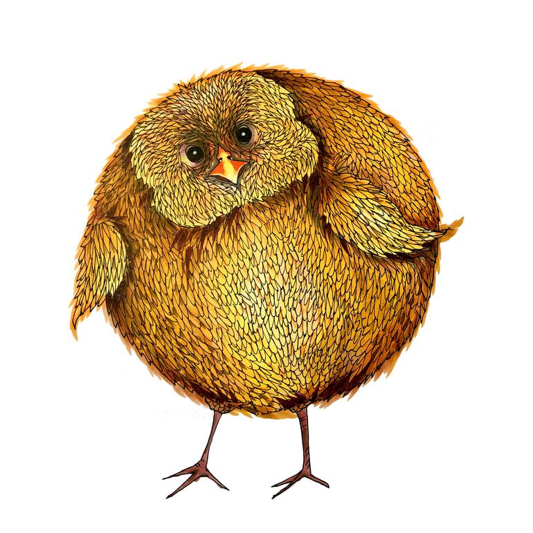

<div style="page-break-before: always;"></div>

Now that you have a firm grasp on the basic `LayoutElement` objects, you can start combining them in lists and tables.

Tables especially are almost omnipresent in a corporate setting, so it pays to know the ins and outs of working with `Table` in `borb`.

In this section you'll learn:

- How to aggregate the `LayoutElement` instances you've already seen into bigger groups using `List` and `Table`
- When to use the different implementations of `List`; `OrderedList`, `RomanNumeralOrderedList` and `UnorderedList`
- When to use the different implementations of `Table`; `FlexibleColumnWidthTable` and `FixedColumnWidthTable`
- How to use the convenience methods on `Table` and `List` to set properties on all the `LayoutElement` objects they contain

There are quite a few deep-dive examples that make use of `Table` if you're up for the challenge afterwards.

- Creating a realistic invoice
- Creating a Sudoku puzzle
- Creating a tents-and-trees puzzle
- Creating a nonogram

<div style="page-break-before: always;"></div>

## 3.1 Lists

`List` is the abstract base class that performs the layout of anything resembling a sequence of `LayoutElement` objects.

Different sub-classes of `List` can refine this behavior, for instance by adding bullets or numbers in front of each list-item.

### 3.1.1 Working with `OrderedList`

In this first list-related example, you'll be creating a list with 3 items. The list will be numbered.

```python
#!chapter_003/src/snippet_001.py
from borb.pdf.canvas.layout.list.ordered_list import OrderedList
from borb.pdf.canvas.layout.page_layout.multi_column_layout import SingleColumnLayout
from borb.pdf.canvas.layout.page_layout.page_layout import PageLayout
from borb.pdf.canvas.layout.text.paragraph import Paragraph
from borb.pdf.document.document import Document
from borb.pdf.page.page import Page
from borb.pdf.pdf import PDF


def main():

    # create Document
    doc: Document = Document()

    # create Page
    page: Page = Page()

    # add Page to Document
    doc.append_page(page)

    # set a PageLayout
    layout: PageLayout = SingleColumnLayout(page)

    # add OrderedList of 3 Paragraph objects
    layout.add(
        OrderedList()
        .add(Paragraph("Lorem"))
        .add(Paragraph("Ipsum"))
        .add(Paragraph("Dolor"))
    )

    # store
    with open("output.pdf", "wb") as out_file_handle:
        PDF.dumps(out_file_handle, doc)


if __name__ == "__main__":
    main()
```

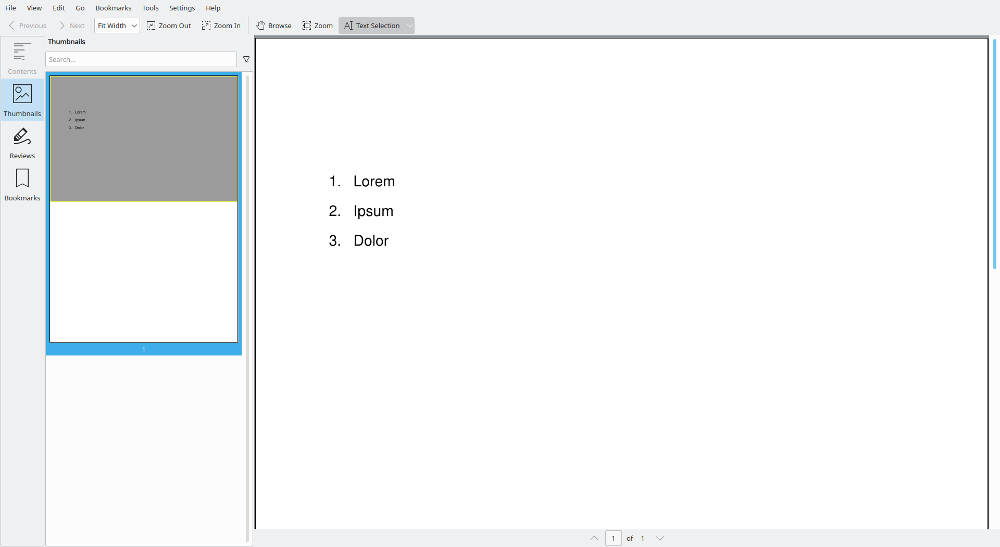

Of course, objects inside a `List` don't all need to look the same.
Try out the next example, where each item in the `List` has a different color.

```python
#!chapter_003/src/snippet_002.py
from borb.pdf.canvas.color.color import HexColor
from borb.pdf.canvas.layout.list.ordered_list import OrderedList
from borb.pdf.canvas.layout.page_layout.multi_column_layout import SingleColumnLayout
from borb.pdf.canvas.layout.page_layout.page_layout import PageLayout
from borb.pdf.canvas.layout.text.paragraph import Paragraph
from borb.pdf.document.document import Document
from borb.pdf.page.page import Page
from borb.pdf.pdf import PDF


def main():
    # create Document
    doc: Document = Document()

    # create Page
    page: Page = Page()

    # add Page to Document
    doc.append_page(page)

    # set a PageLayout
    layout: PageLayout = SingleColumnLayout(page)

    # add OrderedList of 3 Paragraph objects
    layout.add(
        OrderedList()
        .add(Paragraph("Lorem", font_color=HexColor("45CB85")))
        .add(Paragraph("Ipsum", font_color=HexColor("E08DAC")))
        .add(Paragraph("Dolor", font_color=HexColor("6A7FDB")))
    )

    # store
    with open("output.pdf", "wb") as out_file_handle:
        PDF.dumps(out_file_handle, doc)


if __name__ == "__main__":
    main()
```


In fact, the items in  a `List` don't even need to be of the same type.
In the next example you'll create a list containing a `Paragraph`, an `Image` and an `Emoji`.

```python
#!chapter_003/src/snippet_003.py
from decimal import Decimal

from borb.pdf.canvas.color.color import HexColor
from borb.pdf.canvas.layout.emoji.emoji import Emojis
from borb.pdf.canvas.layout.image.image import Image
from borb.pdf.canvas.layout.list.ordered_list import OrderedList
from borb.pdf.canvas.layout.page_layout.multi_column_layout import SingleColumnLayout
from borb.pdf.canvas.layout.page_layout.page_layout import PageLayout
from borb.pdf.canvas.layout.text.paragraph import Paragraph
from borb.pdf.document.document import Document
from borb.pdf.page.page import Page
from borb.pdf.pdf import PDF


def main():
    # create Document
    doc: Document = Document()

    # create Page
    page: Page = Page()

    # add Page to Document
    doc.append_page(page)

    # set a PageLayout
    layout: PageLayout = SingleColumnLayout(page)

    # add OrderedList of 3 objects, a Paragraph, an Image and an Emoji
    layout.add(
        OrderedList()
        .add(Paragraph("Lorem", font_color=HexColor("45CB85")))
        .add(
            Image(
                "https://images.unsplash.com/photo-1496637721836-f46d116e6d34?ixid=MnwxMjA3fDB8MHxwaG90by1wYWdlfHx8fGVufDB8fHx8",
                width=Decimal(64),
                height=Decimal(64),
            )
        )
        .add(Emojis.PINEAPPLE.value)
    )

    # store
    with open("output.pdf", "wb") as out_file_handle:
        PDF.dumps(out_file_handle, doc)


if __name__ == "__main__":
    main()
```

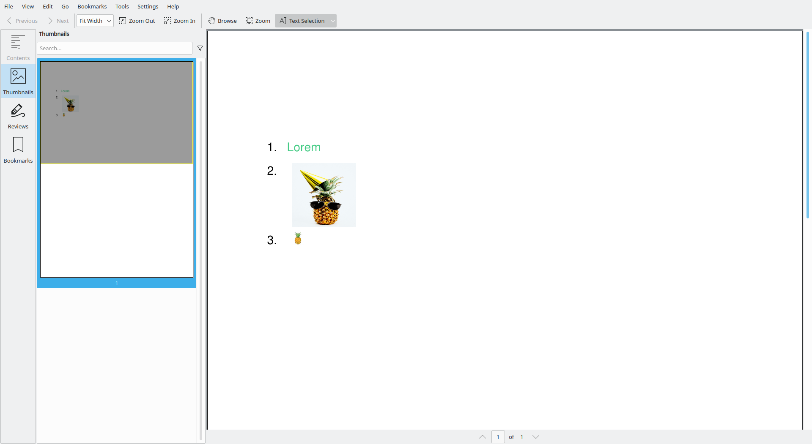

### 3.1.2 Working with `RomanNumeralOrderedList`

`borb` also supports lists with roman numerals. It works exactly the same as the regular `OrderedList`. 
In the next example you'll be creating a simple `Document` featuring a `RomanNumeralOrderedList`:

```python
#!chapter_003/src/snippet_004.py
from borb.pdf.canvas.layout.list.roman_list import RomanNumeralOrderedList
from borb.pdf.canvas.layout.page_layout.multi_column_layout import SingleColumnLayout
from borb.pdf.canvas.layout.page_layout.page_layout import PageLayout
from borb.pdf.canvas.layout.text.paragraph import Paragraph
from borb.pdf.document.document import Document
from borb.pdf.page.page import Page
from borb.pdf.pdf import PDF


def main():
    # create Document
    doc: Document = Document()

    # create Page
    page: Page = Page()

    # add Page to Document
    doc.append_page(page)

    # set a PageLayout
    layout: PageLayout = SingleColumnLayout(page)

    # add RomanNumeralOrderedList of 5 Paragraph objects
    layout.add(
        RomanNumeralOrderedList()
        .add(Paragraph("Lorem"))
        .add(Paragraph("Ipsum"))
        .add(Paragraph("Dolor"))
        .add(Paragraph("Sit"))
        .add(Paragraph("Amet"))
    )

    # store
    with open("output.pdf", "wb") as out_file_handle:
        PDF.dumps(out_file_handle, doc)


if __name__ == "__main__":
    main()
```


### 3.1.3 Working with `UnorderedList`

`UnorderedList` works exactly like `OrderedList`, the key difference being that in stead of displaying numbers before each list item, bullet-characters are displayed.

```python
#!chapter_003/src/snippet_005.py
from borb.pdf.canvas.layout.list.unordered_list import UnorderedList
from borb.pdf.canvas.layout.page_layout.multi_column_layout import SingleColumnLayout
from borb.pdf.canvas.layout.page_layout.page_layout import PageLayout
from borb.pdf.canvas.layout.text.paragraph import Paragraph
from borb.pdf.document.document import Document
from borb.pdf.page.page import Page
from borb.pdf.pdf import PDF


def main():
    # create Document
    doc: Document = Document()

    # create Page
    page: Page = Page()

    # add Page to Document
    doc.append_page(page)

    # set a PageLayout
    layout: PageLayout = SingleColumnLayout(page)

    # add UnorderedList of 3 Paragraph objects
    layout.add(
        UnorderedList()
        .add(Paragraph("Lorem"))
        .add(Paragraph("Ipsum"))
        .add(Paragraph("Dolor"))
        .add(Paragraph("Sit"))
        .add(Paragraph("Amet"))
    )

    # store
    with open("output.pdf", "wb") as out_file_handle:
        PDF.dumps(out_file_handle, doc)


if __name__ == "__main__":
    main()
```

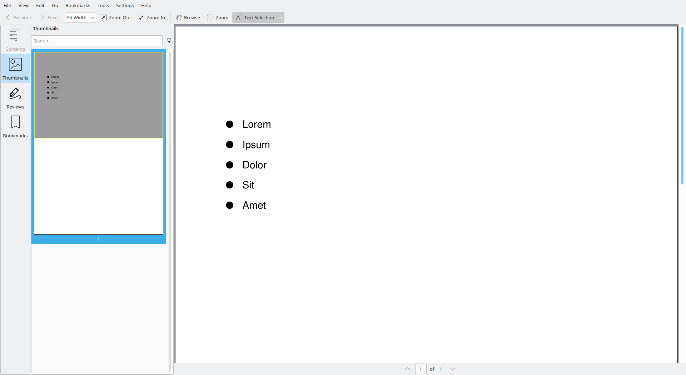

### 3.1.4 Nesting `List` objects

Of course, sometimes you'd like to display a `List` of `Lists`. 
As you already know, the content of a `List` can be just about anything. 
So naturally, `borb` supports nested Lists.

In the next example you'll be creating a nested unordered list.

```python
#!chapter_003/src/snippet_006.py
from borb.pdf.canvas.layout.list.unordered_list import UnorderedList
from borb.pdf.canvas.layout.page_layout.multi_column_layout import SingleColumnLayout
from borb.pdf.canvas.layout.page_layout.page_layout import PageLayout
from borb.pdf.canvas.layout.text.paragraph import Paragraph
from borb.pdf.document.document import Document
from borb.pdf.page.page import Page
from borb.pdf.pdf import PDF


def main():
    # create Document
    doc: Document = Document()

    # create Page
    page: Page = Page()

    # add Page to Document
    doc.append_page(page)

    # set a PageLayout
    layout: PageLayout = SingleColumnLayout(page)

    # add UnorderedList containing a (twice nested) UnorderedList
    layout.add(
        UnorderedList()
        .add(Paragraph("Lorem"))
        .add(Paragraph("Ipsum"))
        .add(
            UnorderedList()
            .add(Paragraph("One"))
            .add(Paragraph("Two"))
            .add(
                UnorderedList()
                .add(Paragraph("1"))
                .add(Paragraph("2"))
                .add(Paragraph("3"))
            )
            .add(Paragraph("Three"))
        )
        .add(Paragraph("Dolor"))
        .add(Paragraph("Sit"))
        .add(Paragraph("Amet"))
    )

    # store
    with open("output.pdf", "wb") as out_file_handle:
        PDF.dumps(out_file_handle, doc)


if __name__ == "__main__":
    main()
```


And now, you may understand why the font Zapfdingbats is required to be embedded. All those wonderful list-bullets are actually characters from the Zapfdingbats font.

Of course, you can do the same for ordered lists as well.

```python
#!chapter_003/src/snippet_007.py
from borb.pdf.canvas.layout.list.ordered_list import OrderedList
from borb.pdf.canvas.layout.page_layout.multi_column_layout import SingleColumnLayout
from borb.pdf.canvas.layout.page_layout.page_layout import PageLayout
from borb.pdf.canvas.layout.text.paragraph import Paragraph
from borb.pdf.document.document import Document
from borb.pdf.page.page import Page
from borb.pdf.pdf import PDF


def main():
    # create Document
    doc: Document = Document()

    # create Page
    page: Page = Page()

    # add Page to Document
    doc.append_page(page)

    # set a PageLayout
    layout: PageLayout = SingleColumnLayout(page)

    # add OrderedList containing a (twice nested) OrderedList
    layout.add(
        OrderedList()
        .add(Paragraph("Lorem"))
        .add(Paragraph("Ipsum"))
        .add(
            OrderedList()
            .add(Paragraph("One"))
            .add(Paragraph("Two"))
            .add(
                OrderedList()
                .add(Paragraph("1"))
                .add(Paragraph("2"))
                .add(Paragraph("3"))
            )
            .add(Paragraph("Three"))
        )
        .add(Paragraph("Dolor"))
        .add(Paragraph("Sit"))
        .add(Paragraph("Amet"))
    )

    # store
    with open("output.pdf", "wb") as out_file_handle:
        PDF.dumps(out_file_handle, doc)


if __name__ == "__main__":
    main()
```

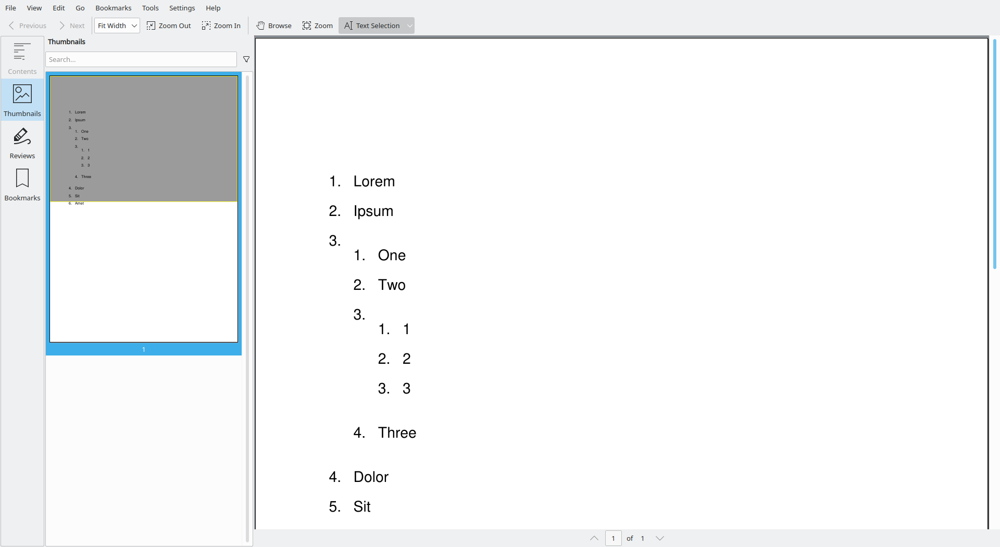

Finally, you can also mix and match, embedding ordered lists into unordered lists or vice-versa.
I'll leave that as an exercise ;-)

<div style="page-break-before: always;"></div>

## 3.2 Tables

Tables offer another opportunity to present data in a format that is easily processed by the reader of your PDF's. 
You can create tables to represent invoices, itemized bills, forms, Sudoku's and much more.

`borb` offers two main implementations of the base class `Table`:

- `FixedColumnWidthTable`: In this `Table` all columns have a fixed width, which is (by default) an equal part of whatever container the `Table` occupies. E.g. if the `Table` is placed directly on the `Page`, and there are 3 columns, each column will have  1/3 of the width of the `Page` . These ratios can be tweaked of course.
- `FlexibleColumnWidthTable`: In this kind of `Table` the width of a column depends on the content the column contains. Unless physically impossible, every column gets at least its minimum width (which requires calculating the minimum width for all content items in all columns). Typically, any remaining space is divided evenly among the columns. This `Table` implementation is a bit more complex to understand, but yields a layout that resembles the classical HTML layout more closely.

Each `Table` supports:

- Setting `row_span` and `col_span` on each `TableCell`
- Setting `border_top`, `border_right`, `border_bottom` and `border_left` on each `TableCell`
- Setting `background_color` on each `TableCell`
- Setting odd/even row-colors
- Convenience methods for setting:
    - All outside borders
    - All inside borders
    - `padding_top`, `padding_right`, `padding_bottom` and `padding_left` on all `TableCell` objects in the `Table`
    - Etc

### 3.2.1 FixedColumnWidthTable

In the next example, you'll be creating a simple `Table` with 3 columns and 2 rows.

```python
#!chapter_003/src/snippet_008.py
from decimal import Decimal

from borb.pdf.canvas.layout.page_layout.multi_column_layout import SingleColumnLayout
from borb.pdf.canvas.layout.page_layout.page_layout import PageLayout
from borb.pdf.canvas.layout.table.fixed_column_width_table import FixedColumnWidthTable
from borb.pdf.canvas.layout.text.paragraph import Paragraph
from borb.pdf.document.document import Document
from borb.pdf.page.page import Page
from borb.pdf.pdf import PDF


def main():
    # create Document
    doc: Document = Document()

    # create Page
    page: Page = Page()

    # add Page to Document
    doc.append_page(page)

    # set a PageLayout
    layout: PageLayout = SingleColumnLayout(page)

    # create a FixedColumnWidthTable
    layout.add(
        FixedColumnWidthTable(number_of_columns=3, number_of_rows=2)
        .add(Paragraph("Lorem"))
        .add(Paragraph("Ipsum"))
        .add(Paragraph("Dolor"))
        .add(Paragraph("Sit"))
        .add(Paragraph("Amet"))
        .add(Paragraph("Consectetur"))
    )

    # store
    with open("output.pdf", "wb") as out_file_handle:
        PDF.dumps(out_file_handle, doc)


if __name__ == "__main__":
    main()
```


This is not exactly the best looking table in the world. 
Let's add some padding to all cells to ensure the text doesn't *stick* to the cell borders so much.

```python
#!chapter_003/src/snippet_009.py
from decimal import Decimal

from borb.pdf.canvas.layout.page_layout.multi_column_layout import SingleColumnLayout
from borb.pdf.canvas.layout.page_layout.page_layout import PageLayout
from borb.pdf.canvas.layout.table.fixed_column_width_table import FixedColumnWidthTable
from borb.pdf.canvas.layout.text.paragraph import Paragraph
from borb.pdf.document.document import Document
from borb.pdf.page.page import Page
from borb.pdf.pdf import PDF


def main():
    # create Document
    doc: Document = Document()

    # create Page
    page: Page = Page()

    # add Page to Document
    doc.append_page(page)

    # set a PageLayout
    layout: PageLayout = SingleColumnLayout(page)

    # create a FixedColumnWidthTable
    layout.add(
        FixedColumnWidthTable(number_of_columns=3, number_of_rows=2)
        .add(Paragraph("Lorem"))
        .add(Paragraph("Ipsum"))
        .add(Paragraph("Dolor"))
        .add(Paragraph("Sit"))
        .add(Paragraph("Amet"))
        .add(Paragraph("Consectetur"))
        # set padding on all (implicit) TableCell objects in the FixedColumnWidthTable
        .set_padding_on_all_cells(Decimal(2), Decimal(2), Decimal(2), Decimal(2))
    )

    # store
    with open("output.pdf", "wb") as out_file_handle:
        PDF.dumps(out_file_handle, doc)


if __name__ == "__main__":
    main()
```


That's a lot better already. 

As mentioned earlier, the precise ratio of the `page_width` that each column occupies is something you can configure. 
In the next example you'll be setting one column to take up 50% of the `page_width`, 
and divide the remaining space among the other 2.

```python
#!chapter_003/src/snippet_010.py
from decimal import Decimal

from borb.pdf.canvas.layout.page_layout.multi_column_layout import SingleColumnLayout
from borb.pdf.canvas.layout.page_layout.page_layout import PageLayout
from borb.pdf.canvas.layout.table.fixed_column_width_table import FixedColumnWidthTable
from borb.pdf.canvas.layout.text.paragraph import Paragraph
from borb.pdf.document.document import Document
from borb.pdf.page.page import Page
from borb.pdf.pdf import PDF


def main():
    # create Document
    doc: Document = Document()

    # create Page
    page: Page = Page()

    # add Page to Document
    doc.append_page(page)

    # set a PageLayout
    layout: PageLayout = SingleColumnLayout(page)

    # create a FixedColumnWidthTable
    layout.add(
        FixedColumnWidthTable(
            number_of_columns=3,
            number_of_rows=2,
            # adjust the ratios of column widths for this FixedColumnWidthTable
            column_widths=[Decimal(2), Decimal(1), Decimal(1)],
        )
        .add(Paragraph("Lorem"))
        .add(Paragraph("Ipsum"))
        .add(Paragraph("Dolor"))
        .add(Paragraph("Sit"))
        .add(Paragraph("Amet"))
        .add(Paragraph("Consectetur"))
        # set padding on all (implicit) TableCell objects in the FixedColumnWidthTable
        .set_padding_on_all_cells(Decimal(2), Decimal(2), Decimal(2), Decimal(2))
    )

    # store
    with open("output.pdf", "wb") as out_file_handle:
        PDF.dumps(out_file_handle, doc)


if __name__ == "__main__":
    main()
```

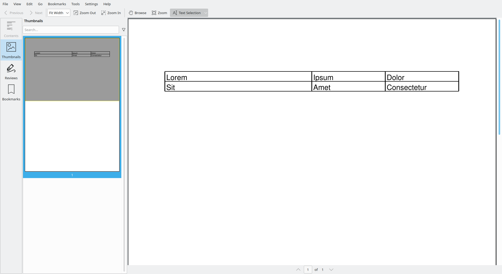

There are some other minor tweaks you can apply. 
To really visualize the next tweak, we should add some more data.

```python
#!chapter_003/src/snippet_011.py
from decimal import Decimal

from borb.pdf.canvas.color.color import X11Color
from borb.pdf.canvas.layout.page_layout.multi_column_layout import SingleColumnLayout
from borb.pdf.canvas.layout.page_layout.page_layout import PageLayout
from borb.pdf.canvas.layout.table.fixed_column_width_table import FixedColumnWidthTable
from borb.pdf.canvas.layout.text.paragraph import Paragraph
from borb.pdf.document.document import Document
from borb.pdf.page.page import Page
from borb.pdf.pdf import PDF


def main():
    # create Document
    doc: Document = Document()

    # create Page
    page: Page = Page()

    # add Page to Document
    doc.append_page(page)

    # set a PageLayout
    layout: PageLayout = SingleColumnLayout(page)

    # create a FixedColumnWidthTable
    layout.add(
        FixedColumnWidthTable(number_of_columns=3, number_of_rows=4)
        .add(Paragraph("Lorem"))
        .add(Paragraph("Ipsum"))
        .add(Paragraph("Dolor"))
        .add(Paragraph("Sit"))
        .add(Paragraph("Amet"))
        .add(Paragraph("Consectetur"))
        .add(Paragraph("Adipiscing"))
        .add(Paragraph("Elit"))
        .add(Paragraph("Sed"))
        .add(Paragraph("Do"))
        .add(Paragraph("Eiusmod"))
        .add(Paragraph("Tempor"))
        # set padding on all (implicit) TableCell objects in the FixedColumnWidthTable
        .set_padding_on_all_cells(Decimal(2), Decimal(2), Decimal(2), Decimal(2))
        # apply 'zebra striping' to the FixedColumnWidthTable
        .even_odd_row_colors(X11Color("LightGray"), X11Color("White"))
    )

    # store
    with open("output.pdf", "wb") as out_file_handle:
        PDF.dumps(out_file_handle, doc)


if __name__ == "__main__":
    main()
```

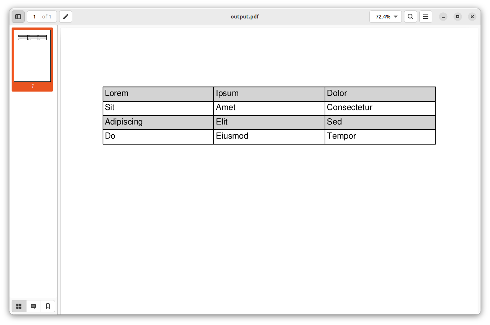

### 3.2.2 FlexibleColumnWidthTable

In the next example you're going to create a `Table` similar to the ones you created earlier. 
The difference between both kinds of `Table` will become obvious.

```python
#!chapter_003/src/snippet_012.py
from borb.pdf.canvas.layout.page_layout.multi_column_layout import SingleColumnLayout
from borb.pdf.canvas.layout.page_layout.page_layout import PageLayout
from borb.pdf.canvas.layout.table.flexible_column_width_table import (
    FlexibleColumnWidthTable,
)
from borb.pdf.canvas.layout.text.paragraph import Paragraph
from borb.pdf.document.document import Document
from borb.pdf.page.page import Page
from borb.pdf.pdf import PDF


def main():
    # create Document
    doc: Document = Document()

    # create Page
    page: Page = Page()

    # add Page to Document
    doc.append_page(page)

    # set a PageLayout
    layout: PageLayout = SingleColumnLayout(page)

    # create a FlexibleColumnWidthTable
    layout.add(
        FlexibleColumnWidthTable(number_of_columns=3, number_of_rows=2)
        .add(Paragraph("Lorem"))
        .add(Paragraph("Ipsum"))
        .add(Paragraph("Dolor"))
        .add(Paragraph("Sit"))
        .add(Paragraph("Amet"))
        .add(Paragraph("Consectetur"))
    )

    # store
    with open("output.pdf", "wb") as out_file_handle:
        PDF.dumps(out_file_handle, doc)


if __name__ == "__main__":
    main()
```

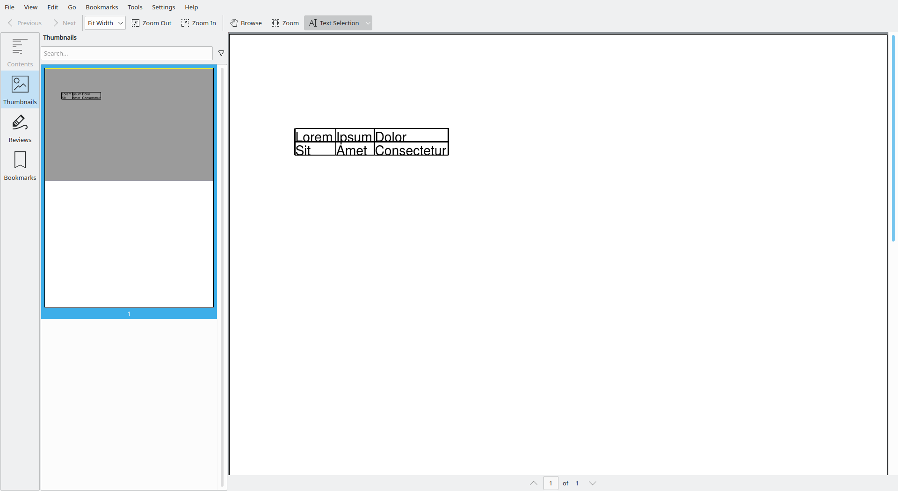

Let's set the padding. That'll make this `Table` look a bit better.

```python
#!chapter_003/src/snippet_013.py
from decimal import Decimal

from borb.pdf.canvas.layout.page_layout.multi_column_layout import SingleColumnLayout
from borb.pdf.canvas.layout.page_layout.page_layout import PageLayout
from borb.pdf.canvas.layout.table.flexible_column_width_table import (
    FlexibleColumnWidthTable,
)
from borb.pdf.canvas.layout.text.paragraph import Paragraph
from borb.pdf.document.document import Document
from borb.pdf.page.page import Page
from borb.pdf.pdf import PDF


def main():
    # create Document
    doc: Document = Document()

    # create Page
    page: Page = Page()

    # add Page to Document
    doc.append_page(page)

    # set a PageLayout
    layout: PageLayout = SingleColumnLayout(page)

    # create a FlexibleColumnWidthTable
    layout.add(
        FlexibleColumnWidthTable(number_of_columns=3, number_of_rows=2)
        .add(Paragraph("Lorem"))
        .add(Paragraph("Ipsum"))
        .add(Paragraph("Dolor"))
        .add(Paragraph("Sit"))
        .add(Paragraph("Amet"))
        .add(Paragraph("Consectetur"))
        # set padding on all (implicit) TableCell objects in the FlexibleColumnWidthTable
        .set_padding_on_all_cells(Decimal(2), Decimal(2), Decimal(2), Decimal(2))
    )

    # store
    with open("output.pdf", "wb") as out_file_handle:
        PDF.dumps(out_file_handle, doc)


if __name__ == "__main__":
    main()
```


As you can see, this `Table` only takes up as much space as is needed to render the content in each `TableCell`.
This is more in line with the behavior you'd expect from an `HTML` `<table>` element.

### 3.2.3 Setting layout properties on individual cells of a `Table`

In the previous examples you've already set some layout properties. You've set padding and applied alternating background colors. Of course, there are use-cases where you'd like to set these properties on individual cell objects. 

In order to do that, you'll need to construct a `TableCell` object and apply the style there. This may feel like a bit of a workaround, but you've already been using this object without knowing it.

Every time you've added anything to a `Table` that isn't `TableCell` it was automatically getting wrapped in a `TableCell` object.

In the next example, you'll be setting the background color of an individual cell to `X11Color('Red')` and removing two of its borders.

```python
#!chapter_003/src/snippet_014.py
from decimal import Decimal

from borb.pdf.canvas.color.color import X11Color
from borb.pdf.canvas.layout.page_layout.multi_column_layout import SingleColumnLayout
from borb.pdf.canvas.layout.page_layout.page_layout import PageLayout
from borb.pdf.canvas.layout.table.table import TableCell
from borb.pdf.canvas.layout.table.flexible_column_width_table import (
    FlexibleColumnWidthTable,
)
from borb.pdf.canvas.layout.text.paragraph import Paragraph
from borb.pdf.document.document import Document
from borb.pdf.page.page import Page
from borb.pdf.pdf import PDF


def main():
    # create Document
    doc: Document = Document()

    # create Page
    page: Page = Page()

    # add Page to Document
    doc.append_page(page)

    # set a PageLayout
    layout: PageLayout = SingleColumnLayout(page)

    # create a FlexibleColumnWidthTable
    layout.add(
        FlexibleColumnWidthTable(number_of_columns=3, number_of_rows=2)
        .add(
            # explictly create a TableCell so we can set the properties of this cell individually
            TableCell(
                Paragraph("Lorem"),
                background_color=X11Color("Red"),
                border_top=False,
                border_left=False,
            )
        )
        .add(Paragraph("Ipsum"))
        .add(Paragraph("Dolor"))
        .add(Paragraph("Sit"))
        .add(Paragraph("Amet"))
        .add(Paragraph("Consectetur"))
        # set padding on all (implicit) TableCell objects in the FlexibleColumnWidthTable
        .set_padding_on_all_cells(Decimal(2), Decimal(2), Decimal(2), Decimal(2))
    )

    # store
    with open("output.pdf", "wb") as out_file_handle:
        PDF.dumps(out_file_handle, doc)


if __name__ == "__main__":
    main()
```

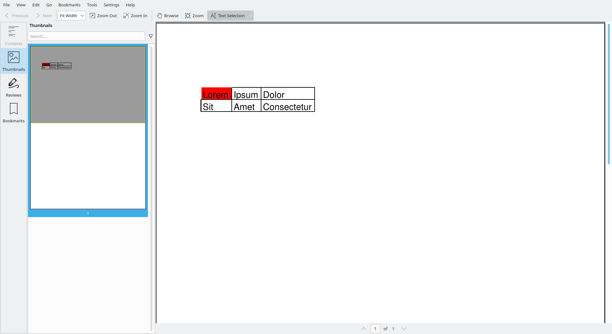

This is particularly useful when you're building a comparison matrix, and you'd like to *remove* the `TableCell` at the top-left corner.

In the next example you'll build a feature-comparison matrix for several mobile tourist guides;

```python
#!chapter_003/src/snippet_015.py
from decimal import Decimal

from borb.pdf.canvas.layout.emoji.emoji import Emojis
from borb.pdf.canvas.layout.layout_element import Alignment
from borb.pdf.canvas.layout.page_layout.multi_column_layout import SingleColumnLayout
from borb.pdf.canvas.layout.page_layout.page_layout import PageLayout
from borb.pdf.canvas.layout.table.table import TableCell
from borb.pdf.canvas.layout.table.flexible_column_width_table import (
    FlexibleColumnWidthTable,
)
from borb.pdf.canvas.layout.text.paragraph import Paragraph
from borb.pdf.document.document import Document
from borb.pdf.page.page import Page
from borb.pdf.page.page_size import PageSize
from borb.pdf.pdf import PDF


def main():
    # create Document
    doc: Document = Document()

    # create Page
    page: Page = Page()

    # add Page to Document
    doc.append_page(page)

    # set a PageLayout
    layout: PageLayout = SingleColumnLayout(page)

    # create a FlexibleColumnWidthTable
    layout.add(
        FlexibleColumnWidthTable(number_of_columns=11, number_of_rows=5)
        # row 1
        .add(
            TableCell(
                Paragraph(" "),
                border_top=False,
                border_left=False,
            )
        )
        .add(Paragraph("View map", text_alignment=Alignment.CENTERED))
        .add(Paragraph("Place marker on a map", text_alignment=Alignment.CENTERED))
        .add(Paragraph("View direction", text_alignment=Alignment.CENTERED))
        .add(Paragraph("Launch Google maps", text_alignment=Alignment.CENTERED))
        .add(Paragraph("Show street view", text_alignment=Alignment.CENTERED))
        .add(Paragraph("Download map from Google", text_alignment=Alignment.CENTERED))
        .add(Paragraph("Show satelite view", text_alignment=Alignment.CENTERED))
        .add(
            Paragraph(
                "Search for nearest attraction", text_alignment=Alignment.CENTERED
            )
        )
        .add(Paragraph("Show next attraction", text_alignment=Alignment.CENTERED))
        .add(Paragraph("Retrieve data", text_alignment=Alignment.CENTERED))
        # row 2
        .add(Paragraph("Mobile Tourist Guide 1"))
        .add(Emojis.HEAVY_CHECK_MARK.value)
        .add(Emojis.HEAVY_CHECK_MARK.value)
        .add(Emojis.HEAVY_CHECK_MARK.value)
        .add(Emojis.HEAVY_CHECK_MARK.value)
        .add(Emojis.HEAVY_CHECK_MARK.value)
        .add(Paragraph(" "))
        .add(Paragraph(" "))
        .add(Paragraph(" "))
        .add(Paragraph(" "))
        .add(Paragraph(" "))
        # row 3
        .add(Paragraph("Mobile Tourist Guide 2"))
        .add(Emojis.HEAVY_CHECK_MARK.value)
        .add(Emojis.HEAVY_CHECK_MARK.value)
        .add(Emojis.HEAVY_CHECK_MARK.value)
        .add(Emojis.HEAVY_CHECK_MARK.value)
        .add(Emojis.HEAVY_CHECK_MARK.value)
        .add(Emojis.HEAVY_CHECK_MARK.value)
        .add(Paragraph(" "))
        .add(Paragraph(" "))
        .add(Paragraph(" "))
        .add(Paragraph(" "))
        # row 4
        .add(Paragraph("Mobile Tourist Guide 3"))
        .add(Emojis.HEAVY_CHECK_MARK.value)
        .add(Emojis.HEAVY_CHECK_MARK.value)
        .add(Emojis.HEAVY_CHECK_MARK.value)
        .add(Emojis.HEAVY_CHECK_MARK.value)
        .add(Emojis.HEAVY_CHECK_MARK.value)
        .add(Paragraph(" "))
        .add(Emojis.HEAVY_CHECK_MARK.value)
        .add(Paragraph(" "))
        .add(Paragraph(" "))
        .add(Paragraph(" "))
        # row 5
        .add(Paragraph("Mobile Tourist Guide 4"))
        .add(Emojis.HEAVY_CHECK_MARK.value)
        .add(Emojis.HEAVY_CHECK_MARK.value)
        .add(Emojis.HEAVY_CHECK_MARK.value)
        .add(Emojis.HEAVY_CHECK_MARK.value)
        .add(Emojis.HEAVY_CHECK_MARK.value)
        .add(Paragraph(" "))
        .add(Paragraph(" "))
        .add(Emojis.HEAVY_CHECK_MARK.value)
        .add(Emojis.HEAVY_CHECK_MARK.value)
        .add(Emojis.HEAVY_CHECK_MARK.value)
        .set_padding_on_all_cells(Decimal(5), Decimal(5), Decimal(5), Decimal(5))
    )

    # store
    with open("output.pdf", "wb") as out_file_handle:
        PDF.dumps(out_file_handle, doc)


if __name__ == "__main__":
    main()
```


### 3.2.4 Incomplete `Table`

`Table` requires you to specify the number of rows and columns up front. Sometimes however, the amount of data does not really match `rows x columns`, and the final few cells of your `Table` are not needed.

In order to avoid having to pass empty `TableCell` or `Paragraph` objects, you can rely on the auto-complete feature of the `Table` implementation.

Whenever a `Table` does not have `rows x columns` objects in it, the remaining cells are filled with blank by default. The style (borders, backgrounds, etc) is also copied from the default style.

In the next example you'll create an incomplete `Table` and watch how the `Table` is filled by `borb`.

```python
#!chapter_003/src/snippet_016.py
from decimal import Decimal

from borb.pdf.canvas.layout.page_layout.multi_column_layout import SingleColumnLayout
from borb.pdf.canvas.layout.page_layout.page_layout import PageLayout
from borb.pdf.canvas.layout.table.flexible_column_width_table import (
    FlexibleColumnWidthTable,
)
from borb.pdf.canvas.layout.text.paragraph import Paragraph
from borb.pdf.document.document import Document
from borb.pdf.page.page import Page
from borb.pdf.pdf import PDF


def main():
    # create Document
    doc: Document = Document()

    # create Page
    page: Page = Page()

    # add Page to Document
    doc.append_page(page)

    # set a PageLayout
    layout: PageLayout = SingleColumnLayout(page)

    # create a FlexibleColumnWidthTable
    layout.add(
        FlexibleColumnWidthTable(number_of_columns=3, number_of_rows=2)
        .add(Paragraph("Lorem"))
        .add(Paragraph("Ipsum"))
        .add(Paragraph("Dolor"))
        .add(Paragraph("Sit"))
        .set_padding_on_all_cells(Decimal(2), Decimal(2), Decimal(2), Decimal(2))
    )

    # store
    with open("output.pdf", "wb") as out_file_handle:
        PDF.dumps(out_file_handle, doc)


if __name__ == "__main__":
    main()
```

You'll have noticed that you created a `Table` that expects 6 pieces of content. 
Yet, you added only 4. 
The remainder will be dealt with by `borb` automatically.


**Keep in mind the style will be the default style.** 
If that's not what you want, you should add each TableCell individually, 
or write a convenience method that builds empty cells with the appropriate style.

### 3.2.5 Setting `col_span` and `row_span`

Sometimes, you'd like to shake things up a bit. 
For instance using a `TableCell` that spans multiple rows or columns. 
`borb` naturally supports concepts such as `col_span` and `row_span`

In the next example you'll be using `col_span` on a `TableCell` object.

```python
#!chapter_003/src/snippet_017.py
from decimal import Decimal

from borb.pdf.canvas.layout.page_layout.multi_column_layout import SingleColumnLayout
from borb.pdf.canvas.layout.page_layout.page_layout import PageLayout
from borb.pdf.canvas.layout.table.flexible_column_width_table import (
    FlexibleColumnWidthTable,
)
from borb.pdf.canvas.layout.table.table import TableCell
from borb.pdf.canvas.layout.text.paragraph import Paragraph
from borb.pdf.document.document import Document
from borb.pdf.page.page import Page
from borb.pdf.pdf import PDF


def main():
    # create Document
    doc: Document = Document()

    # create Page
    page: Page = Page()

    # add Page to Document
    doc.append_page(page)

    # set a PageLayout
    layout: PageLayout = SingleColumnLayout(page)

    # create a FlexibleColumnWidthTable
    layout.add(
        FlexibleColumnWidthTable(number_of_columns=3, number_of_rows=2)
        .add(Paragraph("Lorem"))
        .add(Paragraph("Ipsum"))
        .add(Paragraph("Dolor"))
        # set col_span to 2
        .add(TableCell(Paragraph("Sit"), col_span=2))
        .add(Paragraph("Amet"))
        .set_padding_on_all_cells(Decimal(2), Decimal(2), Decimal(2), Decimal(2))
    )

    # store
    with open("output.pdf", "wb") as out_file_handle:
        PDF.dumps(out_file_handle, doc)


if __name__ == "__main__":
    main()
```

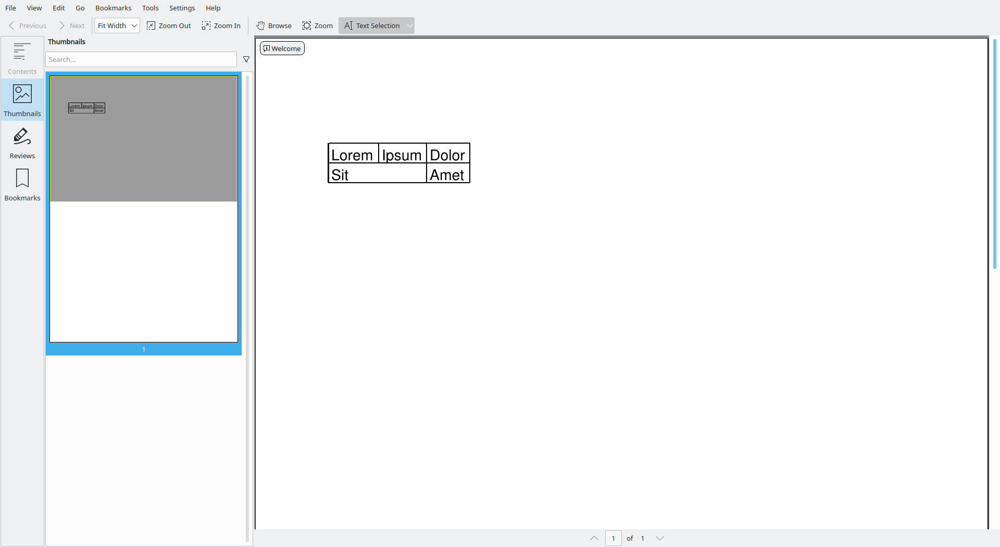

Of course, you can do the same for `row_span`:

```python
#!chapter_003/src/snippet_018.py
from decimal import Decimal

from borb.pdf.canvas.layout.page_layout.multi_column_layout import SingleColumnLayout
from borb.pdf.canvas.layout.page_layout.page_layout import PageLayout

from borb.pdf.canvas.layout.table.flexible_column_width_table import (
    FlexibleColumnWidthTable,
)
from borb.pdf.canvas.layout.table.table import TableCell
from borb.pdf.canvas.layout.text.paragraph import Paragraph
from borb.pdf.document.document import Document
from borb.pdf.page.page import Page
from borb.pdf.pdf import PDF


def main():
    # create Document
    doc: Document = Document()

    # create Page
    page: Page = Page()

    # add Page to Document
    doc.append_page(page)

    # set a PageLayout
    layout: PageLayout = SingleColumnLayout(page)

    # create a FlexibleColumnWidthTable
    layout.add(
        FlexibleColumnWidthTable(number_of_columns=3, number_of_rows=2)
        # set row_span to 2
        .add(TableCell(Paragraph("Lorem"), row_span=2))
        .add(Paragraph("Ipsum"))
        .add(Paragraph("Dolor"))
        .add(Paragraph("Sit"))
        .add(Paragraph("Amet"))
        .set_padding_on_all_cells(Decimal(2), Decimal(2), Decimal(2), Decimal(2))
    )

    # store
    with open("output.pdf", "wb") as out_file_handle:
        PDF.dumps(out_file_handle, doc)


if __name__ == "__main__":
    main()
```

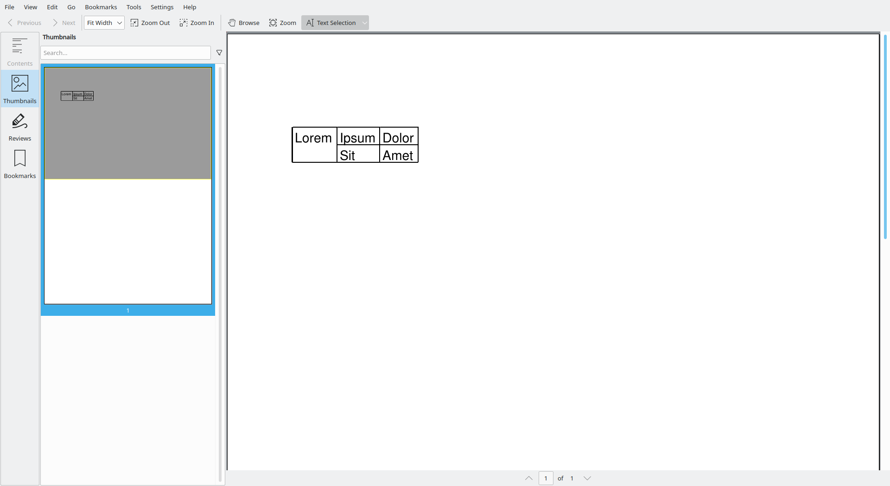

<div style="page-break-before: always;"></div>

## 3.3 Nesting `Table` in `List` and vice-versa

### 3.3.1 Nesting a `Table` in a `List`

You can add a `Table` to a `List`, since `List` accepts any `LayoutElement` as content,
and `Table` implements the `LayoutElement` interface.

```python
#!chapter_003/src/snippet_019.py
from decimal import Decimal

from borb.pdf.canvas.layout.page_layout.multi_column_layout import SingleColumnLayout
from borb.pdf.canvas.layout.page_layout.page_layout import PageLayout
from borb.pdf.canvas.layout.list.ordered_list import OrderedList
from borb.pdf.canvas.layout.table.flexible_column_width_table import (
    FlexibleColumnWidthTable,
)
from borb.pdf.canvas.layout.table.table import TableCell
from borb.pdf.canvas.layout.text.paragraph import Paragraph
from borb.pdf.document.document import Document
from borb.pdf.page.page import Page
from borb.pdf.pdf import PDF


def main():
    # create Document
    doc: Document = Document()

    # create Page
    page: Page = Page()

    # add Page to Document
    doc.append_page(page)

    # set a PageLayout
    layout: PageLayout = SingleColumnLayout(page)

    # create a FlexibleColumnWidthTable
    table: FlexibleColumnWidthTable = (
        FlexibleColumnWidthTable(number_of_columns=3, number_of_rows=2)
        .add(Paragraph("Lorem"))
        .add(Paragraph("Ipsum"))
        .add(Paragraph("Dolor"))
        .add(Paragraph("Sit"))
        .add(Paragraph("Amet"))
        .add(Paragraph("Nunc"))
        .set_padding_on_all_cells(Decimal(2), Decimal(2), Decimal(2), Decimal(2))
    )

    layout.add(
        OrderedList()
        .add(Paragraph("Item 1"))
        .add(Paragraph("Item 2"))
        .add(table)
        .add(Paragraph("Item 4"))
    )

    # store
    with open("output.pdf", "wb") as out_file_handle:
        PDF.dumps(out_file_handle, doc)


if __name__ == "__main__":
    main()
```

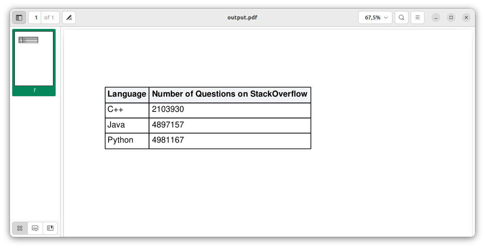

### 3.3.2 Nesting a `List` in a `Table`

Conversely, you can also use `List` inside a `Table`.

```python
#!chapter_003/src/snippet_020.py
from decimal import Decimal

from borb.pdf.canvas.layout.page_layout.multi_column_layout import SingleColumnLayout
from borb.pdf.canvas.layout.page_layout.page_layout import PageLayout
from borb.pdf.canvas.layout.list.ordered_list import OrderedList
from borb.pdf.canvas.layout.table.flexible_column_width_table import (
    FlexibleColumnWidthTable,
)
from borb.pdf.canvas.layout.table.table import TableCell
from borb.pdf.canvas.layout.text.paragraph import Paragraph
from borb.pdf.document.document import Document
from borb.pdf.page.page import Page
from borb.pdf.pdf import PDF


def main():
    # create Document
    doc: Document = Document()

    # create Page
    page: Page = Page()

    # add Page to Document
    doc.append_page(page)

    # set a PageLayout
    layout: PageLayout = SingleColumnLayout(page)

    # create an OrderedList
    list: OrderedList = (
        OrderedList()
        .add(Paragraph("Item 1"))
        .add(Paragraph("Item 2"))
        .add(Paragraph("Item 4"))
    )

    # create a FlexibleColumnWidthTable
    table: FlexibleColumnWidthTable = (
        FlexibleColumnWidthTable(number_of_columns=3, number_of_rows=2)
        .add(Paragraph("Lorem"))
        .add(Paragraph("Ipsum"))
        .add(list)
        .add(Paragraph("Sit"))
        .add(Paragraph("Amet"))
        .add(Paragraph("Nunc"))
        .set_padding_on_all_cells(Decimal(2), Decimal(2), Decimal(2), Decimal(2))
    )

    layout.add(table)

    # store
    with open("output.pdf", "wb") as out_file_handle:
        PDF.dumps(out_file_handle, doc)


if __name__ == "__main__":
    main()
```

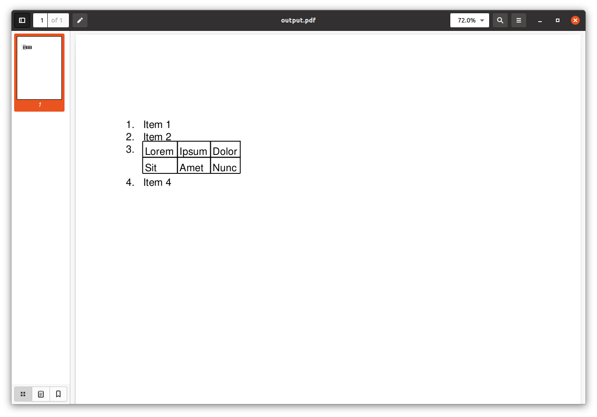

## 3.4 Conclusion

In this chapter you've learnt how to use the basic `LayoutElement` objects inside larger container-`LayoutElement` objects such as `Table` and `List`.
You've seen some pratical differences between the various implementations of `Table` and `List` and you've coded up some examples for each of them.
# 4 Forms

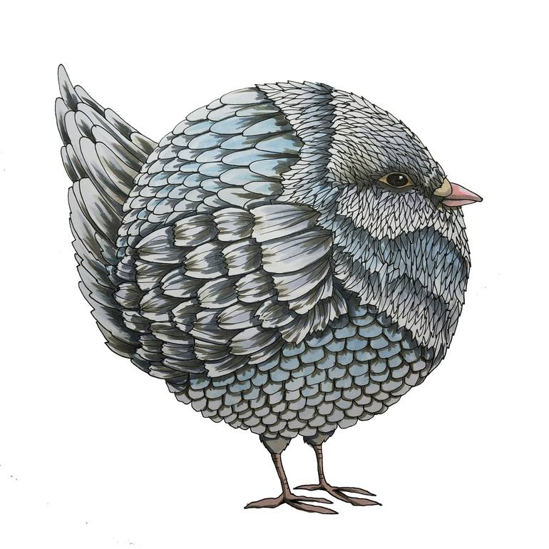

<div style="page-break-before: always;"></div>

## 4.1 Acroforms vs XFA

From wikipedia:

> XFA (also known as XFA forms) stands for XML Forms Architecture, a family of proprietary XML specifications that was suggested and developed by JetForm to enhance the processing of web forms.  
> It can be also used in PDF files starting with the PDF 1.5 specification. 
> The XFA specification is referenced as an external specification necessary for full application of the ISO 32000-1 specification (PDF 1.7). 
> The XML Forms Architecture was not standardized as an ISO standard, and has been deprecated in PDF 2.0.

## 4.2 The `FormField` object

From the PDF specification:

> An interactive form (PDF 1.2)—sometimes referred to as an AcroForm—is a collection of fields for gathering information interactively from the user. 
> A PDF document may contain any number of fields appearing on any combination of pages, all of which make up a single, global interactive form spanning the entire document.
> Arbitrary subsets of these fields can be imported or exported from the document; see 12.7.5, “Form Actions.”
>
> Each field in a document’s interactive form shall be defined by a field dictionary (see 12.7.3, “Field Dictionaries”). 
> For purposes of definition and naming, the fields can be organized hierarchically and can inherit attributes from their ancestors in the field hierarchy.
> 
> A field’s children in the hierarchy may also include widget annotations (see 12.5.6.19, “Widget Annotations”) that define its appearance on the page. 
> A field that has children that are fields is called a non-terminal field. 
> A field that does not have children that are fields is called a terminal field.

> Interactive forms (see 12.7, “Interactive Forms”) use widget annotations (PDF 1.2) to represent the appearance of fields and to manage user interactions. 
> As a convenience, when a field has only a single associated widget annotation, the contents of the field dictionary (12.7.3, “Field Dictionaries”) 
> and the annotation dictionary may be merged into a single dictionary containing entries that pertain to both a field and an annotation.

`borb` supports AcroForm technology in a way that is indistinguishable from other `LayoutElement` implementations. 
To the user, the technical side of forms (especially to the level of how the `Dictionary` objects are structured) is often not that important.

You can add a `FormField` object to a `Page` or `PageLayout` in the same way you'd add a `Paragraph` and everything will be taken care of.
`borb` will create the `Dictionary` objects, add them to the `Page`, perform all the calculations needed for layout, etc

## 4.3 Adding `FormField` objects to a PDF

`FormField` represents the common base implementation of form fields. 
It handles the logic that is common to `TextField`, `CheckBox`, `DropDownList` and other classes.

### 4.3.1 Adding a `TextField` to a PDF

In the next example you'll be using a `Table` in conjunction with `TextField` objects to build a very rudimentary form.

```python
#!chapter_004/src/snippet_001.py
from decimal import Decimal

from borb.pdf.canvas.layout.forms.text_field import TextField
from borb.pdf.canvas.layout.page_layout.multi_column_layout import SingleColumnLayout
from borb.pdf.canvas.layout.page_layout.page_layout import PageLayout
from borb.pdf.canvas.layout.table.fixed_column_width_table import FixedColumnWidthTable
from borb.pdf.canvas.layout.text.paragraph import Paragraph
from borb.pdf.document.document import Document
from borb.pdf.page.page import Page
from borb.pdf.pdf import PDF


def main():
    # create Document
    doc: Document = Document()

    # create Page
    page: Page = Page()

    # add Page to Document
    doc.append_page(page)

    # set a PageLayout
    layout: PageLayout = SingleColumnLayout(page)

    # add FixedColumnWidthTable containing Paragraph and TextField objects
    layout.add(
        FixedColumnWidthTable(number_of_columns=2, number_of_rows=3)
        .add(Paragraph("Name:"))
        .add(TextField(field_name="name"))
        .add(Paragraph("Firstname:"))
        .add(TextField(field_name="firstname"))
        .add(Paragraph("Country"))
        .add(TextField(field_name="country"))
        .set_padding_on_all_cells(Decimal(2), Decimal(2), Decimal(2), Decimal(2))
        .no_borders()
    )

    # store
    with open("output.pdf", "wb") as pdf_file_handle:
        PDF.dumps(pdf_file_handle, doc)


if __name__ == "__main__":
    main()
```

The output `Document` should look like this.
Notice the little warning ribbon atop the `Document` (which may appear differently depending on the PDF reader you are using).

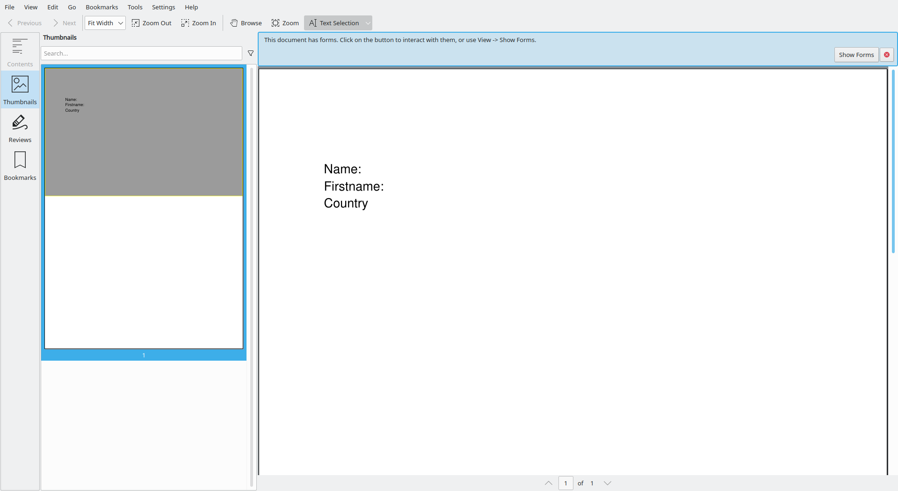

Let's show the forms, and see what you've made:


We can of course fill in values in these textboxes:

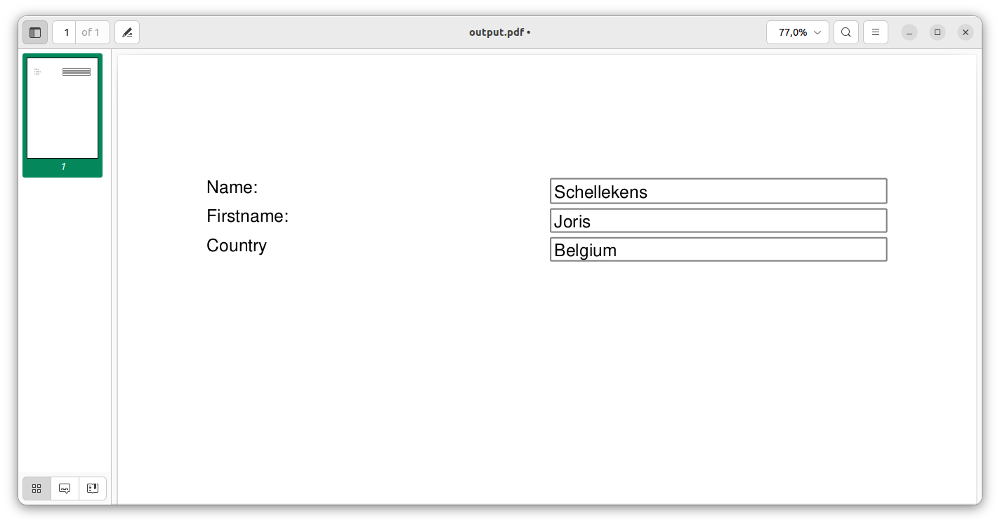

And now, when we hide the forms again, the text becomes uneditable:


Your PDF reader may ask you whether you'd like to save the values in the form before closing the `Document`.

### 4.3.2 Customizing a `TextField` object

`TextField` accepts the same arguments as `Paragraph` when it comes to styling.
For instance, you can also set the `font_color`.

```python
#!chapter_004/src/snippet_002.py
from decimal import Decimal

from borb.pdf.canvas.color.color import HexColor
from borb.pdf.canvas.layout.forms.text_field import TextField
from borb.pdf.canvas.layout.page_layout.multi_column_layout import SingleColumnLayout
from borb.pdf.canvas.layout.page_layout.page_layout import PageLayout
from borb.pdf.canvas.layout.table.fixed_column_width_table import FixedColumnWidthTable
from borb.pdf.canvas.layout.text.paragraph import Paragraph
from borb.pdf.document.document import Document
from borb.pdf.page.page import Page
from borb.pdf.pdf import PDF


def main():

    # create Document
    doc: Document = Document()

    # create Page
    page: Page = Page()

    # add Page to Document
    doc.append_page(page)

    # set a PageLayout
    layout: PageLayout = SingleColumnLayout(page)

    # add FixedColumnWidthTable containing Paragraph and TextField objects
    layout.add(
        FixedColumnWidthTable(number_of_columns=2, number_of_rows=3)
        .add(Paragraph("Name:"))
        .add(TextField(field_name="name", font_color=HexColor("f1cd2e")))
        .add(Paragraph("Firstname:"))
        .add(TextField(field_name="firstname", font_color=HexColor("f1cd2e")))
        .add(Paragraph("Country"))
        .add(TextField(field_name="country"))
        .set_padding_on_all_cells(Decimal(2), Decimal(2), Decimal(2), Decimal(2))
        .no_borders()
    )

    # store
    with open("output_form.pdf", "wb") as pdf_file_handle:
        PDF.dumps(pdf_file_handle, doc)


if __name__ == "__main__":
    main()
```

This does not really have an impact on the form when it's editable:

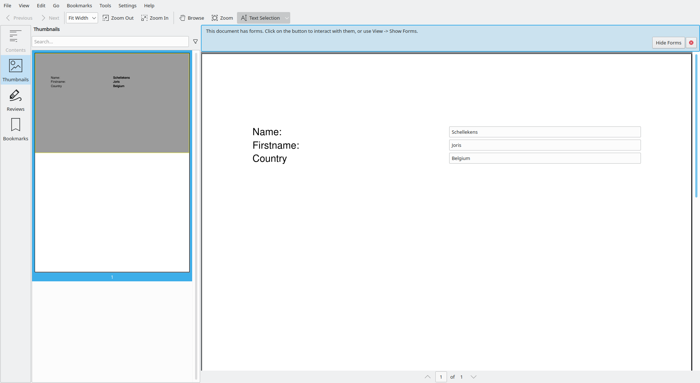

But it does change the appearance of the form once it's uneditable:

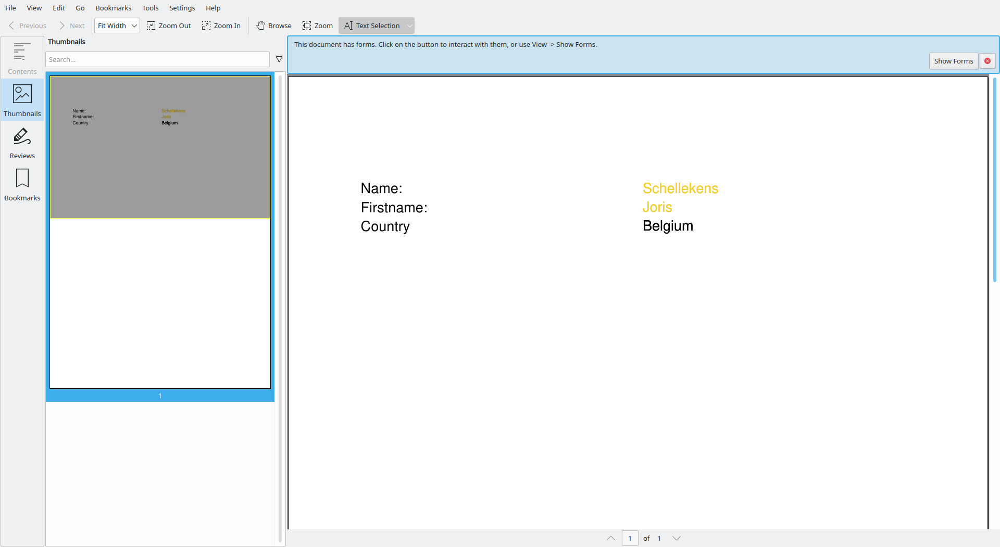

### 4.3.3 Pre-filling a `TextField` object

You can of course pre-fill a `TextField`. This can be quite useful when you already know some of the values,
or when one particular answer occurs most of the time (it might save your reader some time if the most likely answer is pre-filled).

In the next example you'll be updating the code you wrote earlier to generate a simple form, and pre-fill some of its values;

```python
#!chapter_004/src/snippet_003.py
from decimal import Decimal

from borb.pdf.canvas.color.color import HexColor
from borb.pdf.canvas.layout.forms.text_field import TextField
from borb.pdf.canvas.layout.page_layout.multi_column_layout import SingleColumnLayout
from borb.pdf.canvas.layout.page_layout.page_layout import PageLayout
from borb.pdf.canvas.layout.table.fixed_column_width_table import FixedColumnWidthTable
from borb.pdf.canvas.layout.text.paragraph import Paragraph
from borb.pdf.document.document import Document
from borb.pdf.page.page import Page
from borb.pdf.pdf import PDF


def main():
    # create Document
    doc: Document = Document()

    # create Page
    page: Page = Page()

    # add Page to Document
    doc.append_page(page)

    # set a PageLayout
    layout: PageLayout = SingleColumnLayout(page)

    # add FixedColumnWidthTable containing Paragraph and TextField objects
    layout.add(
        FixedColumnWidthTable(number_of_columns=2, number_of_rows=3)
        .add(Paragraph("Name:"))
        .add(TextField(field_name="name", font_color=HexColor("f1cd2e")))
        .add(Paragraph("Firstname:"))
        .add(TextField(field_name="firstname", font_color=HexColor("f1cd2e")))
        .add(Paragraph("Country"))
        # add TextField already pre-filled with 'Belgium'
        .add(TextField(field_name="country", value="Belgium"))
        .set_padding_on_all_cells(Decimal(2), Decimal(2), Decimal(2), Decimal(2))
        .no_borders()
    )

    # store
    with open("output_form.pdf", "wb") as pdf_file_handle:
        PDF.dumps(pdf_file_handle, doc)


if __name__ == "__main__":
    main()
```

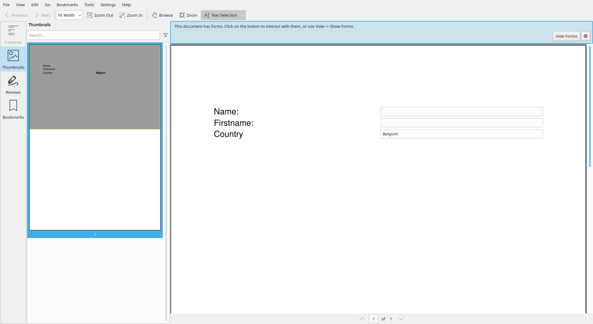

### 4.3.4 Adding a `DropDownList` to a PDF

You've seen how to add a `TextField`, but what if you'd like to restrict the reader to only allow certain inputs.
This is typically where you could also use a `DropDownList`.
A `DropDownList` can be constructed with `typing.List[str]` and will allow the user to select one of the options.

```python
#!chapter_004/src/snippet_004.py
from decimal import Decimal

from borb.pdf.canvas.color.color import HexColor
from borb.pdf.canvas.layout.forms.drop_down_list import DropDownList
from borb.pdf.canvas.layout.forms.text_field import TextField
from borb.pdf.canvas.layout.page_layout.multi_column_layout import SingleColumnLayout
from borb.pdf.canvas.layout.page_layout.page_layout import PageLayout
from borb.pdf.canvas.layout.table.fixed_column_width_table import FixedColumnWidthTable
from borb.pdf.canvas.layout.text.paragraph import Paragraph
from borb.pdf.document.document import Document
from borb.pdf.page.page import Page
from borb.pdf.pdf import PDF


def main():

    # create Document
    doc: Document = Document()

    # create Page
    page: Page = Page()

    # add Page to Document
    doc.append_page(page)

    # set a PageLayout
    layout: PageLayout = SingleColumnLayout(page)

    # add FixedColumnWidthTable containing Paragraph and TextField objects
    layout.add(
        FixedColumnWidthTable(number_of_columns=2, number_of_rows=3)
        .add(Paragraph("Name:"))
        .add(TextField(field_name="name", font_color=HexColor("f1cd2e")))
        .add(Paragraph("Firstname:"))
        .add(TextField(field_name="firstname", font_color=HexColor("f1cd2e")))
        .add(Paragraph("Country"))
        .add(
            DropDownList(
                field_name="country",
                possible_values=["Belgium", "Canada", "Denmark", "Estonia"],
            )
        )
        .set_padding_on_all_cells(Decimal(2), Decimal(2), Decimal(2), Decimal(2))
        .no_borders()
    )

    # store
    with open("output_form.pdf", "wb") as pdf_file_handle:
        PDF.dumps(pdf_file_handle, doc)


if __name__ == "__main__":
    main()
```


### 4.3.5 Adding a `CountryDropDownList` to a PDF

It would be rather nonsensical to have every developer that uses `borb` code up the same `DropDownList` over and over again.
One of the key usecases of `DropDownList` is when you're using it to allow the user to select a country from a  list of all countries in the world.
`borb` comes to the resque with its `CountryDropDownList`, which comes pre-loaded with all the country-names.

```python
#!chapter_004/src/snippet_005.py
from decimal import Decimal

from borb.pdf.canvas.color.color import HexColor
from borb.pdf.canvas.layout.forms.country_drop_down_list import CountryDropDownList
from borb.pdf.canvas.layout.forms.text_field import TextField
from borb.pdf.canvas.layout.page_layout.multi_column_layout import SingleColumnLayout
from borb.pdf.canvas.layout.page_layout.page_layout import PageLayout
from borb.pdf.canvas.layout.table.fixed_column_width_table import FixedColumnWidthTable
from borb.pdf.canvas.layout.text.paragraph import Paragraph
from borb.pdf.document.document import Document
from borb.pdf.page.page import Page
from borb.pdf.pdf import PDF


def main():

    # create Document
    doc: Document = Document()

    # create Page
    page: Page = Page()

    # add Page to Document
    doc.append_page(page)

    # set a PageLayout
    layout: PageLayout = SingleColumnLayout(page)

    # add FixedColumnWidthTable containing Paragraph and TextField objects
    layout.add(
        FixedColumnWidthTable(number_of_columns=2, number_of_rows=3)
        .add(Paragraph("Name:"))
        .add(TextField(field_name="name", font_color=HexColor("f1cd2e")))
        .add(Paragraph("Firstname:"))
        .add(TextField(field_name="firstname", font_color=HexColor("f1cd2e")))
        .add(Paragraph("Country"))
        .add(CountryDropDownList(field_name="country"))
        .set_padding_on_all_cells(Decimal(2), Decimal(2), Decimal(2), Decimal(2))
        .no_borders()
    )

    # store
    with open("output_form.pdf", "wb") as pdf_file_handle:
        PDF.dumps(pdf_file_handle, doc)


if __name__ == "__main__":
    main()
```

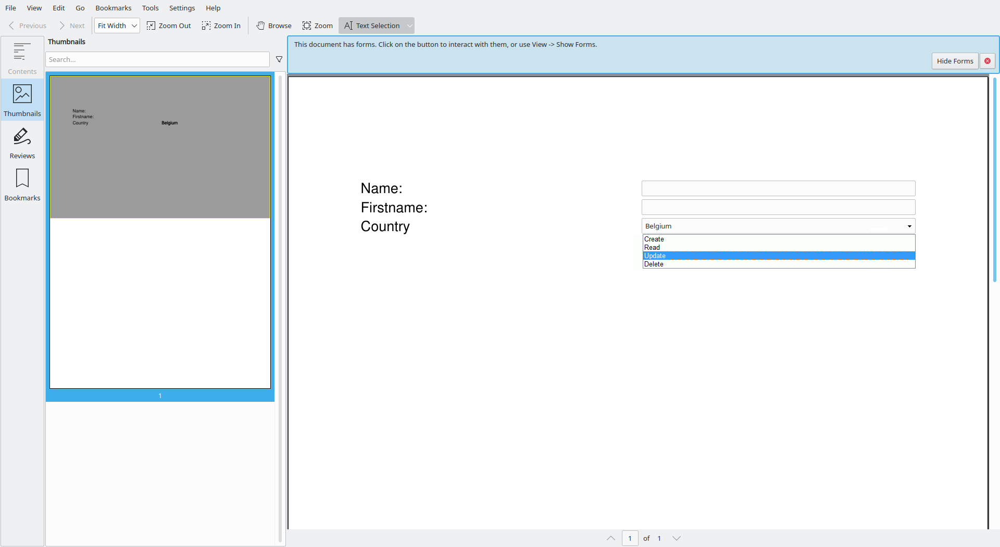

### 4.3.6 Adding a `CheckBox` to a PDF

:mega: todo :mega:

### 4.3.7 Adding a `RadioButton` to a PDF

:mega: todo :mega:

### 4.3.8 Adding a `PushButton` to a PDF

You can also add a `PushButton` to a PDF. 
These buttons can be configured (using their `\Action` dictionary) to interact with the PDF in predefined ways.
The default action (assuming you do not specify anything) is to reset the form (clearing all the input).

```python
#!chapter_004/src/snippet_006.py
from decimal import Decimal

from borb.pdf.canvas.color.color import HexColor
from borb.pdf.canvas.layout.forms.country_drop_down_list import CountryDropDownList
from borb.pdf.canvas.layout.forms.text_field import TextField
from borb.pdf.canvas.layout.page_layout.multi_column_layout import SingleColumnLayout
from borb.pdf.canvas.layout.page_layout.page_layout import PageLayout
from borb.pdf.canvas.layout.table.fixed_column_width_table import FixedColumnWidthTable
from borb.pdf.canvas.layout.text.paragraph import Paragraph
from borb.pdf.document.document import Document
from borb.pdf.page.page import Page
from borb.pdf.pdf import PDF
from borb.pdf.canvas.layout.forms.push_button import PushButton
from borb.pdf.canvas.layout.layout_element import Alignment


def main():

    # create Document
    doc: Document = Document()

    # create Page
    page: Page = Page()

    # add Page to Document
    doc.append_page(page)

    # set a PageLayout
    layout: PageLayout = SingleColumnLayout(page)

    # add FixedColumnWidthTable containing Paragraph and TextField objects
    layout.add(
        FixedColumnWidthTable(number_of_columns=2, number_of_rows=4)
        .add(Paragraph("Name:"))
        .add(TextField(field_name="name", font_color=HexColor("f1cd2e")))
        .add(Paragraph("Firstname:"))
        .add(TextField(field_name="firstname", font_color=HexColor("f1cd2e")))
        .add(Paragraph("Country"))
        .add(CountryDropDownList(field_name="country"))
        .add(Paragraph(" "))
        .add(PushButton("Clear!", horizontal_alignment=Alignment.RIGHT))
        .set_padding_on_all_cells(Decimal(2), Decimal(2), Decimal(2), Decimal(2))
        .no_borders()
    )

    # store
    with open("output_form.pdf", "wb") as pdf_file_handle:
        PDF.dumps(pdf_file_handle, doc)


if __name__ == "__main__":
    main()
```

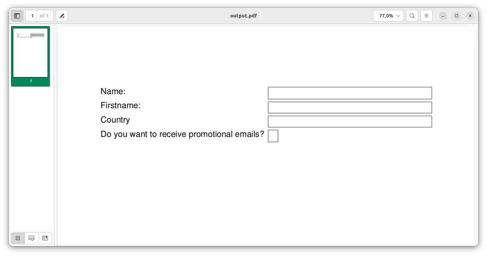

### 4.3.9 Adding a `JavaScriptPushButton` to a PDF

To have maximum configurability you can add a `JavaScriptPushButton` to a `Document`.
These buttons can be configured to have any (compliant) `JavaScript` script associated with them.
In this example you'll create a `Document` that shows an alert box whenever the `PushButton` gets pressed.

```python
#!chapter_004/src/snippet_007.py
from decimal import Decimal

from borb.pdf.canvas.color.color import HexColor
from borb.pdf.canvas.layout.forms.country_drop_down_list import CountryDropDownList
from borb.pdf.canvas.layout.forms.text_field import TextField
from borb.pdf.canvas.layout.page_layout.multi_column_layout import SingleColumnLayout
from borb.pdf.canvas.layout.page_layout.page_layout import PageLayout
from borb.pdf.canvas.layout.table.fixed_column_width_table import FixedColumnWidthTable
from borb.pdf.canvas.layout.text.paragraph import Paragraph
from borb.pdf.document.document import Document
from borb.pdf.page.page import Page
from borb.pdf.pdf import PDF
from borb.pdf.canvas.layout.forms.push_button import JavaScriptPushButton
from borb.pdf.canvas.layout.layout_element import Alignment


def main():

    # create Document
    doc: Document = Document()

    # create Page
    page: Page = Page()

    # add Page to Document
    doc.append_page(page)

    # set a PageLayout
    layout: PageLayout = SingleColumnLayout(page)

    # add FixedColumnWidthTable containing Paragraph and TextField objects
    layout.add(
        FixedColumnWidthTable(number_of_columns=2, number_of_rows=4)
        .add(Paragraph("Name:"))
        .add(TextField(field_name="name", font_color=HexColor("f1cd2e")))
        .add(Paragraph("Firstname:"))
        .add(TextField(field_name="firstname", font_color=HexColor("f1cd2e")))
        .add(Paragraph("Country"))
        .add(CountryDropDownList(field_name="country"))
        .add(Paragraph(" "))
        .add(
            JavaScriptPushButton(
                text="Popup!",
                javascript="app.alert('Hello World!', 3)",
                horizontal_alignment=Alignment.RIGHT,
            )
        )
        .set_padding_on_all_cells(Decimal(2), Decimal(2), Decimal(2), Decimal(2))
        .no_borders()
    )

    # store
    with open("output_form.pdf", "wb") as pdf_file_handle:
        PDF.dumps(pdf_file_handle, doc)


if __name__ == "__main__":
    main()
```

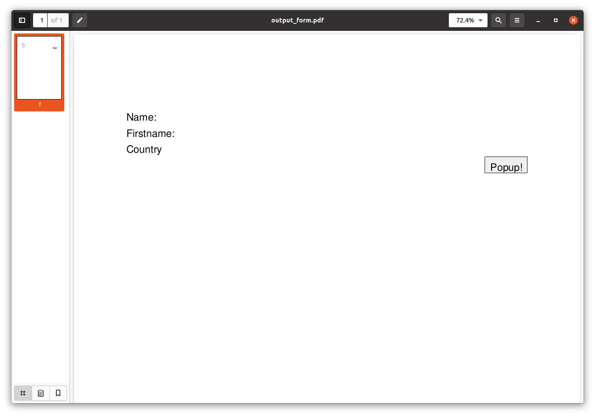

When clicked, this shows a popup:


For more information on how to use `JavaScript` inside a PDF, I recommend the following resources:
- https://helpx.adobe.com/acrobat/using/applying-actions-scripts-pdfs.html
- https://acrobatusers.com/tutorials/
- https://acrobatusers.com/tutorials/popup_windows_part1/

## 4.4 Getting the value of a `FormField` in an existing PDF

In this section you'll learn how to retrieve the values that a user filled in from a PDF AcroForm.
You'll be using the PDF created earlier. 
Be sure to open it, fill in some values, and save it in order to get everything ready for this example.

We'll start by creating a PDF with a form in it:

```python
#!chapter_004/src/snippet_008.py
from decimal import Decimal

from borb.pdf.canvas.color.color import HexColor
from borb.pdf.canvas.layout.forms.country_drop_down_list import CountryDropDownList
from borb.pdf.canvas.layout.forms.text_field import TextField
from borb.pdf.canvas.layout.page_layout.multi_column_layout import SingleColumnLayout
from borb.pdf.canvas.layout.page_layout.page_layout import PageLayout
from borb.pdf.canvas.layout.table.fixed_column_width_table import FixedColumnWidthTable
from borb.pdf.canvas.layout.text.paragraph import Paragraph
from borb.pdf.document.document import Document
from borb.pdf.page.page import Page
from borb.pdf.pdf import PDF


def main():

    # create Document
    doc: Document = Document()

    # create Page
    page: Page = Page()

    # add Page to Document
    doc.append_page(page)

    # set a PageLayout
    layout: PageLayout = SingleColumnLayout(page)

    # add FixedColumnWidthTable containing Paragraph and TextField objects
    layout.add(
        FixedColumnWidthTable(number_of_columns=2, number_of_rows=3)
        .add(Paragraph("Name:"))
        .add(TextField(field_name="name", font_color=HexColor("f1cd2e")))
        .add(Paragraph("Firstname:"))
        .add(TextField(field_name="firstname", font_color=HexColor("f1cd2e")))
        .add(Paragraph("Country"))
        .add(CountryDropDownList(field_name="country"))
        .set_padding_on_all_cells(Decimal(2), Decimal(2), Decimal(2), Decimal(2))
        .no_borders()
    )

    # store
    with open("output_form.pdf", "wb") as pdf_file_handle:
        PDF.dumps(pdf_file_handle, doc)


if __name__ == "__main__":
    main()
```

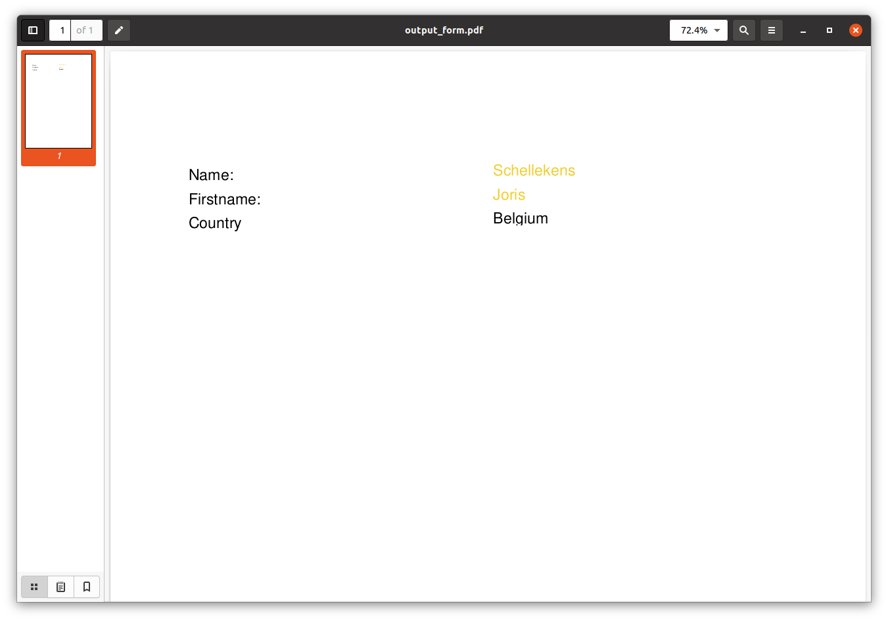

Now we can either set the values in the form by opening the PDF and typing something (make sure to save the PDF when Adobe asks you to do so).
We could also just set the values using `borb` of course. You'll learn how to do that shortly.

Finally, with our form filled in (and saved), we can get the filled in values in the PDF:

```python
#!chapter_004/src/snippet_010.py
from decimal import Decimal

from borb.pdf.canvas.color.color import HexColor
from borb.pdf.canvas.layout.page_layout.page_layout import PageLayout
from borb.pdf.document.document import Document
from borb.pdf.page.page import Page
from borb.pdf.pdf import PDF


def main():

    # open document
    doc: typing.Optional[Document] = None
    with open("output_form.pdf", "rb") as pdf_file_handle:
        doc = PDF.loads(pdf_file_handle)
    assert doc is not None

    # get
    print("Name: %s" % doc.get_page(0).get_form_field_value("name"))
    print("Firstname: %s" % doc.get_page(0).get_form_field_value("firstname"))
    print("Country: %s" % doc.get_page(0).get_form_field_value("country"))


if __name__ == "__main__":
    main()
```

This should print something like:

```commandline
/usr/bin/python3.8 /home/joris/Code/borb-examples-dev/example/example_053.py
Name             : Schellekens
Firstname        : Joris
Country          : Belgium
```

of course, the exact values depend on what you filled in (either manually or programmatically).

## 4.5 Changing the value of a `FormField` in an existing PDF

This is another very common usecase.
You have designed a wonderful PDF, complete with `FormField` objects (perhaps in another PDF software suite),
and now you'd like to use your work as a template (so to speak) and generate hundreds of `Document` objects based on this one `Document` with a form.

I've seen this exact approach used in movie-theaters, where tickets needed to be produced containing seating and movie-information.
Or even for a famous circus-act.

In the next example you'll be using an existing PDF (the one you created earlier), and filling in its fields.
Later you'll learn how to remove interactivity by flattening the `Document`.

### 4.5.1 Changing the value of a `FormField` in an existing PDF using `borb`

```python
#!chapter_004/src/snippet_009.py
from decimal import Decimal

from borb.pdf.canvas.color.color import HexColor
from borb.pdf.canvas.layout.page_layout.page_layout import PageLayout
from borb.pdf.document.document import Document
from borb.pdf.page.page import Page
from borb.pdf.pdf import PDF


def main():

    # open document
    doc: typing.Optional[Document] = None
    with open("output_form.pdf", "rb") as pdf_file_handle:
        doc = PDF.loads(pdf_file_handle)
    assert doc is not None

    # set
    doc.get_page(0).set_form_field_value("name", "Schellekens")
    doc.get_page(0).set_form_field_value("firstname", "Joris")
    doc.get_page(0).set_form_field_value("country", "Belgium")

    # store
    with open("output_form_filled.pdf", "wb") as pdf_file_handle:
        PDF.dumps(pdf_file_handle, doc)


if __name__ == "__main__":
    main()
```


### 4.5.2 Changing the value of a `FormField` in an existing PDF using `JavaScript`

We can also set the values of fields inside the PDF by using `JavaScript`.
This has the advantage of making the PDF really dynamic. You can have the user fill in their date of birth, and automatically calculate their age (and fill it in on a different `FormField`).
You could pre-fill address fields with `JavaScript`, for instance filling in somebody's town if you know their zipcode.

In the next example, you'll be creating a PDF with a simple `JavaScriptPushButton` that triggers a piece of `JavaScript` to set a `TextField`.

```python
#!chapter_004/src/snippet_011.py
from decimal import Decimal

from borb.pdf.canvas.color.color import HexColor
from borb.pdf.canvas.layout.forms.country_drop_down_list import CountryDropDownList
from borb.pdf.canvas.layout.forms.text_field import TextField
from borb.pdf.canvas.layout.page_layout.multi_column_layout import SingleColumnLayout
from borb.pdf.canvas.layout.page_layout.page_layout import PageLayout
from borb.pdf.canvas.layout.table.fixed_column_width_table import FixedColumnWidthTable
from borb.pdf.canvas.layout.text.paragraph import Paragraph
from borb.pdf.document.document import Document
from borb.pdf.page.page import Page
from borb.pdf.pdf import PDF
from borb.pdf.canvas.layout.forms.push_button import JavaScriptPushButton
from borb.pdf.canvas.layout.layout_element import Alignment


def main():

    # create Document
    doc: Document = Document()

    # create Page
    page: Page = Page()

    # add Page to Document
    doc.append_page(page)

    # set a PageLayout
    layout: PageLayout = SingleColumnLayout(page)

    # add FixedColumnWidthTable containing Paragraph and TextField objects
    layout.add(
        FixedColumnWidthTable(number_of_columns=2, number_of_rows=4)
        .add(Paragraph("Name:"))
        .add(TextField(field_name="name", font_color=HexColor("f1cd2e")))
        .add(Paragraph("Firstname:"))
        .add(TextField(field_name="firstname", font_color=HexColor("f1cd2e")))
        .add(Paragraph("Country"))
        .add(CountryDropDownList(field_name="country"))
        .add(Paragraph(" "))
        .add(
            JavaScriptPushButton(
                text="Set",
                javascript="this.getField('name').value = 'Schellekens';",
                horizontal_alignment=Alignment.RIGHT,
            )
        )
        .set_padding_on_all_cells(Decimal(2), Decimal(2), Decimal(2), Decimal(2))
        .no_borders()
    )

    # store
    with open("output_form.pdf", "wb") as pdf_file_handle:
        PDF.dumps(pdf_file_handle, doc)


if __name__ == "__main__":
    main()
```

## 4.6 Flattening a `FormField`

:mega: todo :mega:

## 4.7 Conclusion

In this section you've learned how to build interactive, fillable PDF forms.

You've seen the various form `LayoutElement` objects `borb` has to offer and you've coded up a sample for each of them.

You've set the values of these fields using `Python` or by embedding `JavaScript` in the PDF itself.

Finally, you've learned how to extract the filled in values from a form inside a PDF.

<div style="page-break-before: always;"></div>

# 5 Working with existing PDFs

For some use-cases, you won't be creating the PDF's yourself. Imagine setting up a pipeline that automatically processes PDF invoices. Or even processing order forms.

Most of these workflows can be boiled down to some simple steps that can be handled with `borb`.

In this section you'll learn the ins and outs of working with existing PDF's.

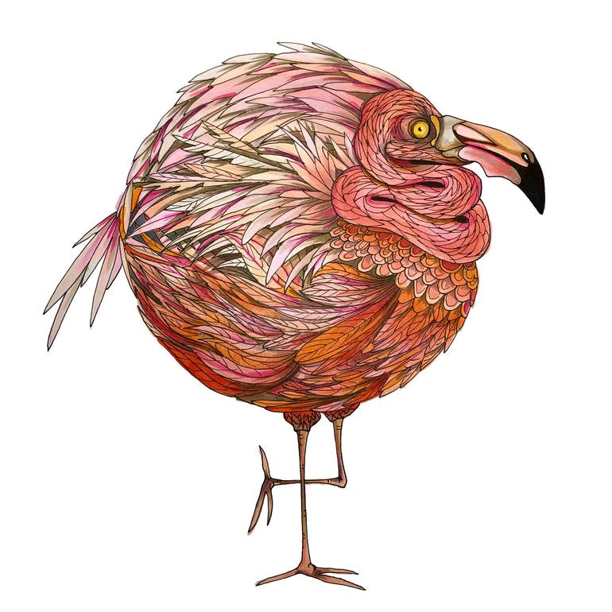

<div style="page-break-before: always;"></div>

## 5.1 Extracting meta-information

Suppose you have a PDF document. Did you know it contains meta-information? Try it. Next time you have a PDF open in Adobe, press CTRL+D to open the document properties. You'll find things like:

- Author
- Producer
- Creation date
- Modification date
- Software that created the document
- Etc

It can be very useful to be able to extract these. Processing an invoice for instance might be more accurate if we know "supplier A uses software B to create their invoices, and python script C works best for that" versus "supplier X uses software Y, which is best handled by script Z".

### 5.1.1 Extracting the author from a PDF

In the next example you'll start by extracting the author from the PDF. 
This is of course assuming this property was set by whatever software created the PDF.

In order to be able to test these examples and get the same result as the book, I am providing a snippet of code here that will generate a very simple PDF;

```python
#!chapter_005/src/snippet_001.py
from borb.io.read.types import Name, String, Dictionary
from borb.pdf.canvas.layout.page_layout.multi_column_layout import SingleColumnLayout
from borb.pdf.canvas.layout.page_layout.page_layout import PageLayout
from borb.pdf.canvas.layout.text.paragraph import Paragraph
from borb.pdf.document.document import Document
from borb.pdf.page.page import Page
from borb.pdf.pdf import PDF


def main():
    # create Document
    doc: Document = Document()

    # create Page
    page: Page = Page()

    # add Page to Document
    doc.append_page(page)

    # set a PageLayout
    layout: PageLayout = SingleColumnLayout(page)

    # add a Paragraph
    layout.add(
        Paragraph(
            """
                        Lorem ipsum dolor sit amet, consectetur adipiscing elit, sed do eiusmod tempor incididunt ut labore et dolore magna aliqua. 
                        Ut enim ad minim veniam, quis nostrud exercitation ullamco laboris nisi ut aliquip ex ea commodo consequat. 
                        Duis aute irure dolor in reprehenderit in voluptate velit esse cillum dolore eu fugiat nulla pariatur. 
                        Excepteur sint occaecat cupidatat non proident, sunt in culpa qui officia deserunt mollit anim id est laborum.
                         """
        )
    )

    # set the /Info dictionary
    doc["XRef"]["Trailer"][Name("Info")] = Dictionary()

    # set the /Author
    doc["XRef"]["Trailer"]["Info"][Name("Author")] = String("Joris Schellekens")

    with open("output.pdf", "wb") as out_file_handle:
        PDF.dumps(out_file_handle, doc)


if __name__ == "__main__":
    main()
```

The PDF doesn't really look all that special when you open it.


But, when you open the properties (the exact shortcut differs depending on which PDF viewer you're using of course), you'll see the meta-data:

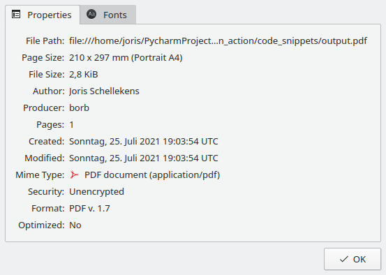

Now, let's assume you're getting this PDF (perhaps via email, or some automated process) and you'd like to extract the author from it.

`borb` allows you to do that in just a few lines of code:

```python
#!chapter_005/src/snippet_002.py
import typing
from borb.pdf.document.document import Document
from borb.pdf.pdf import PDF


def main():

    # read the Document
    doc: typing.Optional[Document] = None
    with open("output.pdf", "rb") as in_file_handle:
        doc = PDF.loads(in_file_handle)

    # check whether we have read a Document
    assert doc is not None

    # print the \Author key from the \Info dictionary
    print("Author: %s" % doc.get_document_info().get_author())


if __name__ == "__main__":
    main()
```

This will print `Joris Schellekens` to the terminal (in the case of the demo-PDF created by the earlier example of course).

Keep in mind that this property (`/Author`) is not mandatory. 
So the code may simply return (and thus print) `None`. 
This is not a bug, it simply means the `/Author` property was not explicitly set.

### 5.1.2 Extracting the producer from a PDF

Similarly, you can extract other properties, like the producer. This is typically the name of the piece of software that created the PDF (or last modified the PDF).

This is important. The PDF specification is not always precise or clear-cut. 
Some PDF software might do things a little differently than others, thus causing potential incompatibility.

You can easily mitigate this by checking the producer property, and separating the problematic files.

```python
#!chapter_005/src/snippet_003.py
import typing
from borb.pdf.document.document import Document
from borb.pdf.pdf import PDF


def main():

    # read the Document
    doc: typing.Optional[Document] = None
    with open("output.pdf", "rb") as in_file_handle:
        doc = PDF.loads(in_file_handle)

    # check whether we have read a Document
    assert doc is not None

    # print the \Producer key from the \Info dictionary
    print("Producer: %s" % doc.get_document_info().get_producer())


if __name__ == "__main__":
    main()
```

Of course, now that you know how to extract the author and the producer, 
you can check out the other methods of `DocumentInfo` and find out even more about any PDF that comes your way.

### 5.1.3 using XMP meta information

This is from `adobe.com`:

> Adobe’s Extensible Metadata Platform (XMP) is a file labeling technology that lets you embed metadata into files themselves during the content creation process. 
> With an XMP enabled application, your workgroup can capture meaningful information about a project (such as titles and descriptions, searchable keywords, and up-to-date author and copyright information) in a format that is easily understood by your team as well as by software applications, hardware devices, and even file formats. 
> Best of all, as team members modify files and assets, they can edit and update the metadata in real time during the workflow.>

This next example is similar to the earlier example involving `DocumentInfo`.
But in stead, we will use `XMPDocumentInfo`. This class offers even more methods to get information from a PDF `Document`.

Keep in mind that XMP is not a requirement for a PDF `Document` to be valid. 
So you may find these methods return `None` when you test them on a `Document` that does not have embedded XMP data.

```python
#!chapter_005/src/snippet_004.py
import typing
from borb.pdf.document.document import Document
from borb.pdf.pdf import PDF


def main():

    # read the Document
    doc: typing.Optional[Document] = None
    with open("output.pdf", "rb") as in_file_handle:
        doc = PDF.loads(in_file_handle)

    # check whether we have read a Document
    assert doc is not None

    # print the ID using XMP meta info
    print("ID: %s" % doc.get_xmp_document_info().get_document_id())


if __name__ == "__main__":
    main()
```

For the document I tested, this printed:

```commandline
xmp.id:54e5adca-494c-4c10-983a-daa03cdae65a
```

<div style="page-break-before: always;"></div>

## 5.2 Extracting text from a PDF

Being able to extract text from a PDF is a fundamental skill. 
In the deep-dive, you'll learn more about PDF syntax, and why text-extraction is a non-trivial thing.

For now, you can start with an easy example where all visible text on the page is extracted.

This extraction process does not take into account any structure that may be present on the page itself. 
Hence the name `SimpleTextExtraction`.

You'll be using the same input PDF as earlier (containing a paragraph of lorem ipsum).

```python
#!chapter_005/src/snippet_005.py
import typing
from borb.pdf.document.document import Document
from borb.pdf.pdf import PDF
from borb.toolkit.text.simple_text_extraction import SimpleTextExtraction


def main():

    # read the Document
    doc: typing.Optional[Document] = None
    l: SimpleTextExtraction = SimpleTextExtraction()
    with open("output.pdf", "rb") as in_file_handle:
        doc = PDF.loads(in_file_handle, [l])

    # check whether we have read a Document
    assert doc is not None

    # print the text on the first Page
    print(l.get_text_for_page(0))


if __name__ == "__main__":
    main()
```

Here you've used the alternative method for `PDF.loads` which takes an array of `EventListener` objects as its argument.

`PDF.loads` will open the PDF, and start processing PDF syntax. 
Whenever it handles certain commands (rendering text, rendering images, switching to a new page, etc), 
it will send out `Event` objects. These can be handled by the appropriate `EventListener` implementation.

`SimpleTextExtraction` is one of those `EventListener` implementations that listens to:

- The start of a `Page`
- The end of a `Page`
- Begin rendering text mode
- Stop rendering text mode
- Render text command(s)

The code above should print out:

```
Lorem ipsum dolor sit amet, consectetur adipiscing elit, sed do eiusmod tempor incididunt
ut labore et dolore magna aliqua. Ut enim ad minim veniam, quis nostrud exercitation
ullamco laboris nisi ut aliquip ex ea commodo consequat. Duis aute irure dolor in
reprehenderit in voluptate velit esse cillum dolore eu fugiat nulla pariatur. Excepteur sint
occaecat cupidatat non proident, sunt in culpa qui officia deserunt mollit anim id est
laborum.
```

<div style="page-break-before: always;"></div>

## 5.3 Extracting text using regular expressions

This is a much more advanced way to extract text from a PDF. 
By using regular expressions, you can easily look for things like "total amount due" followed by some numbers. 
And, in doing so, effectively retrieve the useful data from an invoice.

In the next example you'll be doing exactly that. 
The code is very similar to what you've done earlier.

```python
#!chapter_005/src/snippet_006.py
import typing
from borb.pdf.document.document import Document
from borb.pdf.pdf import PDF
from borb.toolkit.text.regular_expression_text_extraction import (
    RegularExpressionTextExtraction,
)


def main():

    # read the Document
    # fmt: off
    doc: typing.Optional[Document] = None
    l: RegularExpressionTextExtraction = RegularExpressionTextExtraction("[lL]orem .* [dD]olor")
    with open("output.pdf", "rb") as in_file_handle:
        doc = PDF.loads(in_file_handle, [l])
    # fmt: on

    # check whether we have read a Document
    assert doc is not None

    # print matching groups
    for i, m in enumerate(l.get_matches_for_page(0)):
        print("%d %s" % (i, m.group(0)))
        for r in m.get_bounding_boxes():
            print(
                "\t%f %f %f %f" % (r.get_x(), r.get_y(), r.get_width(), r.get_height())
            )


if __name__ == "__main__":
    main()
```

Like before, you constructed an implementation of `EventListener` and passed it to the `PDF.loads` method. 
`RegularExpressionTextExtraction` takes a regular expression as its single argument.

Once the `Document` has been parsed, you can retrieve all matches by specifying a `page_nr`. 
Pages are numbered from 0.

You'll get back a `typing.List[PDFMatch]` which is meant to behave like a `re.Match` object. 
Most of its fields and methods are written to work interchangeably with `re.Match`.

Of course, because a PDF has a dimensionality to it (content is located on an x/y plane), 
there are some extra methods. Such as `get_bounding_boxes()` which returns a `typing.List[Rectangle]'.

You may be wondering why a single match against a regular expression would return multiple bounding boxes. 
This happens when content is matched over multiple lines.

In this example however, the output should be:

```
0 Lorem ipsum dolor
	59.500000 740.916000 99.360000 11.100000
```

indicating a single match, with text "lorem ipsum dolor", 
with bounding box (lower left corner) at `[59.5, 740.916]` and a width of `99.36` and a height of `11.1`.

<div style="page-break-before: always;"></div>

## 5.4 Extracting text using its bounding box

Another extraction process relies on the rendering of the PDF itself. 
Perhaps the PDF's you are processing always have some kind of information at a precise location 
(e.g. an invoice number in the top right corner).

This implementation of `EventListener` allows you to filter events (i.e. rendering instructions) by providing `borb` with a bounding box.

In the next example you'll be using the coordinates from the previous example, to build a filter for `SimpleTextExtraction`.

```python
#!chapter_005/src/snippet_007.py
import typing
from decimal import Decimal

from borb.pdf.canvas.geometry.rectangle import Rectangle
from borb.pdf.document.document import Document
from borb.pdf.pdf import PDF
from borb.toolkit.location.location_filter import LocationFilter
from borb.toolkit.text.simple_text_extraction import SimpleTextExtraction


def main():

    # define the Rectangle of interest
    r: Rectangle = Rectangle(Decimal(59), Decimal(740), Decimal(99), Decimal(11))

    # define SimpleTextExtraction
    l0: SimpleTextExtraction = SimpleTextExtraction()

    # apply a LocationFilter on top of SimpleTextExtraction
    l1: LocationFilter = LocationFilter(r)
    l1.add_listener(l0)

    # read the Document
    doc: typing.Optional[Document] = None
    with open("output.pdf", "rb") as in_file_handle:
        doc = PDF.loads(in_file_handle, [l1])

    # check whether we have read a Document
    assert doc is not None

    # print the text inside the Rectangle of interest
    print(l0.get_text_for_page(0))


if __name__ == "__main__":
    main()
```

This prints:

```commandline
Lorem ipsum dolor
```

<div style="page-break-before: always;"></div>

## 5.5 Combining regular expressions and bounding boxes

Of course, `borb` is designed to be a library, 
so the idea of being able to strap together your own tools using the toolkit is very important to me.

In the next example you'll be combining a regular expression expression extraction technique with a bounding box.

First you'll be looking for the precise location of the text "nisi ut aliquip". 
Once you have matched this regular expression, you also have its location on the page.

Then you can extend this box, 
knowing the text you'd really like to extract will be on the right of that piece of text.

```python
#!chapter_005/src/snippet_008.py
import typing
from decimal import Decimal

from borb.pdf.canvas.geometry.rectangle import Rectangle
from borb.pdf.document.document import Document
from borb.pdf.pdf import PDF
from borb.toolkit.location.location_filter import LocationFilter
from borb.toolkit.text.regular_expression_text_extraction import (
    RegularExpressionTextExtraction,
    PDFMatch,
)
from borb.toolkit.text.simple_text_extraction import SimpleTextExtraction


def main():

    # set up RegularExpressionTextExtraction
    # fmt: off
    l0: RegularExpressionTextExtraction = RegularExpressionTextExtraction("[nN]isi .* aliquip")
    # fmt: on

    # process Document
    doc: typing.Optional[Document] = None
    with open("output.pdf", "rb") as in_file_handle:
        doc = PDF.loads(in_file_handle, [l0])
    assert doc is not None

    # find match
    m: typing.Optional[PDFMatch] = next(iter(l0.get_matches_for_page(0)), None)
    assert m is not None

    # get page width
    w: Decimal = doc.get_page(0).get_page_info().get_width()

    # change rectangle to get more text
    r0: Rectangle = m.get_bounding_boxes()[0]
    r1: Rectangle = Rectangle(
        r0.get_x() + r0.get_width(), r0.get_y(), w - r0.get_x(), r0.get_height()
    )

    # process document (again) filtering by rectangle
    l1: LocationFilter = LocationFilter(r1)
    l2: SimpleTextExtraction = SimpleTextExtraction()
    l1.add_listener(l2)
    doc: typing.Optional[Document] = None
    with open("output.pdf", "rb") as in_file_handle:
        doc = PDF.loads(in_file_handle, [l1])
    assert doc is not None

    # get text
    print(l2.get_text_for_page(0))


if __name__ == "__main__":
    main()
```

This example is a lot to take in. 
Try it out, read through it carefully. 
It's important to understand these basic concepts in `borb` to really get the most out of it.

This example starts out similar to the earlier example ["Extracting text using regular expressions"](#33-extracting-text-using-regular-expressions), 
it uses the returned `PDFMatch` to determine the location of the text. 
With this location it processes the `Document` again, filtering a modified bounding box.

This example prints:

```commandline
ex ea commodo conse uat. Duis aute irure dolor in
```

This example might seem contrived, but there are definitely use-cases where this exact behavior comes in handy. 
Imagine processing a `Document`, looking for "amount due", 
and then modifying the bounding box to retrieve the amount and currency that is typically next to it.

The same strategy can be used to extract addresses from invoices, or anything similar really.

<div style="page-break-before: always;"></div>

## 5.6 Extracting keywords from a PDF

### 5.6.1 Extracting keywords from a PDF using TF-IDF

From wikipedia:

> In information retrieval, tf–idf, TF*IDF, or TFIDF, short for term frequency–inverse document frequency, is a numerical statistic that is intended to reflect how important a word is to a document in a collection or corpus. 
> It is often used as a weighting factor in searches of information retrieval, text mining, and user modeling. 
> The tf–idf value increases proportionally to the number of times a word appears in the document and is offset by the number of documents in the corpus that contain the word, which helps to adjust for the fact that some words appear more frequently in general. 
> tf–idf is one of the most popular term-weighting schemes today.

#### 5.6.1.1 Term Frequency

From wikipedia:

> Suppose we have a set of English text documents and wish to rank them by which document is more relevant to the query, "the brown cow". 
> A simple way to start out is by eliminating documents that do not contain all three words "the", "brown", and "cow", but this still leaves many documents. 
> To further distinguish them, we might count the number of times each term occurs in each document; the number of times a term occurs in a document is called its term frequency. 
> However, in the case where the length of documents varies greatly, adjustments are often made (see definition below). 

#### 5.6.1.2 Inverse document frequency

From wikipedia:

> Because the term "the" is so common, term frequency will tend to incorrectly emphasize documents which happen to use the word "the" more frequently, without giving enough weight to the more meaningful terms "brown" and "cow". 
> The term "the" is not a good keyword to distinguish relevant and non-relevant documents and terms, unlike the less-common words "brown" and "cow". Hence, an inverse document frequency factor is incorporated which diminishes the weight of terms that occur very frequently in the document set and increases the weight of terms that occur rarely.

#### 5.6.1.3 Using TF-IDF in `borb`

Let's start by creating a `Document` with a few `Paragraph` objects in it.
Since you'll be eliminating stop words (which are language-dependent), this `Document` needs to contain sensible English text.
You'll be creating a `Document` containing information about "Lorem Ipsum".

```python
#!chapter_005/src/snippet_009.py
from borb.io.read.types import Name, String, Dictionary
from borb.pdf.canvas.layout.page_layout.multi_column_layout import SingleColumnLayout
from borb.pdf.canvas.layout.page_layout.page_layout import PageLayout
from borb.pdf.canvas.layout.text.paragraph import Paragraph
from borb.pdf.document.document import Document
from borb.pdf.page.page import Page
from borb.pdf.pdf import PDF


def main():
    # create Document
    doc: Document = Document()

    # create Page
    page: Page = Page()

    # add Page to Document
    doc.append_page(page)

    # set a PageLayout
    layout: PageLayout = SingleColumnLayout(page)

    # add first Paragraph
    layout.add(Paragraph("What is Lorem Ipsum?", font="Helvetica-bold"))
    layout.add(
        Paragraph(
            """
    Lorem Ipsum is simply dummy text of the printing and typesetting industry. 
    Lorem Ipsum has been the industry's standard dummy text ever since the 1500s, 
    when an unknown printer took a galley of type and scrambled it to make a type specimen book. 
    It has survived not only five centuries, but also the leap into electronic typesetting, remaining essentially unchanged. 
    It was popularised in the 1960s with the release of Letraset sheets containing Lorem Ipsum passages, 
    and more recently with desktop publishing software like Aldus PageMaker including versions of Lorem Ipsum.
    """
        )
    )

    # add second Paragraph
    layout.add(Paragraph("Where does it come from?", font="Helvetica-bold"))
    layout.add(
        Paragraph(
            """
    Contrary to popular belief, Lorem Ipsum is not simply random text. 
    It has roots in a piece of classical Latin literature from 45 BC, making it over 2000 years old. 
    Richard McClintock, a Latin professor at Hampden-Sydney College in Virginia, looked up one of the more obscure Latin words, 
    consectetur, from a Lorem Ipsum passage, and going through the cites of the word in classical literature, 
    discovered the undoubtable source. Lorem Ipsum comes from sections 1.10.32 and 1.10.33 of "de Finibus Bonorum et Malorum" 
    (The Extremes of Good and Evil) by Cicero, written in 45 BC. 
    This book is a treatise on the theory of ethics, very popular during the Renaissance. 
    The first line of Lorem Ipsum, "Lorem ipsum dolor sit amet..", comes from a line in section 1.10.32.
    """
        )
    )

    # store
    with open("output.pdf", "wb") as out_file_handle:
        PDF.dumps(out_file_handle, doc)


if __name__ == "__main__":
    main()
```

This should produce a `Document` like this:

Now you can unleash `TFIDFKeywordExtraction` on the `Document` you made;

```python
#!chapter_005/src/snippet_010.py
import typing

from borb.io.read.types import Name, String, Dictionary
from borb.pdf.canvas.layout.page_layout.multi_column_layout import SingleColumnLayout
from borb.pdf.canvas.layout.page_layout.page_layout import PageLayout
from borb.pdf.canvas.layout.text.paragraph import Paragraph
from borb.pdf.document.document import Document
from borb.pdf.page.page import Page
from borb.pdf.pdf import PDF
from borb.toolkit.text.tf_idf_keyword_extraction import TFIDFKeywordExtraction
from borb.toolkit.text.stop_words import ENGLISH_STOP_WORDS


def main():

    l: TFIDFKeywordExtraction = TFIDFKeywordExtraction(stopwords=ENGLISH_STOP_WORDS)

    # load
    doc: typing.Optional[Document] = None
    with open("output.pdf", "rb") as in_file_handle:
        doc = PDF.loads(in_file_handle, [l])

    # check whether we have read a Document
    assert doc is not None

    print(l.get_keywords_for_page(0))


if __name__ == "__main__":
    main()
```

This outputs:

```commandline
/usr/bin/python3.8 /home/joris/Code/borb-examples-dev/chapter_005/src/snippet_010.py
[('LOREM', 9.100909090909093e-06), 
 ('IPSUM', 9.100909090909093e-06), 
 ('TEXT', 2.737272727272727e-06), 
 ('LATIN', 2.737272727272727e-06)]

Process finished with exit code 0
```

### 5.6.2 Extracting keywords from a PDF using  textrank

TextRank is a graph-based ranking model for text processing which can be used in order to find the most relevant sentences in text and also to find keywords. 
The algorithm is explained in detail in the paper at https://web.eecs.umich.edu/~mihalcea/papers/mihalcea.emnlp04.pdf

```python
#!chapter_005/src/snippet_011.py
import typing

from borb.io.read.types import Name, String, Dictionary
from borb.pdf.canvas.layout.page_layout.multi_column_layout import SingleColumnLayout
from borb.pdf.canvas.layout.page_layout.page_layout import PageLayout
from borb.pdf.canvas.layout.text.paragraph import Paragraph
from borb.pdf.document.document import Document
from borb.pdf.page.page import Page
from borb.pdf.pdf import PDF
from borb.toolkit.text.text_rank_keyword_extraction import TextRankKeywordExtraction
from borb.toolkit.text.stop_words import ENGLISH_STOP_WORDS


def main():

    l: TextRankKeywordExtraction = TextRankKeywordExtraction()

    # load
    doc: typing.Optional[Document] = None
    with open("output.pdf", "rb") as in_file_handle:
        doc = PDF.loads(in_file_handle, [l])

    # check whether we have read a Document
    assert doc is not None

    print(l.get_keywords_for_page(0))


if __name__ == "__main__":
    main()
```

This outputs:

```commandline
/usr/bin/python3.8 /home/joris/Code/borb-examples-dev/chapter_005/src/snippet_011.py
[('LOREM', 9.100909090909093e-06), 
 ('IPSUM', 9.100909090909093e-06), 
 ('TEXT', 2.737272727272727e-06), 
 ('LATIN', 2.737272727272727e-06)]

Process finished with exit code 0
```

<div style="page-break-before: always;"></div>

## 5.7 Extracting color-information

This is perhaps a bit more of a tangent, but I can imagine it may be useful. 
In this particular example you'll be extracting color-information from a PDF.

Given the previous examples, you can easily adapt this technique to build a filter (similar to the location-based filter). 

By doing so, you unlock the possibility of processing a PDF by saying "look for text in the color red" or "look for text in the top right corner, in blue".

In this example, you'll be using `ColorSpectrumExtraction` to retrieve all the colors on the `Page`. This is a stepping stone to building bigger and better things. Although in and of itself this can already be useful to determine color-blindness compatibility of a given `Document`.

In the deep-dive, you'll learn the ins and outs of implementing your own `EventListener`.

To start this example, you'll be creating a PDF containing multiple colors. You'll be adding 3 `Paragraph` objects (red, green, blue) and one `Image`.

```python
#!chapter_005/src/snippet_012.py
from borb.io.read.types import Name, String, Dictionary
from borb.pdf.canvas.layout.page_layout.multi_column_layout import SingleColumnLayout
from borb.pdf.canvas.layout.page_layout.page_layout import PageLayout
from borb.pdf.canvas.layout.text.paragraph import Paragraph
from borb.pdf.document.document import Document
from borb.pdf.page.page import Page
from borb.pdf.pdf import PDF
from borb.pdf.canvas.color.color import HexColor
from borb.pdf.canvas.layout.image.image import Image

from decimal import Decimal


def main():
    # create Document
    doc: Document = Document()

    # create Page
    page: Page = Page()

    # add Page to Document
    doc.append_page(page)

    # set a PageLayout
    layout: PageLayout = SingleColumnLayout(page)

    # the following code adds 3 paragraphs, each in a different color
    layout.add(Paragraph("Hello World!", font_color=HexColor("FF0000")))
    layout.add(Paragraph("Hello World!", font_color=HexColor("00FF00")))
    layout.add(Paragraph("Hello World!", font_color=HexColor("0000FF")))

    # the following code adds 1 image
    layout.add(
        Image(
            "https://images.unsplash.com/photo-1589606663923-283bbd309229?ixid=MnwxMjA3fDB8MHxwaG90by1wYWdlfHx8fGVufDB8fHx8",
            width=Decimal(256),
            height=Decimal(256),
        )
    )
    # store
    with open("output.pdf", "wb") as out_file_handle:
        PDF.dumps(out_file_handle, doc)


if __name__ == "__main__":
    main()
```

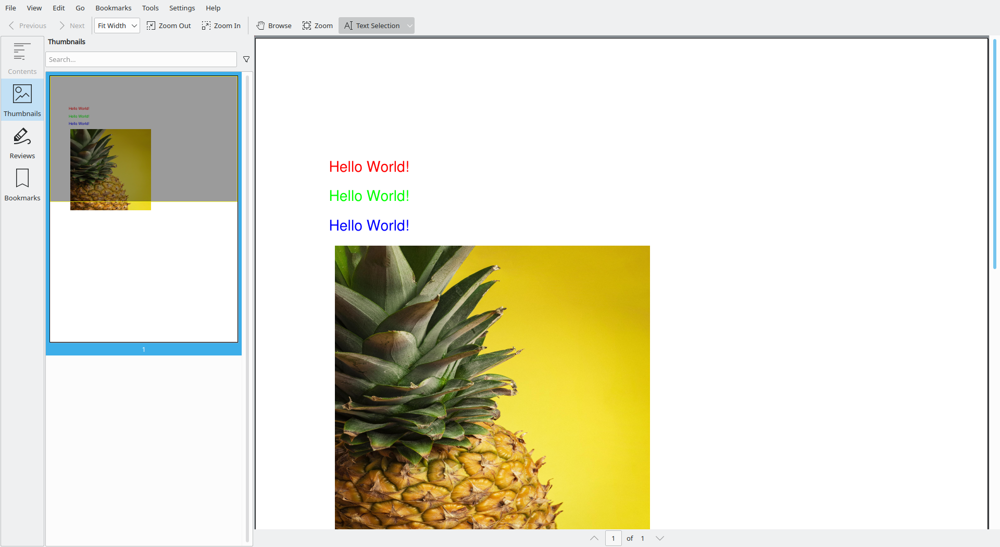

This `Document` will serve as the input for the extraction example. 

Rather than printing the result of the extraction to the command-line, 
you'll create an output-pdf. I think it's a lot more visual to actually see the colors that were extracted, 
rather than having their RGB values printed out on the console.

```python
#!chapter_005/src/snippet_013.py
from decimal import Decimal

import typing
from borb.pdf.canvas.color.color import HexColor, RGBColor
from borb.pdf.canvas.geometry.rectangle import Rectangle
from borb.pdf.canvas.layout.image.image import Image
from borb.pdf.canvas.layout.shape.shape import Shape
from borb.pdf.canvas.layout.layout_element import Alignment
from borb.pdf.canvas.layout.page_layout.multi_column_layout import SingleColumnLayout
from borb.pdf.canvas.layout.page_layout.page_layout import PageLayout
from borb.pdf.canvas.layout.table.flexible_column_width_table import (
    FlexibleColumnWidthTable,
)
from borb.pdf.canvas.layout.text.paragraph import Paragraph
from borb.pdf.canvas.line_art.line_art_factory import LineArtFactory
from borb.pdf.document.document import Document
from borb.pdf.page.page import Page
from borb.pdf.pdf import PDF
from borb.toolkit.color.color_spectrum_extraction import ColorSpectrumExtraction


def main():

    doc: typing.Optional[Document] = None
    l: ColorSpectrumExtraction = ColorSpectrumExtraction()
    with open("output.pdf", "rb") as pdf_file_handle:
        doc = PDF.loads(pdf_file_handle, [l])

    # extract colors
    colors: typing.List[typing.Tuple[RGBColor, Decimal]] = l.get_colors_for_page(0)
    colors = colors[0:32]

    # create output Document
    doc_out: Document = Document()

    # add Page
    p: Page = Page()
    doc_out.append_page(p)

    # add PageLayout
    l: PageLayout = SingleColumnLayout(p)

    # add Paragraph
    l.add(Paragraph("These are the colors used in the input PDF:"))

    # add Table
    t: FlexibleColumnWidthTable = FlexibleColumnWidthTable(
        number_of_rows=8, number_of_columns=4, horizontal_alignment=Alignment.CENTERED
    )
    for c in colors:
        t.add(
            Shape(
                LineArtFactory.droplet(
                    Rectangle(Decimal(0), Decimal(0), Decimal(32), Decimal(32))
                ),
                stroke_color=c[0],
                fill_color=c[0],
            )
        )
    t.set_padding_on_all_cells(Decimal(5), Decimal(5), Decimal(5), Decimal(5))
    l.add(t)

    # store
    with open("output.pdf", "wb") as pdf_file_handle:
        PDF.dumps(pdf_file_handle, doc_out)


if __name__ == "__main__":
    main()
```

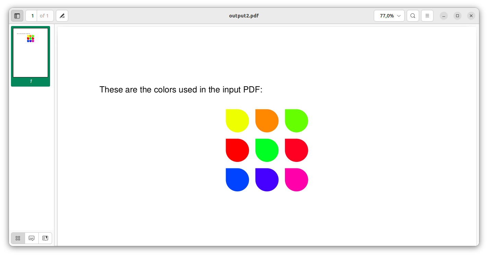

<div style="page-break-before: always;"></div>

## 5.8 Extracting font-information

In this example you'll be extracting font-names from an existing PDF.
This may be useful (in later examples) to handle situations in which you know a certain snippet of information is always written in a particular font.

You'll start by creating a PDF with several fonts;

```python
#!chapter_005/src/snippet_014.py
from borb.pdf.canvas.layout.list.unordered_list import UnorderedList
from borb.pdf.canvas.layout.page_layout.multi_column_layout import SingleColumnLayout
from borb.pdf.canvas.layout.page_layout.page_layout import PageLayout
from borb.pdf.canvas.layout.text.paragraph import Paragraph
from borb.pdf.document.document import Document
from borb.pdf.page.page import Page
from borb.pdf.pdf import PDF


def main():
    # create Document
    doc: Document = Document()

    # create Page
    page: Page = Page()

    # add Page to Document
    doc.append_page(page)

    # set a PageLayout
    layout: PageLayout = SingleColumnLayout(page)

    # add UnorderedList containing a (twice nested) UnorderedList
    for font_name in ["Helvetica", "Helvetica-Bold", "Courier"]:
        layout.add(Paragraph("Hello World from %s!" % font_name, font=font_name))

    # store
    with open("output.pdf", "wb") as out_file_handle:
        PDF.dumps(out_file_handle, doc)


if __name__ == "__main__":
    main()
```

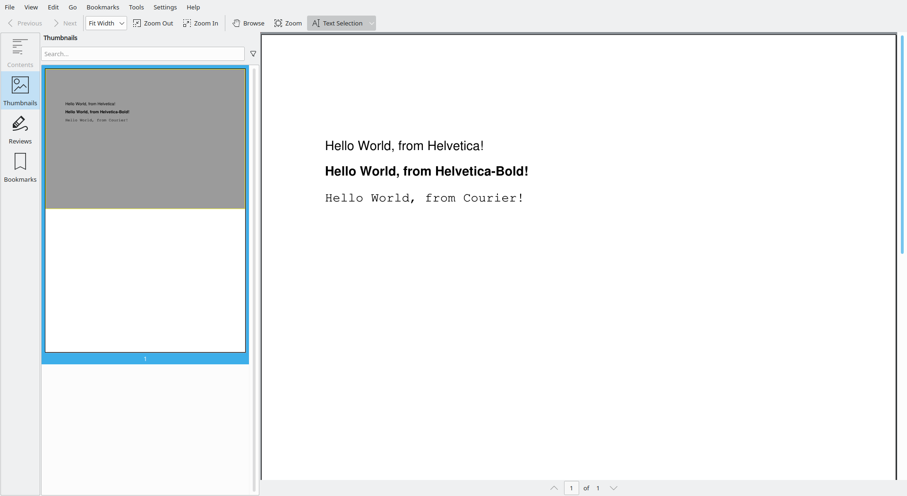

And now you can process that PDF and retrieve the fonts;

```python
#!chapter_005/src/snippet_015.py
import typing
from borb.pdf.document.document import Document
from borb.pdf.pdf import PDF
from borb.toolkit.text.font_extraction import FontExtraction


def main():

    # read the Document
    doc: typing.Optional[Document] = None
    l: FontExtraction = FontExtraction()
    with open("output.pdf", "rb") as in_file_handle:
        doc = PDF.loads(in_file_handle, [l])

    # check whether we have read a Document
    assert doc is not None

    # print the names of the Fonts
    print(l.get_font_names_for_page(0))


if __name__ == "__main__":
    main()
```

This prints:

```commandline
['Helvetica', 'Helvetica-Bold', 'Courier']
```

You can of course go looking at the code for `FontExtraction` (I highly encourage you to do so).
This should enable you to write your own filter (similar to `LocationFilter`) to filter on fonts.

### 5.8.1 Filtering by `font`

In this example you'll be using `FontNameFilter` to retrieve all text on a `Page` that was written in `Courier`.
First things first though, let's create an example PDF with text in different fonts;

```python
#!chapter_005/src/snippet_016.py
from borb.pdf.canvas.layout.list.unordered_list import UnorderedList
from borb.pdf.canvas.layout.page_layout.multi_column_layout import SingleColumnLayout
from borb.pdf.canvas.layout.page_layout.page_layout import PageLayout
from borb.pdf.canvas.layout.text.paragraph import Paragraph
from borb.pdf.document.document import Document
from borb.pdf.page.page import Page
from borb.pdf.pdf import PDF


def main():
    # create Document
    doc: Document = Document()

    # create Page
    page: Page = Page()

    # add Page to Document
    doc.append_page(page)

    # set a PageLayout
    layout: PageLayout = SingleColumnLayout(page)

    # add UnorderedList containing a (twice nested) UnorderedList
    for font_name in ["Helvetica", "Helvetica-Bold", "Courier"]:
        layout.add(Paragraph("Hello World from %s!" % font_name, font=font_name))

    # store
    with open("output.pdf", "wb") as out_file_handle:
        PDF.dumps(out_file_handle, doc)


if __name__ == "__main__":
    main()
```

This generates the following PDF:


Now we can run the code to filter on `font_name`:

```python
#!chapter_005/src/snippet_017.py
import typing
from borb.pdf.document.document import Document
from borb.pdf.pdf import PDF
from borb.toolkit.text.font_name_filter import FontNameFilter
from borb.toolkit.text.simple_text_extraction import SimpleTextExtraction


def main():

    # create FontNameFilter
    l0: FontNameFilter = FontNameFilter("Courier")

    # filtered text just gets passed to SimpleTextExtraction
    l1: SimpleTextExtraction = SimpleTextExtraction()
    l0.add_listener(l1)

    # read the Document
    doc: typing.Optional[Document] = None
    with open("output.pdf", "rb") as in_file_handle:
        doc = PDF.loads(in_file_handle, [l0])

    # check whether we have read a Document
    assert doc is not None

    # print the names of the Fonts
    print(l1.get_text_for_page(0))


if __name__ == "__main__":
    main()
```

This should print:

```commandline
Hello World, from Courier!
```

### 5.8.2 Filtering by `font_color`

Being able to filter by `font_color` allows you to extract text in a much more fine-grained way.
You could filter out only the red text from an invoice, 
or combine this particular filter with other filter implementations and do even crazier things.

This implementation of `EventListener` takes 2 arguments at construction:

- `color` : The `Color` you'd like to keep
- `maximum_normalized_rgb_distance` :   This is the maximum allowable distance between the `Color` in the PDF and the `color` parameter. This allows you to filter on "everything that looks kinda red" rather than "everything that is this exact shade of red".                                  
                                        The distance is defined as ((r0 - r1)² - (g0 - g1)² + (b0 - b1)²) / 3, with r, g, b being the red, green, blue components of the `Color`.

We're going to start by creating an input PDF with text in various colors.

```python
#!chapter_005/src/snippet_018.py
from borb.pdf.canvas.layout.list.unordered_list import UnorderedList
from borb.pdf.canvas.layout.page_layout.multi_column_layout import SingleColumnLayout
from borb.pdf.canvas.layout.page_layout.page_layout import PageLayout
from borb.pdf.canvas.layout.text.paragraph import Paragraph
from borb.pdf.document.document import Document
from borb.pdf.page.page import Page
from borb.pdf.pdf import PDF
from borb.pdf.canvas.color.color import X11Color


def main():
    # create Document
    doc: Document = Document()

    # create Page
    page: Page = Page()

    # add Page to Document
    doc.append_page(page)

    # set a PageLayout
    layout: PageLayout = SingleColumnLayout(page)

    # add UnorderedList containing a (twice nested) UnorderedList
    for color_name in ["Red", "Green", "Blue"]:
        layout.add(
            Paragraph(
                "Hello World from %s!" % color_name, font_color=X11Color(color_name)
            )
        )

    # store
    with open("output.pdf", "wb") as out_file_handle:
        PDF.dumps(out_file_handle, doc)


if __name__ == "__main__":
    main()
```

This generates the following PDF:

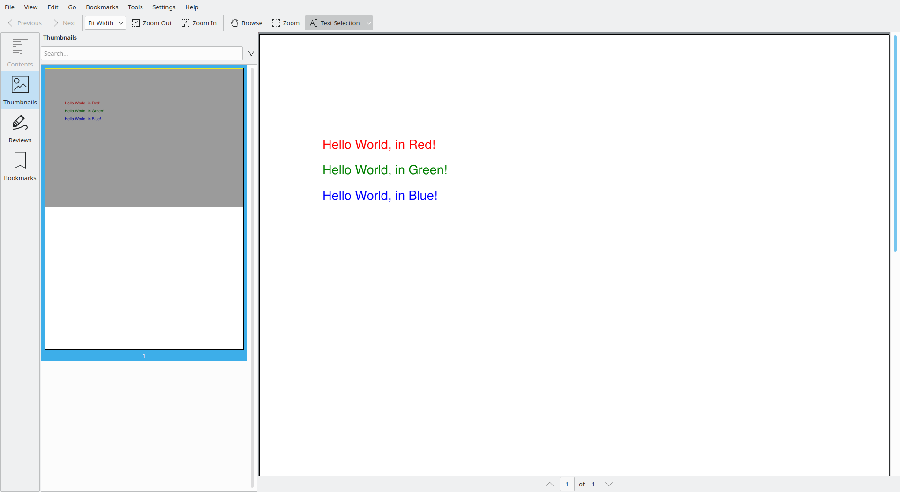

Now we can filter the text in the PDF by selecting the red letters:

```python
#!chapter_005/src/snippet_019.py
import typing
from borb.pdf.document.document import Document
from borb.pdf.pdf import PDF
from borb.toolkit.text.font_color_filter import FontColorFilter
from borb.toolkit.text.simple_text_extraction import SimpleTextExtraction
from borb.pdf.canvas.color.color import X11Color

from decimal import Decimal


def main():

    # create FontColorFilter
    l0: FontColorFilter = FontColorFilter(X11Color("Red"), Decimal(0.01))

    # filtered text just gets passed to SimpleTextExtraction
    l1: SimpleTextExtraction = SimpleTextExtraction()
    l0.add_listener(l1)

    # read the Document
    doc: typing.Optional[Document] = None
    with open("output.pdf", "rb") as in_file_handle:
        doc = PDF.loads(in_file_handle, [l0])

    # check whether we have read a Document
    assert doc is not None

    # print the names of the Fonts
    print(l1.get_text_for_page(0))


if __name__ == "__main__":
    main()
```

This should print:

```commandline
Hello World, in Red!
```

<div style="page-break-before: always;"></div>

## 5.9 Extracting images from a PDF

In this example you'll be extracting images from an existing PDF.
Keep in mind the images may be subject to copyright, they may not have been intended for you to be able to extract them.

To get started, let's briefly re-iterate one of the earlier examples about inserting an `Image` object in a PDF.

```python
#!chapter_005/src/snippet_020.py
from borb.io.read.types import Name, String, Dictionary
from borb.pdf.canvas.layout.page_layout.multi_column_layout import SingleColumnLayout
from borb.pdf.canvas.layout.page_layout.page_layout import PageLayout
from borb.pdf.canvas.layout.text.paragraph import Paragraph
from borb.pdf.document.document import Document
from borb.pdf.page.page import Page
from borb.pdf.pdf import PDF
from borb.pdf.canvas.layout.image.image import Image

from decimal import Decimal


def main():
    # create Document
    doc: Document = Document()

    # create Page
    page: Page = Page()

    # add Page to Document
    doc.append_page(page)

    # set a PageLayout
    layout: PageLayout = SingleColumnLayout(page)

    # define 3 Image URLs
    image_urls: typing.List[str] = [
        "https://images.unsplash.com/photo-1589606663923-283bbd309229?ixid=MnwxMjA3fDB8MHxwaG90by1wYWdlfHx8fGVufDB8fHx8",
        "https://images.unsplash.com/photo-1496637721836-f46d116e6d34?ixid=MnwxMjA3fDB8MHxwaG90by1wYWdlfHx8fGVufDB8fHx8",
        "https://images.unsplash.com/photo-1611873101970-dfa544c23494?ixid=MnwxMjA3fDB8MHxwaG90by1wYWdlfHx8fGVufDB8fHx8",
    ]

    # add an Image for each URL
    for image_url in image_urls:
        layout.add(Image(image_url, width=Decimal(128), height=Decimal(128)))

    # store
    with open("output.pdf", "wb") as out_file_handle:
        PDF.dumps(out_file_handle, doc)


if __name__ == "__main__":
    main()
```


Now that you have an input `Document`, let's go ahead and extract the `Image` from it.

```python
#!chapter_005/src/snippet_021.py
import typing

from borb.io.read.types import Name, String, Dictionary
from borb.pdf.canvas.layout.page_layout.multi_column_layout import SingleColumnLayout
from borb.pdf.canvas.layout.page_layout.page_layout import PageLayout
from borb.pdf.canvas.layout.text.paragraph import Paragraph
from borb.pdf.document.document import Document
from borb.pdf.page.page import Page
from borb.pdf.pdf import PDF
from borb.toolkit.text.text_rank_keyword_extraction import TextRankKeywordExtraction
from borb.toolkit.text.stop_words import ENGLISH_STOP_WORDS
from borb.toolkit.image.simple_image_extraction import SimpleImageExtraction


def main():

    l: SimpleImageExtraction = SimpleImageExtraction()

    # load
    doc: typing.Optional[Document] = None
    with open("output.pdf", "rb") as in_file_handle:
        doc = PDF.loads(in_file_handle, [l])

    # check whether we have read a Document
    assert doc is not None

    print(l.get_images_for_page(0))


if __name__ == "__main__":
    main()
```

This should print:

```
<PIL.JpegImagePlugin.JpegImageFile image mode=RGB size=2000x3000 at 0x7F3BE45E5C40>
<PIL.JpegImagePlugin.JpegImageFile image mode=RGB size=4000x6000 at 0x7F3BE43FB760>
<PIL.JpegImagePlugin.JpegImageFile image mode=RGB size=2640x3300 at 0x7F3BE441B580>
```

What's interesting is that even though you inserted the `Image` objects and specified a particular size, the extracted `Image` is actually a lot larger. 
This is because PDF simply has its own way of dealing with resizing images. 
And there are use-cases where you might actually want this behavior. 

You could embed a tiny example of an `Image` in a `Document`, 
knowing the recipient can extract the full (much richer) `Image`.

Of course, if you're using this `Image` as a company logo, 
or part of the header/footer of the `Document`, 
you typically want the image to be as small as possible (while remaining legible).

In one of the upcoming examples you'll see how to subsample an `Image` in a PDF, 
and you'll see firsthand how this technique can help reduce your document's memory footprint.

### 5.9.1 Modifying images in an existing PDF

In this example you'll be modifying the images in a PDF.
You'll be using the PDF you created earlier (with 3 pineapple images) as a starting point.

First you'll be exploring the PDF, using the JSON-like structure `borb` has created.

```python
#!chapter_005/src/snippet_022.py
import typing

from borb.io.read.types import Name, String, Dictionary
from borb.pdf.canvas.layout.page_layout.multi_column_layout import SingleColumnLayout
from borb.pdf.canvas.layout.page_layout.page_layout import PageLayout
from borb.pdf.canvas.layout.text.paragraph import Paragraph
from borb.pdf.document.document import Document
from borb.pdf.page.page import Page
from borb.pdf.pdf import PDF


def main():

    # load
    doc: typing.Optional[Document] = None
    with open("output.pdf", "rb") as in_file_handle:
        doc = PDF.loads(in_file_handle)

    # check whether we have read a Document
    assert doc is not None

    # print debug information for each Image (which PDF calls XObjects)
    for k, v in doc.get_page(0)["Resources"]["XObject"].items():
        print("%s\t%s" % (k, str(v)))


if __name__ == "__main__":
    main()
```

This code prints:

```
Im1	<PIL.JpegImagePlugin.JpegImageFile image mode=RGB size=2000x3000 at 0x7F74380D0490>
Im2	<PIL.JpegImagePlugin.JpegImageFile image mode=RGB size=4000x6000 at 0x7F7437F1B970>
Im3	<PIL.JpegImagePlugin.JpegImageFile image mode=RGB size=2640x3300 at 0x7F74367D56D0>
```

This example shows us that the PDF has stored the `Image` objects in the `Page` under `Resources\XObject\Im1` (and `Im2`, `Im3` respectively).

You can now modify these and store the `Document`.

First, you'll write this simple function to convert an `Image` to its sepia counterpart.
"sepia" is just a fancy way of saying "old timey brown pictures".

```python
#!chapter_005/src/snippet_023.py
import typing

from borb.io.read.types import Name, String, Dictionary
from borb.pdf.canvas.layout.page_layout.multi_column_layout import SingleColumnLayout
from borb.pdf.canvas.layout.page_layout.page_layout import PageLayout
from borb.pdf.canvas.layout.text.paragraph import Paragraph
from borb.pdf.document.document import Document
from borb.pdf.page.page import Page
from borb.pdf.pdf import PDF

from PIL import Image as PILImage


def modify_image(image: PILImage.Image):
    w = image.width
    h = image.height
    pixels = image.load()
    for i in range(0, w):
        for j in range(0, h):
            r, g, b = pixels[i, j]

            # convert to sepia
            new_r = r * 0.393 + g * 0.769 + b * 0.189
            new_g = r * 0.349 + g * 0.686 + b * 0.168
            new_b = r * 0.272 + g * 0.534 + b * 0.131

            # set
            pixels[i, j] = (int(new_r), int(new_g), int(new_b))


def main():

    # load
    doc: typing.Optional[Document] = None
    with open("output.pdf", "rb") as in_file_handle:
        doc = PDF.loads(in_file_handle)

    # check whether we have read a Document
    assert doc is not None

    # modify each Image
    for k, v in doc.get_page(0)["Resources"]["XObject"].items():
        print("%s\t%s" % (k, str(v)))
        modify_image(v)

    # store PDF
    with open("output.pdf", "wb") as out_file_handle:
        PDF.dumps(out_file_handle, doc)


if __name__ == "__main__":
    main()
```

The result should look like this:


### 5.9.2 Subsampling images in an existing PDF

As you've found out in a previous example, sometimes the dimensions at which an `Image` is displayed are not the same as the dimensions at which it was stored.
This can lead to a rather bulky PDF, if each `Image` is substantially larger than its display-dimensions.

In the next example, you'll be fixing that. 
Luckily `borb` comes with `ImageFormatOptimization` which does all the heavy lifting for you.

As a benchmark, you can first have a look at the file-characteristics of the original input PDF.

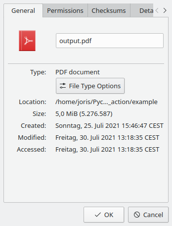

You can see the file is roughly 5Mb large.
Now you can use the following code to optimize the `Image` dimensions:

```python
#!chapter_005/src/snippet_024.py
import typing

from borb.io.read.types import Name, String, Dictionary
from borb.pdf.canvas.layout.page_layout.multi_column_layout import SingleColumnLayout
from borb.pdf.canvas.layout.page_layout.page_layout import PageLayout
from borb.pdf.canvas.layout.text.paragraph import Paragraph
from borb.pdf.document.document import Document
from borb.pdf.page.page import Page
from borb.pdf.pdf import PDF
from borb.toolkit.image.image_format_optimization import ImageFormatOptimization


def main():

    # load
    doc: typing.Optional[Document] = None
    with open("output.pdf", "rb") as in_file_handle:
        doc = PDF.loads(in_file_handle, [ImageFormatOptimization()])

    # check whether we have read a Document
    assert doc is not None

    # store PDF
    with open("output.pdf", "wb") as out_file_handle:
        PDF.dumps(out_file_handle, doc)


if __name__ == "__main__":
    main()
```

When you check out the file-stats on the output-file, the difference is astonishing:

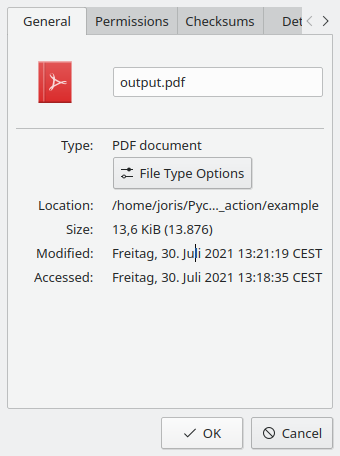

You'll see that the output file looks the same, although there may have been some quality loss in the images.


<div style="page-break-before: always;"></div>

## 5.10 Working with embedded files

PDF is more than just a digital paper-replacement. 
PDF also has some features that go beyond "imitating paper".
For instance PDF allows you embed one or multiple files inside the document. 
By doing so, you can provide extra resources for whoever reads the document.

In one particular use-case, a german invoicing standard (ZUGFeRD) requires the creator of the invoice to embed an XML representation of the invoice, 
to ensure the document can be processed automatically.

In this section you'll handle both extraction of embedded files, and appending embedded files to a `Document`.

### 5.10.1 Embedding files in a PDF

In this example, you'll be creating a `Document` containing one `Paragraph`, and embed a json-file.

```python
#!chapter_005/src/snippet_025.py
from borb.pdf.canvas.layout.page_layout.multi_column_layout import SingleColumnLayout
from borb.pdf.canvas.layout.page_layout.page_layout import PageLayout
from borb.pdf.canvas.layout.text.paragraph import Paragraph
from borb.pdf.document.document import Document
from borb.pdf.page.page import Page
from borb.pdf.pdf import PDF


def main():

    # create empty Document
    d: Document = Document()

    # add Page
    p: Page = Page()
    d.append_page(p)

    # create PageLayout
    l: PageLayout = SingleColumnLayout(p)

    # add Paragraph
    l.add(
        Paragraph(
            """
                    Lorem ipsum dolor sit amet, consectetur adipiscing elit, sed do eiusmod tempor incididunt ut labore et dolore magna aliqua. 
                    Ut enim ad minim veniam, quis nostrud exercitation ullamco laboris nisi ut aliquip ex ea commodo consequat. 
                    Duis aute irure dolor in reprehenderit in voluptate velit esse cillum dolore eu fugiat nulla pariatur. 
                    Excepteur sint occaecat cupidatat non proident, sunt in culpa qui officia deserunt mollit anim id est laborum.    
                    """
        )
    )

    # create bytes for embedded file
    file_bytes = b"""
    {
        "lorem": "ipsum",
        "dolor": "sit"
    }
    """

    # append embedded file
    d.append_embedded_file("lorem_ipsum.json", file_bytes)

    # store
    with open("output.pdf", "wb") as pdf_file_handle:
        PDF.dumps(pdf_file_handle, d)


if __name__ == "__main__":
    main()
```

The PDF should look something like this: 


Notice the warning you see atop the PDF viewer. 
This may of course vary depending on the viewer you're using.
If you open the embedded file pane (again depending on your editor) you may see something similar to this:

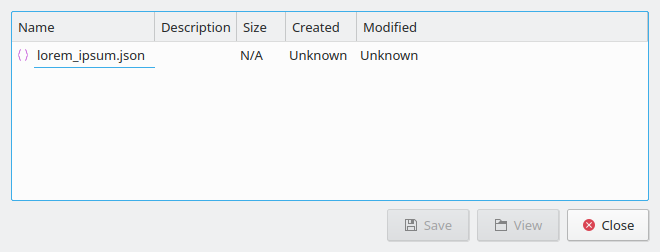

### 5.10.2 Extracting embedded files from a PDF

Now that you can embed files in a PDF, let's see how you can retrieve those files again.

```python
#!chapter_005/src/snippet_026.py
import typing
from borb.pdf.document.document import Document
from borb.pdf.pdf import PDF


def main():

    # read the Document
    doc: typing.Optional[Document] = None
    with open("output.pdf", "rb") as pdf_file_handle:
        doc = PDF.loads(pdf_file_handle)

    # check whether we have read a Document
    assert doc is not None

    # retrieve all embedded files and their bytes
    for k, v in doc.get_embedded_files().items():

        # display the file name, and the size
        print("%s, %d bytes" % (k, len(v)))


if __name__ == "__main__":
    main()
```

This should print:

```
lorem_ipsum.json, 66 bytes
```

Of course, rather than just displaying the byte-count you could also write the bytes to a file again.
Or process them directly using the `io` API in Python.

<div style="page-break-before: always;"></div>

## 5.11 Merging PDF documents

This is one of the most common usecases in working with PDF.
In the next example you'll be merging multiple existing PDF documents.

You'll start by creating two methods that each create (and write) a PDF document.

```python
#!chapter_005/src/snippet_027.py
import typing
from borb.pdf.document.document import Document
from borb.pdf.pdf import PDF

import typing

from borb.pdf.canvas.color.color import HexColor
from borb.pdf.canvas.layout.page_layout.multi_column_layout import SingleColumnLayout
from borb.pdf.canvas.layout.page_layout.page_layout import PageLayout
from borb.pdf.canvas.layout.text.paragraph import Paragraph
from borb.pdf.document.document import Document
from borb.pdf.page.page import Page
from borb.pdf.pdf import PDF


def main():

    d: Document = Document()
    p: Page = Page()
    d.append_page(p)

    l: PageLayout = SingleColumnLayout(p)
    l.add(
        Paragraph(
            """
                    Lorem Ipsum is simply dummy text of the printing and typesetting industry. 
                    Lorem Ipsum has been the industry's standard dummy text ever since the 1500s, 
                    when an unknown printer took a galley of type and scrambled it to make a type specimen book. 
                    It has survived not only five centuries, but also the leap into electronic typesetting, remaining essentially unchanged. 
                    It was popularised in the 1960s with the release of Letraset sheets containing Lorem Ipsum passages, 
                    and more recently with desktop publishing software like Aldus PageMaker including versions of Lorem Ipsum.
                    """,
            font_color=HexColor("de6449"),
        )
    )

    with open("output_001.pdf", "wb") as pdf_out_handle:
        PDF.dumps(pdf_out_handle, d)


if __name__ == "__main__":
    main()
```

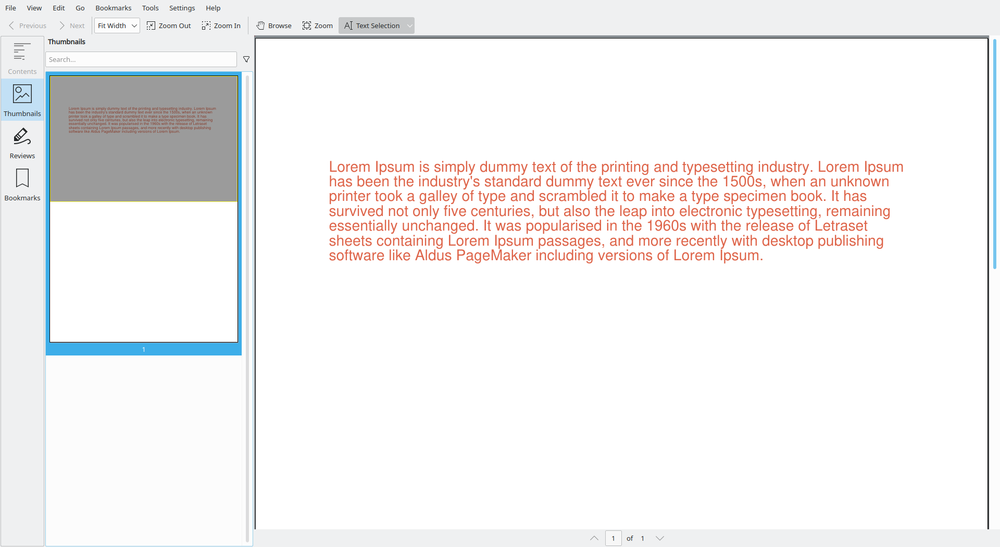

That should take care of the first PDF.
Now you can write a second (similar) PDF document:

```python
#!chapter_005/src/snippet_028.py
import typing
from borb.pdf.document.document import Document
from borb.pdf.pdf import PDF

import typing

from borb.pdf.canvas.color.color import HexColor
from borb.pdf.canvas.layout.page_layout.multi_column_layout import SingleColumnLayout
from borb.pdf.canvas.layout.page_layout.page_layout import PageLayout
from borb.pdf.canvas.layout.text.paragraph import Paragraph
from borb.pdf.document.document import Document
from borb.pdf.page.page import Page
from borb.pdf.pdf import PDF


def main():

    d: Document = Document()
    p: Page = Page()
    d.append_page(p)

    l: PageLayout = SingleColumnLayout(p)
    l.add(
        Paragraph(
            """
                    Lorem ipsum dolor sit amet, consectetur adipiscing elit, sed do eiusmod tempor incididunt ut labore et dolore magna aliqua. 
                    Ut enim ad minim veniam, quis nostrud exercitation ullamco laboris nisi ut aliquip ex ea commodo consequat. 
                    Duis aute irure dolor in reprehenderit in voluptate velit esse cillum dolore eu fugiat nulla pariatur. 
                    Excepteur sint occaecat cupidatat non proident, sunt in culpa qui officia deserunt mollit anim id est laborum.
                    """,
            font_color=HexColor("f1cd2e"),
        )
    )

    with open("output_002.pdf", "wb") as pdf_out_handle:
        PDF.dumps(pdf_out_handle, d)


if __name__ == "__main__":
    main()
```

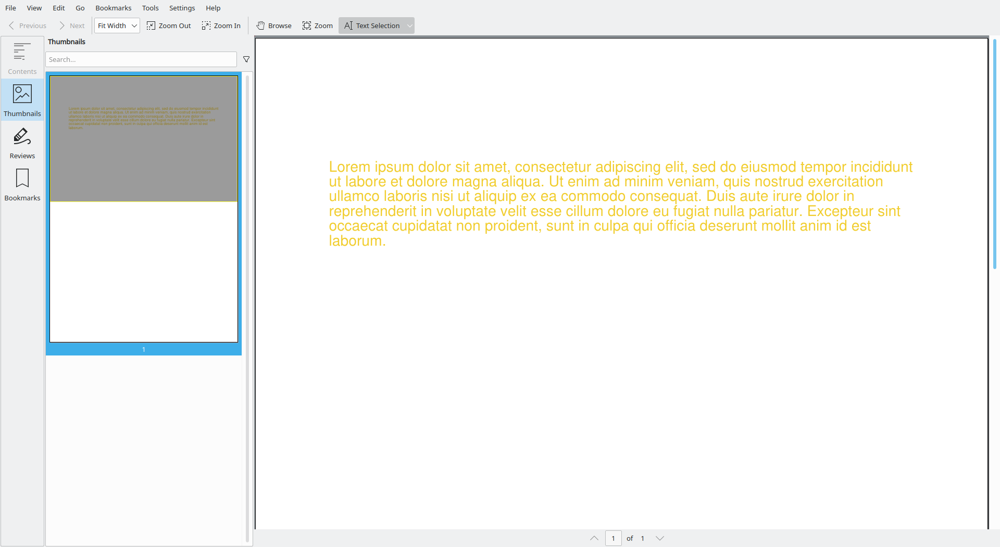

Finally, you can write the main method, which will create both documents, read them, and merge them.

```python
#!chapter_005/src/snippet_029.py
import typing
from borb.pdf.document.document import Document
from borb.pdf.pdf import PDF

import typing

from borb.pdf.canvas.color.color import HexColor
from borb.pdf.canvas.layout.page_layout.multi_column_layout import SingleColumnLayout
from borb.pdf.canvas.layout.page_layout.page_layout import PageLayout
from borb.pdf.canvas.layout.text.paragraph import Paragraph
from borb.pdf.document.document import Document
from borb.pdf.page.page import Page
from borb.pdf.pdf import PDF


def main():

    # open doc_001
    doc_001: typing.Optional[Document] = Document()
    with open("output_001.pdf", "rb") as pdf_file_handle:
        doc_001 = PDF.loads(pdf_file_handle)

    # open doc_002
    doc_002: typing.Optional[Document] = Document()
    with open("output_002.pdf", "rb") as pdf_file_handle:
        doc_002 = PDF.loads(pdf_file_handle)

    # merge
    doc_001.append_document(doc_002)

    # write
    with open("output_003.pdf", "wb") as pdf_file_handle:
        PDF.dumps(pdf_file_handle, doc_001)


if __name__ == "__main__":
    main()
```


You don't have to fully merge both `Document` objects, you can just copy a couple of `Page` objects from one `Document` to another.     
In the next example you'll be selecting one `Page` from each `Document` and building a new PDF with them.

You'll start by creating a slightly modified version of the first document from the previous example.
This document has 10 pages.

```python
#!chapter_005/src/snippet_030.py
import typing
from borb.pdf.document.document import Document
from borb.pdf.pdf import PDF

from decimal import Decimal
import typing

from borb.pdf.canvas.color.color import HexColor
from borb.pdf.canvas.layout.page_layout.multi_column_layout import SingleColumnLayout
from borb.pdf.canvas.layout.page_layout.page_layout import PageLayout
from borb.pdf.canvas.layout.text.paragraph import Paragraph
from borb.pdf.document.document import Document
from borb.pdf.page.page import Page
from borb.pdf.pdf import PDF


def main():

    d: Document = Document()

    N: int = 10
    for i in range(0, N):
        p: Page = Page()
        d.append_page(p)
        l: PageLayout = SingleColumnLayout(p)
        l.add(
            Paragraph(
                "Page %d of %d" % (i + 1, N),
                font_color=HexColor("0b3954"),
                font_size=Decimal(24),
            )
        )
        l.add(
            Paragraph(
                """
                        Lorem Ipsum is simply dummy text of the printing and typesetting industry. 
                        Lorem Ipsum has been the industry's standard dummy text ever since the 1500s, 
                        when an unknown printer took a galley of type and scrambled it to make a type specimen book. 
                        It has survived not only five centuries, but also the leap into electronic typesetting, remaining essentially unchanged. 
                        It was popularised in the 1960s with the release of Letraset sheets containing Lorem Ipsum passages, 
                        and more recently with desktop publishing software like Aldus PageMaker including versions of Lorem Ipsum.
                        """,
                font_color=HexColor("de6449"),
            )
        )

    with open("output_001.pdf", "wb") as pdf_out_handle:
        PDF.dumps(pdf_out_handle, d)


if __name__ == "__main__":
    main()
```

The page number is printed atop each page, to make it easier to identify them later.

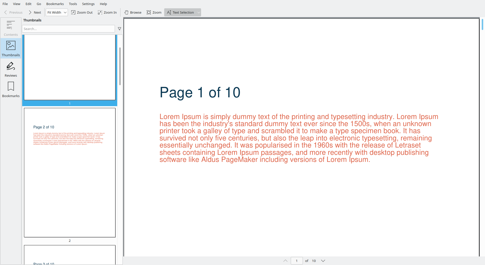

The second document will also have 10 pages. The page number will also be displayed atop each page:

```python
#!chapter_005/src/snippet_031.py
import typing
from borb.pdf.document.document import Document
from borb.pdf.pdf import PDF

import typing
from decimal import Decimal

from borb.pdf.document.document import Document
from borb.pdf.page.page import Page
from borb.pdf.pdf import PDF


def main():

    # open doc_001
    doc_001: typing.Optional[Document] = Document()
    with open("output_001.pdf", "rb") as pdf_file_handle:
        doc_001 = PDF.loads(pdf_file_handle)

    # open doc_002
    doc_002: typing.Optional[Document] = Document()
    with open("output_002.pdf", "rb") as pdf_file_handle:
        doc_002 = PDF.loads(pdf_file_handle)

    # create new document
    d: Document = Document()
    for i in range(0, 10):
        p: typing.Optional[Page] = None
        if i % 2 == 0:
            p = doc_001.get_page(i)
        else:
            p = doc_002.get_page(i)
        d.append_page(p)

    # write
    with open("output_003.pdf", "wb") as pdf_file_handle:
        PDF.dumps(pdf_file_handle, d)


if __name__ == "__main__":
    main()
```


To build the merged document you'll be selecting a page from each input document in turn, until the merged document has 10 pages.

```python
#!chapter_005/src/snippet_032.py
import typing
from borb.pdf.document.document import Document
from borb.pdf.pdf import PDF

import typing
from decimal import Decimal

from borb.pdf.document.document import Document
from borb.pdf.page.page import Page
from borb.pdf.pdf import PDF


def main():

    # open doc_001
    doc_001: typing.Optional[Document] = Document()
    with open("output_001.pdf", "rb") as pdf_file_handle:
        doc_001 = PDF.loads(pdf_file_handle)

    # open doc_002
    doc_002: typing.Optional[Document] = Document()
    with open("output_002.pdf", "rb") as pdf_file_handle:
        doc_002 = PDF.loads(pdf_file_handle)

    # create new document
    d: Document = Document()
    for i in range(0, 10):
        p: typing.Optional[Page] = None
        if i % 2 == 0:
            p = doc_001.get_page(i)
        else:
            p = doc_002.get_page(i)
        d.append_page(p)

    # write
    with open("output_003.pdf", "wb") as pdf_file_handle:
        PDF.dumps(pdf_file_handle, d)


if __name__ == "__main__":
    main()
```

The final document alternates pages between both input documents (which is obvious from the color and page numbers).

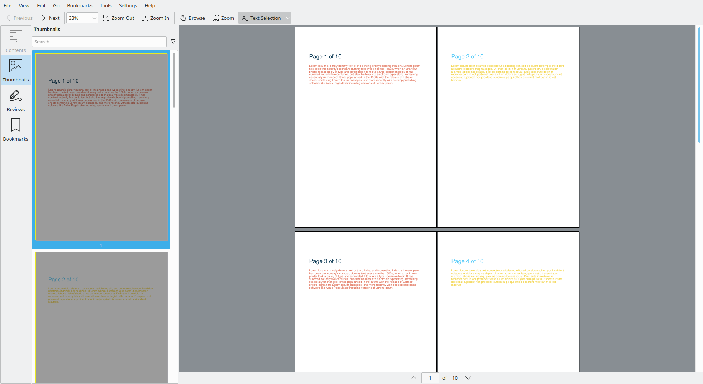

<div style="page-break-before: always;"></div>

## 5.12 Removing pages from  PDF documents

Sometimes you may want to remove a `Page` from a PDF.
e.g. removing a cover-page before text-extraction may speed things up (one less page to process)

In the next example you'll be removing the first `Page` from a `Document`.
First of course, we need to create a `Document` to start with;

```python
#!chapter_005/src/snippet_033.py
import typing
from borb.pdf.document.document import Document
from borb.pdf.pdf import PDF

import typing
from decimal import Decimal

from borb.pdf.document.document import Document
from borb.pdf.page.page import Page
from borb.pdf.pdf import PDF
from borb.pdf.canvas.layout.page_layout.multi_column_layout import MultiColumnLayout
from borb.pdf.canvas.layout.page_layout.page_layout import PageLayout
from borb.pdf.canvas.layout.text.paragraph import Paragraph
from borb.pdf.canvas.color.color import HexColor


def main():

    # create new document
    d: Document = Document()

    # add Page
    p: Page = Page()
    d.append_page(p)
    page_number: int = 1

    # create PageLayout
    l: PageLayout = MultiColumnLayout(p)

    # adding Pages
    for _ in range(0, 20):
        if l.get_page() != p or page_number == 1:
            l.add(
                Paragraph(
                    "Page %d" % page_number,
                    font_color=HexColor("f1cd2e"),
                    font_size=Decimal(20),
                    font="Courier-Bold",
                )
            )
            p = l.get_page()
            page_number += 1

        l.add(
            Paragraph(
                """
                        Lorem ipsum dolor sit amet, consectetur adipiscing elit, sed do eiusmod tempor incididunt ut labore et dolore magna aliqua. 
                        Ut enim ad minim veniam, quis nostrud exercitation ullamco laboris nisi ut aliquip ex ea commodo consequat. 
                        Duis aute irure dolor in reprehenderit in voluptate velit esse cillum dolore eu fugiat nulla pariatur. 
                        Excepteur sint occaecat cupidatat non proident, sunt in culpa qui officia deserunt mollit anim id est laborum.
                        """
            )
        )

    # write
    with open("output.pdf", "wb") as pdf_file_handle:
        PDF.dumps(pdf_file_handle, d)


if __name__ == "__main__":
    main()
```


Now that we have a substantial `Document`, we can remove a `Page` from it;

```python
#!chapter_005/src/snippet_034.py
import typing
from borb.pdf.document.document import Document
from borb.pdf.pdf import PDF

import typing
from decimal import Decimal

from borb.pdf.document.document import Document
from borb.pdf.page.page import Page
from borb.pdf.pdf import PDF
from borb.pdf.canvas.layout.page_layout.multi_column_layout import MultiColumnLayout
from borb.pdf.canvas.layout.page_layout.page_layout import PageLayout
from borb.pdf.canvas.layout.text.paragraph import Paragraph
from borb.pdf.canvas.color.color import HexColor


def main():

    doc: typing.Optional[Document] = None
    with open("output.pdf", "rb") as pdf_file_handle:
        doc = PDF.loads(pdf_file_handle)

    assert doc is not None

    # remove Page
    doc.pop_page(1)

    # store Document
    with open("output.pdf", "wb") as pdf_file_handle:
        PDF.dumps(pdf_file_handle, doc)


if __name__ == "__main__":
    main()
```

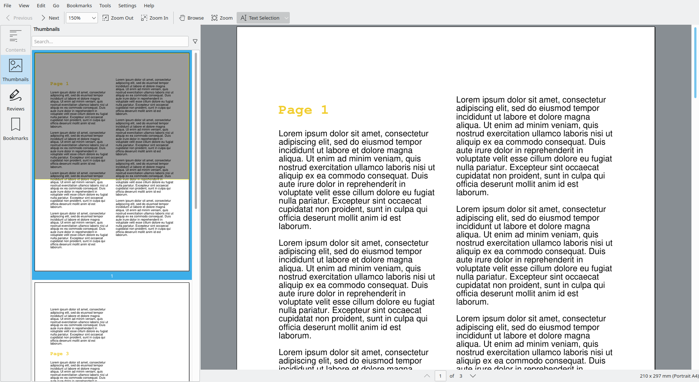

You can see (in the thumbnail panel on the left side) that the second page was removed.

<div style="page-break-before: always;"></div>

## 5.13 Rotating pages in PDF documents

In this example you'll be rotating a `Page` 90 degrees clockwise. 
You can rotate a `Page` any multiple of 90 degrees.

```python
#!chapter_005/src/snippet_035.py
import typing
from borb.pdf.document.document import Document
from borb.pdf.pdf import PDF

import typing
from decimal import Decimal

from borb.pdf.document.document import Document
from borb.pdf.page.page import Page
from borb.pdf.pdf import PDF
from borb.pdf.canvas.layout.page_layout.multi_column_layout import MultiColumnLayout
from borb.pdf.canvas.layout.page_layout.page_layout import PageLayout
from borb.pdf.canvas.layout.text.paragraph import Paragraph
from borb.pdf.canvas.color.color import HexColor


def main():

    # create new document
    d: Document = Document()

    # add Page
    p: Page = Page()
    d.append_page(p)
    page_number: int = 1

    # create PageLayout
    l: PageLayout = MultiColumnLayout(p)

    # adding Pages
    for _ in range(0, 20):
        if l.get_page() != p or page_number == 1:
            l.add(
                Paragraph(
                    "Page %d" % page_number,
                    font_color=HexColor("f1cd2e"),
                    font_size=Decimal(20),
                    font="Courier-Bold",
                )
            )
            p = l.get_page()
            page_number += 1

        l.add(
            Paragraph(
                """
                        Lorem ipsum dolor sit amet, consectetur adipiscing elit, sed do eiusmod tempor incididunt ut labore et dolore magna aliqua. 
                        Ut enim ad minim veniam, quis nostrud exercitation ullamco laboris nisi ut aliquip ex ea commodo consequat. 
                        Duis aute irure dolor in reprehenderit in voluptate velit esse cillum dolore eu fugiat nulla pariatur. 
                        Excepteur sint occaecat cupidatat non proident, sunt in culpa qui officia deserunt mollit anim id est laborum.
                        """
            )
        )

    # write
    with open("output.pdf", "wb") as pdf_file_handle:
        PDF.dumps(pdf_file_handle, d)


if __name__ == "__main__":
    main()
```


You already know this PDF, it's the same from the previous examples.

Now let's rotate a `Page`:

```python
#!chapter_005/src/snippet_036.py
import typing
from borb.pdf.document.document import Document
from borb.pdf.pdf import PDF

import typing
from decimal import Decimal

from borb.pdf.document.document import Document
from borb.pdf.page.page import Page
from borb.pdf.pdf import PDF
from borb.pdf.canvas.layout.page_layout.multi_column_layout import MultiColumnLayout
from borb.pdf.canvas.layout.page_layout.page_layout import PageLayout
from borb.pdf.canvas.layout.text.paragraph import Paragraph
from borb.pdf.canvas.color.color import HexColor


def main():

    doc: typing.Optional[Document] = None
    with open("output.pdf", "rb") as pdf_file_handle:
        doc = PDF.loads(pdf_file_handle)

    assert doc is not None

    # rotate Page
    doc.get_page(0).rotate_right()

    # store Document
    with open("output.pdf", "wb") as pdf_file_handle:
        PDF.dumps(pdf_file_handle, doc)


if __name__ == "__main__":
    main()
```


<div style="page-break-before: always;"></div>

## 5.14 Conclusion

In this section you've learned the basics of working with existing PDF documents. 
You've seen how to extract text, regular expressions, images, font-information and color-information.

And you've seen the basics of merging PDF's and removing one or more pages from a PDF.

This section, together with the previous wraps up the basics of what you can do with `borb`.

I would encourage you to continue reading, and more importantly to continue exploring `borb`.
There are many more options and algorithms that you may find useful. 
As a developer, expanding your toolkit with more knowledge is never a bad thing.

<div style="page-break-before: always;"></div>

## 6 Adding annotations to a PDF

from the PDF-spec:

> An annotation associates an object such as a note, sound, or movie with a location on a page of a PDF
> document, or provides a way to interact with the user by means of the mouse and keyboard. PDF includes a
> wide variety of standard annotation types, described in detail in 12.5.6, “Annotation Types.”


<div style="page-break-before: always;"></div>

## 6.1 Adding geometric shapes

For this example, you'll be adding a cartoon-ish diamond shape to a PDF.
You can do this with a PDF that was just created, or with an existing PDF.
`borb` comes with a rich `LineArtFactory` enabling you to easily add a shape to your PDF without having to resort to pixel-geometry.

```python
#!chapter_006/src/snippet_001.py
from decimal import Decimal

from borb.pdf.canvas.layout.annotation.polygon_annotion import PolygonAnnotation
from borb.pdf.canvas.color.color import HexColor
from borb.pdf.canvas.geometry.rectangle import Rectangle
from borb.pdf.canvas.layout.page_layout.multi_column_layout import SingleColumnLayout
from borb.pdf.canvas.layout.page_layout.page_layout import PageLayout
from borb.pdf.canvas.layout.text.paragraph import Paragraph
from borb.pdf.canvas.line_art.line_art_factory import LineArtFactory
from borb.pdf.document.document import Document
from borb.pdf.page.page import Page
from borb.pdf.page.page_size import PageSize
from borb.pdf.pdf import PDF


def main():

    doc: Document = Document()
    page: Page = Page()
    doc.append_page(page)

    layout: PageLayout = SingleColumnLayout(page)
    layout.add(
        Paragraph(
            """
                        Lorem ipsum dolor sit amet, consectetur adipiscing elit, sed do eiusmod tempor incididunt ut labore et dolore magna aliqua. 
                        Ut enim ad minim veniam, quis nostrud exercitation ullamco laboris nisi ut aliquip ex ea commodo consequat. 
                        Duis aute irure dolor in reprehenderit in voluptate velit esse cillum dolore eu fugiat nulla pariatur. 
                        Excepteur sint occaecat cupidatat non proident, sunt in culpa qui officia deserunt mollit anim id est laborum.
                        """
        )
    )

    page_width: Decimal = PageSize.A4_PORTRAIT.value[0]
    page_height: Decimal = PageSize.A4_PORTRAIT.value[1]
    s: Decimal = Decimal(100)
    page.append_annotation(
        PolygonAnnotation(
            LineArtFactory.cartoon_diamond(
                Rectangle(
                    page_width / Decimal(2) - s / Decimal(2),
                    page_height / Decimal(2) - s / Decimal(2),
                    s,
                    s,
                )
            ),
            stroke_color=HexColor("f1cd2e"),
        )
    )

    with open("output.pdf", "wb") as out_file_handle:
        PDF.dumps(out_file_handle, doc)


if __name__ == "__main__":
    main()
```

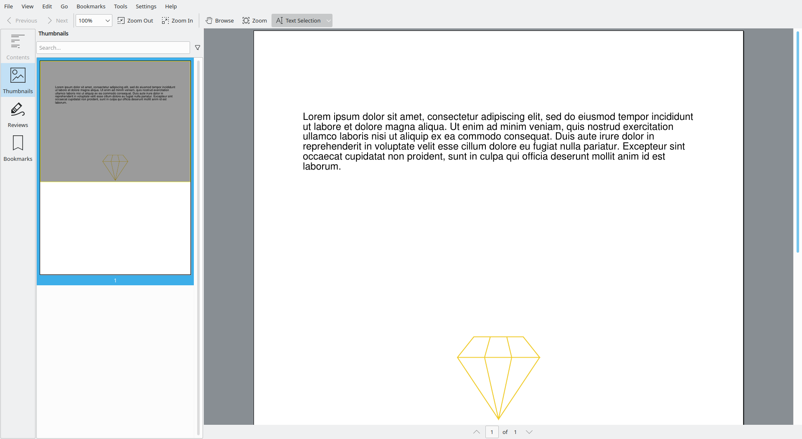

You may be wondering why `borb` did not make it easier on you to add the annotation.
I mean to say, you had to calculate the coordinates yourself, that's unusually unhelpful.

The key thing to take away from this example (and in fact all subsequent examples in this section) is that annotations are typically added **after** the `Document` has been generated.

So `borb` does not offer much convenience methods, because it assumes the precise layout of the `Page` will have already been baked in to the `Document` at which point it is too late to attempt to retrieve it.

## 6.2 Adding text annotations

In this example you'll be creating a text-annotation. 
This is comparable to adding a pop-up Post-it note to a PDF.

```python
#!chapter_006/src/snippet_002.py
from decimal import Decimal

from borb.pdf.canvas.layout.annotation.text_annotation import (
    TextAnnotation,
    TextAnnotationIconType,
)
from borb.pdf.canvas.color.color import HexColor
from borb.pdf.canvas.geometry.rectangle import Rectangle
from borb.pdf.canvas.layout.page_layout.multi_column_layout import SingleColumnLayout
from borb.pdf.canvas.layout.page_layout.page_layout import PageLayout
from borb.pdf.canvas.layout.text.paragraph import Paragraph
from borb.pdf.document.document import Document
from borb.pdf.page.page import Page
from borb.pdf.page.page_size import PageSize
from borb.pdf.pdf import PDF


def main():

    doc: Document = Document()
    page: Page = Page()
    doc.append_page(page)

    layout: PageLayout = SingleColumnLayout(page)
    layout.add(
        Paragraph(
            """
                        Lorem ipsum dolor sit amet, consectetur adipiscing elit, sed do eiusmod tempor incididunt ut labore et dolore magna aliqua. 
                        Ut enim ad minim veniam, quis nostrud exercitation ullamco laboris nisi ut aliquip ex ea commodo consequat. 
                        Duis aute irure dolor in reprehenderit in voluptate velit esse cillum dolore eu fugiat nulla pariatur. 
                        Excepteur sint occaecat cupidatat non proident, sunt in culpa qui officia deserunt mollit anim id est laborum.
                        """
        )
    )

    page_width: Decimal = PageSize.A4_PORTRAIT.value[0]
    page_height: Decimal = PageSize.A4_PORTRAIT.value[1]
    s: Decimal = Decimal(100)
    page.append_annotation(
        TextAnnotation(
            Rectangle(
                page_width / Decimal(2) - s / Decimal(2),
                page_height / Decimal(2) - s / Decimal(2),
                s,
                s,
            ),
            contents="Hello World!",
            text_annotation_icon=TextAnnotationIconType.COMMENT,
            color=HexColor("f1cd2e"),
        )
    )

    with open("output.pdf", "wb") as out_file_handle:
        PDF.dumps(out_file_handle, doc)


if __name__ == "__main__":
    main()
```

You can customize quite a few aspects of this particular annotation:

- The text
- The location at which the icon is displayed
- The icon being displayed (you have the option to select one from a range of pre-defined icons)
- The color of the icon (and the resulting pop-up box)

The PDF you created should end up looking like this:

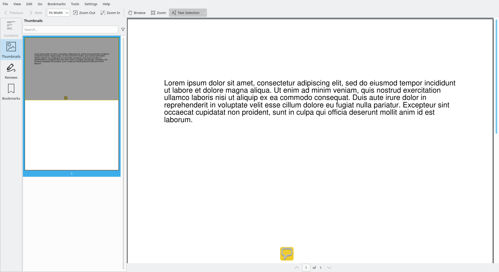

And when you click on the icon in the middle of the page, you get a little pop-up:

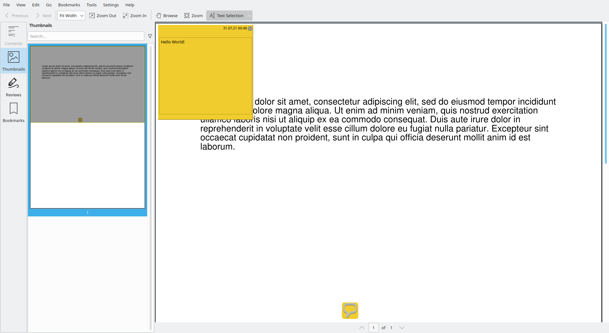

## 6.3 Adding link annotations

Link annotations provide your readers with an easy way to navigate the PDF document.
Clicking a link-annotation can:

- Take the reader to a predefined page (or piece of a page)
- Set the zoom level at which the page is being displayed
- Set the crop box of the PDF reader

In the next example, you'll create a `Document` with several pages, 
and provide each of them with a convenient "back to the beginning" link annotation.

```python
#!chapter_006/src/snippet_003.py
from decimal import Decimal

from borb.pdf.canvas.layout.annotation.link_annotation import (
    LinkAnnotation,
    DestinationType,
)
from borb.pdf.canvas.color.color import HexColor
from borb.pdf.canvas.geometry.rectangle import Rectangle
from borb.pdf.canvas.layout.page_layout.multi_column_layout import SingleColumnLayout
from borb.pdf.canvas.layout.page_layout.page_layout import PageLayout
from borb.pdf.canvas.layout.text.paragraph import Paragraph
from borb.pdf.document.document import Document
from borb.pdf.page.page import Page
from borb.pdf.page.page_size import PageSize
from borb.pdf.pdf import PDF


def main():

    doc: Document = Document()

    # add 10 pages
    N: int = 10
    for i in range(0, N):
        page: Page = Page()
        doc.append_page(page)

        layout: PageLayout = SingleColumnLayout(page)

        layout.add(
            Paragraph(
                "page %d of %d" % (i + 1, N),
                font_color=HexColor("f1cd2e"),
                font_size=Decimal(20),
                font="Helvetica-Bold",
            )
        )

        layout.add(
            Paragraph(
                """
                        Lorem ipsum dolor sit amet, consectetur adipiscing elit, sed do eiusmod tempor incididunt ut labore et dolore magna aliqua. 
                        Ut enim ad minim veniam, quis nostrud exercitation ullamco laboris nisi ut aliquip ex ea commodo consequat. 
                        Duis aute irure dolor in reprehenderit in voluptate velit esse cillum dolore eu fugiat nulla pariatur. 
                        Excepteur sint occaecat cupidatat non proident, sunt in culpa qui officia deserunt mollit anim id est laborum.
                        """
            )
        )

        page_width: Decimal = PageSize.A4_PORTRAIT.value[0]
        page_height: Decimal = PageSize.A4_PORTRAIT.value[1]
        s: Decimal = Decimal(100)
        page.append_annotation(
            LinkAnnotation(
                Rectangle(
                    page_width / Decimal(2) - s / Decimal(2),
                    page_height / Decimal(2) - s / Decimal(2),
                    s,
                    s,
                ),
                page=Decimal(0),
                destination_type=DestinationType.FIT,
            )
        )

    # store
    with open("output.pdf", "wb") as out_file_handle:
        PDF.dumps(out_file_handle, doc)


if __name__ == "__main__":
    main()
```

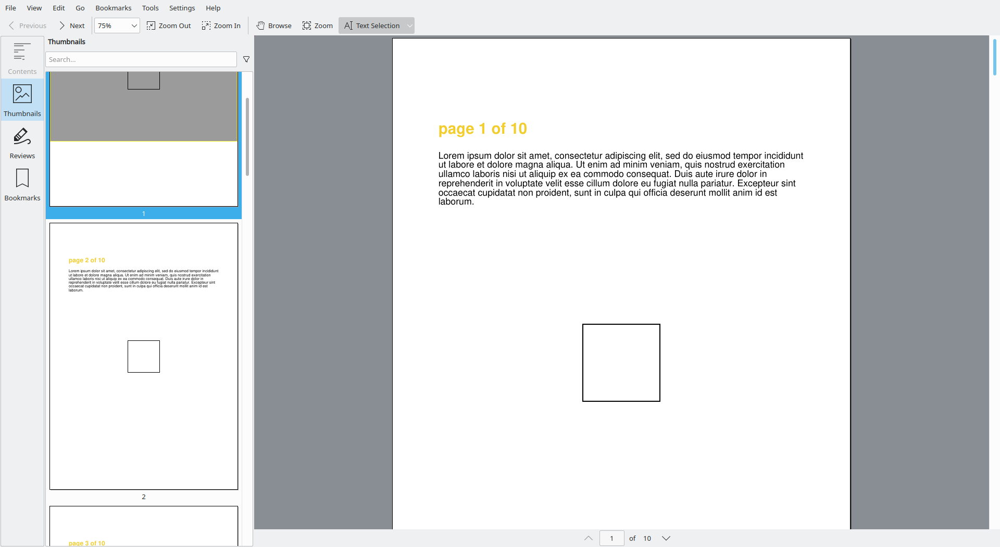

Try it! Navigate to any `Page` of the `Document` and click the link-annotation. 
It should send you straight back to the first `Page`.

You used `DestinationType.FIT` in this example, which forces the viewer software to go to a given page (0 in this case),
and ensure the zoom-level is set to fit this page in the viewer. This is the option that requires the least amount of parameters.
You can  also set other `DestinationType` values, for instance to force the viewer to go to a particular y-coordinate of a given page, etc.

- `DestinationType.FIT` : Display the page designated by page, with its contents magnified just
enough to fit the entire page within the window both horizontally and
vertically. If the required horizontal and vertical magnification factors
are different, use the smaller of the two, centering the page within the
window in the other dimension.

- `DestinationType.FIT_B` : (PDF 1.1) Display the page designated by page, with its contents
magnified just enough to fit its bounding box entirely within the window
both horizontally and vertically. If the required horizontal and vertical
magnification factors are different, use the smaller of the two,
centering the bounding box within the window in the other dimension.

- `DestinationType.FIT_B_H` : (PDF 1.1) Display the page designated by page, with the vertical
coordinate top positioned at the top edge of the window and the
contents of the page magnified just enough to fit the entire width of its
bounding box within the window. A null value for top specifies that the
current value of that parameter shall be retained unchanged.

- `DestinationType.FIT_B_V` : (PDF 1.1) Display the page designated by page, with the horizontal
coordinate left positioned at the left edge of the window and the
contents of the page magnified just enough to fit the entire height of its
bounding box within the window. A null value for left specifies that the
current value of that parameter shall be retained unchanged.

- `DestinationType.FIT_H` : Display the page designated by page, with the vertical coordinate top
positioned at the top edge of the window and the contents of the page
magnified just enough to fit the entire width of the page within the
window. A null value for top specifies that the current value of that
parameter shall be retained unchanged.

- `DestinationType.FIT_R` : Display the page designated by page, with its contents magnified just
enough to fit the rectangle specified by the coordinates left, bottom,
right, and top entirely within the window both horizontally and vertically.
If the required horizontal and vertical magnification factors are
different, use the smaller of the two, centering the rectangle within the
window in the other dimension.

- `DestinationType.FIT_V` : Display the page designated by page, with the horizontal coordinate
left positioned at the left edge of the window and the contents of the
page magnified just enough to fit the entire height of the page within
the window. A null value for left specifies that the current value of that
parameter shall be retained unchanged.

- `DestinationType.X_Y_Z` : Display the page designated by page, with the coordinates (left, top)
positioned at the upper-left corner of the window and the contents of
the page magnified by the factor zoom. A null value for any of the
parameters left, top, or zoom specifies that the current value of that
parameter shall be retained unchanged. A zoom value of 0 has the
same meaning as a null value.

This example is very minimalistic. You can expand upon it.
Rather than using a simple square, you can draw an `Image` or `Paragraph` and have the annotation be on top of it.
I'm just giving you the basic tools you need, what you do with them is limited only by your imagination.

## 6.4 Adding remote go-to annotations

A remote go-to annotation allows you to make an area of your PDF clickable and functions like a hyperlink when clicked.
This can be particularly useful if your PDF is part of a document-process where you might want to link this document to its source-system, or other documents.

```python
#!chapter_006/src/snippet_004.py
from decimal import Decimal

from borb.pdf.canvas.layout.annotation.remote_go_to_annotation import (
    RemoteGoToAnnotation,
)
from borb.pdf.canvas.color.color import HexColor
from borb.pdf.canvas.geometry.rectangle import Rectangle
from borb.pdf.canvas.layout.page_layout.multi_column_layout import SingleColumnLayout
from borb.pdf.canvas.layout.page_layout.page_layout import PageLayout
from borb.pdf.canvas.layout.text.paragraph import Paragraph
from borb.pdf.document.document import Document
from borb.pdf.page.page import Page
from borb.pdf.page.page_size import PageSize
from borb.pdf.pdf import PDF


def main():

    doc: Document = Document()

    page: Page = Page()
    doc.append_page(page)

    layout: PageLayout = SingleColumnLayout(page)
    layout.add(
        Paragraph(
            """
                        Lorem ipsum dolor sit amet, consectetur adipiscing elit, sed do eiusmod tempor incididunt ut labore et dolore magna aliqua. 
                        Ut enim ad minim veniam, quis nostrud exercitation ullamco laboris nisi ut aliquip ex ea commodo consequat. 
                        Duis aute irure dolor in reprehenderit in voluptate velit esse cillum dolore eu fugiat nulla pariatur. 
                        Excepteur sint occaecat cupidatat non proident, sunt in culpa qui officia deserunt mollit anim id est laborum.
                        """
        )
    )

    page_width: Decimal = PageSize.A4_PORTRAIT.value[0]
    page_height: Decimal = PageSize.A4_PORTRAIT.value[1]
    s: Decimal = Decimal(100)
    page.append_annotation(
        RemoteGoToAnnotation(
            Rectangle(
                page_width / Decimal(2) - s / Decimal(2),
                page_height / Decimal(2) - s / Decimal(2),
                s,
                s,
            ),
            uri="https://www.google.com",
        ),
    )

    # store
    with open("output.pdf", "wb") as out_file_handle:
        PDF.dumps(out_file_handle, doc)


if __name__ == "__main__":
    main()
```

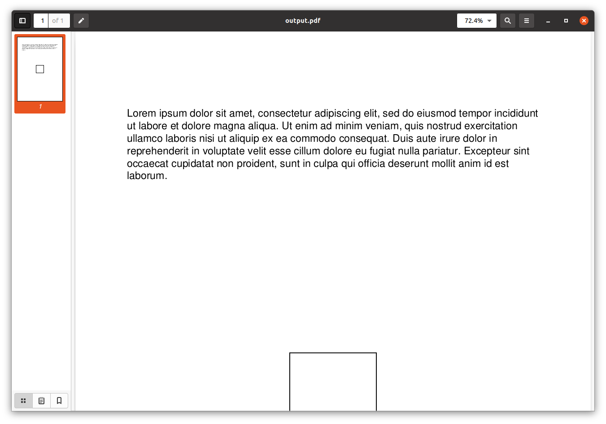

## 6.5 Adding rubber stamp annotations

Rubber stamp annotations bring a bit of that classic paper feeling to digital documents.
A giant "Confidential" on a page just screams "classy".

In the next example, you'll be adding a rubber stamp annotation to a simple "lorem ipsum" document.

```python
#!chapter_006/src/snippet_005.py
from decimal import Decimal

from borb.pdf.canvas.layout.annotation.rubber_stamp_annotation import (
    RubberStampAnnotation,
    RubberStampAnnotationIconType,
)
from borb.pdf.canvas.geometry.rectangle import Rectangle
from borb.pdf.canvas.layout.page_layout.multi_column_layout import SingleColumnLayout
from borb.pdf.canvas.layout.page_layout.page_layout import PageLayout
from borb.pdf.canvas.layout.text.paragraph import Paragraph
from borb.pdf.document.document import Document
from borb.pdf.page.page import Page
from borb.pdf.page.page_size import PageSize
from borb.pdf.pdf import PDF


def main():

    doc: Document = Document()

    page: Page = Page()
    doc.append_page(page)

    layout: PageLayout = SingleColumnLayout(page)

    layout.add(
        Paragraph(
            """
                        Lorem ipsum dolor sit amet, consectetur adipiscing elit, sed do eiusmod tempor incididunt ut labore et dolore magna aliqua. 
                        Ut enim ad minim veniam, quis nostrud exercitation ullamco laboris nisi ut aliquip ex ea commodo consequat. 
                        Duis aute irure dolor in reprehenderit in voluptate velit esse cillum dolore eu fugiat nulla pariatur. 
                        Excepteur sint occaecat cupidatat non proident, sunt in culpa qui officia deserunt mollit anim id est laborum.
                        """
        )
    )

    page_width: Decimal = PageSize.A4_PORTRAIT.value[0]
    page_height: Decimal = PageSize.A4_PORTRAIT.value[1]
    s: Decimal = Decimal(100)
    page.append_stamp_annotation(
        RubberStampAnnotation(
            Rectangle(
                page_width / Decimal(2) - s / Decimal(2),
                page_height / Decimal(2) - s / Decimal(2),
                s,
                s,
            ),
            name=RubberStampAnnotationIconType.CONFIDENTIAL,
        )
    )

    # store
    with open("output.pdf", "wb") as out_file_handle:
        PDF.dumps(out_file_handle, doc)


if __name__ == "__main__":
    main()
```


The different types of rubber stamps are limited (the PDF spec only defines a handful of them);

- `RubberStampAnnotationIconType.APPROVED`
- `RubberStampAnnotationIconType.AS_IS`
- `RubberStampAnnotationIconType.CONFIDENTIAL`
- `RubberStampAnnotationIconType.DRAFT`
- `RubberStampAnnotationIconType.EXPERIMENTAL`
- `RubberStampAnnotationIconType.EXPIRED`
- `RubberStampAnnotationIconType.FINAL`
- `RubberStampAnnotationIconType.FOR_COMMENT`
- `RubberStampAnnotationIconType.FOR_PUBLIC_RELEASE`
- `RubberStampAnnotationIconType.NOT_APPROVED`
- `RubberStampAnnotationIconType.NOT_FOR_PUBLIC_RELEASE`
- `RubberStampAnnotationIconType.SOLD`
- `RubberStampAnnotationIconType.TOP_SECRET`

And the rendering of the stamp is entirely up to the reader software. 
So this example may look entirely different on your device.

<div style="page-break-before: always;"></div>

## 6.6 Adding redaction (annotations)

from the PDF spec:
> A redaction annotation (PDF 1.7) identifies content that is intended to be removed from the document. The
> intent of redaction annotations is to enable the following process:
>
> a) Content identification. A user applies redact annotations that specify the pieces or regions of content that
> should be removed. Up until the next step is performed, the user can see, move and redefine these
> annotations.
>
> b) Content removal. The user instructs the viewer application to apply the redact annotations, after which the
> content in the area specified by the redact annotations is removed. In the removed content’s place, some
> marking appears to indicate the area has been redacted. Also, the redact annotations are removed from
> the PDF document.
>
> Redaction annotations provide a mechanism for the first step in the redaction process (content identification).
> This allows content to be marked for redaction in a non-destructive way, thus enabling a review process for
> evaluating potential redactions prior to removing the specified content.
> Redaction annotations shall provide enough information to be used in the second phase of the redaction
> process (content removal). This phase is application-specific and requires the conforming reader to remove all
> content identified by the redaction annotation, as well as the annotation itself.

### 6.6.1 Adding redaction annotations

In the next example, you'll be adding a redaction annotation. In a subsequent example you'll be using `borb` to apply all redaction annotations (thus removing the content).
Redaction annotations are simply another kind of annotation, so all the methods and tools you've seen so far can of course be used again.

```python
#!chapter_006/src/snippet_006.py
from decimal import Decimal

from borb.pdf.canvas.layout.annotation.redact_annotation import RedactAnnotation
from borb.pdf.canvas.geometry.rectangle import Rectangle
from borb.pdf.canvas.layout.page_layout.multi_column_layout import SingleColumnLayout
from borb.pdf.canvas.layout.page_layout.page_layout import PageLayout
from borb.pdf.canvas.layout.text.paragraph import Paragraph
from borb.pdf.document.document import Document
from borb.pdf.page.page import Page
from borb.pdf.pdf import PDF


def main():

    doc: Document = Document()

    page: Page = Page()
    doc.append_page(page)

    layout: PageLayout = SingleColumnLayout(page)

    layout.add(
        Paragraph(
            """
                        Lorem ipsum dolor sit amet, consectetur adipiscing elit, sed do eiusmod tempor incididunt ut labore et dolore magna aliqua. 
                        Ut enim ad minim veniam, quis nostrud exercitation ullamco laboris nisi ut aliquip ex ea commodo consequat. 
                        Duis aute irure dolor in reprehenderit in voluptate velit esse cillum dolore eu fugiat nulla pariatur. 
                        Excepteur sint occaecat cupidatat non proident, sunt in culpa qui officia deserunt mollit anim id est laborum.
                        """
        )
    )

    page.append_annotation(
        RedactAnnotation(
            Rectangle(Decimal(405), Decimal(721), Decimal(40), Decimal(8)).grow(
                Decimal(2)
            )
        )
    )

    # store
    with open("output.pdf", "wb") as out_file_handle:
        PDF.dumps(out_file_handle, doc)


if __name__ == "__main__":
    main()
```


Of course, rather than passing a `Rectangle`, you can also use some of the logic you've applied in previous examples. 
For instance, you can use `RegularExpressionTextExtraction` to look for a regular expression and then redact it.
This is particularly useful if you're trying to remove structured information such as:

- A bank account number
- A social security number
- A phone number
- An email address
- Etc

`borb` comes with a small library of useful (common) regular expressions.
These can be found in `CommonRegularExpression`;

- `BITCOIN_ADDRESS`
- `CREDIT_CARD`
- `DATE`
- `DOLLAR_PRICE`
- `EMAIL`
- `HEX_COLOR`
- `IPV4`
- `IPV6`
- `PHONE`
- `PHONE_WITH_EXTENSION`
- `PO_BOX`
- `ROMAN_NUMERAL`
- `SOCIAL_SECURITY_NUMBER`
- `STREET_ADDRESS`
- `TIME`
- `URL`
- `ZIP_CODE`

The document you produced should still have the "marked for redaction" - content.
You could (at this point) ask a PDF reader (e.g. "Adobe") to apply the redaction annotations.
Although this feature may not be supported.

### 6.6.2 Applying redaction annotations

In this example you'll be applying the redaction annotations you added to the `Document` earlier.

```python
#!chapter_006/src/snippet_007.py
import typing
from borb.pdf.document.document import Document
from borb.pdf.pdf import PDF


def main():

    doc: typing.Optional[Document] = None
    with open("output.pdf", "rb") as pdf_file_handle:
        doc = PDF.loads(pdf_file_handle)

    # apply redaction annotations
    doc.get_page(0).apply_redact_annotations()

    # store
    with open("output.pdf", "wb") as out_file_handle:
        PDF.dumps(out_file_handle, doc)


if __name__ == "__main__":
    main()
```

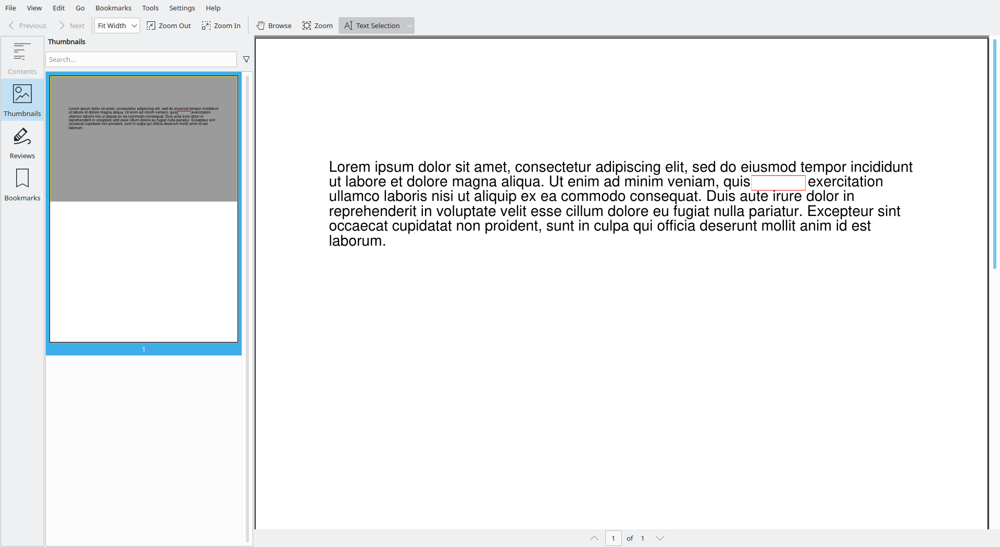

If you now try to select the content in the `Document`, you'll see the text is gone.

<div style="page-break-before: always;"></div>

## 6.7 Adding invisible `JavaScript` buttons

This annotation requires some trickiness. You're going to add a regular `RemoteGoToAnnotation` and modify its `Action` dictionary to have the `Annotation` perform like a click-button.
You're going to add some `JavaScript` to the button's onclick.

```python
#!chapter_006/src/snippet_008.py
import typing
from borb.pdf.document.document import Document
from borb.pdf.pdf import PDF
from borb.pdf.canvas.geometry.rectangle import Rectangle
from borb.pdf.canvas.layout.page_layout.multi_column_layout import SingleColumnLayout
from borb.pdf.canvas.layout.page_layout.page_layout import PageLayout
from borb.pdf.page.page import Page
from borb.pdf.canvas.layout.image.image import Image
from decimal import Decimal
from borb.pdf.canvas.layout.annotation.remote_go_to_annotation import (
    RemoteGoToAnnotation,
)


def main():

    # create document
    pdf = Document()

    # add page
    page = Page()
    pdf.append_page(page)

    # add test information
    layout = SingleColumnLayout(page)

    # add image
    img: Image = Image(
        "https://images.unsplash.com/photo-1614963366795-973eb8748ebb",
        width=Decimal(128),
        height=Decimal(128),
    )
    layout.add(img)

    # create RemoteGoToAnnotation
    annot: RemoteGoToAnnotation = RemoteGoToAnnotation(
        img.get_bounding_box(), uri="https://www.google.com"
    )

    # modify annotation
    annot[Name("A")][Name("S")] = Name("JavaScript")
    annot[Name("A")][Name("JS")] = String("app.alert('Hello World!', 3)")
    page.append_annotation(annot)

    # attempt to store PDF
    with open(self.output_dir / "output.pdf", "wb") as out_file_handle:
        PDF.dumps(out_file_handle, pdf)


if __name__ == "__main__":
    main()
```


## 6.8 Adding sound annotations

Did you know you can add sound to a PDF?
This opens all kinds of options; you could add a text-to-speech rendering of your PDF to the document itself.
Talk about making your PDF accessible!

In this example we're going to add a `SoundAnnotation` to a PDF, which plays some classical music.

```python
#!chapter_006/src/snippet_009.py
import typing
from borb.pdf.document.document import Document
from borb.pdf.pdf import PDF
from borb.pdf.canvas.geometry.rectangle import Rectangle
from borb.pdf.canvas.layout.page_layout.multi_column_layout import SingleColumnLayout
from borb.pdf.canvas.layout.page_layout.page_layout import PageLayout
from borb.pdf.page.page import Page
from borb.pdf.canvas.layout.image.image import Image
from borb.pdf.canvas.layout.annotation.sound_annotation import SoundAnnotation
from decimal import Decimal


def main():

    # create document
    pdf = Document()

    # add page
    page = Page()
    pdf.append_page(page)

    # add test information
    layout = SingleColumnLayout(page)

    # add image
    img: Image = Image(
        "https://images.unsplash.com/photo-1513883049090-d0b7439799bf",
        width=Decimal(128),
        height=Decimal(128),
    )
    layout.add(img)

    # add sound annotation
    page.append_annotation(
        SoundAnnotation(img.get_bounding_box(), "/home/joris/Downloads/audioclip.mp3")
    )

    # attempt to store PDF
    with open(self.output_dir / "output.pdf", "wb") as out_file_handle:
        PDF.dumps(out_file_handle, pdf)


if __name__ == "__main__":
    main()
```

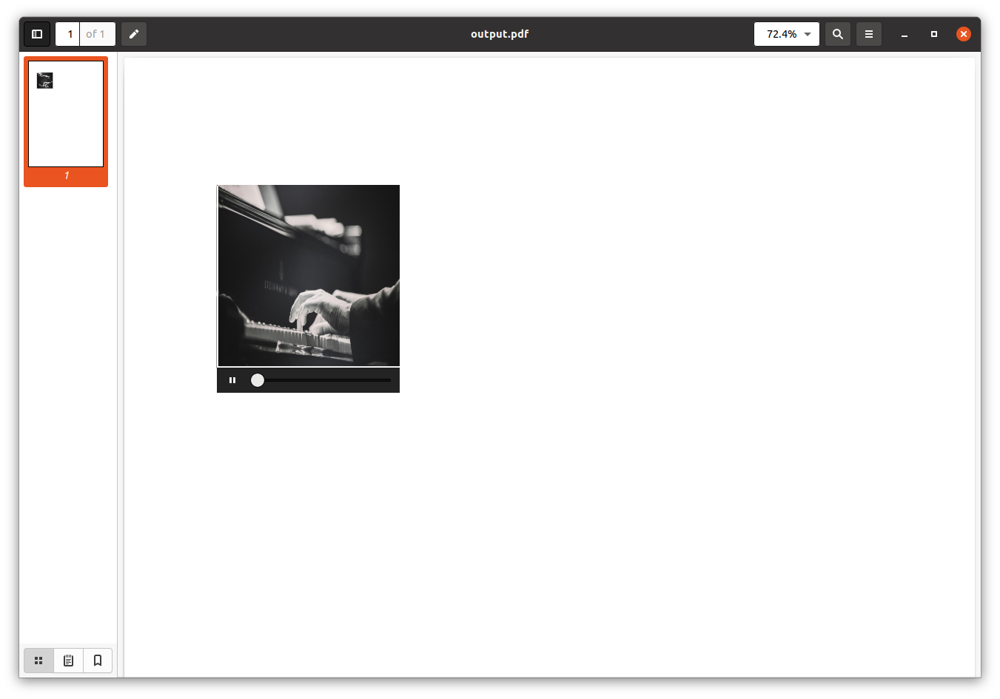

## 6.9 Adding movie annotations


```python
#!chapter_006/src/snippet_010.py
```


## 6.10 Conclusion

In this section you've learned how to work with `Annotation` objects.
These objects allow you to add content to existing PDF documents.

<div style="page-break-before: always;"></div>

# 7 Heuristics for PDF documents

Most of what you've done so far is exact.
There is an exact algorithm for retrieving the bytes of an embedded file.
There are algorithms for retrieving text that have been proven to work (for many years, in many libraries).

This section deals with some of the more "guesswork"-based algorithms for PDF.

One of these (and perhaps the most useful even) is extracting structured content: tables.

In this section you'll learn how to:

- Extract tables from a PDF
- Apply OCR to a PDF (and extracting text from the subsequent `Document`)
- Export a PDF to various image formats
- Export certain formats (HTML, Markdown) to PDF

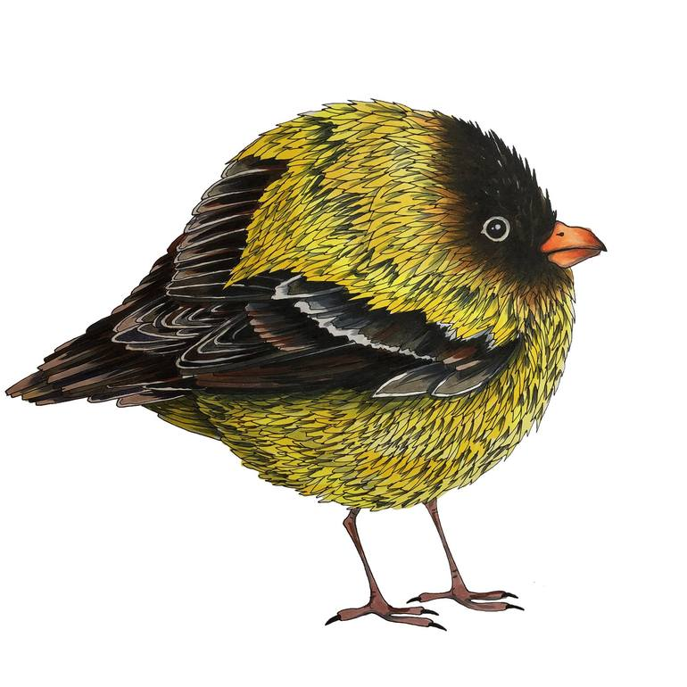

<div style="page-break-before: always;"></div>

## 7.1 Extracting tables from a PDF

For the next example you'll first need to create a `Document` with a `Table`.
In order to provide `borb` with a challenge, let's create a `Table` with:

- `row_span`
- `col_span`
- `font_color`
- `text_alignment`

```python
#!chapter_007/src/snippet_001.py
from decimal import Decimal

import typing
from borb.pdf.canvas.color.color import HexColor, X11Color
from borb.pdf.canvas.layout.layout_element import Alignment
from borb.pdf.canvas.layout.page_layout.multi_column_layout import SingleColumnLayout
from borb.pdf.canvas.layout.page_layout.page_layout import PageLayout
from borb.pdf.canvas.layout.table.table import TableCell
from borb.pdf.canvas.layout.table.flexible_column_width_table import (
    FlexibleColumnWidthTable,
)
from borb.pdf.canvas.layout.table.table import Table
from borb.pdf.canvas.layout.text.paragraph import Paragraph
from borb.pdf.document.document import Document
from borb.pdf.page.page import Page
from borb.pdf.pdf import PDF


def main():

    # create empty Document
    d: Document = Document()

    # add Page
    p: Page = Page()
    d.append_page(p)

    # create PageLayout
    l: PageLayout = SingleColumnLayout(p)

    # create Table
    l.add(
        FlexibleColumnWidthTable(number_of_rows=3, number_of_columns=3)
        .add(
            TableCell(
                Paragraph(
                    "1",
                    font_color=HexColor("f1cd2e"),
                    horizontal_alignment=Alignment.RIGHT,
                ),
                row_span=3,
                preferred_width=Decimal(64),
            )
        )
        .add(TableCell(Paragraph("2")))
        .add(TableCell(Paragraph("3")))
        .add(
            TableCell(
                Paragraph(
                    "4",
                    font_color=HexColor("56cbf9"),
                    horizontal_alignment=Alignment.LEFT,
                ),
                row_span=2,
                preferred_width=Decimal(32),
            )
        )
        .add(TableCell(Paragraph("5")))
        .add(TableCell(Paragraph("6", font_color=HexColor("de6449"))))
        .set_padding_on_all_cells(Decimal(5), Decimal(5), Decimal(5), Decimal(5))
    )

    # store
    with open("output.pdf", "wb") as pdf_file_handle:
        PDF.dumps(pdf_file_handle, d)


if __name__ == "__main__":
    main()
```

This creates a PDF that looks like this:

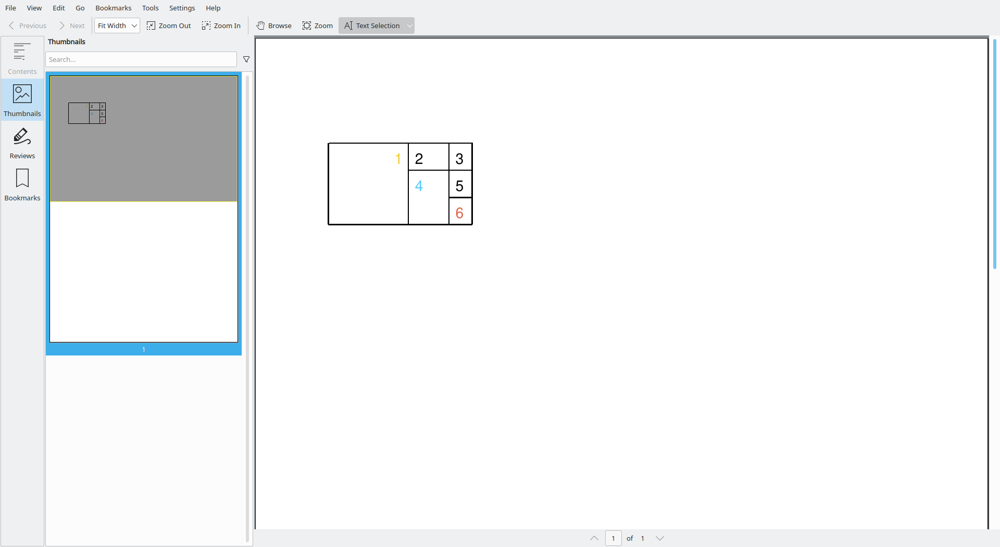

Now you can use the `TableDetectionByLines` implementation of `EventListener` to get the job done.

In this example, you'll be adding rectangular annotations to display the detected `Table` and `TableCell` objects.
This is something I do a lot, adding annotations is a quick and easy way to debug a PDF workflow.

```python
#!chapter_007/src/snippet_002.py
from decimal import Decimal

import typing
from borb.pdf.canvas.color.color import HexColor, X11Color
from borb.pdf.canvas.layout.layout_element import Alignment
from borb.pdf.canvas.layout.page_layout.multi_column_layout import SingleColumnLayout
from borb.pdf.canvas.layout.page_layout.page_layout import PageLayout
from borb.pdf.canvas.layout.table.table import TableCell
from borb.pdf.canvas.layout.table.flexible_column_width_table import (
    FlexibleColumnWidthTable,
)
from borb.pdf.canvas.layout.table.table import Table
from borb.pdf.canvas.layout.text.paragraph import Paragraph
from borb.pdf.document.document import Document
from borb.pdf.page.page import Page
from borb.pdf.pdf import PDF
from borb.toolkit.table.table_detection_by_lines import TableDetectionByLines
from borb.pdf.canvas.layout.annotation.square_annotation import SquareAnnotation


def main():

    doc: typing.Optional[Document] = None
    l: TableDetectionByLines = TableDetectionByLines()
    with open("output.pdf", "rb") as pdf_file_handle:
        doc = PDF.loads(pdf_file_handle, [l])

    assert doc is not None

    # get page
    p: Page = doc.get_page(0)

    # get Table(s)
    tables: typing.List[Table] = l.get_tables_for_page(0)
    assert len(tables) > 0

    for r in l.get_table_bounding_boxes_for_page(0):
        r = r.grow(Decimal(5))
        p.append_annotation(SquareAnnotation(r, stroke_color=X11Color("Green")))

    for t in tables:

        # add one annotation around each cell
        for c in t._content:
            r = c.get_bounding_box()
            r = r.shrink(Decimal(5))
            p.append_annotation(SquareAnnotation(r, stroke_color=X11Color("Red")))

    # write
    with open("output.pdf", "wb") as pdf_file_handle:
        PDF.dumps(pdf_file_handle, doc)


if __name__ == "__main__":
    main()
```

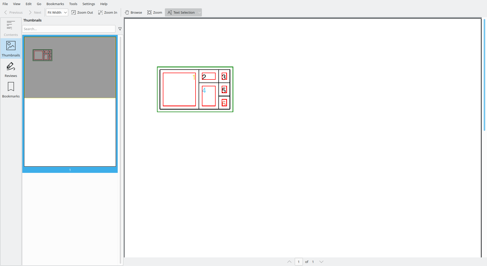

As you can see, `borb` was able to find the `Table` and retrieve its `TableCell` objects.
Now that you have their coordinates, you can easily use some of the earlier examples (filtering text by location for instance) to retrieve the contents of each cell.

<div style="page-break-before: always;"></div>

## 7.2 Performing OCR on a PDF

This is by far one of the most classic questions on any programming-forum, or helpdesk: "My document does not seem to have text in it. Help?" or "Your text-extraction code sample does not work for my document. How come?"

The answer is often as straightforward as "your scanner hates you".

Most of the documents for which this doesn't work are PDF documents that are essentially glorified images.
They contain all the meta-data needed to constitute a PDF, but their pages are just large (often low-quality) images.

As a consequence, there are no text-rendering instructions in these documents. 
And most PDF libraries will not be able to handle them.

`borb` however is different, `borb` just loves to help.

In this section you'll be using a special `EventListener` implementation called `OCRAsOptionalContentGroup`.
This class uses `tesseract` (or rather `pytesseract`) to perform OCR (optical character recognition) on the `Document`.

Once finished, the recognized text is re-inserted in each `Page` as a special "layer" (in PDF this is called an "optional content group").

With the content now restored, the usual tricks (`SimpleTextExtraction`) yield the expected results.


You'll start by creating a method that builds a PIL `Image` with some text in it.
This `Image` will then be inserted in a PDF.

```python
#!chapter_007/src/snippet_003.py
import typing
from pathlib import Path

from borb.pdf.pdf import PDF
from PIL import Image as PILImage  # type: ignore [import]
from PIL import ImageDraw, ImageFont


def create_image() -> PILImage:

    # create new Image
    img = PILImage.new("RGB", (256, 256), color=(255, 255, 255))

    # create ImageFont
    # CAUTION: you may need to adjust the path to your particular font directory
    font = ImageFont.truetype("/usr/share/fonts/truetype/ubuntu/UbuntuMono-B.ttf", 24)

    # draw text
    draw = ImageDraw.Draw(img)
    draw.text((10, 10), "Hello World!", fill=(0, 0, 0), font=font)

    # return
    return img
```

Now you can build a `Document` with this `Image`

```python
#!chapter_007/src/snippet_004.py
import typing
from pathlib import Path

from borb.pdf.canvas.layout.image.image import Image
from borb.pdf.canvas.layout.page_layout.multi_column_layout import SingleColumnLayout
from borb.pdf.canvas.layout.page_layout.page_layout import PageLayout
from borb.pdf.canvas.layout.text.paragraph import Paragraph
from borb.pdf.document.document import Document
from borb.pdf.page.page import Page
from borb.pdf.pdf import PDF
from PIL import Image as PILImage  # type: ignore [import]
from PIL import ImageDraw, ImageFont


def create_image() -> PILImage:

    # create new Image
    img = PILImage.new("RGB", (256, 256), color=(255, 255, 255))

    # create ImageFont
    # CAUTION: you may need to adjust the path to your particular font directory
    font = ImageFont.truetype("/usr/share/fonts/truetype/ubuntu/UbuntuMono-B.ttf", 24)

    # draw text
    draw = ImageDraw.Draw(img)
    draw.text((10, 10), "Hello World!", fill=(0, 0, 0), font=font)

    # return
    return img


def main():

    # create Document
    d: Document = Document()

    # create/add Page
    p: Page = Page()
    d.append_page(p)

    # set PageLayout
    l: PageLayout = SingleColumnLayout(p)

    # add Paragraph
    l.add(Paragraph("Lorem Ipsum"))

    # add Image
    l.add(Image(create_image()))

    # write
    with open("output_001.pdf", "wb") as pdf_file_handle:
        PDF.dumps(pdf_file_handle, d)


if __name__ == "__main__":
    main()
```

The document should look something like this:

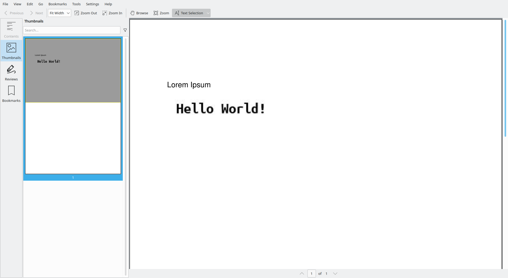

When you select the text in this document, you'll see immediately that only the top line is actually text.
The rest is an `Image` with text (the `Image` you created).

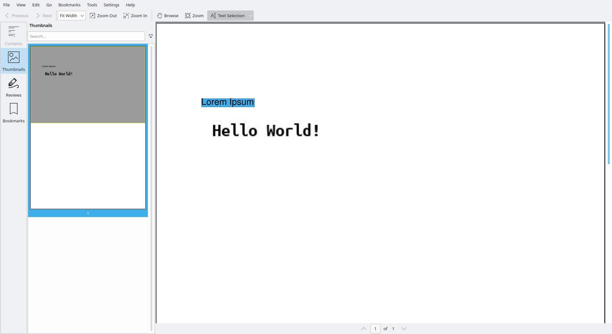

Now you can apply OCR to this `Document`:

```python
#!chapter_007/src/snippet_005.py
def main():

    # set up everything for OCR
    tesseract_data_dir: Path = Path("/home/joris/Downloads/tessdata-master/")
    assert tesseract_data_dir.exists()
    l: OCRAsOptionalContentGroup = OCRAsOptionalContentGroup(tesseract_data_dir)

    # read Document
    doc: typing.Optional[Document] = None
    with open("output_001.pdf", "rb") as pdf_file_handle:
        doc = PDF.loads(pdf_file_handle, [l])

    assert doc is not None

    # store Document
    with open("output_002.pdf", "wb") as pdf_file_handle:
        PDF.dumps(pdf_file_handle, doc)


if __name__ == "__main__":
    main()
```

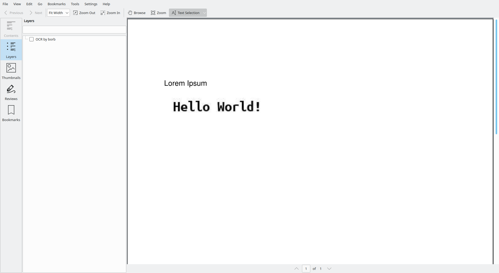

You can see this created an extra layer in the PDF.
This layer is named "OCR by borb", and contains the rendering instructions `borb` re-inserted in the `Document`.

You can toggle the visibility of this layer (this can be handy when debugging).

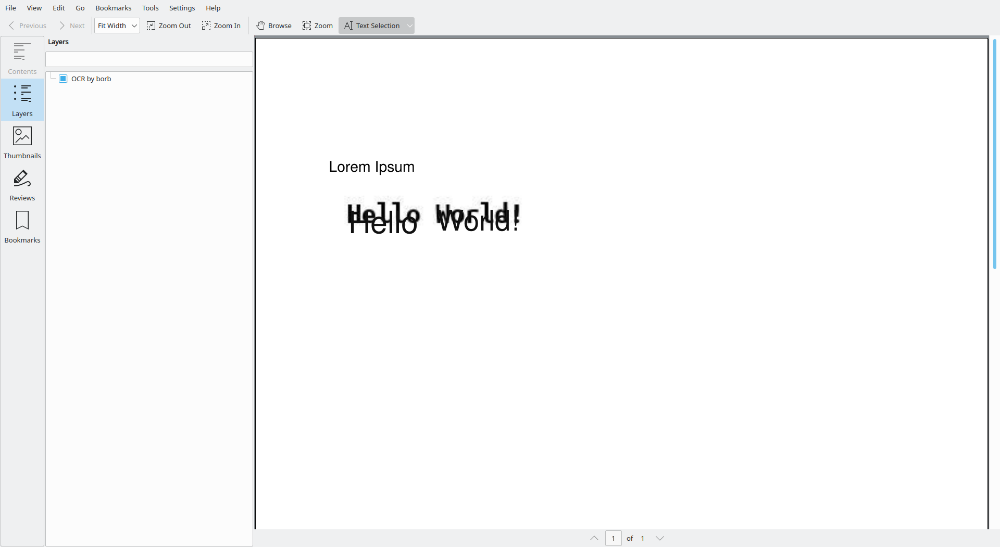

You can see `borb` re-inserted the postscript rendering command to ensure "Hello World!" is in the `Document.
Let's hide this layer again.

Now (even with the layer hidden), you can select the text:

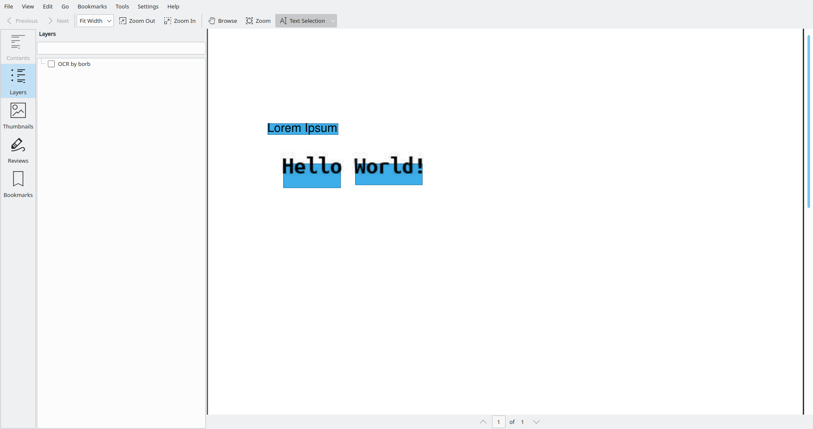

And if you apply `SimpleTextExtraction` now, you should be able to retrieve all the text in the `Document`.

```python
#!chapter_007/src/snippet_006.py
def main():

    doc: typing.Optional[Document] = None
    l: SimpleTextExtraction = SimpleTextExtraction()
    with open("output_002.pdf", "rb") as pdf_file_handle:
        doc = PDF.loads(pdf_file_handle, [l])

    print(l.get_text_for_page(0))


if __name__ == "__main__":
    main()
```

This prints:

```
Lorem Ipsum
Hello World!
```

<div style="page-break-before: always;"></div>

## 7.3 Exporting PDF as a (PIL) image

Let's start by creating a PDF we can later export.
In the next example you'll be creating a PDF with different fonts, font-sizes and an image.

```python
#!chapter_007/src/snippet_007.py
from borb.pdf.document.document import Document
from borb.pdf.page.page import Page
from borb.pdf.canvas.layout.page_layout.multi_column_layout import SingleColumnLayout
from borb.pdf.canvas.layout.page_layout.page_layout import PageLayout
from borb.pdf.canvas.layout.text.paragraph import Paragraph
from borb.pdf.canvas.layout.image.image import Image
from borb.pdf.pdf import PDF

from decimal import Decimal


def main():
    # create Document
    doc: Document = Document()

    # create Page
    page: Page = Page()

    # add Page to Document
    doc.append_page(page)

    # set a PageLayout
    layout: PageLayout = SingleColumnLayout(page)

    # add an Image
    layout.add(
        Image(
            "https://www.gutenberg.org/cache/epub/58866/pg58866.cover.medium.jpg",
            width=Decimal(200),
            height=Decimal(300),
        )
    )

    # add a Paragraph
    layout.add(
        Paragraph("1. A Fellow Traveller", font="Helvetica-bold", font_size=Decimal(20))
    )
    layout.add(
        Paragraph(
            """
    I believe that a well-known anecdote exists to the effect that a young
    writer, determined to make the commencement of his story forcible and
    original enough to catch and rivet the attention of the most blasé of
    editors, penned the following sentence:
    """
        )
    )

    # store
    with open("output.pdf", "wb") as pdf_file_handle:
        PDF.dumps(pdf_file_handle, doc)


if __name__ == "__main__":
    main()
```

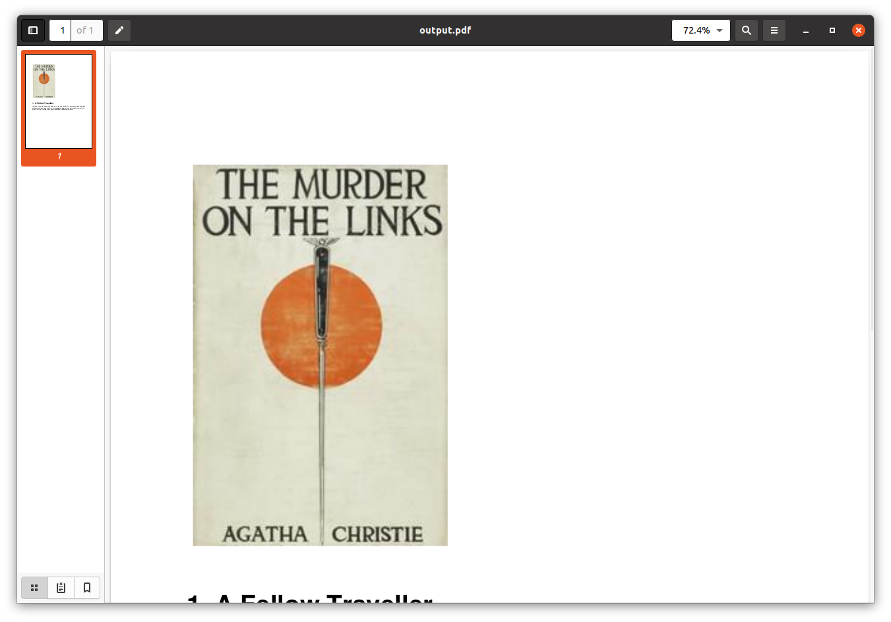

Now let's export this as an Image.

```python
#!chapter_007/src/snippet_008.py
from borb.pdf.pdf import PDF
from borb.toolkit.export.pdf_to_jpg import PDFToJPG

from pathlib import Path


def main():
    input_file: Path = Path(__file__).parent / "output.pdf"
    PDFToJPG.convert_pdf_to_jpg(input_file, 0).save("output_page_00.jpg")


if __name__ == "__main__":
    main()
```


<div style="page-break-before: always;"></div>

## 7.4 Exporting PDF as an SVG image

```python
#!chapter_007/src/snippet_009.py
from borb.pdf.pdf import PDF
from borb.toolkit.export.pdf_to_svg import PDFToSVG

from pathlib import Path


def main():
    input_file: Path = Path(__file__).parent / "output.pdf"
    PDFToSVG.convert_pdf_to_jpg(input_file, 0).save("output_page_00.svg")


if __name__ == "__main__":
    main()
```

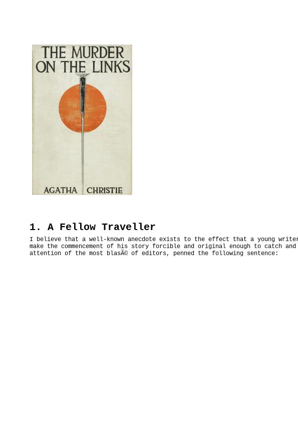


<div style="page-break-before: always;"></div>

## 7.5 Exporting Markdown as PDF

Markdown is a very convenient format (for developers and non-technical people) to provide a quick and legible lightweight formatted document.

You'll be using the following input markdown:

> \# Headings  
> To create a heading, add number signs (#) in front of a word or phrase. The number of number signs you use should correspond to the heading level. For example, to create a heading level three (\<h3\>), use three number signs (e.g., ### My Header).
>  
> \# Heading level 1  
> \#\# Heading level 2  
> \#\#\# Heading level 3  
> \#\#\#\# Heading level 4  
> \#\#\#\#\# Heading level 5  
> \#\#\#\#\#\# Heading level 6  
>
> \#\# Alternate Syntax
> Alternatively, on the line below the text, add any number of == characters for heading level 1 or -- characters for heading level 2.
>
> Heading level 1  
> \===============
>
> Heading level 2  
> \---------------
>
> \#\# Heading Best Practices  
> Markdown applications don’t agree on how to handle a missing space between the number signs (#) and the heading name. For compatibility, always put a space between the number signs and the heading name.
>
> You should also put blank lines before and after a heading for compatibility.

Using `borb`, you can transform Markdown to PDF;

```python
#!chapter_007/src/snippet_010.py
from borb.pdf.document.document import Document
from borb.pdf.pdf import PDF
from borb.toolkit.export.markdown_to_pdf.markdown_to_pdf import MarkdownToPDF


def main():

    # read entire markdown file
    markdown_str: str = ""
    with open("snippet_010.md", "r") as md_file_handle:
        markdown_str = md_file_handle.read()

    # convert
    doc: Document = MarkdownToPDF.convert_markdown_to_pdf(markdown_str)
    assert doc is not None

    # write
    with open("output.pdf", "wb") as pdf_file_handle:
        PDF.dumps(pdf_file_handle, doc)


if __name__ == "__main__":
    main()

if __name__ == "__main__":
    main()
```

This produces the following PDF;

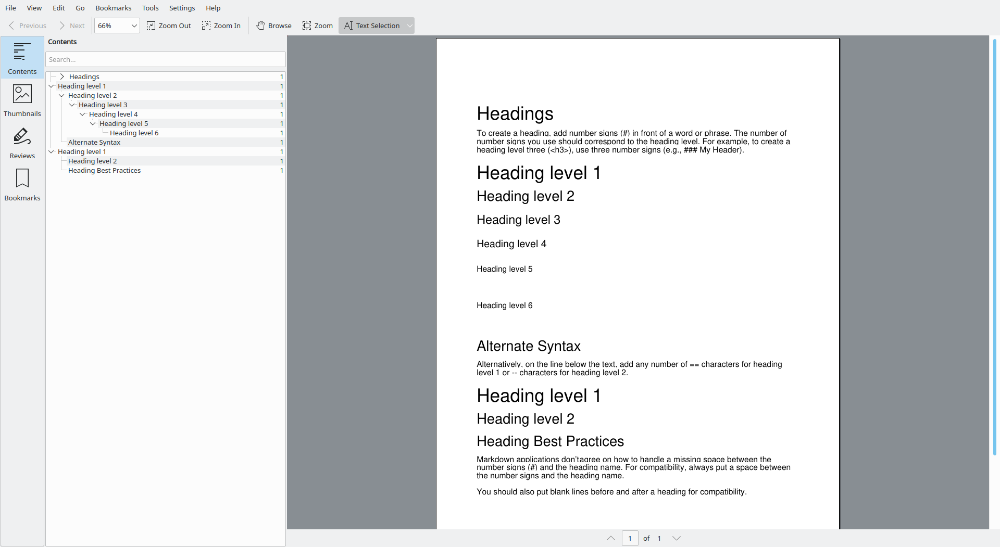

<div style="page-break-before: always;"></div>

## 7.6 Exporting HTML as PDF

Another wonderful format for content is HTML. 
`borb` supports basic HTML to PDF conversion. 
Keep an eye out for this functionality in the future, as new features, tags and support will be added gradually.

For this example, you'll be using the following HTML snippet:

> \<html>  
>   \<head>  
>       \<title>Lorem Ipsum\</title>  
>   \</head>  
>       \<p>  
>            Hello World!  
>       \</p>  
>    \</html>

```python
#!chapter_007/src/snippet_011.py
from borb.pdf.document.document import Document
from borb.pdf.pdf import PDF
from borb.toolkit.export.html_to_pdf.html_to_pdf import HTMLToPDF


def main():

    # read entire markdown file
    html_str: str = ""
    with open("snippet_011.html", "r") as md_file_handle:
        html_str = md_file_handle.read()

    # convert
    doc: Document = HTMLToPDF.convert_html_to_pdf(html_str)
    assert doc is not None

    # write
    with open("output.pdf", "wb") as pdf_file_handle:
        PDF.dumps(pdf_file_handle, doc)


if __name__ == "__main__":
    main()

if __name__ == "__main__":
    main()
```

Which ends up producing the following PDF:

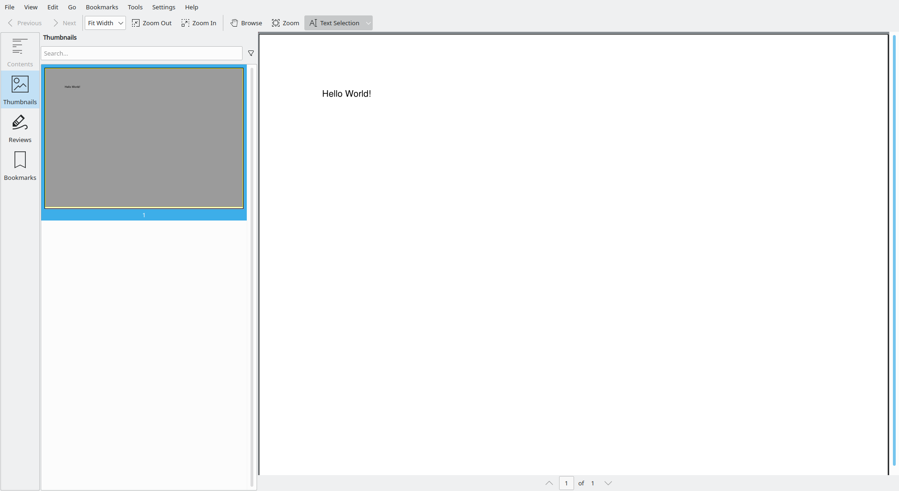

You'll also notice (if you open this PDF in your preferred viewer) that the title of the `Document` was set to `"lorem ipsum"`.
So `borb` also processed the meta-information.

Check out the examples in the GitHub repository and the tests to find out more supported `HTML`.

<div style="page-break-before: always;"></div>

## 7.7 Conclusion

<div style="page-break-before: always;"></div>

# 8 Deep Dive into `borb`


<div style="page-break-before: always;"></div>

## 8.1 About PDF

If we consider PDF as a programming language, then these would be its primitive data-types:

- Strings (either as plaintext, or hexadecimal)
- Numbers
- Booleans
- Name objects (think of these as "reserved strings")

From which the bigger objects are built:

- Dictionaries (maps name objects to any value, delimited by `<<` and `>>`)
- Arrays (delimited by `[` and `]`)
- Streams (these typically represent binary compressed data)
- References

This is an example dictionary object:

```
<<  /Root 1 0 R 
    /Info 2 0 R 
    /Size 18 
    /ID [<02c1677f2c452985480d6a68b2cdfe96> <02c1677f2c452985480d6a68b2cdfe96>]
    >>
```

The keys are name objects:

- `/Root`
- `/Info`
- `Size`
- `ID`

Objects such as `1 0 R` are references. They need to be resolved by the XREF (more on that later).

```
[<02c1677f2c452985480d6a68b2cdfe96> <02c1677f2c452985480d6a68b2cdfe96>]
```

is an array containing two hexadecimal string objects.

## 8.2 The XREF table

The cross-reference table in a PDF is one of many tricks designed to speed up a reader. A cross-reference table (further abbreviated as XREF) contains a mapping of all PDF objects and their byte offset.

A conforming reader will start reading a PDF backwards, reading the `startxref` keyword. 

This is an example XREF:

```
xref
0 18
0000000000 00000 f
0000000015 00000 n
0000381959 00000 n
0000000064 00000 n
0000381716 00000 n
0000000121 00000 n
0000000273 00000 n
0000052510 00000 n
0000052542 00000 n
0000052583 00000 n
0000381619 00000 n
0000052752 00000 n
0000055981 00000 n
0000371339 00000 n
0000056194 00000 n
0000371411 00000 n
0000381788 00000 n
0000381888 00000 n
trailer
<</Root 1 0 R /Info 2 0 R /Size 18 /ID [<02c1677f2c452985480d6a68b2cdfe96> <02c1677f2c452985480d6a68b2cdfe96>]>>
startxref
382063
%%EOF
```

Just after the `startxref` keyword you'll find a number representing the byte offset at which the start of the XREF can be found.

The start of the XREF table is delimited with the `xref` keyword. 
Just after it you'll find two numbers (`0 18`). This means the first object of the PDF starts at number 0, and this XREF table contains 18 objects. 

Each is responsible for a line like:

```
0000000273 00000 n
```

This is the 7th line of the XREF, so this line relates to object number 7. It says object 7 can be found at byte offset `0000000273`.
The second number on that line represents the `generation`. 
PDF allows you to revise a document. 
So each object has a generation to signify whether it belongs to a particular revision of the PDF.

The last part of each line is `n` or `f`. `n` means the object is currently is use. Objects marked with `f` should be considered as non-content.

The XREF also contains the trailer dictionary. This dictionary is the starting point of the PDF object tree.

```
<</Root 1 0 R /Info 2 0 R /Size 18 /ID [<02c1677f2c452985480d6a68b2cdfe96> <02c1677f2c452985480d6a68b2cdfe96>]>>
```

- `/Root` is where the actual content objects of the PDF begin. In this trailer, the `/Root` entry points to object `1 (generation 0)`.
- `/Info` points to the info-dictionary, which is where you'll find the meta-data such as author, producer, modification date, etc. In this trailer, the `/Info` entry points to object `2 (generation 0)`.

If you follow the `/Root` entry, you'll find something like:

```
1 0 obj
<</Type /Catalog /Pages 3 0 R /Outlines 4 0 R>>
endobj
``` 

The `/Pages` entry points to an array (one element per page), which form the beginning of the page-content.

```
3 0 obj
<</Count 1 /Kids [5 0 R] /Type /Pages>>
endobj
```

Each entry in the `/Kids` array represents a single `Page`.

```
5 0 obj
<</Type /Page /MediaBox [0 0 595 842] /Parent 3 0 R /Contents 6 0 R /Resources 7 0 R>>
endobj
```

`/Contents` points to the `Page` content stream. This is a string of postfix instructions (usually compressed using `deflate`).

## 8.3 Page content streams

In the previous section you explored the top-level objects of a PDF.
You got all the way down to the `Page` object.
Now you can look under the hood and see the instructions in the content stream.

```
6 0 obj
<</Length 52185>>
stream

            q
            BT
            0.521569 0.780392 0.870588 rg
            /F1 1.000000 Tf
            24.000000 0 0 24.000000 59.500000 725.760000 Tm
            (Hello World!) Tj
            ET
            Q 

            q
            ... etc ...
```

This is the (inflated) page content stream. It contains the raw instructions for rendering content on the `Page`.
Operators are prefix operators, meaning the arguments come before the operator.

- `q` : pushes a new graphics environment on the stack
- `BT` : begin text
- `0.521569 0.780392 0.870588 rg` : set the color (using RGB color mode)
- `/F1 1.000000 Tf` : use the font specified in `/Resources/Font/F1`, at size `1`
- `24.000000 0 0 24.000000 59.500000 725.760000 Tm` : sets the font-transformation matrix (essentially setting the font size to 24, and setting the text position)
- `(Hello World!) Tj` : render the text "Hello World!"
- `ET` : end text
- `Q` : pop the last element from the graphics environment stack

<div style="page-break-before: always;"></div>

## 8.4 Postscript syntax

This section provides you with a quick overview of the most common PDF operators.
This is meant to enable you to debug PDF documents.

For a more detailed explanation I would advise you to check out the PDF-specification.
A free copy of which can be found:

- In the `borb` GitHub repository
- On the Adobe website

| Operator | Number of arguments | Type of arguments | Description                                                                                                                                                                                                                                                                                                                                                                                                   |
|----------|---------------------|-------------------|---------------------------------------------------------------------------------------------------------------------------------------------------------------------------------------------------------------------------------------------------------------------------------------------------------------------------------------------------------------------------------------------------------------|
| b | 0                   |                   | Close, fill, and stroke path using nonzero winding number rule                                                                                                                                                                                                                                                                                                                                                |
| B | 0                   |                   | Fill and then stroke the path, using the nonzero winding number rule to determine the region to fill.                                                                                                                                                                                                                                                                                                         |
| b* | 0                   |                   | Close, fill, and then stroke the path, using the even-odd rule to determine the region to fill.                                                                                                                                                                                                                                                                                                               |
| B* | 0                   |                   | Fill and then stroke the path, using the even-odd rule to determine the region to fill.                                                                                                                                                                                                                                                                                                                       |
| BDC | 2                   |                   | Begin a marked-content sequence with an associated property list, terminated by a balancing EMC operator. tag shall be a name object indicating the role or significance of the sequence. properties shall be either an inline dictionary containing the property list or a name object associated with it in the Properties subdictionary of the current resource dictionary (see 14.6.2, “Property Lists”). |
| BI | 0                   |                   | Begin an inline image object.                                                                                                                                                                                                                                                                                                                                                                                 |
| BMC | 1                   |                   | Begin a marked-content sequence terminated by a balancing **EMC** operator. tag shall be a name object indicating the role or significance of the sequence.                                                                                                                                                                                                                                                   |
| BT |
| BX |
| c |
| cm |
| CS |
| cs |
| d |
| d0 |
| d1 |
| Do |
| DP | 2                   |                   | Designate a marked-content point with an associated property list. tag shall be a name object indicating the role or significance of the point. properties shall be either an inline dictionary containing the property list or a name object associated with it in the Properties subdictionary of the current resource dictionary (see 14.6.2, “Property Lists”).                                           |
| EI | 0                   |                   | End an inline image object.                                                                                                                                                                                                                                                                                                                                                                                   |
| EMC | 0                   |                   | End a marked-content sequence begun by a **BMC** or **BDC** operator.                                                                                                                                                                                                                                                                                                                                         |
| ET |
| EX |
| f | 0                   |                   | Fill the path, using the nonzero winding number rule to determine the region to fill (see 8.5.3.3.2, "Nonzero Winding Number Rule"). Any subpaths that are open shall be implicitly closed before being filled.                                                                                                                                                                                               |
| F | 0                   |                   | Equivalent to **f**; included only for compatibility. Although PDF reader applications shall be able to accept this operator, PDF writer applications should use **f** instead.                                                                                                                                                                                                                               |
| f* | 0                   |                   | Fill the path, using the even-odd rule to determine the region to fill (see 8.5.3.3.3, "Even-Odd Rule").                                                                                                                                                                                                                                                                                                      |
| G |
| g |
| gs |
| h |
| i |
| ID | 0                   |                   | Begin the image data for an inline image object.                                                                                                                                                                                                                                                                                                                                                              |
| j |
| J |
| K |
| k |
| l | 2                   |                   | Append a straight line segment from the current point to the point (x, y). The new current point shall be (x, y).                                                                                                                                                                                                                                                                                             |
| m | 2                   |                   | Begin a new subpath by moving the current point to coordinates (x, y), omitting any connecting line segment. If the previous path construction operator in the current path was also m, the new m overrides it; no vestige of the previous m operation remains in the path.                                                                                                                                   |
| M |
| MP | 1                   |                   | Designate a marked-content point. tag shall be a name object indicating the role or significance of the point.                                                                                                                                                                                                                                                                                                |
| n | 0                   |                   | End the path object without filling or stroking it. This operator shall be a path-painting no-op, used primarily for the side effect of changing the current clipping path (see 8.5.4, "Clipping Path Operators").                                                                                                                                                                                            |
| q |
| Q |
| re |
| RG |
| rg |
| ri |
| s | 0                   |                   | Close and stroke the path.                                                                                                                                                                                                                                                                                                                                                                                    |
| S | 0                   |                   | Stroke the path.                                                                                                                                                                                                                                                                                                                                                                                              |
| SC |
| sc |
| SCN |
| scn |
| sh |
| T* |
| Tc |
| Td |
| TD |
| Tf |
| Tj |
| TJ |
| TL |
| Tm |
| Tr |
| Ts |
| Tw |
| Tz |
| v |
| w |
| W |
| W* |
| y |
| ' |
| " |

<div style="page-break-before: always;"></div>

## 8.5 Creating a `Document` using low-level syntax

In this subsection I'll take you through all of the relevant pieces of `borb` when rendering a small piece of text to a PDF.
This is a bit like having someone sit next to you, explaining the code while you're stepping through it with a debugger.
I hope this subsection teaches you some of the internal workings of `borb` and helps you gain a better understanding of where to look should you encounter any problems.

Now that you have some knowledge of the low-level syntax of PDF, you can try to build a PDF document.
In this example, you're going to create a PDF with the text "Hello World!".
This time, you'll be using only the low-level syntax. Later, you'll see how the `LayoutElement` objects end up writing this content to the PDF.

Although this is not very practical it will do several things:

- Give you a deeper appreciation for PDF libraries
- Grant you to power to specify the document exactly as you want, now that you understand PDF at its finest
- Enable you to write your own `LayoutElement` implementations (if needed) 

In this example, you'll be creating a PDF from scratch, containing "Hello World!", using only the low-level syntax.

<div style="page-break-before: always;"></div>

## 8.6 Fonts in PDF

A font shall be represented in PDF as a dictionary specifying the type of font, its PostScript name, its encoding,
and information that can be used to provide a substitute when the font program is not available. Optionally, the
font program may be embedded as a stream object in the PDF file.

### 8.6.1 Simple fonts

There are several types of simple fonts, all of which have these properties:
- Glyphs in the font shall be selected by single-byte character codes obtained from a string that is shown by
the text-showing operators. Logically, these codes index into a table of 256 glyphs; the mapping from
codes to glyphs is called the font’s encoding. Under some circumstances, the encoding may be altered by
means described in 9.6.6, "Character Encoding".
- Each glyph shall have a single set of metrics, including a horizontal displacement or width, as described in
9.2.4, "Glyph Positioning and Metrics"; that is, simple fonts support only horizontal writing mode.
- Except for Type 0 fonts, Type 3 fonts in non-Tagged PDF documents, and certain standard Type 1 fonts,
every font dictionary shall contain a subsidiary dictionary, the font descriptor, containing font-wide metrics
and other attributes of the font; see 9.8, "Font Descriptors". Among those attributes is an optional font file
stream containing the font program.

### 8.6.2 Composite fonts

A composite font, also called a Type 0 font, is one whose glyphs are obtained from a fontlike object called a
CIDFont. A composite font shall be represented by a font dictionary whose Subtype value is Type0. The Type
0 font is known as the root font, and its associated CIDFont is called its descendant.

**NOTE 1:**
Composite fonts in PDF are analogous to composite fonts in PostScript but with some limitations. In particular,
PDF requires that the character encoding be defined by a CMap, which is only one of several encoding
methods available in PostScript. Also, PostScript allows a Type 0 font to have multiple descendants, which
might also be Type 0 fonts. PDF supports only a single descendant, which shall be a CIDFont.

When the current font is composite, the text-showing operators shall behave differently than with simple fonts.
For simple fonts, each byte of a string to be shown selects one glyph, whereas for composite fonts, a sequence
of one or more bytes are decoded to select a glyph from the descendant CIDFont.

**NOTE 2:**
This facility supports the use of very large character sets, such as those for the Chinese, Japanese, and
Korean languages. It also simplifies the organization of fonts that have complex encoding requirements.

<div style="page-break-before: always;"></div>

## 8.7 About structured vs. unstructured document formats

Typically, at one point or another when you're working with PDF, someone will come along that would like to convert the PDF to some other format.
Most libraries or software-tools offer all kinds of wacky conversions. Some more successful than others.
The reason for the varying degrees of success is not just to do with the diligence of the creator, but rather the chasm between structured and unstructured document formats;

- structured document format: every piece of content is typically provided with
    - coordinates (or coordinates can be derived using a layout algorithm)
    - a logical structure
  In `HTML` for instance, a `<p>` element is rendered on a browser (it has coordinates), and all the text inside that element knows it is part of that paragraph. The paragraph itself may be part of some other element (a `<table>` or `<li>`, etc).
- unstructured document format: no logical structure (or no such structure is mandatory)

PDF is an unstructured format.   
You've explored the rendering instructions that make up a `Page`, and you will have noticed there is no indicator to say "all these instructions belong to one paragraph", or "this paragraph belongs to a table".
You can of course do this (the PDF standard provides so called "tagged" PDF), but is rare to see such PDFs in the wild.

So, when extracting text from a PDF `borb` is faced with several issues:

- text rendering instructions do not make it clear where a paragraph begins/ends
- the `space` character can either be encoded in the rendering instructions, but it can also be omitted (you can simply move the drawing cursor a few dots to the right)
- text rendering instructions do not need to appear in any particular order

In order to be able to extract text, `borb` has to do a lot of work. Let's have a look behind the scenes to see what goes on.

### 8.7.1 Text extraction: using heuristics to bridge the gap

In `borb`, the easiest way of accessing the text on a page is by using `SimpleTextExtraction`.
Let's have a look at how it works.

First, there is `ChunkOfTextRenderEvent`:

```python
class ChunkOfTextRenderEvent(Event, ChunkOfText):
    """
    This implementation of Event is triggered right after the Canvas has processed a text-rendering instruction
    """

    def __init__(self, graphics_state: CanvasGraphicsState, raw_bytes: String):
        ... etc ...
```

This class represents the call-back information that is passed to `EventListener` objects.
Whenever `borb` processes the page content-stream, every operator has the opportunity to send out these `Event` objects to `EventListener` implementations.     

This is the `ShowText` operator (the `Tj` operator in postscript);

```python
class ShowText(CanvasOperator):
    """
    Show a text string.
    """

    def __init__(self):
        super().__init__("Tj", 1)

    def invoke(self, canvas_stream_processor: "CanvasStreamProcessor", operands: List[AnyPDFType] = []) -> None:  # type: ignore [name-defined]
        """
        Invoke the Tj operator
        """
        ... etc ...

```

In its `invoke` method, you'll find the call that sends out one of these `ChunkOfTextRenderEvent` objects:

```python
        tri = ChunkOfTextRenderEvent(canvas.graphics_state, operands[0])

        # render
        canvas._event_occurred(tri)
```

So now we know which information is being passed, and when. Let's have a look at `SimpleTextExtraction` to see how that information is processed;

```python
    def _event_occurred(self, event: Event) -> None:
        if isinstance(event, ChunkOfTextRenderEvent):
            self._render_text(event)
        if isinstance(event, BeginPageEvent):
            self._begin_page(event.get_page())
        if isinstance(event, EndPageEvent):
            self._end_page(event.get_page())
```

All implementations of `EventListener` have this `_event_occurred` method, which passes the `Event` objects it receives.
You can see `SimpleTextExtraction` only cares about the start and end of a `Page` and `ChunkOfTextRenderEvent`.

Of course, the instructions for rendering text may not be in (reading) order. So they need to be stored (until the end of a `Page`) before they can be sorted.

```python
    def _render_text(self, text_render_info: ChunkOfTextRenderEvent):

        # init if needed
        if self._current_page not in self._text_render_info_per_page:
            self._text_render_info_per_page[self._current_page] = []

        # append TextRenderInfo
        self._text_render_info_per_page[self._current_page].append(text_render_info)
```

Once the end of a `Page` is reached, the list is sorted (and any instructions that do not render text are thrown out):

```python
    def _end_page(self, page: Page):

        # get TextRenderInfo objects on page
        tris = (
            self._text_render_info_per_page[self._current_page]
            if self._current_page in self._text_render_info_per_page
            else []
        )

        # remove no-op
        tris = [x for x in tris if x._text is not None]
        tris = [x for x in tris if len(x._text.replace(" ", "")) != 0]

        # skip empty
        if len(tris) == 0:
            return

        # sort according to comparator
        sorted(tris, key=cmp_to_key(LeftToRightComparator.cmp))
```

The comparator being used sorts the `ChunkOfTextRenderEvent` objects in the expected (western) paradigm of top-to-bottom, left-to-right.

Then we need to loop over these objects and insert the `space` and `newline` character and when needed;

```python

        # iterate over the TextRenderInfo objects to get the text
        last_baseline_bottom = tris[0].get_baseline().y
        last_baseline_right = tris[0].get_baseline().x
        text = ""
        for t in tris:

            # add newline if needed
            if abs(t.get_baseline().y - last_baseline_bottom) > 10 and len(text) > 0:
                if text.endswith(" "):
                    text = text[0:-1]
                text += "\n"
                text += t._text
                last_baseline_right = t.get_baseline().x + t.get_baseline().width
                last_baseline_bottom = t.get_baseline().y
                continue

            # check text
            if t._text.startswith(" ") or text.endswith(" "):
                text += t._text
                last_baseline_right = t.get_baseline().x + t.get_baseline().width
                continue

            # add space if needed
            delta = abs(last_baseline_right - t.get_baseline().x)
            space_width = round(t.get_space_character_width_estimate_in_user_space(), 1)
            text += " " if (space_width * Decimal(0.90) < delta) else ""

            # normal append
            text += t._text
            last_baseline_right = t.get_baseline().x + t.get_baseline().width
            continue

```

finally, `SimpleTextExtraction` stores the reconstituted text (to ensure fast lookup);

```python
        # store text
        self._text_per_page[self._current_page] = text
```

### 8.7.2 Paragraph extraction and disjoint set

:mega: todo :mega:

<div style="page-break-before: always;"></div>

## 8.8 Hyphenation

from wikipedia.org
> Syllabification (/sɪˌlæbɪfɪˈkeɪʃən/) or syllabication (/sɪˌlæbɪˈkeɪʃən/), also known as hyphenation, is the separation of a word into syllables, whether spoken, written or signed.
>
> The written separation into syllables is usually marked by a hyphen when using English orthography (e.g., syl-la-ble) and with a period when transcribing the actually spoken syllables in the International Phonetic Alphabet (IPA) (e.g., [ˈsɪ.lə.bᵊɫ]).
> 
> For presentation purposes, typographers may use an interpunct (Unicode character U+00B7, e.g., syl·la·ble), a special-purpose "hyphenation point" (U+2027, e.g., syl‧la‧ble), or a space (e.g., syl la ble).

At the end of a line, a word is separated in writing into parts, conventionally called "syllables", if it does not fit the line and if moving it to the next line would make the first line much shorter than the others. This can be a particular problem with very long words, and with narrow columns in newspapers.

### 5.8.1 The hyphenation problem

from wikipedia.org
> A hyphenation algorithm is a set of rules, especially one codified for implementation in a computer program, that decides at which points a word can be broken over two lines with a hyphen. For example, a hyphenation algorithm might decide that impeachment can be broken as impeach-ment or im-peachment but not impe-achment.
>
> One of the reasons for the complexity of the rules of word-breaking is that different "dialects" of English tend to differ on hyphenation[citation needed]: American English tends to work on sound, but British English tends to look to the origins of the word and then to sound. There are also a large number of exceptions, which further complicates matters.

And that's not even mentioning hyphenation in other languages.

### 8.8.2 A fast and scalable hyphenation algorithm

`borb` hyphenates text (on a `Paragraph`) if you pass it a `Hyphenation` object.
This object represents an instantiation of the aforementioned hyphenation algorithm.

The hyphenation algorithm is based on the [work of Franklin mark Liang](https://www.tug.org/docs/liang/liang-thesis.pdf), and works roughly as follows:

```
0.  input: the word 'w' to be hyphenated
1.  iterate over all possible split-positions (i) in the word w:
2.      prefix = w[0:i]
3.      suffix = w[i:]
4.      iterate over all possible suffixes of the prefix, and prefixes of the suffix:
5.          if a rule prefix-number-suffix matches:
6.              update that split position if the number is higher
7.  iterate over all split-positions (i) in the word w:
8.      if the value of the split-position is ODD:
9.          a hyphen is allowed at this position
```

The rules in aforementioned algorithm are language dependent, and are typically several thousands of rules poured into one file (e.g. `JSON`) which is loaded into a special datastructure (trie) which is optimized for this kind of lookup. 

As an example, let's look at the word "birmingham".

| b | . | i | . | r | . | m | . | i | . | n | . | g | . | h | . | a | . | m |
|---|---|---|---|---|---|---|---|---|---|---|---|---|---|---|---|---|---|---|
| b |   | i |   | r | 4 |   |   |   |   |   |   |   |   |   |   |   |   |   |
|   |   |   |   | r |   | m | 3 |   |   |   |   |   |   |   |   |   |   |   |
|   |   |   |   |   |   |   |   |   | 4 | n |   | g |   |   |   |   |   |   |
|   |   |   |   |   |   |   |   |   |   |   | 2 | g | h |   |   |   |   |   |
|   |   |   |   |   |   |   |   | i |   | n |   | g | 5 | h |   | a |   |   |
|   |   |   |   |   |   |   |   |   |   | n |   | g |   | h | 4 |   |   |   |
|   |   |   |   |   |   |   |   |   |   |   |   |   |   | h |   | a | 2 |   |
|   | 0 |   | 0 |   | 4 |   | 3 |   | 4 |   | 2 |   | 5 |   | 4 |   | 2 |   |

After having run this algorithm, we know that "Birmingham" can be hyphenated as "Birm-ing-ham", 
since those positions yield an odd max value.

This algorithm is rather labour-intensive, so rather than running it on every word (and inserting soft-hyphens for instance),
the algorithm is only run when needed.

Whenever the `Paragraph` is performing layout, it will do the following:

```
1. Split the text into words (call this ws)
2. keep track of all lines of text that make up the paragraph, call this lines_of_text
3. for each word (w) in ws:
4.      last_line_of_text = lines_of_text[-1] + <space> + w
5.      calculate the dimensions of last_line_of_text (r)
6.      if r would fall outside the bounding box given to the paragraph:
7.          if hyphenation is enabled for this paragraph:
8.              attempt to split w
9.              if prefix of w + "-" fits:
10.                 hyphenate the word there, switch to the next line, next line starts with suffix of w
11.             else:
12.                 switch to next line, next line start with w
13.         else:
14.             switch to next line, next line starts with w 
```

This ensures hyphenation is only called when needed (rather than on every word in the sentence).

### 8.8.3 Using hyphenation in `borb`

In the next example you'll be creating a `Document` with two `Paragraph` instances.
One `Paragraph` will have hyphenation enabled, the other will not.

```python
from decimal import Decimal

from borb.pdf.canvas.layout.hyphenation.hyphenation import Hyphenation
from borb.pdf.canvas.layout.page_layout.multi_column_layout import SingleColumnLayout
from borb.pdf.canvas.layout.page_layout.page_layout import PageLayout
from borb.pdf.canvas.layout.text.paragraph import Paragraph
from borb.pdf.document.document import Document
from borb.pdf.page.page import Page
from borb.pdf.pdf import PDF


def main():

    # Document
    d: Document = Document()

    # Page
    p: Page = Page()
    d.append_page(p)

    # PageLayout
    l: PageLayout = SingleColumnLayout(p)

    # Paragraph 1
    l.add(Paragraph("Without hyphenation", font="Helvetica-bold", font_size=Decimal(20)))
    l.add(Paragraph("""
                    Lorem Ipsum is simply dummy text of the printing and typesetting industry. 
                    Lorem Ipsum has been the industry's standard dummy text ever since the 1500s, 
                    when an unknown printer took a galley of type and scrambled it to make a type specimen book. 
                    It has survived not only five centuries, but also the leap into electronic typesetting, remaining essentially unchanged. 
                    It was popularised in the 1960s with the release of Letraset sheets containing Lorem Ipsum passages, 
                    and more recently with desktop publishing software like Aldus PageMaker including versions of Lorem Ipsum.    
                    """))

    # Paragraph 2
    l.add(Paragraph("With en-us hyphenation", font="Helvetica-bold", font_size=Decimal(20)))
    l.add(Paragraph("""
                    Lorem Ipsum is simply dummy text of the printing and typesetting industry. 
                    Lorem Ipsum has been the industry's standard dummy text ever since the 1500s, 
                    when an unknown printer took a galley of type and scrambled it to make a type specimen book. 
                    It has survived not only five centuries, but also the leap into electronic typesetting, remaining essentially unchanged. 
                    It was popularised in the 1960s with the release of Letraset sheets containing Lorem Ipsum passages, 
                    and more recently with desktop publishing software like Aldus PageMaker including versions of Lorem Ipsum.    
                    """, hyphenation=Hyphenation("en-us")))

    # write
    with open("output.pdf", "wb") as pdf_file_handle:
        PDF.dumps(pdf_file_handle, d)


if __name__ == "__main__":
    main()

```

In the final PDF you can see the word "survived" was hyphenated as well as the word "essentially".


<div style="page-break-before: always;"></div>


# 9 Showcases

In this chapter we'll build some practical PDF documents that are ready-to-use.
This chapter assumes you have a good working knowledge of all the basic `LayoutElement`  concepts.

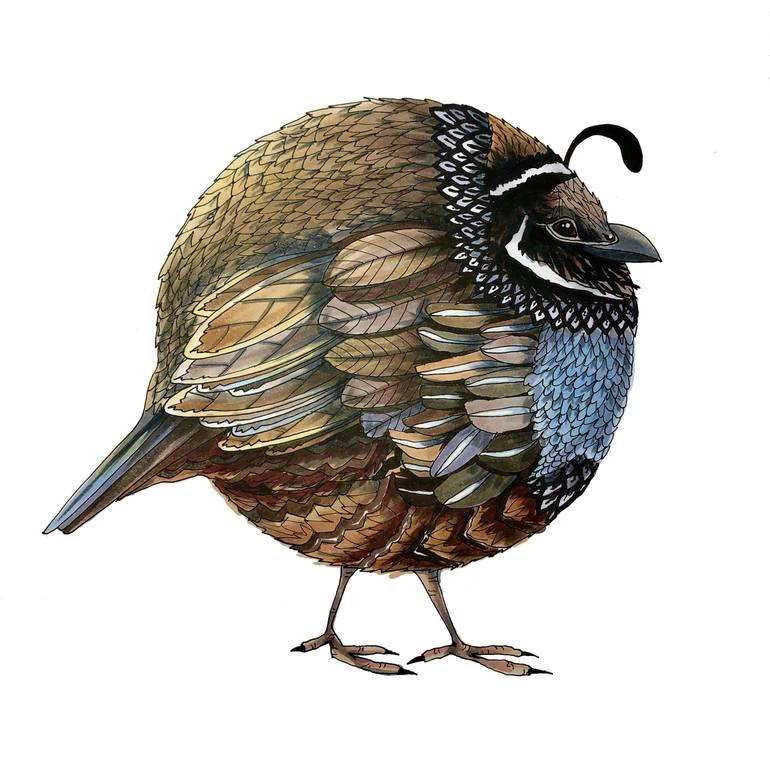

<div style="page-break-before: always;"></div>

## 9.1 Building a sudoku puzzle

First let's define the representation of the sudoku.
This code does not need to be very high-performant, or solve a sudoku.
So for this example, representing a sudoku as a `str` will do fine.

```python
#!chapter_009/src/snippet_001.py
# represent the sudoku as a plaintext str
# every . represents an empty cell in the puzzle
# this is easier to debug/change
sudoku_str: str = """
 .  6  . | 8  .  3 | .  7  . 
 .  .  1 | .  .  . | .  6  9 
 7  .  . | .  .  . | .  .  5 
---------+---------+--------
 .  .  . | 9  .  . | .  1  . 
 .  .  . | .  .  . | .  .  4 
 .  .  5 | .  1  . | .  .  . 
---------+---------+--------
 5  4  . | .  8  . | .  .  7 
 .  .  . | 5  7  . | .  .  8 
 .  9  7 | 3  .  . | .  .  . 
"""

# process sudoku_str to remove everything that is not a number or dot
for c in "\t\n|+- ":
    sudoku_str = sudoku_str.replace(c, "")
```

Next we're going to build a `Document` containing the basic information.

```python
#!chapter_009/src/snippet_002.py
from borb.pdf.document.document import Document
from borb.pdf.page.page import Page
from borb.pdf.pdf import PDF
from borb.pdf.canvas.layout.page_layout.multi_column_layout import SingleColumnLayout
from borb.pdf.canvas.layout.page_layout.page_layout import PageLayout
from borb.pdf.canvas.layout.text.paragraph import Paragraph
from borb.pdf.canvas.color.color import HexColor

from decimal import Decimal

# represent the sudoku as a plaintext str
# every . represents an empty cell in the puzzle
# this is easier to debug/change
sudoku_str: str = """
 .  6  . | 8  .  3 | .  7  . 
 .  .  1 | .  .  . | .  6  9 
 7  .  . | .  .  . | .  .  5 
---------+---------+--------
 .  .  . | 9  .  . | .  1  . 
 .  .  . | .  .  . | .  .  4 
 .  .  5 | .  1  . | .  .  . 
---------+---------+--------
 5  4  . | .  8  . | .  .  7 
 .  .  . | 5  7  . | .  .  8 
 .  9  7 | 3  .  . | .  .  . 
"""

# process sudoku_str to remove everything that is not a number or dot
for c in "\t\n|+- ":
    sudoku_str = sudoku_str.replace(c, "")


def main():

    # define theme color
    theme_color: Color = HexColor("f1cd2e")

    # create new Document
    doc: Document = Document()

    # create new Page
    page: Page = Page()
    doc.append_page(page)

    # set PageLayout
    layout: PageLayout = SingleColumnLayout(page)

    # add title to the Document
    layout.add(
        Paragraph("Sudoku Puzzle", font_color=theme_color, font_size=Decimal(20))
    )

    # add the explanation of how to solve a sudoku
    layout.add(
        Paragraph(
            """
                    Sudoku is a logic-based, combinatorial number-placement puzzle. 
                    In classic sudoku, the objective is to fill a 9×9 grid with digits so that each column, each row, 
                    and each of the nine 3×3 subgrids that compose the grid contains all of the digits from 1 to 9. 
                    The puzzle setter provides a partially completed grid, which for a well-posed puzzle has a single solution.
                    """,
            font="Helvetica-Oblique",
        )
    )


if __name__ == "__main__":
    main()
```

We can render the sudoku in a `Document` by using a `FlexibleColumnWidthTable`

```python
#!chapter_009/src/snippet_003.py
from borb.pdf.document.document import Document
from borb.pdf.page.page import Page
from borb.pdf.pdf import PDF
from borb.pdf.canvas.layout.page_layout.multi_column_layout import SingleColumnLayout
from borb.pdf.canvas.layout.page_layout.page_layout import PageLayout
from borb.pdf.canvas.layout.text.paragraph import Paragraph
from borb.pdf.canvas.color.color import HexColor
from borb.pdf.canvas.layout.table.flexible_column_width_table import (
    FlexibleColumnWidthTable,
)
from borb.pdf.canvas.layout.table.table import Table, TableCell
from borb.pdf.canvas.layout.layout_element import Alignment

from decimal import Decimal

# represent the sudoku as a plaintext str
# every . represents an empty cell in the puzzle
# this is easier to debug/change
sudoku_str: str = """
 .  6  . | 8  .  3 | .  7  . 
 .  .  1 | .  .  . | .  6  9 
 7  .  . | .  .  . | .  .  5 
---------+---------+--------
 .  .  . | 9  .  . | .  1  . 
 .  .  . | .  .  . | .  .  4 
 .  .  5 | .  1  . | .  .  . 
---------+---------+--------
 5  4  . | .  8  . | .  .  7 
 .  .  . | 5  7  . | .  .  8 
 .  9  7 | 3  .  . | .  .  . 
"""

# process sudoku_str to remove everything that is not a number or dot
for c in "\t\n|+- ":
    sudoku_str = sudoku_str.replace(c, "")


def main():

    # define theme color
    theme_color: Color = HexColor("f1cd2e")

    # create new Document
    doc: Document = Document()

    # create new Page
    page: Page = Page()
    doc.append_page(page)

    # set PageLayout
    layout: PageLayout = SingleColumnLayout(page)

    # add title to the Document
    layout.add(
        Paragraph("Sudoku Puzzle", font_color=theme_color, font_size=Decimal(20))
    )

    # add the explanation of how to solve a sudoku
    layout.add(
        Paragraph(
            """
                    Sudoku is a logic-based, combinatorial number-placement puzzle. 
                    In classic sudoku, the objective is to fill a 9×9 grid with digits so that each column, each row, 
                    and each of the nine 3×3 subgrids that compose the grid contains all of the digits from 1 to 9. 
                    The puzzle setter provides a partially completed grid, which for a well-posed puzzle has a single solution.
                    """,
            font="Helvetica-Oblique",
        )
    )

    # represent the sudoku as a table
    s: Decimal = Decimal(20)
    t: Table = FlexibleColumnWidthTable(
        number_of_rows=9, number_of_columns=9, horizontal_alignment=Alignment.CENTERED
    )
    for i in range(0, 81):
        r: int = int(i / 9)
        c: int = i % 9
        background_color: Color = HexColor("ffffff")
        if r in [0, 1, 2, 6, 7, 8] and c in [0, 1, 2, 6, 7, 8]:
            background_color = theme_color
        if r in [3, 4, 5] and c in [3, 4, 5]:
            background_color = theme_color
        if sudoku_str[i] == ".":
            t.add(
                TableCell(
                    Paragraph(" "),
                    preferred_width=s,
                    preferred_height=s,
                    background_color=background_color,
                )
            )
        else:
            t.add(
                TableCell(
                    Paragraph(sudoku_str[i], text_alignment=Alignment.CENTERED),
                    preferred_width=s,
                    preferred_height=s,
                    background_color=background_color,
                )
            )
    t.set_padding_on_all_cells(Decimal(5), Decimal(5), Decimal(5), Decimal(5))
    layout.add(t)


if __name__ == "__main__":
    main()
```

Finally, we can store the `Document`

```python
#!chapter_009/src/snippet_004.py
from borb.pdf.document.document import Document
from borb.pdf.page.page import Page
from borb.pdf.pdf import PDF
from borb.pdf.canvas.layout.page_layout.multi_column_layout import SingleColumnLayout
from borb.pdf.canvas.layout.page_layout.page_layout import PageLayout
from borb.pdf.canvas.layout.text.paragraph import Paragraph
from borb.pdf.canvas.color.color import HexColor
from borb.pdf.canvas.layout.table.flexible_column_width_table import (
    FlexibleColumnWidthTable,
)
from borb.pdf.canvas.layout.table.table import Table, TableCell
from borb.pdf.canvas.layout.layout_element import Alignment

from decimal import Decimal

# represent the sudoku as a plaintext str
# every . represents an empty cell in the puzzle
# this is easier to debug/change
sudoku_str: str = """
 .  6  . | 8  .  3 | .  7  . 
 .  .  1 | .  .  . | .  6  9 
 7  .  . | .  .  . | .  .  5 
---------+---------+--------
 .  .  . | 9  .  . | .  1  . 
 .  .  . | .  .  . | .  .  4 
 .  .  5 | .  1  . | .  .  . 
---------+---------+--------
 5  4  . | .  8  . | .  .  7 
 .  .  . | 5  7  . | .  .  8 
 .  9  7 | 3  .  . | .  .  . 
"""

# process sudoku_str to remove everything that is not a number or dot
for c in "\t\n|+- ":
    sudoku_str = sudoku_str.replace(c, "")


def main():

    # define theme color
    theme_color: Color = HexColor("f1cd2e")

    # create new Document
    doc: Document = Document()

    # create new Page
    page: Page = Page()
    doc.append_page(page)

    # set PageLayout
    layout: PageLayout = SingleColumnLayout(page)

    # add title to the Document
    layout.add(
        Paragraph("Sudoku Puzzle", font_color=theme_color, font_size=Decimal(20))
    )

    # add the explanation of how to solve a sudoku
    layout.add(
        Paragraph(
            """
                    Sudoku is a logic-based, combinatorial number-placement puzzle. 
                    In classic sudoku, the objective is to fill a 9×9 grid with digits so that each column, each row, 
                    and each of the nine 3×3 subgrids that compose the grid contains all of the digits from 1 to 9. 
                    The puzzle setter provides a partially completed grid, which for a well-posed puzzle has a single solution.
                    """,
            font="Helvetica-Oblique",
        )
    )

    # represent the sudoku as a table
    s: Decimal = Decimal(20)
    t: Table = FlexibleColumnWidthTable(
        number_of_rows=9, number_of_columns=9, horizontal_alignment=Alignment.CENTERED
    )
    for i in range(0, 81):
        r: int = int(i / 9)
        c: int = i % 9
        background_color: Color = HexColor("ffffff")
        if r in [0, 1, 2, 6, 7, 8] and c in [0, 1, 2, 6, 7, 8]:
            background_color = theme_color
        if r in [3, 4, 5] and c in [3, 4, 5]:
            background_color = theme_color
        if sudoku_str[i] == ".":
            t.add(
                TableCell(
                    Paragraph(" "),
                    preferred_width=s,
                    preferred_height=s,
                    background_color=background_color,
                )
            )
        else:
            t.add(
                TableCell(
                    Paragraph(sudoku_str[i], text_alignment=Alignment.CENTERED),
                    preferred_width=s,
                    preferred_height=s,
                    background_color=background_color,
                )
            )
    t.set_padding_on_all_cells(Decimal(5), Decimal(5), Decimal(5), Decimal(5))
    layout.add(t)

    # output
    with open("output.pdf", "wb") as pdf_file_handle:
        PDF.dumps(pdf_file_handle, doc)


if __name__ == "__main__":
    main()
```

That should yield a wonderful little puzzle in a PDF, like so:

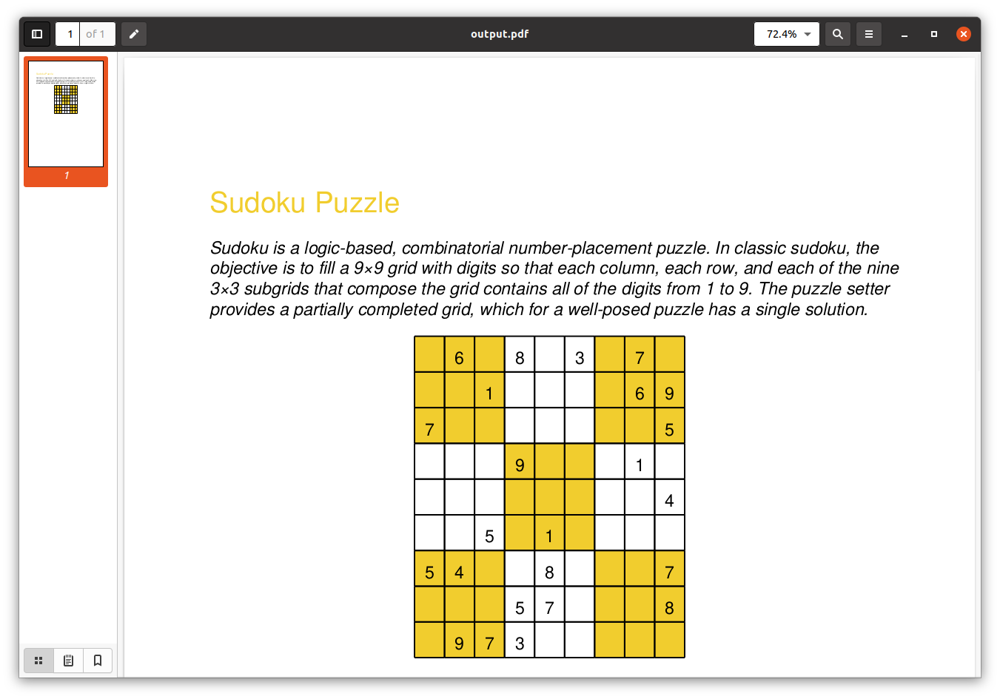

## 9.2 Building a realistic invoice

```python
#!chapter_009/src/snippet_005.py
from borb.pdf.document.document import Document
from borb.pdf.page.page import Page


def main():

    # Create document
    pdf = Document()

    # Add page
    page = Page()
    pdf.append_page(page)


if __name__ == "__main__":
    main()
```

Since we don't want to deal with calculating coordinates - we can delegate this to a `PageLayout` which manages all of the content and its positions:

```python
#!chapter_009/src/snippet_006.py
from borb.pdf.document.document import Document
from borb.pdf.page.page import Page

# New imports
from borb.pdf.canvas.layout.page_layout.multi_column_layout import SingleColumnLayout
from borb.pdf.canvas.layout.page_layout.page_layout import PageLayout
from decimal import Decimal


def main():

    # Create document
    pdf = Document()

    # Add page
    page = Page()
    pdf.append_page(page)

    # create PageLayout
    page_layout: PageLayout = SingleColumnLayout(page)
    page_layout.vertical_margin = page.get_page_info().get_height() * Decimal(0.02)


if __name__ == "__main__":
    main()
```

Here, we're using a `SingleColumnLayout` since all of the content should be in a single column - we won't have a left and right side of the invoice. 
We're also making the vertical margin smaller here. The default value is to trim the top 10% of the page height as the margin, and we're reducing it down to 2%, since we'll want to use this space for the company logo/name.

Speaking of which, let's add the company logo to the layout:

```python
#!chapter_009/src/snippet_007.py
from borb.pdf.document.document import Document
from borb.pdf.page.page import Page
from borb.pdf.canvas.layout.page_layout.multi_column_layout import SingleColumnLayout
from borb.pdf.canvas.layout.page_layout.page_layout import PageLayout
from decimal import Decimal

# New imports
from borb.pdf.canvas.layout.image.image import Image


def main():

    # Create document
    pdf = Document()

    # Add page
    page = Page()
    pdf.append_page(page)

    # create PageLayout
    page_layout: PageLayout = SingleColumnLayout(page)
    page_layout.vertical_margin = page.get_page_info().get_height() * Decimal(0.02)

    page_layout.add(
        Image(
            "https://s3.stackabuse.com/media/articles/creating-an-invoice-in-python-with-ptext-1.png",
            width=Decimal(128),
            height=Decimal(128),
        )
    )


if __name__ == "__main__":
    main()
```

Here, we're adding an element to the layout - an `Image`. Through its constructor, we're adding a URL pointing to the image resource and setting its `width` and `height`.

Beneath the image, we'll want to add our imaginary company info (name, address, website, phone) as well as the invoice information (invoice number, date, due date).

A common format for brevity (which incidentally also makes the code cleaner) is to use a table to store invoice data. Let's create a separate helper method to build the invoice information in a table, which we can then use to simply add a table to the invoice in our main method:

```python
#!chapter_009/src/snippet_008.py
# New imports
from borb.pdf.canvas.layout.table.fixed_column_width_table import (
    FixedColumnWidthTable as Table,
)
from borb.pdf.canvas.layout.text.paragraph import Paragraph
from borb.pdf.canvas.layout.layout_element import Alignment
from datetime import datetime
import random


def _build_invoice_information():
    table_001 = Table(number_of_rows=5, number_of_columns=3)

    table_001.add(Paragraph("[Street Address]"))
    table_001.add(
        Paragraph("Date", font="Helvetica-Bold", horizontal_alignment=Alignment.RIGHT)
    )
    now = datetime.now()
    table_001.add(Paragraph("%d/%d/%d" % (now.day, now.month, now.year)))

    table_001.add(Paragraph("[City, State, ZIP Code]"))
    table_001.add(
        Paragraph(
            "Invoice #", font="Helvetica-Bold", horizontal_alignment=Alignment.RIGHT
        )
    )
    table_001.add(Paragraph("%d" % random.randint(1000, 10000)))

    table_001.add(Paragraph("[Phone]"))
    table_001.add(
        Paragraph(
            "Due Date", font="Helvetica-Bold", horizontal_alignment=Alignment.RIGHT
        )
    )
    table_001.add(Paragraph("%d/%d/%d" % (now.day, now.month, now.year)))

    table_001.add(Paragraph("[Email Address]"))
    table_001.add(Paragraph(" "))
    table_001.add(Paragraph(" "))

    table_001.add(Paragraph("[Company Website]"))
    table_001.add(Paragraph(" "))
    table_001.add(Paragraph(" "))

    table_001.set_padding_on_all_cells(Decimal(2), Decimal(2), Decimal(2), Decimal(2))
    table_001.no_borders()
    return table_001
```

Here, we're making a simple `Table` with 5 rows and 3 columns. The rows correspond to the street address, city/state, phone, email address and company website. Each row will have `0..3` values (columns). Each text element is added as a `Paragraph`, which we've aligned to the right via `Alignment.RIGHT`, and accept styling arguments such as font.

Finally, we've added padding to all the cells to make sure we don't place the text awkwardly near the confounds of the cells.

Now, back in our main method, we can call `_build_invoice_information()` to populate a table and add it to our layout:

```python
#!chapter_009/src/snippet_009.py
from borb.pdf.document.document import Document
from borb.pdf.page.page import Page
from borb.pdf.canvas.layout.page_layout.multi_column_layout import SingleColumnLayout
from borb.pdf.canvas.layout.page_layout.page_layout import PageLayout
from decimal import Decimal
from borb.pdf.canvas.layout.image.image import Image
from borb.pdf.canvas.layout.table.fixed_column_width_table import (
    FixedColumnWidthTable as Table,
)
from borb.pdf.canvas.layout.text.paragraph import Paragraph
from borb.pdf.canvas.layout.layout_element import Alignment
from datetime import datetime
import random


def _build_invoice_information():
    table_001 = Table(number_of_rows=5, number_of_columns=3)

    table_001.add(Paragraph("[Street Address]"))
    table_001.add(
        Paragraph("Date", font="Helvetica-Bold", horizontal_alignment=Alignment.RIGHT)
    )
    now = datetime.now()
    table_001.add(Paragraph("%d/%d/%d" % (now.day, now.month, now.year)))

    table_001.add(Paragraph("[City, State, ZIP Code]"))
    table_001.add(
        Paragraph(
            "Invoice #", font="Helvetica-Bold", horizontal_alignment=Alignment.RIGHT
        )
    )
    table_001.add(Paragraph("%d" % random.randint(1000, 10000)))

    table_001.add(Paragraph("[Phone]"))
    table_001.add(
        Paragraph(
            "Due Date", font="Helvetica-Bold", horizontal_alignment=Alignment.RIGHT
        )
    )
    table_001.add(Paragraph("%d/%d/%d" % (now.day, now.month, now.year)))

    table_001.add(Paragraph("[Email Address]"))
    table_001.add(Paragraph(" "))
    table_001.add(Paragraph(" "))

    table_001.add(Paragraph("[Company Website]"))
    table_001.add(Paragraph(" "))
    table_001.add(Paragraph(" "))

    table_001.set_padding_on_all_cells(Decimal(2), Decimal(2), Decimal(2), Decimal(2))
    table_001.no_borders()
    return table_001


def main():
    # Create document
    pdf = Document()

    # Add page
    page = Page()
    pdf.append_page(page)

    # create PageLayout
    page_layout: PageLayout = SingleColumnLayout(page)
    page_layout.vertical_margin = page.get_page_info().get_height() * Decimal(0.02)

    page_layout.add(
        Image(
            "https://s3.stackabuse.com/media/articles/creating-an-invoice-in-python-with-ptext-1.png",
            width=Decimal(64),
            height=Decimal(64),
        )
    )

    # Invoice information table
    page_layout.add(_build_invoice_information())

    # Empty paragraph for spacing
    page_layout.add(Paragraph(" "))


if __name__ == "__main__":
    main()
```

Great! Now we'll want to add the billing and shipping information as well. It'll conveniently be placed in a table, just like the company information. For brevity's sake, we'll also opt to make a separate helper function to build this info, and then we can simply add it in our main method:

```python
#!chapter_009/src/snippet_010.py
# New imports
from borb.pdf.canvas.color.color import HexColor, X11Color


def _build_billing_and_shipping_information():
    table_001 = Table(number_of_rows=6, number_of_columns=2)
    table_001.add(
        Paragraph(
            "BILL TO",
            background_color=HexColor("263238"),
            font_color=X11Color("White"),
        )
    )
    table_001.add(
        Paragraph(
            "SHIP TO",
            background_color=HexColor("263238"),
            font_color=X11Color("White"),
        )
    )
    table_001.add(Paragraph("[Recipient Name]"))  # BILLING
    table_001.add(Paragraph("[Recipient Name]"))  # SHIPPING
    table_001.add(Paragraph("[Company Name]"))  # BILLING
    table_001.add(Paragraph("[Company Name]"))  # SHIPPING
    table_001.add(Paragraph("[Street Address]"))  # BILLING
    table_001.add(Paragraph("[Street Address]"))  # SHIPPING
    table_001.add(Paragraph("[City, State, ZIP Code]"))  # BILLING
    table_001.add(Paragraph("[City, State, ZIP Code]"))  # SHIPPING
    table_001.add(Paragraph("[Phone]"))  # BILLING
    table_001.add(Paragraph("[Phone]"))  # SHIPPING
    table_001.set_padding_on_all_cells(Decimal(2), Decimal(2), Decimal(2), Decimal(2))
    table_001.no_borders()
    return table_001
```

Let's call this in the main method as well:

```python
#!chapter_009/src/snippet_011.py
from borb.pdf.document.document import Document
from borb.pdf.page.page import Page
from borb.pdf.canvas.layout.page_layout.multi_column_layout import SingleColumnLayout
from borb.pdf.canvas.layout.page_layout.page_layout import PageLayout
from decimal import Decimal
from borb.pdf.canvas.layout.image.image import Image
from borb.pdf.canvas.layout.table.fixed_column_width_table import (
    FixedColumnWidthTable as Table,
)
from borb.pdf.canvas.layout.text.paragraph import Paragraph
from borb.pdf.canvas.layout.layout_element import Alignment
from borb.pdf.canvas.color.color import HexColor, X11Color
from datetime import datetime
import random


def _build_invoice_information():
    table_001 = Table(number_of_rows=5, number_of_columns=3)

    table_001.add(Paragraph("[Street Address]"))
    table_001.add(
        Paragraph("Date", font="Helvetica-Bold", horizontal_alignment=Alignment.RIGHT)
    )
    now = datetime.now()
    table_001.add(Paragraph("%d/%d/%d" % (now.day, now.month, now.year)))

    table_001.add(Paragraph("[City, State, ZIP Code]"))
    table_001.add(
        Paragraph(
            "Invoice #", font="Helvetica-Bold", horizontal_alignment=Alignment.RIGHT
        )
    )
    table_001.add(Paragraph("%d" % random.randint(1000, 10000)))

    table_001.add(Paragraph("[Phone]"))
    table_001.add(
        Paragraph(
            "Due Date", font="Helvetica-Bold", horizontal_alignment=Alignment.RIGHT
        )
    )
    table_001.add(Paragraph("%d/%d/%d" % (now.day, now.month, now.year)))

    table_001.add(Paragraph("[Email Address]"))
    table_001.add(Paragraph(" "))
    table_001.add(Paragraph(" "))

    table_001.add(Paragraph("[Company Website]"))
    table_001.add(Paragraph(" "))
    table_001.add(Paragraph(" "))

    table_001.set_padding_on_all_cells(Decimal(2), Decimal(2), Decimal(2), Decimal(2))
    table_001.no_borders()
    return table_001


def _build_billing_and_shipping_information():
    table_001 = Table(number_of_rows=6, number_of_columns=2)
    table_001.add(
        Paragraph(
            "BILL TO",
            background_color=HexColor("263238"),
            font_color=X11Color("White"),
        )
    )
    table_001.add(
        Paragraph(
            "SHIP TO",
            background_color=HexColor("263238"),
            font_color=X11Color("White"),
        )
    )
    table_001.add(Paragraph("[Recipient Name]"))  # BILLING
    table_001.add(Paragraph("[Recipient Name]"))  # SHIPPING
    table_001.add(Paragraph("[Company Name]"))  # BILLING
    table_001.add(Paragraph("[Company Name]"))  # SHIPPING
    table_001.add(Paragraph("[Street Address]"))  # BILLING
    table_001.add(Paragraph("[Street Address]"))  # SHIPPING
    table_001.add(Paragraph("[City, State, ZIP Code]"))  # BILLING
    table_001.add(Paragraph("[City, State, ZIP Code]"))  # SHIPPING
    table_001.add(Paragraph("[Phone]"))  # BILLING
    table_001.add(Paragraph("[Phone]"))  # SHIPPING
    table_001.set_padding_on_all_cells(Decimal(2), Decimal(2), Decimal(2), Decimal(2))
    table_001.no_borders()
    return table_001


def main():
    # Create document
    pdf = Document()

    # Add page
    page = Page()
    pdf.append_page(page)

    # create PageLayout
    page_layout: PageLayout = SingleColumnLayout(page)
    page_layout.vertical_margin = page.get_page_info().get_height() * Decimal(0.02)

    page_layout.add(
        Image(
            "https://s3.stackabuse.com/media/articles/creating-an-invoice-in-python-with-ptext-1.png",
            width=Decimal(64),
            height=Decimal(64),
        )
    )

    # Invoice information table
    page_layout.add(_build_invoice_information())

    # Empty paragraph for spacing
    page_layout.add(Paragraph(" "))

    # Billing and shipping information table
    page_layout.add(_build_billing_and_shipping_information())


if __name__ == "__main__":
    main()
```

With our basic information sorted out (company info and billing/shipping info) - we'll want to add an itemized description. These will be the goods/services that our supposed company offered to someone and are also typically done in a table-like fashion beneath the information we've already added.

Again, let's create a helper function that generates a table and populates it with data, which we can simply add to our layout later on.

We'll start by defining a Product class to represent a sold product. In practice, you'd substitute the hard-coded strings related to the subtotal, taxes and total prices with calculations of the actual prices - though, this heavily depends on the underlying implementation of your Product models, so we've added a stand-in for abstraction.

```python
#!chapter_009/src/snippet_012.py
class Product:
    """
    This class represents a purchased product
    """

    def __init__(self, name: str, quantity: int, price_per_sku: float):
        self.name: str = name
        assert quantity >= 0
        self.quantity: int = quantity
        assert price_per_sku >= 0
        self.price_per_sku: float = price_per_sku
```

Now we can build a method `_build_itemized_description_table` that will render these products and their prices to the PDF:

```python
#!chapter_009/src/snippet_013.py
# New Imports
from borb.pdf.canvas.layout.table.table import TableCell
import typing


def _build_itemized_description_table(products: typing.List[Product] = []):
    """
    This function builds a Table containing itemized billing information
    :param:     products
    :return:    a Table containing itemized billing information
    """
    table_001 = Table(number_of_rows=15, number_of_columns=4)
    for h in ["DESCRIPTION", "QTY", "UNIT PRICE", "AMOUNT"]:
        table_001.add(
            TableCell(
                Paragraph(h, font_color=X11Color("White")),
                background_color=HexColor("0b3954"),
            )
        )

    odd_color = HexColor("BBBBBB")
    even_color = HexColor("FFFFFF")
    for row_number, item in enumerate(products):
        c = even_color if row_number % 2 == 0 else odd_color
        table_001.add(TableCell(Paragraph(item.name), background_color=c))
        table_001.add(TableCell(Paragraph(str(item.quantity)), background_color=c))
        table_001.add(
            TableCell(Paragraph("$ " + str(item.price_per_sku)), background_color=c)
        )
        table_001.add(
            TableCell(
                Paragraph("$ " + str(item.quantity * item.price_per_sku)),
                background_color=c,
            )
        )

    # Optionally add some empty rows to have a fixed number of rows for styling purposes
    for row_number in range(len(products), 10):
        c = even_color if row_number % 2 == 0 else odd_color
        for _ in range(0, 4):
            table_001.add(TableCell(Paragraph(" "), background_color=c))

    # subtotal
    subtotal: float = sum([x.price_per_sku * x.quantity for x in products])
    table_001.add(
        TableCell(
            Paragraph(
                "Subtotal",
                font="Helvetica-Bold",
                horizontal_alignment=Alignment.RIGHT,
            ),
            col_span=3,
        )
    )
    table_001.add(
        TableCell(Paragraph("$ 1,180.00", horizontal_alignment=Alignment.RIGHT))
    )

    # discounts
    table_001.add(
        TableCell(
            Paragraph(
                "Discounts",
                font="Helvetica-Bold",
                horizontal_alignment=Alignment.RIGHT,
            ),
            col_span=3,
        )
    )
    table_001.add(TableCell(Paragraph("$ 0.00", horizontal_alignment=Alignment.RIGHT)))

    # taxes
    taxes: float = subtotal * 0.06
    table_001.add(
        TableCell(
            Paragraph(
                "Taxes", font="Helvetica-Bold", horizontal_alignment=Alignment.RIGHT
            ),
            col_span=3,
        )
    )
    table_001.add(
        TableCell(Paragraph("$ " + str(taxes), horizontal_alignment=Alignment.RIGHT))
    )

    # total
    total: float = subtotal + taxes
    table_001.add(
        TableCell(
            Paragraph(
                "Total", font="Helvetica-Bold", horizontal_alignment=Alignment.RIGHT
            ),
            col_span=3,
        )
    )
    table_001.add(
        TableCell(Paragraph("$ " + str(total), horizontal_alignment=Alignment.RIGHT))
    )
    table_001.set_padding_on_all_cells(Decimal(2), Decimal(2), Decimal(2), Decimal(2))
    table_001.no_borders()
    return table_001
```

Let's call this method with some dummy `Product` items:

```python
#!chapter_009/src/snippet_014.py
from borb.pdf.document.document import Document
from borb.pdf.page.page import Page
from borb.pdf.canvas.layout.page_layout.multi_column_layout import SingleColumnLayout
from borb.pdf.canvas.layout.page_layout.page_layout import PageLayout
from decimal import Decimal
from borb.pdf.canvas.layout.image.image import Image
from borb.pdf.canvas.layout.table.fixed_column_width_table import (
    FixedColumnWidthTable as Table,
)
from borb.pdf.canvas.layout.text.paragraph import Paragraph
from borb.pdf.canvas.layout.layout_element import Alignment
from borb.pdf.canvas.color.color import HexColor, X11Color
from borb.pdf.canvas.layout.table.table import TableCell
from datetime import datetime
import random
import typing


class Product:
    """
    This class represents a purchased product
    """

    def __init__(self, name: str, quantity: int, price_per_sku: float):
        self.name: str = name
        assert quantity >= 0
        self.quantity: int = quantity
        assert price_per_sku >= 0
        self.price_per_sku: float = price_per_sku


def _build_invoice_information():
    table_001 = Table(number_of_rows=5, number_of_columns=3)

    table_001.add(Paragraph("[Street Address]"))
    table_001.add(
        Paragraph("Date", font="Helvetica-Bold", horizontal_alignment=Alignment.RIGHT)
    )
    now = datetime.now()
    table_001.add(Paragraph("%d/%d/%d" % (now.day, now.month, now.year)))

    table_001.add(Paragraph("[City, State, ZIP Code]"))
    table_001.add(
        Paragraph(
            "Invoice #", font="Helvetica-Bold", horizontal_alignment=Alignment.RIGHT
        )
    )
    table_001.add(Paragraph("%d" % random.randint(1000, 10000)))

    table_001.add(Paragraph("[Phone]"))
    table_001.add(
        Paragraph(
            "Due Date", font="Helvetica-Bold", horizontal_alignment=Alignment.RIGHT
        )
    )
    table_001.add(Paragraph("%d/%d/%d" % (now.day, now.month, now.year)))

    table_001.add(Paragraph("[Email Address]"))
    table_001.add(Paragraph(" "))
    table_001.add(Paragraph(" "))

    table_001.add(Paragraph("[Company Website]"))
    table_001.add(Paragraph(" "))
    table_001.add(Paragraph(" "))

    table_001.set_padding_on_all_cells(Decimal(2), Decimal(2), Decimal(2), Decimal(2))
    table_001.no_borders()
    return table_001


def _build_billing_and_shipping_information():
    table_001 = Table(number_of_rows=6, number_of_columns=2)
    table_001.add(
        Paragraph(
            "BILL TO",
            background_color=HexColor("263238"),
            font_color=X11Color("White"),
        )
    )
    table_001.add(
        Paragraph(
            "SHIP TO",
            background_color=HexColor("263238"),
            font_color=X11Color("White"),
        )
    )
    table_001.add(Paragraph("[Recipient Name]"))  # BILLING
    table_001.add(Paragraph("[Recipient Name]"))  # SHIPPING
    table_001.add(Paragraph("[Company Name]"))  # BILLING
    table_001.add(Paragraph("[Company Name]"))  # SHIPPING
    table_001.add(Paragraph("[Street Address]"))  # BILLING
    table_001.add(Paragraph("[Street Address]"))  # SHIPPING
    table_001.add(Paragraph("[City, State, ZIP Code]"))  # BILLING
    table_001.add(Paragraph("[City, State, ZIP Code]"))  # SHIPPING
    table_001.add(Paragraph("[Phone]"))  # BILLING
    table_001.add(Paragraph("[Phone]"))  # SHIPPING
    table_001.set_padding_on_all_cells(Decimal(2), Decimal(2), Decimal(2), Decimal(2))
    table_001.no_borders()
    return table_001


def _build_itemized_description_table(products: typing.List[Product] = []):
    """
    This function builds a Table containing itemized billing information
    :param:     products
    :return:    a Table containing itemized billing information
    """
    table_001 = Table(number_of_rows=15, number_of_columns=4)
    for h in ["DESCRIPTION", "QTY", "UNIT PRICE", "AMOUNT"]:
        table_001.add(
            TableCell(
                Paragraph(h, font_color=X11Color("White")),
                background_color=HexColor("0b3954"),
            )
        )

    odd_color = HexColor("BBBBBB")
    even_color = HexColor("FFFFFF")
    for row_number, item in enumerate(products):
        c = even_color if row_number % 2 == 0 else odd_color
        table_001.add(TableCell(Paragraph(item.name), background_color=c))
        table_001.add(TableCell(Paragraph(str(item.quantity)), background_color=c))
        table_001.add(
            TableCell(Paragraph("$ " + str(item.price_per_sku)), background_color=c)
        )
        table_001.add(
            TableCell(
                Paragraph("$ " + str(item.quantity * item.price_per_sku)),
                background_color=c,
            )
        )

    # Optionally add some empty rows to have a fixed number of rows for styling purposes
    for row_number in range(len(products), 10):
        c = even_color if row_number % 2 == 0 else odd_color
        for _ in range(0, 4):
            table_001.add(TableCell(Paragraph(" "), background_color=c))

    # subtotal
    subtotal: float = sum([x.price_per_sku * x.quantity for x in products])
    table_001.add(
        TableCell(
            Paragraph(
                "Subtotal",
                font="Helvetica-Bold",
                horizontal_alignment=Alignment.RIGHT,
            ),
            col_span=3,
        )
    )
    table_001.add(
        TableCell(Paragraph("$ 1,180.00", horizontal_alignment=Alignment.RIGHT))
    )

    # discounts
    table_001.add(
        TableCell(
            Paragraph(
                "Discounts",
                font="Helvetica-Bold",
                horizontal_alignment=Alignment.RIGHT,
            ),
            col_span=3,
        )
    )
    table_001.add(TableCell(Paragraph("$ 0.00", horizontal_alignment=Alignment.RIGHT)))

    # taxes
    taxes: float = subtotal * 0.06
    table_001.add(
        TableCell(
            Paragraph(
                "Taxes", font="Helvetica-Bold", horizontal_alignment=Alignment.RIGHT
            ),
            col_span=3,
        )
    )
    table_001.add(
        TableCell(Paragraph("$ " + str(taxes), horizontal_alignment=Alignment.RIGHT))
    )

    # total
    total: float = subtotal + taxes
    table_001.add(
        TableCell(
            Paragraph(
                "Total", font="Helvetica-Bold", horizontal_alignment=Alignment.RIGHT
            ),
            col_span=3,
        )
    )
    table_001.add(
        TableCell(Paragraph("$ " + str(total), horizontal_alignment=Alignment.RIGHT))
    )
    table_001.set_padding_on_all_cells(Decimal(2), Decimal(2), Decimal(2), Decimal(2))
    table_001.no_borders()
    return table_001


def main():
    # Create document
    pdf = Document()

    # Add page
    page = Page()
    pdf.append_page(page)

    # create PageLayout
    page_layout: PageLayout = SingleColumnLayout(page)
    page_layout.vertical_margin = page.get_page_info().get_height() * Decimal(0.02)

    page_layout.add(
        Image(
            "https://s3.stackabuse.com/media/articles/creating-an-invoice-in-python-with-ptext-1.png",
            width=Decimal(64),
            height=Decimal(64),
        )
    )

    # Invoice information table
    page_layout.add(_build_invoice_information())

    # Empty paragraph for spacing
    page_layout.add(Paragraph(" "))

    # Billing and shipping information table
    page_layout.add(_build_billing_and_shipping_information())

    # Empty paragraph for spacing
    page_layout.add(Paragraph(" "))

    # Itemized description
    page_layout.add(
        _build_itemized_description_table(
            [
                Product("Product 1", 2, 50),
                Product("Product 2", 4, 60),
                Product("Labor", 14, 60),
            ]
        )
    )


if __name__ == "__main__":
    main()
```

Finally, you can store the PDF to disk

```python
#!chapter_009/src/snippet_015.py
from borb.pdf.document.document import Document
from borb.pdf.page.page import Page
from borb.pdf.canvas.layout.page_layout.multi_column_layout import SingleColumnLayout
from borb.pdf.canvas.layout.page_layout.page_layout import PageLayout
from decimal import Decimal
from borb.pdf.canvas.layout.image.image import Image
from borb.pdf.canvas.layout.table.fixed_column_width_table import (
    FixedColumnWidthTable as Table,
)
from borb.pdf.canvas.layout.text.paragraph import Paragraph
from borb.pdf.canvas.layout.layout_element import Alignment
from borb.pdf.canvas.color.color import HexColor, X11Color
from borb.pdf.canvas.layout.table.table import TableCell
from borb.pdf.pdf import PDF

from datetime import datetime
import random
import typing


class Product:
    """
    This class represents a purchased product
    """

    def __init__(self, name: str, quantity: int, price_per_sku: float):
        self.name: str = name
        assert quantity >= 0
        self.quantity: int = quantity
        assert price_per_sku >= 0
        self.price_per_sku: float = price_per_sku


def _build_invoice_information():
    table_001 = Table(number_of_rows=5, number_of_columns=3)

    table_001.add(Paragraph("[Street Address]"))
    table_001.add(
        Paragraph("Date", font="Helvetica-Bold", horizontal_alignment=Alignment.RIGHT)
    )
    now = datetime.now()
    table_001.add(Paragraph("%d/%d/%d" % (now.day, now.month, now.year)))

    table_001.add(Paragraph("[City, State, ZIP Code]"))
    table_001.add(
        Paragraph(
            "Invoice #", font="Helvetica-Bold", horizontal_alignment=Alignment.RIGHT
        )
    )
    table_001.add(Paragraph("%d" % random.randint(1000, 10000)))

    table_001.add(Paragraph("[Phone]"))
    table_001.add(
        Paragraph(
            "Due Date", font="Helvetica-Bold", horizontal_alignment=Alignment.RIGHT
        )
    )
    table_001.add(Paragraph("%d/%d/%d" % (now.day, now.month, now.year)))

    table_001.add(Paragraph("[Email Address]"))
    table_001.add(Paragraph(" "))
    table_001.add(Paragraph(" "))

    table_001.add(Paragraph("[Company Website]"))
    table_001.add(Paragraph(" "))
    table_001.add(Paragraph(" "))

    table_001.set_padding_on_all_cells(Decimal(2), Decimal(2), Decimal(2), Decimal(2))
    table_001.no_borders()
    return table_001


def _build_billing_and_shipping_information():
    table_001 = Table(number_of_rows=6, number_of_columns=2)
    table_001.add(
        Paragraph(
            "BILL TO",
            background_color=HexColor("263238"),
            font_color=X11Color("White"),
        )
    )
    table_001.add(
        Paragraph(
            "SHIP TO",
            background_color=HexColor("263238"),
            font_color=X11Color("White"),
        )
    )
    table_001.add(Paragraph("[Recipient Name]"))  # BILLING
    table_001.add(Paragraph("[Recipient Name]"))  # SHIPPING
    table_001.add(Paragraph("[Company Name]"))  # BILLING
    table_001.add(Paragraph("[Company Name]"))  # SHIPPING
    table_001.add(Paragraph("[Street Address]"))  # BILLING
    table_001.add(Paragraph("[Street Address]"))  # SHIPPING
    table_001.add(Paragraph("[City, State, ZIP Code]"))  # BILLING
    table_001.add(Paragraph("[City, State, ZIP Code]"))  # SHIPPING
    table_001.add(Paragraph("[Phone]"))  # BILLING
    table_001.add(Paragraph("[Phone]"))  # SHIPPING
    table_001.set_padding_on_all_cells(Decimal(2), Decimal(2), Decimal(2), Decimal(2))
    table_001.no_borders()
    return table_001


def _build_itemized_description_table(products: typing.List[Product] = []):
    """
    This function builds a Table containing itemized billing information
    :param:     products
    :return:    a Table containing itemized billing information
    """
    table_001 = Table(number_of_rows=15, number_of_columns=4)
    for h in ["DESCRIPTION", "QTY", "UNIT PRICE", "AMOUNT"]:
        table_001.add(
            TableCell(
                Paragraph(h, font_color=X11Color("White")),
                background_color=HexColor("0b3954"),
            )
        )

    odd_color = HexColor("BBBBBB")
    even_color = HexColor("FFFFFF")
    for row_number, item in enumerate(products):
        c = even_color if row_number % 2 == 0 else odd_color
        table_001.add(TableCell(Paragraph(item.name), background_color=c))
        table_001.add(TableCell(Paragraph(str(item.quantity)), background_color=c))
        table_001.add(
            TableCell(Paragraph("$ " + str(item.price_per_sku)), background_color=c)
        )
        table_001.add(
            TableCell(
                Paragraph("$ " + str(item.quantity * item.price_per_sku)),
                background_color=c,
            )
        )

    # Optionally add some empty rows to have a fixed number of rows for styling purposes
    for row_number in range(len(products), 10):
        c = even_color if row_number % 2 == 0 else odd_color
        for _ in range(0, 4):
            table_001.add(TableCell(Paragraph(" "), background_color=c))

    # subtotal
    subtotal: float = sum([x.price_per_sku * x.quantity for x in products])
    table_001.add(
        TableCell(
            Paragraph(
                "Subtotal",
                font="Helvetica-Bold",
                horizontal_alignment=Alignment.RIGHT,
            ),
            col_span=3,
        )
    )
    table_001.add(
        TableCell(Paragraph("$ 1,180.00", horizontal_alignment=Alignment.RIGHT))
    )

    # discounts
    table_001.add(
        TableCell(
            Paragraph(
                "Discounts",
                font="Helvetica-Bold",
                horizontal_alignment=Alignment.RIGHT,
            ),
            col_span=3,
        )
    )
    table_001.add(TableCell(Paragraph("$ 0.00", horizontal_alignment=Alignment.RIGHT)))

    # taxes
    taxes: float = subtotal * 0.06
    table_001.add(
        TableCell(
            Paragraph(
                "Taxes", font="Helvetica-Bold", horizontal_alignment=Alignment.RIGHT
            ),
            col_span=3,
        )
    )
    table_001.add(
        TableCell(Paragraph("$ " + str(taxes), horizontal_alignment=Alignment.RIGHT))
    )

    # total
    total: float = subtotal + taxes
    table_001.add(
        TableCell(
            Paragraph(
                "Total", font="Helvetica-Bold", horizontal_alignment=Alignment.RIGHT
            ),
            col_span=3,
        )
    )
    table_001.add(
        TableCell(Paragraph("$ " + str(total), horizontal_alignment=Alignment.RIGHT))
    )
    table_001.set_padding_on_all_cells(Decimal(2), Decimal(2), Decimal(2), Decimal(2))
    table_001.no_borders()
    return table_001


def main():
    # Create document
    pdf = Document()

    # Add page
    page = Page()
    pdf.append_page(page)

    # create PageLayout
    page_layout: PageLayout = SingleColumnLayout(page)
    page_layout.vertical_margin = page.get_page_info().get_height() * Decimal(0.02)

    page_layout.add(
        Image(
            "https://s3.stackabuse.com/media/articles/creating-an-invoice-in-python-with-ptext-1.png",
            width=Decimal(64),
            height=Decimal(64),
        )
    )

    # Invoice information table
    page_layout.add(_build_invoice_information())

    # Empty paragraph for spacing
    page_layout.add(Paragraph(" "))

    # Billing and shipping information table
    page_layout.add(_build_billing_and_shipping_information())

    # Empty paragraph for spacing
    page_layout.add(Paragraph(" "))

    # Itemized description
    page_layout.add(
        _build_itemized_description_table(
            [
                Product("Product 1", 2, 50),
                Product("Product 2", 4, 60),
                Product("Labor", 14, 60),
            ]
        )
    )

    # store
    with open("output.pdf", "wb") as out_file_handle:
        PDF.dumps(out_file_handle, pdf)


if __name__ == "__main__":
    main()
```

The final PDF should look somewhat like this:

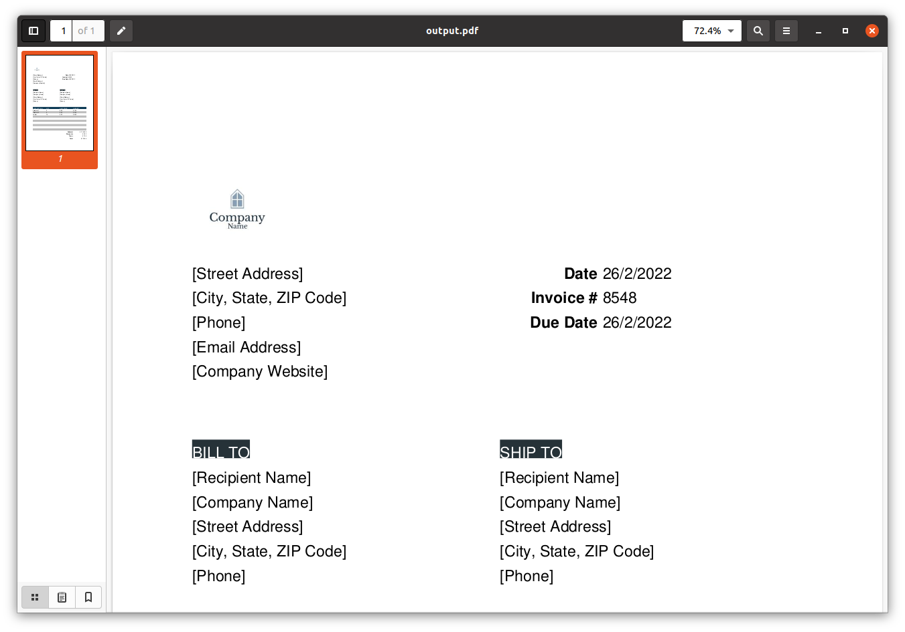

## 9.3 Creating a stunning flyer

These are the steps to creating a PDF document using borb:

- Create an empty `Document`
- Create an empty `Page`
- Append the `Page` to the `Document`
- Set a `PageLayout` to handle the flow of content (we're using a `SingleColumnLayout` here)
- Add content (not shown here)
- Write the PDF to disk (not shown here)

```python
#!chapter_009/src/snippet_016.py
from borb.pdf.document.document import Document
from borb.pdf.page.page import Page
from borb.pdf.pdf import PDF
from borb.pdf.canvas.layout.page_layout.multi_column_layout import SingleColumnLayout
from borb.pdf.canvas.layout.page_layout.page_layout import PageLayout


def main():
    # create empty Document
    pdf = Document()

    # create empty Page
    page = Page()

    # add Page to Document
    pdf.append_page(page)

    # create PageLayout
    layout: PageLayout = SingleColumnLayout(page)


if __name__ == "__main__":
    main()
```

We'd like to add some geometric artwork to our flyer in the upper right corner. We're going to write a separate method to do that. Then we can later re-use this method (for instance on every `Page` in the `Document`).

```python
#!chapter_009/src/snippet_017.py
# new imports
from borb.pdf.canvas.layout.shape.shape import Shape
from decimal import Decimal
from borb.pdf.canvas.color.color import HexColor, X11Color
from borb.pdf.canvas.geometry.rectangle import Rectangle
from borb.pdf.page.page_size import PageSize
import typing
import random


def add_gray_artwork_to_upper_right_corner(page: Page) -> None:
    """
    This method will add a gray artwork of squares and triangles in the upper right corner
    of the given Page
    """

    # define a list of gray colors
    grays: typing.List[HexColor] = [
        HexColor("A9A9A9"),
        HexColor("D3D3D3"),
        HexColor("DCDCDC"),
        HexColor("E0E0E0"),
        HexColor("E8E8E8"),
        HexColor("F0F0F0"),
    ]

    # we're going to use the size of the page later on,
    # so perhaps it's a good idea to retrieve it now
    ps: typing.Tuple[Decimal, Decimal] = PageSize.A4_PORTRAIT.value

    # now we'll write N triangles in the upper right corner
    # we'll later fill the remaining space with squares
    N: int = 4
    M: Decimal = Decimal(32)
    for i in range(0, N):
        x: Decimal = ps[0] - N * M + i * M
        y: Decimal = ps[1] - (i + 1) * M
        rg: HexColor = random.choice(grays)
        Shape(
            points=[(x + M, y), (x + M, y + M), (x, y + M)],
            stroke_color=rg,
            fill_color=rg,
        ).layout(page, Rectangle(x, y, M, M))

    # now we can fill up the remaining space with squares
    for i in range(0, N - 1):
        for j in range(0, N - 1):
            if j > i:
                continue
            x: Decimal = ps[0] - (N - 1) * M + i * M
            y: Decimal = ps[1] - (j + 1) * M
            rg: HexColor = random.choice(grays)
            Shape(
                points=[(x, y), (x + M, y), (x + M, y + M), (x, y + M)],
                stroke_color=rg,
                fill_color=rg,
            ).layout(page, Rectangle(x, y, M, M))
```

Now that we've defined this method, we can call it in the main body of our script to add the artwork to the PDF.

```python
#!chapter_009/src/snippet_018.py
from borb.pdf.document.document import Document
from borb.pdf.page.page import Page
from borb.pdf.pdf import PDF
from borb.pdf.canvas.layout.page_layout.multi_column_layout import SingleColumnLayout
from borb.pdf.canvas.layout.page_layout.page_layout import PageLayout
from borb.pdf.canvas.layout.shape.shape import Shape
from decimal import Decimal
from borb.pdf.canvas.color.color import HexColor, X11Color
from borb.pdf.canvas.geometry.rectangle import Rectangle
from borb.pdf.page.page_size import PageSize
import typing
import random


def add_gray_artwork_to_upper_right_corner(page: Page) -> None:
    """
    This method will add a gray artwork of squares and triangles in the upper right corner
    of the given Page
    """

    # define a list of gray colors
    grays: typing.List[HexColor] = [
        HexColor("A9A9A9"),
        HexColor("D3D3D3"),
        HexColor("DCDCDC"),
        HexColor("E0E0E0"),
        HexColor("E8E8E8"),
        HexColor("F0F0F0"),
    ]

    # we're going to use the size of the page later on,
    # so perhaps it's a good idea to retrieve it now
    ps: typing.Tuple[Decimal, Decimal] = PageSize.A4_PORTRAIT.value

    # now we'll write N triangles in the upper right corner
    # we'll later fill the remaining space with squares
    N: int = 4
    M: Decimal = Decimal(32)
    for i in range(0, N):
        x: Decimal = ps[0] - N * M + i * M
        y: Decimal = ps[1] - (i + 1) * M
        rg: HexColor = random.choice(grays)
        Shape(
            points=[(x + M, y), (x + M, y + M), (x, y + M)],
            stroke_color=rg,
            fill_color=rg,
        ).layout(page, Rectangle(x, y, M, M))

    # now we can fill up the remaining space with squares
    for i in range(0, N - 1):
        for j in range(0, N - 1):
            if j > i:
                continue
            x: Decimal = ps[0] - (N - 1) * M + i * M
            y: Decimal = ps[1] - (j + 1) * M
            rg: HexColor = random.choice(grays)
            Shape(
                points=[(x, y), (x + M, y), (x + M, y + M), (x, y + M)],
                stroke_color=rg,
                fill_color=rg,
            ).layout(page, Rectangle(x, y, M, M))


def main():
    # create empty Document
    pdf = Document()

    # create empty Page
    page = Page()

    # add Page to Document
    pdf.append_page(page)

    # create PageLayout
    layout: PageLayout = SingleColumnLayout(page)

    # now we can call this method in the main method
    add_gray_artwork_to_upper_right_corner(page)


if __name__ == "__main__":
    main()
```

Next we're going to add our company contact details, so people know where to reach us:

```python
#!chapter_009/src/snippet_019.py
from borb.pdf.document.document import Document
from borb.pdf.page.page import Page
from borb.pdf.pdf import PDF
from borb.pdf.canvas.layout.page_layout.multi_column_layout import SingleColumnLayout
from borb.pdf.canvas.layout.page_layout.page_layout import PageLayout
from borb.pdf.canvas.layout.shape.shape import Shape
from decimal import Decimal
from borb.pdf.canvas.color.color import HexColor, X11Color
from borb.pdf.canvas.geometry.rectangle import Rectangle
from borb.pdf.page.page_size import PageSize
from borb.pdf.canvas.layout.text.paragraph import Paragraph
from borb.pdf.canvas.layout.image.barcode import Barcode, BarcodeType
from borb.pdf.canvas.layout.layout_element import LayoutElement
from borb.pdf.canvas.layout.table.flexible_column_width_table import (
    FlexibleColumnWidthTable,
)
from borb.pdf.canvas.layout.annotation.remote_go_to_annotation import (
    RemoteGoToAnnotation,
)

import typing
import random


def add_gray_artwork_to_upper_right_corner(page: Page) -> None:
    """
    This method will add a gray artwork of squares and triangles in the upper right corner
    of the given Page
    """

    # define a list of gray colors
    grays: typing.List[HexColor] = [
        HexColor("A9A9A9"),
        HexColor("D3D3D3"),
        HexColor("DCDCDC"),
        HexColor("E0E0E0"),
        HexColor("E8E8E8"),
        HexColor("F0F0F0"),
    ]

    # we're going to use the size of the page later on,
    # so perhaps it's a good idea to retrieve it now
    ps: typing.Tuple[Decimal, Decimal] = PageSize.A4_PORTRAIT.value

    # now we'll write N triangles in the upper right corner
    # we'll later fill the remaining space with squares
    N: int = 4
    M: Decimal = Decimal(32)
    for i in range(0, N):
        x: Decimal = ps[0] - N * M + i * M
        y: Decimal = ps[1] - (i + 1) * M
        rg: HexColor = random.choice(grays)
        Shape(
            points=[(x + M, y), (x + M, y + M), (x, y + M)],
            stroke_color=rg,
            fill_color=rg,
        ).layout(page, Rectangle(x, y, M, M))

    # now we can fill up the remaining space with squares
    for i in range(0, N - 1):
        for j in range(0, N - 1):
            if j > i:
                continue
            x: Decimal = ps[0] - (N - 1) * M + i * M
            y: Decimal = ps[1] - (j + 1) * M
            rg: HexColor = random.choice(grays)
            Shape(
                points=[(x, y), (x + M, y), (x + M, y + M), (x, y + M)],
                stroke_color=rg,
                fill_color=rg,
            ).layout(page, Rectangle(x, y, M, M))


def main():
    # create empty Document
    pdf = Document()

    # create empty Page
    page = Page()

    # add Page to Document
    pdf.append_page(page)

    # create PageLayout
    layout: PageLayout = SingleColumnLayout(page)

    # now we can call this method in the main method
    add_gray_artwork_to_upper_right_corner(page)

    # contact information
    layout.add(
        Paragraph("Your Company", font_color=HexColor("#6d64e8"), font_size=Decimal(20))
    )

    # We're going to add a qr code that links to our website.
    # Later, we're going to add a remote go-to annotation
    # (that's just PDF talk for "if you click the qr code, it will take you to our website")
    # in order to be able to do that, we need its coordinates.
    qr_code: LayoutElement = Barcode(
        data="https://www.borbpdf.com",
        width=Decimal(64),
        height=Decimal(64),
        type=BarcodeType.QR,
    )

    # now we can add this content to the table
    layout.add(
        FlexibleColumnWidthTable(number_of_columns=2, number_of_rows=1)
        .add(qr_code)
        .add(
            Paragraph(
                """
            500 South Buena Vista Street
            Burbank CA
            91521-0991 USA
            """,
                padding_top=Decimal(12),
                respect_newlines_in_text=True,
                font_color=HexColor("#666666"),
                font_size=Decimal(10),
            )
        )
        .no_borders()
    )

    # let's add the remote go-to annotation
    page.append_annotation(
        RemoteGoToAnnotation(qr_code.get_bounding_box(), uri="https://www.borbpdf.com")
    )


if __name__ == "__main__":
    main()
```

Now we can add a few titles and subtitles and some promotional blurb;

```python
#!chapter_009/src/snippet_020.py
from borb.pdf.document.document import Document
from borb.pdf.page.page import Page
from borb.pdf.pdf import PDF
from borb.pdf.canvas.layout.page_layout.multi_column_layout import SingleColumnLayout
from borb.pdf.canvas.layout.page_layout.page_layout import PageLayout
from borb.pdf.canvas.layout.shape.shape import Shape
from decimal import Decimal
from borb.pdf.canvas.color.color import HexColor, X11Color
from borb.pdf.canvas.geometry.rectangle import Rectangle
from borb.pdf.page.page_size import PageSize
from borb.pdf.canvas.layout.text.paragraph import Paragraph
from borb.pdf.canvas.layout.image.barcode import Barcode, BarcodeType
from borb.pdf.canvas.layout.layout_element import LayoutElement
from borb.pdf.canvas.layout.table.flexible_column_width_table import (
    FlexibleColumnWidthTable,
)
from borb.pdf.canvas.layout.annotation.remote_go_to_annotation import (
    RemoteGoToAnnotation,
)

import typing
import random


def add_gray_artwork_to_upper_right_corner(page: Page) -> None:
    """
    This method will add a gray artwork of squares and triangles in the upper right corner
    of the given Page
    """

    # define a list of gray colors
    grays: typing.List[HexColor] = [
        HexColor("A9A9A9"),
        HexColor("D3D3D3"),
        HexColor("DCDCDC"),
        HexColor("E0E0E0"),
        HexColor("E8E8E8"),
        HexColor("F0F0F0"),
    ]

    # we're going to use the size of the page later on,
    # so perhaps it's a good idea to retrieve it now
    ps: typing.Tuple[Decimal, Decimal] = PageSize.A4_PORTRAIT.value

    # now we'll write N triangles in the upper right corner
    # we'll later fill the remaining space with squares
    N: int = 4
    M: Decimal = Decimal(32)
    for i in range(0, N):
        x: Decimal = ps[0] - N * M + i * M
        y: Decimal = ps[1] - (i + 1) * M
        rg: HexColor = random.choice(grays)
        Shape(
            points=[(x + M, y), (x + M, y + M), (x, y + M)],
            stroke_color=rg,
            fill_color=rg,
        ).layout(page, Rectangle(x, y, M, M))

    # now we can fill up the remaining space with squares
    for i in range(0, N - 1):
        for j in range(0, N - 1):
            if j > i:
                continue
            x: Decimal = ps[0] - (N - 1) * M + i * M
            y: Decimal = ps[1] - (j + 1) * M
            rg: HexColor = random.choice(grays)
            Shape(
                points=[(x, y), (x + M, y), (x + M, y + M), (x, y + M)],
                stroke_color=rg,
                fill_color=rg,
            ).layout(page, Rectangle(x, y, M, M))


def main():
    # create empty Document
    pdf = Document()

    # create empty Page
    page = Page()

    # add Page to Document
    pdf.append_page(page)

    # create PageLayout
    layout: PageLayout = SingleColumnLayout(page)

    # now we can call this method in the main method
    add_gray_artwork_to_upper_right_corner(page)

    # contact information
    layout.add(
        Paragraph("Your Company", font_color=HexColor("#6d64e8"), font_size=Decimal(20))
    )

    # We're going to add a qr code that links to our website.
    # Later, we're going to add a remote go-to annotation
    # (that's just PDF talk for "if you click the qr code, it will take you to our website")
    # in order to be able to do that, we need its coordinates.
    qr_code: LayoutElement = Barcode(
        data="https://www.borbpdf.com",
        width=Decimal(64),
        height=Decimal(64),
        type=BarcodeType.QR,
    )

    # now we can add this content to the table
    layout.add(
        FlexibleColumnWidthTable(number_of_columns=2, number_of_rows=1)
        .add(qr_code)
        .add(
            Paragraph(
                """
            500 South Buena Vista Street
            Burbank CA
            91521-0991 USA
            """,
                padding_top=Decimal(12),
                respect_newlines_in_text=True,
                font_color=HexColor("#666666"),
                font_size=Decimal(10),
            )
        )
        .no_borders()
    )

    # let's add the remote go-to annotation
    page.append_annotation(
        RemoteGoToAnnotation(qr_code.get_bounding_box(), uri="https://www.borbpdf.com")
    )

    # title
    layout.add(
        Paragraph(
            "Productbrochure", font_color=HexColor("#283592"), font_size=Decimal(34)
        )
    )

    # subtitle
    layout.add(
        Paragraph(
            "September 4th, 2021", font_color=HexColor("#e01b84"), font_size=Decimal(11)
        )
    )

    layout.add(
        Paragraph(
            "Product Overview", font_color=HexColor("000000"), font_size=Decimal(21)
        )
    )

    layout.add(
        Paragraph(
            """
                        Lorem ipsum dolor sit amet, consectetur adipiscing elit, sed do eiusmod tempor incididunt ut labore et dolore magna aliqua. 
                        Ut enim ad minim veniam, quis nostrud exercitation ullamco laboris nisi ut aliquip ex ea commodo consequat. 
                        Duis aute irure dolor in reprehenderit in voluptate velit esse cillum dolore eu fugiat nulla pariatur. 
                        Excepteur sint occaecat cupidatat non proident, sunt in culpa qui officia deserunt mollit anim id est laborum.
                        """
        )
    )


if __name__ == "__main__":
    main()
```

Images make things more visually interesting. Let's add an `Image` with some core product features next to it;

```python
#!chapter_009/src/snippet_021.py
from borb.pdf.document.document import Document
from borb.pdf.page.page import Page
from borb.pdf.pdf import PDF
from borb.pdf.canvas.layout.page_layout.multi_column_layout import SingleColumnLayout
from borb.pdf.canvas.layout.page_layout.page_layout import PageLayout
from borb.pdf.canvas.layout.shape.shape import Shape
from decimal import Decimal
from borb.pdf.canvas.color.color import HexColor, X11Color
from borb.pdf.canvas.geometry.rectangle import Rectangle
from borb.pdf.page.page_size import PageSize
from borb.pdf.canvas.layout.text.paragraph import Paragraph
from borb.pdf.canvas.layout.image.barcode import Barcode, BarcodeType
from borb.pdf.canvas.layout.layout_element import LayoutElement
from borb.pdf.canvas.layout.table.flexible_column_width_table import (
    FlexibleColumnWidthTable,
)
from borb.pdf.canvas.layout.annotation.remote_go_to_annotation import (
    RemoteGoToAnnotation,
)
from borb.pdf.canvas.layout.table.fixed_column_width_table import FixedColumnWidthTable
from borb.pdf.canvas.layout.table.table import TableCell
from borb.pdf.canvas.layout.image.image import Image
from borb.pdf.canvas.layout.list.unordered_list import UnorderedList

import typing
import random


def add_gray_artwork_to_upper_right_corner(page: Page) -> None:
    """
    This method will add a gray artwork of squares and triangles in the upper right corner
    of the given Page
    """

    # define a list of gray colors
    grays: typing.List[HexColor] = [
        HexColor("A9A9A9"),
        HexColor("D3D3D3"),
        HexColor("DCDCDC"),
        HexColor("E0E0E0"),
        HexColor("E8E8E8"),
        HexColor("F0F0F0"),
    ]

    # we're going to use the size of the page later on,
    # so perhaps it's a good idea to retrieve it now
    ps: typing.Tuple[Decimal, Decimal] = PageSize.A4_PORTRAIT.value

    # now we'll write N triangles in the upper right corner
    # we'll later fill the remaining space with squares
    N: int = 4
    M: Decimal = Decimal(32)
    for i in range(0, N):
        x: Decimal = ps[0] - N * M + i * M
        y: Decimal = ps[1] - (i + 1) * M
        rg: HexColor = random.choice(grays)
        Shape(
            points=[(x + M, y), (x + M, y + M), (x, y + M)],
            stroke_color=rg,
            fill_color=rg,
        ).layout(page, Rectangle(x, y, M, M))

    # now we can fill up the remaining space with squares
    for i in range(0, N - 1):
        for j in range(0, N - 1):
            if j > i:
                continue
            x: Decimal = ps[0] - (N - 1) * M + i * M
            y: Decimal = ps[1] - (j + 1) * M
            rg: HexColor = random.choice(grays)
            Shape(
                points=[(x, y), (x + M, y), (x + M, y + M), (x, y + M)],
                stroke_color=rg,
                fill_color=rg,
            ).layout(page, Rectangle(x, y, M, M))


def main():
    # create empty Document
    pdf = Document()

    # create empty Page
    page = Page()

    # add Page to Document
    pdf.append_page(page)

    # create PageLayout
    layout: PageLayout = SingleColumnLayout(page)

    # now we can call this method in the main method
    add_gray_artwork_to_upper_right_corner(page)

    # contact information
    layout.add(
        Paragraph("Your Company", font_color=HexColor("#6d64e8"), font_size=Decimal(20))
    )

    # We're going to add a qr code that links to our website.
    # Later, we're going to add a remote go-to annotation
    # (that's just PDF talk for "if you click the qr code, it will take you to our website")
    # in order to be able to do that, we need its coordinates.
    qr_code: LayoutElement = Barcode(
        data="https://www.borbpdf.com",
        width=Decimal(64),
        height=Decimal(64),
        type=BarcodeType.QR,
    )

    # now we can add this content to the table
    layout.add(
        FlexibleColumnWidthTable(number_of_columns=2, number_of_rows=1)
        .add(qr_code)
        .add(
            Paragraph(
                """
            500 South Buena Vista Street
            Burbank CA
            91521-0991 USA
            """,
                padding_top=Decimal(12),
                respect_newlines_in_text=True,
                font_color=HexColor("#666666"),
                font_size=Decimal(10),
            )
        )
        .no_borders()
    )

    # let's add the remote go-to annotation
    page.append_annotation(
        RemoteGoToAnnotation(qr_code.get_bounding_box(), uri="https://www.borbpdf.com")
    )

    # title
    layout.add(
        Paragraph(
            "Productbrochure", font_color=HexColor("#283592"), font_size=Decimal(34)
        )
    )

    # subtitle
    layout.add(
        Paragraph(
            "September 4th, 2021", font_color=HexColor("#e01b84"), font_size=Decimal(11)
        )
    )

    layout.add(
        Paragraph(
            "Product Overview", font_color=HexColor("000000"), font_size=Decimal(21)
        )
    )

    layout.add(
        Paragraph(
            """
                        Lorem ipsum dolor sit amet, consectetur adipiscing elit, sed do eiusmod tempor incididunt ut labore et dolore magna aliqua. 
                        Ut enim ad minim veniam, quis nostrud exercitation ullamco laboris nisi ut aliquip ex ea commodo consequat. 
                        Duis aute irure dolor in reprehenderit in voluptate velit esse cillum dolore eu fugiat nulla pariatur. 
                        Excepteur sint occaecat cupidatat non proident, sunt in culpa qui officia deserunt mollit anim id est laborum.
                        """
        )
    )

    # table with image and key features
    layout.add(
        FixedColumnWidthTable(
            number_of_rows=2,
            number_of_columns=2,
            column_widths=[Decimal(0.3), Decimal(0.7)],
        )
        .add(
            TableCell(
                Image(
                    "https://www.att.com/catalog/en/skus/images/apple-iphone%2012-purple-450x350.png",
                    width=Decimal(128),
                    height=Decimal(128),
                ),
                row_span=2,
            )
        )
        .add(
            Paragraph(
                "Key Features",
                font_color=HexColor("e01b84"),
                font="Helvetica-Bold",
                padding_bottom=Decimal(10),
            )
        )
        .add(
            UnorderedList()
            .add(
                Paragraph(
                    "Nam aliquet ex eget felis lobortis aliquet sit amet ut risus."
                )
            )
            .add(
                Paragraph(
                    "Maecenas sit amet odio ut erat tincidunt consectetur accumsan ut nunc."
                )
            )
            .add(Paragraph("Phasellus eget magna et justo malesuada fringilla."))
            .add(
                Paragraph(
                    "Maecenas vitae dui ac nisi aliquam malesuada in consequat sapien."
                )
            )
        )
        .no_borders()
    )


if __name__ == "__main__":
    main()
```

Let's add a footer to the bottom of the page. We're going to put this in a separate method (so that we could call it later on, if we ever need to apply it to other pages in the PDF).

```python
#!chapter_009/src/snippet_022.py
# new imports
from borb.pdf.canvas.line_art.line_art_factory import LineArtFactory


def add_colored_artwork_to_bottom_right_corner(page: Page) -> None:
    """
    This method will add a blue/purple artwork of lines and squares to the bottom right corner
    of the given Page
    """
    ps: typing.Tuple[Decimal, Decimal] = PageSize.A4_PORTRAIT.value

    # square
    Shape(
        points=[(ps[0] - 32, 40), (ps[0], 40), (ps[0], 40 + 32), (ps[0] - 32, 40 + 32)],
        stroke_color=HexColor("d53067"),
        fill_color=HexColor("d53067"),
    ).layout(page, Rectangle(ps[0] - 32, 40, 32, 32))

    # square
    Shape(
        points=[
            (ps[0] - 64, 40),
            (ps[0] - 32, 40),
            (ps[0] - 32, 40 + 32),
            (ps[0] - 64, 40 + 32),
        ],
        stroke_color=HexColor("eb3f79"),
        fill_color=HexColor("eb3f79"),
    ).layout(page, Rectangle(ps[0] - 64, 40, 32, 32))

    # triangle
    Shape(
        points=[(ps[0] - 96, 40), (ps[0] - 64, 40), (ps[0] - 64, 40 + 32)],
        stroke_color=HexColor("e01b84"),
        fill_color=HexColor("e01b84"),
    ).layout(page, Rectangle(ps[0] - 96, 40, 32, 32))

    # line
    r: Rectangle = Rectangle(Decimal(0), Decimal(32), ps[0], Decimal(8))
    Shape(
        points=LineArtFactory.rectangle(r),
        stroke_color=HexColor("283592"),
        fill_color=HexColor("283592"),
    ).layout(page, r)
```

Now we can call this method in the main body;

```python
#!chapter_009/src/snippet_023.py
from borb.pdf.document.document import Document
from borb.pdf.page.page import Page
from borb.pdf.pdf import PDF
from borb.pdf.canvas.layout.page_layout.multi_column_layout import SingleColumnLayout
from borb.pdf.canvas.layout.page_layout.page_layout import PageLayout
from borb.pdf.canvas.layout.shape.shape import Shape
from decimal import Decimal
from borb.pdf.canvas.color.color import HexColor, X11Color
from borb.pdf.canvas.geometry.rectangle import Rectangle
from borb.pdf.page.page_size import PageSize
from borb.pdf.canvas.layout.text.paragraph import Paragraph
from borb.pdf.canvas.layout.image.barcode import Barcode, BarcodeType
from borb.pdf.canvas.layout.layout_element import LayoutElement
from borb.pdf.canvas.layout.table.flexible_column_width_table import (
    FlexibleColumnWidthTable,
)
from borb.pdf.canvas.layout.annotation.remote_go_to_annotation import (
    RemoteGoToAnnotation,
)
from borb.pdf.canvas.layout.table.fixed_column_width_table import FixedColumnWidthTable
from borb.pdf.canvas.layout.table.table import TableCell
from borb.pdf.canvas.layout.image.image import Image
from borb.pdf.canvas.layout.list.unordered_list import UnorderedList
from borb.pdf.canvas.line_art.line_art_factory import LineArtFactory

import typing
import random


def add_gray_artwork_to_upper_right_corner(page: Page) -> None:
    """
    This method will add a gray artwork of squares and triangles in the upper right corner
    of the given Page
    """

    # define a list of gray colors
    grays: typing.List[HexColor] = [
        HexColor("A9A9A9"),
        HexColor("D3D3D3"),
        HexColor("DCDCDC"),
        HexColor("E0E0E0"),
        HexColor("E8E8E8"),
        HexColor("F0F0F0"),
    ]

    # we're going to use the size of the page later on,
    # so perhaps it's a good idea to retrieve it now
    ps: typing.Tuple[Decimal, Decimal] = PageSize.A4_PORTRAIT.value

    # now we'll write N triangles in the upper right corner
    # we'll later fill the remaining space with squares
    N: int = 4
    M: Decimal = Decimal(32)
    for i in range(0, N):
        x: Decimal = ps[0] - N * M + i * M
        y: Decimal = ps[1] - (i + 1) * M
        rg: HexColor = random.choice(grays)
        Shape(
            points=[(x + M, y), (x + M, y + M), (x, y + M)],
            stroke_color=rg,
            fill_color=rg,
        ).layout(page, Rectangle(x, y, M, M))

    # now we can fill up the remaining space with squares
    for i in range(0, N - 1):
        for j in range(0, N - 1):
            if j > i:
                continue
            x: Decimal = ps[0] - (N - 1) * M + i * M
            y: Decimal = ps[1] - (j + 1) * M
            rg: HexColor = random.choice(grays)
            Shape(
                points=[(x, y), (x + M, y), (x + M, y + M), (x, y + M)],
                stroke_color=rg,
                fill_color=rg,
            ).layout(page, Rectangle(x, y, M, M))


def add_colored_artwork_to_bottom_right_corner(page: Page) -> None:
    """
    This method will add a blue/purple artwork of lines and squares to the bottom right corner
    of the given Page
    """
    ps: typing.Tuple[Decimal, Decimal] = PageSize.A4_PORTRAIT.value

    # square
    Shape(
        points=[(ps[0] - 32, 40), (ps[0], 40), (ps[0], 40 + 32), (ps[0] - 32, 40 + 32)],
        stroke_color=HexColor("d53067"),
        fill_color=HexColor("d53067"),
    ).layout(page, Rectangle(ps[0] - 32, 40, 32, 32))

    # square
    Shape(
        points=[
            (ps[0] - 64, 40),
            (ps[0] - 32, 40),
            (ps[0] - 32, 40 + 32),
            (ps[0] - 64, 40 + 32),
        ],
        stroke_color=HexColor("eb3f79"),
        fill_color=HexColor("eb3f79"),
    ).layout(page, Rectangle(ps[0] - 64, 40, 32, 32))

    # triangle
    Shape(
        points=[(ps[0] - 96, 40), (ps[0] - 64, 40), (ps[0] - 64, 40 + 32)],
        stroke_color=HexColor("e01b84"),
        fill_color=HexColor("e01b84"),
    ).layout(page, Rectangle(ps[0] - 96, 40, 32, 32))

    # line
    r: Rectangle = Rectangle(Decimal(0), Decimal(32), ps[0], Decimal(8))
    Shape(
        points=LineArtFactory.rectangle(r),
        stroke_color=HexColor("283592"),
        fill_color=HexColor("283592"),
    ).layout(page, r)


def main():
    # create empty Document
    pdf = Document()

    # create empty Page
    page = Page()

    # add Page to Document
    pdf.append_page(page)

    # create PageLayout
    layout: PageLayout = SingleColumnLayout(page)

    # now we can call this method in the main method
    add_gray_artwork_to_upper_right_corner(page)

    # contact information
    layout.add(
        Paragraph("Your Company", font_color=HexColor("#6d64e8"), font_size=Decimal(20))
    )

    # We're going to add a qr code that links to our website.
    # Later, we're going to add a remote go-to annotation
    # (that's just PDF talk for "if you click the qr code, it will take you to our website")
    # in order to be able to do that, we need its coordinates.
    qr_code: LayoutElement = Barcode(
        data="https://www.borbpdf.com",
        width=Decimal(64),
        height=Decimal(64),
        type=BarcodeType.QR,
    )

    # now we can add this content to the table
    layout.add(
        FlexibleColumnWidthTable(number_of_columns=2, number_of_rows=1)
        .add(qr_code)
        .add(
            Paragraph(
                """
            500 South Buena Vista Street
            Burbank CA
            91521-0991 USA
            """,
                padding_top=Decimal(12),
                respect_newlines_in_text=True,
                font_color=HexColor("#666666"),
                font_size=Decimal(10),
            )
        )
        .no_borders()
    )

    # let's add the remote go-to annotation
    page.append_annotation(
        RemoteGoToAnnotation(qr_code.get_bounding_box(), uri="https://www.borbpdf.com")
    )

    # title
    layout.add(
        Paragraph(
            "Productbrochure", font_color=HexColor("#283592"), font_size=Decimal(34)
        )
    )

    # subtitle
    layout.add(
        Paragraph(
            "September 4th, 2021", font_color=HexColor("#e01b84"), font_size=Decimal(11)
        )
    )

    layout.add(
        Paragraph(
            "Product Overview", font_color=HexColor("000000"), font_size=Decimal(21)
        )
    )

    layout.add(
        Paragraph(
            """
                        Lorem ipsum dolor sit amet, consectetur adipiscing elit, sed do eiusmod tempor incididunt ut labore et dolore magna aliqua. 
                        Ut enim ad minim veniam, quis nostrud exercitation ullamco laboris nisi ut aliquip ex ea commodo consequat. 
                        Duis aute irure dolor in reprehenderit in voluptate velit esse cillum dolore eu fugiat nulla pariatur. 
                        Excepteur sint occaecat cupidatat non proident, sunt in culpa qui officia deserunt mollit anim id est laborum.
                        """
        )
    )

    # table with image and key features
    layout.add(
        FixedColumnWidthTable(
            number_of_rows=2,
            number_of_columns=2,
            column_widths=[Decimal(0.3), Decimal(0.7)],
        )
        .add(
            TableCell(
                Image(
                    "https://www.att.com/catalog/en/skus/images/apple-iphone%2012-purple-450x350.png",
                    width=Decimal(128),
                    height=Decimal(128),
                ),
                row_span=2,
            )
        )
        .add(
            Paragraph(
                "Key Features",
                font_color=HexColor("e01b84"),
                font="Helvetica-Bold",
                padding_bottom=Decimal(10),
            )
        )
        .add(
            UnorderedList()
            .add(
                Paragraph(
                    "Nam aliquet ex eget felis lobortis aliquet sit amet ut risus."
                )
            )
            .add(
                Paragraph(
                    "Maecenas sit amet odio ut erat tincidunt consectetur accumsan ut nunc."
                )
            )
            .add(Paragraph("Phasellus eget magna et justo malesuada fringilla."))
            .add(
                Paragraph(
                    "Maecenas vitae dui ac nisi aliquam malesuada in consequat sapien."
                )
            )
        )
        .no_borders()
    )

    # add footer
    add_colored_artwork_to_bottom_right_corner(page)


if __name__ == "__main__":
    main()
```

The final PDF should look somewhat like this:

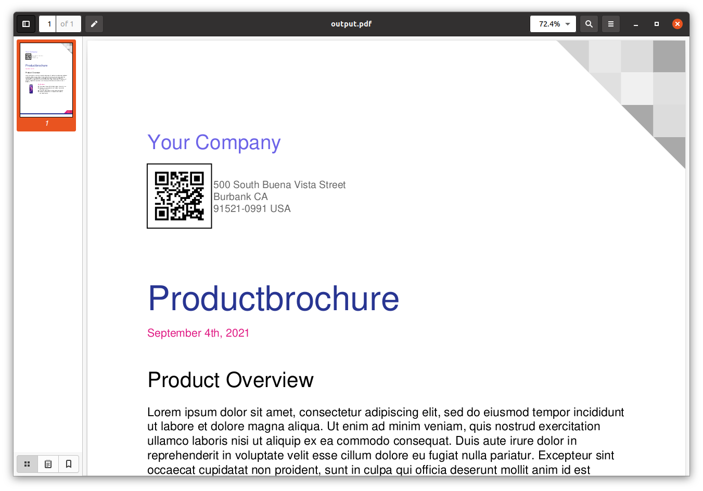

## 9.4 Creating a nonogram puzzle

Nonograms, also known as Hanjie, Paint by Numbers, Picross, Griddlers, and Pic-a-Pix, and by various other names, are picture logic puzzles in which cells in a grid must be colored or left blank according to numbers at the side of the grid to reveal a hidden picture. In this puzzle type, the numbers are a form of discrete tomography that measures how many unbroken lines of filled-in squares there are in any given row or column. For example, a clue of "4 8 3" would mean there are sets of four, eight, and three filled squares, in that order, with at least one blank square between successive sets.

We're going to define the final nonogram as a piece of ASCII art:

```python
#!chapter_009/src/snippet_025.py
ascii_art: str = """
■...........■..
■...........■..
■■■.■■■.■■■.■■■
■.■.■.■.■...■.■
■■■.■■■.■...■■■
"""


def main():
    pass


if __name__ == "__main__":
    main()
```

Now we need to turn this into a set of horizontal and vertical clues. 
The following code does just that!

```python
#!chapter_009/src/snippet_026.py
# new imports
import typing

ascii_art: str = """
■...........■..
■...........■..
■■■.■■■.■■■.■■■
■.■.■.■.■...■.■
■■■.■■■.■...■■■
"""


def calculate_horizontal_and_vertical_clues():

    # trim
    while ascii_art[0] == "\n":
        ascii_art = ascii_art[1:]
    while ascii_art[-1] == "\n":
        ascii_art = ascii_art[:-1]

    # horizontal clues
    horizontal_clues: typing.List[typing.List[int]] = []
    for row in ascii_art.split("\n"):
        prev_char: str = ""
        prev_count: int = 0
        row_clues: typing.List[int] = []
        for c in row:
            if c == prev_char:
                prev_count += 1
            else:
                if prev_char == "■":
                    row_clues.append(prev_count)
                prev_char = c
                prev_count = 1
        if prev_char == "■":
            row_clues.append(prev_count)
        horizontal_clues.append(row_clues)
    number_of_rows: int = len(horizontal_clues)

    # vertical clues
    number_of_cols: int = int(len(ascii_art) / number_of_rows)
    vertical_clues: typing.List[typing.List[int]] = []
    for col_index in range(0, number_of_cols):
        col = [ascii_art.split("\n")[i][col_index] for i in range(0, number_of_rows)]
        prev_char: str = ""
        prev_count: int = 0
        col_clues: typing.List[int] = []
        for c in col:
            if c == prev_char:
                prev_count += 1
            else:
                if prev_char == "■":
                    col_clues.append(prev_count)
                prev_char = c
                prev_count = 1
        if prev_char == "■":
            col_clues.append(prev_count)
        vertical_clues.append(col_clues)

    # padding for horizontal_clues
    max_number_of_horizontal_clues: int = max([len(x) for x in horizontal_clues])
    for row in horizontal_clues:
        while len(row) < max_number_of_horizontal_clues:
            row.insert(0, None)

    # padding for vertical_clues
    max_number_of_vertical_clues: int = max([len(x) for x in vertical_clues])
    for col in vertical_clues:
        while len(col) < max_number_of_vertical_clues:
            col.insert(0, None)

    # return
    return horizontal_clues, vertical_clues


def main():
    pass


if __name__ == "__main__":
    main()
```

For this PDF we're going to use a custom `Font`. Let's first download the `ttf`

```python
#!chapter_009/src/snippet_027.py
from borb.pdf.canvas.font.simple_font.true_type_font import TrueTypeFont
from borb.pdf.canvas.font.font import Font

# Download Font
import requests

with open("IndieFlower-Regular.ttf", "wb") as ffh:
    ffh.write(
        requests.get(
            "https://github.com/google/fonts/blob/main/ofl/indieflower/IndieFlower-Regular.ttf?raw=true",
            allow_redirects=True,
        ).content
    )
```

Now we can create a skeleton document containing our title and explanation blurb:

```python
#!chapter_009/src/snippet_028.py
import typing
import requests
from borb.pdf.canvas.font.simple_font.true_type_font import TrueTypeFont
from borb.pdf.canvas.font.font import Font

# new imports
from borb.pdf.document.document import Document
from borb.pdf.page.page import Page
from borb.pdf.pdf import PDF
from borb.pdf.canvas.layout.page_layout.multi_column_layout import SingleColumnLayout
from borb.pdf.canvas.layout.page_layout.page_layout import PageLayout
from borb.pdf.canvas.layout.text.paragraph import Paragraph
from borb.pdf.canvas.color.color import HexColor

from pathlib import Path
from decimal import Decimal

ascii_art: str = """
■...........■..
■...........■..
■■■.■■■.■■■.■■■
■.■.■.■.■...■.■
■■■.■■■.■...■■■
"""


def calculate_horizontal_and_vertical_clues():

    # trim
    while ascii_art[0] == "\n":
        ascii_art = ascii_art[1:]
    while ascii_art[-1] == "\n":
        ascii_art = ascii_art[:-1]

    # horizontal clues
    horizontal_clues: typing.List[typing.List[int]] = []
    for row in ascii_art.split("\n"):
        prev_char: str = ""
        prev_count: int = 0
        row_clues: typing.List[int] = []
        for c in row:
            if c == prev_char:
                prev_count += 1
            else:
                if prev_char == "■":
                    row_clues.append(prev_count)
                prev_char = c
                prev_count = 1
        if prev_char == "■":
            row_clues.append(prev_count)
        horizontal_clues.append(row_clues)
    number_of_rows: int = len(horizontal_clues)

    # vertical clues
    number_of_cols: int = int(len(ascii_art) / number_of_rows)
    vertical_clues: typing.List[typing.List[int]] = []
    for col_index in range(0, number_of_cols):
        col = [ascii_art.split("\n")[i][col_index] for i in range(0, number_of_rows)]
        prev_char: str = ""
        prev_count: int = 0
        col_clues: typing.List[int] = []
        for c in col:
            if c == prev_char:
                prev_count += 1
            else:
                if prev_char == "■":
                    col_clues.append(prev_count)
                prev_char = c
                prev_count = 1
        if prev_char == "■":
            col_clues.append(prev_count)
        vertical_clues.append(col_clues)

    # padding for horizontal_clues
    max_number_of_horizontal_clues: int = max([len(x) for x in horizontal_clues])
    for row in horizontal_clues:
        while len(row) < max_number_of_horizontal_clues:
            row.insert(0, None)

    # padding for vertical_clues
    max_number_of_vertical_clues: int = max([len(x) for x in vertical_clues])
    for col in vertical_clues:
        while len(col) < max_number_of_vertical_clues:
            col.insert(0, None)

    # return
    return horizontal_clues, vertical_clues


def download_custom_font():
    with open("IndieFlower-Regular.ttf", "wb") as ffh:
        ffh.write(
            requests.get(
                "https://github.com/google/fonts/blob/main/ofl/indieflower/IndieFlower-Regular.ttf?raw=true",
                allow_redirects=True,
            ).content
        )


def main():
    calculate_horizontal_and_vertical_clues()
    download_custom_font()

    # create empty Document
    pdf = Document()

    # create empty Page
    page = Page()

    # add Page to Document
    pdf.append_page(page)

    # create PageLayout
    layout: PageLayout = SingleColumnLayout(page)

    # add title
    layout.add(
        Paragraph(
            "Nonogram",
            font_color=HexColor("#19647E"),
            font=TrueTypeFont.true_type_font_from_file(Path("IndieFlower-Regular.ttf")),
            font_size=Decimal(20),
        )
    )

    # add explanation
    layout.add(
        Paragraph(
            """
    Nonograms, also known as Hanjie, Paint by Numbers, Picross, Griddlers, and Pic-a-Pix, and by various other names, 
    are picture logic puzzles in which cells in a grid must be colored or left blank according to numbers at the side of the grid to reveal a hidden picture. 
    In this puzzle type, the numbers are a form of discrete tomography that measures how many unbroken lines of filled-in squares there are in any given row or column. 
    For example, a clue of "4 8 3" would mean there are sets of four, eight, and three filled squares, in that order, with at least one blank square between successive sets.
                        """,
            font_color=HexColor("#28AFB0"),
        )
    )


if __name__ == "__main__":
    main()
```

We're going to represent the nonogram as a `Table`.
The following code builds a `FixedColumnWidthTable` from the clues we defined earlier.

We're going to start by defining a helper-method to build an empty `TableCell` object.

```python
#!chapter_009/src/snippet_029.py
# new imports
from borb.pdf.canvas.layout.table.table import TableCell


def empty_cell_without_borders():
    return TableCell(
        Paragraph(" "),
        border_top=False,
        border_right=False,
        border_bottom=False,
        border_left=False,
    )
```

And now we can get on with building the `Table`:

```python
#!chapter_009/src/snippet_030.py
import typing
import requests
from borb.pdf.canvas.font.simple_font.true_type_font import TrueTypeFont
from borb.pdf.canvas.font.font import Font
from borb.pdf.document.document import Document
from borb.pdf.page.page import Page
from borb.pdf.pdf import PDF
from borb.pdf.canvas.layout.page_layout.multi_column_layout import SingleColumnLayout
from borb.pdf.canvas.layout.page_layout.page_layout import PageLayout
from borb.pdf.canvas.layout.text.paragraph import Paragraph
from borb.pdf.canvas.color.color import HexColor
from borb.pdf.canvas.layout.table.table import TableCell

# new imports
from borb.pdf.canvas.layout.table.fixed_column_width_table import FixedColumnWidthTable
from borb.pdf.canvas.layout.layout_element import Alignment

from pathlib import Path
from decimal import Decimal

ascii_art: str = """
■...........■..
■...........■..
■■■.■■■.■■■.■■■
■.■.■.■.■...■.■
■■■.■■■.■...■■■
"""


def calculate_horizontal_and_vertical_clues():

    # trim
    global ascii_art
    while ascii_art[0] == "\n":
        ascii_art = ascii_art[1:]
    while ascii_art[-1] == "\n":
        ascii_art = ascii_art[:-1]

    # horizontal clues
    horizontal_clues: typing.List[typing.List[int]] = []
    for row in ascii_art.split("\n"):
        prev_char: str = ""
        prev_count: int = 0
        row_clues: typing.List[int] = []
        for c in row:
            if c == prev_char:
                prev_count += 1
            else:
                if prev_char == "■":
                    row_clues.append(prev_count)
                prev_char = c
                prev_count = 1
        if prev_char == "■":
            row_clues.append(prev_count)
        horizontal_clues.append(row_clues)
    number_of_rows: int = len(horizontal_clues)

    # vertical clues
    number_of_cols: int = int(len(ascii_art) / number_of_rows)
    vertical_clues: typing.List[typing.List[int]] = []
    for col_index in range(0, number_of_cols):
        col = [ascii_art.split("\n")[i][col_index] for i in range(0, number_of_rows)]
        prev_char: str = ""
        prev_count: int = 0
        col_clues: typing.List[int] = []
        for c in col:
            if c == prev_char:
                prev_count += 1
            else:
                if prev_char == "■":
                    col_clues.append(prev_count)
                prev_char = c
                prev_count = 1
        if prev_char == "■":
            col_clues.append(prev_count)
        vertical_clues.append(col_clues)

    # padding for horizontal_clues
    max_number_of_horizontal_clues: int = max([len(x) for x in horizontal_clues])
    for row in horizontal_clues:
        while len(row) < max_number_of_horizontal_clues:
            row.insert(0, None)

    # padding for vertical_clues
    max_number_of_vertical_clues: int = max([len(x) for x in vertical_clues])
    for col in vertical_clues:
        while len(col) < max_number_of_vertical_clues:
            col.insert(0, None)

    # return
    return (
        horizontal_clues,
        max_number_of_horizontal_clues,
        vertical_clues,
        max_number_of_vertical_clues,
    )


def download_custom_font():
    with open("IndieFlower-Regular.ttf", "wb") as ffh:
        ffh.write(
            requests.get(
                "https://github.com/google/fonts/blob/main/ofl/indieflower/IndieFlower-Regular.ttf?raw=true",
                allow_redirects=True,
            ).content
        )


def empty_cell_without_borders():
    return TableCell(
        Paragraph(" "),
        border_top=False,
        border_right=False,
        border_bottom=False,
        border_left=False,
    )


def main():
    (
        horizontal_clues,
        max_number_of_horizontal_clues,
        vertical_clues,
        max_number_of_vertical_clues,
    ) = calculate_horizontal_and_vertical_clues()

    # number_of_rows, number_of_cols
    number_of_rows: int = len(horizontal_clues)
    number_of_cols: int = int(len(ascii_art) / number_of_rows)

    download_custom_font()

    # create empty Document
    pdf = Document()

    # create empty Page
    page = Page()

    # add Page to Document
    pdf.append_page(page)

    # create PageLayout
    layout: PageLayout = SingleColumnLayout(page)

    # add title
    layout.add(
        Paragraph(
            "Nonogram",
            font_color=HexColor("#19647E"),
            font=TrueTypeFont.true_type_font_from_file(Path("IndieFlower-Regular.ttf")),
            font_size=Decimal(20),
        )
    )

    # add explanation
    layout.add(
        Paragraph(
            """
    Nonograms, also known as Hanjie, Paint by Numbers, Picross, Griddlers, and Pic-a-Pix, and by various other names, 
    are picture logic puzzles in which cells in a grid must be colored or left blank according to numbers at the side of the grid to reveal a hidden picture. 
    In this puzzle type, the numbers are a form of discrete tomography that measures how many unbroken lines of filled-in squares there are in any given row or column. 
    For example, a clue of "4 8 3" would mean there are sets of four, eight, and three filled squares, in that order, with at least one blank square between successive sets.
                        """,
            font_color=HexColor("#28AFB0"),
        )
    )

    # build table to represent nonogram
    table: FixedColumnWidthTable = FixedColumnWidthTable(
        number_of_rows=max_number_of_vertical_clues + number_of_rows,
        number_of_columns=max_number_of_horizontal_clues + number_of_cols,
    )

    for i in range(0, max_number_of_vertical_clues):
        for _ in range(0, max_number_of_horizontal_clues):
            table.add(empty_cell_without_borders())
        for j in range(0, len(vertical_clues)):
            if vertical_clues[j][i] is None:
                table.add(empty_cell_without_borders())
            else:
                table.add(
                    TableCell(
                        Paragraph(
                            str(vertical_clues[j][i]),
                            horizontal_alignment=Alignment.CENTERED,
                        ),
                        border_top=False,
                        border_right=False,
                        border_bottom=False,
                        border_left=False,
                    )
                )

    for i in range(0, len(horizontal_clues)):
        for j in horizontal_clues[i]:
            if j is None:
                table.add(empty_cell_without_borders())
            else:
                table.add(
                    TableCell(
                        Paragraph(str(j), horizontal_alignment=Alignment.CENTERED),
                        border_top=False,
                        border_right=False,
                        border_bottom=False,
                        border_left=False,
                    )
                )
        for _ in range(0, number_of_cols):
            table.add(Paragraph(" "))

    table.set_padding_on_all_cells(Decimal(2), Decimal(2), Decimal(2), Decimal(2))

    # add Table
    layout.add(table)


if __name__ == "__main__":
    main()
```

Finally, we can store the `PDF`:

```python
#!chapter_009/src/snippet_031.py
import typing
import requests
from borb.pdf.canvas.font.simple_font.true_type_font import TrueTypeFont
from borb.pdf.canvas.font.font import Font
from borb.pdf.document.document import Document
from borb.pdf.page.page import Page
from borb.pdf.pdf import PDF
from borb.pdf.canvas.layout.page_layout.multi_column_layout import SingleColumnLayout
from borb.pdf.canvas.layout.page_layout.page_layout import PageLayout
from borb.pdf.canvas.layout.text.paragraph import Paragraph
from borb.pdf.canvas.color.color import HexColor
from borb.pdf.canvas.layout.table.table import TableCell

# new imports
from borb.pdf.canvas.layout.table.fixed_column_width_table import FixedColumnWidthTable
from borb.pdf.canvas.layout.layout_element import Alignment

from pathlib import Path
from decimal import Decimal

ascii_art: str = """
■...........■..
■...........■..
■■■.■■■.■■■.■■■
■.■.■.■.■...■.■
■■■.■■■.■...■■■
"""


def calculate_horizontal_and_vertical_clues():

    # trim
    global ascii_art
    while ascii_art[0] == "\n":
        ascii_art = ascii_art[1:]
    while ascii_art[-1] == "\n":
        ascii_art = ascii_art[:-1]

    # horizontal clues
    horizontal_clues: typing.List[typing.List[int]] = []
    for row in ascii_art.split("\n"):
        prev_char: str = ""
        prev_count: int = 0
        row_clues: typing.List[int] = []
        for c in row:
            if c == prev_char:
                prev_count += 1
            else:
                if prev_char == "■":
                    row_clues.append(prev_count)
                prev_char = c
                prev_count = 1
        if prev_char == "■":
            row_clues.append(prev_count)
        horizontal_clues.append(row_clues)
    number_of_rows: int = len(horizontal_clues)

    # vertical clues
    number_of_cols: int = int(len(ascii_art) / number_of_rows)
    vertical_clues: typing.List[typing.List[int]] = []
    for col_index in range(0, number_of_cols):
        col = [ascii_art.split("\n")[i][col_index] for i in range(0, number_of_rows)]
        prev_char: str = ""
        prev_count: int = 0
        col_clues: typing.List[int] = []
        for c in col:
            if c == prev_char:
                prev_count += 1
            else:
                if prev_char == "■":
                    col_clues.append(prev_count)
                prev_char = c
                prev_count = 1
        if prev_char == "■":
            col_clues.append(prev_count)
        vertical_clues.append(col_clues)

    # padding for horizontal_clues
    max_number_of_horizontal_clues: int = max([len(x) for x in horizontal_clues])
    for row in horizontal_clues:
        while len(row) < max_number_of_horizontal_clues:
            row.insert(0, None)

    # padding for vertical_clues
    max_number_of_vertical_clues: int = max([len(x) for x in vertical_clues])
    for col in vertical_clues:
        while len(col) < max_number_of_vertical_clues:
            col.insert(0, None)

    # return
    return (
        horizontal_clues,
        max_number_of_horizontal_clues,
        vertical_clues,
        max_number_of_vertical_clues,
    )


def download_custom_font():
    with open("IndieFlower-Regular.ttf", "wb") as ffh:
        ffh.write(
            requests.get(
                "https://github.com/google/fonts/blob/main/ofl/indieflower/IndieFlower-Regular.ttf?raw=true",
                allow_redirects=True,
            ).content
        )


def empty_cell_without_borders():
    return TableCell(
        Paragraph(" "),
        border_top=False,
        border_right=False,
        border_bottom=False,
        border_left=False,
    )


def main():
    (
        horizontal_clues,
        max_number_of_horizontal_clues,
        vertical_clues,
        max_number_of_vertical_clues,
    ) = calculate_horizontal_and_vertical_clues()

    # number_of_rows, number_of_cols
    number_of_rows: int = len(horizontal_clues)
    number_of_cols: int = int(len(ascii_art) / number_of_rows)

    download_custom_font()

    # create empty Document
    pdf = Document()

    # create empty Page
    page = Page()

    # add Page to Document
    pdf.append_page(page)

    # create PageLayout
    layout: PageLayout = SingleColumnLayout(page)

    # add title
    layout.add(
        Paragraph(
            "Nonogram",
            font_color=HexColor("#19647E"),
            font=TrueTypeFont.true_type_font_from_file(Path("IndieFlower-Regular.ttf")),
            font_size=Decimal(20),
        )
    )

    # add explanation
    layout.add(
        Paragraph(
            """
    Nonograms, also known as Hanjie, Paint by Numbers, Picross, Griddlers, and Pic-a-Pix, and by various other names, 
    are picture logic puzzles in which cells in a grid must be colored or left blank according to numbers at the side of the grid to reveal a hidden picture. 
    In this puzzle type, the numbers are a form of discrete tomography that measures how many unbroken lines of filled-in squares there are in any given row or column. 
    For example, a clue of "4 8 3" would mean there are sets of four, eight, and three filled squares, in that order, with at least one blank square between successive sets.
                        """,
            font_color=HexColor("#28AFB0"),
        )
    )

    # build table to represent nonogram
    table: FixedColumnWidthTable = FixedColumnWidthTable(
        number_of_rows=max_number_of_vertical_clues + number_of_rows,
        number_of_columns=max_number_of_horizontal_clues + number_of_cols,
    )

    for i in range(0, max_number_of_vertical_clues):
        for _ in range(0, max_number_of_horizontal_clues):
            table.add(empty_cell_without_borders())
        for j in range(0, len(vertical_clues)):
            if vertical_clues[j][i] is None:
                table.add(empty_cell_without_borders())
            else:
                table.add(
                    TableCell(
                        Paragraph(
                            str(vertical_clues[j][i]),
                            horizontal_alignment=Alignment.CENTERED,
                        ),
                        border_top=False,
                        border_right=False,
                        border_bottom=False,
                        border_left=False,
                    )
                )

    for i in range(0, len(horizontal_clues)):
        for j in horizontal_clues[i]:
            if j is None:
                table.add(empty_cell_without_borders())
            else:
                table.add(
                    TableCell(
                        Paragraph(str(j), horizontal_alignment=Alignment.CENTERED),
                        border_top=False,
                        border_right=False,
                        border_bottom=False,
                        border_left=False,
                    )
                )
        for _ in range(0, number_of_cols):
            table.add(Paragraph(" "))

    table.set_padding_on_all_cells(Decimal(2), Decimal(2), Decimal(2), Decimal(2))

    # add Table
    layout.add(table)

    # write Document
    with open("output.pdf", "wb") as pdf_file_handle:
        PDF.dumps(pdf_file_handle, pdf)


if __name__ == "__main__":
    main()
```

That should look somewhat like this:

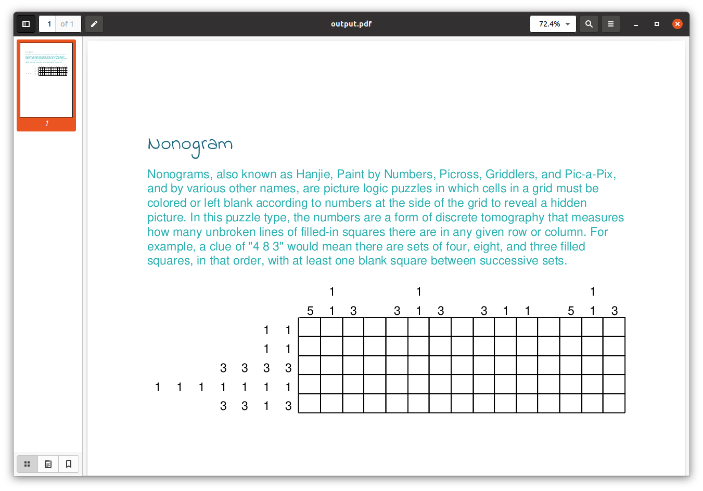

## 9.5 Building a working calculator inside a PDF

We are going to create a method to add some geometric artwork to the upper right corner of a `Page`. This code is not really doing difficult things, it just deals with coordinates and math a bit. 

```python
#!chapter_009/src/snippet_032.py
# new imports
from borb.pdf.canvas.layout.shape.shape import Shape
from decimal import Decimal
from borb.pdf.canvas.color.color import HexColor, X11Color
from borb.pdf.canvas.geometry.rectangle import Rectangle
from borb.pdf.page.page_size import PageSize
from borb.pdf.page.page import Page
import typing
import random


def add_gray_artwork_to_upper_right_corner(page: Page) -> None:
    """
    This method will add a gray artwork of squares and triangles in the upper right corner
    of the given Page
    """

    # define a list of gray colors
    grays: typing.List[HexColor] = [
        HexColor("A9A9A9"),
        HexColor("D3D3D3"),
        HexColor("DCDCDC"),
        HexColor("E0E0E0"),
        HexColor("E8E8E8"),
        HexColor("F0F0F0"),
    ]

    # we're going to use the size of the page later on,
    # so perhaps it's a good idea to retrieve it now
    ps: typing.Tuple[Decimal, Decimal] = PageSize.A4_PORTRAIT.value

    # now we'll write N triangles in the upper right corner
    # we'll later fill the remaining space with squares
    N: int = 4
    M: Decimal = Decimal(32)
    for i in range(0, N):
        x: Decimal = ps[0] - N * M + i * M
        y: Decimal = ps[1] - (i + 1) * M
        rg: HexColor = random.choice(grays)
        Shape(
            points=[(x + M, y), (x + M, y + M), (x, y + M)],
            stroke_color=rg,
            fill_color=rg,
        ).layout(page, Rectangle(x, y, M, M))

    # now we can fill up the remaining space with squares
    for i in range(0, N - 1):
        for j in range(0, N - 1):
            if j > i:
                continue
            x: Decimal = ps[0] - (N - 1) * M + i * M
            y: Decimal = ps[1] - (j + 1) * M
            rg: HexColor = random.choice(grays)
            Shape(
                points=[(x, y), (x + M, y), (x + M, y + M), (x, y + M)],
                stroke_color=rg,
                fill_color=rg,
            ).layout(page, Rectangle(x, y, M, M))
```

Similarly, I want to add some geometric artwork to the bottom of the page to balance things out a bit. I'm going to write another separate method for that.

```python
#!chapter_009/src/snippet_033.py
# new imports
from borb.pdf.canvas.line_art.line_art_factory import LineArtFactory


def add_colored_artwork_to_bottom_right_corner(page: Page) -> None:
    """
    This method will add a blue/purple artwork of lines and squares to the bottom right corner
    of the given Page
    """
    ps: typing.Tuple[Decimal, Decimal] = PageSize.A4_PORTRAIT.value

    # square
    Shape(
        points=[(ps[0] - 32, 40), (ps[0], 40), (ps[0], 40 + 32), (ps[0] - 32, 40 + 32)],
        stroke_color=HexColor("f1cd2e"),
        fill_color=HexColor("f1cd2e"),
    ).layout(page, Rectangle(ps[0] - 32, 40, 32, 32))

    # square
    Shape(
        points=[
            (ps[0] - 64, 40),
            (ps[0] - 32, 40),
            (ps[0] - 32, 40 + 32),
            (ps[0] - 64, 40 + 32),
        ],
        stroke_color=HexColor("0b3954"),
        fill_color=HexColor("0b3954"),
    ).layout(page, Rectangle(ps[0] - 64, 40, 32, 32))

    # triangle
    Shape(
        points=[(ps[0] - 96, 40), (ps[0] - 64, 40), (ps[0] - 64, 40 + 32)],
        stroke_color=HexColor("a5ffd6"),
        fill_color=HexColor("a5ffd6"),
    ).layout(page, Rectangle(ps[0] - 96, 40, 32, 32))

    # line
    r: Rectangle = Rectangle(Decimal(0), Decimal(32), ps[0], Decimal(8))
    Shape(
        points=LineArtFactory.rectangle(r),
        stroke_color=HexColor("56cbf9"),
        fill_color=HexColor("56cbf9"),
    ).layout(page, r)
```

Now we're going to create a method that adds the image of a calculator to our `Page`. Here we are using absolute layout, since we want to make absolutely sure that our `Image` is located at the same coordinates every time (even if we were to change the text around it).

```python
#!chapter_009/src/snippet_034.py
from borb.pdf.canvas.layout.image.image import Image
from decimal import Decimal


def add_calculator_image(page: Page):
    calculator_img = Image(
        "https://www.shopcore.nl/pub/media/catalog/product/cache/49cebce0f131f74df9ad2e5adc64fe79/t/i/ti-1726-1.jpg",
        width=Decimal(128),
        height=Decimal(128),
    )
    calculator_img.layout(
        page,
        Rectangle(
            Decimal(595 / 2 - 128 / 2),
            Decimal(842 / 2 + 128 / 2),
            Decimal(600),
            Decimal(128),
        ),
    )
```

Next up we will be adding a lot of "buttons" (they are actually annotations with associated javascript actions). To make it a bit easier on ourselves we'll separate this logic into its own method.

```python
#!chapter_009/src/snippet_035.py
from borb.io.read.types import Name
from borb.io.read.types import String
from borb.pdf.canvas.layout.annotation.remote_go_to_annotation import (
    RemoteGoToAnnotation,
)


def add_invisible_button(r: Rectangle, javascript: str):
    # the next line (commented out) adds a rectangular annotation with red border
    # this makes it a lot easier to debug the calculator
    # page.append_annotation(SquareAnnotation(r, stroke_color=HexColor("ff0000"), fill_color=None))
    page.append_annotation(RemoteGoToAnnotation(r, "https://www.borbpdf.com"))
    page[Name("Annots")][-1][Name("A")][Name("S")] = Name("JavaScript")
    page[Name("Annots")][-1][Name("A")][Name("JS")] = String(javascript)
```

Now we are ready to add all the buttons, and have them call our main Javascript (which will be inserted later on).

```python
#!chapter_009/src/snippet_036.py
def add_action_annotations(page: Page):
    add_invisible_button(
        Rectangle(Decimal(275), Decimal(492), Decimal(13), Decimal(13)),
        "process_token('0')",
    )
    add_invisible_button(
        Rectangle(Decimal(291), Decimal(492), Decimal(13), Decimal(13)),
        "process_token('.')",
    )
    add_invisible_button(
        Rectangle(Decimal(307), Decimal(492), Decimal(13), Decimal(13)),
        "process_token('=')",
    )

    add_invisible_button(
        Rectangle(Decimal(275), Decimal(507), Decimal(13), Decimal(13)),
        "process_token('1')",
    )
    add_invisible_button(
        Rectangle(Decimal(291), Decimal(507), Decimal(13), Decimal(13)),
        "process_token('2')",
    )
    add_invisible_button(
        Rectangle(Decimal(307), Decimal(507), Decimal(13), Decimal(13)),
        "process_token('3')",
    )

    add_invisible_button(
        Rectangle(Decimal(275), Decimal(522), Decimal(13), Decimal(13)),
        "process_token('4')",
    )
    add_invisible_button(
        Rectangle(Decimal(291), Decimal(522), Decimal(13), Decimal(13)),
        "process_token('5')",
    )
    add_invisible_button(
        Rectangle(Decimal(307), Decimal(522), Decimal(13), Decimal(13)),
        "process_token('6')",
    )

    add_invisible_button(
        Rectangle(Decimal(275), Decimal(538), Decimal(13), Decimal(13)),
        "process_token('7')",
    )
    add_invisible_button(
        Rectangle(Decimal(291), Decimal(538), Decimal(13), Decimal(13)),
        "process_token('8')",
    )
    add_invisible_button(
        Rectangle(Decimal(307), Decimal(538), Decimal(13), Decimal(13)),
        "process_token('9')",
    )

    add_invisible_button(
        Rectangle(Decimal(324), Decimal(551), Decimal(13), Decimal(12)),
        "process_token('/')",
    )
    add_invisible_button(
        Rectangle(Decimal(324), Decimal(536), Decimal(13), Decimal(13)),
        "process_token('x')",
    )
    add_invisible_button(
        Rectangle(Decimal(324), Decimal(520), Decimal(13), Decimal(13)),
        "process_token('-')",
    )
    add_invisible_button(
        Rectangle(Decimal(324), Decimal(497), Decimal(13), Decimal(21)),
        "process_token('+')",
    )

    add_invisible_button(
        Rectangle(Decimal(257), Decimal(541), Decimal(13), Decimal(21)),
        "process_token('AC')",
    )
```

This part is easy, we add document level Javascript to our PDF. This script has everything in it to make our calculator actually work.

```python
#!chapter_009/src/snippet_037.py
from borb.io.read.types import Decimal as bDecimal
from borb.io.read.types import String
from borb.io.read.types import Stream
from borb.io.read.types import Dictionary
from borb.io.read.types import List
from borb.pdf.document.document import Document


def add_document_level_javascript(doc: Document):
    # build global_js_stream
    global_js_stream = Stream()
    global_js_stream[Name("Type")] = Name("JavaScript")
    global_js_stream[
        Name("DecodedBytes")
    ] = b"""
var state = 'START';
var arg1 = 0;
var arg2 = 0;
var disp = '';
var oper = '';

function to_string(f){
	if(f > 99999999){ return '99999999'; }
	if(f < -99999999){ return '-99999999'; }
	x = f.toString();
  if(x.length > 8){ x = x.substring(0, 8);}
	return x;	
}

function is_number(token){
	return token == '0' || token == '1' || token == '2' || token == '3' || token == '4' || token == '5' || token == '6' || token == '7'  || token == '8' || token == '9';
}

function is_binary_operator(token){
	return token == '+' || token == '-' || token == 'x' || token == '/';
}

function apply_operator(a1, a2, o){
	if(o == '+'){ return a1 + a2; }
	if(o == '-'){ return a1 - a2; }
	if(o == 'x'){ return a1 * a2; }
	if(o == '/'){ 
		if(a2 == 0){
			return 0;
		}
		return a1 / a2; 
	}
}

function process_token(token){
	if(token == 'AC'){
		state = 'START';
		arg1 = 0;
		arg2 = 0;
		disp = '';
		oper = '';
    this.getField("field-000").value = disp;
		return;
	}
	if(state == 'START'){
		if(token == '.'){
			disp = '0.';
      this.getField("field-000").value = disp;
			state = 'ARG1_FLOAT';
			return;
		}
		if(is_number(token)){
			disp = token;
      this.getField("field-000").value = disp;
			state = 'ARG1'
			return;
		}
	}
	/* 
	 * ARG1
	 * arg1 is being built
	 */
	if(state == 'ARG1'){
		if(token == '.'){
			disp += '.';
      this.getField("field-000").value = disp;
			state = 'ARG1_FLOAT';
			return;
		}
		if(is_number(token)){
			disp += token;
      this.getField("field-000").value = disp;
			return;
		}
		if(is_binary_operator(token)){
			arg1 = parseFloat(disp);
			disp = '';
      this.getField("field-000").value = disp;
			oper = token;
			state = 'OPERATOR'
			return;
		}
	}
	/* 
	 * ARG1_FLOAT
	 * arg1 is being built, and a decimal point has been entered
	 */
	if(state == 'ARG1_FLOAT'){
		if(is_number(token)){
			disp += token;
      this.getField("field-000").value = disp;
			return;
		}
		if(is_binary_operator(token)){
			arg1 = parseFloat(disp);
			disp = '';
      this.getField("field-000").value = disp;
			oper = token;
			state = 'OPERATOR'
			return;
		}
	}
	/* 
	 * BINARY_OPERATOR
	 * a binary operator was entered
	 */
	if(state == 'OPERATOR'){
		if(token == '.'){
			disp = '0.';
      this.getField("field-000").value = disp;
			state = 'ARG2_FLOAT';
			return;
		}
		if(is_number(token)){
			disp = token;
      this.getField("field-000").value = disp;
			state = 'ARG2'
			return;
		}
	}
	/* 
	 * ARG2
	 * arg2 is being built
	 */
	if(state == 'ARG2'){
		if(token == '.'){
			disp += '.';
      this.getField("field-000").value = disp;
			state = 'ARG2_FLOAT';
			return;
		}
		if(is_number(token)){
			disp += token;
      this.getField("field-000").value = disp;
			return;
		}
		if(is_binary_operator(token)){
			arg1 = apply_operator(arg1, parseFloat(disp), oper);
			disp = to_string(arg1);
      this.getField("field-000").value = disp;
			oper = token;
			state = 'OPERATOR'
			return;
		}
		if(token == '='){
			arg2 = parseFloat(disp);
			disp = to_string(apply_operator(arg1, arg2, oper));
      this.getField("field-000").value = disp;
			state = 'EQUALS';
			return;
		}
	}
	if(state == 'ARG2_FLOAT'){
		if(is_number(token)){
			disp += token;
      this.getField("field-000").value = disp;
			return;
		}
		if(is_binary_operator(token)){
			arg1 = apply_operator(arg1, parseFloat(disp), oper);
			disp = to_string(arg1);
      this.getField("field-000").value = disp;
			oper = token;
			state = 'OPERATOR'
			return;
		}
		if(token == '='){
			arg2 = parseFloat(disp);
			disp = to_string(apply_operator(arg1, arg2, oper));
      this.getField("field-000").value = disp;
			state = 'EQUALS';
			return;
		}
	}	
	if(state == 'EQUALS'){
		if(token == '='){
			disp = to_string(apply_operator(parseFloat(disp), arg2, oper));
      this.getField("field-000").value = disp;
			return;
		}
		if(token == '.'){
			disp = '0.';
      this.getField("field-000").value = disp;
			state = 'ARG1_FLOAT';
			return;
		}
		if(is_number(token)){
			disp = token;
      this.getField("field-000").value = disp;
			state = 'ARG1';
			return;
		}
		if(is_binary_operator(token)){
			arg1 = parseFloat(disp);
			oper = token;
			state = 'OPERATOR';
			return;
		}
	}
}
this.getField("field-000").fillColor = color.transparent;
this.getField("field-000").textFont = "Courier";
app.runtimeHighlightColor = ["RGB", 47/255, 53/255, 51/255];
"""

    global_js_stream[Name("Filter")] = Name("FlateDecode")

    # build global js dictionary
    global_js_dictionary = Dictionary()
    global_js_dictionary[Name("S")] = Name("JavaScript")
    global_js_dictionary[Name("JS")] = global_js_stream

    # build name tree
    root = doc["XRef"]["Trailer"]["Root"]
    root[Name("Names")] = Dictionary()
    names = root["Names"]
    names[Name("JavaScript")] = Dictionary()
    names["JavaScript"][Name("Kids")] = List()

    # build leaf
    kids_01 = Dictionary()
    kids_01[Name("Limits")] = List()
    kids_01["Limits"].append(String("js-000"))
    kids_01["Limits"].append(String("js-000"))
    kids_01[Name("Names")] = List()
    kids_01["Names"].append(String("js-000"))
    kids_01["Names"].append(global_js_dictionary)

    names["JavaScript"]["Kids"].append(kids_01)
```

In order to display the result of the calculations, we need to add a `TextField` that the JavaScript can modify.

```python
#!chapter_009/src/snippet_038.py
from borb.pdf.canvas.layout.forms.text_field import TextField


def add_display(page: Page):
    r0 = Rectangle(Decimal(264), Decimal(587), Decimal(65), Decimal(15))
    Shape(
        LineArtFactory.rectangle(r0),
        stroke_color=HexColor("7e838e"),
        fill_color=HexColor("7e838e"),
    ).layout(page, r0)

    r1 = Rectangle(Decimal(264), Decimal(587), Decimal(65), Decimal(15))
    display_field = TextField(value="", font_size=Decimal(13))
    display_field.layout(page, r1)
```

Now we can build our `Document`

```python
#!chapter_009/src/snippet_039.py
from borb.pdf.document.document import Document
from borb.pdf.page.page import Page
from borb.pdf.pdf import PDF
from borb.pdf.canvas.geometry.rectangle import Rectangle
from borb.pdf.canvas.layout.page_layout.multi_column_layout import MultiColumnLayout
from borb.pdf.canvas.layout.page_layout.page_layout import PageLayout
from borb.pdf.canvas.layout.text.paragraph import Paragraph
from borb.pdf.canvas.color.color import HexColor
from borb.pdf.canvas.layout.image.barcode import Barcode, BarcodeType

from decimal import Decimal
from pathlib import Path


def main():

    # create Document
    doc: Document = Document()

    # create Page
    page: Page = Page()
    doc.append_page(page)

    # add javascript
    add_document_level_javascript(doc)

    # add artwork
    add_gray_artwork_to_upper_right_corner(page)
    add_colored_artwork_to_bottom_right_corner(page)

    # add Image
    add_calculator_image(page)
    add_action_annotations(page)

    # add TextField
    add_display(page)

    # create layout
    layout: PageLayout = MultiColumnLayout(page, 2)

    # add first Paragraph
    layout.add(
        Paragraph(
            "Javascript in PDF",
            font="Helvetica-Bold",
            font_size=Decimal(20),
            font_color=HexColor("56cbf9"),
        )
    )

    # add second paragraph
    layout.add(
        Paragraph(
            """
    You can cause an action to occur when a bookmark or link is clicked, or when a page is viewed. 
    For example, you can use links and bookmarks to jump to different locations in a document, 
    execute commands from a menu, and perform other actions. """
        )
    )

    # add third Paragraph
    # we are explictly adding the newlines ourselves to ensure the text
    # breaks nicely around the outline of the calculator
    layout.add(
        Paragraph(
            """To enhance the interactive qual-
    ity of a document, you can spec-
    ify actions, such as changing the 
    zoom value, to occur when a page 
    is opened or closed.""",
            respect_newlines_in_text=True,
        )
    )

    # add fourth Paragraph
    layout.add(Paragraph("Trigger Types", font="Helvetica-Bold", font_size=Decimal(14)))

    # add fifth Paragraph
    layout.add(
        Paragraph(
            "Triggers determine how actions are activated in media clips, pages, and form fields. For example, you can specify a movie or sound clip to play when a page is opened or closed. The available options depend on the specified page element."
        )
    )

    # add sixth Paragraph
    layout.add(Paragraph("Javascript", font="Helvetica-Bold", font_size=Decimal(14)))

    # add seventh Paragraph
    layout.add(
        Paragraph(
            """
    The JavaScript language was developed by Netscape Communications as a means to create interactive web pages more easily. Adobe has enhanced JavaScript so that you can easily integrate this level of interactivity into your PDF documents.
    You can invoke JavaScript code using actions associated with bookmarks, links, and pages. You can set Document Actions which lets you create document-level JavaScript actions that apply to the entire document."""
        )
    )

    # add final Paragraph
    Paragraph(
        "With enough buttons and Javascript, you could even make a functional calculator inside a PDF!",
        font="Courier",
        font_size=Decimal(8),
        padding_left=Decimal(5),
        border_left=True,
    ).layout(page, Rectangle(Decimal(350), Decimal(450), Decimal(200), Decimal(100)))

    # add QR code
    Barcode(
        "https://www.borb-pdf.com",
        type=BarcodeType.QR,
        width=Decimal(64),
        height=Decimal(64),
    ).layout(
        page, Rectangle(Decimal(595 - 64 - 15), Decimal(84), Decimal(64), Decimal(64))
    )

    # store PDF
    with open(Path("output.pdf"), "wb") as pdf_file_handle:
        PDF.dumps(pdf_file_handle, doc)
```

Look at the stunning PDF you made:

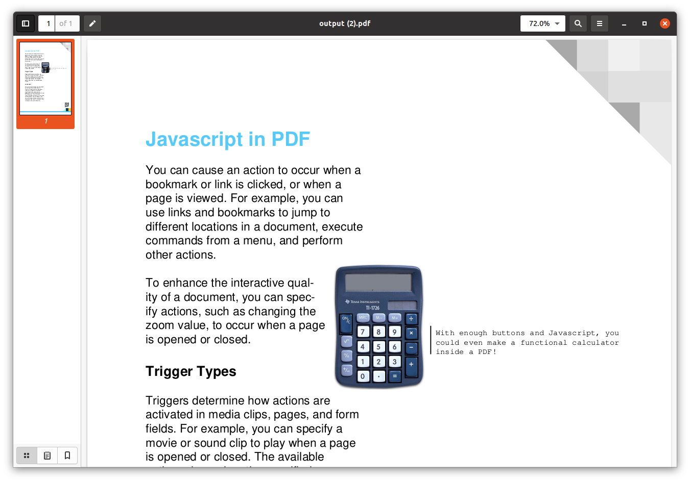

## 9.6 Conclusion

This section was all about wrapping up your knowledge with some practical examples.
I hope you enjoyed working through the examples.
