# 2. Creating PDF documents from scratch


<div style="page-break-before: always;"></div>

## 2.1 Introducing `borb` and PDF

`borb` was born out of frustration at the current state-of-the-art with regards to PDF and Python:

- A complete lack of documentation in existing libraries
- A lack of examples for existing libraries
- PDF functionality being very fragmented over the existing libraries: some libraries can create (basic) PDF document, but can not read PDF documents, or vice versa. Some libraries can only merge/split documents, etc
- Obfuscated, or unclear code (I saw one library being offered as one giant python file, rather than following the accepted object-oriented paradigm)

I wanted a library that was:

- Fully documented
- Fully tested
- Capable of reading, writing, editing PDF documents
- Puts the user first. No need to know the PDF specification, the library will handle all the heavy lifting for you.

Although `borb` is still a work in progress, and still growing and improving, I think it is clear from the existing code base that the course of the library has been set. 

<div style="page-break-before: always;"></div>

## 2.2 Steps to creating a PDF using `borb`

Typically, creating a PDF document using `borb` follows the same basic steps:

1. An empty `Document` object is created, to represent the entire PDF
2. A `Page` is created, and added to the `Document`
3. A sub-class of `PageLayout` is created to ensure content is added to the `Page` at the right position
4. Content is added to the `Page` using the `add` method of the `PageLayout`
5. The `Document` is written to disk

I'll explore all these steps in more detail in the coming sections.

### 2.2.1 Creating an empty `Document` instance

`borb` represents a PDF as a JSON-like object, a collection of nested dictionaries, arrays and primitives. Creating and empty `Document` amounts to creating an empty `dict` and filling it with the right keys to ensure the serialization will not hang.

```python
from borb.pdf.document import Document

def main():
    doc: Document = Document()

    
if __name__ == "__main__":
    main()
```

If you were to look at the class definition of `Document` you'd see:

```python  
class Document(Dictionary):  
    """
    This class represents a PDF document 
    """
    
    ... etc ...
 ```

`Dictionary` is defined in `types.py` as:

```python
class Dictionary(dict):  
    """
    A dictionary object is an associative table containing pairs of objects, known as the dictionary’s entries. The first element of each entry is the key and the second element is the value. The key shall be a name (unlike dictionary keys in PostScript, which may be objects of any type). The value may be any kind of object, including another dictionary. A dictionary entry whose value is null (see 7.3.9, "Null Object") shall be treated the same as if the entry does not exist. (This differs from PostScript, where null behaves like any other object as the value of a dictionary entry.) The number of entries in a dictionary shall be subject to an implementation limit; see Annex C. A dictionary may have zero entries.  
    The entries in a dictionary represent an associative table and as such shall be unordered even though an arbitrary order may be imposed upon them when written in a file. That ordering shall be ignored. 
    """

    ... etc ...
```

The constructor of `Dictionary` does call `add_base_methods` which enriches the standard `dict` (or any type it is applied to really) with a few extra methods. These methods mostly deal with being able to build hierarchies (adding children, setting parents, etc) and memory management (setting and checking the reference of an object).

These methods are not something you will typically have to deal with, you can forget about those for now.

### 2.2.2 Creating and adding a `Page`

The next step in creating a PDF document is adding a `Page` to the `Document` object:

```python
from borb.pdf.document import Document
from borb.pdf.page.page import Page

def main():
    doc: Document = Document()
    page: Page = Page()
    doc.append_page(page)    
    
    
if __name__ == "__main__":
    main()
```

The default constructor for `Page` also sets the page size to match that of an A4 paper, in portrait mode.

This can easily be customized by passing a `width` and `height` parameter. These parameters must be of type `Decimal` and must express the page size in so called PDF user space units.

PDF user space units map to roughly 1/72th of an inch.

In order to make life easier, `borb` offers a convenient `enum` that holds the most common paper sizes, in landscape and portrait mode. 

```python
class PageSize(enum.Enum):  
    """  
    This Enum provides a convenient way of getting all common paper page sizes 
    """  
    A0_PORTRAIT = (Decimal(2384), Decimal(3370))  
    A0_LANDSCAPE = (Decimal(3370), Decimal(2384))  
  
    A1_PORTRAIT = (Decimal(1684), Decimal(2384))  
    A1_LANDSCAPE = (Decimal(2384), Decimal(1684))  
  
    A2_PORTRAIT = (Decimal(1190), Decimal(1684))  
    A2_LANDSCAPE = (Decimal(1684), Decimal(1190))

    ... etc ...
```

### 2.2.3 Setting a `PageLayout`

Typically, you'd like to be able to just add content, and have `borb` figure out where to start adding subsequent content. This is made possible by means of a `PageLayout` instance. Various implementations of `PageLayout` will help you achieve different styles:

- `SingleColumnLayout`: This `PageLayout` will lay out the page with margins on all sides, flowing content as if there is 1 single column of content
- `MultiColumnLayout`: This `PageLayout` will lay out the page, with margins on all sides, flowing content as if there are multiple (configurable) columns. The spacing in between columns as well as the number of columns can be configured. This implementation of `PageLayout` also offers convenience methods to skip to the next column.
- `BrowserLayout`: This implementation of `PageLayout` attempts to mimic a browser. It takes into account the type of the `LayoutElement` being added to decide whether an element should be a block or inline element, and lays out the content accordingly.

For this first example, you'll use `SingleColumnLayout`

```python
from borb.pdf.document import Document
from borb.pdf.page.page import Page
from borb.pdf.canvas.layout.page_layout.multi_column_layout import SingleColumnLayout
from borb.pdf.canvas.layout.page_layout.page_layout import PageLayout


def main():
    doc: Document = Document()
    page: Page = Page()
    doc.append_page(page)    
    layout: PageLayout = SingleColumnLayout(page)
    

if __name__ == "__main__":
    main()
```

`SingleColumnLayout` takes the `Page` being laid out as its parameter, anything you add to the `PageLayout` using the `add` method will get added to the `Page`. When the `Page` can no longer hold the content, a new `Page` will be created automatically, and the `PageLayout` will use the new `Page` in stead.

### 2.2.4 Adding a `Paragraph` to the `Page` using `PageLayout`

Finally, you can add some content to the `Page` (or rather the `PageLayout`) and wrap up this example:

```python
from borb.pdf.document import Document
from borb.pdf.page.page import Page
from borb.pdf.canvas.layout.page_layout.multi_column_layout import SingleColumnLayout
from borb.pdf.canvas.layout.page_layout.page_layout import PageLayout
from borb.pdf.canvas.layout.text.paragraph import Paragraph


def main():
    doc: Document = Document()
    page: Page = Page()
    doc.append_page(page)    
    
    layout: PageLayout = SingleColumnLayout(page)
    layout.add(Paragraph("Hello World!"))
    

if __name__ == "__main__":
    main()
```

The default constructor for `Paragraph` accepts a `str` and nothing more. Of course, in later sections you'll learn how to customize everything from the font down to the color being used.

For now, suffice to say the default parameters are:

- `font` : `"Helvetica"`
- `font_size` : `Decimal(12)`
- `font_color` : `HexColor("000000")`
- `text_alignment`: `Alignment.LEFT`
- `border_top`, `border_right`, `border_bottom`, `border_left` : all set to `False`
- `padding_top`, `padding_right`, `padding_bottom`, `padding_left` : all set to `Decimal(0)` 
- `hyphenation` : `None`

#### 2.2.5 Writing the `Document` to disk

```python
from borb.pdf.document import Document
from borb.pdf.page.page import Page
from borb.pdf.canvas.layout.page_layout.multi_column_layout import SingleColumnLayout
from borb.pdf.canvas.layout.page_layout.page_layout import PageLayout
from borb.pdf.canvas.layout.text.paragraph import Paragraph
from borb.pdf.pdf import PDF


def main():
    doc: Document = Document()
    page: Page = Page()
    doc.append_page(page)    
    
    layout: PageLayout = SingleColumnLayout(page)
    layout.add(Paragraph("Hello World!"))
    
    with open("output.pdf", "wb") as out_file_handle:  
        PDF.dumps(out_file_handle, doc)   

        
if __name__ == "__main__":
    main()
```


<div style="page-break-before: always;"></div>

## 2.3 Using `LayoutElement` sub-classes to represent various types of content

In the previous example, you learned the bare minimum of adding text to a `Document` using the `Paragraph` class. Let's have a more in-depth look at the various options in the `borb` library.

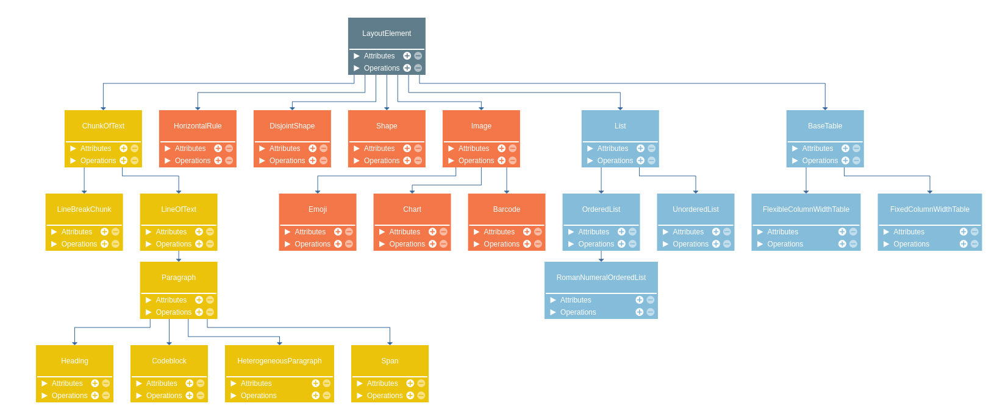

Figure 1 shows the `LayoutElement` hierarchy. The abstract base class `LayoutElement` represents 3 major groups of content:

- Elements that display text (marked in yellow)
- Elements that display images (marked in orange)
- Elements that act as a container, grouping other `LayoutElement` implementations (marked in blue)

You'll explore most of these `LayoutElement` implementations in the coming examples. 
The deep-dive will take you on a journey through the entire process from `str` to `PDF`.

<div style="page-break-before: always;"></div>

## 2.4 Adding text to a PDF

The easiest way to add text to a PDF is by using a `Paragraph` object. `Paragraph` represents a piece of text where:

- All characters are rendered in the same Font
- All characters are rendered in the same color

`Paragraph` is typically a block-element (meaning it has a bottom and top padding).

`HeterogeneousParagraph` represents a `Paragraph` whose content may not all be rendered the same.
This can be particularly useful if you'd like to have some words in **bold** in a `Paragraph` or perhaps even a different color, for emphasis.

`HeterogeneousParagraph` is made up of smaller pieces of content called `ChunkOfText` objects.
`ChunkOfText` is the atomic element as far as text-rendering is considered.

Internally, whenever a `Paragraph` is rendered, it will divide itself into `LineOfText` objects, each of which will divide itself in `ChunkOfText` objects.

<div style="page-break-before: always;"></div>

### 2.4.1 Setting the `Font` of a `Paragraph`

One of the things that can really make a document stand out is a custom `Font`. By default, `borb` will use Helvetica, but this is not always desired. In this example, you'll learn how to set the `Font` of a `Paragraph`.

You'll start with the same boilerplate code you used last time:

```python 
from borb.pdf.document import Document
from borb.pdf.page.page import Page
from borb.pdf.canvas.layout.page_layout.multi_column_layout import SingleColumnLayout
from borb.pdf.canvas.layout.page_layout.page_layout import PageLayout
from borb.pdf.canvas.layout.text.paragraph import Paragraph
from borb.pdf.pdf import PDF


def main():
    doc: Document = Document()
    page: Page = Page()
    doc.append_page(page)    
    
    layout: PageLayout = SingleColumnLayout(page)
    layout.add(Paragraph("Hello World!"))
    
    with open("output.pdf", "wb") as out_file_handle:  
        PDF.dumps(out_file_handle, doc)   
 
 
if __name__ == "__main__":
    main()
```

Upon closer inspection, you'll find the constructor of `Paragraph` takes an argument `font` which can either be of type `str` or `Font`.

The PDF standard defines 14 fonts that should be embedded (and thus always present) in a PDF viewer. By using one of these fonts, you are ensuring that the document will open without a hitch.

If you're working with any of these 14 fonts, you can get by with just specifying the name of the font (since they are also embedded in `borb`).

These 14 fonts are:

- Courier
- Courier-bold
- Courier-bold-oblique
- Courier-oblique
- Helvetica
- Helvetica-bold
- Helvetica-bold-oblique
- Helvetica-oblique
- Times-bold
- Times-bold-oblique
- Times-oblique
- Times-roman

And 2 fonts used for things like list-symbols and the likes:

- Symbol
- Zapfdingbats

Now that you know, you can easily change the (implicit) `Helvetica` for something like `Courier` or `Helvetica-bold`

```python 
from borb.pdf.document import Document
from borb.pdf.page.page import Page
from borb.pdf.canvas.layout.page_layout.multi_column_layout import SingleColumnLayout
from borb.pdf.canvas.layout.page_layout.page_layout import PageLayout
from borb.pdf.canvas.layout.text.paragraph import Paragraph
from borb.pdf.pdf import PDF


def main():
    doc: Document = Document()
    page: Page = Page()
    doc.append_page(page)
    layout: PageLayout = SingleColumnLayout(page)
    layout.add(Paragraph("Hello World!", font="Courier"))
    with open("output.pdf", "wb") as out_file_handle:  
        PDF.dumps(out_file_handle, doc)   
 
 
if __name__ == "__main__":
    main()
```

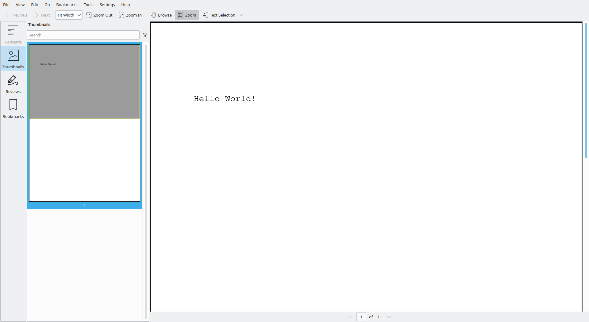

Alternatively, you can construct a new `Font` object, based on a TTF file.

```python 
from pathlib import Path  
  
from borb.pdf.document import Document  
from borb.pdf.page.page import Page  
from borb.pdf.canvas.layout.page_layout.multi_column_layout import SingleColumnLayout  
from borb.pdf.canvas.layout.page_layout.page_layout import PageLayout  
from borb.pdf.canvas.layout.text.paragraph import Paragraph  
from borb.pdf.pdf import PDF  
from borb.pdf.canvas.font.simple_font.true_type_font import TrueTypeFont  
from borb.pdf.canvas.font.font import Font


def main():
    doc: Document = Document()
    page: Page = Page()
    doc.append_page(page)
    
    layout: PageLayout = SingleColumnLayout(page)

    # construct the Font object
    font_path: Path = Path(__file__).parent / "Jsfont-Regular.ttf"
    font: Font = TrueTypeFont.true_type_font_from_file(font_path)

    layout.add(Paragraph("Hello World!", font=font))
    with open("output.pdf", "wb") as out_file_handle:  
        PDF.dumps(out_file_handle, doc)   
 
 
if __name__ == "__main__":
    main()    
```


<div style="page-break-before: always;"></div>

### 2.4.2 Setting the `font_color` of a `Paragraph`

Now that you can set the `font` of a `Paragraph`, you can turn your attention to the second most obvious feature with regards to personalization and branding; color.

`borb` offers a myriad of various color models. The easiest of which are:
- `RGBColor` : An RGB color space is any additive color space based on the RGB color model.   A particular color space that employs RGB primaries for part of its specification is defined by the three chromaticities of the red, green, and blue additive primaries,  
and can produce any chromaticity that is the 2D triangle defined by those primary colors (ie. excluding transfer function, white point, etc.). The primary colors are specified in terms of their CIE 1931 color space chromaticity coordinates (x,y), linking them to human-visible color. RGB is an abbreviation for red–green–blue.

- `HexColor` : A hex triplet is a six-digit, three-byte hexadecimal number used in HTML, CSS, SVG, and other computing applications to represent colors. The bytes represent the red, green, and blue components of the color. One byte represents a number in the range 00 to FF (in hexadecimal notation), or 0 to 255 in decimal notation. This represents the least (0) to the most (255) intensity of each of the color components.

- `Pantone` : Pantone LLC is a limited liability company headquartered in Carlstadt, New Jersey.  The company is best known for its Pantone Matching System (PMS), a proprietary color space used in a variety of industries, notably graphic design, fashion design, product design, printing and manufacturing and supporting the management of color from design to production, in physical and digital formats, among coated and uncoated materials, cotton, polyester, nylon and plastics.

- `X11Color` : In computing, on the X Window System, X11 color names are represented in a simple text file,  which maps certain strings to RGB color values. It was traditionally shipped with every X11 installation, hence the name. The web colors list is descended from it but differs for certain color names.

- `CMYKColor` : The CMYK color model (also known as process color, or four color) is a subtractive color model, based on the CMY color model,  
used in color printing, and is also used to describe the printing process itself.  
CMYK refers to the four ink plates used in some color printing: cyan, magenta, yellow, and key (black).  
  
    The CMYK model works by partially or entirely masking colors on a lighter, usually white, background. The ink reduces the light that would otherwise be reflected.  
Such a model is called subtractive because inks "subtract" the colors red, green and blue from white light. White light minus red leaves cyan, white light minus green leaves magenta, and white light minus blue leaves yellow.

- `GrayColor` : In digital photography, computer-generated imagery, and colorimetry, a grayscale or image is one in which the value of each pixel is a single sample representing only an amount of light;
    that is, it carries only intensity information. Grayscale images, a kind of black-and-white or gray monochrome, are composed exclusively of shades of gray.
    The contrast ranges from black at the weakest intensity to white at the strongest.

- `HSVColor` : HSL (hue, saturation, lightness) and HSV (hue, saturation, value, also known as HSB or hue, saturation, brightness) are alternative representations of the RGB color model, designed in the 1970s by computer graphics researchers to more closely align with the way human vision perceives color-making attributes.  

    In these models, colors of each hue are arranged in a radial slice,  
around a central axis of neutral colors which ranges from black at the bottom to white at the top.

But, enough theory, let's put this into practice.

In this example, you're creating the base Hello World, with a different color than the standard black. You'll be doing so by using the `HexColor` object.

```python 
from borb.pdf.document import Document  
from borb.pdf.page.page import Page  
from borb.pdf.canvas.layout.page_layout.multi_column_layout import SingleColumnLayout  
from borb.pdf.canvas.layout.page_layout.page_layout import PageLayout  
from borb.pdf.canvas.layout.text.paragraph import Paragraph  
from borb.pdf.pdf import PDF  
from borb.pdf.canvas.color.color import HexColor  
  
  
def main():  
    doc: Document = Document()  
    page: Page = Page()  
    doc.append_page(page)  
      
    layout: PageLayout = SingleColumnLayout(page)  
    layout.add(Paragraph("Hello World!", font_color=HexColor("#86CD82")))  
  
    with open("output.pdf", "wb") as out_file_handle:  
        PDF.dumps(out_file_handle, doc)  
  
  
if __name__ == "__main__":  
    main()
```


#### 2.4.2.1 Using `HSVColor` to create a rainbow of text

The HSV color model arranges colors on a wheel (rather a cone if you take into account saturation and value). That means you can easily generate a set of colors that divide the color spectrum evenly. 

In the next example, you'll start from the boilerplate Hello World example, and tweak it to generate a `Document` with a rainbow of text.

```python 
from decimal import Decimal  
  
from borb.pdf.canvas.layout.text.paragraph import Paragraph  
from borb.pdf.document import Document  
from borb.pdf.page.page import Page  
from borb.pdf.canvas.layout.page_layout.multi_column_layout import SingleColumnLayout  
from borb.pdf.canvas.layout.page_layout.page_layout import PageLayout  
from borb.pdf.pdf import PDF  
from borb.pdf.canvas.color.color import HSVColor  
  
  
def main():  
    doc: Document = Document()  
    page: Page = Page()  
    doc.append_page(page)  
  
    layout: PageLayout = SingleColumnLayout(page)  
  
    # the following code generates 20 colors, evenly spaced in the HSV spectrum  
    colors = [  
        HSVColor(Decimal(x / 360), Decimal(1), Decimal(1))  
        for x in range(0, 360, int(360 / 20))  
    ]  
  
    for c in colors:  
        layout.add(Paragraph("Hello World!", font_color=c))  
  
    with open("output.pdf", "wb") as out_file_handle:  
        PDF.dumps(out_file_handle, doc)  
  
  
if __name__ == "__main__":  
    main()
```


#### 2.4.2.2 Using `X11Color` to specify color in a more human-legible way

In computing, on the X Window System, X11 color names are represented in a simple text file, which maps certain strings to RGB color values. It was traditionally shipped with every X11 installation, hence the name, and is usually located in `<X11root>/lib/X11/rgb.txt`. The web colors list is descended from it but differs for certain color names.

Color names are not standardized by Xlib or the X11 protocol. The list does not show continuity either in selected color values or in color names, and some color triplets have multiple names. Despite this, graphic designers and others got used to them, making it practically impossible to introduce a different list. In earlier releases of X11 (prior to the introduction of Xcms), server implementors were encouraged to modify the RGB values in the reference color database to account for gamma correction.

As of X.Org Release 7.4 `rgb.txt` is no longer included in the roll up release, and the list is built directly into the server. The optional module `xorg/app/rgb` contains the stand-alone `rgb.txt` file.

The list first shipped with X10 release 3 (X10R3) on 7 June 1986, having been checked into RCS by Jim Gettys in 1985.[5] The same list was in X11R1 on 18 September 1987. Approximately the full list as is available today shipped with X11R4 on 29 January 1989, with substantial additions by Paul Ravelling (who added colors based on Sinclair Paints samples), John C. Thomas (who added colors based on a set of 72 Crayola crayons he had on hand) and Jim Fulton (who reconciled contributions to produce the X11R4 list). The project was running DEC VT240 terminals at the time, so would have worked to that device.

In `borb` the class `X11Color` represents all possible X11 colors.

```python   
COLOR_DEFINITION = {  
    "AliceBlue": "#FFF0F8FF",  
    "AntiqueWhite": "#FFFAEBD7",  
    "Aqua": "#FF00FFFF",  
    "Aquamarine": "#FF7FFFD4",  
    "Azure": "#FFF0FFFF",  
    "Beige": "#FFF5F5DC",  
    "Bisque": "#FFFFE4C4",  
    "Black": "#FF000000",  
    "BlanchedAlmond": "#FFFFEBCD",
    ... etc ...
```

In the next example you'll change the Hello World example to use an `X11Color`

```python 
from borb.pdf.document import Document  
from borb.pdf.page.page import Page  
from borb.pdf.canvas.layout.page_layout.multi_column_layout import SingleColumnLayout  
from borb.pdf.canvas.layout.page_layout.page_layout import PageLayout  
from borb.pdf.canvas.layout.text.paragraph import Paragraph  
from borb.pdf.pdf import PDF  
from borb.pdf.canvas.color.color import X11Color  
  

def main():  
    doc: Document = Document()  
    page: Page = Page()  
    doc.append_page(page)  
  
    layout: PageLayout = SingleColumnLayout(page)  
    layout.add(Paragraph("Hello World!", font_color=X11Color("SpringGreen")))  
  
    with open("output.pdf", "wb") as out_file_handle:  
        PDF.dumps(out_file_handle, doc)  
  
  
if __name__ == "__main__":  
    main()
```


#### 2.4.2.3 Using `Pantone` to specify color in a more human-legible way

Pantone is a proprietary color format. It specifies colors by names (or letter/number codes) in such a way that makes it nearly impossible to work well with anything else. Sadly, the format has taken some hold, and a lot of companies have defined their brand-book or color-scheme in terms of Pantone colors.

`borb` contains the definitions of a large selection (over 2000) of the Pantone gamut. Moreover, `borb` can also convert these colors to their nearest `RGBColor` thus allowing greater interoperability.

The (one) advantage of using `Pantone` however is that you get a human-legible name for your `Color` although it does require imagination to differentiate between things like `candlelight-peach`,  `georgia-peach` and `honey-peach`.

In the next example you'll create the boilerplate Hello World example, using a `Pantone`.

```python 
from borb.pdf.canvas.color.pantone import Pantone  
from borb.pdf.canvas.layout.text.paragraph import Paragraph  
from borb.pdf.document import Document  
from borb.pdf.page.page import Page  
from borb.pdf.canvas.layout.page_layout.multi_column_layout import SingleColumnLayout  
from borb.pdf.canvas.layout.page_layout.page_layout import PageLayout  
from borb.pdf.pdf import PDF  
  
  
def main():  
    doc: Document = Document()  
    page: Page = Page()  
    doc.append_page(page)  
  
    layout: PageLayout = SingleColumnLayout(page)  
    layout.add(Paragraph("Hello World!", font_color=Pantone("agate-green")))  
  
    with open("output.pdf", "wb") as out_file_handle:  
        PDF.dumps(out_file_handle, doc)  
  
  
if __name__ == "__main__":  
    main()
```

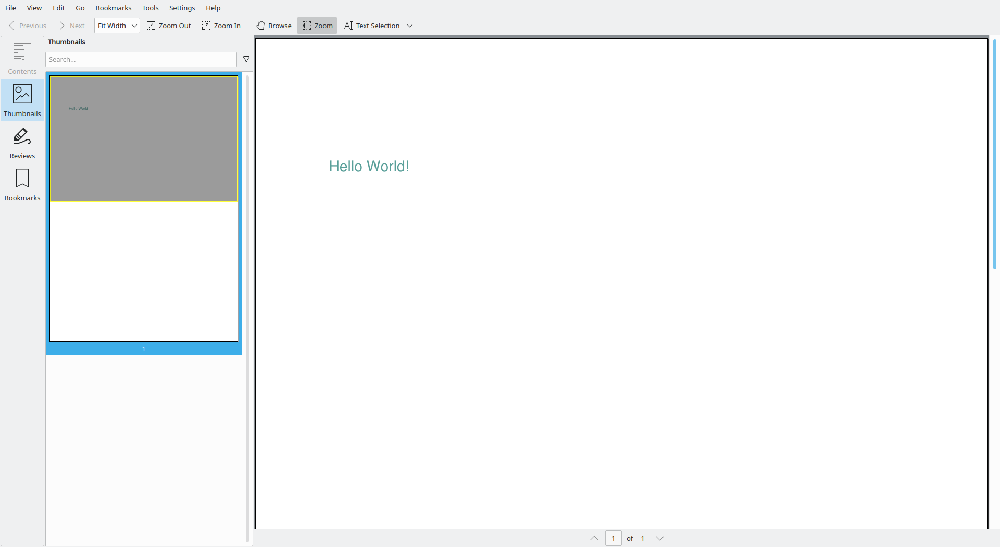

If you wanted to, you could also turn any other `Color` object into its (closest matching) `Pantone` color by using the `find_nearest_pantone` method in the `Pantone` class.

#### 2.4.2.4 Making the most of the `Color` classes

Upon closer inspection, you'll see that the base class `Color` implements a method `to_rgb`. This means that regardless of the underlying color model / space, we can get the (nearest) `RGBColor` object.

You can also verify that `HSVColor` can be constructed from `RGBColor` using the `from_rgb` method.

`HSVColor` has some interesting methods:

- `opposite`: This function returns the `HSVColor` whose hue is the opposite of the given `HSVColor`
- `darker`: This function returns a darker shade of the given `HSVColor`

By converting a `Color` (first to `RGBColor` and then to `HSVColor`) you can do all kinds of chromatic operations, like finding matching colors, opposite colors, and darker/lighter colors. Finally, you can convert those `HSVColor` objects back to `RGBColor` once you're done.

In the next examples in this section you'll use the `HSVColor` methods to generate color-schemes that you can use on your `Document`.
These examples are quick and fun ways to explore the `Color` API.

##### 2.4.2.4.1 Generating a triad `Color` scheme

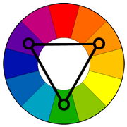

A triadic color scheme uses colors that are evenly spaced around the color wheel.

Triadic color harmonies tend to be quite vibrant, even if you use pale or unsaturated versions of your hues.

To use a triadic harmony successfully, the colors should be carefully balanced - let one color dominate and use the two others for accent.

```python
from decimal import Decimal

import typing
from borb.pdf.canvas.color.color import HSVColor, HexColor, Color
from borb.pdf.canvas.color.pantone import Pantone
from borb.pdf.canvas.geometry.rectangle import Rectangle
from borb.pdf.canvas.layout.image.shape import Shape
from borb.pdf.canvas.layout.page_layout.multi_column_layout import SingleColumnLayout
from borb.pdf.canvas.layout.page_layout.page_layout import PageLayout
from borb.pdf.canvas.layout.table.fixed_column_width_table import FixedColumnWidthTable
from borb.pdf.canvas.layout.text.paragraph import Paragraph
from borb.pdf.canvas.line_art.line_art_factory import LineArtFactory
from borb.pdf.document import Document
from borb.pdf.page.page import Page
from borb.pdf.pdf import PDF


def generate_triad_color_scheme() -> None:
    
    d: Document = Document()

    p: Page = Page()
    d.append_page(p)

    l: PageLayout = SingleColumnLayout(p)

    cs: typing.List[Color] = HSVColor.triadic(HexColor("f1cd2e"))

    t: FixedColumnWidthTable = FixedColumnWidthTable(
        number_of_rows=4, number_of_columns=3, margin_top=Decimal(12)
    )
    t.add(Paragraph("Color Sample", font="Helvetica-Bold"))
    t.add(Paragraph("Hex code", font="Helvetica-Bold"))
    t.add(Paragraph("Nearest Pantone", font="Helvetica-Bold"))
    for c in cs:
        t.add(
            Shape(
                LineArtFactory.droplet(
                    Rectangle(Decimal(0), Decimal(0), Decimal(32), Decimal(32))
                ),
                stroke_color=c,
                fill_color=c,
            )
        )
        t.add(Paragraph(c.to_rgb().to_hex_string()))
        t.add(Paragraph(Pantone.find_nearest_pantone_color(c).get_name()))
    t.set_padding_on_all_cells(Decimal(5), Decimal(5), Decimal(5), Decimal(5))
    l.add(t)

    # write
    with open("output.pdf", "wb") as pdf_file_handle:
        PDF.dumps(pdf_file_handle, d)
```

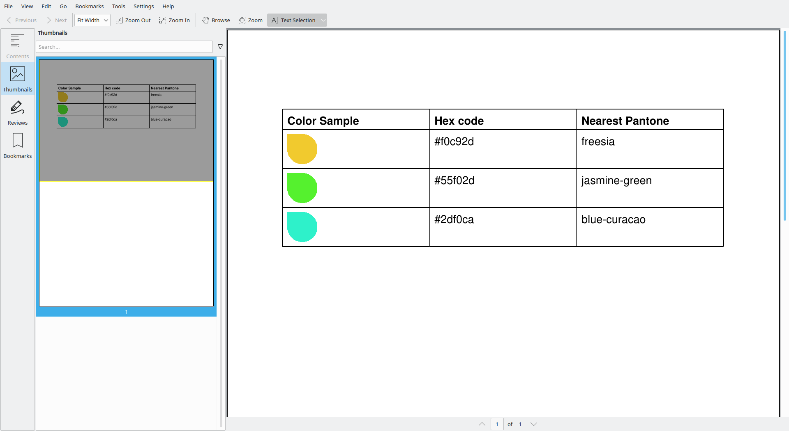

##### 2.4.2.4.2 Generating a split complementary `Color` scheme

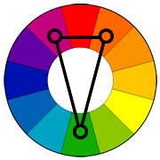

The split-complementary color scheme is a variation of the complementary color scheme. In addition to the base color, it uses the two colors adjacent to its complement.

This color scheme has the same strong visual contrast as the complementary color scheme, but has less tension.

The split-complimentary color scheme is often a good choice for beginners, because it is difficult to mess up.

```python
from decimal import Decimal

import typing
from borb.pdf.canvas.color.color import HSVColor, HexColor, Color
from borb.pdf.canvas.color.pantone import Pantone
from borb.pdf.canvas.geometry.rectangle import Rectangle
from borb.pdf.canvas.layout.image.shape import Shape
from borb.pdf.canvas.layout.page_layout.multi_column_layout import SingleColumnLayout
from borb.pdf.canvas.layout.page_layout.page_layout import PageLayout
from borb.pdf.canvas.layout.table.fixed_column_width_table import FixedColumnWidthTable
from borb.pdf.canvas.layout.text.paragraph import Paragraph
from borb.pdf.canvas.line_art.line_art_factory import LineArtFactory
from borb.pdf.document import Document
from borb.pdf.page.page import Page
from borb.pdf.pdf import PDF


def generate_split_complementary_color_scheme() -> None:
    
    d: Document = Document()

    p: Page = Page()
    d.append_page(p)

    l: PageLayout = SingleColumnLayout(p)

    cs: typing.List[Color] = HSVColor.split_complementary(HexColor("f1cd2e"))

    t: FixedColumnWidthTable = FixedColumnWidthTable(
        number_of_rows=4, number_of_columns=3, margin_top=Decimal(12)
    )
    t.add(Paragraph("Color Sample", font="Helvetica-Bold"))
    t.add(Paragraph("Hex code", font="Helvetica-Bold"))
    t.add(Paragraph("Nearest Pantone", font="Helvetica-Bold"))
    for c in cs:
        t.add(
            Shape(
                LineArtFactory.droplet(
                    Rectangle(Decimal(0), Decimal(0), Decimal(32), Decimal(32))
                ),
                stroke_color=c,
                fill_color=c,
            )
        )
        t.add(Paragraph(c.to_rgb().to_hex_string()))
        t.add(Paragraph(Pantone.find_nearest_pantone_color(c).get_name()))
    t.set_padding_on_all_cells(Decimal(5), Decimal(5), Decimal(5), Decimal(5))
    l.add(t)

    # write
    with open("output.pdf", "wb") as pdf_file_handle:
        PDF.dumps(pdf_file_handle, d)
```

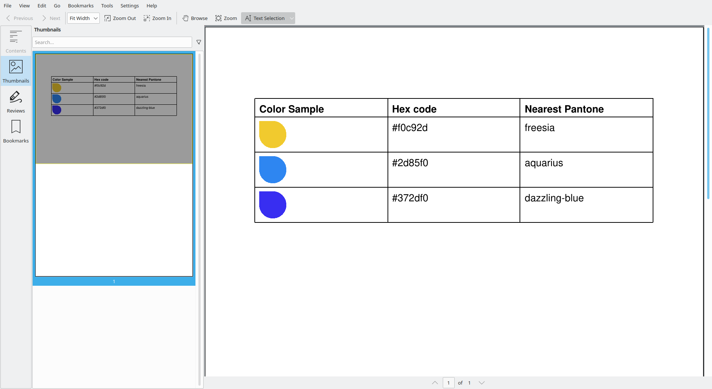

##### 2.4.2.4.3 Generating an analogous `Color` scheme

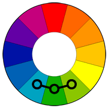

Analogous color schemes use colors that are next to each other on the color wheel. They usually match well and create serene and comfortable designs.

Analogous color schemes are often found in nature and are harmonious and pleasing to the eye.

Make sure you have enough contrast when choosing an analogous color scheme.

Choose one color to dominate, a second to support. The third color is used (along with black, white or gray) as an accent.

```python
from decimal import Decimal

import typing
from borb.pdf.canvas.color.color import HSVColor, HexColor, Color
from borb.pdf.canvas.color.pantone import Pantone
from borb.pdf.canvas.geometry.rectangle import Rectangle
from borb.pdf.canvas.layout.image.shape import Shape
from borb.pdf.canvas.layout.page_layout.multi_column_layout import SingleColumnLayout
from borb.pdf.canvas.layout.page_layout.page_layout import PageLayout
from borb.pdf.canvas.layout.table.fixed_column_width_table import FixedColumnWidthTable
from borb.pdf.canvas.layout.text.paragraph import Paragraph
from borb.pdf.canvas.line_art.line_art_factory import LineArtFactory
from borb.pdf.document import Document
from borb.pdf.page.page import Page
from borb.pdf.pdf import PDF


def generate_analogous_color_scheme() -> None:
    
    d: Document = Document()

    p: Page = Page()
    d.append_page(p)

    l: PageLayout = SingleColumnLayout(p)

    cs: typing.List[Color] = HSVColor.analogous(HexColor("f1cd2e"))

    t: FixedColumnWidthTable = FixedColumnWidthTable(
        number_of_rows=4, number_of_columns=3, margin_top=Decimal(12)
    )
    t.add(Paragraph("Color Sample", font="Helvetica-Bold"))
    t.add(Paragraph("Hex code", font="Helvetica-Bold"))
    t.add(Paragraph("Nearest Pantone", font="Helvetica-Bold"))
    for c in cs:
        t.add(
            Shape(
                LineArtFactory.droplet(
                    Rectangle(Decimal(0), Decimal(0), Decimal(32), Decimal(32))
                ),
                stroke_color=c,
                fill_color=c,
            )
        )
        t.add(Paragraph(c.to_rgb().to_hex_string()))
        t.add(Paragraph(Pantone.find_nearest_pantone_color(c).get_name()))
    t.set_padding_on_all_cells(Decimal(5), Decimal(5), Decimal(5), Decimal(5))
    l.add(t)

    # write
    with open("output.pdf", "wb") as pdf_file_handle:
        PDF.dumps(pdf_file_handle, d)
```


##### 2.4.2.4.4 Generating a tetradic square `Color` scheme


The square color scheme is similar to the rectangle, but with all four colors spaced evenly around the color circle.

The square color scheme works best if you let one color be dominant.

You should also pay attention to the balance between warm and cool colors in your design.

```python
from decimal import Decimal

import typing
from borb.pdf.canvas.color.color import HSVColor, HexColor, Color
from borb.pdf.canvas.color.pantone import Pantone
from borb.pdf.canvas.geometry.rectangle import Rectangle
from borb.pdf.canvas.layout.image.shape import Shape
from borb.pdf.canvas.layout.page_layout.multi_column_layout import SingleColumnLayout
from borb.pdf.canvas.layout.page_layout.page_layout import PageLayout
from borb.pdf.canvas.layout.table.fixed_column_width_table import FixedColumnWidthTable
from borb.pdf.canvas.layout.text.paragraph import Paragraph
from borb.pdf.canvas.line_art.line_art_factory import LineArtFactory
from borb.pdf.document import Document
from borb.pdf.page.page import Page
from borb.pdf.pdf import PDF


def generate_tetradic_square_color_scheme() -> None:
    
    d: Document = Document()

    p: Page = Page()
    d.append_page(p)

    l: PageLayout = SingleColumnLayout(p)

    cs: typing.List[Color] = HSVColor.tetradic_square(HexColor("f1cd2e"))

    t: FixedColumnWidthTable = FixedColumnWidthTable(
        number_of_rows=5, number_of_columns=3, margin_top=Decimal(12)
    )
    t.add(Paragraph("Color Sample", font="Helvetica-Bold"))
    t.add(Paragraph("Hex code", font="Helvetica-Bold"))
    t.add(Paragraph("Nearest Pantone", font="Helvetica-Bold"))
    for c in cs:
        t.add(
            Shape(
                LineArtFactory.droplet(
                    Rectangle(Decimal(0), Decimal(0), Decimal(32), Decimal(32))
                ),
                stroke_color=c,
                fill_color=c,
            )
        )
        t.add(Paragraph(c.to_rgb().to_hex_string()))
        t.add(Paragraph(Pantone.find_nearest_pantone_color(c).get_name()))
    t.set_padding_on_all_cells(Decimal(5), Decimal(5), Decimal(5), Decimal(5))
    l.add(t)

    # write
    with open("output.pdf", "wb") as pdf_file_handle:
        PDF.dumps(pdf_file_handle, d)
```


##### 2.4.2.4.5 Generating a tetradic rectangular `Color` scheme


The rectangle or tetradic color scheme uses four colors arranged into two complementary pairs.

This rich color scheme offers plenty of possibilities for variation.

The tetradic color scheme works best if you let one color be dominant.

You should also pay attention to the balance between warm and cool colors in your design.

```python
from decimal import Decimal

import typing
from borb.pdf.canvas.color.color import HSVColor, HexColor, Color
from borb.pdf.canvas.color.pantone import Pantone
from borb.pdf.canvas.geometry.rectangle import Rectangle
from borb.pdf.canvas.layout.image.shape import Shape
from borb.pdf.canvas.layout.page_layout.multi_column_layout import SingleColumnLayout
from borb.pdf.canvas.layout.page_layout.page_layout import PageLayout
from borb.pdf.canvas.layout.table.fixed_column_width_table import FixedColumnWidthTable
from borb.pdf.canvas.layout.text.paragraph import Paragraph
from borb.pdf.canvas.line_art.line_art_factory import LineArtFactory
from borb.pdf.document import Document
from borb.pdf.page.page import Page
from borb.pdf.pdf import PDF


def generate_tetradic_rectangle_color_scheme() -> None:
    
    d: Document = Document()

    p: Page = Page()
    d.append_page(p)

    l: PageLayout = SingleColumnLayout(p)

    cs: typing.List[Color] = HSVColor.tetradic_rectangle(HexColor("f1cd2e"))

    t: FixedColumnWidthTable = FixedColumnWidthTable(
        number_of_rows=5, number_of_columns=3, margin_top=Decimal(12)
    )
    t.add(Paragraph("Color Sample", font="Helvetica-Bold"))
    t.add(Paragraph("Hex code", font="Helvetica-Bold"))
    t.add(Paragraph("Nearest Pantone", font="Helvetica-Bold"))
    for c in cs:
        t.add(
            Shape(
                LineArtFactory.droplet(
                    Rectangle(Decimal(0), Decimal(0), Decimal(32), Decimal(32))
                ),
                stroke_color=c,
                fill_color=c,
            )
        )
        t.add(Paragraph(c.to_rgb().to_hex_string()))
        t.add(Paragraph(Pantone.find_nearest_pantone_color(c).get_name()))
    t.set_padding_on_all_cells(Decimal(5), Decimal(5), Decimal(5), Decimal(5))
    l.add(t)

    # write
    with open("output.pdf", "wb") as pdf_file_handle:
        PDF.dumps(pdf_file_handle, d)
```

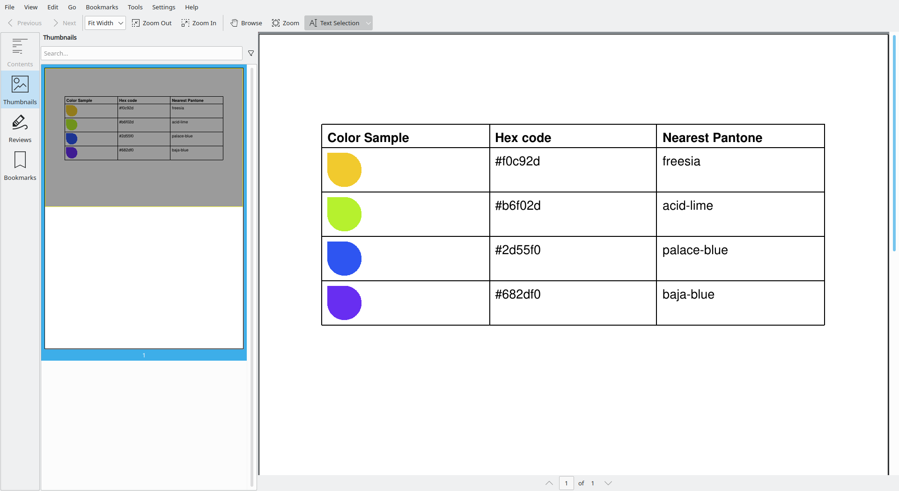

#### 2.4.2.5 Implementation details

All `Color` classes (with the exception of `HexColor`, `Pantone` and `X11Color`) are constructed using values `0..1`.
This is consistent with the PDF specification, but may be unexpected for those that are used to working with other image-processing software.
e.g. To represent pure red using `RGBColor`, you would write `RGBColor(Decimal(1), Decimal(0), Decimal(0))`.

Failing to remember this little convention will often result in some `LayoutElement` objects being entirely black or white, 
although the constructors of the aforementioned `Color` classes do have asserts to check whether the arguments that are passed do fall in the `0..1` range.  

<div style="page-break-before: always;"></div>

### 2.4.3 Using `Alignment` on `Paragraph` objects

Alignment is the process of determining where (in the available space) a `LayoutElement` should be positioned. 
For any `LayoutElement`, there are at least 2 kinds of alignment:

- `horizontal_alignment`: determines whether the `LayoutElement` should be positioned `LEFT`, `CENTERED` or `RIGHT` in the available space
- `vertical alignment`: determines whether the `LayoutElement` should be positioned `TOP`, `MIDDLE` or `BOTTOM` in the available space

For `LayoutElement` implementations containing text, you may also set the `text_alignment` parameter.

#### 2.4.3.1 horizontal alignment

In order to get a better idea of the influence of these parameters, you'll be doing things a little differently now.

You'll be adding content at an exact location, and specifying the bounding box. By doing so, you'll get a better understanding of how the alignment influences the position of the Paragraph inside the bounding box.

```python 
from decimal import Decimal  
  
from borb.pdf.canvas.geometry.rectangle import Rectangle  
from borb.pdf.canvas.layout.text.paragraph import Paragraph  
from borb.pdf.document import Document  
from borb.pdf.page.page import Page  
from borb.pdf.pdf import PDF  
  
  
def main():  
    doc: Document = Document()  
    page: Page = Page()  
    doc.append_page(page)  
      
    p: Paragraph = Paragraph("Hello World!")  
  
    # the next line of code uses absolute positioning  
    r: Rectangle = Rectangle(Decimal(59),               # x: 0 + page_margin  
                             Decimal(848 - 84 - 100),   # y: page_height - page_margin - height_of_textbox  
                             Decimal(595 - 59 * 2),     # width: page_width - 2 * page_margin  
                             Decimal(100))              # height  
    p.layout(page, r)  
  
    with open("output.pdf", "wb") as out_file_handle:  
        PDF.dumps(out_file_handle, doc)  
  
  
if __name__ == "__main__":  
    main()
```


Important to notice here is the PDF coordinate system. `borb` expects these positions in user-space units, and as Decimal objects.

The origin of the PDF coordinate space is typically at the bottom, left of the page. This might be a bit confusing, as you would typically start adding content at the top left.

Now let's explore!

For the next example, you'll be setting the horizontal_alignment parameter to its 3 allowed values, and checking out the differences between the resulting PDFs.

You'll start by trying out `Alignment.LEFT`

```python 
from decimal import Decimal  
  
from borb.pdf.canvas.color.color import X11Color  
from borb.pdf.canvas.geometry.rectangle import Rectangle  
from borb.pdf.canvas.layout.layout_element import Alignment  
from borb.pdf.canvas.layout.text.paragraph import Paragraph  
from borb.pdf.document import Document  
from borb.pdf.page.page import Page  
from borb.pdf.pdf import PDF  
  
  
def main():  
    doc: Document = Document()  
    page: Page = Page()  
    doc.append_page(page)  
  
    p: Paragraph = Paragraph("Hello World!", horizontal_alignment=Alignment.LEFT)  
  
    # the next line of code uses absolute positioning  
    r: Rectangle = Rectangle(Decimal(59),               # x: 0 + page_margin  
                             Decimal(848 - 84 - 100),   # y: page_height - page_margin - height_of_textbox  
                             Decimal(595 - 59 * 2),     # width: page_width - 2 * page_margin  
                             Decimal(100))              # height  
  
    # this is a quick and dirty way to draw a rectangle on the page  
    page.append_square_annotation(r, stroke_color=X11Color("Red"))  
  
    # add the paragraph to the page  
    p.layout(page, r)  
  
    with open("output.pdf", "wb") as out_file_handle:  
        PDF.dumps(out_file_handle, doc)  
  
  
if __name__ == "__main__":  
    main()
```


Now you can try `Alignment.CENTERED`

```python 
from decimal import Decimal  
  
from borb.pdf.canvas.color.color import X11Color  
from borb.pdf.canvas.geometry.rectangle import Rectangle  
from borb.pdf.canvas.layout.layout_element import Alignment  
from borb.pdf.canvas.layout.text.paragraph import Paragraph  
from borb.pdf.document import Document  
from borb.pdf.page.page import Page  
from borb.pdf.pdf import PDF  
  
  
def main():  
    doc: Document = Document()  
    page: Page = Page()  
    doc.append_page(page)  
  
    p: Paragraph = Paragraph("Hello World!", horizontal_alignment=Alignment.CENTERED)  
  
    # the next line of code uses absolute positioning  
    r: Rectangle = Rectangle(Decimal(59),               # x: 0 + page_margin  
                             Decimal(848 - 84 - 100),   # y: page_height - page_margin - height_of_textbox  
                             Decimal(595 - 59 * 2),     # width: page_width - 2 * page_margin  
                             Decimal(100))              # height  
  
    # this is a quick and dirty way to draw a rectangle on the page  
    page.append_square_annotation(r, stroke_color=X11Color("Red"))  
  
    # add the paragraph to the page  
    p.layout(page, r)  
  
    with open("output.pdf", "wb") as out_file_handle:  
        PDF.dumps(out_file_handle, doc)  
  

if __name__ == "__main__":  
    main()
```


and finally `Alignment.RIGHT`

```python 
from decimal import Decimal  
  
from borb.pdf.canvas.color.color import X11Color  
from borb.pdf.canvas.geometry.rectangle import Rectangle  
from borb.pdf.canvas.layout.layout_element import Alignment  
from borb.pdf.canvas.layout.text.paragraph import Paragraph  
from borb.pdf.document import Document  
from borb.pdf.page.page import Page  
from borb.pdf.pdf import PDF  
  
  
def main():  
    doc: Document = Document()  
    page: Page = Page()  
    doc.append_page(page)  
  
    p: Paragraph = Paragraph("Hello World!", horizontal_alignment=Alignment.RIGHT)  
  
    # the next line of code uses absolute positioning  
    r: Rectangle = Rectangle(Decimal(59),               # x: 0 + page_margin  
                             Decimal(848 - 84 - 100),   # y: page_height - page_margin - height_of_textbox  
                             Decimal(595 - 59 * 2),     # width: page_width - 2 * page_margin  
                             Decimal(100))              # height  
  
    # this is a quick and dirty way to draw a rectangle on the page  
    page.append_square_annotation(r, stroke_color=X11Color("Red"))  
  
    # add the paragraph to the page  
    p.layout(page, r)  
  
    with open("output.pdf", "wb") as out_file_handle:  
        PDF.dumps(out_file_handle, doc)  
  

if __name__ == "__main__":  
    main()
```


You'll also try setting the horizontal_alignment to an invalid value, just to see how `borb` reacts.

#### 2.4.3.2 vertical alignment

Now you can try the same for vertical_alignment. 
In the next example you'll start by setting the vertical_alignment to `Alignment.TOP`.

To ensure you can see the difference the various alignment settings make, you'll be adding a red rectangle to the page. 
This should make it clear where and how the paragraph is being laid out.

```python 
from decimal import Decimal  
  
from borb.pdf.canvas.color.color import X11Color  
from borb.pdf.canvas.geometry.rectangle import Rectangle  
from borb.pdf.canvas.layout.layout_element import Alignment  
from borb.pdf.canvas.layout.text.paragraph import Paragraph  
from borb.pdf.document import Document  
from borb.pdf.page.page import Page  
from borb.pdf.pdf import PDF  
  
  
def main():  
    doc: Document = Document()  
    page: Page = Page()  
    doc.append_page(page)  
  
    p: Paragraph = Paragraph("Hello World!", vertical_alignment=Alignment.TOP)  
  
    # the next line of code uses absolute positioning  
    r: Rectangle = Rectangle(Decimal(59),               # x: 0 + page_margin  
                             Decimal(848 - 84 - 100),   # y: page_height - page_margin - height_of_textbox  
                             Decimal(595 - 59 * 2),     # width: page_width - 2 * page_margin  
                             Decimal(100))              # height  
     # this is a quick and dirty way to draw a rectangle on the page  
    page.append_square_annotation(r, stroke_color=X11Color("Red"))  
  
    # add the paragraph to the page  
    p.layout(page, r)  
  
    with open("output.pdf", "wb") as out_file_handle:  
        PDF.dumps(out_file_handle, doc)  
  
  
if __name__ == "__main__":  
    main()
```

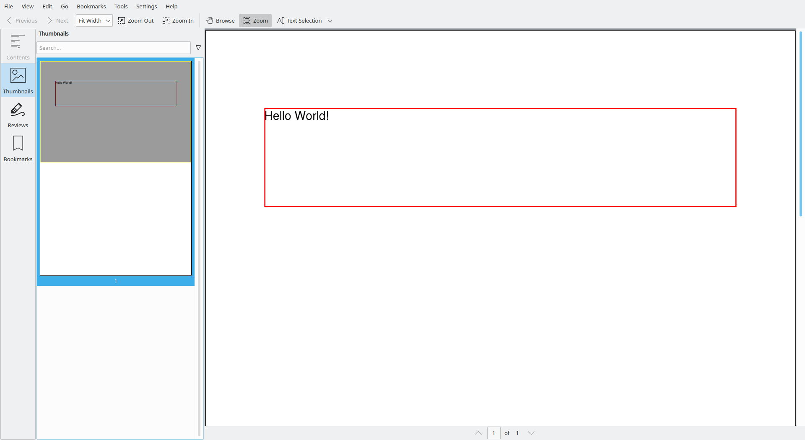

Now you'll try the same for `Alignment.MIDDLE`.

```python
from decimal import Decimal  
  
from borb.pdf.canvas.color.color import X11Color  
from borb.pdf.canvas.geometry.rectangle import Rectangle  
from borb.pdf.canvas.layout.layout_element import Alignment  
from borb.pdf.canvas.layout.text.paragraph import Paragraph  
from borb.pdf.document import Document  
from borb.pdf.page.page import Page  
from borb.pdf.pdf import PDF  
  
  
def main():  
    doc: Document = Document()  
    page: Page = Page()  
    doc.append_page(page)  
  
    p: Paragraph = Paragraph("Hello World!", vertical_alignment=Alignment.MIDDLE)  
  
    # the next line of code uses absolute positioning  
    r: Rectangle = Rectangle(Decimal(59),               # x: 0 + page_margin  
                             Decimal(848 - 84 - 100),   # y: page_height - page_margin - height_of_textbox  
                             Decimal(595 - 59 * 2),     # width: page_width - 2 * page_margin  
                             Decimal(100))              # height  
  
    # this is a quick and dirty way to draw a rectangle on the page  
    page.append_square_annotation(r, stroke_color=X11Color("Red"))  
  
    # add the paragraph to the page  
    p.layout(page, r)  
    
    with open("output.pdf", "wb") as out_file_handle:  
        PDF.dumps(out_file_handle, doc)  
  
        
if __name__ == "__main__":  
    main()
```


And lastly, you can try setting the alignment to `Alignment.BOTTOM`.

```python 
from decimal import Decimal  
  
from borb.pdf.canvas.color.color import X11Color  
from borb.pdf.canvas.geometry.rectangle import Rectangle  
from borb.pdf.canvas.layout.layout_element import Alignment  
from borb.pdf.canvas.layout.text.paragraph import Paragraph  
from borb.pdf.document import Document  
from borb.pdf.page.page import Page  
from borb.pdf.pdf import PDF  
  
  
def main():  
    doc: Document = Document()  
    page: Page = Page()  
    doc.append_page(page)  
  
    p: Paragraph = Paragraph("Hello World!", vertical_alignment=Alignment.BOTTOM)  
  
    # the next line of code uses absolute positioning  
    r: Rectangle = Rectangle(Decimal(59),               # x: 0 + page_margin  
                             Decimal(848 - 84 - 100),   # y: page_height - page_margin - height_of_textbox  
                             Decimal(595 - 59 * 2),     # width: page_width - 2 * page_margin  
                             Decimal(100))              # height  
  
    # this is a quick and dirty way to draw a rectangle on the page  
    page.append_square_annotation(r, stroke_color=X11Color("Red"))  
  
    # add the paragraph to the page  
    p.layout(page, r)  
  
    with open("output.pdf", "wb") as out_file_handle:  
        PDF.dumps(out_file_handle, doc)  
  
  
if __name__ == "__main__":  
    main()
```


#### 2.4.3.3 text alignment

For text_alignment, you can set the same values as horizontal_alignment, with one exception:

- `Alignment.LEFT`
- `Alignment.CENTERED`
- `Alignment.RIGHT`
- `Alignment.JUSTIFIED`

`Alignment.JUSTIFIED` is special, it lays out the Paragraph according to the following pseudo-code:

```
1. split the text into words, call this ws
2. lines_of_text = []
3. for each w in ws:
4.   if the last line of text (lines_of_text[-1]) + w fits in the bounding box:
5.     append w to lines_of_text[-1]
6.   else:
7.     append a new array to lines_of_text, containing only w
8. for each line_of_text in lines_of_text:
9.     calculate the remaining space in the bounding box
10.    divide the remaining space by the amount of space characters, call this delta
11.    for each chunk of text (not space) in line_of_text:
12.       lay out the chunk, keeping track of the x-position
13.       if you encounter a space, update the x-position by adding delta 
```
The last line of the `Paragraph` is treated as if it was laid out with text_alignment set to `Alignment.LEFT`.

Enough theory, let's practice!

In the next example, you'll be creating a `Paragraph` with text_alignment set to `Alignment.JUSTIFIED`.

```python
from decimal import Decimal  
  
from borb.pdf.canvas.color.color import X11Color  
from borb.pdf.canvas.geometry.rectangle import Rectangle  
from borb.pdf.canvas.layout.layout_element import Alignment  
from borb.pdf.canvas.layout.text.paragraph import Paragraph  
from borb.pdf.document import Document  
from borb.pdf.page.page import Page  
from borb.pdf.pdf import PDF  
  
  
def main():  
    doc: Document = Document()  
    page: Page = Page()  
    doc.append_page(page)  
  
    p: Paragraph = Paragraph("""  
                            Lorem ipsum dolor sit amet, consectetur adipiscing elit, sed do eiusmod tempor incididunt ut labore et dolore magna aliqua.                            Ut enim ad minim veniam, quis nostrud exercitation ullamco laboris nisi ut aliquip ex ea commodo consequat.   
                            Duis aute irure dolor in reprehenderit in voluptate velit esse cillum dolore eu fugiat nulla pariatur.   
                            Excepteur sint occaecat cupidatat non proident, sunt in culpa qui officia deserunt mollit anim id est laborum.  
                            """, text_alignment=Alignment.JUSTIFIED)  
  
    # the next line of code uses absolute positioning  
    r: Rectangle = Rectangle(Decimal(59),               # x: 0 + page_margin  
                             Decimal(848 - 84 - 100),   # y: page_height - page_margin - height_of_textbox  
                             Decimal(595 - 59 * 2),     # width: page_width - 2 * page_margin  
                             Decimal(100))              # height  
  
    # this is a quick and dirty way to draw a rectangle on the page  
    page.append_square_annotation(r, stroke_color=X11Color("Red"))  
  
    # add the paragraph to the page  
    p.layout(page, r)  
  
    with open("output.pdf", "wb") as out_file_handle:  
        PDF.dumps(out_file_handle, doc)  
  
        
if __name__ == "__main__":  
    main()
```


<div style="page-break-before: always;"></div>

### 2.4.4 Using borders on `Paragraph` objects

It can be useful to set borders on `LayoutElement` objects, for `borb` this is as easy as passing a couple of `bool` args.

In the next example, you'll explore how to set borders on a `Paragraph`;

```python 
from decimal import Decimal  
  
from borb.pdf.canvas.color.color import X11Color  
from borb.pdf.canvas.geometry.rectangle import Rectangle  
from borb.pdf.canvas.layout.text.paragraph import Paragraph  
from borb.pdf.document import Document  
from borb.pdf.page.page import Page  
from borb.pdf.pdf import PDF  
  
  
def main():  
    doc: Document = Document()  
    page: Page = Page()  
    doc.append_page(page)  
  
    p: Paragraph = Paragraph("Hello World!",  
                             border_top=True,  
                             border_right=True,  
                             border_bottom=True,  
                             border_color=X11Color("Green"),  
                             border_width=Decimal(0.1))  
  
    # the next line of code uses absolute positioning  
    r: Rectangle = Rectangle(Decimal(59),               # x: 0 + page_margin  
                             Decimal(848 - 84 - 100),   # y: page_height - page_margin - height_of_textbox  
                             Decimal(595 - 59 * 2),     # width: page_width - 2 * page_margin  
                             Decimal(100))              # height  
  
    # add the paragraph to the page  
    p.layout(page, r)  
  
    with open("output.pdf", "wb") as out_file_handle:  
        PDF.dumps(out_file_handle, doc)  
  
  
if __name__ == "__main__":  
    main()
```

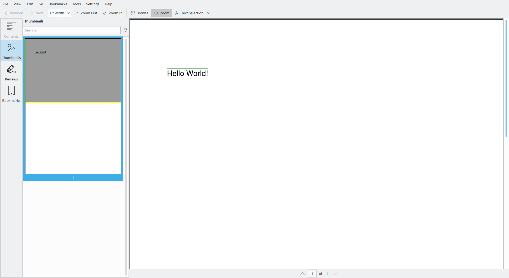

<div style="page-break-before: always;"></div>

### 2.4.5 Using margin and padding on `Paragraph` objects

I always mix up margin and padding. Personally, I find this illustration rather helpful:


`borb` allows you to set both `margin` and `padding` on `LayoutElement` instances.
In the next example you'll be doing just that:

```python 
from decimal import Decimal  
  
from borb.pdf.canvas.color.color import X11Color  
from borb.pdf.canvas.geometry.rectangle import Rectangle  
from borb.pdf.canvas.layout.text.paragraph import Paragraph  
from borb.pdf.document import Document  
from borb.pdf.page.page import Page  
from borb.pdf.pdf import PDF  
  
  
def main():  
    doc: Document = Document()  
    page: Page = Page()  
    doc.append_page(page)  
  
    m: Decimal = Decimal(5)  
  
    p: Paragraph = Paragraph("Hello World!",  
                             # margin  
                             margin_top=m,  
                             margin_left=m,  
                             margin_bottom=m,  
                             margin_right=m,  
                             # padding  
                             padding_top=m,  
                             padding_left=m,  
                             padding_bottom=m,  
                             padding_right=m,  
                             # border  
                             border_top=True,  
                             border_right=True,  
                             border_bottom=True,  
                             border_left=True,  
                             border_color=X11Color("Green"),  
                             border_width=Decimal(0.1))  
  
    # the next line of code uses absolute positioning  
    r: Rectangle = Rectangle(Decimal(59),               # x: 0 + page_margin  
                             Decimal(848 - 84 - 100),   # y: page_height - page_margin - height_of_textbox  
                             Decimal(595 - 59 * 2),     # width: page_width - 2 * page_margin  
                             Decimal(100))              # height  
  
    # add the paragraph to the page  
    page.append_square_annotation(r, stroke_color=X11Color("Red"))  
    p.layout(page, r)  
  
    with open("output.pdf", "wb") as out_file_handle:  
        PDF.dumps(out_file_handle, doc)  
  
  
if __name__ == "__main__":  
    main()
```


You will have noticed the final PDF does not seem to have any margin on the `Paragraph` element. This is of course because you explicitly laid out the `Paragraph` manually. `margin` is not considered to be *part of the element*. 

After all, think of a browser-based context, where two inline elements have a margin specified. The effective margin that is used will depend on both elements (in fact the horizontal gap between them will typically be the maximum of both their respective margins).

In short, `margin` is something that needs to be considered at a higher-up level (since it could be a calculation based on multiple `LayoutElement` instances).

<div style="page-break-before: always;"></div>

## 2.5 Adding `Image` objects to a PDF

Being able to add images to your PDF is one of the core skills. It can be useful for:

- Adding a logo to an invoice
- Adding a barcode or QR code to a document to link it to a website
- Ensuring the branding and customization of your document is on point
- Etc

`borb` allows you to create `Image` objects in a variety of ways:

- By passing a URL (passed as `str`)
- By passing a `Path`
- By passing a `PIL.Image`

There are convenience classes to enable you to easily add:

- Barcodes
- QR codes
- Charts
- Emoji

In the next example, you'll be adding an `Image` to a `Page`, by specifying its URL.

```python 
from decimal import Decimal  
  
from borb.pdf.canvas.layout.image.image import Image  
from borb.pdf.canvas.layout.page_layout.multi_column_layout import SingleColumnLayout  
from borb.pdf.canvas.layout.page_layout.page_layout import PageLayout  
from borb.pdf.document import Document  
from borb.pdf.page.page import Page  
from borb.pdf.pdf import PDF  
  
  
def main():  
    doc: Document = Document()  
    page: Page = Page()  
    doc.append_page(page)  
  
    layout: PageLayout = SingleColumnLayout(page)  
    layout.add(Image("https://images.unsplash.com/photo-1625604029887-45f9c2f7cbc9?ixid=MnwxMjA3fDB8MHxwaG90by1wYWdlfHx8fGVufDB8fHx8",  
                     width=Decimal(128),  
                     height=Decimal(128)))  
  
    with open("output.pdf", "wb") as out_file_handle:  
        PDF.dumps(out_file_handle, doc)  
  
  
if __name__ == "__main__":  
    main()
```


You'll notice a few things here:

- You used an image from unsplash. I would highly recommend this website for royalty-free photographs.
- You specified the `width` and `height` explicitly. This is needed, since `Image` objects are not scaled down automatically. This is closely related to laying out `Image` objects in `Table` instances. Most table-layout algorithms (including the one in `borb`) calculate the minimum dimensions of each element they contain. If `Image` instances are allowed to be scaled down automatically, their minimum dimensions becomes 0.

You can verify that `borb` gives you a nice assert if you try to add something that's too large to a `Page`.

```python 
from decimal import Decimal  
  
from borb.pdf.canvas.layout.image.image import Image  
from borb.pdf.canvas.layout.page_layout.multi_column_layout import SingleColumnLayout  
from borb.pdf.canvas.layout.page_layout.page_layout import PageLayout  
from borb.pdf.document import Document  
from borb.pdf.page.page import Page  
from borb.pdf.pdf import PDF  
  
  
def main():  
    doc: Document = Document()  
    page: Page = Page()  
    doc.append_page(page)  
  
    layout: PageLayout = SingleColumnLayout(page)  
    layout.add(Image("https://images.unsplash.com/photo-1625604029887-45f9c2f7cbc9?ixid=MnwxMjA3fDB8MHxwaG90by1wYWdlfHx8fGVufDB8fHx8"))  
  
    with open("output.pdf", "wb") as out_file_handle:  
        PDF.dumps(out_file_handle, doc)  
  
  
if __name__ == "__main__":  
    main()
```

When you attempt to run this code, you should get the following assert:

``` 
AssertionError: Image is too wide to fit inside column / page.
```

In the next example, you'll insert an `Image` by using its path (on disk).

```python 
from decimal import Decimal  
from pathlib import Path  
  
from borb.pdf.canvas.layout.image.image import Image  
from borb.pdf.canvas.layout.page_layout.multi_column_layout import SingleColumnLayout  
from borb.pdf.canvas.layout.page_layout.page_layout import PageLayout  
from borb.pdf.document import Document  
from borb.pdf.page.page import Page  
from borb.pdf.pdf import PDF  
  
  
def main():  
    doc: Document = Document()  
    page: Page = Page()  
    doc.append_page(page)  
  
    layout: PageLayout = SingleColumnLayout(page)  
    layout.add(Image(Path("my_image.jpg"),  
                     width=Decimal(128),  
                     height=Decimal(128)))  
  
    with open("output.pdf", "wb") as out_file_handle:  
        PDF.dumps(out_file_handle, doc)  
  
  
if __name__ == "__main__":  
    main()
```


<div style="page-break-before: always;"></div>

## 2.6 Adding line-art to a PDF using `Shape` objects

One of the main goals of `borb` is to put the user first. I would like PDF to become as accessible as other digital document formats (e.g. Microsoft Words).

This goal is reflected in both large and small features in `borb`. One of these small things is the line-art factory. Rather than forcing the end-user to draw complicated line-art by hand, `LineArtFactory` contains a ton of methods that enable you to easily draw the most common shapes on the `Page`.

This is a quick overview (although I would recommend inspecting the code to check out which exact shapes are supported).

- **flowchart shapes**: decision, process, document, predefined document, multiple documents, data, predefined process, stored data, internal storage, sequential data, direct data, manual input, manual operation, card, paper tape, preparation, loop limit, termination, collate, delay, extract, merge, or, sort, summing junction, database, on page reference, off page reference, process iso9000, transport
- **geometric shapes**: rectangle, right angled triangle, regular n-gon, isoceles triangle, parallellogram, trapezoid, diamond, pentagon, hexagon, heptagon, octagon, circle, fraction of a circle, half a circle, three quarters of a circle
- **stars**: four pointed star, five pointed star, six pointed star, n-pointed star
- **arrows**: arrow left, arrow right, arrow up, arrow down
- **misc**: droplet, heart, sticky note, cartoon diamond

In the next example, you'll create a PDF with a sticky note shape in it.

```python 
from decimal import Decimal  
  
from borb.pdf.canvas.color.color import X11Color  
from borb.pdf.canvas.geometry.rectangle import Rectangle  
from borb.pdf.canvas.layout.image.shape import Shape  
from borb.pdf.canvas.layout.page_layout.multi_column_layout import SingleColumnLayout  
from borb.pdf.canvas.layout.page_layout.page_layout import PageLayout  
from borb.pdf.canvas.line_art.line_art_factory import LineArtFactory  
from borb.pdf.document import Document  
from borb.pdf.page.page import Page  
from borb.pdf.pdf import PDF  
  
  
def main():  
    doc: Document = Document()  
    page: Page = Page()  
    doc.append_page(page)  
  
    layout: PageLayout = SingleColumnLayout(page)  
  
    r: Rectangle = Rectangle(Decimal(0),  
                             Decimal(0),  
                             Decimal(100),  
                             Decimal(100))  
    layout.add(Shape(LineArtFactory.sticky_note(r),  
                     stroke_color=X11Color("Yellow"),  
                     fill_color=X11Color("White"),  
                     line_width=Decimal(1)  
                     ))  
  
    with open("output.pdf", "wb") as out_file_handle:  
        PDF.dumps(out_file_handle, doc)  
  

if __name__ == "__main__":  
    main()
```


The initial bounding box you pass to the `LineArtFactory.sticky_note` function is only used to determine how wide/tall the `Shape´ should be.

`LineArtFactory` always returns `typing.List[typing.Tuple[Decimal, Decimal]]` or, to put it in more legible terms, a list of points (specified by x, y coordinates).

This ensures you can still do things with these points, should you so desire.

<div style="page-break-before: always;"></div>

## 2.7 Adding barcodes and QR-codes to a PDF

A `Barcode`, or qr-code can really add interactivity to your documents. It ensures you can easily link the printed document to an online resource simply by pointing a smartphone at it.

`borb` supports a myriad of `Barcode` types.

In the next example you'll add a `Barcode` to a `Page`. In subsequent examples you'll tweak the look and feel of the `Barcode` (its `stroke_color` , `fill_color` as well as its `width` and `height`).

In the final example of this section, you'll create and add a QR code to a `Page`.

### 2.7.1 Adding a `Barcode` to a `Page`

In the next example you'll be adding an `EAN_14` code to a `Page`.
The python script is very straightforward:

```python  
from decimal import Decimal  
  
from borb.pdf.canvas.layout.image.barcode import Barcode, BarcodeType  
from borb.pdf.canvas.layout.page_layout.multi_column_layout import SingleColumnLayout  
from borb.pdf.canvas.layout.page_layout.page_layout import PageLayout  
from borb.pdf.document import Document  
from borb.pdf.page.page import Page  
from borb.pdf.pdf import PDF  
  
  
def main():  
    doc: Document = Document()  
    page: Page = Page()  
    doc.append_page(page)  
  
    layout: PageLayout = SingleColumnLayout(page)  
    layout.add(Barcode("1234567896120",  
                       width=Decimal(128),  
                       height=Decimal(128),  
                       type=BarcodeType.EAN_14))  
  
    with open("output.pdf", "wb") as out_file_handle:  
        PDF.dumps(out_file_handle, doc)  
  

if __name__ == "__main__":  
    main()
```


#### 2.7.1.1 Setting the `stroke_color` and `fill_color` of a `Barcode`

Of course, if your company's brand color happens to be something other than black, or you're trying to display a `Barcode` on a background that's not white, `borb` has got you covered.

In the next example, you'll be tweaking the `stroke_color` and `fill_color` of a `Barcode` to make sure it pops.

```python 
from decimal import Decimal  
  
from borb.pdf.canvas.color.color import HexColor  
from borb.pdf.canvas.layout.image.barcode import Barcode, BarcodeType  
from borb.pdf.canvas.layout.page_layout.multi_column_layout import SingleColumnLayout  
from borb.pdf.canvas.layout.page_layout.page_layout import PageLayout  
from borb.pdf.document import Document  
from borb.pdf.page.page import Page  
from borb.pdf.pdf import PDF  
  
  
def main():  
    doc: Document = Document()  
    page: Page = Page()  
    doc.append_page(page)  
  
    layout: PageLayout = SingleColumnLayout(page)  
    layout.add(Barcode("1234567896120",  
                       stroke_color=HexColor("E2C044"),  
                       fill_color=HexColor("587B7F"),  
                       width=Decimal(128),  
                       height=Decimal(128),  
                       type=BarcodeType.EAN_14))  
  
    with open("output.pdf", "wb") as out_file_handle:  
        PDF.dumps(out_file_handle, doc)  
  

if __name__ == "__main__":  
    main()
```


### 2.7.2 Adding a QR-code to the `Page`

A QR code (abbreviated from Quick Response code) is a type of matrix barcode (or two-dimensional barcode) invented in 1994 by the Japanese automotive company Denso Wave.

A QR code consists of black squares arranged in a square grid on a white background, which can be read by an imaging device such as a camera, and processed using Reed–Solomon error correction until the image can be appropriately interpreted. The required data is then extracted from patterns that are present in both horizontal and vertical components of the image.
 
In practice, QR codes often contain data for a locator, identifier, or tracker that points to a website or application.

`borb` also supports QR-codes.
The code from the previous example doesn't really change that much, other than setting a different `type`

```python 
from decimal import Decimal  
  
from borb.pdf.canvas.layout.image.barcode import Barcode, BarcodeType  
from borb.pdf.canvas.layout.page_layout.multi_column_layout import SingleColumnLayout  
from borb.pdf.canvas.layout.page_layout.page_layout import PageLayout  
from borb.pdf.document import Document  
from borb.pdf.page.page import Page  
from borb.pdf.pdf import PDF  
  
  
def main():  
    doc: Document = Document()  
    page: Page = Page()  
    doc.append_page(page)  
  
    layout: PageLayout = SingleColumnLayout(page)  
    layout.add(Barcode("1234567896120",  
                       width=Decimal(128),  
                       height=Decimal(128),  
                       type=BarcodeType.QR))  
  
    with open("output.pdf", "wb") as out_file_handle:  
        PDF.dumps(out_file_handle, doc)  
  

if __name__ == "__main__":  
    main()
```

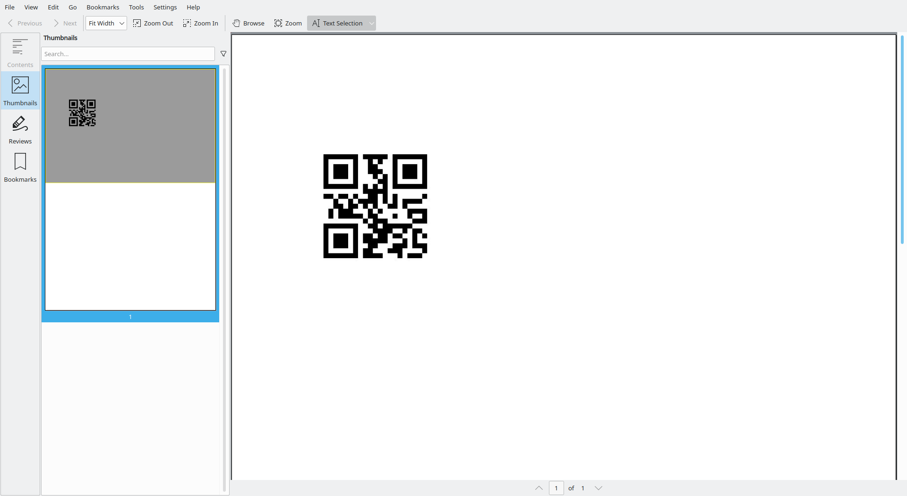

### 2.7.3 Other supported barcodes

`borb` supports the following barcode formats:

- `BarcodeType.CODE_128`
- `BarcodeType.CODE_39`
- `BarcodeType.EAN`
- `BarcodeType.EAN_13`
- `BarcodeType.EAN_14`
- `BarcodeType.EAN_8`
- `BarcodeType.GS_1`
- `BarcodeType.GS_128`
- `BarcodeType.GTIN`
- `BarcodeType.ISBN`
- `BarcodeType.ISBN_10`
- `BarcodeType.ISBN_13`
- `BarcodeType.ISSN`
- `BarcodeType.ITF`
- `BarcodeType.JAN`
- `BarcodeType.PZN`
- `BarcodeType.QR`
- `BarcodeType.UPC`
- `BarcodeType.UPC_A`

<div style="page-break-before: always;"></div>

## 2.8 Adding `Chart` objects to a PDF

Being able to add `Chart` objects to a `Page` can be very useful when creating certain kinds of documents. 
Test-reports, or sales/revenue documents can often benefit from being illuminated by charts. 
`borb` supports (almost directly) adding `matplotlib` charts to a `Page`.

In the next example you'll create a PDF `Document` and add a `Chart` to it.
This example does have some extra dependencies:

- `pandas`
- `numpy`
- `matplotlib`


```python 
from decimal import Decimal  
  
from borb.pdf.canvas.layout.image.barcode import Barcode, BarcodeType  
from borb.pdf.canvas.layout.image.chart import Chart  
from borb.pdf.canvas.layout.page_layout.multi_column_layout import SingleColumnLayout  
from borb.pdf.canvas.layout.page_layout.page_layout import PageLayout  
from borb.pdf.document import Document  
from borb.pdf.page.page import Page  
from borb.pdf.pdf import PDF  
  
import matplotlib.pyplot as MatPlotLibPlot  
import numpy as np  
import pandas as pd  


def create_plot() -> None:  
    # generate dataset  
    df = pd.DataFrame(  
        {  
            "X": range(1, 101),  
            "Y": np.random.randn(100) * 15 + range(1, 101),  
            "Z": (np.random.randn(100) * 15 + range(1, 101)) * 2,  
        }  
    )  
  
    # plot  
    fig = MatPlotLibPlot.figure()  
    ax = fig.add_subplot(111, projection="3d")  
    ax.scatter(df["X"], df["Y"], df["Z"], c="skyblue", s=60)  
    ax.view_init(30, 185)  
    
    # return
    return MatPlotLibPlot.gcf()  

  
def main():  
    doc: Document = Document()  
    page: Page = Page()  
    doc.append_page(page)  
  
    layout: PageLayout = SingleColumnLayout(page)  
    layout.add(Chart(create_plot(),  
                     width=Decimal(256),  
                     height=Decimal(256)))  
  
    with open("output.pdf", "wb") as out_file_handle:  
        PDF.dumps(out_file_handle, doc)  
  

if __name__ == "__main__":  
    main()
```


<div style="page-break-before: always;"></div>

## 2.9 Adding emoji to a PDF

Emoji are typically a font-related thing, i.e. a font either supports emoji, or it doesn't. 
As a consequence, you (the end user) may find yourself in a situation where you have a cool font that you'd like to use, but sadly the font doesn't support emoji.

To fix this, `borb` comes bundled with upwards of 500 emoji. 
These can easily be inserted into any `Document` or `Page`.

In the next example you'll be using `BrowserLayout` to make it easy to place `Image` objects as inline `LayoutElement`.
Of course, you can achieve the same effect using `SingleColumnLayout` (or `MultiColumnLayout`) by adding the `Emoji` to a `HeterogeneousParagraph`.

```python 
from borb.pdf.canvas.layout.emoji.emoji import Emojis  
from borb.pdf.canvas.layout.page_layout.browser_layout import BrowserLayout  
from borb.pdf.canvas.layout.text.chunk_of_text import ChunkOfText  
from borb.pdf.document import Document  
from borb.pdf.page.page import Page  
from borb.pdf.pdf import PDF  
  
  
def main():  
    doc: Document = Document()  
    page: Page = Page()  
    doc.append_page(page)  
  
    layout: BrowserLayout = BrowserLayout(page)  
    layout.add(ChunkOfText("Hello"))  
    layout.add(Emojis.EARTH_AMERICAS.value)  
    layout.add(ChunkOfText("!"))  
  
    with open("output.pdf", "wb") as out_file_handle:  
        PDF.dumps(out_file_handle, doc)  
  

if __name__ == "__main__":  
    main()
```


<div style="page-break-before: always;"></div>

## 2.10 Container `LayoutElement` objects

Now that you have a firm grasp on the basic `LayoutElement` objects, you can start combining them in lists and tables.

Tables especially are almost omnipresent in a corporate setting, so it pays to know the ins and outs of working with `Table` in `borb`.

In this section you'll learn:

- How to aggregate the `LayoutElement` instances you've already seen into bigger groups using `List` and `Table`
- When to use the different implementations of `List`; `OrderedList`, `RomanNumeralOrderedList` and `UnorderedList`
- When to use the different implementations of `Table`; `FlexibleColumnWidthTable` and `FixedColumnWidthTable`
- How to use the convenience methods on `Table` and `List` to set properties on all the `LayoutElement` objects they contain

There are quite a few deep-dive examples that make use of `Table` if you're up for the challenge afterwards.

- Creating a realistic invoice
- Creating a Sudoku puzzle
- Creating a tents-and-trees puzzle
- Creating a nonogram

<div style="page-break-before: always;"></div>

### 2.10.1 Lists

`List` is the abstract base class that performs the layout of anything resembling a sequence of `LayoutElement` objects.

Different sub-classes of `List` can refine this behavior, for instance by adding bullets or numbers in front of each list-item.

#### 2.10.1.1 Working with `OrderedList`

In this first list-related example, you'll be creating a list with 3 items. The list will be numbered.

```python 
from borb.pdf.canvas.layout.list.ordered_list import OrderedList  
from borb.pdf.canvas.layout.page_layout.multi_column_layout import SingleColumnLayout  
from borb.pdf.canvas.layout.page_layout.page_layout import PageLayout  
from borb.pdf.canvas.layout.text.paragraph import Paragraph  
from borb.pdf.document import Document  
from borb.pdf.page.page import Page  
from borb.pdf.pdf import PDF  
  
  
def main():  
    doc: Document = Document()  
    page: Page = Page()  
    doc.append_page(page)  
  
    layout: PageLayout = SingleColumnLayout(page)  
    layout.add(OrderedList()  
               .add(Paragraph("Lorem"))  
               .add(Paragraph("Ipsum"))  
               .add(Paragraph("Dolor"))  
               )  
  
    with open("output.pdf", "wb") as out_file_handle:  
        PDF.dumps(out_file_handle, doc)  
  

if __name__ == "__main__":  
    main()
```


Of course, objects inside a `List` don't all need to look the same.
Try out the next example, where each item in the `List` has a different color.

```python 
from borb.pdf.canvas.color.color import HexColor  
from borb.pdf.canvas.layout.list.ordered_list import OrderedList  
from borb.pdf.canvas.layout.page_layout.multi_column_layout import SingleColumnLayout  
from borb.pdf.canvas.layout.page_layout.page_layout import PageLayout  
from borb.pdf.canvas.layout.text.paragraph import Paragraph  
from borb.pdf.document import Document  
from borb.pdf.page.page import Page  
from borb.pdf.pdf import PDF  
  
  
def main():  
    doc: Document = Document()  
    page: Page = Page()  
    doc.append_page(page)  
  
    layout: PageLayout = SingleColumnLayout(page)  
    layout.add(OrderedList()  
               .add(Paragraph("Lorem", font_color=HexColor("45CB85")))  
               .add(Paragraph("Ipsum", font_color=HexColor("E08DAC")))  
               .add(Paragraph("Dolor", font_color=HexColor("6A7FDB")))  
               )  
  
    with open("output.pdf", "wb") as out_file_handle:  
        PDF.dumps(out_file_handle, doc)  
  

if __name__ == "__main__":  
    main()
```


In fact, the items in  a `List` don't even need to be of the same type.
In the next example you'll create a list containing a `Paragraph`, `Emoji` and an `Image`.

```python 
from decimal import Decimal  
  
from borb.pdf.canvas.color.color import HexColor  
from borb.pdf.canvas.layout.emoji.emoji import Emojis  
from borb.pdf.canvas.layout.image.image import Image  
from borb.pdf.canvas.layout.list.ordered_list import OrderedList  
from borb.pdf.canvas.layout.page_layout.multi_column_layout import SingleColumnLayout  
from borb.pdf.canvas.layout.page_layout.page_layout import PageLayout  
from borb.pdf.canvas.layout.text.paragraph import Paragraph  
from borb.pdf.document import Document  
from borb.pdf.page.page import Page  
from borb.pdf.pdf import PDF  
  
  
def main():  
    doc: Document = Document()  
    page: Page = Page()  
    doc.append_page(page)  
  
    layout: PageLayout = SingleColumnLayout(page)  
    layout.add(OrderedList()  
               .add(Paragraph("Lorem", font_color=HexColor("45CB85")))  
               .add(Image("https://images.unsplash.com/photo-1496637721836-f46d116e6d34?ixid=MnwxMjA3fDB8MHxwaG90by1wYWdlfHx8fGVufDB8fHx8",  
                          width=Decimal(64),  
                          height=Decimal(64)))  
               .add(Emojis.PINEAPPLE.value)  
               )  
  
    with open("output.pdf", "wb") as out_file_handle:  
        PDF.dumps(out_file_handle, doc)  
  

if __name__ == "__main__":  
    main()
```


#### 2.10.1.2 Working with `RomanNumeralOrderedList`

`borb` also supports lists with roman numerals. It works exactly the same as the regular `OrderedList`. 
In the next example you'll be creating a simple `Document` featuring a `RomanNumeralOrderedList`:

```python 
from borb.pdf.canvas.layout.list.roman_list import RomanNumeralOrderedList  
from borb.pdf.canvas.layout.page_layout.multi_column_layout import SingleColumnLayout  
from borb.pdf.canvas.layout.page_layout.page_layout import PageLayout  
from borb.pdf.canvas.layout.text.paragraph import Paragraph  
from borb.pdf.document import Document  
from borb.pdf.page.page import Page  
from borb.pdf.pdf import PDF  
  
  
def main():  
    doc: Document = Document()  
    page: Page = Page()  
    doc.append_page(page)  
  
    layout: PageLayout = SingleColumnLayout(page)  
    layout.add(RomanNumeralOrderedList()  
               .add(Paragraph("Lorem"))  
               .add(Paragraph("Ipsum"))  
               .add(Paragraph("Dolor"))  
               .add(Paragraph("Sit"))  
               .add(Paragraph("Amet"))  
               )  
  
    with open("output.pdf", "wb") as out_file_handle:  
        PDF.dumps(out_file_handle, doc)  
  

if __name__ == "__main__":  
    main()
```


#### 2.10.1.3 Working with `UnorderedList`

`UnorderedList` works exactly like `OrderedList`, the key difference being that in stead of displaying numbers before each list item, bullet-characters are displayed.

```python 
from borb.pdf.canvas.layout.list.unordered_list import UnorderedList  
from borb.pdf.canvas.layout.page_layout.multi_column_layout import SingleColumnLayout  
from borb.pdf.canvas.layout.page_layout.page_layout import PageLayout  
from borb.pdf.canvas.layout.text.paragraph import Paragraph  
from borb.pdf.document import Document  
from borb.pdf.page.page import Page  
from borb.pdf.pdf import PDF  
  
  
def main():  
    doc: Document = Document()  
    page: Page = Page()  
    doc.append_page(page)  
  
    layout: PageLayout = SingleColumnLayout(page)  
    layout.add(UnorderedList()  
               .add(Paragraph("Lorem"))  
               .add(Paragraph("Ipsum"))  
               .add(Paragraph("Dolor"))  
               .add(Paragraph("Sit"))  
               .add(Paragraph("Amet"))  
               )  
  
    with open("output.pdf", "wb") as out_file_handle:  
        PDF.dumps(out_file_handle, doc)  
  

if __name__ == "__main__":  
    main()
```


#### 2.10.1.4 Nesting `List` objects

Of course, sometimes you'd like to display a `List` of `Lists`. 
As you already know, the content of a `List` can be just about anything. 
So naturally, `borb` supports nested Lists.

In the next example you'll be creating a nested unordered list.

```python
from borb.pdf.canvas.layout.list.unordered_list import UnorderedList  
from borb.pdf.canvas.layout.page_layout.multi_column_layout import SingleColumnLayout  
from borb.pdf.canvas.layout.page_layout.page_layout import PageLayout  
from borb.pdf.canvas.layout.text.paragraph import Paragraph  
from borb.pdf.document import Document  
from borb.pdf.page.page import Page  
from borb.pdf.pdf import PDF  
  
  
def main():  
    doc: Document = Document()  
    page: Page = Page()  
    doc.append_page(page)  
  
    layout: PageLayout = SingleColumnLayout(page)  
    layout.add(  
        UnorderedList()  
        .add(Paragraph("Lorem"))  
        .add(Paragraph("Ipsum"))  
        .add(  
            UnorderedList()  
            .add(Paragraph("One"))  
            .add(Paragraph("Two"))  
            .add(  
                UnorderedList()  
                .add(Paragraph("1"))  
                .add(Paragraph("2"))  
                .add(Paragraph("3"))  
            )  
            .add(Paragraph("Three"))  
        )  
        .add(Paragraph("Dolor"))  
        .add(Paragraph("Sit"))  
        .add(Paragraph("Amet"))  
    )  
  
    with open("output.pdf", "wb") as out_file_handle:  
        PDF.dumps(out_file_handle, doc)  
  
  
if __name__ == "__main__":  
    main()    
```


And now, you may understand why the font Zapfdingbats is required to be embedded. All those wonderful list-bullets are actually characters from the Zapfdingbats font.

Of course, you can do the same for ordered lists as well.

```python
from borb.pdf.canvas.layout.list.ordered_list import OrderedList  
from borb.pdf.canvas.layout.page_layout.multi_column_layout import SingleColumnLayout  
from borb.pdf.canvas.layout.page_layout.page_layout import PageLayout  
from borb.pdf.canvas.layout.text.paragraph import Paragraph  
from borb.pdf.document import Document  
from borb.pdf.page.page import Page  
from borb.pdf.pdf import PDF  
  
  
def main():  
    doc: Document = Document()  
    page: Page = Page()  
    doc.append_page(page)  
  
    layout: PageLayout = SingleColumnLayout(page)  
    layout.add(  
        OrderedList()  
        .add(Paragraph("Lorem"))  
        .add(Paragraph("Ipsum"))  
        .add(  
            OrderedList()  
            .add(Paragraph("One"))  
            .add(Paragraph("Two"))  
            .add(  
                OrderedList()  
                .add(Paragraph("1"))  
                .add(Paragraph("2"))  
                .add(Paragraph("3"))  
            )  
            .add(Paragraph("Three"))  
        )  
        .add(Paragraph("Dolor"))  
        .add(Paragraph("Sit"))  
        .add(Paragraph("Amet"))  
    )  
  
    with open("output.pdf", "wb") as out_file_handle:  
        PDF.dumps(out_file_handle, doc)  
  
  
if __name__ == "__main__":  
    main()
```


Finally, you can also mix and match, embedding ordered lists into unordered lists or vice-versa.
I'll leave that as an exercise ;-)

<div style="page-break-before: always;"></div>

### 2.10.2 Tables

Tables offer another opportunity to present data in a format that is easily processed by the reader of your PDF's. 
You can create tables to represent invoices, itemized bills, forms, Sudoku's and much more.

`borb` offers two main implementations of the base class `Table`:

- `FixedColumnWidthTable`: In this `Table` all columns have a fixed width, which is (by default) an equal part of whatever container the `Table` occupies. E.g. if the `Table` is placed directly on the `Page`, and there are 3 columns, each column will have  1/3 of the width of the `Page` . These ratios can be tweaked of course.
- `FlexibleColumnWidthTable`: In this kind of `Table` the width of a column depends on the content the column contains. Unless physically impossible, every column gets at least its minimum width (which requires calculating the minimum width for all content items in all columns). Typically, any remaining space is divided evenly among the columns. This `Table` implementation is a bit more complex to understand, but yields a layout that resembles the classical HTML layout more closely.

Each `Table` supports:

- Setting `row_span` and `col_span` on each `TableCell`
- Setting `border_top`, `border_right`, `border_bottom` and `border_left` on each `TableCell`
- Setting `background_color` on each `TableCell`
- Setting odd/even row-colors
- Convenience methods for setting:
    - All outside borders
    - All inside borders
    - `padding_top`, `padding_right`, `padding_bottom` and `padding_left` on all `TableCell` objects in the `Table`
    - Etc

#### 2.10.2.1 FixedColumnWidthTable

In the next example, you'll be creating a simple `Table` with 3 columns and 2 rows.

```python
from borb.pdf.canvas.layout.page_layout.multi_column_layout import SingleColumnLayout  
from borb.pdf.canvas.layout.page_layout.page_layout import PageLayout  
from borb.pdf.canvas.layout.table.fixed_column_width_table import FixedColumnWidthTable  
from borb.pdf.canvas.layout.text.paragraph import Paragraph  
from borb.pdf.document import Document  
from borb.pdf.page.page import Page  
from borb.pdf.pdf import PDF  
  
  
def main():  
    doc: Document = Document()  
    page: Page = Page()  
    doc.append_page(page)  
  
    layout: PageLayout = SingleColumnLayout(page)  
    layout.add(  
        FixedColumnWidthTable(number_of_columns=3, number_of_rows=2)  
        .add(Paragraph("Lorem"))  
        .add(Paragraph("Ipsum"))  
        .add(Paragraph("Dolor"))  
        .add(Paragraph("Sit"))  
        .add(Paragraph("Amet"))  
        .add(Paragraph("Consectetur"))  
    )  
  
    with open("output.pdf", "wb") as out_file_handle:  
        PDF.dumps(out_file_handle, doc)  
  
  
if __name__ == "__main__":  
    main()
```

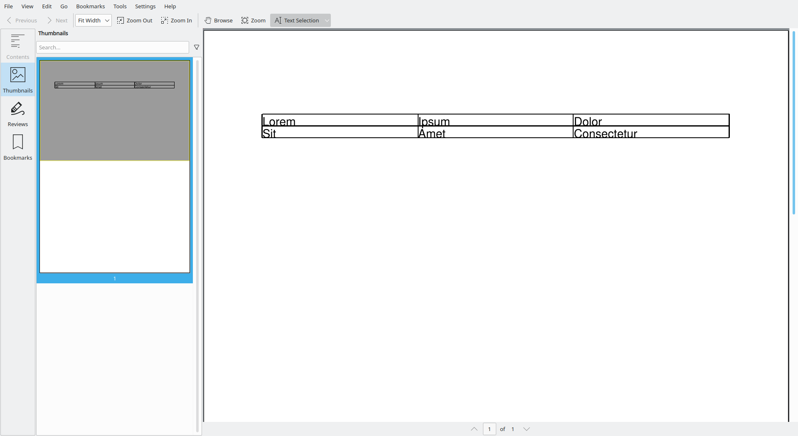

This is not exactly the best looking table in the world. 
Let's add some padding to all cells to ensure the text doesn't *stick* to the cell borders so much.

```python
from decimal import Decimal  
  
from borb.pdf.canvas.layout.page_layout.multi_column_layout import SingleColumnLayout  
from borb.pdf.canvas.layout.page_layout.page_layout import PageLayout  
from borb.pdf.canvas.layout.table.fixed_column_width_table import FixedColumnWidthTable  
from borb.pdf.canvas.layout.text.paragraph import Paragraph  
from borb.pdf.document import Document  
from borb.pdf.page.page import Page  
from borb.pdf.pdf import PDF  
  
  
def main():  
    doc: Document = Document()  
    page: Page = Page()  
    doc.append_page(page)  
  
    layout: PageLayout = SingleColumnLayout(page)  
    layout.add(  
        FixedColumnWidthTable(number_of_columns=3, number_of_rows=2)  
        .add(Paragraph("Lorem"))  
        .add(Paragraph("Ipsum"))  
        .add(Paragraph("Dolor"))  
        .add(Paragraph("Sit"))  
        .add(Paragraph("Amet"))  
        .add(Paragraph("Consectetur"))  
        .set_padding_on_all_cells(Decimal(2), Decimal(2), Decimal(2), Decimal(2))  
    )  
  
    with open("output.pdf", "wb") as out_file_handle:  
        PDF.dumps(out_file_handle, doc)  
  
  
if __name__ == "__main__":  
    main()
```


That's a lot better already. 

As mentioned earlier, the precise ratio of the `page_width` that each column occupies is something you can configure. 
In the next example you'll be setting one column to take up 50% of the `page_width`, 
and divide the remaining space among the other 2.

```python
from decimal import Decimal  
  
from borb.pdf.canvas.layout.page_layout.multi_column_layout import SingleColumnLayout  
from borb.pdf.canvas.layout.page_layout.page_layout import PageLayout  
from borb.pdf.canvas.layout.table.fixed_column_width_table import FixedColumnWidthTable  
from borb.pdf.canvas.layout.text.paragraph import Paragraph  
from borb.pdf.document import Document  
from borb.pdf.page.page import Page  
from borb.pdf.pdf import PDF  
  
  
def main():  
    doc: Document = Document()  
    page: Page = Page()  
    doc.append_page(page)  
  
    layout: PageLayout = SingleColumnLayout(page)  
    layout.add(  
        FixedColumnWidthTable(  
            number_of_columns=3,  
            number_of_rows=2,  
            column_widths=[Decimal(2), Decimal(1), Decimal(1)],  
        )  
        .add(Paragraph("Lorem"))  
        .add(Paragraph("Ipsum"))  
        .add(Paragraph("Dolor"))  
        .add(Paragraph("Sit"))  
        .add(Paragraph("Amet"))  
        .add(Paragraph("Consectetur"))  
        .set_padding_on_all_cells(Decimal(2), Decimal(2), Decimal(2), Decimal(2))  
    )  
  
    with open("output.pdf", "wb") as out_file_handle:  
        PDF.dumps(out_file_handle, doc)  
  
  
if __name__ == "__main__":  
    main()
```


There are some other minor tweaks you can apply. 
To really visualize the next tweak, we should add some more data.

```python
from decimal import Decimal  
  
from borb.pdf.canvas.color.color import X11Color  
from borb.pdf.canvas.layout.page_layout.multi_column_layout import SingleColumnLayout  
from borb.pdf.canvas.layout.page_layout.page_layout import PageLayout  
from borb.pdf.canvas.layout.table.fixed_column_width_table import FixedColumnWidthTable  
from borb.pdf.canvas.layout.text.paragraph import Paragraph  
from borb.pdf.document import Document  
from borb.pdf.page.page import Page  
from borb.pdf.pdf import PDF  
  
  
def main():  
    doc: Document = Document()  
    page: Page = Page()  
    doc.append_page(page)  
  
    layout: PageLayout = SingleColumnLayout(page)  
    layout.add(  
        FixedColumnWidthTable(number_of_columns=3, number_of_rows=4)  
        .add(Paragraph("Lorem"))  
        .add(Paragraph("Ipsum"))  
        .add(Paragraph("Dolor"))  
        .add(Paragraph("Sit"))  
        .add(Paragraph("Amet"))  
        .add(Paragraph("Consectetur"))  
        .add(Paragraph("Adipiscing"))  
        .add(Paragraph("Elit"))  
        .add(Paragraph("Sed"))  
        .add(Paragraph("Do"))  
        .add(Paragraph("Eiusmod"))  
        .add(Paragraph("Tempor"))  
        .set_padding_on_all_cells(Decimal(2), Decimal(2), Decimal(2), Decimal(2))  
        .even_odd_row_colors(X11Color("LightGray"), X11Color("White"))  
    )  
  
    with open("output.pdf", "wb") as out_file_handle:  
        PDF.dumps(out_file_handle, doc)  
  
  
if __name__ == "__main__":  
    main()
```

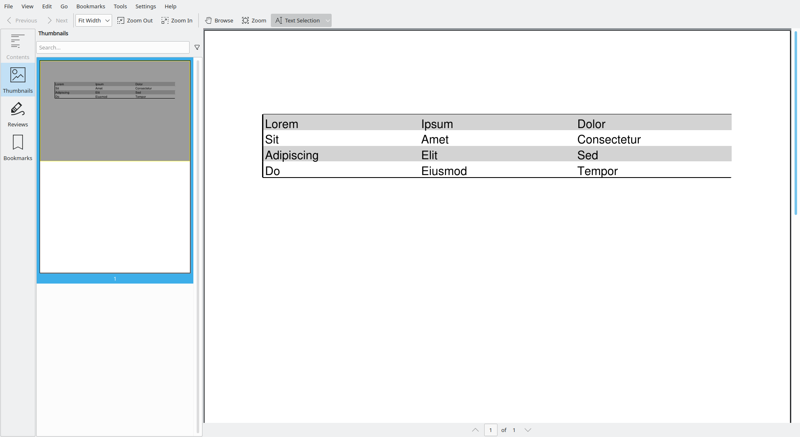

#### 2.10.2.2 FlexibleColumnWidthTable

In the next example you're going to create a `Table` similar to the ones you created earlier. 
The difference between both kinds of `Table` will become obvious.

```python
from borb.pdf.canvas.layout.page_layout.multi_column_layout import SingleColumnLayout  
from borb.pdf.canvas.layout.page_layout.page_layout import PageLayout  
from borb.pdf.canvas.layout.table.flexible_column_width_table import FlexibleColumnWidthTable  
from borb.pdf.canvas.layout.text.paragraph import Paragraph  
from borb.pdf.document import Document  
from borb.pdf.page.page import Page  
from borb.pdf.pdf import PDF  
  
  
def main():  
    doc: Document = Document()  
    page: Page = Page()  
    doc.append_page(page)  
  
    layout: PageLayout = SingleColumnLayout(page)  
    layout.add(  
        FlexibleColumnWidthTable(number_of_columns=3, number_of_rows=2)  
        .add(Paragraph("Lorem"))  
        .add(Paragraph("Ipsum"))  
        .add(Paragraph("Dolor"))  
        .add(Paragraph("Sit"))  
        .add(Paragraph("Amet"))  
        .add(Paragraph("Consectetur"))  
    )  
  
    with open("output.pdf", "wb") as out_file_handle:  
        PDF.dumps(out_file_handle, doc)  
  
  
if __name__ == "__main__":  
    main()
```


Let's set the padding. That'll make this `Table` look a bit better.

```python
from decimal import Decimal  
  
from borb.pdf.canvas.layout.page_layout.multi_column_layout import SingleColumnLayout  
from borb.pdf.canvas.layout.page_layout.page_layout import PageLayout  
from borb.pdf.canvas.layout.table.flexible_column_width_table import FlexibleColumnWidthTable  
from borb.pdf.canvas.layout.text.paragraph import Paragraph  
from borb.pdf.document import Document  
from borb.pdf.page.page import Page  
from borb.pdf.pdf import PDF  
  
  
def main():  
    doc: Document = Document()  
    page: Page = Page()  
    doc.append_page(page)  
  
    layout: PageLayout = SingleColumnLayout(page)  
    layout.add(  
        FlexibleColumnWidthTable(number_of_columns=3, number_of_rows=2)  
        .add(Paragraph("Lorem"))  
        .add(Paragraph("Ipsum"))  
        .add(Paragraph("Dolor"))  
        .add(Paragraph("Sit"))  
        .add(Paragraph("Amet"))  
        .add(Paragraph("Consectetur"))  
        .set_padding_on_all_cells(Decimal(2), Decimal(2), Decimal(2), Decimal(2))  
    )  
  
    with open("output.pdf", "wb") as out_file_handle:  
        PDF.dumps(out_file_handle, doc)  
  
  
if __name__ == "__main__":  
    main()
```

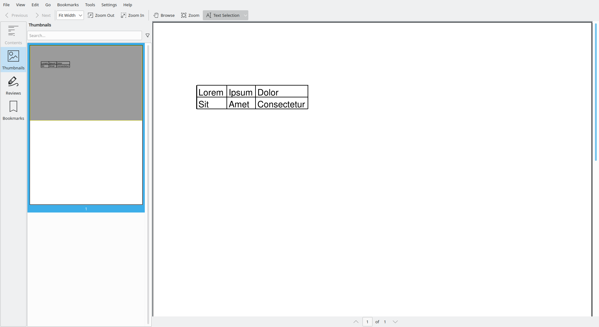

As you can see, this `Table` only takes up as much space as is needed to render the content in each `TableCell`.
This is more in line with the behavior you'd expect from an `HTML` `<table>` element.

#### 2.10.2.3 Setting layout properties on individual cells of a `Table`

In the previous examples you've already set some layout properties. You've set padding and applied alternating background colors. Of course, there are use-cases where you'd like to set these properties on individual cell objects. 

In order to do that, you'll need to construct a `TableCell` object and apply the style there. This may feel like a bit of a workaround, but you've already been using this object without knowing it.

Every time you've added anything to a `Table` that isn't `TableCell` it was automatically getting wrapped in a `TableCell` object.

In the next example, you'll be setting the background color of an individual cell to `X11Color('Red')` and removing two of its borders.

```
from decimal import Decimal  
  
from borb.pdf.canvas.color.color import X11Color  
from borb.pdf.canvas.layout.page_layout.multi_column_layout import SingleColumnLayout  
from borb.pdf.canvas.layout.page_layout.page_layout import PageLayout  
from borb.pdf.canvas.layout.table.table import TableCell  
from borb.pdf.canvas.layout.table.flexible_column_width_table import FlexibleColumnWidthTable  
from borb.pdf.canvas.layout.text.paragraph import Paragraph  
from borb.pdf.document import Document  
from borb.pdf.page.page import Page  
from borb.pdf.pdf import PDF  
  
  
def main():  
    doc: Document = Document()  
    page: Page = Page()  
    doc.append_page(page)  
  
    layout: PageLayout = SingleColumnLayout(page)  
    layout.add(  
        FlexibleColumnWidthTable(number_of_columns=3, number_of_rows=2)  
        .add(TableCell(Paragraph("Lorem"),  
                       background_color=X11Color("Red"),  
                       border_top=False,  
                       border_left=False))  
        .add(Paragraph("Ipsum"))  
        .add(Paragraph("Dolor"))  
        .add(Paragraph("Sit"))  
        .add(Paragraph("Amet"))  
        .add(Paragraph("Consectetur"))  
        .set_padding_on_all_cells(Decimal(2), Decimal(2), Decimal(2), Decimal(2))  
    )  
  
    with open("output.pdf", "wb") as out_file_handle:  
        PDF.dumps(out_file_handle, doc)  
  
  
if __name__ == "__main__":  
    main()
```


This is particularly useful when you're building a comparison matrix, and you'd like to *remove* the `TableCell` at the top-left corner.

In the next example you'll build a feature-comparison matrix for several mobile tourist guides;

```python
from decimal import Decimal

from borb.pdf.canvas.layout.emoji.emoji import Emojis
from borb.pdf.canvas.layout.layout_element import Alignment
from borb.pdf.canvas.layout.page_layout.multi_column_layout import SingleColumnLayout
from borb.pdf.canvas.layout.page_layout.page_layout import PageLayout
from borb.pdf.canvas.layout.table.table import TableCell
from borb.pdf.canvas.layout.table.flexible_column_width_table import (
    FlexibleColumnWidthTable,
)
from borb.pdf.canvas.layout.text.paragraph import Paragraph
from borb.pdf.document import Document
from borb.pdf.page.page import Page
from borb.pdf.page.page_size import PageSize
from borb.pdf.pdf import PDF


def main():
    doc: Document = Document()
    page: Page = Page(PageSize.A4_LANDSCAPE.value[0], PageSize.A4_LANDSCAPE.value[1])
    doc.append_page(page)

    layout: PageLayout = SingleColumnLayout(page)
    layout.add(
        FlexibleColumnWidthTable(number_of_columns=11, number_of_rows=5)
        # row 1
        .add(
            TableCell(
                Paragraph(" "),
                border_top=False,
                border_left=False,
            )
        )
        .add(Paragraph("View map", text_alignment=Alignment.CENTERED))
        .add(Paragraph("Place marker on a map", text_alignment=Alignment.CENTERED))
        .add(Paragraph("View direction", text_alignment=Alignment.CENTERED))
        .add(Paragraph("Launch Google maps", text_alignment=Alignment.CENTERED))
        .add(Paragraph("Show street view", text_alignment=Alignment.CENTERED))
        .add(Paragraph("Download map from Google", text_alignment=Alignment.CENTERED))
        .add(Paragraph("Show satelite view", text_alignment=Alignment.CENTERED))
        .add(
            Paragraph(
                "Search for nearest attraction", text_alignment=Alignment.CENTERED
            )
        )
        .add(Paragraph("Show next attraction", text_alignment=Alignment.CENTERED))
        .add(Paragraph("Retrieve data", text_alignment=Alignment.CENTERED))
        # row 2
        .add(Paragraph("Mobile Tourist Guide 1"))
        .add(Emojis.HEAVY_CHECK_MARK.value)
        .add(Emojis.HEAVY_CHECK_MARK.value)
        .add(Emojis.HEAVY_CHECK_MARK.value)
        .add(Emojis.HEAVY_CHECK_MARK.value)
        .add(Emojis.HEAVY_CHECK_MARK.value)
        .add(Paragraph(" "))
        .add(Paragraph(" "))
        .add(Paragraph(" "))
        .add(Paragraph(" "))
        .add(Paragraph(" "))
        # row 3
        .add(Paragraph("Mobile Tourist Guide 2"))
        .add(Emojis.HEAVY_CHECK_MARK.value)
        .add(Emojis.HEAVY_CHECK_MARK.value)
        .add(Emojis.HEAVY_CHECK_MARK.value)
        .add(Emojis.HEAVY_CHECK_MARK.value)
        .add(Emojis.HEAVY_CHECK_MARK.value)
        .add(Emojis.HEAVY_CHECK_MARK.value)
        .add(Paragraph(" "))
        .add(Paragraph(" "))
        .add(Paragraph(" "))
        .add(Paragraph(" "))
        # row 4
        .add(Paragraph("Mobile Tourist Guide 3"))
        .add(Emojis.HEAVY_CHECK_MARK.value)
        .add(Emojis.HEAVY_CHECK_MARK.value)
        .add(Emojis.HEAVY_CHECK_MARK.value)
        .add(Emojis.HEAVY_CHECK_MARK.value)
        .add(Emojis.HEAVY_CHECK_MARK.value)
        .add(Paragraph(" "))
        .add(Emojis.HEAVY_CHECK_MARK.value)
        .add(Paragraph(" "))
        .add(Paragraph(" "))
        .add(Paragraph(" "))
        # row 5
        .add(Paragraph("Mobile Tourist Guide 4"))
        .add(Emojis.HEAVY_CHECK_MARK.value)
        .add(Emojis.HEAVY_CHECK_MARK.value)
        .add(Emojis.HEAVY_CHECK_MARK.value)
        .add(Emojis.HEAVY_CHECK_MARK.value)
        .add(Emojis.HEAVY_CHECK_MARK.value)
        .add(Paragraph(" "))
        .add(Paragraph(" "))
        .add(Emojis.HEAVY_CHECK_MARK.value)
        .add(Emojis.HEAVY_CHECK_MARK.value)
        .add(Emojis.HEAVY_CHECK_MARK.value)
        .set_padding_on_all_cells(Decimal(5), Decimal(5), Decimal(5), Decimal(5))
    )

    with open("output.pdf", "wb") as out_file_handle:
        PDF.dumps(out_file_handle, doc)


if __name__ == "__main__":
    main()

```


#### 2.10.2.4 Incomplete `Table`

`Table` requires you to specify the number of rows and columns up front. Sometimes however, the amount of data does not really match `rows x columns`, and the final few cells of your `Table` are not needed.

In order to avoid having to pass empty `TableCell` or `Paragraph` objects, you can rely on the auto-complete feature of the `Table` implementation.

Whenever a `Table` does not have `rows x columns` objects in it, the remaining cells are filled with blank by default. The style (borders, backgrounds, etc) is also copied from the default style.

In the next example you'll create an incomplete `Table` and watch how the `Table` is filled by `borb`.

```python
from decimal import Decimal  
  
from borb.pdf.canvas.layout.page_layout.multi_column_layout import SingleColumnLayout  
from borb.pdf.canvas.layout.page_layout.page_layout import PageLayout  
from borb.pdf.canvas.layout.table.flexible_column_width_table import FlexibleColumnWidthTable  
from borb.pdf.canvas.layout.text.paragraph import Paragraph  
from borb.pdf.document import Document  
from borb.pdf.page.page import Page  
from borb.pdf.pdf import PDF  
  
  
def main():  
    doc: Document = Document()  
    page: Page = Page()  
    doc.append_page(page)  
  
    layout: PageLayout = SingleColumnLayout(page)  
    layout.add(  
        FlexibleColumnWidthTable(number_of_columns=3, number_of_rows=2)  
        .add(Paragraph("Lorem"))  
        .add(Paragraph("Ipsum"))  
        .add(Paragraph("Dolor"))  
        .add(Paragraph("Sit"))  
        .set_padding_on_all_cells(Decimal(2), Decimal(2), Decimal(2), Decimal(2))  
    )  
  
    with open("output.pdf", "wb") as out_file_handle:  
        PDF.dumps(out_file_handle, doc)  
  
  
if __name__ == "__main__":  
    main()
```

You'll have noticed that you created a `Table` that expects 6 pieces of content. 
Yet, you added only 4. 
The remainder will be dealt with by `borb` automatically.

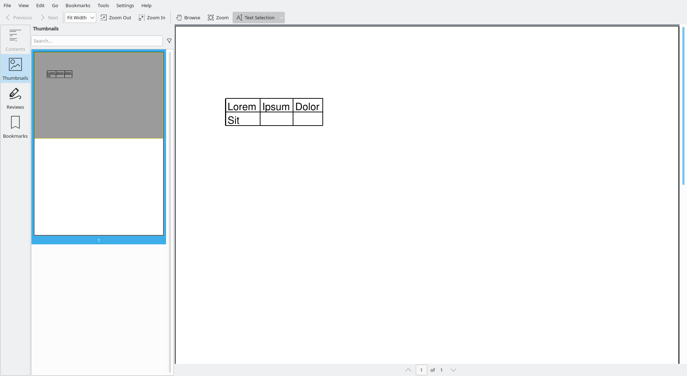

**Keep in mind the style will be the default style.** 
If that's not what you want, you should add each TableCell individually, 
or write a convenience method that builds empty cells with the appropriate style.

#### 2.10.2.5 Setting `col_span` and `row_span`

Sometimes, you'd like to shake things up a bit. 
For instance using a `TableCell` that spans multiple rows or columns. 
`borb` naturally supports concepts such as `col_span` and `row_span`

In the next example you'll be using `col_span` on a `TableCell` object.

```python
from decimal import Decimal  
  
from borb.pdf.canvas.layout.page_layout.multi_column_layout import SingleColumnLayout  
from borb.pdf.canvas.layout.page_layout.page_layout import PageLayout  
from borb.pdf.canvas.layout.table.table import TableCell  
from borb.pdf.canvas.layout.table.flexible_column_width_table import FlexibleColumnWidthTable  
from borb.pdf.canvas.layout.text.paragraph import Paragraph  
from borb.pdf.document import Document  
from borb.pdf.page.page import Page  
from borb.pdf.pdf import PDF  
  
  
def main():  
    doc: Document = Document()  
    page: Page = Page()  
    doc.append_page(page)  
  
    layout: PageLayout = SingleColumnLayout(page)  
    layout.add(  
        FlexibleColumnWidthTable(number_of_columns=3, number_of_rows=2)  
        .add(Paragraph("Lorem"))  
        .add(Paragraph("Ipsum"))  
        .add(Paragraph("Dolor"))  
        .add(TableCell(Paragraph("Sit"), col_span=2))  
        .add(Paragraph("Amet"))  
        .set_padding_on_all_cells(Decimal(2), Decimal(2), Decimal(2), Decimal(2))  
    )  
  
    with open("output.pdf", "wb") as out_file_handle:  
        PDF.dumps(out_file_handle, doc)  
  
  
if __name__ == "__main__":  
    main()
```


Of course, you can do the same for `row_span`:

```python
from decimal import Decimal  
  
from borb.pdf.canvas.layout.page_layout.multi_column_layout import SingleColumnLayout  
from borb.pdf.canvas.layout.page_layout.page_layout import PageLayout  
from borb.pdf.canvas.layout.table.table import TableCell  
from borb.pdf.canvas.layout.table.flexible_column_width_table import FlexibleColumnWidthTable  
from borb.pdf.canvas.layout.text.paragraph import Paragraph  
from borb.pdf.document import Document  
from borb.pdf.page.page import Page  
from borb.pdf.pdf import PDF  
  
  
def main():  
    doc: Document = Document()  
    page: Page = Page()  
    doc.append_page(page)  
  
    layout: PageLayout = SingleColumnLayout(page)  
    layout.add(  
        FlexibleColumnWidthTable(number_of_columns=3, number_of_rows=2)  
        .add(TableCell(Paragraph("Lorem"), row_span=2))  
        .add(Paragraph("Ipsum"))  
        .add(Paragraph("Dolor"))  
        .add(Paragraph("Sit"))  
        .add(Paragraph("Amet"))  
        .set_padding_on_all_cells(Decimal(2), Decimal(2), Decimal(2), Decimal(2))  
    )  
  
    with open("output.pdf", "wb") as out_file_handle:  
        PDF.dumps(out_file_handle, doc)  
  
  
if __name__ == "__main__":  
    main()
```


<div style="page-break-before: always;"></div>

## 2.11 Forms

### 2.11.1 Acroforms vs XFA

From wikipedia:

> XFA (also known as XFA forms) stands for XML Forms Architecture, a family of proprietary XML specifications that was suggested and developed by JetForm to enhance the processing of web forms.  
> It can be also used in PDF files starting with the PDF 1.5 specification. 
> The XFA specification is referenced as an external specification necessary for full application of the ISO 32000-1 specification (PDF 1.7). 
> The XML Forms Architecture was not standardized as an ISO standard, and has been deprecated in PDF 2.0.

### 2.11.2 The `FormField` object

From the PDF specification:

> An interactive form (PDF 1.2)—sometimes referred to as an AcroForm—is a collection of fields for gathering information interactively from the user. 
> A PDF document may contain any number of fields appearing on any combination of pages, all of which make up a single, global interactive form spanning the entire document.
> Arbitrary subsets of these fields can be imported or exported from the document; see 12.7.5, “Form Actions.”
>
> Each field in a document’s interactive form shall be defined by a field dictionary (see 12.7.3, “Field Dictionaries”). 
> For purposes of definition and naming, the fields can be organized hierarchically and can inherit attributes from their ancestors in the field hierarchy.
> 
> A field’s children in the hierarchy may also include widget annotations (see 12.5.6.19, “Widget Annotations”) that define its appearance on the page. 
> A field that has children that are fields is called a non-terminal field. 
> A field that does not have children that are fields is called a terminal field.

> Interactive forms (see 12.7, “Interactive Forms”) use widget annotations (PDF 1.2) to represent the appearance of fields and to manage user interactions. 
> As a convenience, when a field has only a single associated widget annotation, the contents of the field dictionary (12.7.3, “Field Dictionaries”) 
> and the annotation dictionary may be merged into a single dictionary containing entries that pertain to both a field and an annotation.

`borb` supports AcroForm technology in a way that is indistinguishable from other `LayoutElement` implementations. 
To the user, the technical side of forms (especially to the level of how the `Dictionary` objects are structured) is often not that important.

You can add a `FormField` object to a `Page` or `PageLayout` in the same way you'd add a `Paragraph` and everything will be taken care of.
`borb` will create the `Dictionary` objects, add them to the `Page`, perform all the calculations needed for layout, etc

### 2.11.3 Adding `FormField` objects to a PDF

`FormField` represents the common base implementation of form fields. 
It handles the logic that is common to `TextField`, `CheckBox`, `DropDownList` and other classes.

#### 2.11.3.1 Adding a `TextField` to a PDF

In the next example you'll be using a `Table` in conjunction with `TextField` objects to build a very rudimentary form.

```python
from decimal import Decimal

from borb.pdf.canvas.layout.forms.text_field import TextField
from borb.pdf.canvas.layout.page_layout.multi_column_layout import SingleColumnLayout
from borb.pdf.canvas.layout.page_layout.page_layout import PageLayout
from borb.pdf.canvas.layout.table.fixed_column_width_table import FixedColumnWidthTable
from borb.pdf.canvas.layout.text.paragraph import Paragraph
from borb.pdf.document import Document
from borb.pdf.page.page import Page
from borb.pdf.pdf import PDF


def main():

    # Document
    d: Document = Document()

    # Page
    p: Page = Page()
    d.append_page(p)

    # PageLayout
    l: PageLayout = SingleColumnLayout(p)

    # add fields
    l.add(
        FixedColumnWidthTable(number_of_columns=2, number_of_rows=3)
        .add(Paragraph("Name:"))
        .add(TextField(field_name="name"))
        .add(Paragraph("Firstname:"))
        .add(TextField(field_name="firstname"))
        .add(Paragraph("Country"))
        .add(TextField(field_name="country"))
        .set_padding_on_all_cells(Decimal(2), Decimal(2), Decimal(2), Decimal(2))
        .no_borders()
    )

    # store
    with open("output.pdf", "wb") as pdf_file_handle:
        PDF.dumps(pdf_file_handle, d)


if __name__ == "__main__":
    main()

```

The output `Document` should look like this.
Notice the little warning ribbon atop the `Document` (which may appear differently depending on the PDF reader you are using).


Let's show the forms, and see what you've made:


We can of course fill in values in these textboxes:


And now, when we hide the forms again, the text becomes uneditable:

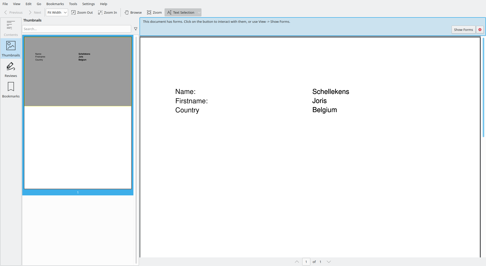

Your PDF reader may ask you whether you'd like to save the values in the form before closing the `Document`.

#### 2.11.3.2 Customizing a `TextField` object

`TextField` accepts the same arguments as `Paragraph` when it comes to styling.
For instance, you can also set the `font_color`.

```python
from decimal import Decimal

from borb.pdf.canvas.color.color import HexColor
from borb.pdf.canvas.layout.forms.text_field import TextField
from borb.pdf.canvas.layout.page_layout.multi_column_layout import SingleColumnLayout
from borb.pdf.canvas.layout.page_layout.page_layout import PageLayout
from borb.pdf.canvas.layout.table.fixed_column_width_table import FixedColumnWidthTable
from borb.pdf.canvas.layout.text.paragraph import Paragraph
from borb.pdf.document import Document
from borb.pdf.page.page import Page
from borb.pdf.pdf import PDF


def main():

    # Document
    d: Document = Document()

    # Page
    p: Page = Page()
    d.append_page(p)

    # PageLayout
    l: PageLayout = SingleColumnLayout(p)

    # add fields
    l.add(
        FixedColumnWidthTable(number_of_columns=2, number_of_rows=3)
        .add(Paragraph("Name:"))
        .add(TextField(field_name="name", font_color=HexColor("f1cd2e")))
        .add(Paragraph("Firstname:"))
        .add(TextField(field_name="firstname", font_color=HexColor("f1cd2e")))
        .add(Paragraph("Country"))
        .add(TextField(field_name="country"))
        .set_padding_on_all_cells(Decimal(2), Decimal(2), Decimal(2), Decimal(2))
        .no_borders()
    )

    # store
    with open("output.pdf", "wb") as pdf_file_handle:
        PDF.dumps(pdf_file_handle, d)


if __name__ == "__main__":
    main()

```

This does not really have an impact on the form when it's editable:


But it does change the appearance of the form once it's uneditable:


#### 2.11.3.3 Pre-filling a `TextField` object

You can of course pre-fill a `TextField`. This can be quite useful when you already know some of the values,
or when one particular answer occurs most of the time (it might save your reader some time if the most likely answer is pre-filled).

In the next example you'll be updating the code you wrote earlier to generate a simple form, and pre-fill some of its values;

```python
from decimal import Decimal

from borb.pdf.canvas.color.color import HexColor
from borb.pdf.canvas.layout.forms.text_field import TextField
from borb.pdf.canvas.layout.page_layout.multi_column_layout import SingleColumnLayout
from borb.pdf.canvas.layout.page_layout.page_layout import PageLayout
from borb.pdf.canvas.layout.table.fixed_column_width_table import FixedColumnWidthTable
from borb.pdf.canvas.layout.text.paragraph import Paragraph
from borb.pdf.document import Document
from borb.pdf.page.page import Page
from borb.pdf.pdf import PDF


def main():

    # Document
    d: Document = Document()

    # Page
    p: Page = Page()
    d.append_page(p)

    # PageLayout
    l: PageLayout = SingleColumnLayout(p)

    # add fields
    l.add(
        FixedColumnWidthTable(number_of_columns=2, number_of_rows=3)
        .add(Paragraph("Name:"))
        .add(TextField(field_name="name", font_color=HexColor("f1cd2e")))
        .add(Paragraph("Firstname:"))
        .add(TextField(field_name="firstname", font_color=HexColor("f1cd2e")))
        .add(Paragraph("Country"))
        .add(TextField(field_name="country", value="Belgium"))
        .set_padding_on_all_cells(Decimal(2), Decimal(2), Decimal(2), Decimal(2))
        .no_borders()
    )

    # store
    with open("output_form.pdf", "wb") as pdf_file_handle:
        PDF.dumps(pdf_file_handle, d)


if __name__ == "__main__":
    main()
```


#### 2.11.3.4 Adding a `DropDownList` to a PDF

You've seen how to add a `TextField`, but what if you'd like to restrict the reader to only allow certain inputs.
This is typically where you could also use a `DropDownList`.
A `DropDownList` can be constructed with `typing.List[str]` and will allow the user to select one of the options.

```python
from decimal import Decimal

from borb.pdf.canvas.color.color import HexColor
from borb.pdf.canvas.layout.forms.drop_down_list import DropDownList
from borb.pdf.canvas.layout.forms.text_field import TextField
from borb.pdf.canvas.layout.page_layout.multi_column_layout import SingleColumnLayout
from borb.pdf.canvas.layout.page_layout.page_layout import PageLayout
from borb.pdf.canvas.layout.table.fixed_column_width_table import FixedColumnWidthTable
from borb.pdf.canvas.layout.text.paragraph import Paragraph
from borb.pdf.document import Document
from borb.pdf.page.page import Page
from borb.pdf.pdf import PDF


def main():

    # Document
    d: Document = Document()

    # Page
    p: Page = Page()
    d.append_page(p)

    # PageLayout
    l: PageLayout = SingleColumnLayout(p)

    # add fields
    l.add(
        FixedColumnWidthTable(number_of_columns=2, number_of_rows=3)
        .add(Paragraph("Name:"))
        .add(TextField(field_name="name", font_color=HexColor("f1cd2e")))
        .add(Paragraph("Firstname:"))
        .add(TextField(field_name="firstname", font_color=HexColor("f1cd2e")))
        .add(Paragraph("Country"))
        .add(DropDownList(field_name="country", possible_values=["Belgium", "Canada", "Denmark", "Estonia"]))
        .set_padding_on_all_cells(Decimal(2), Decimal(2), Decimal(2), Decimal(2))
        .no_borders()
    )

    # store
    with open("output_form.pdf", "wb") as pdf_file_handle:
        PDF.dumps(pdf_file_handle, d)


if __name__ == "__main__":
    main()

```

#### 2.11.3.5 Adding a `CountryDropDownList` to a PDF

It would be rather nonsensical to have every developer that uses `borb` code up the same `DropDownList` over and over again.
One of the key usecases of `DropDownList` is when you're using it to allow the user to select a country from a  list of all countries in the world.
`borb` comes to the resque with its `CountryDropDownList`, which comes pre-loaded with all the country-names.

```python
from decimal import Decimal

from borb.pdf.canvas.color.color import HexColor
from borb.pdf.canvas.layout.forms.country_drop_down_list import CountryDropDownList
from borb.pdf.canvas.layout.forms.text_field import TextField
from borb.pdf.canvas.layout.page_layout.multi_column_layout import SingleColumnLayout
from borb.pdf.canvas.layout.page_layout.page_layout import PageLayout
from borb.pdf.canvas.layout.table.fixed_column_width_table import FixedColumnWidthTable
from borb.pdf.canvas.layout.text.paragraph import Paragraph
from borb.pdf.document import Document
from borb.pdf.page.page import Page
from borb.pdf.pdf import PDF


def main():

    # Document
    d: Document = Document()

    # Page
    p: Page = Page()
    d.append_page(p)

    # PageLayout
    l: PageLayout = SingleColumnLayout(p)

    # add fields
    l.add(
        FixedColumnWidthTable(number_of_columns=2, number_of_rows=3)
        .add(Paragraph("Name:"))
        .add(TextField(field_name="name", font_color=HexColor("f1cd2e")))
        .add(Paragraph("Firstname:"))
        .add(TextField(field_name="firstname", font_color=HexColor("f1cd2e")))
        .add(Paragraph("Country"))
        .add(CountryDropDownList(field_name="country"))
        .set_padding_on_all_cells(Decimal(2), Decimal(2), Decimal(2), Decimal(2))
        .no_borders()
    )

    # store
    with open("output_form.pdf", "wb") as pdf_file_handle:
        PDF.dumps(pdf_file_handle, d)


if __name__ == "__main__":
    main()

```

#### 2.11.3.6 Adding a `CheckBox` to a PDF

#### 2.11.3.7 Adding a `RadioButton` to a PDF

### 2.11.4 Changing the value of a `FormField` in an existing PDF

This is another very common usecase.
You have designed a wonderful PDF, complete with `FormField` objects (perhaps in another PDF software suite),
and now you'd like to use your work as a template (so to speak) and generate hundreds of `Document` objects based on this one `Document` with a form.

I've seen this exact approach used in movie-theaters, where tickets needed to be produced containing seating and movie-information.
Or even for a famous circus-act.

In the next example you'll be using an existing PDF (the one you created earlier), and filling in its fields.
Later you'll learn how to remove interactivity by flattening the `Document`.

```python

```

### 2.11.5 Getting the value of a `FormField` in an existing PDF

In this section you'll learn how to retrieve the values that a user filled in from a PDF AcroForm.
You'll be using the PDF created earlier. 
Be sure to open it, fill in some values, and save it in order to get everything ready for this example.

```python

```

### 2.11.6 Flattening a `FormField`

<div style="page-break-before: always;"></div>

## 2.12 Conclusion

In this section you've learned the basics of creating a new PDF using `borb`. 
In this section you've learned how various pieces of content are represented by the different `LayoutElement` implementations in `borb`. 
You've worked with text, images, barcodes, qr-codes, emoji, and geometric shapes.

You've briefly explored classes like; `Paragraph`, `Image`, `Shape`, `Emoji`, `OrderedList`, `UnorderedList`, `FlexibleColumnWidthTable` and `FixedColumnWidthTable`.

You've learned how to set various properties like `font_color`, or `background_color` 
and even used `horizontal_alignment` , `vertical_alignment` and `text_alignment`.

You've briefly explored `PageLayout`, `BrowserLayout` and even manual layout.

To see how you can use all of those techniques together, 
check out some of the deep-dives, where I'll show you how to create an invoice from start to finish.

<div style="page-break-before: always;"></div>

