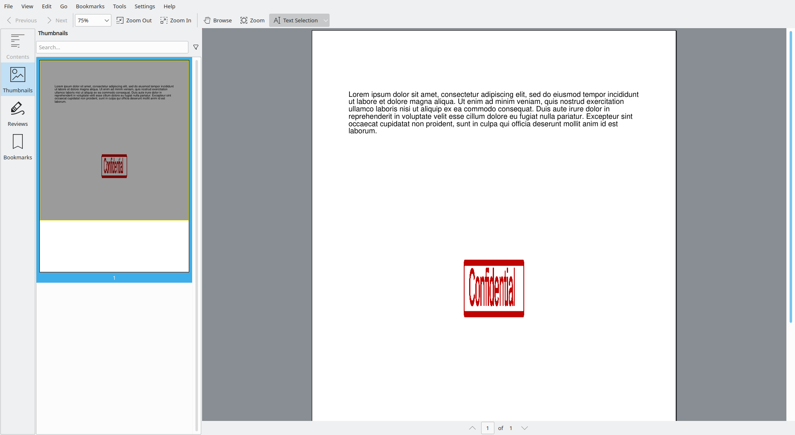
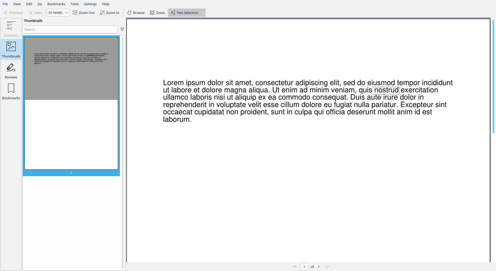
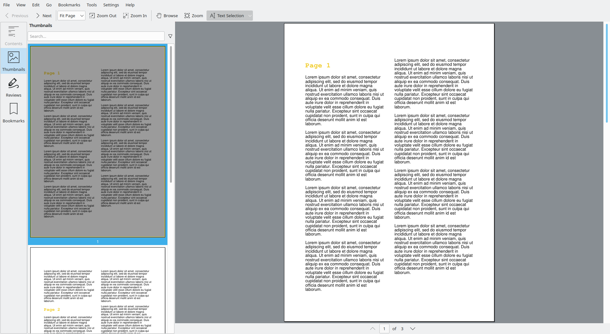

# 3. Working with existing PDFs

For some use-cases, you won't be creating the PDF's yourself. Imagine setting up a pipeline that automatically processes PDF invoices. Or even processing order forms.

Most of these workflows can be boiled down to some simple steps that can be handled with `borb`.

In this section you'll learn the ins and outs of working with existing PDF's.


<div style="page-break-before: always;"></div>

## 3.1 Extracting meta-information

Suppose you have a PDF document. Did you know it contains meta-information? Try it. Next time you have a PDF open in Adobe, press CTRL+D to open the document properties. You'll find things like:

- Author
- Producer
- Creation date
- Modification date
- Software that created the document
- Etc

It can be very useful to be able to extract these. Processing an invoice for instance might be more accurate if we know "supplier A uses software B to create their invoices, and python script C works best for that" versus "supplier X uses software Y, which is best handled by script Z".

### 3.1.1 Extracting the author from a PDF

In the next example you'll start by extracting the author from the PDF. 
This is of course assuming this property was set by whatever software created the PDF.

In order to be able to test these examples and get the same result as the book, I am providing a snippet of code here that will generate a very simple PDF;

```python
from borb.io.read.types import Name, String, Dictionary  
from borb.pdf.canvas.layout.page_layout.multi_column_layout import SingleColumnLayout  
from borb.pdf.canvas.layout.page_layout.page_layout import PageLayout  
from borb.pdf.canvas.layout.text.paragraph import Paragraph  
from borb.pdf.document import Document  
from borb.pdf.page.page import Page  
from borb.pdf.pdf import PDF  
  
  
def main():  
    doc: Document = Document()  
    page: Page = Page()  
    doc.append_page(page)  
  
    layout: PageLayout = SingleColumnLayout(page)  
    layout.add(Paragraph("""  
                        Lorem ipsum dolor sit amet, consectetur adipiscing elit, sed do eiusmod tempor incididunt ut labore et dolore magna aliqua.                        Ut enim ad minim veniam, quis nostrud exercitation ullamco laboris nisi ut aliquip ex ea commodo consequat.   
                        Duis aute irure dolor in reprehenderit in voluptate velit esse cillum dolore eu fugiat nulla pariatur.   
                        Excepteur sint occaecat cupidatat non proident, sunt in culpa qui officia deserunt mollit anim id est laborum.  
                        """))  
  
    # set the /Info dictionary  
    doc["XRef"]["Trailer"][Name("Info")] = Dictionary()  
  
    # set the /Author  
    doc["XRef"]["Trailer"]["Info"][Name("Author")] = String("Joris Schellekens")  
  
    with open("output.pdf", "wb") as out_file_handle:  
        PDF.dumps(out_file_handle, doc)  

  
if __name__ == "__main__":  
    main()
```

The PDF doesn't really look all that special when you open it.


But, when you open the properties (the exact shortcut differs depending on which PDF viewer you're using of course), you'll see the meta-data:


Now, let's assume you're getting this PDF (perhaps via email, or some automated process) and you'd like to extract the author from it.

`borb` allows you to do that in just a few lines of code:

```python
import typing  
from borb.pdf.document import Document  
from borb.pdf.pdf import PDF  
  
  
def main():  
  
    doc: typing.Optional[Document] = None  
    with open("output.pdf", "rb") as in_file_handle:  
        doc = PDF.loads(in_file_handle)  
  
    assert doc is not None  
    print(doc.get_document_info().get_author())  
  

if __name__ == "__main__":  
    main()
```

This will print `Joris Schellekens` to the terminal (in the case of the demo-PDF created by the earlier example of course).

Keep in mind that this property (`/Author`) is not mandatory. 
So the code may simply return (and thus print) `None`. 
This is not a bug, it simply means the `/Author` property was not explicitly set.

### 3.1.2 Extracting the producer from a PDF

Similarly, you can extract other properties, like the producer. This is typically the name of the piece of software that created the PDF (or last modified the PDF).

This is important. The PDF specification is not always precise or clear-cut. 
Some PDF software might do things a little differently than others, thus causing potential incompatibility.

You can easily mitigate this by checking the producer property, and separating the problematic files.

```python
import typing  
from borb.pdf.document import Document  
from borb.pdf.pdf import PDF  
from borb.pdf.trailer.document_info import DocumentInfo  
  
  
def main():  
  
    doc: typing.Optional[Document] = None  
    with open("output.pdf", "rb") as in_file_handle:  
        doc = PDF.loads(in_file_handle)  
  
    assert doc is not None  
    document_info: DocumentInfo = doc.get_document_info()  
    print("Producer: %s" % document_info.get_producer())  
  

if __name__ == "__main__":  
    main()
```

Of course, now that you know how to extract the author and the producer, 
you can check out the other methods of `DocumentInfo` and find out even more about any PDF that comes your way.

### 3.1.3 using XMP meta information

This is from `adobe.com`:

> Adobe’s Extensible Metadata Platform (XMP) is a file labeling technology that lets you embed metadata into files themselves during the content creation process. 
> With an XMP enabled application, your workgroup can capture meaningful information about a project (such as titles and descriptions, searchable keywords, and up-to-date author and copyright information) in a format that is easily understood by your team as well as by software applications, hardware devices, and even file formats. 
> Best of all, as team members modify files and assets, they can edit and update the metadata in real time during the workflow.>

This next example is similar to the earlier example involving `DocumentInfo`.
But in stead, we will use `XMPDocumentInfo`. This class offers even more methods to get information from a PDF `Document`.

Keep in mind that XMP is not a requirement for a PDF `Document` to be valid. 
So you may find these methods return `None` when you test them on a `Document` that does not have embedded XMP data.

```python
import typing  
from borb.pdf.document import Document  
from borb.pdf.pdf import PDF   
from borb.pdf.trailer.document_info import XMPDocumentInfo  


def main(): 
    doc: typing.Optional[Document] = None  
    with open("input.pdf", "rb") as in_file_handle:  
        doc = PDF.loads(in_file_handle) 
    
    assert doc is not None  
    doc_info: XMPDocumentInfo = doc.get_xmp_document_info()
    print(doc_info.get_document_id())


if __name__ == "__main__":  
    main()
```

For the document I tested, this printed:

```python
xmp.id:54e5adca-494c-4c10-983a-daa03cdae65a
```

<div style="page-break-before: always;"></div>

## 3.2 Extracting text from a PDF

Being able to extract text from a PDF is a fundamental skill. 
In the deep-dive, you'll learn more about PDF syntax, and why text-extraction is a non-trivial thing.

For now, you can start with an easy example where all visible text on the page is extracted.

This extraction process does not take into account any structure that may be present on the page itself. 
Hence the name `SimpleTextExtraction`.

You'll be using the same input PDF as earlier (containing a paragraph of lorem ipsum).

```python
import typing  
from borb.pdf.document import Document  
from borb.pdf.pdf import PDF  
from borb.toolkit.text.simple_text_extraction import SimpleTextExtraction  
  
  
def main():  
  
    doc: typing.Optional[Document] = None  
    l: SimpleTextExtraction = SimpleTextExtraction()  
    with open("output.pdf", "rb") as in_file_handle:  
        doc = PDF.loads(in_file_handle, [l])  
  
    assert doc is not None  
    print(l.get_text(0))  


if __name__ == "__main__":  
    main()
```

Here you've used the alternative method for `PDF.loads` which takes an array of `EventListener` objects as its argument.

`PDF.loads` will open the PDF, and start processing PDF syntax. 
Whenever it handles certain commands (rendering text, rendering images, switching to a new page, etc), 
it will send out `Event` objects. These can be handled by the appropriate `EventListener` implementation.

`SimpleTextExtraction` is one of those `EventListener` implementations that listens to:

- The start of a `Page`
- The end of a `Page`
- Begin rendering text mode
- Stop rendering text mode
- Render text command(s)

The code above should print out:

```
Lorem ipsum dolor sit amet, consectetur adipiscing elit, sed do eiusmod tempor incididunt
ut labore et dolore magna aliqua. Ut enim ad minim veniam, quis nostrud exercitation
ullamco laboris nisi ut aliquip ex ea commodo consequat. Duis aute irure dolor in
reprehenderit in voluptate velit esse cillum dolore eu fugiat nulla pariatur. Excepteur sint
occaecat cupidatat non proident, sunt in culpa qui officia deserunt mollit anim id est
laborum.
```

<div style="page-break-before: always;"></div>

## 3.3 Extracting text using regular expressions

This is a much more advanced way to extract text from a PDF. 
By using regular expressions, you can easily look for things like "total amount due" followed by some numbers. 
And, in doing so, effectively retrieve the useful data from an invoice.

In the next example you'll be doing exactly that. 
The code is very similar to what you've done earlier.

```python
import typing  
from borb.pdf.document import Document  
from borb.pdf.pdf import PDF  
from borb.toolkit.text.regular_expression_text_extraction import RegularExpressionTextExtraction  
  
  
def main():  
  
    doc: typing.Optional[Document] = None  
    l: RegularExpressionTextExtraction = RegularExpressionTextExtraction("[lL]orem .* [dD]olor")  
    with open("output.pdf", "rb") as in_file_handle:  
        doc = PDF.loads(in_file_handle, [l])  
  
    assert doc is not None  
    for i, m in enumerate(l.get_all_matches(0)):  
        print("%d %s" % (i, m.group(0)))  
        for r in m.get_bounding_boxes():  
            print("\t%f %f %f %f" % (r.get_x(), r.get_y(), r.get_width(), r.get_height()))


if __name__ == "__main__":  
    main()
```

Like before, you constructed an implementation of `EventListener` and passed it to the `PDF.loads` method. 
`RegularExpressionTextExtraction` takes a regular expression as its single argument.

Once the `Document` has been parsed, you can retrieve all matches by specifying a `page_nr`. 
Pages are numbered from 0.

You'll get back a `typing.List[PDFMatch]` which is meant to behave like a `re.Match` object. 
Most of its fields and methods are written to work interchangeably with `re.Match`.

Of course, because a PDF has a dimensionality to it (content is located on an x/y plane), 
there are some extra methods. Such as `get_bounding_boxes()` which returns a `typing.List[Rectangle]'.

You may be wondering why a single match against a regular expression would return multiple bounding boxes. 
This happens when content is matched over multiple lines.

In this example however, the output should be:

```
0 Lorem ipsum dolor
	59.500000 731.316000 99.360000 11.100000
```

indicating a single match, with text "lorem ipsum dolor", 
with bounding box (lower left corner) at `[59.5, 731.316]` and a width of `99.36` and a height of `11.1`.

<div style="page-break-before: always;"></div>

## 3.4 Extracting text using its bounding box

Another extraction process relies on the rendering of the PDF itself. 
Perhaps the PDF's you are processing always have some kind of information at a precise location 
(e.g. an invoice number in the top right corner).

This implementation of `EventListener` allows you to filter events (i.e. rendering instructions) by providing `borb` with a bounding box.

In the next example you'll be using the coordinates from the previous example, to build a filter for `SimpleTextExtraction`.

```python
import typing  
from decimal import Decimal  
  
from borb.pdf.canvas.geometry.rectangle import Rectangle  
from borb.pdf.document import Document  
from borb.pdf.pdf import PDF  
from borb.toolkit.location.location_filter import LocationFilter  
from borb.toolkit.text.simple_text_extraction import SimpleTextExtraction  
  
  
def main():  
  
    doc: typing.Optional[Document] = None  
    l0: SimpleTextExtraction = SimpleTextExtraction()  
  
    r: Rectangle = Rectangle(Decimal(59),  
                             Decimal(731),  
                             Decimal(99),  
                             Decimal(11))  
  
    l1: LocationFilter = LocationFilter(r)  
    l1.add_listener(l0)  
  
    with open("output.pdf", "rb") as in_file_handle:  
        doc = PDF.loads(in_file_handle, [l1])  
  
    assert doc is not None  
    print(l0.get_text(0))  


if __name__ == "__main__":  
    main()
```

This snippet should print:

```
Lorem ipsum dolor
```

<div style="page-break-before: always;"></div>

## 3.5 Combining regular expressions and bounding boxes

Of course, `borb` is designed to be a library, 
so the idea of being able to strap together your own tools using the toolkit is very important to me.

In the next example you'll be combining a regular expression expression extraction technique with a bounding box.

First you'll be looking for the precise location of the text "nisi ut aliquip". 
Once you have matched this regular expression, you also have its location on the page.

Then you can extend this box, 
knowing the text you'd really like to extract will be on the right of that piece of text.

```python
import typing  
from decimal import Decimal  
  
from borb.pdf.canvas.geometry.rectangle import Rectangle  
from borb.pdf.document import Document  
from borb.pdf.pdf import PDF  
from borb.toolkit.location.location_filter import LocationFilter  
from borb.toolkit.text.regular_expression_text_extraction import RegularExpressionTextExtraction, PDFMatch
from borb.toolkit.text.simple_text_extraction import SimpleTextExtraction  
  
  
def main():  
  
    # 1. set up RegularExpressionTextExtraction  
    l0: RegularExpressionTextExtraction = RegularExpressionTextExtraction("[nN]isi .* aliquip")  
  
    # 2. process Document  
    doc: typing.Optional[Document] = None  
    with open("output.pdf", "rb") as in_file_handle:  
        doc = PDF.loads(in_file_handle, [l0])  
    assert doc is not None  
  
    # 3. find match  
    m: typing.Optional[PDFMatch] = next(iter(l0.get_all_matches(0)), None)  
    assert m is not None  
  
    # 4. get page width  
    w: Decimal = doc.get_page(0).get_page_info().get_width()  
  
    # 5. change rectangle to get more text  
    r0: Rectangle = m.get_bounding_boxes()[0]  
    r1: Rectangle = Rectangle(r0.get_x() + r0.get_width(),  
                              r0.get_y(),  
                              w - r0.get_x(),  
                              r0.get_height())  
  
    # 6. process document (again) filtering by rectangle  
    l1: LocationFilter = LocationFilter(r1)  
    l2: SimpleTextExtraction = SimpleTextExtraction()  
    l1.add_listener(l2)  
    doc: typing.Optional[Document] = None  
    with open("output.pdf", "rb") as in_file_handle:  
        doc = PDF.loads(in_file_handle, [l1])  
    assert doc is not None  
  
    # 7. print text  
    print(l2.get_text(0))  


if __name__ == "__main__":  
    main()
```

This example is a lot to take in. 
Try it out, read through it carefully. 
It's important to understand these basic concepts in `borb` to really get the most out of it.

This example starts out similar to the earlier example ["Extracting text using regular expressions"](#33-extracting-text-using-regular-expressions), 
it uses the returned `PDFMatch` to determine the location of the text. 
With this location it processes the `Document` again, filtering a modified bounding box.

This example prints:

```
ex ea commodo conse uat. Duis aute irure dolor in
```

This example might seem contrived, but there are definitely use-cases where this exact behavior comes in handy. 
Imagine processing a `Document`, looking for "amount due", 
and then modifying the bounding box to retrieve the amount and currency that is typically next to it.

The same strategy can be used to extract addresses from invoices, or anything similar really.

<div style="page-break-before: always;"></div>

## 3.6 Extracting keywords from a PDF

### 3.6.1 Extracting keywords from a PDF using TF-IDF

From wikipedia:

> In information retrieval, tf–idf, TF*IDF, or TFIDF, short for term frequency–inverse document frequency, is a numerical statistic that is intended to reflect how important a word is to a document in a collection or corpus. 
> It is often used as a weighting factor in searches of information retrieval, text mining, and user modeling. 
> The tf–idf value increases proportionally to the number of times a word appears in the document and is offset by the number of documents in the corpus that contain the word, which helps to adjust for the fact that some words appear more frequently in general. 
> tf–idf is one of the most popular term-weighting schemes today.

#### 3.6.1.1 Term Frequency

From wikipedia:

> Suppose we have a set of English text documents and wish to rank them by which document is more relevant to the query, "the brown cow". 
> A simple way to start out is by eliminating documents that do not contain all three words "the", "brown", and "cow", but this still leaves many documents. 
> To further distinguish them, we might count the number of times each term occurs in each document; the number of times a term occurs in a document is called its term frequency. 
> However, in the case where the length of documents varies greatly, adjustments are often made (see definition below). 

#### 3.6.1.2 Inverse document frequency

From wikipedia:

> Because the term "the" is so common, term frequency will tend to incorrectly emphasize documents which happen to use the word "the" more frequently, without giving enough weight to the more meaningful terms "brown" and "cow". 
> The term "the" is not a good keyword to distinguish relevant and non-relevant documents and terms, unlike the less-common words "brown" and "cow". Hence, an inverse document frequency factor is incorporated which diminishes the weight of terms that occur very frequently in the document set and increases the weight of terms that occur rarely.

#### 3.6.1.3 Using TF-IDF in `borb`

Let's start by creating a `Document` with a few `Paragraph` objects in it.
Since you'll be eliminating stop words (which are language-dependent), this `Document` needs to contain sensible English text.
You'll be creating a `Document` containing information about "Lorem Ipsum".

```python

```

This should produce a `Document` like this:

Now you can unleash `` on the `Document` you made;

```python

```

This outputs:

```

```

### 3.6.2 Extracting keywords from a PDF using  textrank

<div style="page-break-before: always;"></div>

## 3.7 Extracting color-information

This is perhaps a bit more of a tangent, but I can imagine it may be useful. 
In this particular example you'll be extracting color-information from a PDF.

Given the previous examples, you can easily adapt this technique to build a filter (similar to the location-based filter). 

By doing so, you unlock the possibility of processing a PDF by saying "look for text in the color red" or "look for text in the top right corner, in blue".

In this example, you'll be using `ColorSpectrumExtraction` to retrieve all the colors on the `Page`. This is a stepping stone to building bigger and better things. Although in and of itself this can already be useful to determine color-blindness compatibility of a given `Document`.

In the deep-dive, you'll learn the ins and outs of implementing your own `EventListener`.

To start this example, you'll be creating a PDF containing multiple colors. You'll be adding 3 `Paragraph` objects (red, green, blue) and one `Image`.

```python
from decimal import Decimal

from borb.pdf.canvas.color.color import HexColor
from borb.pdf.canvas.layout.image.image import Image
from borb.pdf.canvas.layout.page_layout.multi_column_layout import SingleColumnLayout
from borb.pdf.canvas.layout.page_layout.page_layout import PageLayout
from borb.pdf.canvas.layout.text.paragraph import Paragraph
from borb.pdf.document import Document
from borb.pdf.page.page import Page
from borb.pdf.pdf import PDF

def main():

    doc: Document = Document()
    page: Page = Page()
    doc.append_page(page)

    layout: PageLayout = SingleColumnLayout(page)

    # the following code adds 3 paragraphs, each in a different color
    layout.add(Paragraph("Hello World!", font_color=HexColor("FF0000")))
    layout.add(Paragraph("Hello World!", font_color=HexColor("00FF00")))
    layout.add(Paragraph("Hello World!", font_color=HexColor("0000FF")))

    # the following code adds 1 image
    layout.add(Image("https://images.unsplash.com/photo-1589606663923-283bbd309229?ixid=MnwxMjA3fDB8MHxwaG90by1wYWdlfHx8fGVufDB8fHx8",
                     width=Decimal(256),
                     height=Decimal(256)))

    with open("output.pdf", "wb") as out_file_handle:
        PDF.dumps(out_file_handle, doc)

if __name__ == "__main__":
    main()

```


This `Document` will serve as the input for the extraction example. 

Rather than printing the result of the extraction to the command-line, 
you'll create an output-pdf. I think it's a lot more visual to actually see the colors that were extracted, 
rather than having their RGB values printed out on the console.

```python
from decimal import Decimal

import typing
from borb.pdf.canvas.color.color import RGBColor
from borb.pdf.canvas.geometry.rectangle import Rectangle
from borb.pdf.canvas.layout.image.shape import Shape
from borb.pdf.canvas.layout.layout_element import Alignment
from borb.pdf.canvas.layout.page_layout.multi_column_layout import SingleColumnLayout
from borb.pdf.canvas.layout.page_layout.page_layout import PageLayout
from borb.pdf.canvas.layout.table.flexible_column_width_table import FlexibleColumnWidthTable
from borb.pdf.canvas.layout.text.paragraph import Paragraph
from borb.pdf.canvas.line_art.line_art_factory import LineArtFactory
from borb.pdf.document import Document
from borb.pdf.page.page import Page
from borb.pdf.pdf import PDF
from borb.toolkit.color.color_spectrum_extraction import ColorSpectrumExtraction


def main():

    doc: typing.Optional[Document] = None
    l: ColorSpectrumExtraction = ColorSpectrumExtraction()
    with open("output.pdf", "rb") as pdf_file_handle:
        doc = PDF.loads(pdf_file_handle, [l])

    # extract colors
    colors: typing.List[typing.Tuple[RGBColor, Decimal]] = l.get_colors_per_page(0)
    colors = colors[0:32]

    # create output Document
    doc_out: Document = Document()

    # add Page
    p: Page = Page()
    doc_out.append_page(p)

    # add PageLayout
    l: PageLayout = SingleColumnLayout(p)

    # add Paragraph
    l.add(Paragraph("These are the colors used in the input PDF:"))

    # add Table
    t: FlexibleColumnWidthTable = FlexibleColumnWidthTable(number_of_rows=8,
                                                           number_of_columns=4,
                                                           horizontal_alignment=Alignment.CENTERED)
    for c in colors:
        t.add(Shape(LineArtFactory.droplet(Rectangle(Decimal(0),
                                                     Decimal(0),
                                                     Decimal(32),
                                                     Decimal(32))), stroke_color=c[0], fill_color=c[0]))
    t.set_padding_on_all_cells(Decimal(5),
                               Decimal(5),
                               Decimal(5),
                               Decimal(5))
    l.add(t)

    # write
    with open("output.pdf","wb") as pdf_file_handle:
        PDF.dumps(pdf_file_handle, doc_out)

if __name__ == "__main__":
    main()

```


<div style="page-break-before: always;"></div>

## 3.8 Extracting font-information

In this example you'll be extracting font-names from an existing PDF.
This may be useful (in later examples) to handle situations in which you know a certain snippet of information is always written in a particular font.

You'll start by creating a PDF with several fonts;

```python
from decimal import Decimal

import typing
from borb.pdf.canvas.color.color import RGBColor
from borb.pdf.canvas.geometry.rectangle import Rectangle
from borb.pdf.canvas.layout.image.shape import Shape
from borb.pdf.canvas.layout.layout_element import Alignment
from borb.pdf.canvas.layout.page_layout.multi_column_layout import SingleColumnLayout
from borb.pdf.canvas.layout.page_layout.page_layout import PageLayout
from borb.pdf.canvas.layout.table.flexible_column_width_table import FlexibleColumnWidthTable
from borb.pdf.canvas.layout.text.paragraph import Paragraph
from borb.pdf.canvas.line_art.line_art_factory import LineArtFactory
from borb.pdf.document import Document
from borb.pdf.page.page import Page
from borb.pdf.pdf import PDF
from borb.toolkit.color.color_spectrum_extraction import ColorSpectrumExtraction
from borb.toolkit.text.font_extraction import FontExtraction


def create_document():

    # create Document
    doc: Document = Document()

    # create Page
    page: Page = Page()
    doc.append_page(page)

    # create PageLayout
    layout: PageLayout = SingleColumnLayout(page)

    # add Paragraph for each font (name)
    for font_name in ["Helvetica", "Helvetica-Bold", "Courier"]:
        layout.add(Paragraph("Hello World!", font=font_name))

    # write
    with open("output.pdf","wb") as pdf_file_handle:
        PDF.dumps(pdf_file_handle, doc)

        
if __name__ == "__main__":
    create_document()

```


And now you can process that PDF and retrieve the fonts;

```python
def extract_fonts():

    doc: typing.Optional[Document] = None
    l: FontExtraction = FontExtraction()
    with open("output.pdf", "rb") as pdf_file_handle:
        doc = PDF.loads(pdf_file_handle, [l])

    assert doc is not None
    
    print(l.get_font_names_per_page(0))


if __name__ == "__main__":
    create_document()
    extract_fonts()
```

This prints:

```
['Helvetica', 'Helvetica-Bold', 'Courier']
```

You can of course go looking at the code for `FontExtraction` (I highly encourage you to do so).
This should enable you to write your own filter (similar to `LocationFilter`) to filter on fonts.

### 3.8.1 Filtering by `font`

In this example you'll be using `FontNameFilter` to retrieve all text on a `Page` that was written in `Courier`.
First things first though, let's create an example PDF with text in different fonts;

```python
import typing
from borb.pdf.canvas.layout.page_layout.multi_column_layout import SingleColumnLayout
from borb.pdf.canvas.layout.page_layout.page_layout import PageLayout
from borb.pdf.canvas.layout.text.paragraph import Paragraph
from borb.pdf.document import Document
from borb.pdf.page.page import Page
from borb.pdf.pdf import PDF
from borb.toolkit.text.simple_text_extraction import SimpleTextExtraction


def create_document():

    # create Document
    doc: Document = Document()

    # create Page
    page: Page = Page()
    doc.append_page(page)

    # create PageLayout
    layout: PageLayout = SingleColumnLayout(page)

    # add Paragraph for each font (name)
    for font_name in ["Helvetica", "Helvetica-Bold", "Courier"]:
        layout.add(Paragraph("Hello World, from %s!" % font_name, font=font_name))

    # write
    with open("output.pdf", "wb") as pdf_file_handle:
        PDF.dumps(pdf_file_handle, doc)

```

This generates the following PDF:


Now we can run the code to filter on `font_name`:

```python

def extract_courier_text():

    doc: typing.Optional[Document] = None
    l0: FontNameFilter = FontNameFilter("Courier")
    l1: SimpleTextExtraction = SimpleTextExtraction()
    l0.add_listener(l1)
    with open("output.pdf", "rb") as pdf_file_handle:
        doc = PDF.loads(pdf_file_handle, [l0])

    assert doc is not None

    print(l1.get_text(0))


def main():
    create_document()
    extract_courier_text()


if __name__ == "__main__":
    main()

```

This should print:

```
Hello World, from Courier!
```

### 3.8.2 Filtering by `font_color`

Being able to filter by `font_color` allows you to extract text in a much more fine-grained way.
You could filter out only the red text from an invoice, 
or combine this particular filter with other filter implementations and do even crazier things.

This implementation of `EventListener` takes 2 arguments at construction:

- `color` : The `Color` you'd like to keep
- `maximum_normalized_rgb_distance` :   This is the maximum allowable distance between the `Color` in the PDF and the `color` parameter. This allows you to filter on "everything that looks kinda red" rather than "everything that is this exact shade of red".                                  
                                        The distance is defined as ((r0 - r1)² - (g0 - g1)² + (b0 - b1)²) / 3, with r, g, b being the red, green, blue components of the `Color`.

```python
import typing
from decimal import Decimal

from borb.pdf.canvas.color.color import X11Color
from borb.toolkit.text.font_color_filter import FontColorFilter
from borb.pdf.canvas.layout.page_layout.multi_column_layout import SingleColumnLayout
from borb.pdf.canvas.layout.page_layout.page_layout import PageLayout
from borb.pdf.canvas.layout.text.paragraph import Paragraph
from borb.pdf.document import Document
from borb.pdf.page.page import Page
from borb.pdf.pdf import PDF
from borb.toolkit.text.simple_text_extraction import SimpleTextExtraction


def create_document():

    # create Document
    doc: Document = Document()

    # create Page
    page: Page = Page()
    doc.append_page(page)

    # create PageLayout
    layout: PageLayout = SingleColumnLayout(page)

    # add Paragraph for each font (name)
    for font_color in [X11Color("Red"), X11Color("Green"), X11Color("Blue")]:
        layout.add(Paragraph("Hello World, in %s!" % font_color.get_name(),
                             font_color=font_color))

    # write
    with open("output.pdf", "wb") as pdf_file_handle:
        PDF.dumps(pdf_file_handle, doc)

```

This generates the following PDF:


Now we can filter the text in the PDF by selecting the red letters:

```python

def extract_red_text():

    doc: typing.Optional[Document] = None
    l0: FontColorFilter = FontColorFilter(X11Color("Red"), Decimal(0.01))
    l1: SimpleTextExtraction = SimpleTextExtraction()
    l0.add_listener(l1)
    with open("output.pdf", "rb") as pdf_file_handle:
        doc = PDF.loads(pdf_file_handle, [l0])

    assert doc is not None

    print(l1.get_text(0))


def main():
    create_document()
    extract_red_text()


if __name__ == "__main__":
    main()
```

This should print:

```
Hello World, in Red!
```

<div style="page-break-before: always;"></div>

## 3.9 Extracting images from a PDF

In this example you'll be extracting images from an existing PDF.
Keep in mind the images may be subject to copyright, they may not have been intended for you to be able to extract them.

To get started, let's briefly re-iterate one of the earlier examples about inserting an `Image` object in a PDF.

```python
from decimal import Decimal

import typing
from borb.pdf.canvas.layout.image.image import Image
from borb.pdf.canvas.layout.page_layout.multi_column_layout import SingleColumnLayout
from borb.pdf.canvas.layout.page_layout.page_layout import PageLayout
from borb.pdf.document import Document
from borb.pdf.page.page import Page
from borb.pdf.pdf import PDF

def main():

    doc: Document = Document()
    page: Page = Page()
    doc.append_page(page)

    layout: PageLayout = SingleColumnLayout(page)

    image_urls: typing.List[str] = ["https://images.unsplash.com/photo-1589606663923-283bbd309229?ixid=MnwxMjA3fDB8MHxwaG90by1wYWdlfHx8fGVufDB8fHx8",
                                    "https://images.unsplash.com/photo-1496637721836-f46d116e6d34?ixid=MnwxMjA3fDB8MHxwaG90by1wYWdlfHx8fGVufDB8fHx8",
                                    "https://images.unsplash.com/photo-1611873101970-dfa544c23494?ixid=MnwxMjA3fDB8MHxwaG90by1wYWdlfHx8fGVufDB8fHx8"
                                    ]

    # the following code adds each image
    for image_url in image_urls:
        layout.add(Image(image_url,
                         width=Decimal(128),
                         height=Decimal(128)))

    with open("output.pdf", "wb") as out_file_handle:
        PDF.dumps(out_file_handle, doc)

        
if __name__ == "__main__":
    main()

```


Now that you have an input `Document`, let's go ahead and extract the `Image` from it.

```python
import typing
from borb.pdf.document import Document
from borb.pdf.pdf import PDF
from borb.toolkit.image.simple_image_extraction import SimpleImageExtraction


def main():

    doc: typing.Optional[Document] = None
    l: SimpleImageExtraction = SimpleImageExtraction()
    with open("output.pdf", "rb") as pdf_file_handle:
        doc = PDF.loads(pdf_file_handle, [l])

    assert doc is not None
    for img in l.get_images_per_page(0):
        print(img)
    
        
if __name__ == "__main__":
    main()

```

This should print:

```
<PIL.JpegImagePlugin.JpegImageFile image mode=RGB size=2000x3000 at 0x7F3BE45E5C40>
<PIL.JpegImagePlugin.JpegImageFile image mode=RGB size=4000x6000 at 0x7F3BE43FB760>
<PIL.JpegImagePlugin.JpegImageFile image mode=RGB size=2640x3300 at 0x7F3BE441B580>
```

What's interesting is that even though you inserted the `Image` objects and specified a particular size, the extracted `Image` is actually a lot larger. 
This is because PDF simply has its own way of dealing with resizing images. 
And there are use-cases where you might actually want this behavior. 

You could embed a tiny example of an `Image` in a `Document`, 
knowing the recipient can extract the full (much richer) `Image`.

Of course, if you're using this `Image` as a company logo, 
or part of the header/footer of the `Document`, 
you typically want the image to be as small as possible (while remaining legible).

In one of the upcoming examples you'll see how to subsample an `Image` in a PDF, 
and you'll see firsthand how this technique can help reduce your document's memory footprint.

### 3.9.1 Modifying images in an existing PDF

In this example you'll be modifying the images in a PDF.
You'll be using the PDF you created earlier (with 3 pineapple images) as a starting point.

First you'll be exploring the PDF, using the JSON-like structure `borb` has created.

```python
import typing
from borb.pdf.document import Document
from borb.pdf.pdf import PDF

def main():

    doc: typing.Optional[Document] = None
    with open("output.pdf", "rb") as pdf_file_handle:
        doc = PDF.loads(pdf_file_handle)

    assert doc is not None

    for k, v in doc.get_page(0)["Resources"]["XObject"].items():
        print("%s\t%s" % (k, str(v)))

        
if __name__ == "__main__":
    main()

```

This code prints:

```
Im1	<PIL.JpegImagePlugin.JpegImageFile image mode=RGB size=2000x3000 at 0x7F74380D0490>
Im2	<PIL.JpegImagePlugin.JpegImageFile image mode=RGB size=4000x6000 at 0x7F7437F1B970>
Im3	<PIL.JpegImagePlugin.JpegImageFile image mode=RGB size=2640x3300 at 0x7F74367D56D0>
```

This example shows us that the PDF has stored the `Image` objects in the `Page` under `Resources\XObject\Im1` (and `Im2`, `Im3` respectively).

You can now modify these and store the `Document`.

First, you'll write this simple function to convert an `Image` to its sepia counterpart.
"sepia" is just a fancy way of saying "old timey brown pictures".

```python
from PIL import Image as PILImage

def modify_image(image: PILImage.Image):
    w = image.width
    h = image.height
    pixels = image.load()
    for i in range(0, w):
        for j in range(0, h):
            r, g, b = pixels[i, j]

            # convert to sepia
            new_r = r * 0.393 + g * 0.769 + b * 0.189
            new_g = r * 0.349 + g * 0.686 + b * 0.168
            new_b = r * 0.272 + g * 0.534 + b * 0.131

            # set
            pixels[i, j] = (int(new_r), int(new_g), int(new_b))
```

With that taken care of, you can now modify the `Image` objects inside the PDF:

```python
import typing
from borb.pdf.document import Document
from borb.pdf.pdf import PDF
from PIL import Image as PILImage


def modify_image(image: PILImage.Image):
    w = image.width
    h = image.height
    pixels = image.load()
    for i in range(0, w):
        for j in range(0, h):
            r, g, b = pixels[i, j]

            # convert to sepia
            new_r = r * 0.393 + g * 0.769 + b * 0.189
            new_g = r * 0.349 + g * 0.686 + b * 0.168
            new_b = r * 0.272 + g * 0.534 + b * 0.131

            # set
            pixels[i, j] = (int(new_r), int(new_g), int(new_b))


def main():

    doc: typing.Optional[Document] = None
    with open("output.pdf", "rb") as pdf_file_handle:
        doc = PDF.loads(pdf_file_handle)

    assert doc is not None

    # modify each image
    for k, v in doc.get_page(0)["Resources"]["XObject"].items():
        print("%s\t%s" % (k, str(v)))
        modify_image(v)

    # store PDF
    with open("output.pdf", "wb") as out_file_handle:
        PDF.dumps(out_file_handle, doc)

        
if __name__ == "__main__":
    main()

```

The result should look like this:


### 3.9.2 Subsampling images in an existing PDF

As you've found out in a previous example, sometimes the dimensions at which an `Image` is displayed are not the same as the dimensions at which it was stored.
This can lead to a rather bulky PDF, if each `Image` is substantially larger than its display-dimensions.

In the next example, you'll be fixing that. 
Luckily `borb` comes with `ImageFormatOptimization` which does all the heavy lifting for you.

As a benchmark, you can first have a look at the file-characteristics of the original input PDF.


You can see the file is roughly 5Mb large.
Now you can use the following code to optimize the `Image` dimensions:

```python
import typing
from borb.pdf.document import Document
from borb.pdf.pdf import PDF
from borb.toolkit.image.image_format_optimization import ImageFormatOptimization


def main():

    doc: typing.Optional[Document] = None
    l: ImageFormatOptimization = ImageFormatOptimization()
    with open("output.pdf", "rb") as pdf_file_handle:
        doc = PDF.loads(pdf_file_handle, [l])

    assert doc is not None

    # store PDF
    with open("output.pdf", "wb") as out_file_handle:
        PDF.dumps(out_file_handle, doc)

        
if __name__ == "__main__":
    main()

```

When you check out the file-stats on the output-file, the difference is astonishing:


You'll see that the output file looks the same, although there may have been some quality loss in the images.


<div style="page-break-before: always;"></div>

## 3.10 Working with embedded files

PDF is more than just a digital paper-replacement. 
PDF also has some features that go beyond "imitating paper".
For instance PDF allows you embed one or multiple files inside the document. 
By doing so, you can provide extra resources for whoever reads the document.

In one particular use-case, a german invoicing standard (ZUGFeRD) requires the creator of the invoice to embed an XML representation of the invoice, 
to ensure the document can be processed automatically.

In this section you'll handle both extraction of embedded files, and appending embedded files to a `Document`.

### 3.10.1 Embedding files in a PDF

In this example, you'll be creating a `Document` containing one `Paragraph`, and embed a json-file.

```python
from borb.pdf.canvas.layout.page_layout.multi_column_layout import SingleColumnLayout
from borb.pdf.canvas.layout.page_layout.page_layout import PageLayout
from borb.pdf.canvas.layout.text.paragraph import Paragraph
from borb.pdf.document import Document
from borb.pdf.page.page import Page
from borb.pdf.pdf import PDF


def main():

    # create empty Document
    d: Document = Document()

    # add Page
    p: Page = Page()
    d.append_page(p)

    # create PageLayout
    l: PageLayout = SingleColumnLayout(p)

    # add Paragraph
    l.add(Paragraph("""
                    Lorem ipsum dolor sit amet, consectetur adipiscing elit, sed do eiusmod tempor incididunt ut labore et dolore magna aliqua. 
                    Ut enim ad minim veniam, quis nostrud exercitation ullamco laboris nisi ut aliquip ex ea commodo consequat. 
                    Duis aute irure dolor in reprehenderit in voluptate velit esse cillum dolore eu fugiat nulla pariatur. 
                    Excepteur sint occaecat cupidatat non proident, sunt in culpa qui officia deserunt mollit anim id est laborum.    
                    """))

    # create bytes for embedded file
    file_bytes = b"""
    {
        "lorem": "ipsum",
        "dolor": "sit"
    }
    """

    # add embedded file
    d.append_embedded_file("lorem_ipsum.json", file_bytes)

    # store
    with open("output.pdf", "wb") as pdf_file_handle:
        PDF.dumps(pdf_file_handle, d)

        
if __name__ == "__main__":
    main()
```

The PDF should look something like this: 


Notice the warning you see atop the PDF viewer. 
This may of course vary depending on the viewer you're using.
If you open the embedded file pane (again depending on your editor) you may see something similar to this:


### 3.10.2 Extracting embedded files from a PDF

Now that you can embed files in a PDF, let's see how you can retrieve those files again.

```python
import typing
from borb.pdf.document import Document
from borb.pdf.pdf import PDF


def main():

    doc: typing.Optional[Document] = None
    with open("output.pdf", "rb") as pdf_file_handle:
        doc = PDF.loads(pdf_file_handle)

    assert doc is not None
    
    # retrieve all embedded files and their bytes
    for k,v in doc.get_embedded_files().items():

        # display the file name, and the size
        print("%s, %d bytes" % (k, len(v)))
    
        
if __name__ == "__main__":
    main()
```

This should print:

```
lorem_ipsum.json, 66 bytes
```

Of course, rather than just displaying the byte-count you could also write the bytes to a file again.
Or process them directly using the `io` API in Python.

<div style="page-break-before: always;"></div>

## 3.11 Adding annotations to a PDF

from the PDF-spec:

> An annotation associates an object such as a note, sound, or movie with a location on a page of a PDF
> document, or provides a way to interact with the user by means of the mouse and keyboard. PDF includes a
> wide variety of standard annotation types, described in detail in 12.5.6, “Annotation Types.”

### 3.11.1 Adding geometric shapes

For this example, you'll be adding a cartoon-ish diamond shape to a PDF.
You can do this with a PDF that was just created, or with an existing PDF.
`borb` comes with a rich `LineArtFactory` enabling you to easily add a shape to your PDF without having to resort to pixel-geometry.

```python
from decimal import Decimal

from borb.pdf.canvas.color.color import HexColor
from borb.pdf.canvas.geometry.rectangle import Rectangle
from borb.pdf.canvas.layout.page_layout.multi_column_layout import SingleColumnLayout
from borb.pdf.canvas.layout.page_layout.page_layout import PageLayout
from borb.pdf.canvas.layout.text.paragraph import Paragraph
from borb.pdf.canvas.line_art.line_art_factory import LineArtFactory
from borb.pdf.document import Document
from borb.pdf.page.page import Page
from borb.pdf.page.page_size import PageSize
from borb.pdf.pdf import PDF


def main():

    doc: Document = Document()
    page: Page = Page()
    doc.append_page(page)

    layout: PageLayout = SingleColumnLayout(page)

    layout.add(Paragraph("""
                        Lorem ipsum dolor sit amet, consectetur adipiscing elit, sed do eiusmod tempor incididunt ut labore et dolore magna aliqua. 
                        Ut enim ad minim veniam, quis nostrud exercitation ullamco laboris nisi ut aliquip ex ea commodo consequat. 
                        Duis aute irure dolor in reprehenderit in voluptate velit esse cillum dolore eu fugiat nulla pariatur. 
                        Excepteur sint occaecat cupidatat non proident, sunt in culpa qui officia deserunt mollit anim id est laborum.
                        """))

    page_width: Decimal = PageSize.A4_PORTRAIT.value[0]
    page_height: Decimal = PageSize.A4_PORTRAIT.value[1]
    s: Decimal = Decimal(100)
    page.append_polygon_annotation(LineArtFactory.cartoon_diamond(Rectangle(page_width / Decimal(2) - s / Decimal(2),
                                                                            page_height / Decimal(2) - s / Decimal(2),
                                                                            s,
                                                                            s)), stroke_color=HexColor("f1cd2e"))

    with open("output.pdf", "wb") as out_file_handle:
        PDF.dumps(out_file_handle, doc)

        
if __name__ == "__main__":
    main()

```


You may be wondering why `borb` did not make it easier on you to add the annotation.
I mean to say, you had to calculate the coordinates yourself, that's unusually unhelpful.

The key thing to take away from this example (and in fact all subsequent examples in this section) is that annotations are typically added **after** the `Document` has been generated.

So `borb` does not offer much convenience methods, because it assumes the precise layout of the `Page` will have already been baked in to the `Document` at which point it is too late to attempt to retrieve it.

### 3.11.2 Adding text annotations

In this example you'll be creating a text-annotation. 
This is comparable to adding a pop-up Post-it note to a PDF.

```python
from decimal import Decimal

from borb.pdf.canvas.color.color import HexColor
from borb.pdf.canvas.geometry.rectangle import Rectangle
from borb.pdf.canvas.layout.page_layout.multi_column_layout import SingleColumnLayout
from borb.pdf.canvas.layout.page_layout.page_layout import PageLayout
from borb.pdf.canvas.layout.text.paragraph import Paragraph
from borb.pdf.document import Document
from borb.pdf.page.page import Page, TextAnnotationIconType
from borb.pdf.page.page_size import PageSize
from borb.pdf.pdf import PDF


def main():

    doc: Document = Document()
    page: Page = Page()
    doc.append_page(page)

    layout: PageLayout = SingleColumnLayout(page)

    layout.add(Paragraph("""
                        Lorem ipsum dolor sit amet, consectetur adipiscing elit, sed do eiusmod tempor incididunt ut labore et dolore magna aliqua. 
                        Ut enim ad minim veniam, quis nostrud exercitation ullamco laboris nisi ut aliquip ex ea commodo consequat. 
                        Duis aute irure dolor in reprehenderit in voluptate velit esse cillum dolore eu fugiat nulla pariatur. 
                        Excepteur sint occaecat cupidatat non proident, sunt in culpa qui officia deserunt mollit anim id est laborum.
                        """))

    page_width: Decimal = PageSize.A4_PORTRAIT.value[0]
    page_height: Decimal = PageSize.A4_PORTRAIT.value[1]
    s: Decimal = Decimal(100)
    page.append_text_annotation(Rectangle(page_width / Decimal(2) - s / Decimal(2),
                                          page_height / Decimal(2) - s / Decimal(2),
                                          s,
                                          s),
                                contents="Hello World!",
                                text_annotation_icon=TextAnnotationIconType.COMMENT,
                                color=HexColor("f1cd2e"))

    with open("output.pdf", "wb") as out_file_handle:
        PDF.dumps(out_file_handle, doc)

        
if __name__ == "__main__":
    main()

```

You can customize quite a few aspects of this particular annotation:

- The text
- The location at which the icon is displayed
- The icon being displayed (you have the option to select one from a range of pre-defined icons)
- The color of the icon (and the resulting pop-up box)

The PDF you created should end up looking like this:


And when you click on the icon in the middle of the page, you get a little pop-up:


### 3.11.3 Adding link annotations

Link annotations provide your readers with an easy way to navigate the PDF document.
Clicking a link-annotation can:

- Take the reader to a predefined page (or piece of a page)
- Set the zoom level at which the page is being displayed
- Set the crop box of the PDF reader

In the next example, you'll create a `Document` with several pages, 
and provide each of them with a convenient "back to the beginning" link annotation.

```python
from decimal import Decimal

from borb.pdf.canvas.color.color import HexColor
from borb.pdf.canvas.geometry.rectangle import Rectangle
from borb.pdf.canvas.layout.page_layout.multi_column_layout import SingleColumnLayout
from borb.pdf.canvas.layout.page_layout.page_layout import PageLayout
from borb.pdf.canvas.layout.text.paragraph import Paragraph
from borb.pdf.document import Document
from borb.pdf.page.page import Page, DestinationType
from borb.pdf.page.page_size import PageSize
from borb.pdf.pdf import PDF


def main():

    doc: Document = Document()

    # add 10 pages
    N: int = 10
    for i in range(0, N):
        page: Page = Page()
        doc.append_page(page)

        layout: PageLayout = SingleColumnLayout(page)

        layout.add(Paragraph("page %d of %d" % (i+1, N),
                             font_color=HexColor("f1cd2e"),
                             font_size=Decimal(20),
                             font="Helvetica-Bold"))

        layout.add(Paragraph("""
                        Lorem ipsum dolor sit amet, consectetur adipiscing elit, sed do eiusmod tempor incididunt ut labore et dolore magna aliqua. 
                        Ut enim ad minim veniam, quis nostrud exercitation ullamco laboris nisi ut aliquip ex ea commodo consequat. 
                        Duis aute irure dolor in reprehenderit in voluptate velit esse cillum dolore eu fugiat nulla pariatur. 
                        Excepteur sint occaecat cupidatat non proident, sunt in culpa qui officia deserunt mollit anim id est laborum.
                        """))

        page_width: Decimal = PageSize.A4_PORTRAIT.value[0]
        page_height: Decimal = PageSize.A4_PORTRAIT.value[1]
        s: Decimal = Decimal(100)
        page.append_link_annotation(Rectangle(page_width / Decimal(2) - s / Decimal(2),
                                          page_height / Decimal(2) - s / Decimal(2),
                                          s,
                                          s),
                                    page=Decimal(0),
                                    destination_type=DestinationType.FIT)

    # store
    with open("output.pdf", "wb") as out_file_handle:
        PDF.dumps(out_file_handle, doc)

        
if __name__ == "__main__":
    main()

```


Try it! Navigate to any `Page` of the `Document` and click the link-annotation. 
It should send you straight back to the first `Page`.

You used `DestinationType.FIT` in this example, which forces the viewer software to go to a given page (0 in this case),
and ensure the zoom-level is set to fit this page in the viewer. This is the option that requires the least amount of parameters.
You can  also set other `DestinationType` values, for instance to force the viewer to go to a particular y-coordinate of a given page, etc.

- `DestinationType.FIT` : Display the page designated by page, with its contents magnified just
enough to fit the entire page within the window both horizontally and
vertically. If the required horizontal and vertical magnification factors
are different, use the smaller of the two, centering the page within the
window in the other dimension.

- `DestinationType.FIT_B` : (PDF 1.1) Display the page designated by page, with its contents
magnified just enough to fit its bounding box entirely within the window
both horizontally and vertically. If the required horizontal and vertical
magnification factors are different, use the smaller of the two,
centering the bounding box within the window in the other dimension.

- `DestinationType.FIT_B_H` : (PDF 1.1) Display the page designated by page, with the vertical
coordinate top positioned at the top edge of the window and the
contents of the page magnified just enough to fit the entire width of its
bounding box within the window. A null value for top specifies that the
current value of that parameter shall be retained unchanged.

- `DestinationType.FIT_B_V` : (PDF 1.1) Display the page designated by page, with the horizontal
coordinate left positioned at the left edge of the window and the
contents of the page magnified just enough to fit the entire height of its
bounding box within the window. A null value for left specifies that the
current value of that parameter shall be retained unchanged.

- `DestinationType.FIT_H` : Display the page designated by page, with the vertical coordinate top
positioned at the top edge of the window and the contents of the page
magnified just enough to fit the entire width of the page within the
window. A null value for top specifies that the current value of that
parameter shall be retained unchanged.

- `DestinationType.FIT_R` : Display the page designated by page, with its contents magnified just
enough to fit the rectangle specified by the coordinates left, bottom,
right, and top entirely within the window both horizontally and vertically.
If the required horizontal and vertical magnification factors are
different, use the smaller of the two, centering the rectangle within the
window in the other dimension.

- `DestinationType.FIT_V` : Display the page designated by page, with the horizontal coordinate
left positioned at the left edge of the window and the contents of the
page magnified just enough to fit the entire height of the page within
the window. A null value for left specifies that the current value of that
parameter shall be retained unchanged.

- `DestinationType.X_Y_Z` : Display the page designated by page, with the coordinates (left, top)
positioned at the upper-left corner of the window and the contents of
the page magnified by the factor zoom. A null value for any of the
parameters left, top, or zoom specifies that the current value of that
parameter shall be retained unchanged. A zoom value of 0 has the
same meaning as a null value.

This example is very minimalistic. You can expand upon it.
Rather than using a simple square, you can draw an `Image` or `Paragraph` and have the annotation be on top of it.
I'm just giving you the basic tools you need, what you do with them is limited only by your imagination.

### 3.11.4 Adding rubber stamp annotations

Rubber stamp annotations bring a bit of that classic paper feeling to digital documents.
A giant "Confidential" on a page just screams "classy".

In the next example, you'll be adding a rubber stamp annotation to a simple "lorem ipsum" document.

```python
from decimal import Decimal

from borb.pdf.canvas.geometry.rectangle import Rectangle
from borb.pdf.canvas.layout.page_layout.multi_column_layout import SingleColumnLayout
from borb.pdf.canvas.layout.page_layout.page_layout import PageLayout
from borb.pdf.canvas.layout.text.paragraph import Paragraph
from borb.pdf.document import Document
from borb.pdf.page.page import Page, RubberStampAnnotationIconType
from borb.pdf.page.page_size import PageSize
from borb.pdf.pdf import PDF

def main():

    doc: Document = Document()

    page: Page = Page()
    doc.append_page(page)

    layout: PageLayout = SingleColumnLayout(page)

    layout.add(Paragraph("""
                        Lorem ipsum dolor sit amet, consectetur adipiscing elit, sed do eiusmod tempor incididunt ut labore et dolore magna aliqua. 
                        Ut enim ad minim veniam, quis nostrud exercitation ullamco laboris nisi ut aliquip ex ea commodo consequat. 
                        Duis aute irure dolor in reprehenderit in voluptate velit esse cillum dolore eu fugiat nulla pariatur. 
                        Excepteur sint occaecat cupidatat non proident, sunt in culpa qui officia deserunt mollit anim id est laborum.
                        """))

    page_width: Decimal = PageSize.A4_PORTRAIT.value[0]
    page_height: Decimal = PageSize.A4_PORTRAIT.value[1]
    s: Decimal = Decimal(100)
    page.append_stamp_annotation(Rectangle(page_width / Decimal(2) - s / Decimal(2),
                                          page_height / Decimal(2) - s / Decimal(2),
                                          s,
                                          s),
                                 name=RubberStampAnnotationIconType.CONFIDENTIAL
                                 )

    # store
    with open("output.pdf", "wb") as out_file_handle:
        PDF.dumps(out_file_handle, doc)

        
if __name__ == "__main__":
    main()

```



The different types of rubber stamps are limited (the PDF spec only defines a handful of them);

- `RubberStampAnnotationIconType.APPROVED`
- `RubberStampAnnotationIconType.AS_IS`
- `RubberStampAnnotationIconType.CONFIDENTIAL`
- `RubberStampAnnotationIconType.DRAFT`
- `RubberStampAnnotationIconType.EXPERIMENTAL`
- `RubberStampAnnotationIconType.EXPIRED`
- `RubberStampAnnotationIconType.FINAL`
- `RubberStampAnnotationIconType.FOR_COMMENT`
- `RubberStampAnnotationIconType.FOR_PUBLIC_RELEASE`
- `RubberStampAnnotationIconType.NOT_APPROVED`
- `RubberStampAnnotationIconType.NOT_FOR_PUBLIC_RELEASE`
- `RubberStampAnnotationIconType.SOLD`
- `RubberStampAnnotationIconType.TOP_SECRET`

And the rendering of the stamp is entirely up to the reader software. 
So this example may look entirely different on your device.

<div style="page-break-before: always;"></div>

## 3.12 Adding redaction (annotations)

from the PDF spec:
> A redaction annotation (PDF 1.7) identifies content that is intended to be removed from the document. The
> intent of redaction annotations is to enable the following process:
>
> a) Content identification. A user applies redact annotations that specify the pieces or regions of content that
> should be removed. Up until the next step is performed, the user can see, move and redefine these
> annotations.
>
> b) Content removal. The user instructs the viewer application to apply the redact annotations, after which the
> content in the area specified by the redact annotations is removed. In the removed content’s place, some
> marking appears to indicate the area has been redacted. Also, the redact annotations are removed from
> the PDF document.
>
> Redaction annotations provide a mechanism for the first step in the redaction process (content identification).
> This allows content to be marked for redaction in a non-destructive way, thus enabling a review process for
> evaluating potential redactions prior to removing the specified content.
> Redaction annotations shall provide enough information to be used in the second phase of the redaction
> process (content removal). This phase is application-specific and requires the conforming reader to remove all
> content identified by the redaction annotation, as well as the annotation itself.

### 3.12.1 Adding redaction annotations

In the next example, you'll be adding a redaction annotation. In a subsequent example you'll be using `borb` to apply all redaction annotations (thus removing the content).
Redaction annotations are simply another kind of annotation, so all the methods and tools you've seen so far can of course be used again.

```python
from decimal import Decimal

from borb.pdf.canvas.geometry.rectangle import Rectangle
from borb.pdf.canvas.layout.page_layout.multi_column_layout import SingleColumnLayout
from borb.pdf.canvas.layout.page_layout.page_layout import PageLayout
from borb.pdf.canvas.layout.text.paragraph import Paragraph
from borb.pdf.document import Document
from borb.pdf.page.page import Page
from borb.pdf.pdf import PDF


def main():

    doc: Document = Document()

    page: Page = Page()
    doc.append_page(page)

    layout: PageLayout = SingleColumnLayout(page)

    layout.add(Paragraph("""
                        Lorem ipsum dolor sit amet, consectetur adipiscing elit, sed do eiusmod tempor incididunt ut labore et dolore magna aliqua. 
                        Ut enim ad minim veniam, quis nostrud exercitation ullamco laboris nisi ut aliquip ex ea commodo consequat. 
                        Duis aute irure dolor in reprehenderit in voluptate velit esse cillum dolore eu fugiat nulla pariatur. 
                        Excepteur sint occaecat cupidatat non proident, sunt in culpa qui officia deserunt mollit anim id est laborum.
                        """))

    page.append_redact_annotation(Rectangle(Decimal(405),
                                            Decimal(721),
                                            Decimal(40),
                                            Decimal(8)).grow(Decimal(2)))

    # store
    with open("output.pdf", "wb") as out_file_handle:
        PDF.dumps(out_file_handle, doc)

        
if __name__ == "__main__":
    main()

```



Of course, rather than passing a `Rectangle`, you can also use some of the logic you've applied in previous examples. 
For instance, you can use `RegularExpressionTextExtraction` to look for a regular expression and then redact it.
This is particularly useful if you're trying to remove structured information such as:

- A bank account number
- A social security number
- A phone number
- An email address
- Etc

`borb` comes with a small library of useful (common) regular expressions.
These can be found in `CommonRegularExpression`;

- `BITCOIN_ADDRESS`
- `CREDIT_CARD`
- `DATE`
- `DOLLAR_PRICE`
- `EMAIL`
- `HEX_COLOR`
- `IPV4`
- `IPV6`
- `PHONE`
- `PHONE_WITH_EXTENSION`
- `PO_BOX`
- `ROMAN_NUMERAL`
- `SOCIAL_SECURITY_NUMBER`
- `STREET_ADDRESS`
- `TIME`
- `URL`
- `ZIP_CODE`

The document you produced should still have the "marked for redaction" - content.
You could (at this point) ask a PDF reader (e.g. "Adobe") to apply the redaction annotations.
Although this feature may not be supported.

### 3.12.2 Applying redaction annotations

In this example you'll be applying the redaction annotations you added to the `Document` earlier.

```python
import typing
from borb.pdf.document import Document
from borb.pdf.pdf import PDF


def main():

    doc: typing.Optional[Document] = None
    with open("output.pdf", "rb") as pdf_file_handle:
        doc = PDF.loads(pdf_file_handle)

    # apply redaction annotations
    doc.get_page(0).apply_redact_annotations()

    # store
    with open("output.pdf", "wb") as out_file_handle:
        PDF.dumps(out_file_handle, doc)

        
if __name__ == "__main__":
    main()

```


If you now try to select the content in the `Document`, you'll see the text is gone.

<div style="page-break-before: always;"></div>

## 3.13 Merging PDF documents

This is one of the most common usecases in working with PDF.
In the next example you'll be merging multiple existing PDF documents.

You'll start by creating two methods that each create (and write) a PDF document.

```python
import typing

from borb.pdf.canvas.color.color import HexColor
from borb.pdf.canvas.layout.page_layout.multi_column_layout import SingleColumnLayout
from borb.pdf.canvas.layout.page_layout.page_layout import PageLayout
from borb.pdf.canvas.layout.text.paragraph import Paragraph
from borb.pdf.document import Document
from borb.pdf.page.page import Page
from borb.pdf.pdf import PDF


def create_document_001():

    d: Document = Document()
    p: Page = Page()
    d.append_page(p)

    l: PageLayout = SingleColumnLayout(p)
    l.add(Paragraph("""
                    Lorem Ipsum is simply dummy text of the printing and typesetting industry. 
                    Lorem Ipsum has been the industry's standard dummy text ever since the 1500s, 
                    when an unknown printer took a galley of type and scrambled it to make a type specimen book. 
                    It has survived not only five centuries, but also the leap into electronic typesetting, remaining essentially unchanged. 
                    It was popularised in the 1960s with the release of Letraset sheets containing Lorem Ipsum passages, 
                    and more recently with desktop publishing software like Aldus PageMaker including versions of Lorem Ipsum.
                    """,
                    font_color=HexColor("de6449")))

    with open("output_001.pdf", "wb") as pdf_out_handle:
        PDF.dumps(pdf_out_handle, d)

```


That should take care of the first PDF.
Now you can write a second (similar) PDF document:

```python

def create_document_002():

    d: Document = Document()
    p: Page = Page()
    d.append_page(p)

    l: PageLayout = SingleColumnLayout(p)
    l.add(Paragraph("""
                    Lorem ipsum dolor sit amet, consectetur adipiscing elit, sed do eiusmod tempor incididunt ut labore et dolore magna aliqua. 
                    Ut enim ad minim veniam, quis nostrud exercitation ullamco laboris nisi ut aliquip ex ea commodo consequat. 
                    Duis aute irure dolor in reprehenderit in voluptate velit esse cillum dolore eu fugiat nulla pariatur. 
                    Excepteur sint occaecat cupidatat non proident, sunt in culpa qui officia deserunt mollit anim id est laborum.
                    """,
                    font_color=HexColor("f1cd2e")))

    with open("output_002.pdf", "wb") as pdf_out_handle:
        PDF.dumps(pdf_out_handle, d)

```


Finally, you can write the main method, which will create both documents, read them, and merge them.

```python

def main():

    # create both documents
    create_document_001()
    create_document_002()

    # open doc_001
    doc_001: typing.Optional[Document] = Document()
    with open("output_001.pdf", "rb") as pdf_file_handle:
        doc_001 = PDF.loads(pdf_file_handle)

    # open doc_002
    doc_002: typing.Optional[Document] = Document()
    with open("output_002.pdf", "rb") as pdf_file_handle:
        doc_002 = PDF.loads(pdf_file_handle)

    # merge
    doc_001.append_document(doc_002)

    # write
    with open("output_003.pdf", "wb") as pdf_file_handle:
        PDF.dumps(pdf_file_handle, doc_001)

        
if __name__ == "__main__":
    main()

```


You don't have to fully merge both `Document` objects, you can just copy a couple of `Page` objects from one `Document` to another.     
In the next example you'll be selecting one `Page` from each `Document` and building a new PDF with them.

You'll start by creating a slightly modified version of the first document from the previous example.
This document has 10 pages.

```python
import typing
from decimal import Decimal

from borb.pdf.canvas.color.color import HexColor
from borb.pdf.canvas.layout.page_layout.multi_column_layout import SingleColumnLayout
from borb.pdf.canvas.layout.page_layout.page_layout import PageLayout
from borb.pdf.canvas.layout.text.paragraph import Paragraph
from borb.pdf.document import Document
from borb.pdf.page.page import Page
from borb.pdf.pdf import PDF


def create_document_001():

    d: Document = Document()

    N: int = 10
    for i in range(0, N):
        p: Page = Page()
        d.append_page(p)
        l: PageLayout = SingleColumnLayout(p)
        l.add(Paragraph("Page %d of %d" % (i+1, N),
                        font_color=HexColor("0b3954"),
                        font_size=Decimal(24)))
        l.add(Paragraph("""
                        Lorem Ipsum is simply dummy text of the printing and typesetting industry. 
                        Lorem Ipsum has been the industry's standard dummy text ever since the 1500s, 
                        when an unknown printer took a galley of type and scrambled it to make a type specimen book. 
                        It has survived not only five centuries, but also the leap into electronic typesetting, remaining essentially unchanged. 
                        It was popularised in the 1960s with the release of Letraset sheets containing Lorem Ipsum passages, 
                        and more recently with desktop publishing software like Aldus PageMaker including versions of Lorem Ipsum.
                        """,
                        font_color=HexColor("de6449")))

    with open("output_001.pdf", "wb") as pdf_out_handle:
        PDF.dumps(pdf_out_handle, d)

```

The page number is printed atop each page, to make it easier to identify them later.


The second document will also have 10 pages. The page number will also be displayed atop each page:

```python

def create_document_002():

    d: Document = Document()

    N: int = 10
    for i in range(0, N):
        p: Page = Page()
        d.append_page(p)
        l: PageLayout = SingleColumnLayout(p)
        l.add(Paragraph("Page %d of %d" % (i+1, N),
                        font_color=HexColor("56cbf9"),
                        font_size=Decimal(24)))
        l.add(Paragraph("""
                        Lorem ipsum dolor sit amet, consectetur adipiscing elit, sed do eiusmod tempor incididunt ut labore et dolore magna aliqua. 
                        Ut enim ad minim veniam, quis nostrud exercitation ullamco laboris nisi ut aliquip ex ea commodo consequat. 
                        Duis aute irure dolor in reprehenderit in voluptate velit esse cillum dolore eu fugiat nulla pariatur. 
                        Excepteur sint occaecat cupidatat non proident, sunt in culpa qui officia deserunt mollit anim id est laborum.
                        """,
                        font_color=HexColor("f1cd2e")))

    with open("output_002.pdf", "wb") as pdf_out_handle:
        PDF.dumps(pdf_out_handle, d)

```


To build the merged document you'll be selecting a page from each input document in turn, until the merged document has 10 pages.

```python
def main():

    # create both documents
    create_document_001()
    create_document_002()

    # open doc_001
    doc_001: typing.Optional[Document] = Document()
    with open("output_001.pdf", "rb") as pdf_file_handle:
        doc_001 = PDF.loads(pdf_file_handle)

    # open doc_002
    doc_002: typing.Optional[Document] = Document()
    with open("output_002.pdf", "rb") as pdf_file_handle:
        doc_002 = PDF.loads(pdf_file_handle)

    # create new document
    d: Document = Document()
    for i in range(0, 10):
        p: typing.Optional[Page] = None
        if i % 2 == 0:
            p = doc_001.get_page(i)
        else:
            p = doc_002.get_page(i)
        d.append_page(p)

    # write
    with open("output_003.pdf", "wb") as pdf_file_handle:
        PDF.dumps(pdf_file_handle, d)

        
if __name__ == "__main__":
    main()

```

The final document alternates pages between both input documents (which is obvious from the color and page numbers).


<div style="page-break-before: always;"></div>

## 3.14 Removing pages from  PDF documents

Sometimes you may want to remove a `Page` from a PDF.
e.g. removing a cover-page before text-extraction may speed things up (one less page to process)

In the next example you'll be removing the first `Page` from a `Document`.
First of course, we need to create a `Document` to start with;

```python
from decimal import Decimal

import typing
from borb.pdf.canvas.color.color import HexColor
from borb.pdf.canvas.layout.page_layout.multi_column_layout import MultiColumnLayout
from borb.pdf.canvas.layout.page_layout.page_layout import PageLayout
from borb.pdf.canvas.layout.text.paragraph import Paragraph
from borb.pdf.document import Document
from borb.pdf.page.page import Page
from borb.pdf.pdf import PDF


def create_document():

    # create empty Document
    d: Document = Document()

    # add Page
    p: Page = Page()
    d.append_page(p)
    page_number: int = 1

    # create PageLayout
    l: PageLayout = MultiColumnLayout(p)

    for _ in range(0, 20):
        if l.get_page() != p or page_number == 1:
            l.add(Paragraph("Page %d" % page_number, font_color=HexColor("f1cd2e"), font_size=Decimal(20), font="Courier-Bold"))
            p = l.get_page()
            page_number += 1

        l.add(Paragraph("""
                        Lorem ipsum dolor sit amet, consectetur adipiscing elit, sed do eiusmod tempor incididunt ut labore et dolore magna aliqua. 
                        Ut enim ad minim veniam, quis nostrud exercitation ullamco laboris nisi ut aliquip ex ea commodo consequat. 
                        Duis aute irure dolor in reprehenderit in voluptate velit esse cillum dolore eu fugiat nulla pariatur. 
                        Excepteur sint occaecat cupidatat non proident, sunt in culpa qui officia deserunt mollit anim id est laborum.
                        """))

    # store
    with open("output.pdf", "wb") as pdf_file_handle:
        PDF.dumps(pdf_file_handle, d)

```


Now that we have a substantial `Document`, we can remove a `Page` from it;

```python

def remove_page_from_document():

    doc: typing.Optional[Document] = None
    with open("output.pdf", "rb") as pdf_file_handle:
        doc = PDF.loads(pdf_file_handle)

    assert doc is not None

    # remove Page
    doc.pop_page(1)

    # store Document
    with open("output.pdf", "wb") as pdf_file_handle:
        PDF.dumps(pdf_file_handle, doc)


def main():
    create_document()
    remove_page_from_document()


if __name__ == "__main__":
    main()
```


You can see (in the thumbnail panel on the left side) that the second page was removed.

<div style="page-break-before: always;"></div>

## 3.15 Rotating pages in PDF documents

In this example you'll be rotating a `Page` 90 degrees clockwise. 
You can rotate a `Page` any multiple of 90 degrees.

```python

import typing
from decimal import Decimal

from borb.pdf.canvas.color.color import HexColor
from borb.pdf.canvas.layout.page_layout.multi_column_layout import MultiColumnLayout
from borb.pdf.canvas.layout.page_layout.page_layout import PageLayout
from borb.pdf.canvas.layout.text.paragraph import Paragraph
from borb.pdf.document import Document
from borb.pdf.page.page import Page
from borb.pdf.pdf import PDF


def create_document():

    # create empty Document
    d: Document = Document()

    # add Page
    p: Page = Page()
    d.append_page(p)
    page_number: int = 1

    # create PageLayout
    l: PageLayout = MultiColumnLayout(p)

    for _ in range(0, 20):
        if l.get_page() != p or page_number == 1:
            l.add(Paragraph("Page %d" % page_number, font_color=HexColor("f1cd2e"), font_size=Decimal(20), font="Courier-Bold"))
            p = l.get_page()
            page_number += 1

        l.add(Paragraph("""
                        Lorem ipsum dolor sit amet, consectetur adipiscing elit, sed do eiusmod tempor incididunt ut labore et dolore magna aliqua. 
                        Ut enim ad minim veniam, quis nostrud exercitation ullamco laboris nisi ut aliquip ex ea commodo consequat. 
                        Duis aute irure dolor in reprehenderit in voluptate velit esse cillum dolore eu fugiat nulla pariatur. 
                        Excepteur sint occaecat cupidatat non proident, sunt in culpa qui officia deserunt mollit anim id est laborum.
                        """))

    # store
    with open("output.pdf", "wb") as pdf_file_handle:
        PDF.dumps(pdf_file_handle, d)

```



You already know this PDF, it's the same from the previous examples.

Now let's rotate a `Page`:

```python

def rotate_page_in_document():

    doc: typing.Optional[Document] = None
    with open("output.pdf", "rb") as pdf_file_handle:
        doc = PDF.loads(pdf_file_handle)

    assert doc is not None

    # rotate Page
    doc.get_page(0).rotate_right()

    # store Document
    with open("output.pdf", "wb") as pdf_file_handle:
        PDF.dumps(pdf_file_handle, doc)


def main():
    create_document()
    rotate_page_in_document()


if __name__ == "__main__":
    main()

```


<div style="page-break-before: always;"></div>

## 3.16 Conclusion

In this section you've learned the basics of working with existing PDF documents. 
You've seen how to extract text, regular expressions, images, font-information and color-information.

You've played around with annotations, and redaction. 
And you've seen the basics of merging PDF's and removing one or more pages from a PDF.

This section, together with the previous wraps up the basics of what you can do with `borb`.

I would encourage you to continue reading, and more importantly to continue exploring `borb`.
There are many more options and algorithms that you may find useful. 
As a developer, expanding your toolkit with more knowledge is never a bad thing.

<div style="page-break-before: always;"></div>

