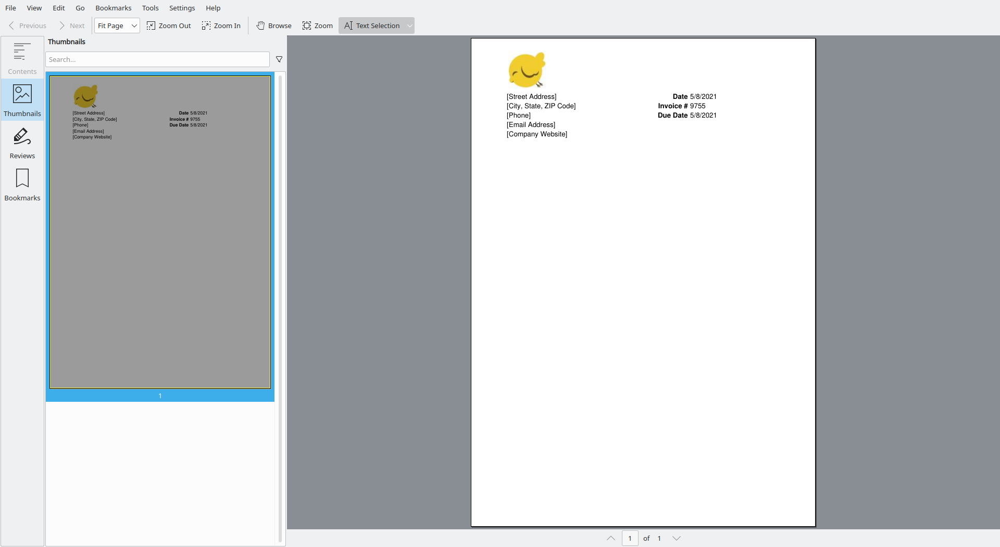
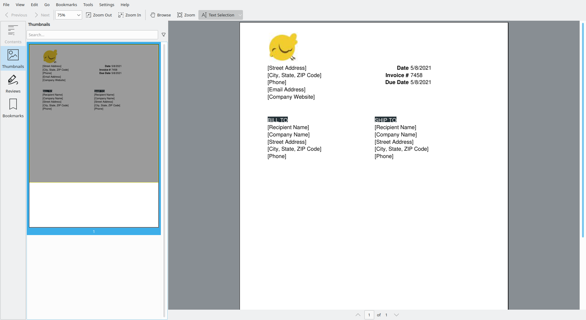
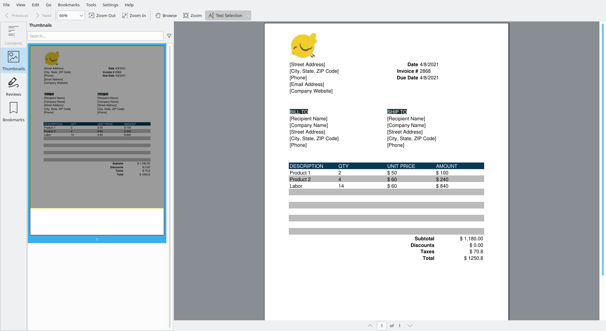
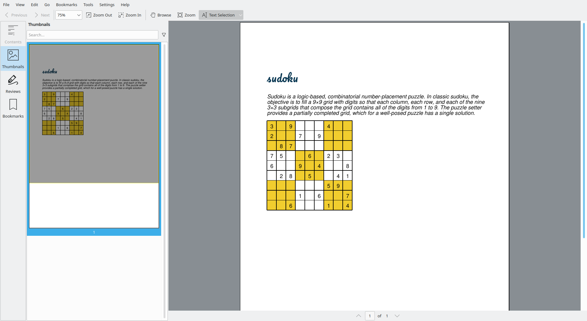
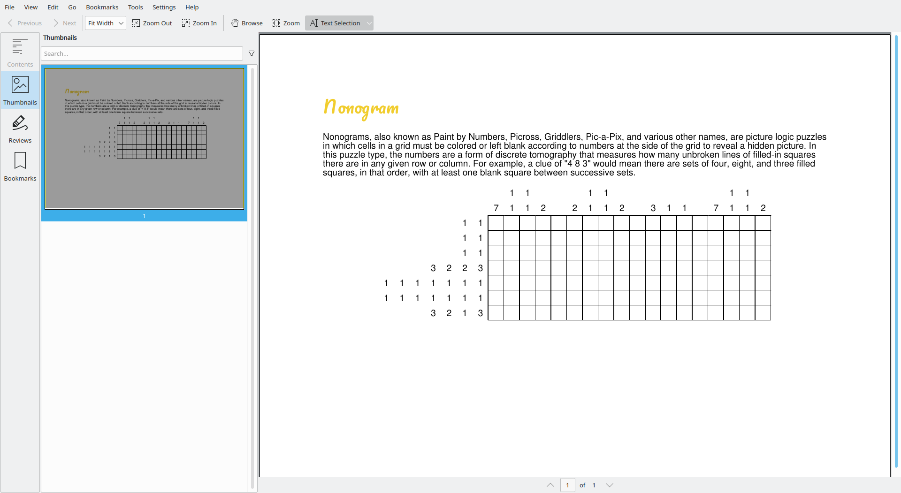
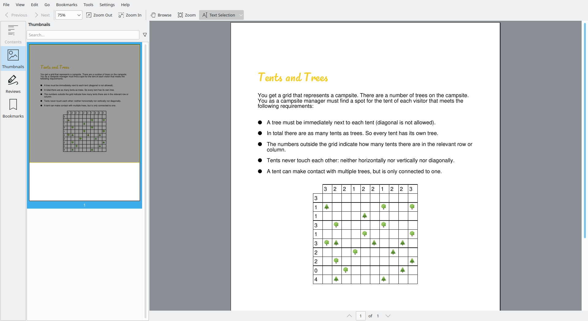
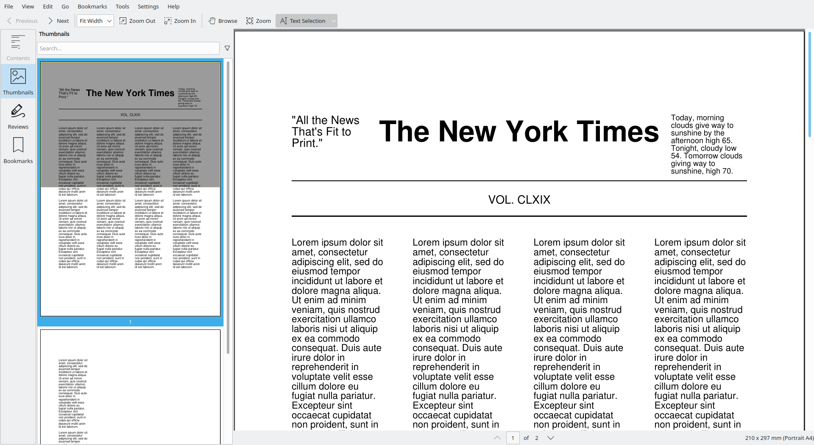
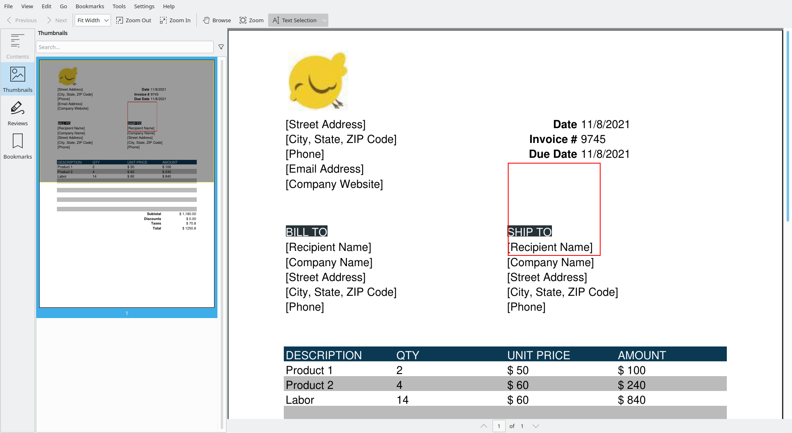
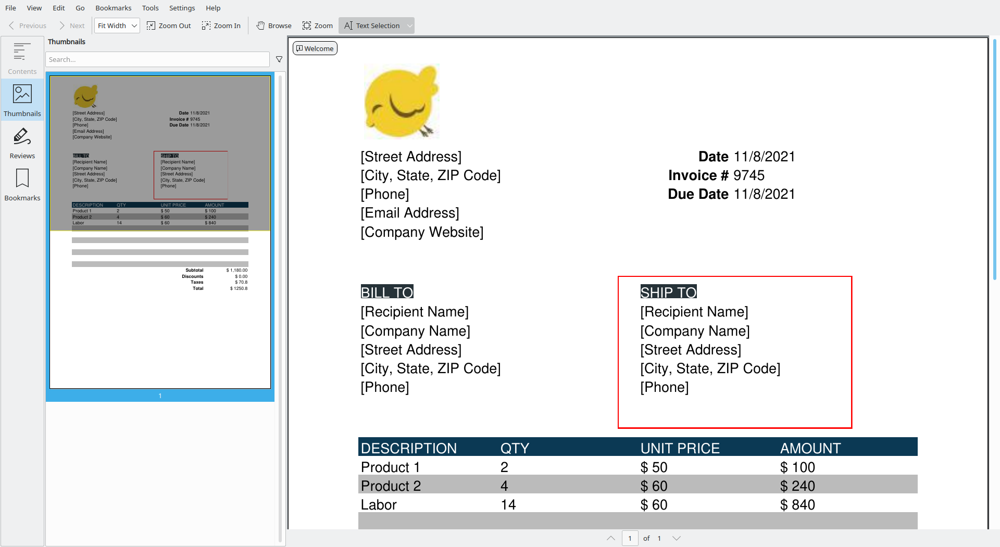

# 6. Showcases


<div style="page-break-before: always;"></div>

## 6.1 Showcase: creating an invoice

In this example you'll learn how to build a (realistic) invoice using `borb`.
This is a great little project to review all the `LayoutElement` objects you've seen in previous sections.
And a chance to experiment with colors and style, to make sure this invoice really matches your company style.

Let's create a Document() and Page() as a blank canvas that we can add the invoice to:

```python
from borb.pdf.document import Document
from borb.pdf.page.page import Page

# Create document
pdf = Document()

# Add page
page = Page()
pdf.append_page(page)
```

Since we don't want to deal with calculating coordinates - we can delegate this to a `PageLayout` which manages all of the content and its positions:

```python
# New imports
from borb.pdf.canvas.layout.page_layout.multi_column_layout import SingleColumnLayout
from decimal import Decimal

page_layout = SingleColumnLayout(page)
page_layout.vertical_margin = page.get_page_info().get_height() * Decimal(0.02)
```

Here, we're using a `SingleColumnLayout` since all of the content should be in a single column - we won't have a left and right side of the invoice. 
We're also making the vertical margin smaller here. The default value is to trim the top 10% of the page height as the margin, 
and we're reducing it down to 2%, since we'll want to use this space for the company logo/name.

Speaking of which, let's add the company logo to the layout:

```python
# New import
from borb.pdf.canvas.layout.image import Image

page_layout.add(    
        Image(        
        "https://github.com/jorisschellekens/borb/blob/master/readme_img/logo/borb_64.png?raw=true",        
        width=Decimal(128),        
        height=Decimal(128),    
        ))
```

Here, we're adding an element to the layout - an `Image`. 
Through its constructor, we're adding a URL pointing to the image resource and setting its `width` and `height`.

Beneath the image, we'll want to add our imaginary company info (name, address, website, phone) as well as the invoice information (invoice number, date, due date). 
A common format for brevity (which incidentally also makes the code cleaner) is to use a table to store invoice data. 
Let's create a separate helper method to build the invoice information in a table, which we can then use to simply add a table to the invoice in our main method:

```python
# New imports
from borb.pdf.canvas.layout.table.fixed_column_width_table import FixedColumnWidthTable
from borb.pdf.canvas.layout.paragraph import Paragraph, Alignment
from datetime import datetime
import random

def _build_invoice_information():    
    table_001 = FixedColumnWidthTable(number_of_rows=5, number_of_columns=3)
	
    table_001.add(Paragraph("[Street Address]"))    
    table_001.add(Paragraph("Date", font="Helvetica-Bold", horizontal_alignment=Alignment.RIGHT))    
    now = datetime.now()    
    table_001.add(Paragraph("%d/%d/%d" % (now.day, now.month, now.year)))
	
    table_001.add(Paragraph("[City, State, ZIP Code]"))    
    table_001.add(Paragraph("Invoice #", font="Helvetica-Bold", horizontal_alignment=Alignment.RIGHT))
    table_001.add(Paragraph("%d" % random.randint(1000, 10000)))   
	
    table_001.add(Paragraph("[Phone]"))    
    table_001.add(Paragraph("Due Date", font="Helvetica-Bold", horizontal_alignment=Alignment.RIGHT))
    table_001.add(Paragraph("%d/%d/%d" % (now.day, now.month, now.year))) 
	
    table_001.add(Paragraph("[Email Address]"))    
    table_001.add(Paragraph(" "))
    table_001.add(Paragraph(" "))

    table_001.add(Paragraph("[Company Website]"))
    table_001.add(Paragraph(" "))
    table_001.add(Paragraph(" "))

    table_001.set_padding_on_all_cells(Decimal(2), Decimal(2), Decimal(2), Decimal(2))    		
    table_001.no_borders()
    return table_001
```

Here, we're making a simple `Table` with 5 rows and 3 columns.
The rows correspond to the street address, city/state, phone, email address and company website. 
Each row will have `0..3` values (columns). Each text element is added as a `Paragraph`, which we've aligned to the right via `Alignment.RIGHT`, and accept styling arguments such as `font`.

Finally, we've added padding to all the cells to make sure we don't place the text awkwardly near the confounds of the cells.

Now, back in our main method, we can call `_build_invoice_information()` to populate a table and add it to our layout:

```python
page_layout = SingleColumnLayout(page)
page_layout.vertical_margin = page.get_page_info().get_height() * Decimal(0.02)
page_layout.add(    
    Image(        
        "https://github.com/jorisschellekens/borb/blob/master/readme_img/logo/borb_64.png?raw=true",          
        width=Decimal(128),        
        height=Decimal(128),    
        ))

# Invoice information table  
page_layout.add(_build_invoice_information())  
  
# Empty paragraph for spacing  
page_layout.add(Paragraph(" "))
```

Now, let's build this PDF document real quick to see what it looks like. For this, we'll use the `PDF` module:



```python
# New import
from borb.pdf.pdf import PDF

with open("showcase_001.pdf", "wb") as pdf_file_handle:
    PDF.dumps(pdf_file_handle, document)
```

Great! Now we'll want to add the billing and shipping information as well. 
It'll conveniently be placed in a table, just like the company information. 
For brevity's sake, we'll also opt to make a separate helper function to build this info, 
and then we can simply add it in our main method:

```python
# New imports
from borb.pdf.canvas.color.color import HexColor, X11Color

def _build_billing_and_shipping_information():  
    table_001 = Table(number_of_rows=6, number_of_columns=2)  
    table_001.add(  
        Paragraph(  
            "BILL TO",  
            background_color=HexColor("263238"),  
            font_color=X11Color("White"),  
        )  
    )  
    table_001.add(  
        Paragraph(  
            "SHIP TO",  
            background_color=HexColor("263238"),  
            font_color=X11Color("White"),  
        )  
    )  
    table_001.add(Paragraph("[Recipient Name]"))        # BILLING  
    table_001.add(Paragraph("[Recipient Name]"))        # SHIPPING  
    table_001.add(Paragraph("[Company Name]"))          # BILLING  
    table_001.add(Paragraph("[Company Name]"))          # SHIPPING  
    table_001.add(Paragraph("[Street Address]"))        # BILLING  
    table_001.add(Paragraph("[Street Address]"))        # SHIPPING  
    table_001.add(Paragraph("[City, State, ZIP Code]")) # BILLING  
    table_001.add(Paragraph("[City, State, ZIP Code]")) # SHIPPING  
    table_001.add(Paragraph("[Phone]"))                 # BILLING  
    table_001.add(Paragraph("[Phone]"))                 # SHIPPING  
    table_001.set_padding_on_all_cells(Decimal(2), Decimal(2), Decimal(2), Decimal(2))  
    table_001.no_borders()  
    return table_001
```

We've set the `background_color` of the initial paragraphs to `#263238` (grey-blue) to match the color of the logo, and the `font_color` to `White`.

Let's call this in the main method as well:

```python
# Invoice information table
page_layout.add(_build_invoice_information())

# Empty paragraph for spacing
page_layout.add(Paragraph(" "))

# Billing and shipping information table
page_layout.add(_build_billing_and_shipping_information())
```

Once we run the script again, this results in a new PDF file that contains more information:



With our basic information sorted out (company info and billing/shipping info) - 
we'll want to add an itemized description. These will be the goods/services that our supposed company offered to someone and are also typically done in a table-like fashion beneath the information we've already added.

Again, let's create a helper function that generates a table and populates it with data, which we can simply add to our layout later on:

We'll start by defining a `Product` class to represent a sold product.
In practice, you'd substitute the hard-coded strings related to the subtotal, 
taxes and total prices with calculations of the actual prices - though, 
this heavily depends on the underlying implementation of your Product models, 
so we've added a stand-in for abstraction.

```python
class Product:
    """
    This class represents a purchased product
    """
    def __init__(self, name: str, quantity: int, price_per_sku: float):
        self.name: str = name
        assert quantity >= 0
        self.quantity: int = quantity
        assert price_per_sku >= 0
        self.price_per_sku: float = price_per_sku
```

Now we can build a method `_build_itemized_description_table` that will render these products and their prices to the PDF:

```python
def _build_itemized_description_table(products: typing.List[Product] = []):
    """
    This function builds a Table containing itemized billing information
    :param:     products
    :return:    a Table containing itemized billing information
    """
    table_001 = FixedColumnWidthTable(number_of_rows=15, number_of_columns=4)
    for h in ["DESCRIPTION", "QTY", "UNIT PRICE", "AMOUNT"]:
        table_001.add(
            TableCell(
                Paragraph(h, font_color=X11Color("White")),
                background_color=HexColor("0b3954"),
            )
        )

    odd_color = HexColor("BBBBBB")
    even_color = HexColor("FFFFFF")
    for row_number, item in enumerate(products):
        c = even_color if row_number % 2 == 0 else odd_color
        table_001.add(TableCell(Paragraph(item.name), background_color=c))
        table_001.add(TableCell(Paragraph(str(item.quantity)), background_color=c))
        table_001.add(TableCell(Paragraph("$ " + str(item.price_per_sku)), background_color=c))
        table_001.add(TableCell(Paragraph("$ " + str(item.quantity * item.price_per_sku)), background_color=c))

    # Optionally add some empty rows to have a fixed number of rows for styling purposes
    for row_number in range(len(products), 10):
        c = even_color if row_number % 2 == 0 else odd_color
        for _ in range(0, 4):
            table_001.add(TableCell(Paragraph(" "), background_color=c))

    # subtotal
    subtotal: float = sum([x.price_per_sku * x.quantity for x in products])
    table_001.add(TableCell(Paragraph("Subtotal", font="Helvetica-Bold", horizontal_alignment=Alignment.RIGHT, ), col_span=3, ))
    table_001.add(TableCell(Paragraph("$ 1,180.00", horizontal_alignment=Alignment.RIGHT)))

    # discounts
    table_001.add(TableCell(Paragraph("Discounts", font="Helvetica-Bold", horizontal_alignment=Alignment.RIGHT, ), col_span=3, ))
    table_001.add(TableCell(Paragraph("$ 0.00", horizontal_alignment=Alignment.RIGHT)))

    # taxes
    taxes: float = subtotal * 0.06
    table_001.add(TableCell(Paragraph("Taxes", font="Helvetica-Bold", horizontal_alignment=Alignment.RIGHT), col_span=3, ))
    table_001.add(TableCell(Paragraph("$ " + str(taxes), horizontal_alignment=Alignment.RIGHT)))

    # total
    total: float = subtotal + taxes
    table_001.add(TableCell(Paragraph("Total", font="Helvetica-Bold", horizontal_alignment=Alignment.RIGHT), col_span=3, ))
    table_001.add(TableCell(Paragraph("$ " + str(total), horizontal_alignment=Alignment.RIGHT)))
    table_001.set_padding_on_all_cells(Decimal(2), Decimal(2), Decimal(2), Decimal(2))
    table_001.no_borders()
    return table_001
```

This is the final code for this example:

```python
import datetime
import random
from decimal import Decimal

import typing
from borb.pdf.canvas.color.color import HexColor, X11Color
from borb.pdf.canvas.layout.image.image import Image
from borb.pdf.canvas.layout.layout_element import Alignment
from borb.pdf.canvas.layout.page_layout.multi_column_layout import SingleColumnLayout
from borb.pdf.canvas.layout.page_layout.page_layout import PageLayout
from borb.pdf.canvas.layout.table.fixed_column_width_table import FixedColumnWidthTable
from borb.pdf.canvas.layout.table.table import Table, TableCell
from borb.pdf.canvas.layout.text.paragraph import Paragraph
from borb.pdf.document import Document
from borb.pdf.page.page import Page
from borb.pdf.pdf import PDF


def _build_invoice_information() -> Table:
    """
    This function builds a Table containing invoice information
    :return:    a Table containing invoice information
    """
    table_001 = FixedColumnWidthTable(number_of_rows=5, number_of_columns=3)

    table_001.add(Paragraph("[Street Address]"))
    table_001.add(Paragraph("Date", font="Helvetica-Bold", horizontal_alignment=Alignment.RIGHT))
    now = datetime.datetime.now()
    table_001.add(Paragraph("%d/%d/%d" % (now.day, now.month, now.year)))

    table_001.add(Paragraph("[City, State, ZIP Code]"))
    table_001.add(Paragraph("Invoice #", font="Helvetica-Bold", horizontal_alignment=Alignment.RIGHT))
    table_001.add(Paragraph("%d" % random.randint(1000, 10000)))

    table_001.add(Paragraph("[Phone]"))
    table_001.add(Paragraph("Due Date", font="Helvetica-Bold", horizontal_alignment=Alignment.RIGHT))
    table_001.add(Paragraph("%d/%d/%d" % (now.day, now.month, now.year)))

    table_001.add(Paragraph("[Email Address]"))
    table_001.add(Paragraph(" "))
    table_001.add(Paragraph(" "))

    table_001.add(Paragraph("[Company Website]"))
    table_001.add(Paragraph(" "))
    table_001.add(Paragraph(" "))

    table_001.set_padding_on_all_cells(Decimal(2), Decimal(2), Decimal(2), Decimal(2))
    table_001.no_borders()
    return table_001


def _build_billing_and_shipping_information() -> Table:
    """
    This function builds a Table containing billing and shipping information
    :return:    a Table containing shipping and billing information
    """
    table_001 = FixedColumnWidthTable(number_of_rows=6, number_of_columns=2)
    table_001.add(
        Paragraph(
            "BILL TO",
            background_color=HexColor("263238"),
            font_color=X11Color("White"),
        )
    )
    table_001.add(
        Paragraph(
            "SHIP TO",
            background_color=HexColor("263238"),
            font_color=X11Color("White"),
        )
    )
    table_001.add(Paragraph("[Recipient Name]"))        # BILLING
    table_001.add(Paragraph("[Recipient Name]"))        # SHIPPING
    table_001.add(Paragraph("[Company Name]"))          # BILLING
    table_001.add(Paragraph("[Company Name]"))          # SHIPPING
    table_001.add(Paragraph("[Street Address]"))        # BILLING
    table_001.add(Paragraph("[Street Address]"))        # SHIPPING
    table_001.add(Paragraph("[City, State, ZIP Code]")) # BILLING
    table_001.add(Paragraph("[City, State, ZIP Code]")) # SHIPPING
    table_001.add(Paragraph("[Phone]"))                 # BILLING
    table_001.add(Paragraph("[Phone]"))                 # SHIPPING
    table_001.set_padding_on_all_cells(Decimal(2), Decimal(2), Decimal(2), Decimal(2))
    table_001.no_borders()
    return table_001


class Product:
    """
    This class represents a purchased product
    """
    def __init__(self, name: str, quantity: int, price_per_sku: float):
        self.name: str = name
        assert quantity >= 0
        self.quantity: int = quantity
        assert price_per_sku >= 0
        self.price_per_sku: float = price_per_sku


def _build_itemized_description_table(products: typing.List[Product] = []):
    """
    This function builds a Table containing itemized billing information
    :param:     products
    :return:    a Table containing itemized billing information
    """
    table_001 = FixedColumnWidthTable(number_of_rows=15, number_of_columns=4)
    for h in ["DESCRIPTION", "QTY", "UNIT PRICE", "AMOUNT"]:
        table_001.add(
            TableCell(
                Paragraph(h, font_color=X11Color("White")),
                background_color=HexColor("0b3954"),
            )
        )

    odd_color = HexColor("BBBBBB")
    even_color = HexColor("FFFFFF")
    for row_number, item in enumerate(products):
        c = even_color if row_number % 2 == 0 else odd_color
        table_001.add(TableCell(Paragraph(item.name), background_color=c))
        table_001.add(TableCell(Paragraph(str(item.quantity)), background_color=c))
        table_001.add(TableCell(Paragraph("$ " + str(item.price_per_sku)), background_color=c))
        table_001.add(TableCell(Paragraph("$ " + str(item.quantity * item.price_per_sku)), background_color=c))

    # Optionally add some empty rows to have a fixed number of rows for styling purposes
    for row_number in range(len(products), 10):
        c = even_color if row_number % 2 == 0 else odd_color
        for _ in range(0, 4):
            table_001.add(TableCell(Paragraph(" "), background_color=c))

    # subtotal
    subtotal: float = sum([x.price_per_sku * x.quantity for x in products])
    table_001.add(TableCell(Paragraph("Subtotal", font="Helvetica-Bold", horizontal_alignment=Alignment.RIGHT, ), col_span=3, ))
    table_001.add(TableCell(Paragraph("$ 1,180.00", horizontal_alignment=Alignment.RIGHT)))

    # discounts
    table_001.add(TableCell(Paragraph("Discounts", font="Helvetica-Bold", horizontal_alignment=Alignment.RIGHT, ), col_span=3, ))
    table_001.add(TableCell(Paragraph("$ 0.00", horizontal_alignment=Alignment.RIGHT)))

    # taxes
    taxes: float = subtotal * 0.06
    table_001.add(TableCell(Paragraph("Taxes", font="Helvetica-Bold", horizontal_alignment=Alignment.RIGHT), col_span=3, ))
    table_001.add(TableCell(Paragraph("$ " + str(taxes), horizontal_alignment=Alignment.RIGHT)))

    # total
    total: float = subtotal + taxes
    table_001.add(TableCell(Paragraph("Total", font="Helvetica-Bold", horizontal_alignment=Alignment.RIGHT), col_span=3, ))
    table_001.add(TableCell(Paragraph("$ " + str(total), horizontal_alignment=Alignment.RIGHT)))
    table_001.set_padding_on_all_cells(Decimal(2), Decimal(2), Decimal(2), Decimal(2))
    table_001.no_borders()
    return table_001


def main():

    # create Document
    doc: Document = Document()

    # add Page
    page: Page = Page()
    doc.append_page(page)

    # set PageLayout
    page_layout: PageLayout = SingleColumnLayout(page,
                                                 vertical_margin=page.get_page_info().get_height() * Decimal(0.02))

    # add corporate logo
    page_layout.add(
        Image(
            "https://github.com/jorisschellekens/borb/blob/master/readme_img/logo/borb_64.png?raw=true",
            width=Decimal(64),
            height=Decimal(64),
        ))

    # Invoice information table
    page_layout.add(_build_invoice_information())

    # Empty paragraph for spacing
    page_layout.add(Paragraph(" "))

    # Billing and shipping information table
    page_layout.add(_build_billing_and_shipping_information())

    # Empty paragraph for spacing
    page_layout.add(Paragraph(" "))

    # Itemized description
    page_layout.add(_build_itemized_description_table([
        Product("Product 1", 2, 50),
        Product("Product 2", 4, 60),
        Product("Labor", 14, 60)
    ]))

    # store
    with open("showcase_001.pdf", "wb") as out_file_handle:
        PDF.dumps(out_file_handle, doc)

        
if __name__ == "__main__":
    main()
```

Which outputs this PDF:



<div style="page-break-before: always;"></div>

## 6.2 Showcase: creating a sudoku puzzle

This example originated from my love of Sudoku puzzles, and a desire to showcase the `FlexibleColumnWidthTable` I'd been working on.
`FlexibleColumnWidthTable` allows you to specify `preferred_width` and `preferred_height`, enabling you to create square `TableCell` objects.

In the next example you'll be creating a Sudoku, with background colors for each 3x3 block.

```python
from decimal import Decimal
from pathlib import Path

from borb.pdf.canvas.color.color import Color, HexColor
from borb.pdf.canvas.font.font import Font
from borb.pdf.canvas.font.simple_font.true_type_font import TrueTypeFont
from borb.pdf.canvas.layout.layout_element import Alignment
from borb.pdf.canvas.layout.page_layout.multi_column_layout import SingleColumnLayout
from borb.pdf.canvas.layout.page_layout.page_layout import PageLayout
from borb.pdf.canvas.layout.table.flexible_column_width_table import FlexibleColumnWidthTable
from borb.pdf.canvas.layout.table.table import Table, TableCell
from borb.pdf.canvas.layout.text.paragraph import Paragraph
from borb.pdf.document import Document
from borb.pdf.page.page import Page
from borb.pdf.pdf import PDF


def main():

    # represent the sudoku as a plaintext str
    # this is easier to debug/change
    sudoku_str: str = """
    3.9...4..
    2..7.9...
    .87......
    75..6.23.
    6..9.4..8
    .28.5..41
    ......59.
    ...1.6..7
    ..6...1.4
    """
    sudoku_str = sudoku_str \
        .replace("\t","")   \
        .replace(" ","")    \
        .replace("\n","")

    # create empty Document
    doc: Document = Document()

    # create empty Page
    p: Page = Page()
    doc.append_page(p)

    # create PageLayout
    l: PageLayout = SingleColumnLayout(p)

    # add Title
    pacifico: Font = TrueTypeFont.true_type_font_from_file(Path(__file__).parent / "Pacifico-Regular.ttf")
    l.add(Paragraph("Sudoku", font_size=Decimal(24), font_color=HexColor("0b3954"), font=pacifico))

    # add explanation
    l.add(Paragraph("""
                    Sudoku is a logic-based, combinatorial number-placement puzzle. 
                    In classic sudoku, the objective is to fill a 9×9 grid with digits so that each column, each row, 
                    and each of the nine 3×3 subgrids that compose the grid contains all of the digits from 1 to 9. 
                    The puzzle setter provides a partially completed grid, which for a well-posed puzzle has a single solution.
                    """, font="Helvetica-Oblique"))

    # add Table
    s: Decimal = Decimal(20)
    t: Table = FlexibleColumnWidthTable(number_of_rows=9, number_of_columns=9)
    for i in range(0, 81):
        r: int = int(i / 9)
        c: int = i % 9
        background_color: Color = HexColor("ffffff")
        if r in [0,1,2,6,7,8] and c in [0,1,2,6,7,8]:
            background_color = HexColor("f1cd2e")
        if r in [3,4,5] and c in [3,4,5]:
            background_color = HexColor("f1cd2e")
        if sudoku_str[i] == ".":
            t.add(TableCell(Paragraph(" "), preferred_width=s, preferred_height=s, background_color=background_color))
        else:
            t.add(TableCell(Paragraph(sudoku_str[i], text_alignment=Alignment.CENTERED), preferred_width=s, preferred_height=s, background_color=background_color))
    t.set_padding_on_all_cells(Decimal(5), Decimal(5), Decimal(5), Decimal(5))
    l.add(t)

    # store
    with open("showcase_001.pdf", "wb") as out_file_handle:
        PDF.dumps(out_file_handle, doc)

        
if __name__ == "__main__":
    main()
```



<div style="page-break-before: always;"></div>

## 6.3 Showcase: creating a nonogram puzzle

This is another example of creating a `Table` and setting custom properties:

- `border_top`, `border_right`, `border_bottom`, `border_left`
- `preferred_width`
- `preferred_height`

Doing these examples allows you to build a sort of muscle-memory for using `Table` objects in `borb`.
They also create fun little PDF's that you can share with colleagues during the coffee breaks.

```python
from pathlib import Path

import typing
from borb.io.read.types import Decimal
from borb.pdf.canvas.color.color import HexColor
from borb.pdf.canvas.font.font import Font
from borb.pdf.canvas.font.simple_font.true_type_font import TrueTypeFont
from borb.pdf.canvas.layout.layout_element import Alignment
from borb.pdf.canvas.layout.page_layout.multi_column_layout import SingleColumnLayout
from borb.pdf.canvas.layout.table.table import TableCell
from borb.pdf.canvas.layout.table.flexible_column_width_table import FlexibleColumnWidthTable
from borb.pdf.canvas.layout.text.paragraph import Paragraph
from borb.pdf.document import Document
from borb.pdf.page.page import Page
from borb.pdf.page.page_size import PageSize
from borb.pdf.pdf import PDF


def main():

    # create document
    pdf = Document()

    # add page
    page = Page(PageSize.A4_LANDSCAPE.value[0], PageSize.A4_LANDSCAPE.value[1])
    pdf.append_page(page)

    layout = SingleColumnLayout(page)

    # write puzzle title
    font: Font = TrueTypeFont.true_type_font_from_file(
        Path(__file__).parent / "Pacifico-Regular.ttf"
    )
    layout.add(
        Paragraph(
            "Nonogram",
            font_color=HexColor("#f1cd2e"),
            font=font,
            font_size=Decimal(23),
        )
    )

    # write puzzle information
    layout.add(
        Paragraph(
            """
            Nonograms, also known as Paint by Numbers, Picross, Griddlers, Pic-a-Pix, and various other names, 
            are picture logic puzzles in which cells in a grid must be colored or left blank according to numbers at the side of the grid to reveal a hidden picture. 
            In this puzzle type, the numbers are a form of discrete tomography that measures how many unbroken lines of filled-in squares there are in any given row or column. 
            For example, a clue of "4 8 3" would mean there are sets of four, eight, and three filled squares, in that order, 
            with at least one blank square between successive sets.
            """
        )
    )

    # write grid
    w = Decimal(20)
    grid = FlexibleColumnWidthTable(
        number_of_rows=9,
        number_of_columns=25,
        margin_top=Decimal(12),
        horizontal_alignment=Alignment.CENTERED,
    )

    def insert_clues(cs: typing.List[int]):
        """
        This function inserts an array of clues into the table representing the nonogram.
        A clue of "0" renders an empty cell
        :param cs:  the clues to be inserted
        :return:    None
        """
        for c in cs:
            if c == 0:
                grid.add(
                    TableCell(
                        Paragraph(" "),
                        preferred_width=w,
                        preferred_height=w,
                        border_top=False,
                        border_right=False,
                        border_bottom=False,
                        border_left=False,
                    )
                )
            else:
                grid.add(
                    TableCell(
                        Paragraph(str(c), text_alignment=Alignment.CENTERED),
                        preferred_width=w,
                        preferred_height=w,
                        border_top=False,
                        border_right=False,
                        border_bottom=False,
                        border_left=False,
                    )
                )

    def insert_blanks(n: int):
        for _ in range(0, n):
            grid.add(TableCell(Paragraph(" "), preferred_width=w, preferred_height=w))

    insert_clues([0, 0, 0, 0, 0, 0, 0, 0, 1, 1, 0, 0, 0, 1, 1, 0, 0, 0, 0, 0, 0, 0, 1, 1, 0])
    insert_clues([0, 0, 0, 0, 0, 0, 0, 7, 1, 1, 2, 0, 2, 1, 1, 2, 0, 3, 1, 1, 0, 7, 1, 1, 2])
    insert_clues([0, 0, 0, 0, 0, 1, 1])
    insert_blanks(18)
    insert_clues([0, 0, 0, 0, 0, 1, 1])
    insert_blanks(18)
    insert_clues([0, 0, 0, 0, 0, 1, 1])
    insert_blanks(18)
    insert_clues([0, 0, 0, 3, 2, 2, 3])
    insert_blanks(18)
    insert_clues([1, 1, 1, 1, 1, 1, 1])
    insert_blanks(18)
    insert_clues([1, 1, 1, 1, 1, 1, 1])
    insert_blanks(18)
    insert_clues([0, 0, 0, 3, 2, 1, 3])
    insert_blanks(18)

    grid.set_padding_on_all_cells(Decimal(3), Decimal(3), Decimal(3), Decimal(3))
    layout.add(grid)

    # attempt to store PDF
    with open("output.pdf", "wb") as in_file_handle:
        PDF.dumps(in_file_handle, pdf)


if __name__ == "__main__":
    main()

```

This code creates the following PDF:



<div style="page-break-before: always;"></div>

## 6.4 Showcase: creating a tents-and-trees puzzle

Since I started writing this library, I've been on the lookout for fun ways to display new features.
When I added support for Emoji, I was at a loss to find an interesting and engaging way to show them.

And then I came across tents-and-trees puzzles. And it immediately provided me with a way to showcase both:

- `FlexibleColumnWidthTable`
- `Emoji`
- `TrueTypeFont`

In this example you'll be creating a one-page puzzle:

```python
import random
from pathlib import Path

from borb.io.read.types import Decimal
from borb.pdf.canvas.color.color import HexColor
from borb.pdf.canvas.font.font import Font
from borb.pdf.canvas.font.simple_font.true_type_font import TrueTypeFont
from borb.pdf.canvas.layout.emoji.emoji import Emojis
from borb.pdf.canvas.layout.layout_element import Alignment
from borb.pdf.canvas.layout.list.unordered_list import UnorderedList
from borb.pdf.canvas.layout.page_layout.multi_column_layout import SingleColumnLayout
from borb.pdf.canvas.layout.table.table import TableCell
from borb.pdf.canvas.layout.table.flexible_column_width_table import FlexibleColumnWidthTable
from borb.pdf.canvas.layout.text.paragraph import Paragraph
from borb.pdf.document import Document
from borb.pdf.page.page import Page
from borb.pdf.pdf import PDF

def main():

    # create document
    pdf = Document()

    # add page
    page = Page()
    pdf.append_page(page)

    layout = SingleColumnLayout(page)

    # write puzzle title
    font: Font = TrueTypeFont.true_type_font_from_file(
        Path(__file__).parent / "Pacifico-Regular.ttf"
    )
    layout.add(
        Paragraph(
            "Tents and Trees",
            font_color=HexColor("#f1cd2e"),
            font=font,
            font_size=Decimal(23),
        )
    )

    # write puzzle information
    layout.add(
        Paragraph(
            """
            You get a grid that represents a campsite. 
            There are a number of trees on the campsite. 
            You as a campsite manager must find a spot for the tent of each visitor that meets the following requirements:
            """
        )
    )
    layout.add(
        UnorderedList()
            .add(Paragraph("A tree must be immediately next to each tent (diagonal is not allowed)."))
            .add(Paragraph("In total there are as many tents as trees. So every tent has its own tree."))
            .add(Paragraph("The numbers outside the grid indicate how many tents there are in the relevant row or column."))
            .add(Paragraph("Tents never touch each other: neither horizontally nor vertically nor diagonally."))
            .add(Paragraph("A tent can make contact with multiple trees, but is only connected to one."))
    )

    # write grid
    w = Decimal(20)
    grid = FlexibleColumnWidthTable(
        number_of_rows=11,
        number_of_columns=11,
        margin_top=Decimal(5),
        horizontal_alignment=Alignment.CENTERED,
    )
    h_clues = [3, 2, 2, 1, 2, 2, 1, 2, 2, 3]
    v_clues = [3, 1, 1, 3, 1, 3, 2, 2, 0, 4]
    tree_layout = """
    __________
    x_____x__x
    ____x_____
    _x____x___
    ____x____x
    xx___x__x_
    ___x___x__
    _x_______x
    __x_____x_
    _x____x___
    """
    tree_layout = tree_layout.replace("\n", "").replace(" ", "")
    grid.add(TableCell(Paragraph(" "), preferred_height=w, preferred_width=w, border_top=False, border_left=False))
    for i in h_clues:
        grid.add(
            TableCell(Paragraph(str(i)), preferred_height=w, preferred_width=w)
        )
    for i in range(0, 10):
        grid.add(
            TableCell(
                Paragraph(str(v_clues[i])), preferred_height=w, preferred_width=w
            )
        )
        for j in range(0, 10):
            if tree_layout[i * 10 + j] == "_":
                grid.add(
                    TableCell(Paragraph(" "), preferred_height=w, preferred_width=w)
                )
            else:
                grid.add(
                    TableCell(
                        random.choice(
                            [
                                Emojis.DECIDUOUS_TREE.value,
                                Emojis.EVERGREEN_TREE.value,
                            ]
                        ),
                        preferred_height=w,
                        preferred_width=w,
                    )
                )

    grid.set_padding_on_all_cells(Decimal(3), Decimal(3), Decimal(3), Decimal(3))
    layout.add(grid)

    # attempt to store PDF
    with open("showcase_002.pdf", "wb") as in_file_handle:
        PDF.dumps(in_file_handle, pdf)

if __name__ == '__main__':
    main()
```

The output PDF should look like this (except for the tree-emoji, which are random):



<div style="page-break-before: always;"></div>

## 6.5 Showcase: Using multiple `PageLayout` instances on the same `Page`

In previous examples you've always used one `PageLayout` instance per `Page`.
And although this is the most common scenario, you can easily use multiple `PageLayout` instances.
This has the advantage of offering you even greater flexibility.

In this example you'll be adding some content to a `Page` using `SingleColumnLayout`, and then switch to `MultiColumnLayout` to finish the `Page`.
You'll be recreating a classic newspaper look-and-feel.

```python
from borb.io.read.types import Decimal
from borb.pdf.canvas.layout.horizontal_rule import HorizontalRule
from borb.pdf.canvas.layout.layout_element import Alignment
from borb.pdf.canvas.layout.page_layout.multi_column_layout import SingleColumnLayout, MultiColumnLayout
from borb.pdf.canvas.layout.page_layout.page_layout import PageLayout
from borb.pdf.canvas.layout.table.fixed_column_width_table import FixedColumnWidthTable
from borb.pdf.canvas.layout.text.paragraph import Paragraph
from borb.pdf.document import Document
from borb.pdf.page.page import Page
from borb.pdf.page.page_size import PageSize
from borb.pdf.pdf import PDF


def main():

    # create document
    pdf = Document()

    # add page
    page = Page()
    pdf.append_page(page)

    # write title
    layout_001 = SingleColumnLayout(page)
    title_table: FixedColumnWidthTable = FixedColumnWidthTable(number_of_rows=1, number_of_columns=3, column_widths=[Decimal(1), Decimal(4), Decimal(1)])
    title_table.add(Paragraph("\"All the News That's Fit to Print.\""))
    title_table.add(Paragraph("The New York Times", font="Helvetica-Bold", font_size=Decimal(30), text_alignment=Alignment.CENTERED))
    title_table.add(Paragraph("""
                                Today, morning clouds give way to sunshine by the afternoon high 65.
                                Tonight, cloudy low 54. 
                                Tomorrow clouds giving way to sunshine, high 70.
                                """, font_size=Decimal(8)))
    title_table.no_borders()
    layout_001.add(title_table)

    layout_001.add(HorizontalRule())
    layout_001.add(Paragraph("VOL. CLXIX", text_alignment=Alignment.CENTERED))
    layout_001.add(HorizontalRule())

    # switch to MultiColumnLayout
    layout_002: PageLayout = MultiColumnLayout(page, 4)

```

The next part is a bit tricky. We need to convince `MultiColumnLayout` to not render content at the top of the `Page`.
In order to do that, we're going to do 2 things:
                                               
- After `MultiColumnLayout` has been constructed, we're going to change its `page_height` parameter. By doing so we're telling the layout mechanism that it needs to render content (and jump to the next column) in the limited remaining `Rectangle`.
  Because PDF has its origin in the lower-left corner of the `page`, setting the `page_height` parameter will also limit the maximum y-coordinate at which `LayoutElement` objects are allowed to render.
- We are also going to change the `_previous_element_y` variable. This variable keeps track of where the previous `LayoutElement` was rendered, and is default initialized to the `page_height` minus the `vertical_margin`.
  By tweaking this variable we ensure the next (that is to say first) `LayoutElement` to be added in `MultiColumnLayout` will be placed at the right y-coordinate.

```python

    # mark the top section as off limits
    max_y: Decimal = Decimal(PageSize.A4_PORTRAIT.value[1] - 120)
    layout_002._page_height = max_y
    layout_002._previous_element_y = max_y - layout_002._vertical_margin

```

With that taken care of, we can now add content to the `PageLayout` manager as we would normally do.

```python

    # add content
    for _ in range(0, 10):
        layout_002.add(Paragraph("""
                                Lorem ipsum dolor sit amet, consectetur adipiscing elit, sed do eiusmod tempor incididunt ut labore et dolore magna aliqua. 
                                Ut enim ad minim veniam, quis nostrud exercitation ullamco laboris nisi ut aliquip ex ea commodo consequat. 
                                Duis aute irure dolor in reprehenderit in voluptate velit esse cillum dolore eu fugiat nulla pariatur. 
                                Excepteur sint occaecat cupidatat non proident, sunt in culpa qui officia deserunt mollit anim id est laborum.
                                """, font_size=Decimal(10)))

    # attempt to store PDF
    with open("output.pdf", "wb") as in_file_handle:
        PDF.dumps(in_file_handle, pdf)


if __name__ == "__main__":
    main()

```



<div style="page-break-before: always;"></div>

## 6.6 Showcase: creating a poem with custom `PageLayout`

In this example you'll see how to write your own `PageLayout`.
We'll be making a `PageLayout` implementation that attempts to write text in a circular shape.
This will give you more insight into how `PageLayout` (and in fact the whole layout-mechanism) works in `borb`.

```python

```

<div style="page-break-before: always;"></div>

## 6.7 Showcase: automatically processing an invoice

For this example, you'll be working with the invoice you created earlier.
In this example you'll learn how to process its content automatically.
You'll also learn how to debug such a workflow.


To start, let's just read the PDF into a `Document` object:

```python
import typing
from borb.pdf.document import Document
from borb.pdf.pdf import PDF


def main():

    d: typing.Optional[Document] = None
    with open("output.pdf", "rb") as pdf_in_handle:
        d = PDF.loads(pdf_in_handle)

    assert d is not None


if __name__ == "__main__":
    main()
```

Now we can extract the shipping information by specifying a rectangular area.
Since I don't know the exact coordinates, I'm going to be starting out at a pretty random location, and drawing a square (annotation) on the page.
That way I can get an idea of where the information is that I'd like to extract.

```python
import typing
from decimal import Decimal

from borb.pdf.canvas.color.color import X11Color
from borb.pdf.canvas.geometry.rectangle import Rectangle
from borb.pdf.document import Document
from borb.pdf.pdf import PDF


def main():

    d: typing.Optional[Document] = None
    with open("output.pdf", "rb") as pdf_file_handle:
        d = PDF.loads(pdf_file_handle)

    assert d is not None

    # add annotation
    d.get_page(0).append_square_annotation(Rectangle(Decimal(300), Decimal(600), Decimal(100), Decimal(100)),
                                           stroke_color=X11Color("Red"))

    # Write
    with open("output_001.pdf", "wb") as pdf_file_handle:
        PDF.dumps(pdf_file_handle, d)

if __name__ == "__main__":
    main()

```



After some fiddling around, I found these coordinates to work best:

```python
    # add annotation
    d.get_page(0).append_square_annotation(Rectangle(Decimal(280), Decimal(510), Decimal(200), Decimal(130)),
                                           stroke_color=X11Color("Red"))
```



Now you can extract the text-content in the invoice, by using a `LocationFilter` and `SimpleTextExtraction`.

```python
import typing
from decimal import Decimal

from borb.pdf.canvas.geometry.rectangle import Rectangle
from borb.pdf.document import Document
from borb.pdf.pdf import PDF
from borb.toolkit.location.location_filter import LocationFilter
from borb.toolkit.text.simple_text_extraction import SimpleTextExtraction


def main():

    r: Rectangle = Rectangle(Decimal(280), Decimal(510), Decimal(200), Decimal(130))
    l0: LocationFilter = LocationFilter(r)
    l1: SimpleTextExtraction = SimpleTextExtraction()
    l0.add_listener(l1)

    d: typing.Optional[Document] = None
    with open("output.pdf", "rb") as pdf_file_handle:
        d = PDF.loads(pdf_file_handle, [l0])

    assert d is not None

    print(l1.get_text(0))


if __name__ == "__main__":
    main()
```

This prints:

```
SHIP TO
[Recipient Name]
[Company Name]
[Street Address]
[City, State, ZIP Code]
[Phone]
```

Of course, this process can be rather error-prone. Ideally, you'd like to specify something like "find the address underneath the words SHIP TO".
Let's make that happen;

```python

```

To round up this exercise, let's find the subtotal/total/discount/price information.
Again, we'll be making use of `RegularExpressionTextExtraction`;

```python

```

<div style="page-break-before: always;"></div>

## 6.8 Conclusion

In this section you've coded up some challenging PDF documents.
You've worked with `Table` and `PageLayout` (even making your own) and you've learned how to create and process an invoice.
You should be ready to take on the world with your new PDF-processing skills.

