# 2 Creating PDF documents from scratch


<div style="page-break-before: always;"></div>

## 2.1 Introducing `borb` and PDF

`borb` was born out of frustration at the current state-of-the-art with regards to PDF and Python:

- A complete lack of documentation in existing libraries
- A lack of examples for existing libraries
- PDF functionality being very fragmented over the existing libraries: some libraries can create (basic) PDF document, but can not read PDF documents, or vice versa. Some libraries can only merge/split documents, etc
- Obfuscated, or unclear code (I saw one library being offered as one giant python file, rather than following the accepted object-oriented paradigm)

I wanted a library that was:

- Fully documented
- Fully tested
- Capable of reading, writing, editing PDF documents
- Puts the user first. No need to know the PDF specification, the library will handle all the heavy lifting for you.

Although `borb` is still a work in progress, and still growing and improving, I think it is clear from the existing code base that the course of the library has been set. 

<div style="page-break-before: always;"></div>

## 2.2 Steps to creating a PDF using `borb`

Typically, creating a PDF document using `borb` follows the same basic steps:

1. An empty `Document` object is created, to represent the entire PDF
2. A `Page` is created, and added to the `Document`
3. A sub-class of `PageLayout` is created to ensure content is added to the `Page` at the right position
4. Content is added to the `Page` using the `add` method of the `PageLayout`
5. The `Document` is written to disk

I'll explore all these steps in more detail in the coming sections.

### 2.2.1 Creating an empty `Document` instance

`borb` represents a PDF as a JSON-like object, a collection of nested dictionaries, arrays and primitives. Creating and empty `Document` amounts to creating an empty `dict` and filling it with the right keys to ensure the serialization will not hang.

```python
#!src/snippet_001.py
```

If you were to look at the class definition of `Document` you'd see:

```python  
class Document(Dictionary):  
    """
    This class represents a PDF document 
    """
    
    ... etc ...
 ```

`Dictionary` is defined in `types.py` as:

```python
class Dictionary(dict):  
    """
    A dictionary object is an associative table containing pairs of objects, known as the dictionary’s entries. The first element of each entry is the key and the second element is the value. The key shall be a name (unlike dictionary keys in PostScript, which may be objects of any type). The value may be any kind of object, including another dictionary. A dictionary entry whose value is null (see 7.3.9, "Null Object") shall be treated the same as if the entry does not exist. (This differs from PostScript, where null behaves like any other object as the value of a dictionary entry.) The number of entries in a dictionary shall be subject to an implementation limit; see Annex C. A dictionary may have zero entries.  
    The entries in a dictionary represent an associative table and as such shall be unordered even though an arbitrary order may be imposed upon them when written in a file. That ordering shall be ignored. 
    """

    ... etc ...
```

The constructor of `Dictionary` does call `add_base_methods` which enriches the standard `dict` (or any type it is applied to really) with a few extra methods. These methods mostly deal with being able to build hierarchies (adding children, setting parents, etc) and memory management (setting and checking the reference of an object).

These methods are not something you will typically have to deal with, you can forget about those for now.

### 2.2.2 Creating and adding a `Page`

The next step in creating a PDF document is adding a `Page` to the `Document` object:

```python
#!src/snippet_002.py
```

The default constructor for `Page` also sets the page size to match that of an A4 paper, in portrait mode.

This can easily be customized by passing a `width` and `height` parameter. These parameters must be of type `Decimal` and must express the page size in so called PDF user space units.

PDF user space units map to roughly 1/72th of an inch.

In order to make life easier, `borb` offers a convenient `enum` that holds the most common paper sizes, in landscape and portrait mode. 

```python
class PageSize(enum.Enum):  
    """  
    This Enum provides a convenient way of getting all common paper page sizes 
    """  
    A0_PORTRAIT = (Decimal(2384), Decimal(3370))  
    A0_LANDSCAPE = (Decimal(3370), Decimal(2384))  
  
    A1_PORTRAIT = (Decimal(1684), Decimal(2384))  
    A1_LANDSCAPE = (Decimal(2384), Decimal(1684))  
  
    A2_PORTRAIT = (Decimal(1190), Decimal(1684))  
    A2_LANDSCAPE = (Decimal(1684), Decimal(1190))

    ... etc ...
```

### 2.2.3 Setting a `PageLayout`

Typically, you'd like to be able to just add content, and have `borb` figure out where to start adding subsequent content. This is made possible by means of a `PageLayout` instance. Various implementations of `PageLayout` will help you achieve different styles:

- `SingleColumnLayout`: This `PageLayout` will lay out the page with margins on all sides, flowing content as if there is 1 single column of content
- `MultiColumnLayout`: This `PageLayout` will lay out the page, with margins on all sides, flowing content as if there are multiple (configurable) columns. The spacing in between columns as well as the number of columns can be configured. This implementation of `PageLayout` also offers convenience methods to skip to the next column.
- `SingleColumnLayoutWithOverflow`: This implementation of `PageLayout` attempts to break large up `LayoutElement` whenever they don't fit on a single `Page`. This is particularly useful when working with large `Table` objects or `List` objects.

For this first example, you'll use `SingleColumnLayout`

```python
#!src/snippet_003.py
```

`SingleColumnLayout` takes the `Page` being laid out as its parameter, anything you add to the `PageLayout` using the `add` method will get added to the `Page`. When the `Page` can no longer hold the content, a new `Page` will be created automatically, and the `PageLayout` will use the new `Page` in stead.

### 2.2.4 Adding a `Paragraph` to the `Page` using `PageLayout`

Finally, you can add some content to the `Page` (or rather the `PageLayout`) and wrap up this example:

```python
#!src/snippet_004.py
```

The default constructor for `Paragraph` accepts a `str` and nothing more. Of course, in later sections you'll learn how to customize everything from the font down to the color being used.

For now, suffice to say the default parameters are:

- `font` : `"Helvetica"`
- `font_size` : `Decimal(12)`
- `font_color` : `HexColor("000000")`
- `text_alignment`: `Alignment.LEFT`
- `border_top`, `border_right`, `border_bottom`, `border_left` : all set to `False`
- `padding_top`, `padding_right`, `padding_bottom`, `padding_left` : all set to `Decimal(0)` 
- `hyphenation` : `None`

### 2.2.5 Writing the `Document` to disk

```python
#!src/snippet_005.py
```

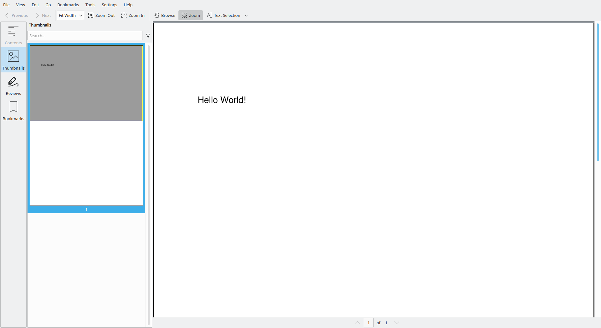

<div style="page-break-before: always;"></div>

## 2.3 Using `LayoutElement` sub-classes to represent various types of content

In the previous example, you learned the bare minimum of adding text to a `Document` using the `Paragraph` class. Let's have a more in-depth look at the various options in the `borb` library.

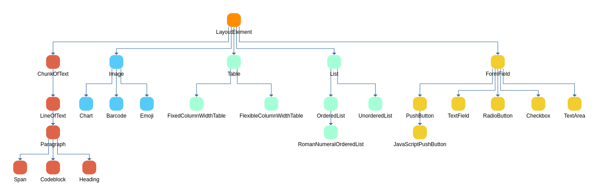

This figure shows the `LayoutElement` hierarchy. The abstract base class `LayoutElement` represents 5 major groups of content:

- Elements that display text (marked in yellow)
- Elements that display images (marked in light blue)
- Elements that display pretty elementary graphics (marked in turquoise)
- Elements that act as a container, grouping other `LayoutElement` implementations (marked in red)
- Elements that enable interactivity, so called `FormField` objects (marked in dark blue)

You'll explore most of these `LayoutElement` implementations in the coming examples. 
The deep-dive will take you on a journey through the entire process from `str` to `PDF`.

<div style="page-break-before: always;"></div>

## 2.4 Adding text to a PDF

The easiest way to add text to a PDF is by using a `Paragraph` object. `Paragraph` represents a piece of text where:

- All characters are rendered in the same Font
- All characters are rendered in the same color

`Paragraph` is typically a block-element (meaning it has a bottom and top padding).

`HeterogeneousParagraph` represents a `Paragraph` whose content may not all be rendered the same.
This can be particularly useful if you'd like to have some words in **bold** in a `Paragraph` or perhaps even a different color, for emphasis.

`HeterogeneousParagraph` is made up of smaller pieces of content called `ChunkOfText` objects.
`ChunkOfText` is the atomic element as far as text-rendering is considered.

Internally, whenever a `Paragraph` is rendered, it will divide itself into `LineOfText` objects, each of which will divide itself in `ChunkOfText` objects.

<div style="page-break-before: always;"></div>

### 2.4.1 Setting the `Font` of a `Paragraph`

One of the things that can really make a document stand out is a custom `Font`. By default, `borb` will use Helvetica, but this is not always desired. In this example, you'll learn how to set the `Font` of a `Paragraph`.

You'll start with the same boilerplate code you used last time:

```python 
#!src/snippet_006
```

Upon closer inspection, you'll find the constructor of `Paragraph` takes an argument `font` which can either be of type `str` or `Font`.

The PDF standard defines 14 fonts that should be embedded (and thus always present) in a PDF viewer. By using one of these fonts, you are ensuring that the document will open without a hitch.

If you're working with any of these 14 fonts, you can get by with just specifying the name of the font (since they are also embedded in `borb`).

These 14 fonts are:

- Courier
- Courier-bold
- Courier-bold-oblique
- Courier-oblique
- Helvetica
- Helvetica-bold
- Helvetica-bold-oblique
- Helvetica-oblique
- Times-bold
- Times-bold-oblique
- Times-oblique
- Times-roman

And 2 fonts used for things like list-symbols and the likes:

- Symbol
- Zapfdingbats

Now that you know, you can easily change the (implicit) `Helvetica` for something like `Courier` or `Helvetica-bold`

```python 
#!src/snippet_007.py
```


Alternatively, you can construct a new `Font` object, based on a TTF file.

```python 
#!src/snippet_008.py
```

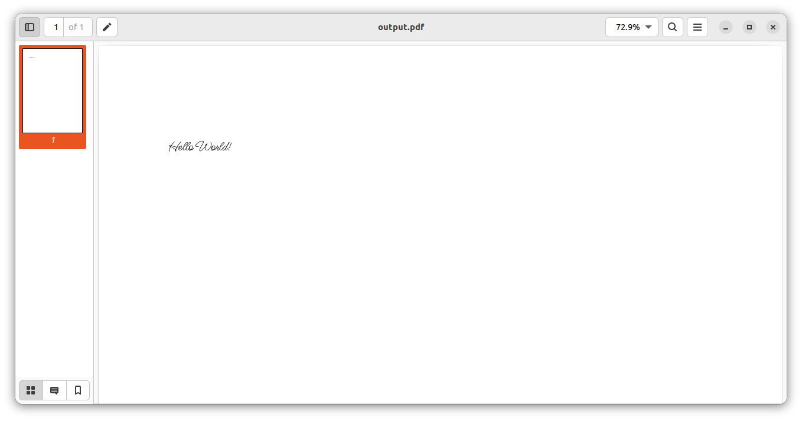

<div style="page-break-before: always;"></div>

### 2.4.2 Setting the `font_color` of a `Paragraph`

Now that you can set the `font` of a `Paragraph`, you can turn your attention to the second most obvious feature with regards to personalization and branding; color.

`borb` offers a myriad of various color models. The easiest of which are:
- `RGBColor` : An RGB color space is any additive color space based on the RGB color model.   A particular color space that employs RGB primaries for part of its specification is defined by the three chromaticities of the red, green, and blue additive primaries,  
and can produce any chromaticity that is the 2D triangle defined by those primary colors (ie. excluding transfer function, white point, etc.). The primary colors are specified in terms of their CIE 1931 color space chromaticity coordinates (x,y), linking them to human-visible color. RGB is an abbreviation for red–green–blue.

- `HexColor` : A hex triplet is a six-digit, three-byte hexadecimal number used in HTML, CSS, SVG, and other computing applications to represent colors. The bytes represent the red, green, and blue components of the color. One byte represents a number in the range 00 to FF (in hexadecimal notation), or 0 to 255 in decimal notation. This represents the least (0) to the most (255) intensity of each of the color components.

- `Pantone` : Pantone LLC is a limited liability company headquartered in Carlstadt, New Jersey.  The company is best known for its Pantone Matching System (PMS), a proprietary color space used in a variety of industries, notably graphic design, fashion design, product design, printing and manufacturing and supporting the management of color from design to production, in physical and digital formats, among coated and uncoated materials, cotton, polyester, nylon and plastics.

- `X11Color` : In computing, on the X Window System, X11 color names are represented in a simple text file,  which maps certain strings to RGB color values. It was traditionally shipped with every X11 installation, hence the name. The web colors list is descended from it but differs for certain color names.

- `CMYKColor` : The CMYK color model (also known as process color, or four color) is a subtractive color model, based on the CMY color model,  
used in color printing, and is also used to describe the printing process itself.  
CMYK refers to the four ink plates used in some color printing: cyan, magenta, yellow, and key (black).  
  
    The CMYK model works by partially or entirely masking colors on a lighter, usually white, background. The ink reduces the light that would otherwise be reflected.  
Such a model is called subtractive because inks "subtract" the colors red, green and blue from white light. White light minus red leaves cyan, white light minus green leaves magenta, and white light minus blue leaves yellow.

- `GrayColor` : In digital photography, computer-generated imagery, and colorimetry, a grayscale or image is one in which the value of each pixel is a single sample representing only an amount of light;
    that is, it carries only intensity information. Grayscale images, a kind of black-and-white or gray monochrome, are composed exclusively of shades of gray.
    The contrast ranges from black at the weakest intensity to white at the strongest.

- `HSVColor` : HSL (hue, saturation, lightness) and HSV (hue, saturation, value, also known as HSB or hue, saturation, brightness) are alternative representations of the RGB color model, designed in the 1970s by computer graphics researchers to more closely align with the way human vision perceives color-making attributes.  

    In these models, colors of each hue are arranged in a radial slice,  
around a central axis of neutral colors which ranges from black at the bottom to white at the top.

But, enough theory, let's put this into practice.

In this example, you're creating the base Hello World, with a different color than the standard black. You'll be doing so by using the `HexColor` object.

```python 
#!src/snippet_009.py
```

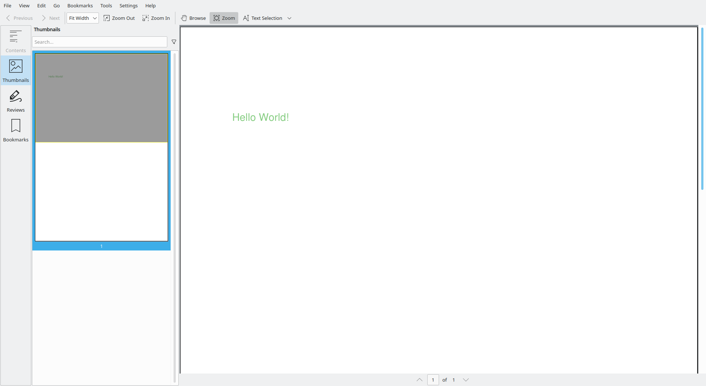

#### 2.4.2.1 Using `HSVColor` to create a rainbow of text

The HSV color model arranges colors on a wheel (rather a cone if you take into account saturation and value). That means you can easily generate a set of colors that divide the color spectrum evenly. 

In the next example, you'll start from the boilerplate Hello World example, and tweak it to generate a `Document` with a rainbow of text.

```python 
#!src/snippet_010.py
```

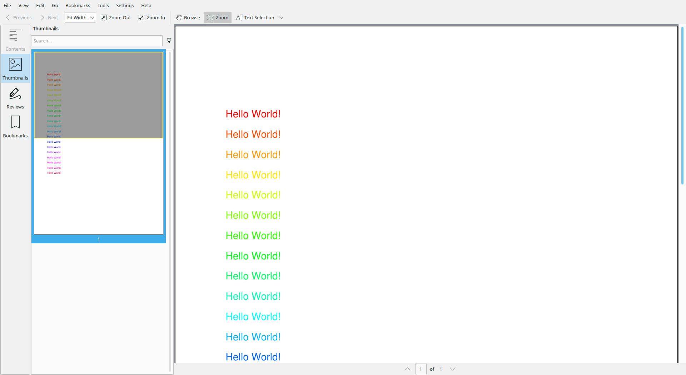

#### 2.4.2.2 Using `X11Color` to specify color in a more human-legible way

In computing, on the X Window System, X11 color names are represented in a simple text file, which maps certain strings to RGB color values. It was traditionally shipped with every X11 installation, hence the name, and is usually located in `<X11root>/lib/X11/rgb.txt`. The web colors list is descended from it but differs for certain color names.

Color names are not standardized by Xlib or the X11 protocol. The list does not show continuity either in selected color values or in color names, and some color triplets have multiple names. Despite this, graphic designers and others got used to them, making it practically impossible to introduce a different list. In earlier releases of X11 (prior to the introduction of Xcms), server implementors were encouraged to modify the RGB values in the reference color database to account for gamma correction.

As of X.Org Release 7.4 `rgb.txt` is no longer included in the roll up release, and the list is built directly into the server. The optional module `xorg/app/rgb` contains the stand-alone `rgb.txt` file.

The list first shipped with X10 release 3 (X10R3) on 7 June 1986, having been checked into RCS by Jim Gettys in 1985.[5] The same list was in X11R1 on 18 September 1987. Approximately the full list as is available today shipped with X11R4 on 29 January 1989, with substantial additions by Paul Ravelling (who added colors based on Sinclair Paints samples), John C. Thomas (who added colors based on a set of 72 Crayola crayons he had on hand) and Jim Fulton (who reconciled contributions to produce the X11R4 list). The project was running DEC VT240 terminals at the time, so would have worked to that device.

In `borb` the class `X11Color` represents all possible X11 colors.

```python   
COLOR_DEFINITION = {  
    "AliceBlue": "#FFF0F8FF",  
    "AntiqueWhite": "#FFFAEBD7",  
    "Aqua": "#FF00FFFF",  
    "Aquamarine": "#FF7FFFD4",  
    "Azure": "#FFF0FFFF",  
    "Beige": "#FFF5F5DC",  
    "Bisque": "#FFFFE4C4",  
    "Black": "#FF000000",  
    "BlanchedAlmond": "#FFFFEBCD",
    ... etc ...
```

In the next example you'll change the Hello World example to use an `X11Color`

```python 
#!src/snippet_011.py
```


#### 2.4.2.3 Using `Pantone` to specify color in a more human-legible way

Pantone is a proprietary color format. It specifies colors by names (or letter/number codes) in such a way that makes it nearly impossible to work well with anything else. Sadly, the format has taken some hold, and a lot of companies have defined their brand-book or color-scheme in terms of Pantone colors.

`borb` contains the definitions of a large selection (over 2000) of the Pantone gamut. Moreover, `borb` can also convert these colors to their nearest `RGBColor` thus allowing greater interoperability.

The (one) advantage of using `Pantone` however is that you get a human-legible name for your `Color` although it does require imagination to differentiate between things like `candlelight-peach`,  `georgia-peach` and `honey-peach`.

In the next example you'll create the boilerplate Hello World example, using a `Pantone`.

```python 
#!src/snippet_012.py
```


If you wanted to, you could also turn any other `Color` object into its (closest matching) `Pantone` color by using the `find_nearest_pantone` method in the `Pantone` class.

#### 2.4.2.4 Making the most of the `Color` classes

Upon closer inspection, you'll see that the base class `Color` implements a method `to_rgb`. This means that regardless of the underlying color model / space, we can get the (nearest) `RGBColor` object.

You can also verify that `HSVColor` can be constructed from `RGBColor` using the `from_rgb` method.

`HSVColor` has some interesting methods:

- `opposite`: This function returns the `HSVColor` whose hue is the opposite of the given `HSVColor`
- `darker`: This function returns a darker shade of the given `HSVColor`

By converting a `Color` (first to `RGBColor` and then to `HSVColor`) you can do all kinds of chromatic operations, like finding matching colors, opposite colors, and darker/lighter colors. Finally, you can convert those `HSVColor` objects back to `RGBColor` once you're done.

In the next examples in this section you'll use the `HSVColor` methods to generate color-schemes that you can use on your `Document`.
These examples are quick and fun ways to explore the `Color` API.

##### 2.4.2.4.1 Generating a triad `Color` scheme


A triadic color scheme uses colors that are evenly spaced around the color wheel.

Triadic color harmonies tend to be quite vibrant, even if you use pale or unsaturated versions of your hues.

To use a triadic harmony successfully, the colors should be carefully balanced - let one color dominate and use the two others for accent.

```python
#!src/snippet_013.py
```


##### 2.4.2.4.2 Generating a split complementary `Color` scheme


The split-complementary color scheme is a variation of the complementary color scheme. In addition to the base color, it uses the two colors adjacent to its complement.

This color scheme has the same strong visual contrast as the complementary color scheme, but has less tension.

The split-complimentary color scheme is often a good choice for beginners, because it is difficult to mess up.

```python
#!src/snippet_014.py
```


##### 2.4.2.4.3 Generating an analogous `Color` scheme


Analogous color schemes use colors that are next to each other on the color wheel. They usually match well and create serene and comfortable designs.

Analogous color schemes are often found in nature and are harmonious and pleasing to the eye.

Make sure you have enough contrast when choosing an analogous color scheme.

Choose one color to dominate, a second to support. The third color is used (along with black, white or gray) as an accent.

```python
#!src/snippet_015.py
```

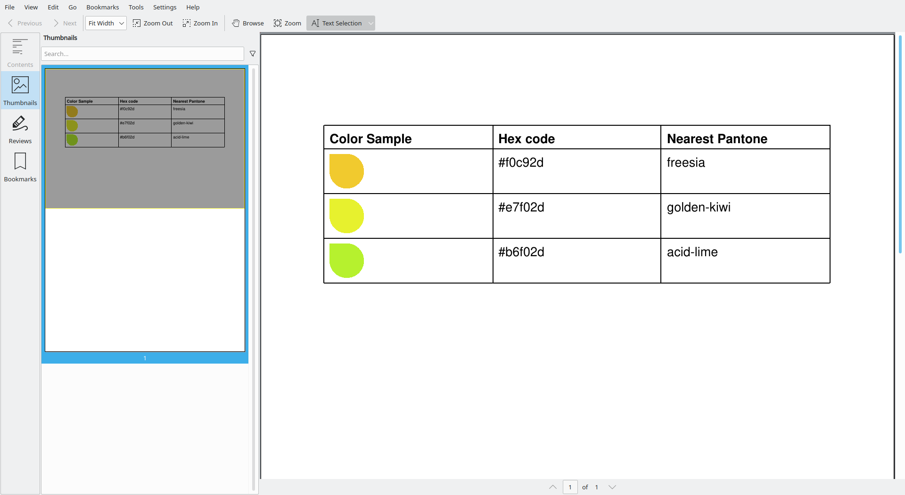

##### 2.4.2.4.4 Generating a tetradic square `Color` scheme

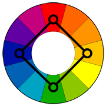

The square color scheme is similar to the rectangle, but with all four colors spaced evenly around the color circle.

The square color scheme works best if you let one color be dominant.

You should also pay attention to the balance between warm and cool colors in your design.

```python
#!src/snippet_016
```

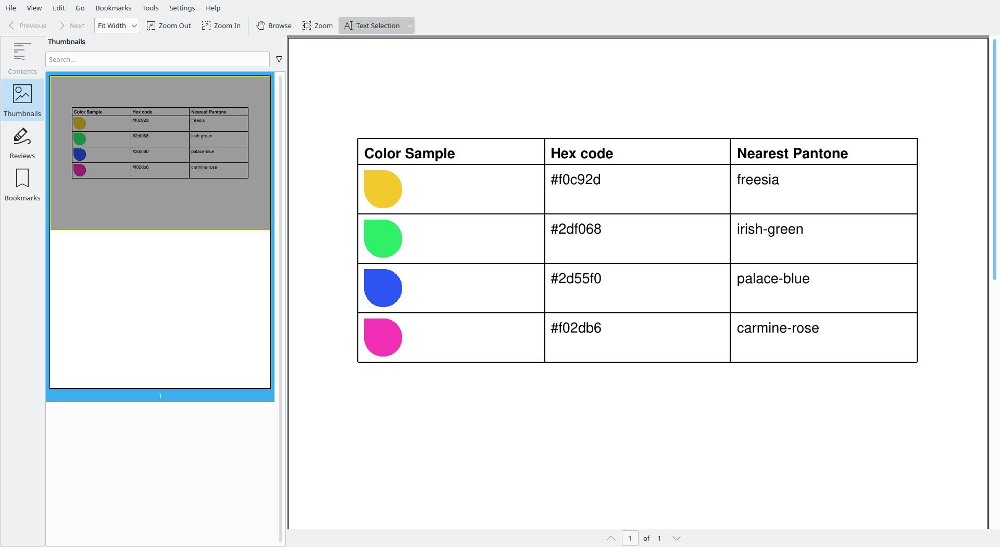

##### 2.4.2.4.5 Generating a tetradic rectangular `Color` scheme

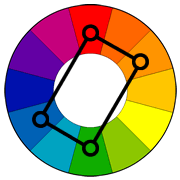

The rectangle or tetradic color scheme uses four colors arranged into two complementary pairs.

This rich color scheme offers plenty of possibilities for variation.

The tetradic color scheme works best if you let one color be dominant.

You should also pay attention to the balance between warm and cool colors in your design.

```python
#!src/snippet_017.py
```


#### 2.4.2.5 Implementation details

All `Color` classes (with the exception of `HexColor`, `Pantone` and `X11Color`) are constructed using values `0..1`.
This is consistent with the PDF specification, but may be unexpected for those that are used to working with other image-processing software.
e.g. To represent pure red using `RGBColor`, you would write `RGBColor(Decimal(1), Decimal(0), Decimal(0))`.

Failing to remember this little convention will often result in some `LayoutElement` objects being entirely black or white, 
although the constructors of the aforementioned `Color` classes do have asserts to check whether the arguments that are passed do fall in the `0..1` range.  

<div style="page-break-before: always;"></div>

### 2.4.3 Using `Alignment` on `Paragraph` objects

Alignment is the process of determining where (in the available space) a `LayoutElement` should be positioned. 
For any `LayoutElement`, there are at least 2 kinds of alignment:

- `horizontal_alignment`: determines whether the `LayoutElement` should be positioned `LEFT`, `CENTERED` or `RIGHT` in the available space
- `vertical alignment`: determines whether the `LayoutElement` should be positioned `TOP`, `MIDDLE` or `BOTTOM` in the available space

For `LayoutElement` implementations containing text, you may also set the `text_alignment` parameter.

#### 2.4.3.1 horizontal alignment

In order to get a better idea of the influence of these parameters, you'll be doing things a little differently now.

You'll be adding content at an exact location, and specifying the bounding box. By doing so, you'll get a better understanding of how the alignment influences the position of the Paragraph inside the bounding box.

```python 
#!src/snippet_018.py
```

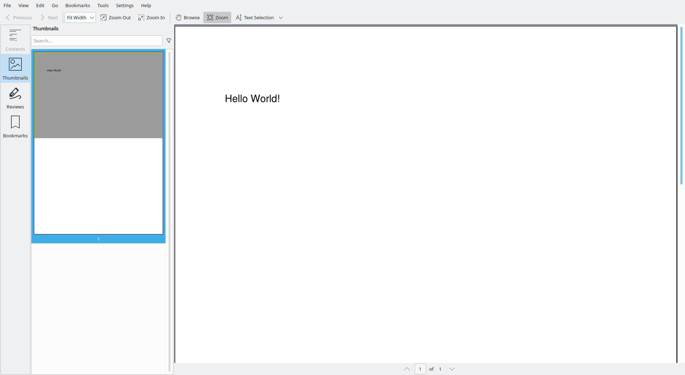

Important to notice here is the PDF coordinate system. `borb` expects these positions in user-space units, and as Decimal objects.

The origin of the PDF coordinate space is typically at the bottom, left of the page. This might be a bit confusing, as you would typically start adding content at the top left.

Now let's explore!

For the next example, you'll be setting the `horizontal_alignment` parameter to its 3 allowed values, and checking out the differences between the resulting PDFs.

You'll start by trying out `Alignment.LEFT`

```python 
#!src/snippet_019.py
```


Now you can try `Alignment.CENTERED`

```python 
#!src/snippet_020.py
```

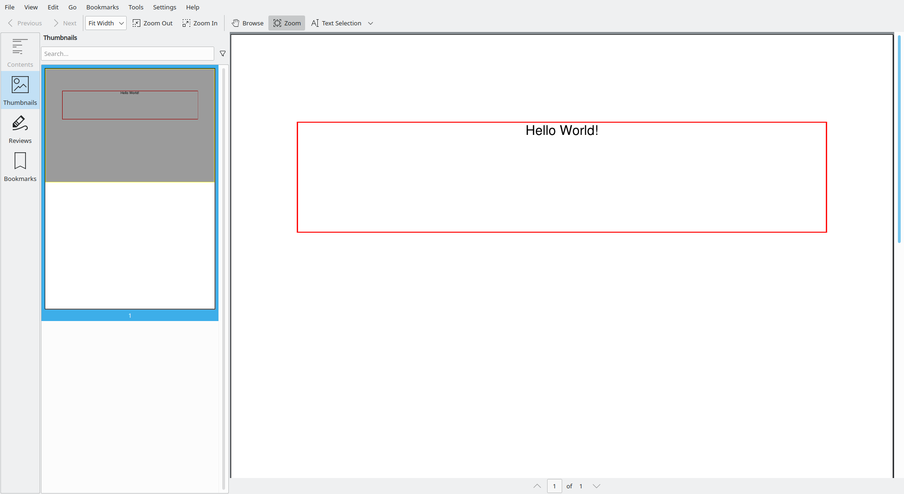

and finally `Alignment.RIGHT`

```python 
#!src/snippet_021.py
```


You'll also try setting the horizontal_alignment to an invalid value, just to see how `borb` reacts.

#### 2.4.3.2 vertical alignment

Now you can try the same for vertical_alignment. 
In the next example you'll start by setting the `vertical_alignment` to `Alignment.TOP`.

To ensure you can see the difference the various alignment settings make, you'll be adding a red rectangle to the page. 
This should make it clear where and how the paragraph is being laid out.

```python 
#!src/snippet_022.py
```


Now you'll try the same for `Alignment.MIDDLE`.

```python
#!src/snippet_023.py
```


And lastly, you can try setting the alignment to `Alignment.BOTTOM`.

```python 
#!src/snippet_024.py
```

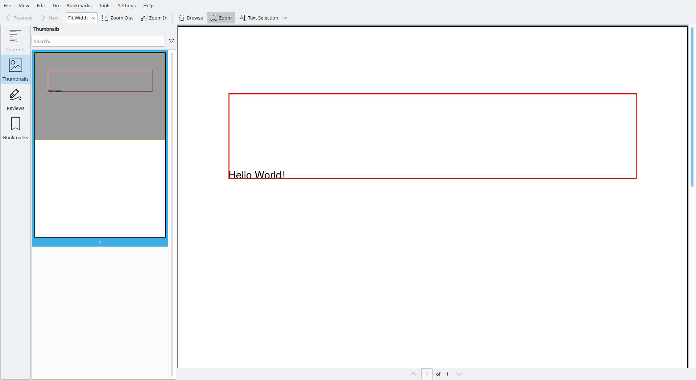

#### 2.4.3.3 text alignment

For text_alignment, you can set the same values as horizontal_alignment, with one exception:

- `Alignment.LEFT`
- `Alignment.CENTERED`
- `Alignment.RIGHT`
- `Alignment.JUSTIFIED`

`Alignment.JUSTIFIED` is special, it lays out the Paragraph according to the following pseudo-code:

```
1. split the text into words, call this ws
2. lines_of_text = []
3. for each w in ws:
4.   if the last line of text (lines_of_text[-1]) + w fits in the bounding box:
5.     append w to lines_of_text[-1]
6.   else:
7.     append a new array to lines_of_text, containing only w
8. for each line_of_text in lines_of_text:
9.     calculate the remaining space in the bounding box
10.    divide the remaining space by the amount of space characters, call this delta
11.    for each chunk of text (not space) in line_of_text:
12.       lay out the chunk, keeping track of the x-position
13.       if you encounter a space, update the x-position by adding delta 
```
The last line of the `Paragraph` is treated as if it was laid out with text_alignment set to `Alignment.LEFT`.

Enough theory, let's practice!

In the next example, you'll be creating a `Paragraph` with `text_alignment` set to `Alignment.JUSTIFIED`.

```python
#!src/snippet_025.py
```

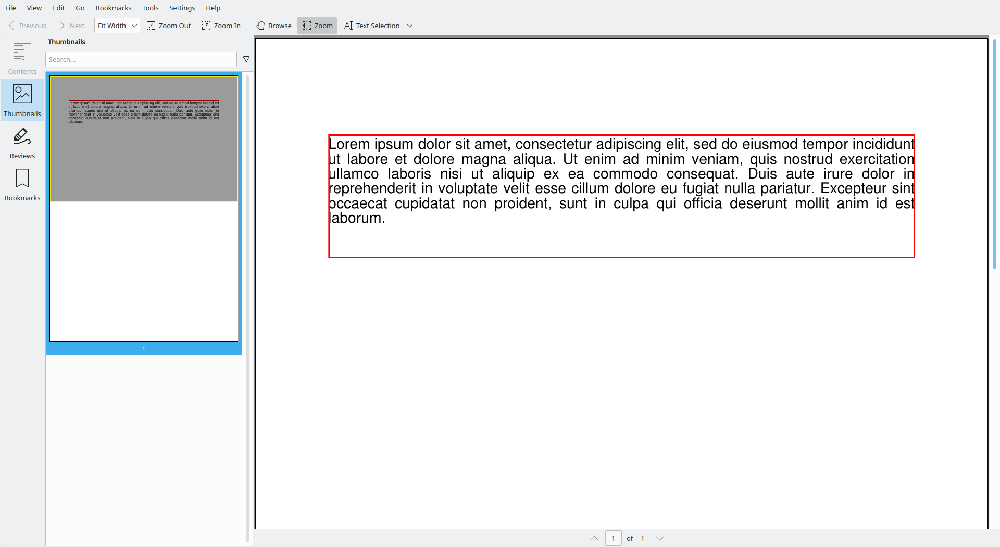

<div style="page-break-before: always;"></div>

### 2.4.4 Using borders on `Paragraph` objects

It can be useful to set borders on `LayoutElement` objects, for `borb` this is as easy as passing a couple of `bool` args.

In the next example, you'll explore how to set borders on a `Paragraph`;

```python 
#!src/snippet_026.py
```


<div style="page-break-before: always;"></div>

### 2.4.5 Using margin and padding on `Paragraph` objects

I always mix up margin and padding. Personally, I find this illustration rather helpful:

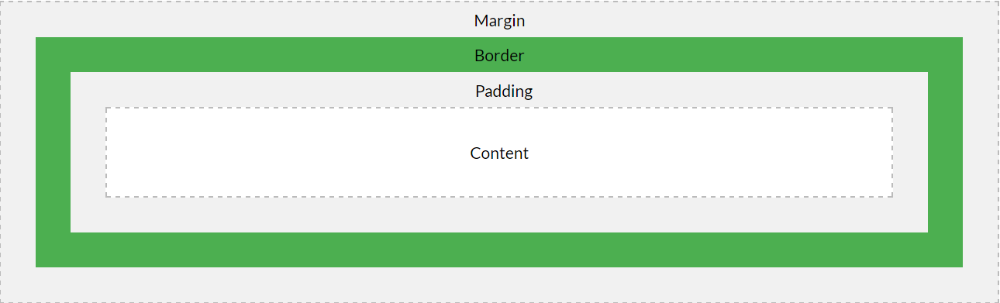

`borb` allows you to set both `margin` and `padding` on `LayoutElement` instances.
In the next example you'll be doing just that:

```python 
#!src/snippet_027.py
```


You will have noticed the final PDF does not seem to have any margin on the `Paragraph` element. This is of course because you explicitly laid out the `Paragraph` manually. `margin` is not considered to be *part of the element*. 

After all, think of a browser-based context, where two inline elements have a margin specified. The effective margin that is used will depend on both elements (in fact the horizontal gap between them will typically be the maximum of both their respective margins).

In short, `margin` is something that needs to be considered at a higher-up level (since it could be a calculation based on multiple `LayoutElement` instances).

<div style="page-break-before: always;"></div>

## 2.5 Adding `Image` objects to a PDF

Being able to add images to your PDF is one of the core skills. It can be useful for:

- Adding a logo to an invoice
- Adding a barcode or QR code to a document to link it to a website
- Ensuring the branding and customization of your document is on point
- Etc

`borb` allows you to create `Image` objects in a variety of ways:

- By passing a URL (passed as `str`)
- By passing a `Path`
- By passing a `PIL.Image`

There are convenience classes to enable you to easily add:

- Barcodes
- Charts
- Emoji
- Maps
- Progressbars
- QR codes


In the next example, you'll be adding an `Image` to a `Page`, by specifying its URL.

```python 
#!src/snippet_028.py
```

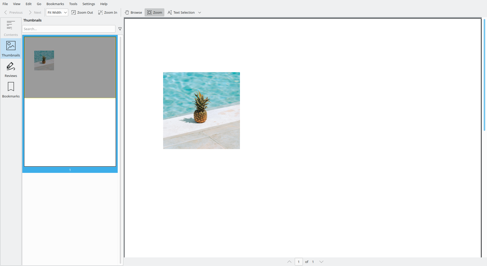

You'll notice a few things here:

- You used an image from unsplash. I would highly recommend this website for royalty-free photographs.
- You specified the `width` and `height` explicitly. This is needed, since `Image` objects are not scaled down automatically. This is closely related to laying out `Image` objects in `Table` instances. Most table-layout algorithms (including the one in `borb`) calculate the minimum dimensions of each element they contain. If `Image` instances are allowed to be scaled down automatically, their minimum dimensions becomes 0.

You can verify that `borb` gives you a nice assert if you try to add something that's too large to a `Page`.

```python 
#!src/snippet_029
```

When you attempt to run this code, you should get the following assert:

``` 
AssertionError: Image is too wide to fit inside column / page.
```

In the next example, you'll insert an `Image` by using its path (on disk).

```python 
#!src/snippet_030.py
```

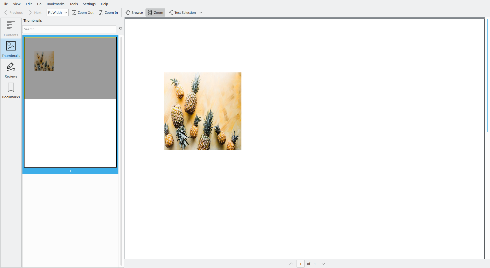

<div style="page-break-before: always;"></div>

## 2.6 Adding line-art to a PDF using `Shape` objects

### 2.6.1 Adding line-art using `LineArtFactory`

One of the main goals of `borb` is to put the user first. I would like PDF to become as accessible as other digital document formats (e.g. Microsoft Words).

This goal is reflected in both large and small features in `borb`. One of these small things is the line-art factory. Rather than forcing the end-user to draw complicated line-art by hand, `LineArtFactory` contains a ton of methods that enable you to easily draw the most common shapes on the `Page`.

This is a quick overview (although I would recommend inspecting the code to check out which exact shapes are supported).

- **flowchart shapes**: decision, process, document, predefined document, multiple documents, data, predefined process, stored data, internal storage, sequential data, direct data, manual input, manual operation, card, paper tape, preparation, loop limit, termination, collate, delay, extract, merge, or, sort, summing junction, database, on page reference, off page reference, process iso9000, transport
- **geometric shapes**: rectangle, right angled triangle, regular n-gon, isoceles triangle, parallellogram, trapezoid, diamond, pentagon, hexagon, heptagon, octagon, circle, fraction of a circle, half a circle, three quarters of a circle
- **stars**: four pointed star, five pointed star, six pointed star, n-pointed star
- **arrows**: arrow left, arrow right, arrow up, arrow down
- **misc**: droplet, heart, sticky note, cartoon diamond

In the next example, you'll create a PDF with a sticky note shape in it.

```python 
#!src/snippet_031.py
```

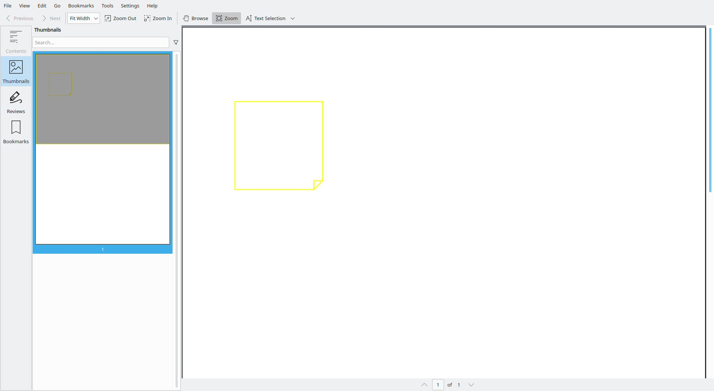

The initial bounding box you pass to the `LineArtFactory.sticky_note` function is only used to determine how wide/tall the `Shape´ should be.

`LineArtFactory` always returns `typing.List[typing.Tuple[Decimal, Decimal]]` or, to put it in more legible terms, a list of points (specified by x, y coordinates).

This ensures you can still do things with these points, should you so desire.

## 2.6.2 Adding a `ProgressBar` to a PDF

The `ProgressBar` (and its cousin `ProgressSquare`) represent an easy way to visualize a process/task that is **being executed** or that has executed with some **degree of success**.
You can construct it using a `percentage` (which defaults to 0).

I can imagine you might use this in testing reports, to indicate how many tests in a particular category failed/passed.

Let's make a report:

```python
#!src/snippet_032.py
```

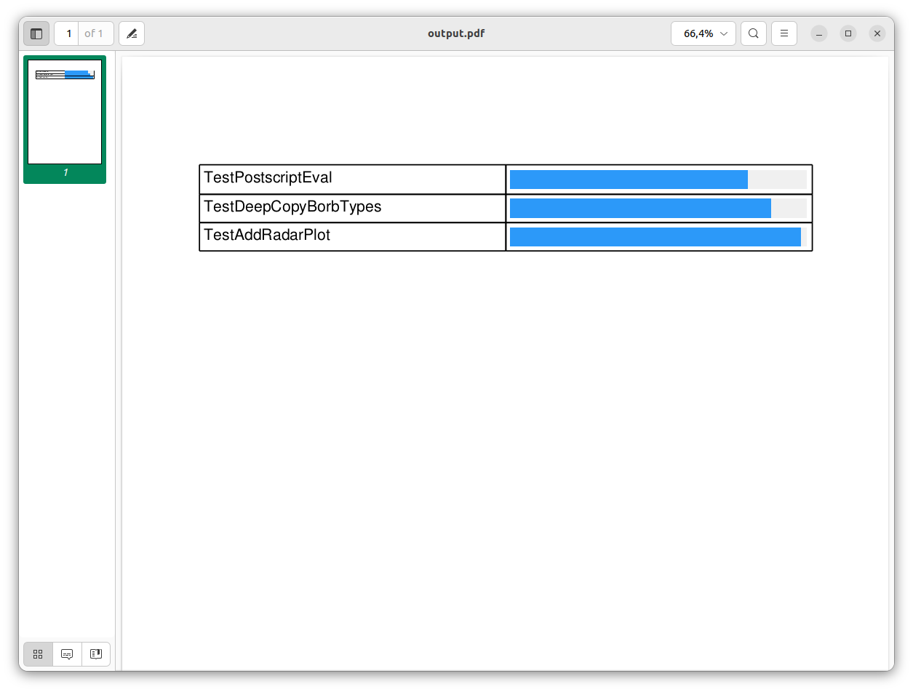

## 2.6.3 Adding a `Map` to a PDF

The `Map` is a kind of `Shapes` object, which represents a collection of `ConnectedShape` or `DisconnectedShape` objects.
`borb` comes with 3 `Map` objects pre-installed:

- **MapOfEurope**: This implementation of `Map` represents Europe. Europe is a continent comprising the westernmost peninsulas of Eurasia, located entirely in the Northern Hemisphere and mostly in the Eastern Hemisphere. It shares the continental landmass of Afro-Eurasia with both Africa and Asia. It is bordered by the Arctic Ocean to the north, the Atlantic Ocean to the west, the Mediterranean Sea to the south, and Asia to the east. Europe is commonly considered to be separated from Asia by the watershed of the Ural Mountains, the Ural River, the Caspian Sea, the Greater Caucasus, the Black Sea and the waterways of the Turkish straits.
- **MapOfTheUnitedStates**: This implementation of `Map` represents the United States and its territories. The United States currently administers three territories in the Caribbean Sea and eleven in the Pacific Ocean. Five territories (American Samoa, Guam, the Northern Mariana Islands, Puerto Rico, and the U.S. Virgin Islands) are permanently inhabited, unincorporated territories; the other nine are small islands, atolls, and reefs with no native (or permanent) population. Of the nine, only one is classified as an incorporated territory (Palmyra Atoll). Two additional territories (Bajo Nuevo Bank and Serranilla Bank) are claimed by the United States but administered by Colombia.
- **MapOfTheWorld**:

You can `pop` items from a `Map` to remove them.
And of course you can set the `fill_color` and `stroke_color` of an item to highlight it.
In the next example we'll create a `MapOfTheWorld` and highlight Poland.

```python 
#!src/snippet_033.py
```

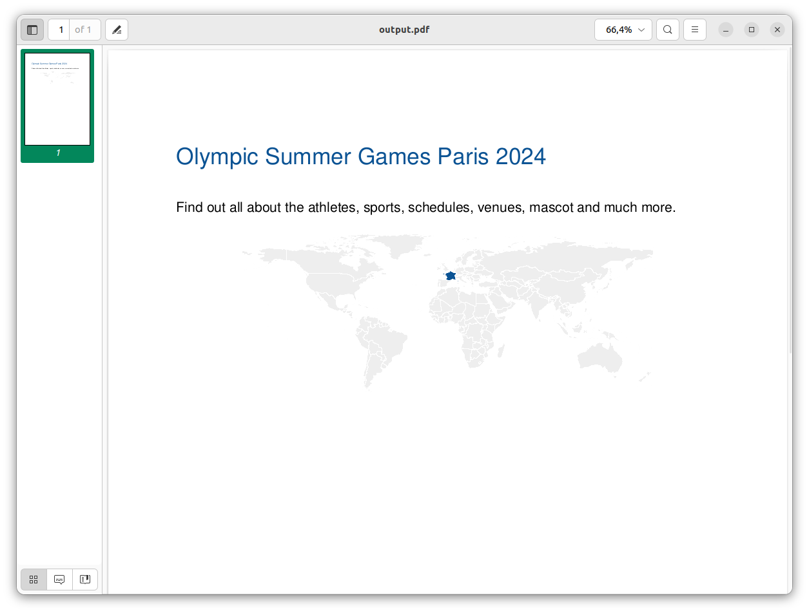

<div style="page-break-before: always;"></div>

## 2.7 Adding barcodes and QR-codes to a PDF

A `Barcode`, or qr-code can really add interactivity to your documents. It ensures you can easily link the printed document to an online resource simply by pointing a smartphone at it.

`borb` supports a myriad of `Barcode` types.

In the next example you'll add a `Barcode` to a `Page`. In subsequent examples you'll tweak the look and feel of the `Barcode` (its `stroke_color` , `fill_color` as well as its `width` and `height`).

In the final example of this section, you'll create and add a QR code to a `Page`.

### 2.7.1 Adding a `Barcode` to a `Page`

In the next example you'll be adding an `EAN_14` code to a `Page`.
The python script is very straightforward:

```python  
#!src/snippet_034.py
```

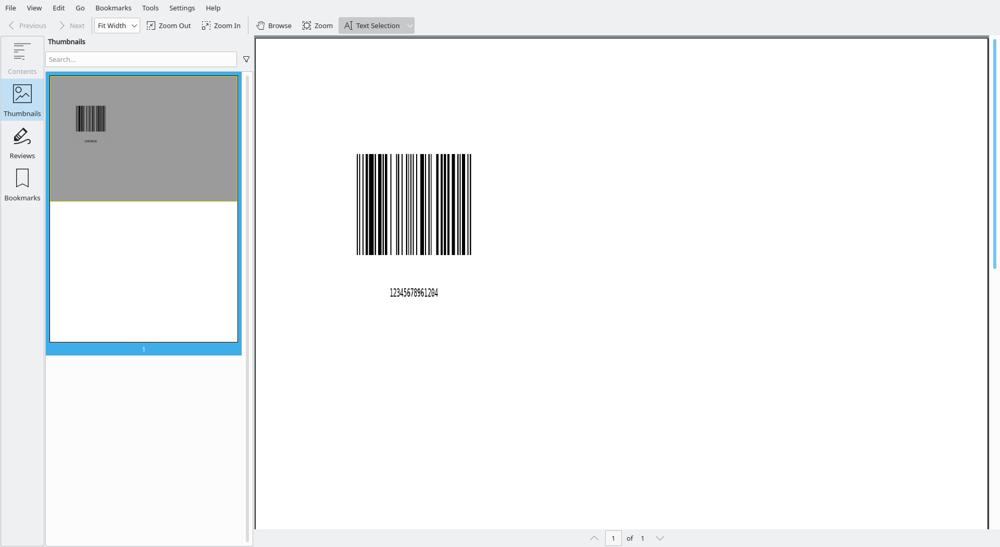

#### 2.7.1.1 Setting the `stroke_color` and `fill_color` of a `Barcode`

Of course, if your company's brand color happens to be something other than black, or you're trying to display a `Barcode` on a background that's not white, `borb` has got you covered.

In the next example, you'll be tweaking the `stroke_color` and `fill_color` of a `Barcode` to make sure it pops.

```python 
#!src/snippet_035.py
```


### 2.7.2 Adding a QR-code to the `Page`

A QR code (abbreviated from Quick Response code) is a type of matrix barcode (or two-dimensional barcode) invented in 1994 by the Japanese automotive company Denso Wave.

A QR code consists of black squares arranged in a square grid on a white background, which can be read by an imaging device such as a camera, and processed using Reed–Solomon error correction until the image can be appropriately interpreted. The required data is then extracted from patterns that are present in both horizontal and vertical components of the image.
 
In practice, QR codes often contain data for a locator, identifier, or tracker that points to a website or application.

`borb` also supports QR-codes.
The code from the previous example doesn't really change that much, other than setting a different `type`

```python 
#!src/snippet_036.py
```


### 2.7.3 Other supported barcodes

`borb` supports the following barcode formats:

- `BarcodeType.CODE_128`
- `BarcodeType.CODE_39`
- `BarcodeType.EAN`
- `BarcodeType.EAN_13`
- `BarcodeType.EAN_14`
- `BarcodeType.EAN_8`
- `BarcodeType.GS_1`
- `BarcodeType.GS_128`
- `BarcodeType.GTIN`
- `BarcodeType.ISBN`
- `BarcodeType.ISBN_10`
- `BarcodeType.ISBN_13`
- `BarcodeType.ISSN`
- `BarcodeType.ITF`
- `BarcodeType.JAN`
- `BarcodeType.PZN`
- `BarcodeType.QR`
- `BarcodeType.UPC`
- `BarcodeType.UPC_A`

<div style="page-break-before: always;"></div>

## 2.8 Adding `Chart` objects to a PDF

Being able to add `Chart` objects to a `Page` can be very useful when creating certain kinds of documents. 
Test-reports, or sales/revenue documents can often benefit from being illuminated by charts. 
`borb` supports (almost directly) adding `matplotlib` charts to a `Page`.

In the next example you'll create a PDF `Document` and add a `Chart` to it.
This example does have some extra dependencies:

- `pandas`
- `numpy`
- `matplotlib`


```python 
#!src/snippet_037.py
```

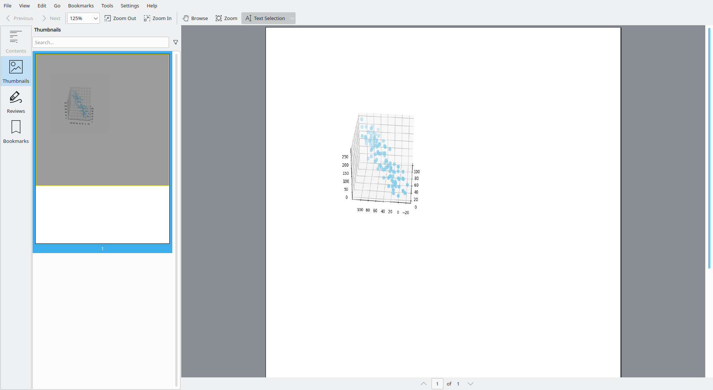

<div style="page-break-before: always;"></div>

## 2.9 Adding emoji to a PDF

Emoji are typically a font-related thing, i.e. a font either supports emoji, or it doesn't. 
As a consequence, you (the end user) may find yourself in a situation where you have a cool font that you'd like to use, but sadly the font doesn't support emoji.

To fix this, `borb` comes bundled with upwards of 500 emoji. 
These can easily be inserted into any `Document` or `Page`.

In the next example you'll be using `InlineFlow` to make it easy to place `Image` objects as inline `LayoutElement`.
You can achieve the same effect using `SingleColumnLayout` (or `MultiColumnLayout`) by adding the `Emoji` to a `HeterogeneousParagraph`,
but `HeterogeneousParagraph` is not as generic as `InlineFlow`.

```python 
#!src/snippet_038.py
```

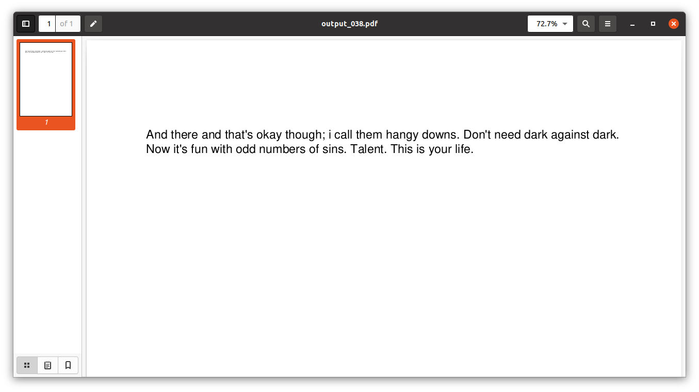

<div style="page-break-before: always;"></div>

## 2.10 Quick prototyping

Sometimes, you'll need to quickly generate a prototype for some document to determine the layout. This can be hard if you don't yet know the exact text that will be used in the final PDF.
Maybe the final text is still being approved by marketing, or maybe it still needs to be translated. Similar problems can happen with images.

In order to make sure document creation can go ahead without having to wait for the content, `borb` comes with a couple of utility classes that allow you to easily generate dummy text and images.

### 2.10.1 Adding dummy text

`borb` comes with the class `Lipsum` (in `borb.pdf.canvas.lipsum.lipsum`) which has the following methods:
- `generate_lipsum_text` : allowing you to generate the classic lorem ipsum text
- `generate_lewis_carroll_text` : allowing you to generate a Lewis Carroll inspired dummy text
- `generate_jane_austen_text` : allowing you to generate a Jane Austen inspired dummy text
- and more (check them out, they provide some much-needed distraction from the boring `Lorem Ipsum` classic)

Both methods use a markov model to generate text similar to the text they've been trained on.

In this first example you'll be using the classic `Lorem Ipsum Dolor Sit Amet`.
Keep in mind the text generated here is random, it might (most probably will) come out different on your device.

```python 
#!src/snippet_039.py
```

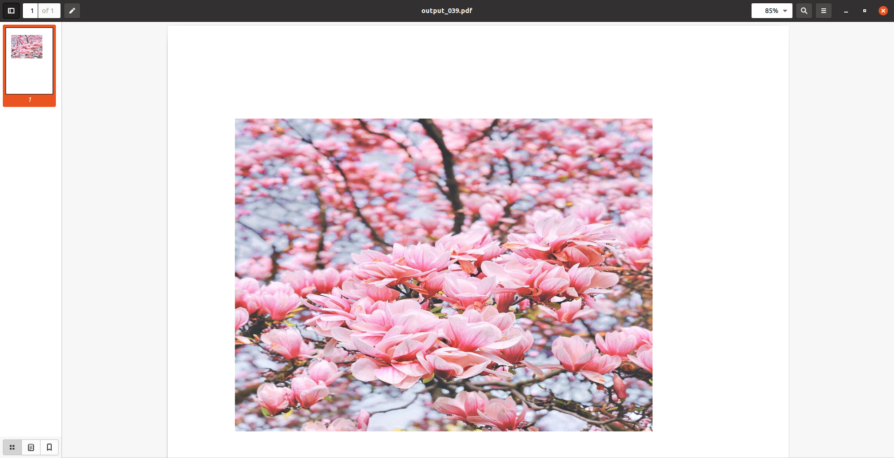

<div style="page-break-before: always;"></div>

In this next example you'll be using the more whimsical Lewis Carroll version.

```python 
#!src/snippet_040.py
```


<div style="page-break-before: always;"></div>

### 2.10.2 Adding dummy images

Rather than having to wait for the pictures provided by your marketing department, you can already insert some dummy images in the PDF as a placeholder.
Doing so is easy with the `Unsplash` class, which uses the unsplash.com API as its image provider.
You will need to provide an API key in order to ensure you have access to these services.

You can pass a desired dimension to the method. `borb` will attempt to find the `Image` whose aspect ratio best matches the one you provided. That way, if the `Image` needs to be scaled down or up, you will experience minimal distortions.

```python 
#!src/snippet_041.py
```

The result should look somewhat like this. Although the actual image may differ (if Unsplash suddenly decides to serve some other image as being more relevant for the keywords in the example).


<div style="page-break-before: always;"></div>

## 2.11 Conclusion

In this section you've learned the basics of creating a new PDF using `borb`. 
In this section you've learned how various pieces of content are represented by the different `LayoutElement` implementations in `borb`. 
You've worked with text, images, barcodes, qr-codes, emoji, and geometric shapes.

You've briefly explored classes like; `Paragraph`, `Image`, `Shape`, `Emoji`, `OrderedList`, `UnorderedList`, `FlexibleColumnWidthTable` and `FixedColumnWidthTable`.

You've learned how to set various properties like `font_color`, or `background_color` 
and even used `horizontal_alignment` , `vertical_alignment` and `text_alignment`.

You've briefly explored `PageLayout`, `BrowserLayout` and even manual layout.

To see how you can use all of those techniques together, 
check out some of the deep-dives, where I'll show you how to create an invoice from start to finish.

<div style="page-break-before: always;"></div>
