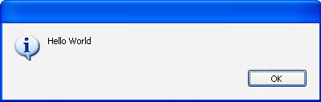
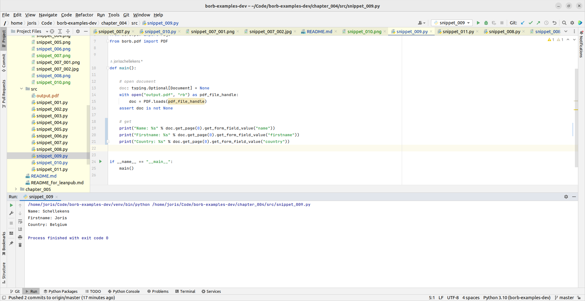

# 4 Forms


<div style="page-break-before: always;"></div>

## 4.1 Acroforms vs XFA

From wikipedia:

> XFA (also known as XFA forms) stands for XML Forms Architecture, a family of proprietary XML specifications that was suggested and developed by JetForm to enhance the processing of web forms.  
> It can be also used in PDF files starting with the PDF 1.5 specification. 
> The XFA specification is referenced as an external specification necessary for full application of the ISO 32000-1 specification (PDF 1.7). 
> The XML Forms Architecture was not standardized as an ISO standard, and has been deprecated in PDF 2.0.

## 4.2 The `FormField` object

From the PDF specification:

> An interactive form (PDF 1.2)—sometimes referred to as an AcroForm—is a collection of fields for gathering information interactively from the user. 
> A PDF document may contain any number of fields appearing on any combination of pages, all of which make up a single, global interactive form spanning the entire document.
> Arbitrary subsets of these fields can be imported or exported from the document; see 12.7.5, “Form Actions.”
>
> Each field in a document’s interactive form shall be defined by a field dictionary (see 12.7.3, “Field Dictionaries”). 
> For purposes of definition and naming, the fields can be organized hierarchically and can inherit attributes from their ancestors in the field hierarchy.
> 
> A field’s children in the hierarchy may also include widget annotations (see 12.5.6.19, “Widget Annotations”) that define its appearance on the page. 
> A field that has children that are fields is called a non-terminal field. 
> A field that does not have children that are fields is called a terminal field.

> Interactive forms (see 12.7, “Interactive Forms”) use widget annotations (PDF 1.2) to represent the appearance of fields and to manage user interactions. 
> As a convenience, when a field has only a single associated widget annotation, the contents of the field dictionary (12.7.3, “Field Dictionaries”) 
> and the annotation dictionary may be merged into a single dictionary containing entries that pertain to both a field and an annotation.

`borb` supports AcroForm technology in a way that is indistinguishable from other `LayoutElement` implementations. 
To the user, the technical side of forms (especially to the level of how the `Dictionary` objects are structured) is often not that important.

You can add a `FormField` object to a `Page` or `PageLayout` in the same way you'd add a `Paragraph` and everything will be taken care of.
`borb` will create the `Dictionary` objects, add them to the `Page`, perform all the calculations needed for layout, etc

## 4.3 Adding `FormField` objects to a PDF

`FormField` represents the common base implementation of form fields. 
It handles the logic that is common to `TextField`, `CheckBox`, `DropDownList` and other classes.

### 4.3.1 Adding a `TextField` to a PDF

In the next example you'll be using a `Table` in conjunction with `TextField` objects to build a very rudimentary form.

```python
#!src/snippet_001.py
```

The output `Document` should look like this.
Notice the little warning ribbon atop the `Document` (which may appear differently depending on the PDF reader you are using).


Let's show the forms, and see what you've made:


We can of course fill in values in these textboxes:


And now, when we hide the forms again, the text becomes uneditable:


Your PDF reader may ask you whether you'd like to save the values in the form before closing the `Document`.

### 4.3.2 Customizing a `TextField` object

`TextField` accepts the same arguments as `Paragraph` when it comes to styling.
For instance, you can also set the `font_color`.

```python
#!src/snippet_002.py
```

This does not really have an impact on the form when it's editable:


But it does change the appearance of the form once it's uneditable:


### 4.3.3 Pre-filling a `TextField` object

You can of course pre-fill a `TextField`. This can be quite useful when you already know some of the values,
or when one particular answer occurs most of the time (it might save your reader some time if the most likely answer is pre-filled).

In the next example you'll be updating the code you wrote earlier to generate a simple form, and pre-fill some of its values;

```python
#!src/snippet_003.py
```


### 4.3.4 Adding a `DropDownList` to a PDF

You've seen how to add a `TextField`, but what if you'd like to restrict the reader to only allow certain inputs.
This is typically where you could also use a `DropDownList`.
A `DropDownList` can be constructed with `typing.List[str]` and will allow the user to select one of the options.

```python
#!src/snippet_004.py
```


### 4.3.5 Adding a `CountryDropDownList` to a PDF

It would be rather nonsensical to have every developer that uses `borb` code up the same `DropDownList` over and over again.
One of the key usecases of `DropDownList` is when you're using it to allow the user to select a country from a  list of all countries in the world.
`borb` comes to the resque with its `CountryDropDownList`, which comes pre-loaded with all the country-names.

```python
#!src/snippet_005.py
```


### 4.3.6 Adding a `CheckBox` to a PDF

:mega: todo :mega:

### 4.3.7 Adding a `RadioButton` to a PDF

:mega: todo :mega:

### 4.3.8 Adding a `PushButton` to a PDF

You can also add a `PushButton` to a PDF. 
These buttons can be configured (using their `\Action` dictionary) to interact with the PDF in predefined ways.
The default action (assuming you do not specify anything) is to reset the form (clearing all the input).

```python
#!src/snippet_006.py
```


### 4.3.9 Adding a `JavaScriptPushButton` to a PDF

To have maximum configurability you can add a `JavaScriptPushButton` to a `Document`.
These buttons can be configured to have any (compliant) `JavaScript` script associated with them.
In this example you'll create a `Document` that shows an alert box whenever the `PushButton` gets pressed.

```python
#!src/snippet_007.py
```


When clicked, this shows a popup:



For more information on how to use `JavaScript` inside a PDF, I recommend the following resources:
- https://helpx.adobe.com/acrobat/using/applying-actions-scripts-pdfs.html
- https://acrobatusers.com/tutorials/
- https://acrobatusers.com/tutorials/popup_windows_part1/

## 4.4 Getting the value of a `FormField` in an existing PDF

In this section you'll learn how to retrieve the values that a user filled in from a PDF AcroForm.
You'll be using the PDF created earlier. 
Be sure to open it, fill in some values, and save it in order to get everything ready for this example.

We'll start by creating a PDF with a form in it:

```python
#!src/snippet_008.py
```


Now we can either set the values in the form by opening the PDF and typing something (make sure to save the PDF when Adobe asks you to do so).
We could also just set the values using `borb` of course. You'll learn how to do that shortly.

Finally, with our form filled in (and saved), we can get the filled in values in the PDF:

```python
#!src/snippet_009.py
```

This should print something like:


```commandline
/usr/bin/python3.8 /home/joris/Code/borb-examples-dev/example/example_053.py
Name             : Schellekens
Firstname        : Joris
Country          : Belgium
```

of course, the exact values depend on what you filled in (either manually or programmatically).

## 4.5 Changing the value of a `FormField` in an existing PDF

This is another very common usecase.
You have designed a wonderful PDF, complete with `FormField` objects (perhaps in another PDF software suite),
and now you'd like to use your work as a template (so to speak) and generate hundreds of `Document` objects based on this one `Document` with a form.

I've seen this exact approach used in movie-theaters, where tickets needed to be produced containing seating and movie-information.
Or even for a famous circus-act.

In the next example you'll be using an existing PDF (the one you created earlier), and filling in its fields.
Later you'll learn how to remove interactivity by flattening the `Document`.

### 4.5.1 Changing the value of a `FormField` in an existing PDF using `borb`

```python
#!src/snippet_010.py
```



### 4.5.2 Changing the value of a `FormField` in an existing PDF using `JavaScript`

We can also set the values of fields inside the PDF by using `JavaScript`.
This has the advantage of making the PDF really dynamic. You can have the user fill in their date of birth, and automatically calculate their age (and fill it in on a different `FormField`).
You could pre-fill address fields with `JavaScript`, for instance filling in somebody's town if you know their zipcode.

In the next example, you'll be creating a PDF with a simple `JavaScriptPushButton` that triggers a piece of `JavaScript` to set a `TextField`.

```python
#!src/snippet_011.py
```

## 4.6 Conclusion

In this section you've learned how to build interactive, fillable PDF forms.

You've seen the various form `LayoutElement` objects `borb` has to offer and you've coded up a sample for each of them.

You've set the values of these fields using `Python` or by embedding `JavaScript` in the PDF itself.

Finally, you've learned how to extract the filled in values from a form inside a PDF.

<div style="page-break-before: always;"></div>
