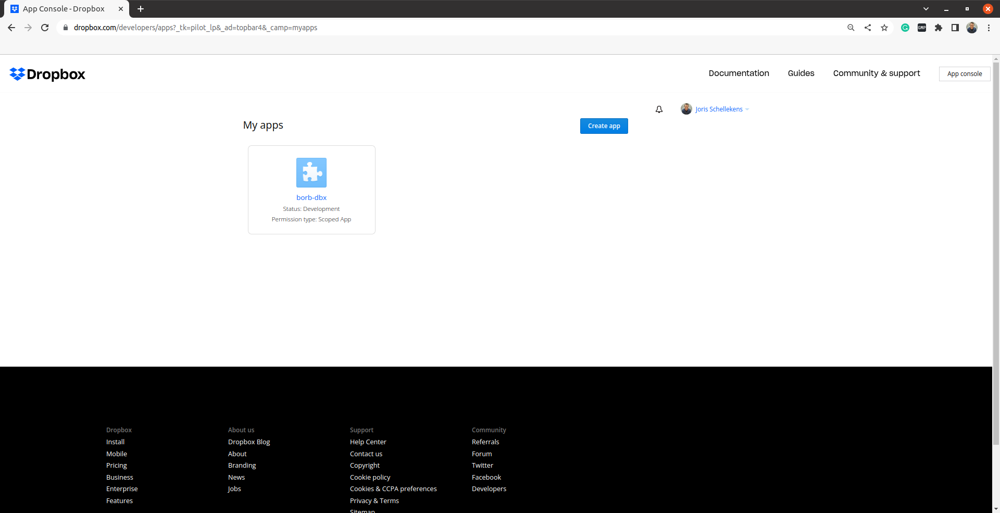
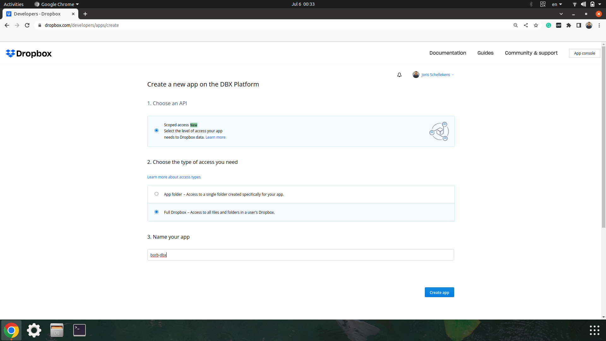
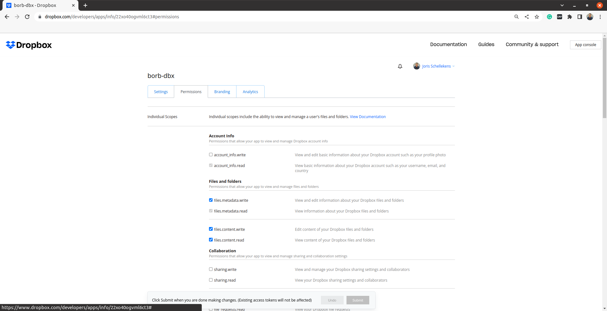
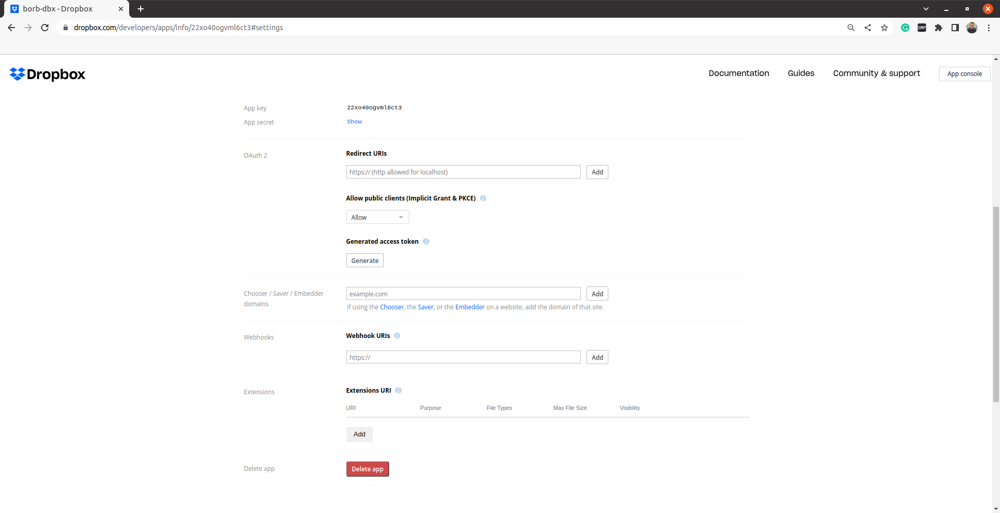
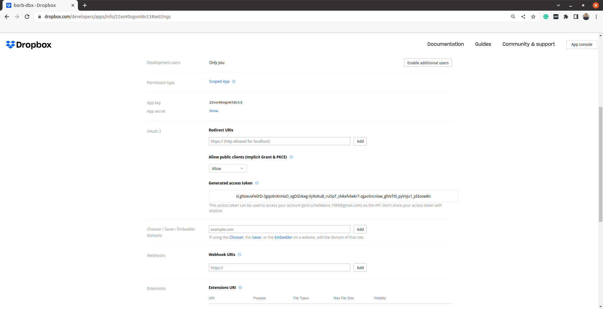
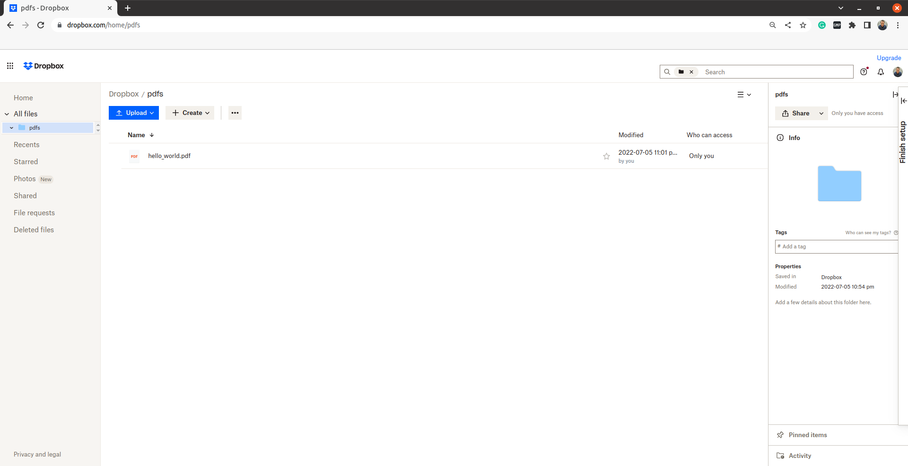

# 9 Showcases

In this chapter we'll build some practical PDF documents that are ready-to-use.
This chapter assumes you have a good working knowledge of all the basic `LayoutElement`  concepts.


<div style="page-break-before: always;"></div>

## 9.1 Building a sudoku puzzle

First let's define the representation of the sudoku.
This code does not need to be very high-performant, or solve a sudoku.
So for this example, representing a sudoku as a `str` will do fine.

```python
#!src/snippet_001.py
```

Next we're going to build a `Document` containing the basic information.

```python
#!src/snippet_002.py
```

We can render the sudoku in a `Document` by using a `FlexibleColumnWidthTable`

```python
#!src/snippet_003.py
```

Finally, we can store the `Document`

```python
#!src/snippet_004.py
```

That should yield a wonderful little puzzle in a PDF, like so:


## 9.2 Building a realistic invoice

```python
#!src/snippet_005.py
```

Since we don't want to deal with calculating coordinates - we can delegate this to a `PageLayout` which manages all of the content and its positions:

```python
#!src/snippet_006.py
```

Here, we're using a `SingleColumnLayout` since all of the content should be in a single column - we won't have a left and right side of the invoice. 
We're also making the vertical margin smaller here. The default value is to trim the top 10% of the page height as the margin, and we're reducing it down to 2%, since we'll want to use this space for the company logo/name.

Speaking of which, let's add the company logo to the layout:

```python
#!src/snippet_007.py
```

Here, we're adding an element to the layout - an `Image`. Through its constructor, we're adding a URL pointing to the image resource and setting its `width` and `height`.

Beneath the image, we'll want to add our imaginary company info (name, address, website, phone) as well as the invoice information (invoice number, date, due date).

A common format for brevity (which incidentally also makes the code cleaner) is to use a table to store invoice data. Let's create a separate helper method to build the invoice information in a table, which we can then use to simply add a table to the invoice in our main method:

```python
#!src/snippet_008.py
```

Here, we're making a simple `Table` with 5 rows and 3 columns. The rows correspond to the street address, city/state, phone, email address and company website. Each row will have `0..3` values (columns). Each text element is added as a `Paragraph`, which we've aligned to the right via `Alignment.RIGHT`, and accept styling arguments such as font.

Finally, we've added padding to all the cells to make sure we don't place the text awkwardly near the confounds of the cells.

Now, back in our main method, we can call `_build_invoice_information()` to populate a table and add it to our layout:

```python
#!src/snippet_009.py
```

Great! Now we'll want to add the billing and shipping information as well. It'll conveniently be placed in a table, just like the company information. For brevity's sake, we'll also opt to make a separate helper function to build this info, and then we can simply add it in our main method:

```python
#!src/snippet_010.py
```

Let's call this in the main method as well:

```python
#!src/snippet_011.py
```

With our basic information sorted out (company info and billing/shipping info) - we'll want to add an itemized description. These will be the goods/services that our supposed company offered to someone and are also typically done in a table-like fashion beneath the information we've already added.

Again, let's create a helper function that generates a table and populates it with data, which we can simply add to our layout later on.

We'll start by defining a Product class to represent a sold product. In practice, you'd substitute the hard-coded strings related to the subtotal, taxes and total prices with calculations of the actual prices - though, this heavily depends on the underlying implementation of your Product models, so we've added a stand-in for abstraction.

```python
#!src/snippet_012.py
```

Now we can build a method `_build_itemized_description_table` that will render these products and their prices to the PDF:

```python
#!src/snippet_013.py
```

Let's call this method with some dummy `Product` items:

```python
#!src/snippet_014.py
```

Finally, you can store the PDF to disk

```python
#!src/snippet_015.py
```

The final PDF should look somewhat like this:


## 9.3 Creating a stunning flyer

These are the steps to creating a PDF document using borb:

- Create an empty `Document`
- Create an empty `Page`
- Append the `Page` to the `Document`
- Set a `PageLayout` to handle the flow of content (we're using a `SingleColumnLayout` here)
- Add content (not shown here)
- Write the PDF to disk (not shown here)

```python
#!src/snippet_016.py
```

We'd like to add some geometric artwork to our flyer in the upper right corner. We're going to write a separate method to do that. Then we can later re-use this method (for instance on every `Page` in the `Document`).

```python
#!src/snippet_017.py
```

Now that we've defined this method, we can call it in the main body of our script to add the artwork to the PDF.

```python
#!src/snippet_018.py
```

Next we're going to add our company contact details, so people know where to reach us:

```python
#!src/snippet_019.py
```

Now we can add a few titles and subtitles and some promotional blurb;

```python
#!src/snippet_020.py
```

Images make things more visually interesting. Let's add an `Image` with some core product features next to it;

```python
#!src/snippet_021.py
```

Let's add a footer to the bottom of the page. We're going to put this in a separate method (so that we could call it later on, if we ever need to apply it to other pages in the PDF).

```python
#!src/snippet_022.py
```

Now we can call this method in the main body;

```python
#!src/snippet_023.py
```

The final PDF should look somewhat like this:


## 9.4 Creating a nonogram puzzle

Nonograms, also known as Hanjie, Paint by Numbers, Picross, Griddlers, and Pic-a-Pix, and by various other names, are picture logic puzzles in which cells in a grid must be colored or left blank according to numbers at the side of the grid to reveal a hidden picture. In this puzzle type, the numbers are a form of discrete tomography that measures how many unbroken lines of filled-in squares there are in any given row or column. For example, a clue of "4 8 3" would mean there are sets of four, eight, and three filled squares, in that order, with at least one blank square between successive sets.

We're going to define the final nonogram as a piece of ASCII art:

```python
#!src/snippet_025.py
```

Now we need to turn this into a set of horizontal and vertical clues. 
The following code does just that!

```python
#!src/snippet_026.py
```

For this PDF we're going to use a custom `Font`. Let's first download the `ttf`

```python
#!src/snippet_027.py
```

Now we can create a skeleton document containing our title and explanation blurb:

```python
#!src/snippet_028.py
```

We're going to represent the nonogram as a `Table`.
The following code builds a `FixedColumnWidthTable` from the clues we defined earlier.

We're going to start by defining a helper-method to build an empty `TableCell` object.

```python
#!src/snippet_029.py
```

And now we can get on with building the `Table`:

```python
#!src/snippet_030.py
```

Finally, we can store the `PDF`:

```python
#!src/snippet_031.py
```

That should look somewhat like this:


## 9.5 Building a working calculator inside a PDF

We are going to create a method to add some geometric artwork to the upper right corner of a `Page`. This code is not really doing difficult things, it just deals with coordinates and math a bit. 

```python
#!src/snippet_032.py
```

Similarly, I want to add some geometric artwork to the bottom of the page to balance things out a bit. I'm going to write another separate method for that.

```python
#!src/snippet_033.py
```

Now we're going to create a method that adds the image of a calculator to our `Page`. Here we are using absolute layout, since we want to make absolutely sure that our `Image` is located at the same coordinates every time (even if we were to change the text around it).

```python
#!src/snippet_034.py
```

Next up we will be adding a lot of "buttons" (they are actually annotations with associated javascript actions). To make it a bit easier on ourselves we'll separate this logic into its own method.

```python
#!src/snippet_035.py
```

Now we are ready to add all the buttons, and have them call our main Javascript (which will be inserted later on).

```python
#!src/snippet_036.py
```

This part is easy, we add document level Javascript to our PDF. This script has everything in it to make our calculator actually work.

```python
#!src/snippet_037.py
```

In order to display the result of the calculations, we need to add a `TextField` that the JavaScript can modify.

```python
#!src/snippet_038.py
```

Now we can build our `Document`

```python
#!src/snippet_039.py
```

Look at the stunning PDF you made:


## 9.7 Getting the raw bytes of a PDF

In this example we're going to use the `dropbox` API to store a PDF in the cloud.
To do this, we'll need to get the raw bytes of the PDF.

To run this code, you'll first need to create a new app in the dropbox developer portal.
This app will need to have the right permissions (the ability to create files).

Go to `dropbox.com/developers` and click `App Console`.
You should be directed to a page like this one:



Click `Create app`, you should now see something like this:



Now you need to give this app permission to write files (`files.content.write`).
You can do this by going to the `Permissions` tab and checking the box:



Back in the `Settings` tab, we can now click `Generate` under `Generate access token`:



After a small wait, an access token should appear:



Now we can get to the coding part! 
Let's start by setting up a connection to dropbox.

```python
#!src/snippet_040.py
```


Now we can build a simple "Hello World" document. 
I'm not going to go into the details of that here, since that's not really the point of this particular exercise.


```python
#!src/snippet_041.py
```


Finally, we can use the method `document_to_bytes` to obtain the raw bytes of the `Document`.
Once we have those, we just need to call the appropriate method of the `dropbox` API to store.


```python
#!src/snippet_042.py
```

That's it. You should now have a folder `pdfs` on your dropbox, containing a pdf `hello_world.pdf`.



## 9.6 Conclusion

This section was all about wrapping up your knowledge with some practical examples.
I hope you enjoyed working through the examples.